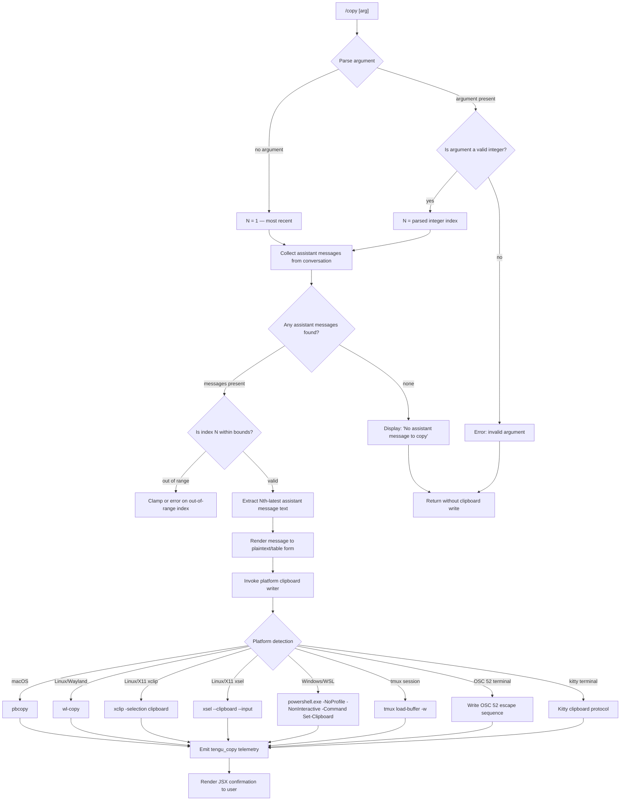

# `/copy`

> Analysis basis: CC v2.1.195 bundle.js (AST extraction + Claude interpretation)
> Minimum version: v2.1.195

---

## Overview

`/copy` copies Claude's most recent assistant response to the system clipboard. An optional numeric argument `N` allows the user to copy the Nth-latest assistant message instead of the most recent one. The command dispatches to a platform-aware clipboard subsystem that supports macOS, Linux (Wayland and X11), Windows/WSL, tmux buffers, OSC 52 terminal escape sequences, and other environments.

---

## Registration

| Field | Value |
|---|---|
| type | `local-jsx` |
| name | `copy` |
| description | `Copy Claude's last response to clipboard (or /copy N for the Nth-latest)` |
| loc_byte | `11467570` |
| loc_byte_end | `11467756` |
| loc_line | `7265` |
| module_id | `RDl` |
| load_inline | `true` |
| arbor_handler.name | `P0f` |
| arbor_handler.fqn | `claude-2.1.195::P0f` |
| arbor_handler.kind | `AsyncFunction` |
| arbor_handler.resolution_path | `module_id` |
| arbor_handler.n_hits | `0` |

Analysis basis: CC v2.1.195 bundle.js:+11467570

---

## Input Branching

The command has four distinct branches based on argument parsing and message availability, requiring a Mermaid flowchart.



---

## Behavioral Spec

### Top-Level Handler — `copyCommandHandler` (`P0f`)

The Arbor-resolved handler is the async function `P0f`. It is the authoritative entry point for `/copy`.

```
async function copyCommandHandler(context):
    rawArg = context.args.trim()

    // Collect assistant messages from current conversation
    messages = collectAssistantMessages(context)   // wDl

    if messages is empty:
        display "No assistant message to copy"     // literal: bundle.js:+11466795
        return earlyExit

    // Parse optional N argument
    if rawArg is not empty:
        n = Number(rawArg)                         // bundle.js:+11466864
        if not Number.isInteger(n):                // bundle.js:+11466878
            display argument error
            return earlyExit
    else:
        n = 1  // default: most recent

    // Retrieve the Nth-latest assistant message
    targetMessage = selectNthLatestMessage(messages, n)   // vDl: bundle.js:+11467108

    // Convert message content to clipboard-ready text
    plaintext = renderMessageToText(targetMessage)         // L0f: bundle.js:+11467120

    // Read configuration/settings
    settings = loadSettings()                              // Mt: bundle.js:+11467129

    // Write to system clipboard
    writeToClipboard(plaintext)                            // k1o: bundle.js:+11467262

    // Emit telemetry
    emit("tengu_copy")                                     // bundle.js:+11467173

    // Render JSX confirmation component
    return renderJSX(confirmation)                         // jQ.jsx: bundle.js:+11467297
```

Analysis basis: CC v2.1.195 bundle.js:+11466754

---

### Assistant Message Collection — `collectAssistantMessages` (`wDl`)

```
function collectAssistantMessages(conversationMessages):
    if not Array.isArray(conversationMessages):   // bundle.js:+11462831
        return []
    result = []
    for each message in conversationMessages:
        filtered = filterTextBlocks(message)      // Kl: bundle.js:+11462863
        if filtered has content:
            result.push(filtered)                 // bundle.js:+11462879
    return result
```

The filter function `Kl` retains only blocks whose type equals `"text"` (literal: bundle.js:+13980237), discarding tool-use blocks, image blocks, and other non-text content.

Analysis basis: CC v2.1.195 bundle.js:+11462831

---

### Nth-Latest Message Selection — `selectNthLatestMessage` (`vDl`)

```
function selectNthLatestMessage(messages, n):
    // Lex/tokenize message list
    tokenized = markdownLexer(messages)           // ug.lexer: bundle.js:+11462412

    // Find separator positions
    separatorIndex = tokenized.indexOf(separator) // bundle.js:+11462458

    // Build per-message table with optional table rendering (CDl)
    rendered = renderMessageTable(tokenized)      // CDl: bundle.js:+11462579

    // Select slice for the Nth-latest entry
    selected = rendered.slice(/* offset for n */) // bundle.js:+11462590

    return selected
```

Analysis basis: CC v2.1.195 bundle.js:+11462412

---

### Message-to-Text Renderer — `renderMessageToText` (`L0f`)

```
function renderMessageToText(messageContent):
    // Lex the content
    tokens = markdownLexer(messageContent)        // ug.lexer: bundle.js:+11461651

    // Process each token through plain-text normalization
    parts = []
    for each token in tokens:
        normalized = stripMarkdownSyntax(token)   // RPe: bundle.js:+11461660
        parts.push(normalized)                    // bundle.js:+11461716

    return parts.join("")
```

Code blocks are preserved with their content (literal `"code"`: bundle.js:+11461700). Plain-text output strips markdown decorators via `RPe` which applies `e.replace` (bundle.js:+13977728).

Analysis basis: CC v2.1.195 bundle.js:+11461651

---

### Table Rendering Helper — `renderMessageTable` (`CDl`)

When the message content contains pipe characters (`\|` literal: bundle.js:+11461954), the renderer formats it as an ASCII table with column alignment:

```
function renderMessageTable(rows):
    // Split on pipe separators
    columns = row.replace("\\|", ...)            // bundle.js:+11461938

    // Measure string widths using terminal-aware width
    widths = columns.map(col => stringWidth(col)) // rn / Bun.stringWidth: bundle.js:+218676
    maxWidth = Math.max(...widths, 3)            // literal 3: bundle.js:+11462013

    // Pad each cell with alignment
    // alignment values: "center", "right", "left"  (literals: +11462148, +11462186, +11462222)
    padded = columns.map(col => padCell(col, alignment))

    // Join with " | " separator (literal: bundle.js:+11462113)
    return padded.join(" | ")
```

The column separator literal `" | "` is at bundle.js:+11462113. Column count uses a minimum of `3` (bundle.js:+11462013). Padding is performed via a repeat-based function `Bf` that calls `e.repeat` (bundle.js:+203122) and guards with `Number.isFinite` (bundle.js:+203131).

Analysis basis: CC v2.1.195 bundle.js:+11461911

---

### Platform-Aware Clipboard Writer — `writeToClipboard` (`k1o`)

```
async function writeToClipboard(text):
    // Encode text
    encoded = encodeForClipboard(text)           // Tw: bundle.js:+11463178

    // Check for OSC 52 bug in this terminal
    hasOsc52Bug = terminalInfo.hasOsc52ClipboardUtf8Bug  // Y0n: bundle.js:+11463294
    if hasOsc52Bug:
        warn("VS Code 1.123/1.124 will mojibake this paste — update to ≥1.125")
        // literal: bundle.js:+3555120
        useOsc52Fallback(text)                   // q$d: bundle.js:+3555095

    // Prepare secure temp directory for intermediate files
    tmpDir = ensureSecureTempDir()               // xDl / VS: bundle.js:+11463317
    // Default temp base: "/tmp" (literal: bundle.js:+3409979)
    // Env override: CLAUDE_CODE_TMPDIR

    // Dispatch to platform writer
    platform = detectPlatform()
    switch platform:
        case "macos":                            // literal: bundle.js:+3556082
            spawn("pbcopy")                      // literal: bundle.js:+3556093
        case "linux" (Wayland):                  // literal: bundle.js:+3554772
            spawn("wl-copy")                     // literal: bundle.js:+3554851
        case "linux" (X11/xclip):
            spawn("xclip", ["-selection", "clipboard"])
            // literals: bundle.js:+3554920, +3556322
        case "linux" (X11/xsel):
            spawn("xsel", ["--clipboard", "--input"])
            // literals: bundle.js:+3554961, +3556322, +3556423
        case "wsl":                              // literal: bundle.js:+3556485
            spawn("powershell.exe", ["-NoProfile", "-NonInteractive", "-Command", ...])
            // literals: bundle.js:+3556495, +3556513, +3556526, +3556544
        case "windows":                          // literal: bundle.js:+3556574
            spawn("powershell", ...)             // literal: bundle.js:+3556588
        case "tmux":                             // literal: bundle.js:+3555340
            spawn("tmux", ["load-buffer", "-w"])
            // literals: bundle.js:+3555348, +3555362
        case "osc52":                            // literal: bundle.js:+3554733
            writeOsc52Escape(encoded)
        case "kitty":                            // literal: bundle.js:+3554313
            writeKittyClipboard(encoded)
        case "tmux-buffer":                      // literal: bundle.js:+3554713
            writeTmuxBuffer(encoded)
        case "screen":                           // literal: bundle.js:+3553844
            writeScreenClipboard(encoded)
        case "none":                             // literal: bundle.js:+3555846
            // no clipboard available — silent or warn
```

The clipboard encoding layer (`Tw`) uses `"utf8"` and `"base64"` encodings (literals: bundle.js:+3555657, +3555674). A 2000 ms timeout applies to spawned clipboard processes (literal: bundle.js:+3556059). The OSC 52 raw-mode variants `"raw+dcs"`, `"dcs"`, `"raw"` (literals: bundle.js:+3555772, +3555795, +3555801) are also handled. The `"unset"` state (literal: bundle.js:+3555314) causes a fallback selection. For X11 `xclip`, additional flags `"--primary"`, `"-selection"`, `"primary"` (literals: bundle.js:+3556259, +3556309, +3556363) are used for primary-selection writes. The `"--clipboard"` flag (bundle.js:+3556409) targets the clipboard selection.

Analysis basis: CC v2.1.195 bundle.js:+11463178

---

### Secure Temp Directory Setup — `ensureSecureTempDir` (`xDl` / `VS`)

```
function ensureSecureTempDir():
    base = env.CLAUDE_CODE_TMPDIR ?? "/tmp"      // literal: bundle.js:+3409979
    dir = path.join(base, subdir)

    // Validate ownership / permissions
    stat = lstatSync(dir)                        // zNi: bundle.js:+3410147
    if stat.isDirectory() is false:
        throw Error(...)
    if owner mismatch:
        // emit tempdir_owner_mismatch          // literal: bundle.js:+3410373
        throw Error("Set CLAUDE_CODE_TMPDIR to a directory you control, ...")
        // literal: bundle.js:+3410054
    chmodSync(dir, 448)                          // octal 0o700; literal: bundle.js:+3410773
    mkdir if needed                              // ADl.mkdir: bundle.js:+11463069

    return dir
```

Permissions `511` (octal 0o777) and `448` (octal 0o700) are referenced as boundary values (literals: bundle.js:+3410583, +3410773).

Analysis basis: CC v2.1.195 bundle.js:+11463035

---

### Settings Loader — `loadSettings` (`Mt`)

```
function loadSettings():
    configPath = resolveConfigPath()             // qt: bundle.js:+14067834
    store = getSettingsStore()                   // S0: bundle.js:+14067848
    migration = Mjo(...)                         // bundle.js:+14067867
    result = readConfigFile()                    // oTt: bundle.js:+14067871

    // Config access guard: throws if accessed before initialization
    // Error message literal: "Config accessed before allowed." bundle.js:+14071590

    // Read file as utf-8                        // literal: bundle.js:+14071673
    // Handle ENOENT gracefully                  // literal: bundle.js:+14071856

    timestamp = Date.now()                       // bundle.js:+14067924
    watchedConfig = setupConfigWatcher()         // Csm: bundle.js:+14067977

    return settings
```

On config parse error, the telemetry event `tengu_config_parse_error` is emitted (bundle.js:+14073004). Backup files are stored in a `"backups"` subdirectory (literal: bundle.js:+14071158). Known config fields include theme values `"dark"`, `"auto"`, `"normal"` (literals: bundle.js:+14063450, +14063479, +14063508) and a 60 000 ms (1-minute) polling interval (literal: bundle.js:+14063949).

Analysis basis: CC v2.1.195 bundle.js:+14067834

---

## State & Side Effects

| Item | Detail |
|---|---|
| Telemetry | `tengu_copy` (bundle.js:+11467173) — fired on every successful copy operation |
| Telemetry | `tengu_config_parse_error` (bundle.js:+14073004) — fired when settings file is malformed |
| Telemetry | `tengu_daemon_control` (bundle.js:+17924594) — fired by daemon-adjacent utilities reachable through the call graph |
| Clipboard write | Writes text to the system clipboard via a platform-specific subprocess or terminal escape sequence; no persistent file written to disk in normal flow |
| Temp directory | A secure temp directory under `/tmp` (or `CLAUDE_CODE_TMPDIR`) is ensured and chmod'd to `0o700` when needed for clipboard intermediary files |
| Config watcher | `loadSettings` (`Mt`) registers a file watcher (`CTs.watchFile`) on the config file; the watcher is cleaned up via `Jcc.unwatchFile` |
| appState changes | None observed in depth-2 traversal |
| Sound | None observed in depth-2 traversal |
| Hook registration | `vi` calls `krs.register` (bundle.js:+68053) — likely a cleanup / lifecycle hook registered during settings initialization |

---

## Version History

| Version | Change |
|---|---|
| v2.1.195 | Initial analysis |

---

## Common Mistakes

1. **Passing a non-integer argument**: `/copy 2.5` or `/copy foo` will fail the `Number.isInteger` check (bundle.js:+11466878) and produce an error rather than selecting a message.
2. **Invoking `/copy` when no assistant messages exist**: If the conversation has produced no assistant-role messages, the command exits early with "No assistant message to copy" (bundle.js:+11466795) and nothing is written to the clipboard.
3. **Passing an out-of-range index**: Requesting `/copy 99` in a short conversation will yield no content because the slice operation in `selectNthLatestMessage` (`vDl`) will return an empty result.
4. **Clipboard tool not installed on Linux**: On X11 systems without `xclip` or `xsel`, the command will be unable to write to the clipboard. Install at least one of these tools, or use a Wayland compositor with `wl-copy`.
5. **Running in VS Code terminal 1.123–1.124**: The OSC 52 UTF-8 bug check (`Y0n`, bundle.js:+11463294) will emit a warning that pasted content may be corrupted. Upgrade VS Code to ≥ 1.125 to resolve.
6. **Assuming `/copy` captures tool output or images**: The `Kl` filter (bundle.js:+11462863) retains only `"text"`-typed content blocks. Tool results, images, and other block types are silently excluded from the clipboard payload.

---

## Appendix — Identifier Mapping

> For bundle debugging only. Identifiers change across versions.

| Identifier | Role |
|---|---|
| `P0f` | Top-level async handler for `/copy` command (Arbor-resolved entry point) |
| `wDl` | Assistant message collection — filters conversation for assistant-role entries |
| `Kl` | Text-block filter — retains only `"text"` typed content blocks |
| `vDl` | Nth-latest message selector — tokenizes messages and slices by index |
| `L0f` | Message-to-plaintext renderer — lexes and strips markdown |
| `CDl` | Table renderer — formats pipe-delimited content as aligned ASCII table |
| `x0f` | Row mapping helper used inside table renderer |
| `LDl` | String replacement utility used in text normalization |
| `RPe` | Markdown syntax stripper (applies `e.replace`) |
| `ug` | Markdown lexer wrapper |
| `rn` | Terminal string width measurement (wraps `Bun.stringWidth`) |
| `Bf` | Cell padding helper (uses `e.repeat` and `Number.isFinite`) |
| `k1o` | Platform-aware clipboard writer dispatcher |
| `Tw` | Clipboard encoding layer (utf8 / base64) |
| `YUt` | Clipboard encoding helper (fH) |
| `WFi` | Platform clipboard write executor |
| `Mn` | Subprocess spawner for clipboard tools |
| `j7r` | Linux clipboard tool selector (xclip / xsel / wl-copy) |
| `K$d` | Clipboard method selector (tmux / osc52 / native) |
| `W7r` | Screen terminal clipboard helper |
| `JUt` | Encoding dispatcher |
| `ex` | Escape-sequence writer (replaces control chars) |
| `QE` | Join helper for encoded clipboard payload |
| `GFi` | kitty terminal clipboard writer |
| `Y0n` | OSC 52 UTF-8 bug detector |
| `q$d` | OSC 52 fallback writer |
| `hu` | Index-of utility used in clipboard dispatch |
| `xDl` | Secure temp directory setup for clipboard intermediary |
| `VS` | Temp directory creator and validator |
| `zNi` | Temp directory ownership and permission checker |
| `LF` | Path joiner utility |
| `l0r` | Atomic file write utility (rename-based, with chmod and fsync) |
| `Cn` | Error handler wrapper |
| `ZZe` | fsync error suppressor (EINVAL / ENOTSUP / EPERM / ENOSYS) |
| `lAs` | Object.defineProperty utility used in atomic write |
| `Mt` | Settings loader (reads config file, sets up watcher) |
| `oTt` | Config file reader (readFileSync, backup management) |
| `Ojo` | Config backup directory resolver |
| `Ujo` | Backup path joiner |
| `Csm` | Config file watcher setup / teardown |
| `hRt` | File watch initiator (CTs.watchFile) |
| `xe` | File watcher event handler |
| `vi` | Lifecycle hook registrar (krs.register) |
| `T` | Config value serialiser / log sanitiser (redacts sensitive fields) |
| `RYc` | Config writer |
| `Lc` | Sensitive-key redactor (replaces with `[REDACTED]`) |
| `jXe` | Config validation helper |
| `PYc` | Config file write-to-disk helper (Buffer.byteLength, win-style) |
| `LZl` | Daemon status reader (reads `daemon.status.json`) |
| `Hte` | Daemon status parser |
| `THe` | Daemon response trimmer (trim, 1000 ms timeout literal) |
| `Vs` | AsyncLocalStorage store accessor (`Nld.getStore`) |
| `WXt` | Daemon status path builder (`wZl.join`) |
| `Me` | JSON serialiser helper (`JSON.stringify`) |
| `Bt` | JSON parser helper (`JSON.parse`) |
| `v5` | String prefix stripper (`startsWith` / `slice`) |
| `on` | Error constructor helper |
| `Cs` | Process exit handler |
| `age` | Spend/billing response handler |
| `yn` | String replacement utility |
| `n` | Column text normaliser (`i.toLowerCase`) |
| `i` | Session close handler |
| `r` | Session registry |
| `s` | Session add/delete tracker |
| `o` | Column pad helper (`padEnd`) |
| `a` | HTTP response builder |
| `c` | Pattern replace wrapper |
| `e` | General-purpose string / array utility |
| `m` | File change filter |
| `thr` | Path prefix stripper |
| `k` | File watcher with interval |
| `W` | Utility referenced in handler and settings |
| `qt` | Config path resolver |
| `Mjo` | Config migration helper |
| `S0` | Settings store accessor |
| `xme` | Config change notifier |

---

Note: index built via Arbor fallback; some signals (telemetry, literals) may be missing — see arbor-fallback.js.