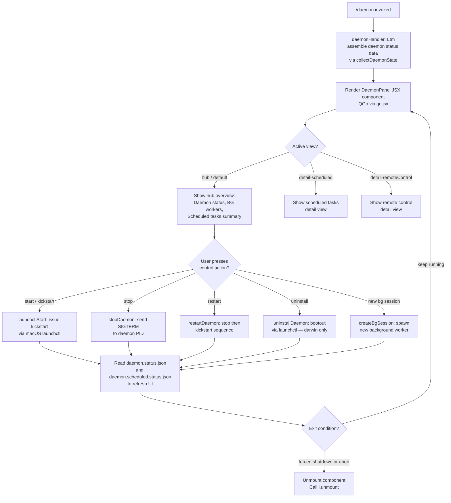

# `/daemon`

> Analysis basis: CC v2.1.196 bundle.js (AST extraction + Claude interpretation)
> Minimum version: v2.1.196

---

## Overview

The `/daemon` command provides an interactive management interface for Claude Code's background daemon process and its associated background services. It renders a JSX-based UI that allows the user to inspect daemon status, control the lifecycle (start, stop, restart, uninstall), monitor background worker sessions, and view scheduled task state. The command is registered as a `local-jsx` type, meaning it renders its own React/Ink component tree directly in the terminal rather than delegating to the agent pipeline.

---

## Registration

| Field | Value |
|---|---|
| type | `local-jsx` |
| name | `daemon` |
| description | `Manage background services and routines` |
| loc_byte | `13362115` |
| loc_byte_end | `13362283` |
| loc_line | `9170` |
| immediate | `true` |
| module_id | `ZGo` |
| load_inline | `true` |
| arbor_handler.name | `Ltm` |
| arbor_handler.fqn | `claude-2.1.196::Ltm` |
| arbor_handler.kind | `AsyncFunction` |
| arbor_handler.resolution_path | `module_id` |
| arbor_handler.n_hits | `0` |

Analysis basis: CC v2.1.196 bundle.js:+13362115

The handler `Ltm` was resolved by following `module_id → ZGo → moduleExports → Ltm`. Because the callGraph opens with the synthetic node `Ntm` (a BFS bookkeeping entry) alongside `Ltm`, the Arbor-resolved name `Ltm` is treated as authoritative per the writing rules.

---

## Input Branching

The `/daemon` command does not accept freeform text arguments — its behavior is driven by interactive sub-view selection inside the rendered component. The component (`QGo`, described below as the DaemonPanel component) has six or more distinct internal branches based on the active view key and daemon control action. A Mermaid flowchart is therefore used.



Analysis basis: CC v2.1.196 bundle.js:+13351965, +13352097, +13352340, +13352490, +13352743

---

## Behavioral Spec

### 1. Top-level Handler — `daemonHandler` (`Ltm`)

`Ltm` is an `AsyncFunction` resolved via `module_id: ZGo`.

```
async function daemonHandler(context):
    statusData = await collectDaemonState()   // XGo
    render DaemonPanel component(statusData)  // qc.jsx, QGo
    attach lifecycle listener Lic             // Kke → Xut
```

Analysis basis: CC v2.1.196 bundle.js:+13351965 (`Ltm → XGo`), +13351978 (`Ltm → qc.jsx`), +13352017 (`Ltm → Lic`)

---

### 2. Collect Daemon State — `collectDaemonState` (`XGo`)

Runs several sub-operations in parallel using `Promise.all`, then reconciles results.

```
async function collectDaemonState():
    [pidfileInfo, scheduledStatus, bgRoster, remoteStatus, workerList] =
        await Promise.all([
            readPidFile(),           // $Ne
            readScheduledStatus(),   // xsc  → daemon.scheduled.status.json
            readBgRoster(),          // bic  → roster.json
            readDaemonStatus(),      // noc  → daemon.status.json
            listWorkerSockets(),     // hic  → daemon.json per worker dir
        ])

    killStaleSocketFiles()           // hR (called inline within XGo)
    resolve = Promise.resolve(...)

    keys = Object.keys(workerList)
    return assembled state object
```

Analysis basis: CC v2.1.196 bundle.js:+13351524 (`$Ne`), +13351552 (`Promise.all`), +13351565 (`bic`), +13351571 (`hic`), +13351598 (`noc`), +13351620 (`xsc`), +13351642 (`D4`), +13351660 (`wZ`), +13351665 (`Promise.resolve`), +13351760 (`Object.keys`)

---

### 3. Read Background Roster — `readBgRoster` (`bic`)

Reads the `roster.json` file that tracks all background session entries.

```
async function readBgRoster():
    [rosterEntries, errorInfo] = await Promise.all([
        parseScheduledEntries(),    // STt → Q6o
        errorLogger(),              // Re
    ])
    pidFileStatus = await killStalePids()   // hR
    return { rosterEntries, pidFileStatus }
```

- File read is UTF-8 encoded (literal `"utf8"` at bundle.js:+13164717).
- Maximum file size guard: 1,048,576 bytes (bundle.js:+13164598).
- File is parsed as JSON (`JSON.parse`) and validated via `Array.isArray`.
- If the path does not exist, `ENOENT` is silently handled (literal at +13338219).

Analysis basis: CC v2.1.196 bundle.js:+13346351 (`bic → Promise.all`), +13346364 (`STt`), +13346382 (`Re`), +13346393 (`hR`)

---

### 4. Parse Scheduled Entries — `parseScheduledEntries` (`STt`)

```
async function parseScheduledEntries(rosterPath):
    rawEntries = await readRosterFile(rosterPath)   // Q6o
    filtered = filterByType(rawEntries, "scheduled") // vGo — checks Array.isArray
    normalized = normalizeEntries(filtered)          // IGo
    results.push(normalized)                         // r.push
    return results
```

- The string `"scheduled"` (bundle.js:+13259112) is used as the type discriminator when filtering entries from the roster.

Analysis basis: CC v2.1.196 bundle.js:+13259100 (`Q6o`), +13259144 (`vGo`), +13259184 (`IGo`), +13259216 (`r.push`)

---

### 5. Kill Stale PID / Socket Files — `killStalePids` (`hR`)

```
async function killStalePids(socketDir):
    fileInfo = await readPidFile()       // Qse
    if fileInfo.isFile():
        pid = parsePidFromFile(fileInfo) // l2o → readFile → split → slice
        try:
            process.kill(pid, 0)         // existence check
        except:
            remove stale socket/pid file // Qse → y1.rm
    spawnNewProcess()                    // TI → ik
```

- Reads the `daemon.json` file (literal at bundle.js:+11878288) to obtain the running PID.
- Searches for the string `"claude daemon"` (bundle.js:+11877714) in process list, taking slice index `4` (bundle.js:+11877741) and filtering by the string `"daemon"` (bundle.js:+11877753).
- If the PID file is not a regular file (65,536-byte flag at bundle.js:+11876789), it is deleted with `y1.rm`.

Analysis basis: CC v2.1.196 bundle.js:+11877795 (`Qse`), +11877823 (`process.kill`), +11877873 (`l2o`), +11877906 (`TI`)

---

### 6. Read Daemon Status File — `readDaemonStatus` (`noc`)

```
async function readDaemonStatus():
    appStore = getAppStore()          // Ks → Mfd.getStore
    statusPath = buildPath()          // HZt → join "daemon.status.json"
    content = await readFile(statusPath) // Ua
    try:
        process.kill(pid, 0)
    catch:
        handle missing daemon
    spawn = TI(...)
    return parsed status
```

- Status file name: `"daemon.status.json"` (bundle.js:+13163777).
- Path is constructed via `Zn` (path join helper) at bundle.js:+13163772.

Analysis basis: CC v2.1.196 bundle.js:+13164064 (`Ks`), +13164074 (`HZt`), +13164261 (`process.kill`), +13164396 (`TI`)

---

### 7. Read Scheduled Status File — `readScheduledStatus` (`xsc`)

```
async function readScheduledStatus():
    path = buildScheduledPath()       // Lsc → join "daemon.scheduled.status.json"
    content = await readFile(path)    // Csc.readFile
    parsed = parseStatus(content)     // Ua
    if pid alive:
        process.kill(pid, 0)
    else:
        TI(...)
    return parsed
```

- File name: `"daemon.scheduled.status.json"` (bundle.js:+13257606).

Analysis basis: CC v2.1.196 bundle.js:+13257814 (`Csc.readFile`), +13257827 (`Lsc`), +13258013 (`process.kill`), +13258069 (`TI`)

---

### 8. List Worker Sockets — `listWorkerSockets` (`hic`)

```
async function listWorkerSockets(socketBaseDir):
    stat = await checkSocketDir()     // TYe → mic.stat
    if error.code == "ENOENT":
        return Promise.reject(...)

    if stat.isFile():
        // unexpected — directory expected
        reject

    appCtx = getAppContext()          // Ks
    socketKind = resolveSocketKind()  // zGo → KGo
    formatted = buildTable()          // he, Ua, KGo, Object.keys, o.has
    paths = await getSocketPaths()    // sj → c2o.join, Zn
    killed = await killStaleSockets() // hR
    mapped = paths.map(...)
    names = paths.map(nIe.basename)
    return { formatted, names }
```

- Socket kind is resolved to `"same-dir"` (bundle.js:+13340146) for path computation.
- The `nIe.basename` call extracts the base directory names for display.

Analysis basis: CC v2.1.196 bundle.js:+13339979 (`TYe`), +13339983 (`sj`), +13340048 (`hR`), +13340067 (`t.map`), +13340103 (`nIe.basename`)

---

### 9. Read Roster File Detail — `readRosterFile` (`D4`)

This function handles reading and validating the `roster.json` file with rotation logic.

```
async function readRosterFile(rosterPath):
    stat = await lstat(rosterPath)        // Hme.lstat
    rosterFilePath = buildRosterPath()    // Zse → Qg.join "roster.json"
    if not stat.isFile():
        logError("is not a regular file — removing")
        runErrorReporter(Re, Error)
        await Hme.rm(rosterPath)
        return empty

    raw = await Hme.readFile(rosterPath)
    text = decode(raw)                     // Sn
    merged = mergeWithDefaults(text)       // Uo → Object.assign

    try:
        parsed = JSON.parse(text)         // Gt
    catch:
        logError("bg roster.json read/parse failed")
        send telemetry: tengu_bg_roster_parse_failed

    if Array.isArray(parsed):
        filtered = validateEntries(parsed) // s3l → Array.isArray, Object.keys
    else:
        return []

    // Check for oversized entries
    if M2f.has(entryKey):
        String(entry)
        statusMapper(Mo)

    // If backup rotation needed
    await Eor(rename, timestamp)          // Eor → Hme.rename, Date.now

    return filtered
```

- File: `"roster.json"` (bundle.js:+11885233).
- Error codes `"E2BIG"` (bundle.js:+11889670) and `"EFTYPE"` (bundle.js:+11889682) are special-cased.
- Parse failure emits `tengu_bg_roster_parse_failed` (bundle.js:+11889590).
- Error string `"bg roster.json read/parse failed"` (bundle.js:+11889912).
- Error string `"is not a regular file — removing"` (bundle.js:+11889544).

Analysis basis: CC v2.1.196 bundle.js:+11889397 (`Hme.lstat`), +11889459 (`Re`), +11889727 (`Hme.rm`), +11889827 (`Hme.readFile`), +11889867 (`Sn`), +11889903 (`Uo`), +11890179 (`s3l`)

---

### 10. DaemonPanel Component — `DaemonPanel` (`QGo`)

The central React/Ink component that renders all daemon management UI.

```
function DaemonPanel(props):
    [viewState, setViewState] = useState(...)   // cz.useState
    clockCtx = useClock()                       // Rs → X8i.useContext
    startTime = Date.now()
    nowMs = s.now()

    statusData = await collectDaemonState()     // XGo
    controlRef = useRef(...)                    // cz.useRef
    timerHandle = Wc(...)                       // Wc → VV.useRef, useMemo, useSyncExternalStore

    // Background session lifecycle
    bgSessions = l(...)                         // eoc → Zte, HZt

    // Kill all sessions
    killAll = H(...)                            // H → o.values, P.kill

    // MCP connection state watcher
    mcpWatcher = m(...)                         // m → XHr, Array.isArray

    // Main background worker heartbeat loop
    workerLoop = k(...)                         // k → clearInterval, hXo, setInterval

    // File watcher for socket directory
    fsWatcher = O.watch(...)                    // O.watch

    // Daemon process host
    daemonHost = h(...)                         // h → On, bns, _ns, hz.spawn

    // Lifecycle sub-tabs
    launchctlStatus = vAt(...)                  // vAt → p2o, Pn, por
    serviceControl = yXt(...)                   // yXt → f2o, Pn, por

    // Connection management
    connManager = u(...)                        // u → xe, ke, $F, Wj

    // Render JSX tree
    return jsx(
        view == "hub"               => HubView(daemonStatus, bgSessions, workerLoop),
        view == "detail-scheduled"  => ScheduledView(scheduledStatus),
        view == "detail-remoteControl" => RemoteControlView(mcpWatcher),
    )

    // Shutdown path
    p = abort handler:
        nI()
        process.exit() or u.abort()
        // "forced shutdown" literal at +18029485
```

- View key `"hub"` (bundle.js:+13352224) is the default landing view.
- View key `"detail-scheduled"` (bundle.js:+13352717) shows the scheduled tasks panel.
- View key `"detail-remoteControl"` (bundle.js:+13352857) shows the remote control panel.
- The string `"uninstall"` (bundle.js:+13352528) appears as a sub-action key.
- Section labels found in literals: `"Scheduled"` (+13353247), `"Remote Control"` (+13353533), `"Claude daemon"` (+13353807).
- The string `"permission"` (+13353895) is used for a permission warning sub-section.
- Background session entries carry the label `"background session"` (bundle.js:+18033040).

Analysis basis: CC v2.1.196 bundle.js:+13352097, +13352114, +13352146, +13352340, +13352357, +13352370, +13352381, +13352427, +13352490, +13352496, +13352548, +13352579, +13352682, +13352743

---

### 11. Background Worker Heartbeat Loop — `workerHeartbeatLoop` (`k`)

A `setInterval`-based supervisor loop that manages background worker processes.

```
function workerHeartbeatLoop(workers, config):
    clearInterval(existing)
    initialRun = await hXo(workers)   // hXo → ZNc (lock), tUc (write), mrn (cleanup)
    mrn(workers)

    intervalId = setInterval(async () =>
        token = T(...)                // token string
        String(pid)
        D(writer)                     // D → d.write transient signal
        FEe = buildPath(MUn.join)     // FEe
        fileWatcher = O.watch(dir)
        I.on("event", handler)        // I → A, M (request handler)
        h.clear()                     // h → j.kill, On, bns
    , interval)

    return intervalId
```

- Uses `setInterval` / `clearInterval` for the loop (bundle.js:+16999439, +16999273).
- Emits `tengu_daemon_bg_session_create` when a new background session is created (bundle.js:+17993828).
- The worker dispatcher emits `tengu_bg_dispatch_sigkill_escalate` when SIGKILL escalation is needed (bundle.js:+17993512).
- Stale session handling emits `tengu_bg_dispatch_low_mem` (bundle.js:+17994102).

Analysis basis: CC v2.1.196 bundle.js:+16999273, +16999318, +16999348, +16999383, +16999417, +16999439, +16999553, +16999601, +16999621, +16999630, +16999742, +16999905

---

### 12. Background Sweep Orchestrator — `bgSweepOrchestrator` (`O`)

The `O.watch` watcher and its callback form a sweep loop for background worker management:

```
function bgSweepOrchestrator(workers):
    on("change", async () =>
        now = Date.now()
        for worker in B.values():
            worker.shiftGraceClocksForward()   // X.shiftGraceClocksForward

        // Memory pressure check
        memFree = CYe(Fac.freemem)             // CYe → macos / Lrm
        Bac(status)                             // Bac → it
        N6e(pidFile)                            // N6e → ST.lstat, readFile, filter

        for worker in workers:
            if not q.has(worker):
                worker.respawnIfIdleStale()     // X.respawnIfIdleStale
            await Promise.all([...])
            worker.retireIfSettled()            // X.retireIfSettled
            $n(state)

        // Low-memory last-resort
        if lowMemoryPersists:
            log "bg: low memory persists after shedding non-pinned — retiring pinned settled workers as a last resort"
            emit tengu_bg_retire_pinned_low_mem
            ee.retireIfSettled()

        // Prewarm preallocation
        ycr(it)
        it(C$t, v$t, P6)
        // prewarm count: min 3, max 12 (bundle.js:+17998876, +17998882)
        emit tengu_bg_prewarm_per_sweep

        // Spawn spare if needed
        se.respawnIfIdleStale()
    )
```

- Low-memory log message literal: `"bg: low memory persists after shedding non-pinned — retiring pinned settled workers as a last resort"` (bundle.js:+17998611).
- Prewarm min: `3`, max: `12` (bundle.js:+17998876, +17998882).
- Emits `tengu_bg_prewarm_per_sweep` (bundle.js:+17998847).
- Emits `tengu_bg_retire_pinned_low_mem` (bundle.js:+17998722).

Analysis basis: CC v2.1.196 bundle.js:+17998100, +17998148, +17998159, +17998205, +17998231, +17998245, +17998263, +17998306, +17998330, +17998386, +17998423, +17998500

---

### 13. Daemon Host / Spawn — `daemonHost` (`h`)

Manages the lifecycle of an individual background worker subprocess.

```
async function daemonHost(config):
    existing = o.get(workerId)
    if existing and "closed":
        // grace period: 30s max, 15s min
        j.kill(existing)     // SIGKILL if needed
        On(abortSignal)

    h(self)                  // recursive reference
    e = build new session entry

    ke(sessionEntry)
    xe(sessionEntry)
    CYe(memCheck)
    memory = Math.round(Mqc.freemem())
    N6e(pidFile)             // read PID file

    Re(errorReporter)
    o.values(workerMap)
    z.retireIfSettled()      // retire workers

    it(telemetryStore)
    _ns(socketAuth)          // connect via H_r.connect
    o.set(id, workerHandle)
    bns(bgSessionRunner)     // full session lifecycle

    g(cleanup)
    rn(log)
    Oe(featureCheck)         // tengu_feature_ok / tengu_feature_bad
    Y.dispose()
    hz.spawn(newProcess)
```

- Grace kill sequence: 30s timeout (bundle.js:+17993467), 15s fallback (bundle.js:+17993478), `"SIGKILL"` (bundle.js:+17993560).
- Worker restart retry cap: 100 attempts (bundle.js:+17993587).
- Telemetry `tengu_daemon_bg_session_create` (bundle.js:+17993828).
- Duplicate-retry-exhausted state: literal `"dup_retry_exhausted"` (bundle.js:+17993855).
- Drop state: `"dropped"` (bundle.js:+17993878).
- The string `"SIGTERM"` is sent first (bundle.js:+17995442) before escalating to SIGKILL.

Analysis basis: CC v2.1.196 bundle.js:+17993394, +17993467, +17993478, +17993512, +17993553, +17993560, +17993584, +17993828, +17993855, +17993878, +17993926

---

### 14. Background Session Runner — `bgSessionRunner` (`bns`)

Manages full lifecycle of an individual background worker session including file creation, MCP handshake, and cleanup.

```
async function bgSessionRunner(workerConfig):
    r.add(taskToken)
    try:
        socket = Rp.access(socketPath)   // state.json at +18001089
        // State transitions:
        //   "working" → "active" → "bg" → "done" → "killed" → "crashed" → "blocked"
        //   "resuming" (+18002939)

        mc(mcpConfig)
        s(sessionState)
        Rp.rm(...)

        Re(errorReporter)
        V(...)

        Ar(arouter)
        Yi(yieldHandler)
        Kh(killHandler)

        Rp.access(Tns.join(...))
        rn(logger)

        wRe(workResult)
        zd(zeroDown)
        kAt(keepAlive)
        Rp.unlink(lockFile)
        AXt(auxTask)
        t.rosterEntry = updatedEntry
        jt(statusWriter)
        _Te(teardown)
        oM(outputManager)
        HR(handoffReporter)
        tP(taskPoller)
        xZ(exitZeroer)
        SXt(statusXform)

        n(sessionNode)
        setTimeout(cleanup, 300000)   // 5-minute cleanup timeout (+18002725)
        p.get / p.delete cleanup
        e.delete(sessionId)
    finally:
        r.delete(taskToken)
```

- Cleanup timeout: 300,000 ms (5 minutes) (bundle.js:+18002725).
- State labels found: `"done"` (+18000596), `"killed"` (+18000614), `"crashed"` (+18000885), `"blocked"` (+18000939), `"working"` (+18001253), `"active"` (+18001279), `"bg"` (+18001417), `"windows"` (+18002124), `"resuming"` (+18002939).
- The `"state.json"` file (bundle.js:+18001089) tracks live session state on disk.
- Emits `tengu_bg_handoff_settle` (bundle.js:+18000778).

Analysis basis: CC v2.1.196 bundle.js:+18000460, +18000469, +18000483, +18000524, +18000571, +18000596, +18000614, +18000684, +18000730, +18000776, +18000818

---

### 15. macOS LaunchAgent Control — `launchctlControl` (`wZ`, `vAt`, `yXt`)

```
// Query launchctl status
function queryLaunchctl():
    result = Pn(execFileNoThrow)       // Pn → Gr
    args = ["launchctl", "print", ...]
    timeout = 5000ms                   // +11881923
    return result

// Uninstall (darwin only)
async function uninstallService(vAt):
    homedir = p2o()                    // HXt.join, u2o.homedir → ~/Library/LaunchAgents
    Pn(execFileNoThrow, "bootout")     // literal "bootout" at +11880374
    por(uid)                           // KBl → process.getuid
    vZ.unlink(plistPath)
    Sn(decode)
    he(format)
    // "service uninstall not available on darwin" at +11880505

// Service start / stop / restart (yXt → f2o)
async function serviceLifecycle(action):
    por(uid)                           // process.getuid
    Pn(execFileNoThrow)
    action in ["start"/"kickstart", "stop", "restart"] // +11880725/736, +11880761, +11880801
    qBl.setTimeout(callback, 50*attempt)  // +11881029

    // Restart guard:
    // "daemon did not exit within 10s of SIGTERM; restart aborted before kickstart"
    //   at +11881058
```

- LaunchAgent plist path: `~/Library/LaunchAgents` (literals `"Library"` at +11878603, `"LaunchAgents"` at +11878613).
- `launchctl` subcommands: `"print"` (+11881889), `"kickstart"` (+11880736), `"bootout"` (+11880374).
- Restart timeout guard: 10 s (mentioned in literal at +11881058).
- Backoff: 50 ms × attempt count (bundle.js:+11881029).
- Only supported on `"darwin"` (bundle.js:+11881384).

Analysis basis: CC v2.1.196 bundle.js:+11881873, +11881876, +11881889, +11881897, +11881923

---

### 16. Lifecycle Listener — `lifecycleListener` (`Lic`)

Attaches key-binding and rendering hooks for the command's interactive session.

```
function lifecycleListener(inkInstance, shutdownSignal):
    Kke(keybindingHandler)   // Kke → Xut → gfp, hfp, Bua, SH, jo, ...
    // Handles: model selection display, key routing, readline events
```

Analysis basis: CC v2.1.196 bundle.js:+13351851

---

### 17. Daemon Yield / Config Reload — inline in supervisor dispatcher (`D`, `d`)

```
// Transient yield signal (D → d.write)
function writeTransientSignal(writer):
    d.write("transient")      // literal at +18015178
    log "yielding to a foreground/service daemon — bg workers will be re-adopted"
    emit tengu_daemon_yield   // +18015313

// Config reload (via d.updateConfig)
function handleConfigReload():
    d.stop()
    d.updateConfig(newConfig)
    d.start()
    emit tengu_daemon_config_reload  // +18010884
```

- Yield message literal: `"yielding to a foreground/service daemon — bg workers will be re-adopted"` (bundle.js:+18015231).
- Role label `"supervisor"` (bundle.js:+18010091).

Analysis basis: CC v2.1.196 bundle.js:+18010884, +18015178, +18015231, +18015313

---

### 18. Daemon Stop — `daemonStopHandler` (`u` → `xe`, `ke`, `$F`, `Wj`)

```
async function daemonStopHandler():
    xe(featureCheck)         // tengu_feature_ok
    ke(featureCheck)         // tengu_feature_bad
    emit tengu_daemon_control at +18033163

    $F(eventBus)             // D6 → q3, ZY.push, u5e → ix, V7r → randomUUID, emit
    Wj(shutdownOrchestrator):
        Promise.race([
            Promise.all([rye(shutdown), pye(clearTimeout)])
            On(timeoutAbort, 500ms)   // +18028222
        ])
        process.exit()
```

- `"daemon_stop"` literal (bundle.js:+18033088) and `"daemon_stop_failed"` (bundle.js:+18033125) are the two outcome strings for the stop action.
- Shutdown race timeout: 500 ms (bundle.js:+18028222).
- Emits `tengu_daemon_control` (bundle.js:+18033163).

Analysis basis: CC v2.1.196 bundle.js:+18033088, +18033125, +18033163, +18028178, +18028192, +18028222, +18028261

---

## State & Side Effects

| Item | Detail |
|---|---|
| Telemetry — `tengu_bg_roster_parse_failed` | Fired when `roster.json` cannot be parsed (bundle.js:+11889590) |
| Telemetry — `tengu_feature_ok` | Feature gate passed (bundle.js:+1028610) |
| Telemetry — `tengu_feature_bad` | Feature gate failed (bundle.js:+1028677) |
| Telemetry — `tengu_daemon_control` | Daemon control action taken (bundle.js:+18033163) |
| Telemetry — `tengu_daemon_config_reload` | Daemon config reloaded (bundle.js:+18010884) |
| Telemetry — `tengu_daemon_yield` | Daemon yielded to foreground (bundle.js:+18015313) |
| Telemetry — `tengu_voice_circuit_breaker_tripped` | Voice circuit breaker triggered (bundle.js:+15092363) |
| Telemetry — `tengu_voice_recording_started` | Voice recording started (bundle.js:+15093930) |
| Telemetry — `tengu_voice_stream_early_retry` | Voice stream early retry (bundle.js:+15095484) |
| Telemetry — `tengu_bg_retire_grace_bridged_min` | BG worker retired, grace period bridged (bundle.js:+13419943) |
| Telemetry — `tengu_bg_retire_pinned_low_mem` | Pinned BG worker retired due to low memory (bundle.js:+17998722) |
| Telemetry — `tengu_bg_attach_upgrade` | BG worker attach upgraded (bundle.js:+13420015) |
| Telemetry — `tengu_bg_prewarm_per_sweep` | Prewarm allocations performed per sweep (bundle.js:+17998847) |
| Telemetry — `tengu_bg_dispatch_sigkill_escalate` | SIGKILL escalation on dispatch (bundle.js:+17993512) |
| Telemetry — `tengu_daemon_idle_exit` | Daemon exited due to idle timeout (bundle.js:+18016355) |
| Telemetry — `tengu_bg_dispatch_low_mem` | BG dispatch paused due to low memory (bundle.js:+17994102) |
| Telemetry — `tengu_bg_spare_enable` | Spare BG worker slot enabled (bundle.js:+17994792) |
| Telemetry — `tengu_bg_sendclaim_failed` | Claim send to spare worker failed (bundle.js:+17986631) |
| Telemetry — `tengu_bg_handoff_settle` | BG session handoff settled (bundle.js:+18000778) |
| Telemetry — `tengu_bg_spare_claim` | Spare worker claimed successfully (bundle.js:+17994920) |
| Telemetry — `tengu_bg_spare_claim_fail` | Spare worker claim failed (bundle.js:+17995186) |
| Telemetry — `tengu_daemon_bg_session_create` | New BG session created (bundle.js:+17993828) |
| File reads | `daemon.json`, `daemon.status.json`, `daemon.scheduled.status.json`, `roster.json`, `state.json` |
| File writes | `state.json` (session state), roster rotation backups via `Hme.rename` with `Date.now()` timestamp |
| File deletions | Stale PID/socket files removed via `y1.rm`, `Rp.rm`, `Rp.unlink`, `Fie.unlink`, `Hme.rm`, `vZ.unlink` |
| Process signals | `process.kill(pid, 0)` for existence checks; `SIGTERM` first, then `SIGKILL` escalation; `process.exit()` on forced shutdown |
| macOS launchctl | `launchctl print`, `kickstart`, `bootout` subcommands; darwin-only |
| appState changes | Active view state (`hub`, `detail-scheduled`, `detail-remoteControl`), session map updates, spare worker registry |
| Hook registration | `setInterval` for heartbeat loop, `O.watch` for fs watcher, `I.on` for event listeners, `k` clears on exit |
| Sound | None found in depth-2 traversal |
| Component unmount | `i.unmount()` called on exit (bundle.js:+13361714) |

---

## Version History

| Version | Change |
|---|---|
| v2.1.196 | Initial analysis |

---

## Common Mistakes

1. **Invoking `/daemon` on non-macOS for service lifecycle operations** — The `launchctl`-based `start`, `stop`, `restart`, and `uninstall` sub-actions are only supported on `"darwin"` (bundle.js:+11881384). On other platforms, the service control buttons will be absent or produce an error.

2. **Expecting immediate daemon response after `/daemon stop`** — The stop path uses a 500 ms race timeout (bundle.js:+18028222) before calling `process.exit()`. If the daemon does not acknowledge shutdown within that window, the process is forcibly terminated.

3. **Confusing the hub view with sub-detail views** — The default view is `"hub"` (bundle.js:+13352224). Navigation to `"detail-scheduled"` or `"detail-remoteControl"` requires explicit interaction in the rendered panel; they are not automatically shown.

4. **Assuming roster.json changes are instant** — The roster file is polled via the `setInterval` heartbeat loop, not via an inotify/kqueue watch on the file itself. Changes may take one loop interval to be reflected.

5. **Misinterpreting the 100-attempt restart cap** — The literal `100` (bundle.js:+17993587) is the maximum number of duplicate-retry attempts per worker slot. Exceeding this cap causes the entry to be marked `"dup_retry_exhausted"` and dropped — it will not recover automatically.

6. **Overlooking memory-pressure behavior** — When free memory is critically low and non-pinned workers have already been shed, the daemon will also retire _pinned_ settled workers (emitting `tengu_bg_retire_pinned_low_mem`). This can unexpectedly terminate long-running background sessions.

---

## Appendix — Identifier Mapping

> For bundle debugging only. Identifiers change across versions.

| Identifier | Role |
|---|---|
| `Ltm` | Top-level daemon command handler (AsyncFunction, Arbor-resolved) |
| `Ntm` | Synthetic BFS entry point / render dispatcher for `/daemon` |
| `XGo` | `collectDaemonState` — gathers all daemon status in parallel |
| `QGo` | `DaemonPanel` — main React/Ink component |
| `$Ne` | PID file reader (entry in `collectDaemonState`) |
| `bic` | `readBgRoster` — reads and validates `roster.json` |
| `STt` | `parseScheduledEntries` — filters roster by `"scheduled"` type |
| `Q6o` | `readRosterFile` (low-level, used by `STt`) |
| `vGo` | Entry type filter (checks `Array.isArray`) |
| `IGo` | Entry normalizer |
| `Re` | Error reporter / structured error handler |
| `er` | Error constructor wrapper |
| `ct` | String coercer helper |
| `zi` | `"essential-traffic"` network category handler |
| `_Nu` | Queue shift/push operator |
| `hR` | `killStalePids` — kills stale PID/socket files |
| `Qse` | PID file lstat + delete helper |
| `l2o` | PID parser from file (readFile → split → slice) |
| `TI` | Process spawn helper (calls `ik`) |
| `hic` | `listWorkerSockets` — enumerates worker socket paths |
| `TYe` | Socket directory stat checker |
| `rn` | Logger / string formatter |
| `Ks` | App store accessor (`Mfd.getStore`) |
| `zGo` | Socket kind resolver |
| `KGo` | Socket kind constant provider |
| `he` | String formatter (calls `String`) |
| `sj` | Socket path builder (`c2o.join`, `Zn`) |
| `noc` | `readDaemonStatus` — reads `daemon.status.json` |
| `HZt` | Status path builder (`Zrc.join`, `Zn`) |
| `xsc` | `readScheduledStatus` — reads `daemon.scheduled.status.json` |
| `Lsc` | Scheduled status path builder (`vsc.join`, `Zn`) |
| `D4` | `readRosterFile` detail — includes rotation, lstat, parse |
| `Zse` | Roster file path builder (`Qg.join`, `pme`) |
| `pme` | Base roster directory path (`Qg.join`, `Zn`) |
| `V` | Generic value/result container |
| `qe` | Error code handler (`$Xe`) |
| `$Xe` | Error code lookup table |
| `Eor` | Roster file backup rotator (`Hme.rename`, `Date.now`) |
| `bXt` | Timestamp generator for backup names |
| `Gt` | JSON.parse wrapper |
| `Sn` | Buffer-to-string decoder |
| `Uo` | Object.assign merger |
| `ad` | Logger helper (`rn`) |
| `b5` | Data-size utility |
| `s3l` | Entry validator (`Array.isArray`, `Object.keys`) |
| `FQe` | Entry formatter (`ad`, `b5`, `Ig`) |
| `Ig` | Icon/status mapper (`$Xe`) |
| `Mo` | Status string mapper (`$Xe`) |
| `wZ` | `queryLaunchctl` — runs `launchctl print` |
| `Pn` | `execFileNoThrow` — safe child process exec |
| `Gr` | Exec implementation (`LBe`, `rFu`, `nFu`, `Re`, `Uo`, `er`) |
| `Ot` | Exec options builder (`tmn`, `dr`) |
| `por` | UID resolver (`KBl → process.getuid`) |
| `KBl` | `process.getuid` wrapper |
| `Lic` | Lifecycle listener / keybinding attacher |
| `Kke` | Keybinding router (`Xut`) |
| `Xut` | Input handler core (`gfp`, `T`, `Vle`, `f6`, `io`, `jo`, `hfp`, `Bua`, `SH`) |
| `gfp` | First-party model gate / model list filter |
| `T` | Token/locale formatter (`a2e`, `eeu`, `Me`, `K1`, `KQe`) |
| `Vle` | Render helper (`Hr`, `M9r`) |
| `f6` | Sub-render helper (`Vle`, `Zai`) |
| `io` | Input mode switcher (`Crt`, `O_`, `qwt`, `sp`) |
| `jo` | Text command normalizer (`EH`, `$a`, `w0`, `B3e`, `pw`, `hY`, `AF`, `VC`, `M3`, `N_`) |
| `hfp` | Token consumption display (`kua`, `y2`, `sb`, `Mua`, `XEe`, `Ede`, `yde`) |
| `Bua` | Banner renderer (`Uua`, `ix`, `Fua`, `Gua`) |
| `SH` | Shell input handler (`jo`, `jC`) |
| `kge` | JSON.stringify serializer |
| `Rs` | Clock context consumer (`X8i.useContext`) |
| `Wc` | Timer/subscription manager (`VV.useRef`, `useMemo`, `useSyncExternalStore`) |
| `u` | Connection manager (`xe`, `ke`, `$F`, `Wj`) |
| `xe` | Feature-ok checker (`V`, `Oe`) |
| `Oe` | Feature flag reader (`$Xe`) |
| `ke` | Feature-bad checker (`V`, `Oe`) |
| `$F` | Event bus dispatcher (`D6`, `ZY.push`, `u5e`, `V7r`) |
| `D6` | Event queue drainer (`q3`) |
| `V7r` | Event emitter (`W7r.randomUUID`, `eit`, `w6`, `e.emit`) |
| `Wj` | Shutdown orchestrator (`Promise.race`, `rye`, `pye`, `On`, `process.exit`) |
| `rye` | Shutdown signal sender (`nye.shutdown`) |
| `pye` | Timeout canceller (`clearTimeout`, `gqo`) |
| `On` | Abort-with-timeout (`setTimeout`, `clearTimeout`, `s.unref`) |
| `l` | Background session lister (`eoc`) |
| `eoc` | BG session enumerator (`Zte`, `Date.now`, `Ks`, `HZt`, `Me`) |
| `Zte` | Session ID extractor (`XHe → cle, t.trim`) |
| `Me` | JSON.stringify formatter |
| `H` | Kill-all-sessions handler (`o.values`, `P.kill`) |
| `m` | MCP connection state watcher (`XHr`, `Array.isArray`, `k.filter`) |
| `XHr` | MCP server name transformer (`startsWith`, `slice`, `replace`) |
| `k` | `workerHeartbeatLoop` — setInterval-based BG worker supervisor |
| `hXo` | BG worker lock/heartbeat writer (`ZNc`, `bl`, `Rt`, `Zte`, `tUc`, `gXo`, `nUc`, `sk`, `TI`, `Fie.unlink`) |
| `ZNc` | Scheduler lock manager (`QNc.has/add`, `bCt.readFile/appendFile/mkdir`) |
| `bl` | Base path helper (`g0`) |
| `Rt` | Rundir path helper (`g0`) |
| `tUc` | Heartbeat file writer (`Fie.writeFile`, `Fie.mkdir`, `frn.dirname`) |
| `gXo` | Heartbeat status emitter (`vi`, `mrn`) |
| `nUc` | Heartbeat file reader (`Fie.readFile`, `mMm`, `Ua`) |
| `prn` | Heartbeat path builder (`frn.join`, `bl`) |
| `sk` | Process signal helper (`process.kill`) |
| `mrn` | BG worker cleanup (`Rt`, `nUc`, `Fie.unlink`, `prn`, `T`) |
| `D` | Transient signal writer (`d.write`) |
| `d` | Worker supervisor writer (`TYe`, `r.write`, `gic`, `E.stop`, `A.stop/start/updateConfig`, `Wqc`, `I.start`, `V`) |
| `FEe` | Worker socket path builder (`MUn.join`, `bl`) |
| `O` | `bgSweepOrchestrator` — file-watch-based sweep loop |
| `X` | BG worker object with `shiftGraceClocksForward`, `respawnIfIdleStale`, `retireIfSettled`, `startRecording`, etc. |
| `CYe` | macOS memory checker (`Crm`, `jt`, `Fac.freemem`, `Lrm`) |
| `Bac` | Status reporter (`it`) |
| `N6e` | PID file validator (`ST.lstat/rm/readFile`, `Gt`, `Array.isArray`, `Sn`, `wQd`) |
| `q` | Worker allow-set (`f`, `Y`) |
| `$n` | State updater (`t`) |
| `ee` | Additional worker ref (`g`) — retireIfSettled |
| `ycr` | Prewarm count reporter (`it`) |
| `it` | Telemetry event emitter (`C$t`, `v$t`, `P6`, `iRn`, `T$t.add`, `wV.has/get`, `Dt`) |
| `se` | Spare worker set (`X`, `ee`, `A`, `v`) |
| `I` | Request handler (`Math.max/floor`, `M.preventDefault`, `A`) |
| `M` | HTTP request dispatcher (OAuth, messages, models routes) |
| `A` | Auth handler (`QHr`, `XHr`, `H.userinfo`) |
| `h` | `daemonHost` — individual BG worker process manager |
| `j` | Worker subprocess handle (`P`, `clearTimeout`, `setTimeout`, `d.write`, `Math.round`, `V`) |
| `z` | MCP connection manager (`E`, `_hr`, `q.applyMcpUpdate`, `Sje`, `W.push`, `K.push`) |
| `_ns` | Socket auth connector (`hz.claim`, `Cqo`, `H_r.connect`, `i.on/once/write/end`, `tM`) |
| `bns` | `bgSessionRunner` — full BG session lifecycle |
| `g` | Cleanup helper (`f`) |
| `Y` | Disposable resource (`ytn`) |
| `vAt` | `uninstallService` (launchctl bootout, vZ.unlink) |
| `p2o` | LaunchAgent plist path builder (`HXt.join`, `u2o.homedir`) |
| `yXt` | Service lifecycle controller (`f2o`) |
| `f2o` | Start/stop/restart dispatcher (`por`, `Pn`, `qBl.setTimeout`) |
| `dr` | Display renderer (`g0`) |
| `g0` | Base render primitive |
| `E` | MCP client manager (`$Ct`, `wD`, `LD`, `Promise.all`, `KX`, `$9`, `Re`, `er`) |
| `$Ct` | MCP config transformer (`o5c`) |
| `o5c` | MCP key enumerator (`Object.keys`) |
| `_` | Route resolver (`a`) |
| `p` | Abort/exit handler (`nI`, `process.exit`, `u.abort`) |
| `nI` | Pre-exit cleanup |