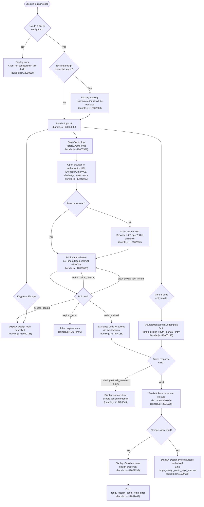

# `/design-login`

> Analysis basis: CC v2.1.196 bundle.js (AST extraction + Claude interpretation)
> Minimum version: v2.1.196

---

## Overview

`/design-login` initiates an OAuth 2.0 authorization flow that grants Claude Code access to the user's claude.ai design-system projects. It renders a JSX-based interactive terminal UI that walks the user through browser-based sign-in (with an optional manual code-entry fallback), then persists the resulting OAuth credential to secure storage for subsequent `/design-sync` operations. This authentication is entirely separate from the session-level API key used for inference.

---

## Registration

| Field | Value |
|---|---|
| type | `local-jsx` |
| name | `design-login` |
| description | Authorize design-system access for /design-sync with your claude.ai account |
| loc_byte | `12005506` |
| loc_byte_end | `12005705` |
| loc_line | `8123` |
| module_id | `Q9l` |
| load_inline | `true` |
| arbor_handler.name | `e4l` |
| arbor_handler.fqn | `claude-2.1.196::e4l` |
| arbor_handler.kind | `Function` |
| arbor_handler.resolution_path | `direct` |
| arbor_handler.n_hits | `1` |

Analysis basis: CC v2.1.196 bundle.js:+12005506

---

## Input Branching

The command presents multiple distinct UI states driven by internal state machine transitions, OAuth polling outcomes, and user keypress events. Six or more distinguishable paths exist, requiring a flowchart.



---

## Behavioral Spec

### Command Entry Point — Handler Dispatch

The command registration is of type `local-jsx` and is loaded inline via a `load: () => Promise.resolve({call: handlerFn})` pattern (module `Q9l`). The Arbor symbol graph resolves the handler directly as `e4l` (resolution path: `direct`, 1 hit). The BFS callGraph surface entry is `E3f`, which renders the root JSX component by calling into the React JSX runtime (`wE.jsx`) and delegating state logic to `X9l` (the main stateful login component).

```
function commandEntryPoint():
    rootElement = renderJSX(loginComponent)   // E3f → wE.jsx (bundle.js:+12005282)
    return rootElement
```

Analysis basis: CC v2.1.196 bundle.js:+12005282

---

### OAuth Client ID Validation

Before any UI renders, the login component checks for a non-null design OAuth client ID. The client ID is expected to be set either via the `CLAUDE_CODE_DESIGN_OAUTH_CLIENT_ID` environment variable or baked into the build. If absent, the component immediately surfaces a configuration error and halts.

```
function validateOAuthClientConfig(env):
    clientId = env["CLAUDE_CODE_DESIGN_OAUTH_CLIENT_ID"] or BUILD_DEFAULT_CLIENT_ID
    if clientId is null or clientId starts with "00000000-":
        displayError("The Claude Design OAuth client is not configured in this build...")
        // (bundle.js:+12000358)
        return ABORT
    return clientId
```

Analysis basis: CC v2.1.196 bundle.js:+12000358; sentinel prefix `"00000000-"` at bundle.js:+10420217

---

### UI State Machine — `loginComponent` (`X9l`)

The login component (`X9l`) initializes with:
- A React `useState` starting in state `"starting"` (bundle.js:+11999264)
- A numeric progress counter initialized to `0` (bundle.js:+11999345)
- A `useRef` for the active OAuth flow controller
- Context hooks for clock (`Rs` → `X8i.useContext`) and terminal size (`Sr` → `AVi.useContext`)
- A resize-aware layout that uses `Math.max` against terminal width, with a minimum column width of `50` characters and a depth constant of `4` (bundle.js:+11999474, +11999498)

State values observed in literals:
- `"starting"` — initial state (bundle.js:+11999264)
- `"waiting_for_login"` — browser opened, polling (bundle.js:+12000062)
- `"processing"` — code received, exchanging (bundle.js:+12000888)
- `"about_to_retry"` — retry countdown (bundle.js:+11999829)
- `"success"` — credential stored (bundle.js:+11999528)

```
function loginComponent(props):
    [uiState, setUiState] = useState("starting")
    [progress, setProgress] = useState(0)
    flowRef = useRef(null)
    clockCtx = useClock()          // Rs (bundle.js:+11999394)
    termSize = useTerminalSize()   // Sr (bundle.js:+11999458)
    columnWidth = Math.max(50, termSize.columns - 4)   // bundle.js:+11999474, +11999498

    onKeyPress = useCallback((key, input) => {
        if key == "escape":
            cancelFlow()
            setUiState("cancelled")   // → display "Design login cancelled."
            // bundle.js:+11999636, +11999725
        if key == "return":
            // advance / confirm
            // bundle.js:+11999789
    })

    useEffect(() => {
        initAndStartFlow()
    }, [])

    return renderUI(uiState, columnWidth)   // wE.jsxs / wE.jsx (bundle.js:+12002093)
```

Analysis basis: CC v2.1.196 bundle.js:+11999245 – +12002266

---

### OAuth Flow Initiation — `startOAuthFlow`

When the UI reaches the ready state, it calls `r.startOAuthFlow()` (bundle.js:+12000581). This function:

1. Generates a PKCE `codeVerifier` (32 random bytes, base64url-encoded) using `Mge.randomBytes` (bundle.js:+17841717)
2. Derives `codeChallenge` via SHA-256 hash of the verifier, encoded as `S256` (bundle.js:+17841762, literal `"S256"` at +17842300)
3. Generates a random `state` parameter (bundle.js:+17841821) using `d8c`
4. Generates a `nonce` via `nvt.nonce` (bundle.js:+17841702)
5. Requests scopes: `"openid"`, `"profile"`, `"email"`, `"offline_access"` (bundle.js:+17839174, +17839183, +17839193, +17841939)
6. Constructs the authorization URL at `H.authorizationUrl` with query parameters including `redirect_uri=/oauth/callback`, `response_type=code`, `code_challenge_method=S256` (bundle.js:+17842119, +17842351)
7. Stores encrypted OAuth state using key `"oauth_state"` via `d8c` → `Ets` (bundle.js:+17736218)
8. Opens the browser; if browser opening fails, displays the URL and a clipboard copy prompt

```
function startOAuthFlow(clientId, serverMetadata):
    verifier = base64url(randomBytes(32))             // bundle.js:+17841717
    challenge = base64url(sha256(verifier))           // bundle.js:+17841762
    state = generateState()                           // bundle.js:+17841821
    nonce = generateNonce()                           // bundle.js:+17841702
    scopes = ["openid", "profile", "email", "offline_access"]
    authUrl = buildAuthorizationUrl(
        serverMetadata.authorizationEndpoint,
        clientId, challenge, state, nonce, scopes     // bundle.js:+17842119
    )
    storeEncryptedState("oauth_state", {verifier, state, nonce})
    opened = tryOpenBrowser(authUrl)
    if not opened:
        displayUrl(authUrl)
        copyToClipboard(authUrl)                      // ww clipboard subsystem
```

Analysis basis: CC v2.1.196 bundle.js:+17841717 – +17842464

---

### Device / User-Code Verification Path (`iXe`)

The command also supports a device-verification sub-path where the server issues a `user_code` displayed to the user (literal `"user_code"` at bundle.js:+17840703). The device authorization endpoint is `/oauth/device_authorization` (bundle.js:+17839943). A local HTTP listener (`Lon`) is started on a randomly chosen port to receive the OAuth callback, using `sXe` and `ZHr` for random-bytes-based nonce generation (bundle.js:+17840731, +17757836).

```
function handleDeviceAuthorizationPath(clientId, scopes):
    deviceResponse = POST("/oauth/device_authorization", {client_id, scopes})
    // bundle.js:+17839943
    displayUserCode(deviceResponse.user_code)         // bundle.js:+17840703
    startPollingLoop(deviceResponse.device_code, interval=deviceResponse.interval)
    // poll states: "pending", "authorization_pending", "slow_down", "access_denied"
    // bundle.js:+17840246, +17844618, +17840163, +17844694
```

Analysis basis: CC v2.1.196 bundle.js:+17839943 – +17840356

---

### Manual Code Entry Path

When the user presses a designated key (not browser flow), the component activates manual code entry mode. The telemetry event `tengu_design_oauth_manual_entry` is fired (bundle.js:+12000148). The entered code is split and validated.

```
function handleManualCodeEntry(inputCode):
    emit("tengu_design_oauth_manual_entry")           // bundle.js:+12000148
    parts = inputCode.split(delimiter)                // I.split (bundle.js:+11999940)
    if not valid(parts):
        displayError("Invalid code. Please make sure the full code was copied")
        // bundle.js:+11999989
        return
    proceedToTokenExchange(parts)
```

Analysis basis: CC v2.1.196 bundle.js:+12000148, +11999940, +11999989

---

### Token Exchange and Storage — `saveDesignCredential` (`vQn` → `Ml` → `tci`)

After a successful authorization code is received, the component exchanges it for tokens via `/oauth/token` (bundle.js:+17844186) and persists the result.

```
function exchangeAndStore(code, verifier, state):
    tokenResponse = POST("/oauth/token", {
        grant_type: "authorization_code",             // bundle.js:+17844301 implied
        code: code,
        code_verifier: verifier,
        redirect_uri: "/oauth/callback"
    })
    if tokenResponse.refresh_token is null or tokenResponse.expires_in is null:
        displayError("The token response was missing a refresh token or expiry...")
        // bundle.js:+10420643
        return FAIL

    stored = secureStorageWrite(tokenResponse)        // Ml → tci (bundle.js:+10416772)
    // tci attempts primary secure store; on transient failure may skip fallback
    // (literals: "primary_transient_skip_fallback" bundle.js:+2371456,
    //  "plaintext_fallback_used" bundle.js:+2371605,
    //  "primary_and_fallback_failed" bundle.js:+2371708)

    if not stored:
        emit("tengu_design_oauth_login_error")        // bundle.js:+12001442
        displayError("Could not save the design credential to secure storage.")
        // bundle.js:+12001193
        return FAIL

    emit("tengu_design_oauth_login_success")          // bundle.js:+12001289
    displaySuccess("Design-system access authorized.")
    // bundle.js:+11999560
    setTimeout(cleanup, 1500)                         // bundle.js:+12001418
```

Analysis basis: CC v2.1.196 bundle.js:+17844186, +10420643, +2371358, +12001289, +12001193

---

### OAuth Callback Server — `Lon` / `iXe`

A transient local HTTP server is started to receive the browser's redirect. It enforces:
- `sec-fetch-site: same-origin` check to block cross-site submissions (literal `"csrf_rejected"` at bundle.js:+17840959; message "This request came from another site…" at bundle.js:+17841012)
- State parameter validation using timing-safe comparison via `Mge.timingSafeEqual` (bundle.js:+17842889)
- A unique nonce per session to prevent replay
- On mismatch: error `"browser_mismatch"` with message "This sign-in link was started in a different browser…" (bundle.js:+17842945, +17842989)
- On unknown code: error `"unknown_code"` with message "That code was not recognized — it may have expired." (bundle.js:+17841527, +17841579)
- HTML response uses strict CSP: `default-src 'none'; style-src 'unsafe-inline'; frame-ancestors 'none'; form-action 'none'; base-uri 'none'` and `Cache-Control: no-store` (bundle.js:+17757488, +17757613)
- Auto-close script injected into success page: `setTimeout(function(){try{window.close()}catch(e){}}, 1500)` (bundle.js:+17759525)

Analysis basis: CC v2.1.196 bundle.js:+17840959 – +17843469

---

### Clipboard Integration — `ww` subsystem

When the browser fails to open, the authorization URL is offered to the clipboard. The `ww` subsystem dispatches to platform-specific clipboard tools:
- macOS: `pbcopy` (bundle.js:+3578617)
- Linux/Wayland: `wl-copy` (bundle.js:+3577375)
- Linux/X11: `xclip` or `xsel` (bundle.js:+3577444, +3577485)
- Windows/WSL: `powershell.exe -Command Set-Clipboard` (bundle.js:+3579019)
- tmux: `load-buffer -w` (bundle.js:+3577872)
- OSC 52 terminal escape fallback

On successful copy, the UI appends `"(Copied!)"` (bundle.js:+12002927) next to the displayed URL. The copy key binding is labeled `"copy"` (bundle.js:+12003000).

Analysis basis: CC v2.1.196 bundle.js:+3578212 – +3579112, +12002927

---

### Session Token Refresh (`H.refresh` / `ne.claims`)

After initial login, subsequent credential use goes through a refresh path. `H.refresh` (bundle.js:+17844991) and `ne.claims` (bundle.js:+17845015) handle token renewal. Recognizes error codes: `"invalid_grant"`, `"temporarily_unavailable"`, `"unsupported_grant_type"` (bundle.js:+17845652, +17845690, +17845765) and maps them to user-facing `"auth.denied"` (bundle.js:+17845901). The session mint event is `"session.mint"` (bundle.js:+17843630) and refresh event is `"session.refresh"` (bundle.js:+17845260). Session tokens expire after 3600 seconds (bundle.js:+17843855).

Analysis basis: CC v2.1.196 bundle.js:+17844991 – +17845941

---

## State & Side Effects

| Item | Detail |
|---|---|
| Telemetry — design_oauth_manual_entry | `tengu_design_oauth_manual_entry` fired when user activates manual code path (bundle.js:+12000148) |
| Telemetry — design_oauth_login_success | `tengu_design_oauth_login_success` fired on credential successfully stored (bundle.js:+12001289) |
| Telemetry — design_oauth_login_error | `tengu_design_oauth_login_error` fired on storage failure or unrecoverable auth error (bundle.js:+12001442) |
| Secure storage write | OAuth tokens (access_token, refresh_token, expiry) written via `tci` credential writer; attempts primary keychain then optional plaintext fallback (bundle.js:+2371358) |
| Encrypted state store | OAuth `state`, `verifier`, and `nonce` stored encrypted under key `"oauth_state"` for CSRF protection (bundle.js:+17736218) |
| Local HTTP server | Transient listener started for OAuth redirect callback; terminated after completion or error (bundle.js:+17840731) |
| Browser open | Attempts to open the system browser to the authorization URL |
| Clipboard side-effect | Authorization URL may be copied to clipboard on failed browser open; UI shows `"(Copied!)"` indicator (bundle.js:+12002927) |
| appState changes | Sets design OAuth credential in shared credential store; existing credential is silently replaced (bundle.js:+12002580) |
| Timer | `setTimeout` 1500ms post-success cleanup (bundle.js:+12001418); `setTimeout` 3000ms retry delay (bundle.js:+12000683) |
| Sound | <!-- TODO: not found in depth-2 traversal; needs --depth 4 --> |
| Hook registration | `useEffect` initializes OAuth flow on mount; cleanup via `r.cleanup()` + `I.forEach` + `I.clear` on unmount (bundle.js:+12001987 – +12002019) |

---

## Version History

| Version | Change |
|---|---|
| v2.1.196 | Initial analysis |

---

## Common Mistakes

1. **Missing `CLAUDE_CODE_DESIGN_OAUTH_CLIENT_ID`** — If neither the environment variable nor a build-baked client ID is present, the command immediately aborts with a configuration error. This is a build-level concern, not a user error, but running unofficial or stripped builds will reproduce it.
2. **Reusing the authorization URL** — The OAuth state/nonce is single-use. Navigating to the URL a second time after the callback has been received results in an `"unknown_code"` or expired-state error. Invoke `/design-login` again from scratch.
3. **Wrong browser** — If the authorization link is opened in a different browser than the one the local callback server is bound to, the callback validation emits `"browser_mismatch"` and the flow fails. Ensure the same browser session that received the redirect opens the link.
4. **Cross-origin callback submission** — Direct POST to the callback endpoint from a different origin is blocked by the CSRF check (`sec-fetch-site` header enforcement). Always use the redirect link from the browser.
5. **Token response missing refresh_token** — Some IdP configurations omit the refresh token or expiry in the token response. The command explicitly requires both; omitting either produces a non-retryable error and nothing is stored.
6. **Secure storage unavailability** — On headless Linux environments without a keychain daemon, the primary storage path may fail. A plaintext fallback may be used (`"plaintext_fallback_used"`) but if both paths fail, the credential is lost and the user must retry.
7. **Cancelling mid-flow** — Pressing Escape cancels the flow and displays "Design login cancelled." The local HTTP callback server is shut down, but any pending browser tab may still resolve. Tokens delivered to a closed server are discarded.

---

## Appendix — Identifier Mapping

> For bundle debugging only. Identifiers change across versions.

| Identifier | Role |
|---|---|
| `E3f` | Root command handler / JSX render entry (maps to `e4l` per Arbor) |
| `X9l` | Main stateful login React component |
| `Rs` | Clock context consumer hook |
| `Sr` | Terminal size context consumer hook |
| `M` | OAuth HTTP request handler / route dispatcher (local server) |
| `kge` | JSON serialization utility |
| `Ots` | IP address parsing dispatcher |
| `Mts` | IPv4-mapped address parser |
| `Dts` | Address regex matcher |
| `M8c` | URL path sanitizer |
| `sXe` | String replace / URL encode helper |
| `zts` | URL prefix checker (`startsWith`) |
| `Ats` | JWT signing dispatcher |
| `mts` | JWT header/payload parser |
| `u8c` | Key-ID lookup (throws `"unknown kid"`) |
| `dVc` | Device authorization initiator |
| `bBm` | OAuth token response parser / credential unpacker |
| `hu` | HTTP upstream request helper |
| `H8c` | Random float generator |
| `h8c` | Random bytes generator (crypto) |
| `Lts` | SHA-256 hex hash helper |
| `vts` | Encrypted value store setter |
| `Ets` | Symmetric encryption (A256GCM / JWE) |
| `VHr` | Uppercase hex encoder |
| `k2m` | `toUpperCase` string wrapper |
| `Lon` | Local OAuth callback HTTP server |
| `ZHr` | Random bytes → base64url generator |
| `N` | Daemon/supervisor message handler |
| `qqc` | File realpath/stat resolver |
| `T` | Content-type / MIME dispatch helper |
| `Re` | Error logger / error pusher |
| `k9m` | Request routing helper |
| `d` | Daemon writer / supervisor IPC |
| `d8c` | OAuth state encryption wrapper |
| `Fo` | Browser open utility |
| `H` | OIDC client / provider object |
| `iXe` | Device verification callback handler |
| `p8c` | JWT seal wrapper |
| `Sts` | JWT seal/unseal dispatcher |
| `x` | Cookie parser |
| `k` | File watcher / interval poller |
| `O` | Background session supervisor sweep |
| `wts` | JWT unseal wrapper |
| `oe` | Claims aggregator (Promise.all over userinfo) |
| `A` | Userinfo fetcher / OIDC userinfo sub validator |
| `wVt` | Claim merge helper |
| `Zhm` | Scope/claim normalizer |
| `ye` | Token store commit (set + del + VHr) |
| `he` | String coercion (`String()`) |
| `X` | Voice recording session manager |
| `ke` | Feature-ok telemetry emitter |
| `V` | React render helper / Ink component renderer |
| `W` | Voice recording state initializer |
| `wmr` | Audio buffer push helper |
| `K` | Backspace keypress handler |
| `ce` | Keydown event handler |
| `zwc` | Audio RMS level calculator (`Math.sqrt`, `Math.min`) |
| `Se` | Component / item shifter |
| `Y` | Transcript handler |
| `kr` | O8 telemetry bridge |
| `aQe` | Locale / language normalizer (`toLowerCase`, `Kss.has`) |
| `xe` | Feature-ok telemetry variant |
| `ccs` | Date/time formatter (`Intl.DateTimeFormat`) |
| `ccr` | Voice WebSocket stream client |
| `wIm` | Voice intermediate state helper |
| `be` | MCP elicitation handler |
| `u` | Daemon stop controller |
| `q` | Permission allow/deny dispatcher |
| `z` | MCP update applicator |
| `j` | Daemon idle-exit timeout controller |
| `pe` | Voice session outer controller (recursive) |
| `wt` | Feature-sad telemetry emitter |
| `Ce` | Keydown push helper |
| `f` | L8 state machine ref |
| `er` | Error constructor wrapper |
| `DYo` | File attachment path resolver |
| `ne` | Token refresh claims handler |
| `a` | Spend-block / billing response handler |
| `U` | Rate-limit event enqueuer |
| `n_r` | Header entry checker (`i.some`, `n.includes`) |
| `n` | Header value lowercase normalizer |
| `bVc` | Gateway/SSO policy dispatcher |
| `jBm` | Gateway-type handler |
| `VBm` | Permission filter (deny / mcp__ prefix / sandbox) |
| `qBm` | Sandbox policy lookup |
| `CVc` | MCP server request multiplexer |
| `fvt` | Upstream HTTP fetch executor |
| `ens` | String coercion for error responses |
| `tVc` | Model list response handler |
| `Gts` | Model registry map manager |
| `J8c` | Supported-method inclusion checker |
| `Q8c` | Main messages/token API request handler |
| `Gt` | JSON.parse wrapper |
| `J$e` | JSON error response builder |
| `$ts` | Request body normalizer / claude-model validator |
| `E` | Tool-dispatch / MCP tool call executor |
| `Bts` | Auth token extractor |
| `p` | Process exit / abort controller |
| `Me` | JSON.stringify wrapper |
| `z8c` | Auth apply + upstream forward handler |
| `_` | Auth invalidation helper |
| `dBm` | Token-count proxy handler |
| `Y8c` | Anthropic API upstream forwarder |
| `xg` | Proxy-Authorization / credential apply helper |
| `g7t` | OAuth client lookup dispatcher |
| `LQn` | OAuth environment config resolver |
| `Us` | OAuth base URL builder (prod/local/staging) |
| `EHs` | Production OAuth base URL constant |
| `HSu` | Staging/local OAuth URL selector |
| `c` | Daemon background session starter (`yn`) |
| `yn` | Background session runner |
| `TN` | Token revoke HTTP poster |
| `sDo` | Token filter / revoke batch helper |
| `vQn` | Design credential save orchestrator |
| `Ml` | Credential storage dispatcher |
| `tci` | Secure storage read/write with fallback |
| `t9e` | Async credential read helper |
| `Dd` | Design context provider hook |
| `m` | Design server filter (Array.isArray + k.filter) |
| `XHr` | URL scheme stripper / normalizer |
| `ww` | Clipboard subsystem dispatcher |
| `gFt` | OSC52 clipboard encoder |
| `fH` | Base64 encoder for clipboard |
| `l9i` | Platform clipboard tool runner |
| `Pn` | Native clipboard executor (pbcopy/xclip/wl-copy) |
| `Gr` | Child-process exec wrapper |
| `Ot` | tmux buffer loader |
| `JJr` | Linux clipboard selector (wl-copy/xclip/xsel) |
| `Wf` | xclip/wsel dispatcher |
| `Z9d` | tmux clipboard handler |
| `YJr` | OSC52 escape sequence emitter |
| `hFt` | OSC52 + base64 clipboard helper |
| `px` | DCS raw terminal clipboard writer |
| `F_` | OSC52 multi-chunk joiner |
| `a9i` | OSC52 chunk encoder |
| `v` | Cleanup iterator variable |
| `wEt` | Token storage write entry (`Ml` + `he`) |

---

Note: index built via Arbor fallback; some signals (telemetry, literals) may be missing — see arbor-fallback.js.