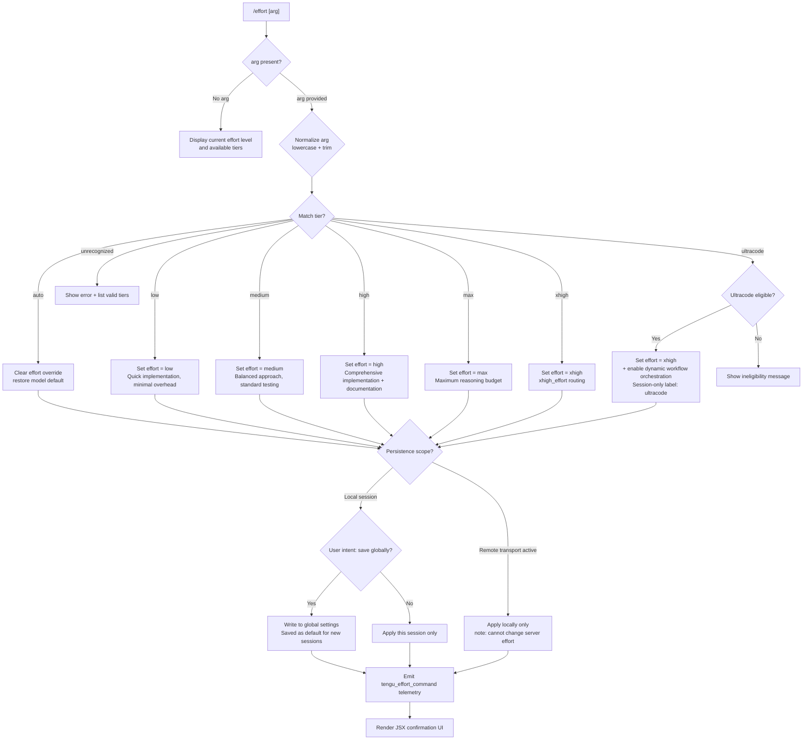

# `/effort`

> Analysis basis: CC v2.1.195 bundle.js (AST extraction + Claude interpretation)
> Minimum version: v2.1.195

---

## Overview

The `/effort` command sets the inference effort level that Claude Code applies when generating responses for the current model. It accepts a named tier (`low`, `medium`, `high`, `max`, `xhigh`, `ultracode`, or `auto`), persists the choice either globally (as the new session default) or locally (this session only), and immediately emits telemetry. A special `ultracode` tier activates dynamic workflow orchestration on top of the `xhigh` effort baseline.

---

## Registration

| Field | Value |
|---|---|
| type | `local-jsx` |
| name | `effort` |
| description | `Set effort level for model usage` |
| loc_byte | `13054140` |
| loc_byte_end | `13054395` |
| loc_line | `8941` |
| argumentHint | `null` |
| immediate | `null` |
| thinClientDispatch | `control-request` |
| module_id | `qQl` |
| load_inline | `true` |
| arbor_handler.name | `NKf` |
| arbor_handler.fqn | `claude-2.1.195::NKf` |
| arbor_handler.kind | `AsyncFunction` |
| arbor_handler.resolution_path | `module_id` |
| arbor_handler.n_hits | `2` |

Analysis basis: CC v2.1.195 bundle.js:+13054140

---

## Input Branching

Six or more distinct effort tier branches exist, plus a status-query path and a session-vs-global persistence branch. A Mermaid flowchart is required.



Analysis basis: CC v2.1.195 bundle.js:+13040463 (handler entry `Iir`/`NKf`), +3401157 (tier dispatch `DY`/`YC`), +13040282 (session-only annotation), +13040238 (global-save annotation)

---

## Behavioral Spec

### 1. Handler Entry — `effortCommandHandler` (bundle: `NKf`)

```
async function effortCommandHandler(commandInput):
    tierList = supportedTierList()           // S5 array check
    arg = commandInput.args ?? ""

    if arg is in [" current", "status"]:
        return renderCurrentEffortStatus()   // Tir path

    return renderEffortSelectionUI(arg, tierList)  // Wa.jsx render
```

Analysis basis: CC v2.1.195 bundle.js:+13051900 (`S5.includes`), +13051918 (`Tir`), +13051970 (`Wa.jsx`)

---

### 2. Current Status Display — `renderCurrentEffortStatus` (bundle: `Tir`)

```
function renderCurrentEffortStatus():
    lines = []
    currentEffort = getCurrentEffortValue()  // oV
    effortOptions = buildEffortOptionList()  // w4e → xI.filter + v4e

    if ultracode is active:
        lines.append("Current effort level: ultracode (xhigh + dynamic workflow orchestration; this session only)")
    else:
        lines.append("Current effort level: " + currentEffort)

    lines.append("- auto: Use the default effort level for your model")
    // append one line per valid tier including ", ultracode" suffix
    return lines.join("\n")
```

Literal citation: `"Current effort level: ultracode (xhigh + dynamic workflow orchestration; this session only)"` (bundle.js:+13040489); `"- auto: Use the default effort level for your model"` (bundle.js:+13038920); `"|ultracode"` suffix appended to tier list (bundle.js:+13038755).

Analysis basis: CC v2.1.195 bundle.js:+13038692 (`As`), +13038699 (`oV`), +13038707 (`w4e`), +13038739 (`n.join`), +13038796 (`n.map`)

---

### 3. Tier Validation — `resolveTierFromInput` (bundle: `YC`)

```
function resolveTierFromInput(rawArg):
    normalized = rawArg.toLowerCase().trim()

    // Model compatibility check
    if currentModel.includes("claude-3-"):        // pre-tier models
        return error("effort tiers not supported on this model")

    // Supported model list checked (bundle: mo)
    eligibleModels = [
        "claude-opus-4-0", "claude-opus-4-1",
        "claude-sonnet-4-0", "claude-sonnet-4-5",
        "claude-haiku-4-5", "claude-mythos-5",
        "claude-opus-4-5", "claude-opus-4-6",
        "claude-sonnet-4-6"
    ]

    if normalized in eligibleModels:
        // direct model pinning branch (tF / nN / l_)
        return applyModelPin(normalized)

    tier = matchEffortTier(normalized)  // fce → xI.includes
    if tier is null:
        return showTierError(normalized)

    return tier
```

Literal citations: `"claude-3-"` (bundle.js:+3397762); model strings at bundle.js:+3397780–3397988; `"claude-opus-4-5"` (bundle.js:+3398186); `"claude-opus-4-6"` (bundle.js:+3398537); `"claude-sonnet-4-6"` (bundle.js:+3398610).

Analysis basis: CC v2.1.195 bundle.js:+3397698 (`K8`), +3397742 (`mo`), +3397751 (`n.includes`), +3397907 (`ut`), +3397968 (`tF`)

---

### 4. Tier Dispatch — `applyEffortTier` (bundle: `DY`)

```
function applyEffortTier(tier, sessionScope):
    switch tier:
        case "low":
            label = "low"
            description = "Quick, straightforward implementation with minimal overhead"
        case "medium":
            label = "medium"
            description = "Balanced approach with standard implementation and testing"
        case "high":
            label = "high"
            description = "Comprehensive implementation with extensive testing and documentation"
        case "max":
            label = "max"
            effortHandler = maxEffortHandler()        // Txe
        case "xhigh":
            label = "xhigh"
            effortHandler = xhighEffortHandler()      // Zte
        case "ultracode":
            label = "xhigh + workflows"
            workflowsEnabled = true
            sessionScopeForced = true                 // always session-only
        case "unset" | "auto":
            label = "auto"
            clearOverride = true
        case numeric (parseFloat, isNaN guard):
            // numeric effort 0–10 range (wF path)
            label = String(clampedValue)
            // parseInt + isNaN guard: values ≥ 10 clamped (bundle.js:+3400213)

    if remoteTransportActive:
        appendNote(" (applied locally — this remote transport can't change server effort)")
    elif sessionScope == "global":
        appendNote(" (saved as your default for new sessions)")
    else:
        appendNote(" (this session only)")

    persistEffortSetting(label, sessionScope)
    emitTelemetry("tengu_effort_command")
```

Literal citations: `"low"` (bundle.js:+3402207); `"medium"` (bundle.js:+3402285); `"high"` (bundle.js:+3402889); `"max"` (bundle.js:+3401300); `"xhigh"` (bundle.js:+3401331); `"unset"` (bundle.js:+3400546); `"auto"` (bundle.js:+3400574); `"xhigh + workflows"` (bundle.js:+13044762); numeric clamp upper bound `10` (bundle.js:+3400213); remote transport note (bundle.js:+13039292); global-save note (bundle.js:+13040238); session-only note (bundle.js:+13040282).

Analysis basis: CC v2.1.195 bundle.js:+3401157, +3401176 (`x4e`), +3401185 (`CUt`), +3401194 (`L4e`), +3401275 (`fce`), +3401284 (`Azr`), +3401308 (`Txe`), +3401341 (`Zte`)

---

### 5. `max_effort` Tier Handler — `maxEffortDispatch` (bundle: `Txe`)

```
function maxEffortDispatch(modelCtx):
    // Requires model in max_effort-eligible set
    // Sets internal routing key "max_effort"
    applyEffortRouting("max_effort")     // K8 → "max_effort"
    checkModelIncludes(modelCtx)         // n.includes
    applyTokenBudget()                   // tF → Kwe
    persistToSession()                   // nN + l_ → fr / QMt / Tld
```

Literal citation: `"max_effort"` (bundle.js:+3398059); `"claude-opus-4-5"` eligible model (bundle.js:+3398186).

Analysis basis: CC v2.1.195 bundle.js:+3398054 (`K8`), +3398102 (`mo`), +3398111 (`n.includes`), +3398290 (`tF`), +3398348 (`nN`), +3398351 (`l_`)

---

### 6. `xhigh_effort` Tier Handler — `xhighEffortDispatch` (bundle: `Zte`)

```
function xhighEffortDispatch(modelCtx):
    // Sets internal routing key "xhigh_effort"
    applyEffortRouting("xhigh_effort")   // K8 → "xhigh_effort"
    checkModelIncludes(modelCtx)         // n.includes
    applyTokenBudget()                   // tF → Kwe
    persistToSession()                   // nN + l_
```

Literal citation: `"xhigh_effort"` (bundle.js:+3398385); `"claude-opus-4-6"` (bundle.js:+3398537); `"claude-sonnet-4-6"` (bundle.js:+3398610).

Analysis basis: CC v2.1.195 bundle.js:+3398380 (`K8`), +3398430 (`mo`), +3398439 (`n.includes`), +3398666 (`tF`), +3398726 (`nN`), +3398729 (`l_`)

---

### 7. Ultracode Mode — `ultracodeTierDispatch` (bundle: `GQl`)

```
function ultracodeTierDispatch(effortState):
    // Ultracode is session-scoped only; uses xhigh effort base
    workflowsAllowed = checkWorkflowEligibility()   // Wst
    effortIndex = xI.indexOf("ultracode")            // GQl → xI.indexOf

    // Visual animation constants
    colorPaletteSize = 3        // bundle.js:+13044411
    colorSteps = 17             // bundle.js:+13044415
    animLabel = "ultracode"     // bundle.js:+13044440
    animTheme = "violet-ripple" // bundle.js:+13044476
    segmentCount = 4            // bundle.js:+13044509
    segmentRate = 8.5           // bundle.js:+13044621
    haloSteps = 18              // bundle.js:+13044721

    // Applies xhigh routing + enables workflow orchestration flag
    applyXhighBase()            // oV → XE + Zte
    enableWorkflows()           // xNi → rNd
    renderUltracodeUI(animTheme, colorPaletteSize, segmentCount)
```

Literal citations: `"ultracode"` (bundle.js:+13044440); `"violet-ripple"` (bundle.js:+13044476); `"xhigh + workflows"` (bundle.js:+13044762); color steps `17` (bundle.js:+13044415); segment count `4` (bundle.js:+13044509); segment rate `8.5` (bundle.js:+13044621); halo steps `18` (bundle.js:+13044721).

Analysis basis: CC v2.1.195 bundle.js:+13044317 (`Wst`), +13044337 (`xI.indexOf`), +13044369 (`xNi`), +13044390 (`oV`), +13044498 (`Math.floor`), +13044639 (`c4o`)

---

### 8. Numeric Effort Parsing — `parseNumericEffort` (bundle: `wF`)

```
function parseNumericEffort(rawArg):
    s = String(rawArg).trim()         // wNi normalization
    if typeof(s) != "string":
        return null
    parsed = parseFloat(s)
    if isNaN(parsed):
        return null
    // Clamp to [0, 10]
    clamped = min(parsed, 10)         // upper bound: bundle.js:+3400213
    return clamped
```

Maximum numeric effort value: `10` (bundle.js:+3400213).

Analysis basis: CC v2.1.195 bundle.js:+3400119 (`wNi`), +3400141 (`String`), +3400180 (`fce`), +3400202 (`parseInt`), +3400221 (`isNaN`)

---

### 9. Workflow Eligibility Check — `checkWorkflowEligibility` (bundle: `Wst`)

```
function checkWorkflowEligibility(context):
    provider = resolveProvider(context)   // fr
    if provider == "gateway":
        return false                      // bundle.js:+3398987
    modelOk = checkModelFlags(context)    // mo
    trimmedArg = context.args.trim()      // e.trim
    hasWorkflows = featureFlag("allow_workflows")  // Qwe / ODt
    effortAllowed = checkEffortInclude()           // fce
    return modelOk AND hasWorkflows AND effortAllowed
```

Literal citation: `"gateway"` (bundle.js:+3398987); `"allow_workflows"` feature flag (bundle.js:+3397169).

Analysis basis: CC v2.1.195 bundle.js:+3398957 (`fr`), +3399015 (`mo`), +3399018 (`Qwe`), +3399022 (`e.trim`), +3399049 (`ODt`), +3399142 (`fce`)

---

### 10. Persistence — `persistEffortSetting` (bundle: `lKf` / `mce` / `Tzr`)

```
function persistEffortSetting(effortLabel, scope):
    if scope == "global":
        // Write to ~/.claude/settings.json
        settingsPath = joinPath(".claude", "settings.json")   // M5 → z1.join
        updateGlobalConfig("effort", effortLabel)             // gn → saveGlobalConfig
        // Guard: refuse write if re-read config is missing auth that cache has
    elif scope == "session":
        // Write to project/local settings only (this session only)
        updateLocalSettings("effort", effortLabel)
    
    // String label preview for confirmation message
    labelString = String(effortLabel)   // mce → String
```

Literal citations: `".claude"` (bundle.js:+1325246); `"settings.json"` (bundle.js:+1325256); `"settings.local.json"` (bundle.js:+1325318); `"saveGlobalConfig fallback: re-read config is missing auth that cache has; refusing to write. See GH #3117."` (bundle.js:+14066037).

Analysis basis: CC v2.1.195 bundle.js:+13039519 (`Ixe`), +13039670 (`u4o`), +13039986 (`mce`), +13040218 (`Tzr`), +13040307 (`qxn`)

---

### 11. Effort Setting Inclusion Check — `isEffortIncluded` (bundle: `fce`)

```
function isEffortIncluded(effortKey):
    // Checks whether a given effort key appears in the supported tier index (xI)
    return xI.includes(effortKey)
```

Analysis basis: CC v2.1.195 bundle.js:+3398883 (`xI.includes`)

---

### 12. Effort Index Lookup — `getEffortIndex` (bundle: `bxe`)

```
function getEffortIndex(effortKey):
    return xI.indexOf(effortKey)
```

Analysis basis: CC v2.1.195 bundle.js:+3398921 (`xI.indexOf`)

---

## State & Side Effects

| Item | Detail |
|---|---|
| Telemetry | `tengu_effort_command` (bundle.js:+13040920) — fired after every successful effort change |
| Telemetry | `tengu_workflows_enabled` (bundle.js:+3397370) — fired when workflow eligibility flag is set |
| Telemetry | `tengu_slate_finch` (bundle.js:+3402673) — fired during `Tzr` persistence path |
| Telemetry | `tengu_feature_ok` (bundle.js:+1027363) — settings write success |
| Telemetry | `tengu_feature_sad` (bundle.js:+1027511) — settings write partial failure |
| Telemetry | `tengu_feature_bad` (bundle.js:+1027430) — settings write hard failure |
| Telemetry | `tengu_config_auth_loss_prevented` (bundle.js:+14066165) — global config write aborted to prevent auth data loss |
| Settings mutation | Writes `effort` key to `~/.claude/settings.json` (global scope) or `settings.local.json` (session scope) |
| appState changes | In-memory effort tier updated immediately; ultracode also sets workflow orchestration flag |
| Hook registration | `thinClientDispatch: "control-request"` — effort changes are dispatched as control requests in thin-client mode |
| Remote transport | When remote transport is active, effort is applied locally only; server effort cannot be changed (bundle.js:+13039292) |
| Auth loss guard | Global config write is refused if the re-read config is missing auth that the in-memory cache holds (GH #3117, bundle.js:+14066037) |
| JSX render | Confirmation UI rendered via `Wa.jsx` (bundle.js:+13051970); ultracode uses `violet-ripple` animation theme (bundle.js:+13044476) |

---

## Version History

| Version | Change |
|---|---|
| v2.1.195 | Initial analysis; tiers: `auto`, `low`, `medium`, `high`, `max`, `xhigh`, `ultracode`; numeric 0–10 range; ultracode `violet-ripple` animation |

---

## Common Mistakes

1. **Passing a numeric value above 10**: Values are clamped to `10` internally. There is no error; the value silently caps. (bundle.js:+3400213)
2. **Expecting `ultracode` to persist globally**: `ultracode` is session-scoped only. It will never be written to `settings.json` as a permanent default.
3. **Using `/effort` on `claude-3-*` models**: Models matching the `"claude-3-"` prefix do not support effort tiers; the command will return an error (bundle.js:+3397762).
4. **Expecting server-side changes over a remote transport**: When a remote transport is active, effort is applied only locally. The server's inference effort remains unchanged (bundle.js:+13039292).
5. **Assuming `xhigh` and `xhigh_effort` are interchangeable user inputs**: The user types `xhigh`; the internal routing key is `xhigh_effort`. Typing `xhigh_effort` directly is not a documented tier alias.
6. **Confusing `max` and `xhigh`**: These are distinct tiers with separate internal routing keys (`max_effort` vs `xhigh_effort`) and different eligible model sets.

---

## Appendix — Identifier Mapping

> For bundle debugging only. Identifiers change across versions.

| Identifier | Role |
|---|---|
| `NKf` | Main effort command async handler (arbor_handler) |
| `Iir` | Effort command UI component / entry wrapper |
| `ene` | Effort command core logic dispatcher |
| `XE` | Model compatibility / tier eligibility resolver |
| `Bxn` | String normalization utility (calls `ut` / `c0`) |
| `ut` | String coercion helper (calls `String`) |
| `c0` | Secondary string utility |
| `vNi` | Feature flag query wrapper |
| `Fs` | Feature flag lookup (checks `allow_product_feedback`, `allow_workflows`) |
| `Szr` | Effort state builder |
| `nNd` | Effort node descriptor |
| `tNd` | Token-budget node descriptor |
| `DY` | Tier dispatch router |
| `YC` | Tier validation and model-match logic |
| `mo` | Model eligibility check (includes `application-inference-profile` guard) |
| `tF` | Token budget applier (calls `Kwe`) |
| `nN` | Session persistence writer (calls `fr`) |
| `l_` | Local settings updater (calls `QMt`, `Tld`, `fr`, `E8`) |
| `x4e` | Opus variant tier sub-handler |
| `Mt` | Effort mutation committer (calls `qt`, `S0`, `Mjo`, `oTt`, `Date.now`, `Csm`) |
| `x8` | Auxiliary state updater (calls `Ha`) |
| `CUt` | High-effort handler (calls `Kwe`, `mo`) |
| `Kwe` | Token budget calculator (calls `rpd`) |
| `L4e` | Numeric effort path entry (calls `wF`) |
| `wF` | Numeric effort parser (String, parseFloat, isNaN, clamp to 10) |
| `fce` | Effort inclusion check (`xI.includes`) |
| `Azr` | Workflow-check branching wrapper (calls `Wst`, `bxe`) |
| `Wst` | Workflow eligibility evaluator |
| `bxe` | Effort index lookup (`xI.indexOf`) |
| `Txe` | `max_effort` tier handler |
| `Zte` | `xhigh_effort` tier handler |
| `Xu` | Settings read helper (calls `tFe`) |
| `tFe` | File-read utility |
| `MP` | Effort UI menu builder (calls `DY`, `R_e`) |
| `R_e` | Menu render helper (calls `fce`) |
| `mce` | Label-string formatter (calls `String`) |
| `Tzr` | Persistence router (calls `oNd`, `bHe`, `at`) |
| `oNd` | Session-only persistence node |
| `bHe` | Global persistence node (calls `Mi`) |
| `Mi` | Config write orchestrator (calls `EFr`, `yFr`, `eE`, `js`) |
| `eE` | Config encoder (calls `md`, `ab`, `Ql`, `Go`, `oI`, `TH`, `lNt`, `jot`) |
| `at` | Settings apply / merge handler |
| `lUt` | Settings lock utility |
| `cUt` | Settings conflict resolver |
| `f6` | Settings file path builder (calls `p6`) |
| `p6` | Path normalizer (calls `D3`) |
| `bxn` | Settings cache manager (calls `VKr.has/add`, `hxe.get`, `WKr`, `JKr`) |
| `WKr` | Settings cache writer (calls `p6`, `y4e`, `a6`, `zot`, `FKr.randomUUID`, `Me`, `f1d`, `zte.emit`) |
| `JKr` | Settings transaction committer (calls `ICi`, `Mr`, `j1i`, `t3`, `kg`, `Mt`) |
| `VQl` | Visual animation — cosine/round curve calculator |
| `jQl` | Visual animation — sqrt distance calculator |
| `GQl` | Ultracode UI orchestrator (calls `Wst`, `bKf`, `xNi`, `oV`, `Math.floor`, `c4o`) |
| `bKf` | Color palette slicer (calls `Math.min/max`, array slices) |
| `c4o` | Animation frame mapper (calls `e.map`, `e.slice`) |
| `xNi` | Ultracode eligibility + activation (calls `Wst`, `xI.some`, `bxe`, `rNd`) |
| `rNd` | Tier routing node dispatcher (calls `Zte`, `Txe`) |
| `oV` | Effort state accessor (calls `XE`, `Zte`, `v4e`) |
| `v4e` | Effort state builder variant (calls `Wst`, `bxe`) |
| `Tir` | Current status renderer (calls `As`, `oV`, `w4e`, `n.join`, `n.map`) |
| `As` | Settings context assembler (calls `q5`, `Ko`, `SH`) |
| `q5` | Query context builder (calls `r_`, `$B`, `Go`, `La`) |
| `La` | Full settings resolver (large function covering all setting layers) |
| `mkt` | Settings merge helper (calls `_vs`, `Hvs`) |
| `gkt` | Settings key enumerator |
| `fte` | File-based tier reader (calls `Ha`, `e.trim`, `C0`, `Ko`, `t.has`, `mo`) |
| `w8` | Settings write path (calls `fr`, `gpd`, `ODt`) |
| `Ha` | String escape/replace utility |
| `sF` | Feature permission check (`fpd.includes`) |
| `C0` | Model class checker (`HHe.includes`) |
| `HAn` | Settings hierarchy navigator (calls `Ha`, `Ko`, `PDt`, `C0`, `La`) |
| `qoi` | Settings entry enumerator (calls `Ha`, `Object.entries`) |
| `Hn` | Policy namespace resolver (calls `gmn`, `p3`) |
| `Ant` | Settings annotation handler (calls `Mr`, `Object.entries`) |
| `Voi` | Settings version resolver (calls `sF`, `n.indexOf`) |
| `hpd` | Settings path descriptor (calls `C0`, `PDt`, `Ko`, `Woi`) |
| `Ko` | Model-tier keyword mapper (large dispatch: `fable`, `opusplan`, `sonnet`, `haiku`, `opus`, `best`) |
| `PDt` | Policy-tier descriptor (calls `Ha`, `_An`, `n.toLowerCase`, `t.startsWith`, `td`, `mle`) |
| `Hpd` | Hierarchical path descriptor (calls `C0`, `Ko`, `joi`, `t.startsWith`) |
| `SH` | Settings header builder (calls `Ko`, `BC`) |
| `BC` | Build context resolver (calls `VBr`, `AAn`, `SAn`) |
| `VBr` | Version-based resolver |
| `AAn` | Admin annotation builder (large; handles `refused`, `inactive`, `active`, `warn` states) |
| `SAn` | Session annotation builder (calls `w8`, `fte`, `N_`, `jL`, `K5`, `mo`, `Ko`, `La`) |
| `w4e` | Effort option list builder (`xI.filter` + `v4e`) |
| `Cir` | Effort UI component (calls `cKf`, `uKf`, `jst`, `Air`, `As`, `lKf`) |
| `cKf` | Effort UI sub-component (calls `u4o`, `IUt`, `W`, `je`, `Xu`, `L4e`) |
| `u4o` | Settings usage context builder (calls `Xu`, `UA`) |
| `UA` | User auth context builder (calls `Xu`) |
| `IUt` | Effort UI state manager (calls `Ixe`, `io`, `O3`) |
| `Ixe` | Effort index state tracker |
| `io` | Settings I/O orchestrator (large; handles all disk reads/writes, flag settings) |
| `Lg` | Logging helper (calls `wve`, `p3`) |
| `qt` | State queue processor |
| `Tkr` | Config tracker (calls `ZCs`, `wve`, `u8`, `XCs`, `n8`) |
| `p3` | Settings path resolver (large; resolves `Hr`, `Cvt`, `byr`, `bvt`, etc.) |
| `Xv` | File existence validator (calls `Wee`) |
| `Cn` | ENOENT handler (calls `on`) |
| `T` | Log-level dispatcher (calls `AFe`, `RYc`, `Me`, `Lc`, `L1`, `jXe`, `PYc`) |
| `RRr` | Request result recorder (calls `Cfn.set`, `Date.now`) |
| `oBe` | Observer binding helper (calls `fmn`, `p3`) |
| `aRt` | Atomic file write utility (handles symlinks, temp file, fsync, rename, fallback) |
| `Me` | JSON serializer (`JSON.stringify`) |
| `n_` | Cache-clear utility (calls `Kon.clear`, `QHr.clear`) |
| `eIs` | Settings import/export handler (calls file read/write, `T`, `QTs`, `ZTs`) |
| `M5` | Settings file path joiner (`.claude/settings.json`) |
| `Hr` | Home-directory resolver (calls `u0`) |
| `Le` | Settings load on-ok handler (calls `W`, `Oe`) |
| `wt` | Settings load on-sad handler (calls `W`, `Oe`) |
| `ke` | Settings load on-bad handler (calls `W`, `Oe`) |
| `d8` | Settings disk loader (calls `c0`, `pa`, `Ikr`, `p3`, `zon`) |
| `xe` | Error collector (calls `Zr`, `ut`, `qi`, `BMu`, `GZe.push`, `Gee.logError`) |
| `O3` | Effort option renderer (calls `gn`) |
| `gn` | Global config saver (calls `xZt`, `S0`, `sUe`, `Djo`, `wZt`, `T`, `vZt`, `sTt`, `W`, `Mcr`) |
| `W` | React render wrapper |
| `je` | JSX element factory (calls `OJe`) |
| `OJe` | Base JSX element creator |
| `uKf` | Effort UI main component (calls `As`, `oV`, `Air`, `Zte`, `v4e`, `u4o`, `O3`, `W`, `je`, `Xu`, `L4e`) |
| `Air` | Effort option list renderer (calls `w4e`, `oV`, `t.join`) |
| `jst` | Argument preprocessor (calls `e.trim`, `fce`) |
| `lKf` | Effort persistence coordinator (calls `Ixe`, `UA`, `u4o`, `IUt`, `W`, `Xu`, `L4e`, `mce`, `Tzr`, `qxn`, `As`) |
| `qxn` | Session-scope effort applier (calls `fce`, `Wst`, `bxe`, `DY`) |
| `kK` | Effort animation frame builder (calls `lbt.c`, `VQl`, `jQl`, `c.at`, `c.push`, `Wa.jsx`, `c.map`) |
| `c` | Animation frame array (contains `yn` accessor) |
| `yn` | Animation frame element type |

---

Note: index built via Arbor fallback; some signals (telemetry, literals) may be missing — see arbor-fallback.js.