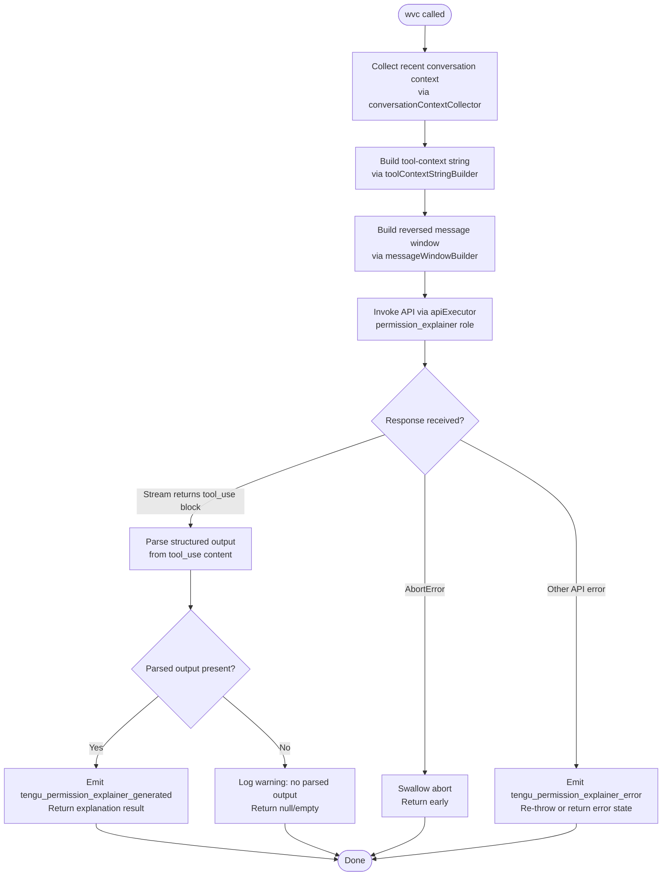

# `/explain_command`

> Analysis basis: CC v2.1.196 bundle.js (AST extraction + Claude interpretation)
> Minimum version: v2.1.196

---

## Overview

`/explain_command` is an internal tool-type slash command that generates a natural-language explanation of why a given tool or permission is being requested. It invokes a dedicated "permission explainer" sub-pipeline against the Anthropic API and returns structured explanatory text to the caller, enabling the UI to display human-readable rationale for tool use authorizations.

---

## Registration

| Field | Value |
|---|---|
| type | `tool` |
| name | `explain_command` |
| description | `null` |
| loc_byte | `15019754` |
| loc_byte_end | `15019790` |
| loc_line | `11523` |
| arbor_handler.name | `wvc` |
| arbor_handler.fqn | `claude-2.1.196::wvc` |
| arbor_handler.kind | `AsyncFunction` |
| arbor_handler.resolution_path | `direct` |
| arbor_handler.n_hits | `1` |

Analysis basis: CC v2.1.196 bundle.js:+15019754

---

## Input Branching

The handler has four or more distinct outcome branches (success with parsed output, abort/cancel, API error, and missing-output fallback), warranting a Mermaid flowchart.



Analysis basis: CC v2.1.196 bundle.js:+15019449, +15019494, +15019512, +15019659, +15019672, +15020079, +15020237, +15020339, +15020449, +15020584, +15020788, +15020907, +15020978

---

## Behavioral Spec

### 1. Handler Entry — `mainHandler` (`wvc`)

The handler is an `AsyncFunction` resolved via the `direct` Arbor path.

```
async function mainHandler(input):
    startTime = Date.now()                          // +15019473
    contextMessages = conversationContextCollector(input)   // calls EYo → Dt
    toolContextStr  = toolContextStringBuilder(contextMessages)  // calls STm
    messageWindow   = messageWindowBuilder(contextMessages)      // calls ATm
    apiResult       = await apiExecutor(toolContextStr, messageWindow)  // calls Ts, then FU
    parsedOutput    = extractToolUseBlock(apiResult)
    if parsedOutput is null:
        log("Permission explainer: no parsed output in response")  // +15020584
        return null
    emit("tengu_permission_explainer_generated")    // +15020237
    return parsedOutput
```

Analysis basis: CC v2.1.196 bundle.js:+15019449

---

### 2. Conversation Context Collection — `conversationContextCollector` (`EYo`)

Delegates to the config-and-file loader (`Dt`) which reads the active conversation history and config state from disk.

```
function conversationContextCollector(input):
    config = configLoader()           // Dt → lIt reads config file (+14155663)
    messages = config.messages
    return messages
```

- Config file read uses `r.readFileSync` with encoding `"utf-8"`. Analysis basis: CC v2.1.196 bundle.js:+14159438
- If config is accessed before initialization, throws `"Config accessed before allowed."`. Analysis basis: CC v2.1.196 bundle.js:+14159382
- On `ENOENT`, the loader treats the file as absent and continues. Analysis basis: CC v2.1.196 bundle.js:+14159648
- Backup management uses a `"backups"` subdirectory. Analysis basis: CC v2.1.196 bundle.js:+14158950

---

### 3. Tool-Context String Builder — `toolContextStringBuilder` (`STm`)

Serializes relevant context into a compact string passed to the API call.

```
function toolContextStringBuilder(messages):
    // Filters to last 2 assistant messages (+15018974, value 2)
    // Truncates each message text at 1000 chars (+15019018, value 1000)
    // Joins with role label "assistant" (+15019053)
    // Returns up to 3 items (+15019073, value 3)
    // Uses JSON.stringify via Me for object values
    filtered = messages
        .filter(m => m.role == "assistant")
        .slice(-2)
    parts = filtered.map(m => truncate(stringify(m.content), 1000))
    return parts.join("\n")
```

Analysis basis: CC v2.1.196 bundle.js:+15018964, +15018974, +15019018, +15019053, +15019073

---

### 4. Message Window Builder — `messageWindowBuilder` (`ATm`)

Builds a bounded, reversed message window for the API prompt context.

```
function messageWindowBuilder(messages):
    // Filters messages by type "text" (+15019156)
    // Reverses the list (+15019098)
    // Inserts "..." ellipsis marker when truncating (+15019249)
    // Joins segments using GL (surrogate-safe char slicer, +15019241)
    //   GL checks charCodeAt against surrogate range 55296–56319 (+204043, +204053)
    // Prepends metadata with r.unshift (+15019257)
    // Joins final array (+15019290)
    eligible = messages.filter(m => m.type == "text")
    reversed = eligible.reverse()
    window   = buildSurrogateSafeString(reversed, ellipsis="...")
    return window
```

Analysis basis: CC v2.1.196 bundle.js:+15019030, +15019098, +15019156, +15019241, +15019249, +15019257, +15019290

---

### 5. API Executor — `apiExecutor` (`Ts` → `FU`)

Submits the assembled prompt to the Anthropic API using the standard streaming client.

```
async function apiExecutor(toolContext, messageWindow):
    // Builds request via modelResolver (d6 → Fa → jo → VPt etc.)
    // Uses role "permission_explainer" (+15019812)
    // Sends via fullApiClient (FU) which wraps hV (the HTTP client)
    // hV sets headers: User-Agent, X-Claude-Code-Session-Id,
    //   x-client-app, x-claude-code-agent-id (+3056028 … +3056204)
    // Applies streaming with byte watchdog: idle timeout 15000 ms (+3062750),
    //   max timeout 120000 ms (+3062768)
    // Returns streamed response object
    request = buildRequest(toolContext, messageWindow, role="permission_explainer")
    response = await streamingHttpClient(request)
    return response
```

- `"permission_explainer"` role literal: Analysis basis: CC v2.1.196 bundle.js:+15019812
- `"permission_explainer_generate"` string used for scoping: Analysis basis: CC v2.1.196 bundle.js:+15020339
- Byte watchdog idle threshold: 15 000 ms. Analysis basis: CC v2.1.196 bundle.js:+3062750
- Byte watchdog total cap: 120 000 ms. Analysis basis: CC v2.1.196 bundle.js:+3062768
- Event `"cli_byte_watchdog_fired"` emitted on watchdog trigger. Analysis basis: CC v2.1.196 bundle.js:+3063703

---

### 6. Structured Output Extraction — `outputExtractor` (`ETm`)

Parses the API response for a `tool_use` content block.

```
function outputExtractor(apiResponse):
    // Looks for content block with type "tool_use" (+15019967)
    // Returns the parsed input field of that block
    // If no such block found, returns null and caller logs warning
    for block in apiResponse.content:
        if block.type == "tool_use":
            return block.input
    return null
```

Analysis basis: CC v2.1.196 bundle.js:+15019967, +15020079

---

### 7. Error Handling

```
try:
    result = await apiExecutor(...)
    parsed = outputExtractor(result)
    ...
catch AbortError:
    // Silently return; user cancelled  (+15020907)
    return null
catch other Error:
    emit("tengu_permission_explainer_error")   // +15020449
    // propagate or return error state
    raise
```

- `"AbortError"` name check used to distinguish user cancellation. Analysis basis: CC v2.1.196 bundle.js:+15020907
- `"api_error"` tag used for non-abort failures. Analysis basis: CC v2.1.196 bundle.js:+15020978

---

## State & Side Effects

| Item | Detail |
|---|---|
| Telemetry — success | `tengu_permission_explainer_generated` (bundle.js:+15020237) |
| Telemetry — error | `tengu_permission_explainer_error` (bundle.js:+15020449) |
| Telemetry — API success | `tengu_api_success` (bundle.js:+8707497) |
| Telemetry — surrogate sanitized | `tengu_lone_surrogate_sanitized` (bundle.js:+8707193) |
| Telemetry — byte watchdog late | `tengu_byte_watchdog_fired_late` (bundle.js:+3063801) |
| Telemetry — config parse error | `tengu_config_parse_error` (bundle.js:+14160796) |
| Telemetry — config auth loss | `tengu_config_auth_loss_prevented` (bundle.js:+14153957) |
| Hook registration | None detected within depth-2 traversal |
| appState changes | None directly; result is returned to caller |
| File I/O | Reads config via `readFileSync` (utf-8); may write config backups to `"backups"` subdirectory |
| Network | One streaming HTTPS request to Anthropic API (`https://api.anthropic.com`) |
| Sound | None detected |

---

## Version History

| Version | Change |
|---|---|
| v2.1.196 | Initial analysis |

---

## Common Mistakes

1. **Treating this as a user-facing slash command.** `explain_command` is registered as `type: "tool"` and is called programmatically by the permission UI, not typed interactively by the user in the REPL.
2. **Expecting a non-null result unconditionally.** The handler can return `null` if the API response contains no `tool_use` content block; callers must guard against this.
3. **Ignoring the `AbortError` path.** If the user dismisses a permission prompt mid-flight, the command is cancelled silently. Downstream code that awaits the result must handle `null` gracefully.
4. **Confusing `"permission_explainer"` with `"permission_explainer_generate"`.** The former is the API role/context label; the latter is the telemetry/scoping string — they are distinct literals.
5. **Assuming synchronous execution.** The handler is an `AsyncFunction`; callers must `await` it or attach `.then()`.

---

## Appendix — Identifier Mapping

> For bundle debugging only. Identifiers change across versions.

| Identifier | Role |
|---|---|
| `wvc` | Main handler for `explain_command` (AsyncFunction) |
| `EYo` | Conversation context collector (calls config loader) |
| `Dt` | Config-and-file loader (reads project config, history) |
| `qt` | Config state accessor / getter utility |
| `sqo` | Config schema validator |
| `lIt` | Config file reader and backup manager |
| `Gt` | JSON parser wrapper |
| `V5` | String prefix stripper |
| `rn` | Logger / reporter utility |
| `lqo` | Directory reader for config backup listing |
| `T` | Log-level dispatcher (debug/error/warn routing) |
| `uqo` | Backup path joiner |
| `Ldm` | Config watcher / file-watch registration |
| `bkt` | File-watch bind helper |
| `ege` | Config change event emitter |
| `vi` | Hook registrar (`fis.register`) |
| `STm` | Tool-context string builder |
| `Me` | JSON stringify wrapper |
| `ATm` | Message window builder (filter + reverse + join) |
| `GL` | Surrogate-safe string slicer |
| `Ts` | API request orchestrator (model resolution + dispatch) |
| `d6` | Model resolver sub-step |
| `Fa` | Model-tier resolution and policy mapping engine |
| `bMt` | Model policy bitmask loader |
| `TMt` | Model tier mapper |
| `qte` | Auth context builder (firstParty / gateway path) |
| `Z8` | Auth header assembler |
| `w0` | Provider/feature flag checker |
| `Wbn` | Recursive tier default resolver |
| `Jai` | Policy entry iterator |
| `fn` | Feature gate evaluator |
| `Crt` | Model capability resolver |
| `Yai` | Model family identifier |
| `tHd` | Tier-to-model mapping helper |
| `jo` | Full model name resolver (handles aliases: fable, sonnet, haiku, opus, best) |
| `VPt` | Model string normaliser (lowercase, prefix check) |
| `nHd` | Model name header builder |
| `SH` | System-header builder |
| `jC` | Prompt construction orchestrator |
| `NEr` | System prompt prefix injector |
| `f6` | Prompt template selector |
| `Zai` | Prompt section assembler (ZPt/QPt compositor) |
| `$9r` | Tool-definition serialiser |
| `ZPt` | Full prompt renderer (handles active/inactive/refused states) |
| `QPt` | Prompt context window trimmer |
| `FU` | Full API client (HTTP streaming, auth, retry, side-query) |
| `cf` | Response router (main vs side-query) |
| `Rt` | Request dispatcher core |
| `hV` | HTTP streaming client (headers, OAuth, watchdog, model routing) |
| `CY` | HTTP client config builder |
| `bqr` | HTTP header line parser |
| `Hi` | HTTP client initialiser |
| `VY` | Session-store accessor |
| `Zbn` | Async local storage getter |
| `V9r` | URL encoder for special characters |
| `ct` | Content-type / string conversion utility |
| `ph` | OAuth token refresher coordinator |
| `ELn` | OAuth refresh executor |
| `sli` | Boolean coercion helper |
| `aE` | Auth resolver (API key / OAuth / helper) |
| `Hd` | Auth header builder |
| `cb` | Auth profile selector (user_oauth / profile-implicit) |
| `Lc` | Auth header formatter |
| `aI` | API key env-var reader |
| `TH` | Auth initialiser (ANTHROPIC_API_KEY, apiKeyHelper, none) |
| `AUt` | Auth helper validator |
| `Jst` | Token string builder |
| `Rm` | Request metadata recorder |
| `MDd` | Model-dispatch router (Bedrock / Vertex / Anthropic) |
| `$st` | Request timestamp stamper |
| `vr` | Vertex auth credential resolver |
| `iyn` | Proxy auth helper invoker |
| `f3e` | Proxy helper config reader |
| `n6s` | Proxy helper argument builder |
| `hQu` | Numeric env-var parser |
| `YM` | Proxy environment variable reader |
| `ow` | Low-level proxy runner |
| `FDd` | Fetch dispatcher with UUID tracking and streaming |
| `Hr` | Request header finaliser |
| `Mwi` | Stream writer helper |
| `vqr` | Streaming response handler |
| `BDd` | Response header inspector (authorization, anthropic-beta, x-anthropic-*) |
| `Dwi` | Streaming content-type checker |
| `kwi` | SSE / event-stream decoder |
| `Iqr` | Byte-budget calculator (min/max clamping) |
| `UDd` | Byte-stream watchdog (setTimeout / clearTimeout, idle detection) |
| `l_` | Accept-header and language negotiator |
| `aPt` | Accept-header builder |
| `Efd` | Header prefix filter (`anthropic.`) |
| `V8` | Case-insensitive header value normaliser |
| `E3` | Bedrock endpoint resolver |
| `cBe` | AWS region resolver |
| `xg` | Proxy URL builder and validator |
| `_l` | String-to-URL converter |
| `W8` | Proxy protocol and port parser |
| `ztt` | No-proxy list evaluator |
| `$Ur` | IP / CIDR allowlist checker |
| `GUr` | Proxy credentials encoder |
| `$Dd` | Dual-stream multiplexer (kwi + Lwi) |
| `Lwi` | Secondary stream writer |
| `DDd` | Daemon connection pool manager |
| `Qwn` | Worker session request router |
| `TQe` | Connection type classifier |
| `vae` | Git bare-repo detector |
| `M4r` | Model-to-worker affinity mapper |
| `Us` | OAuth URL sanitiser and validator |
| `VLe` | Gateway JWT refresh orchestrator |
| `DSr` | Gateway auth state diffuser |
| `H_d` | Gateway token HTTP POST handler |
| `Fin` | Auth finaliser |
| `RSr` | Request start-time stamper |
| `Pxe` | SDK warning/error logger (`[Anthropic SDK ERROR/WARN/INFO/DEBUG]`) |
| `D` | Daemon write-channel |
| `d` | Terminal/pty write helper |
| `x` | Cookie header parser |
| `k` | File-watcher and interval manager |
| `O` | Background worker sweep orchestrator |
| `w` | Away-summary eligibility checker |
| `L` | Away-summary generator |
| `UOc` | Message array tail accessor (`e.at`) |
| `$Oc` | Grace-clock advance and pinned-worker set manager |
| `mw` | Auth-change signal handler (calls TH) |
| `qLe` | WIF (Workload Identity Federation) credential resolver |
| `got` | WIF token exchange HTTP client |
| `xe` | Feature flag `tengu_feature_ok` emitter |
| `ke` | Feature flag `tengu_feature_bad` emitter |
| `A_d` | WIF error classifier (http_4xx / http_5xx / parse / network_error) |
| `I` | OAuth token getter |
| `M` | Gateway HTTP handler (full routing: device auth, session mint, managed settings, etc.) |
| `A` | User-info fetcher |
| `h` | Background session dispatcher (main spawn loop) |
| `j` | Worker graceful-kill helper |
| `P` | Worker process reference |
| `On` | Socket connection helper with abort/timeout |
| `c` | Background session state machine |
| `CYe` | Memory pressure monitor |
| `Crm` | Memory metric collector |
| `Lrm` | macOS memory reader via `bun:ffi` |
| `N6e` | Pins-file reader and cleanup (`pins.json`) |
| `pBt` | Pin path builder |
| `Sn` | Notification sender |
| `wQd` | Recursive directory lstat walker |
| `Re` | Error logger with ring-buffer (`zfn.shift` / `zfn.push`) |
| `er` | Error string formatter |
| `zi` | Error classifier (`essential-traffic`) |
| `_Nu` | Error queue manager |
| `z` | MCP connection lifecycle manager |
| `E` | MCP SDK connection wrapper |
| `_hr` | MCP connection result applier |
| `q` | MCP slot config accessor |
| `Sje` | MCP state merger (`zMe`) |
| `W` | Foreground process push target |
| `K` | Backspace / keyboard event handler |
| `it` | Tool-invocation tracker (dedup via `z7r` / `t0e`) |
| `iRn` | Tool-call deduplication guard |
| `_ns` | Background session claim sender (socket write) |
| `Cqo` | Claim-frame file writer |
| `f9m` | Claim send timeout handler |
| `p9m` | Claim frame builder |
| `ad` | Log adapter (`rn`) |
| `he` | String coercion logger |
| `tM` | Binary frame encoder (Buffer, UInt32BE, UInt8) |
| `bns` | Background session lifecycle handler (spawn, state, retire) |
| `mc` | Session path builder |
| `Ar` | Session archive helper |
| `Yi` | Session state file reader/writer |
| `Kh` | Session state transformer (`V0`) |
| `wRe` | Session filter / allowlist evaluator |
| `zd` | Session directory metadata writer |
| `kAt` | Lazy initialisation sequencer |
| `AXt` | Session artefact path builder |
| `_Te` | Session teardown path builder (`BNe`) |
| `oM` | Orphan-session remover |
| `HR` | Session roster entry writer |
| `tP` | Session roster late-entry handler |
| `xZ` | Session ID splitter and path constructor |
| `SXt` | Session state file initialiser |
| `p` | Process exit controller |
| `g` | Session state snapshot helper |
| `f` | Low-level state writer (`L8`) |
| `Oe` | Observer / event emitter (`$Xe`) |
| `Y` | Session disposer (`ytn`) |
| `L4e` | Claude-3 model family gate |
| `io` | Model capability inspector (Crt + O_) |
| `O_` | Model string normaliser (lowercase, slice, includes) |
| `sp` | System-prompt text replacer |
| `AN` | Accept-language header builder |
| `Yle` | Managed-settings cache reader (`bwt` + `D4r`) |
| `bwt` | Managed-settings in-memory store |
| `D4r` | Managed-settings URL builder (`M4r`) |
| `_` | Tool list reference |
| `vtf` | Tool finder (`e.find` / `n.find`) |
| `tCo` | Request hash generator (`atl.createHash`) |
| `tTn` | Session-cookie builder (`_l`, `Hr`, `Su`, `Zbn`) |
| `Su` | Cookie serialiser (`Trt`) |
| `Trt` | Cookie string formatter (`Irt`) |
| `NRn` | Nonce / request-ID injector |
| `PVe` | Main-thread API caller (repl_main_thread*, auto_mode, memdir_relevance) |
| `Ao` | Concurrent API call coordinator (`aE`, `R3`, `Vs`) |
| `R3` | Array-or-scalar content unwrapper |
| `dAr` | API response duration recorder |
| `pAr` | Response suffix checker |
| `JP` | HIPAA / compliance flag injector |
| `Nqr` | Compliance header builder |
| `w4e` | Compliance config reader |
| `Q8` | Compliance flag validator (`Yrt.includes`) |
| `ctl` | Cache-control header setter |
| `aLn` | Temperature / HV header injector |
| `yw` | Request body array mapper |
| `Jke` | Tool-call executor wrapper |
| `w6` | Tool-call dispatcher (`Dt`, `cqo.randomBytes`, `Hn`) |
| `Hn` | Tool instance runner |
| `Nc` | Tool call context builder (`aE`, `Dt`) |
| `uln` | Tool-result unwrapper (pop + Array.isArray + lln) |
| `lln` | Tool-result line validator (`aln`, `zZc.test`) |
| `CP` | Structured-clone wrapper |
| `YQe` | Tool-result re-packer (pop + lln + cln) |
| `cln` | Tool-result string replacer (`Wls`) |
| `qe` | Event emitter helper (`$Xe`) |
| `O4r` | Response metadata extractor |
| `bci` | Response body validator (match/split/every/test) |
| `P4r` | Managed-settings cache writer |
| `UCe` | Usage counter helper |
| `Mo` | Main observer hook (`$Xe`) |
| `SBt` | Sub-agent tool registry (`eXi`, `_ct`, `EBt`) |
| `eXi` | Built-in agent tool registrar |
| `GQd` | Agent tool set constructor (`XJi.has`, `Wl`, `wOn.has`) |
| `_ct` | Custom agent tool registrar (`Ig`) |
| `Ig` | Tool set event emitter (`$Xe`) |
| `EBt` | Agent tool updater (`_ct`, `yBt`) |
| `yBt` | Agent tool hash generator (`YJi.createHash`) |
| `p2` | Agent tool prefix parser (`BQd`, `QP`) |
| `BQd` | Agent tool URI decoder (`e.startsWith`, `e.slice`, `vOn`, `m7r`) |
| `vOn` | Agent tool variant resolver |
| `m7r` | Agent tool name splitter (indexOf + slice) |
| `QP` | Builtin tool prefix checker (`e.startsWith`) |
| `gwt` | Cache-warming utility |
| `Ui` | MCP tool prefix inspector (`mcp__` check) |
| `wt` | Fallback result emitter (`V`, `Oe`) |
| `ETm` | Structured-output extractor from API response (tool_use block parser) |