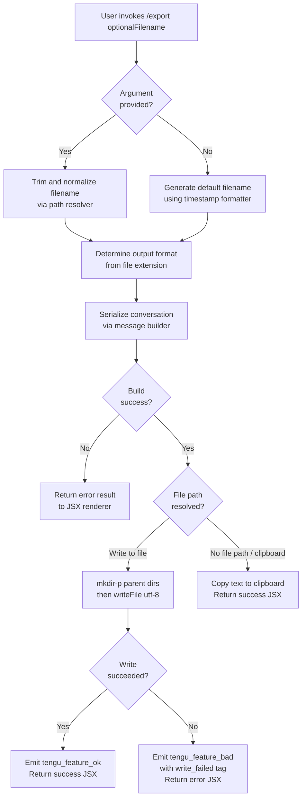

# `/export`

> Analysis basis: CC v2.1.193 bundle.js (AST extraction + Claude interpretation)
> Minimum version: v2.1.193

---

## Overview

The `/export` command serializes the current conversation (messages, roles, and text content) into a structured text representation and writes it either to a file on disk or — when no filename is provided — copies the result to the system clipboard. The command is an `AsyncFunction` handler (`zOf`) loaded via the `Mjl` module and rendered with a JSX result component (`Djl.jsx`).

---

## Registration

| Field | Value |
|---|---|
| type | `local-jsx` |
| name | `export` |
| description | `Export the current conversation to a file or clipboard` |
| argumentHint | `[filename]` |
| module_id | `Mjl` |
| load_inline | `true` |
| loc_byte | `12910570` |
| loc_byte_end | `12910766` |
| loc_line | `8827` |
| arbor_handler.name | `zOf` |
| arbor_handler.fqn | `claude-2.1.193::zOf` |
| arbor_handler.kind | `AsyncFunction` |
| arbor_handler.resolution_path | `module_id` |
| arbor_handler.n_hits | `0` |

Analysis basis: CC v2.1.193 bundle.js:+12910570

---

## Input Branching

Four distinct paths exist based on whether a filename argument is supplied, whether the target path is writable, whether the write succeeds, and which message roles are present during serialization.



---

## Behavioral Spec

### 1. Entry Point — Async Handler (`zOf`)

Analysis basis: CC v2.1.193 bundle.js:+12910020

```
async function exportCommandHandler(context, args):
    rawText = buildConversationText(context)          # calls KOf → Btr → VOf
    trimmedArg = args.trim()                          # bundle.js:+12910029

    if trimmedArg is non-empty:
        outputPath = resolveOutputPath(trimmedArg)    # calls Ftr → BOf → ds
    else:
        outputPath = null

    if outputPath is null:
        result = copyToClipboard(rawText)             # calls we (tengu_feature_ok)
    else:
        result = writeToFile(outputPath, rawText)     # calls Re (tengu_feature_ok / tengu_feature_bad)

    return renderExportResult(result)                 # calls Djl.jsx (bundle.js:+12910402)
```

---

### 2. Conversation Serializer (`KOf` → `Btr` → `VOf`)

Analysis basis: CC v2.1.193 bundle.js:+12910020, +12909964, +12908973

The serializer walks the conversation message list and converts each message to plain text:

```
function buildConversationText(context):
    messages = getMessageList(context)                # VOf inspects message/assistant/user roles
    lines = []

    for each message in messages:
        role = message.role                           # "user" | "assistant" (bundle.js:+12909523, +12908142)
        textContent = extractTextBlocks(message)      # WOf checks Array.isArray (bundle.js:+12908282)
        stripped = stripAnsiCodes(textContent)        # Al → Bun.stripANSI (bundle.js:+3953820)

        if role == "export" or role == "prompt":      # literals bundle.js:+12908650, +12908666
            lines.push(formatBlock(role, stripped))
        else:
            lines.push(formatBlock(role, stripped))

    return lines.join("\n")                           # Btr → r.join (bundle.js:+12909018)
```

The helper `VOf` additionally checks teammate status (`e.isTeammate`) and plan-mode requirements (`e.isPlanModeRequired`) before including certain messages, and branches on connection state (literal `"connecting"`, bundle.js:+7233486) and verbose-mode flags (`"none"` / `"convo"`, bundle.js:+7233255, +7233270).

---

### 3. Message Role Finder (`Rjl`)

Analysis basis: CC v2.1.193 bundle.js:+12910267, +12909502

```
function findRelevantMessage(messageList, role):
    match = messageList.find(m => m.role == role)    # e.find (bundle.js:+12909502)
    if match is null: return null

    trimmedContent = match.content.trim()            # n.trim (bundle.js:+12909618)

    if Array.isArray(trimmedContent):                # (bundle.js:+12909635)
        textBlock = trimmedContent.find(              # n.find (bundle.js:+12909659)
            b => b.type == "text"                    # literal "text" bundle.js:+12909680
        )
        rawText = textBlock?.text ?? ""
    else:
        rawText = trimmedContent

    formatted = applyTextDedenting(rawText)          # Dd → di (bundle.js:+12909726)
    return formatted.substring(0, 50)                # r.substring, limit 50 (bundle.js:+12909741, +12909746)
```

Note: The numeric constants `50` (bundle.js:+12909741) and `49` (bundle.js:+12909760) appear to be used for preview/truncation of message content in the UI representation layer.

---

### 4. Timestamp-Based Default Filename Generator (`qOf`)

Analysis basis: CC v2.1.193 bundle.js:+12910285

When no filename argument is provided, a default export filename is generated from the current local date and time:

```
function generateDefaultFilename(now = new Date()):
    year   = now.getFullYear()                       # bundle.js:+12909228
    month  = String(now.getMonth() + 1).padStart(2, "0")  # bundle.js:+12909253
    day    = String(now.getDate()).padStart(2, "0")  # bundle.js:+12909294
    hours  = String(now.getHours()).padStart(2, "0") # bundle.js:+12909332
    mins   = String(now.getMinutes()).padStart(2, "0")# bundle.js:+12909371
    secs   = String(now.getSeconds()).padStart(2, "0")# bundle.js:+12909412
    return `claude-export-{year}{month}{day}-{hours}{mins}{secs}.md`
```

---

### 5. Extension-Aware Output Format Resolver (`BOf`)

Analysis basis: CC v2.1.193 bundle.js:+12905604, +12905528

```
function resolveOutputFormat(rawPath):
    ext = path.extname(rawPath)                      # $tr.extname (bundle.js:+12905528)
    resolvedPath = resolveFilesystemPath(rawPath)    # ds (bundle.js:+12905568)
    return { ext, resolvedPath }
```

The path resolver `ds` performs full normalization: NFC Unicode normalization (bundle.js:+66382, literal `"NFC"` bundle.js:+66394), tilde expansion (literal `"~/"` bundle.js:+1097092), home-directory lookup (`Pln.homedir`, bundle.js:+1097061), Windows drive detection (literal `"windows"` bundle.js:+1097161), absolute-path resolution (`s1.resolve`, bundle.js:+1097275), and null-byte rejection (literal `"Path contains null bytes"` bundle.js:+1096964).

---

### 6. File Writer (`Ftr`)

Analysis basis: CC v2.1.193 bundle.js:+12905604, +12905624, +12905671

```
async function writeExportFile(resolvedPath, content):
    parentDir = path.dirname(resolvedPath)           # $tr.dirname (bundle.js:+12905634)
    await fs.mkdir(parentDir, { recursive: true })   # Utr.mkdir (bundle.js:+12905624)
    await fs.writeFile(resolvedPath, content, "utf-8") # Utr.writeFile, encoding "utf-8" (bundle.js:+12905699)
```

Parent directories are created recursively before writing. The encoding is always `"utf-8"` (bundle.js:+12905699).

---

### 7. Telemetry Wrappers (`we` / `Re`)

Analysis basis: CC v2.1.193 bundle.js:+12910069, +12910132

```
function reportSuccess(label):                       # we
    emitTelemetry("tengu_feature_ok", { label })    # bundle.js:+1026754
    return buildOkResult()

function reportFailure(label, err):                  # Re
    emitTelemetry("tengu_feature_bad", { label, err }) # bundle.js:+1026821
    return buildErrorResult(err)
```

On a successful clipboard or file write, `"export_file"` (bundle.js:+12910072) is passed as the label to `reportSuccess`. On write failure, `"write_failed"` (bundle.js:+12910149) is passed to `reportFailure`. A fallback error message `"Unknown error"` (bundle.js:+12910230) is used when the caught exception carries no message.

---

### 8. Format Normalizer for Role Labels (`kjl`)

Analysis basis: CC v2.1.193 bundle.js:+12910313, +12909805

```
function normalizeRoleLabel(roleString):
    return roleString.toLowerCase()                  # e.toLowerCase (bundle.js:+12909805)
```

Role strings (e.g. `"user"`, `"assistant"`) are downcased before inclusion in the serialized output.

---

## State & Side Effects

| Item | Detail |
|---|---|
| Telemetry: `tengu_feature_ok` | Emitted on successful file write or clipboard copy; label `"export_file"` (bundle.js:+12910072, +1026754) |
| Telemetry: `tengu_feature_bad` | Emitted on write failure; label `"write_failed"` (bundle.js:+12910149, +1026821) |
| File system: mkdir | Parent directories of the target path are created recursively (bundle.js:+12905624) |
| File system: writeFile | Target file written with `utf-8` encoding (bundle.js:+12905699) |
| ANSI stripping | All ANSI escape codes are stripped from message text via `Bun.stripANSI` before export (bundle.js:+3953820) |
| Path normalization | Full NFC + tilde + homedir + absolute resolution applied to user-supplied paths (bundle.js:+1097023, +1097061) |
| Clipboard | Used when no filename argument is provided (inferred from branching around `outputPath == null`) |
| JSX renderer | `Djl.jsx` renders the final success/error result displayed to the user (bundle.js:+12910402) |
| Background session guard | `yn` at bundle.js:+17520224 checks for `"stopped"` / `"background session"` state before proceeding |
| Process exit | `process.exit` reachable via `Is` → error path (bundle.js:+13300667) — only on fatal CLI error |

---

## Version History

| Version | Change |
|---|---|
| v2.1.193 | Initial analysis |

---

## Common Mistakes

1. **Forgetting that the argument is optional**: Omitting the filename is valid and intentional — the command copies to clipboard in that case. Passing an empty string has the same effect as omitting the argument (trimmed to `""`, treated as no-arg).
2. **Assuming any file extension triggers special formatting**: The extension is detected via `path.extname` and passed through the format resolver, but the serialized content is always UTF-8 plain text (Markdown-friendly). There is no detected JSON/HTML export branch at this traversal depth.
3. **Expecting tilde paths to fail**: The path resolver fully expands `~/` using `os.homedir()`, so `~/Documents/chat.md` is a valid argument.
4. **Assuming the directory must pre-exist**: The writer calls `mkdir` with `{ recursive: true }` — missing parent directories are created automatically.
5. **Ignoring ANSI codes in piped output**: If you redirect Claude Code output into the export source, ANSI codes are stripped before serialization, so the exported file is always clean text.

---

## Appendix — Identifier Mapping

> For bundle debugging only. Identifiers change across versions.

| Identifier | Role |
|---|---|
| `zOf` | Main async export command handler (entry point) |
| `KOf` | Conversation-text build coordinator; calls `Btr` |
| `Btr` | Message list iterator; assembles line array and joins |
| `VOf` | Per-message content extractor; checks roles, teammate/plan-mode flags |
| `jOf` | Sub-helper called by `VOf` (role/content processing detail) |
| `gV` | Message display-mode classifier (plan/default/none/convo/connecting) |
| `$pt` | UI component helper; attaches event listeners and renders inline |
| `WOf` | Array-check utility for message content blocks |
| `Rjl` | Role-based message finder; trims content and delegates to `Dd` |
| `kjl` | Role-label lowercase normalizer |
| `qOf` | Timestamp-to-default-filename formatter |
| `Ftr` | File write orchestrator (mkdir + writeFile) |
| `BOf` | File extension detector and path-format resolver |
| `ds` | Full filesystem path normalizer (NFC, tilde, homedir, absolute) |
| `Al` | ANSI-stripping wrapper around `Bun.stripANSI` |
| `Dd` | Text dedenter utility; delegates to `di` |
| `di` | Low-level indent-strip using `indexOf` / `slice` |
| `we` | Success telemetry wrapper (`tengu_feature_ok`) |
| `Re` | Failure telemetry wrapper (`tengu_feature_bad`) |
| `Oe` | Telemetry dispatch helper; calls `Zze` |
| `Zze` | Core telemetry emitter |
| `V` | Shared result-builder used by `we` and `Re` |
| `Is` | Fatal CLI error handler; calls `process.exit` |
| `Pt` | Path utility base; calls `Eln` and `mr` |
| `NH` | Unicode NFC normalizer wrapper |
| `s` | Background-session lifecycle manager (add/finally/delete) |
| `c` | Background session state checker (`yn`) |
| `Djl` | JSX result renderer for export success/error display |

---

Note: index built via Arbor fallback; some signals (telemetry, literals) may be missing — see arbor-fallback.js.