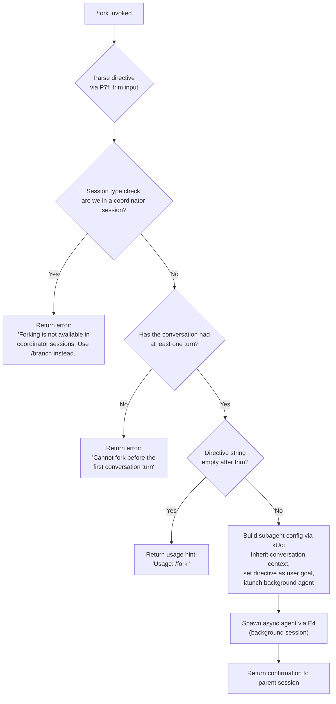

# `/fork`

> Analysis basis: CC v2.1.196 bundle.js (AST extraction + Claude interpretation)
> Minimum version: v2.1.196

---

## Overview

`/fork` spawns a new background agent that inherits the full current conversation context and is directed by a caller-supplied directive. The forked agent runs asynchronously and independently of the parent session. The command is blocked in coordinator sessions and requires at least one prior conversation turn before it can execute.

---

## Registration

| Field | Value |
|---|---|
| type | `local-jsx` |
| name | `fork` |
| description | `Spawn a background agent that inherits the full conversation` |
| argumentHint | `<directive>` |
| module_id | `wQl` |
| load_inline | `true` |
| loc_byte | `12910629` |
| loc_byte_end | `12910832` |
| loc_line | `8904` |
| arbor_handler.name | `P7f` |
| arbor_handler.fqn | `claude-2.1.196::P7f` |
| arbor_handler.kind | `AsyncFunction` |
| arbor_handler.resolution_path | `module_id` |
| arbor_handler.n_hits | `0` |

Analysis basis: CC v2.1.196 bundle.js:+12910629

---

## Input Branching

The handler has four distinct branches, so a Mermaid flowchart is used.



Analysis basis: CC v2.1.196 bundle.js:+12910188 (directive trim), +12910321 (coordinator check), +12910399 (no-turn error literal), +12910212 (usage string)

---

## Behavioral Spec

### Top-level handler: forkCommandHandler (P7f)

```
async function forkCommandHandler(userInput, sessionContext):
    directive = userInput.trim()                          // +12910188

    // Guard 1: coordinator sessions may not fork
    if sessionContext is coordinator mode:                 // +12910321
        return error("Forking is not available in coordinator sessions. Use /branch instead.")

    // Guard 2: directive must not be empty
    if directive is empty:
        return usageHint("Usage: /fork <directive>")      // +12910212

    // Guard 3: at least one turn must exist
    if no prior conversation messages:                    // +12910399
        return error("Cannot fork before the first conversation turn")

    // Build the subagent configuration
    config = buildSubagentConfig(sessionContext, directive)  // kUo

    // Launch the background agent
    launchBackgroundAgent(config)                           // E4

    return confirmation to parent session
```

Analysis basis: CC v2.1.196 bundle.js:+12910188, +12910280

---

### Subagent configuration builder (kUo)

```
function buildSubagentConfig(sessionContext, directive):
    // Collect system context
    systemPrompt = buildSystemPrompt(sessionContext)       // hPf → zk
    replContexts = sessionContext.getReplContexts()        // +11486267

    // Snapshot the current conversation for inheritance
    conversationSnapshot = snapshotTranscript(sessionContext)   // Ur, +11486799

    // Generate a unique session identifier
    sessionId = generateSessionId()                        // TP, +11486473
    timestamp = Date.now()                                 // +11486500

    // Record telemetry: subagent launch and fork coordinator mode
    recordTelemetry("subagent_launch")                     // +11486036
    recordTelemetry("subagent_fork_coordinator_mode")      // +11486054

    // Validate that a directive was supplied; if missing, log
    if directive is missing:
        recordTelemetry("subagent_fork_prompt_missing")    // +11486178

    // Assemble config object for the background session
    config = {
        type: "fork",                                      // +11486227
        mode: "background",
        directive: directive,
        sessionId: sessionId,
        timestamp: timestamp,
        conversationHistory: conversationSnapshot,
        systemPrompt: systemPrompt,
        replContexts: replContexts,
        maxHistoryTurns: 50,                               // +11486443
    }

    // Wrap in an async execution environment
    asyncEnv = buildAsyncEnvironment(config)               // nV, mEt

    return asyncEnv
```

Analysis basis: CC v2.1.196 bundle.js:+11486021, +11486033, +11486140, +11486362, +11486394, +11486403, +11486446, +11486473, +11486500, +11486513, +11486536

---

### System-prompt assembly for the forked agent (hPf → zk)

The system-prompt builder (`hPf`) calls `zk`, an extensive prompt-construction function that assembles the full system context delivered to the background agent. Key facts extracted from literals:

- The agent is told its text output is what the user reads; thinking and raw tool results are not user-visible. (Analysis basis: CC v2.1.196 bundle.js:+13848791)
- Code should match the surrounding codebase in style, naming, and comment density. (Analysis basis: CC v2.1.196 bundle.js:+13851381)
- Hard-to-reverse or outward-facing actions must be confirmed first unless durably authorized. (Analysis basis: CC v2.1.196 bundle.js:+13852905)
- The forked agent is told it is running as a background session (`bg`). (Analysis basis: CC v2.1.196 bundle.js:+13875098, +13880650)
- If operating inside a git worktree the agent is instructed to run all commands from the worktree directory and never `cd` to the original repo root. (Analysis basis: CC v2.1.196 bundle.js:+13877151)
- Tool results from external sources may contain prompt-injection attempts; the agent is instructed to flag such cases to the user before continuing. (Analysis basis: CC v2.1.196 bundle.js:+13858505)
- The conversation is not limited by the context window because prior messages are automatically compressed. (Analysis basis: CC v2.1.196 bundle.js:+13858694)
- Agent bash threads always have their `cwd` reset between calls; only absolute file paths are reliable. (Analysis basis: CC v2.1.196 bundle.js:+13879636)

System-prompt sections identified via `zk` call graph include: environment info (`env_info_static`, `env_info_simple`), language, output style, background-session marker, worktree context, memory/scratchpad (`iFt`), context-management settings (`slm`), reproduce-verify workflow, and flag settings (`llm`). (Analysis basis: CC v2.1.196 bundle.js:+13874232)

---

### Conversation snapshot for context inheritance (Ur)

```
function snapshotTranscriptForFork(sessionContext):
    appState = sessionContext.getAppState()               // +11145748
    lastMessage = appState.messages.findLast(isAssistant) // +11145828

    // Determine working directory and tool permissions from context
    contextProps = {
        working_directory: appState.workingDirectory,     // "working_directory" +11145853
        allowed_tools:     appState.allowedTools,         // "allowed_tools"     +11145908
        disallowed_tools:  appState.disallowedTools,      // "disallowed_tools"  +11145963
        avoid_prompts:     appState.avoidPrompts,         // "avoid_prompts"     +11146024
        permission_mode:   appState.permissionMode,       // "permission_mode"   +11146126
        bypassPermissions: appState.bypassPermissions,    // "bypassPermissions" +11146157
        session:           appState.session,              // "session"           +11146456
        effort:            appState.effort,               // "effort"            +11146481
        model:             appState.model,                // "model"             +11146494
        max_thinking_tokens: appState.maxThinkingTokens,  // +11146506
        flag_settings:     appState.flagSettings,         // "flag_settings"     +11146532
    }

    // Build fork context reference key used for session linking
    forkContextRef = buildForkContextRef()                // "fork-context-ref"  +13635200

    return { lastMessage, contextProps, forkContextRef }
```

Analysis basis: CC v2.1.196 bundle.js:+11145748, +11145828, +11145926, +11145984, +11146179

---

### Background-agent launcher (E4)

`E4` is the main background-agent entry function. It:

1. Resolves MCP tool lists, skill listings, and hook registrations.
2. Opens a new isolated execution context (subagent session ID generated via `s0o.randomUUID`, +11501432).
3. Stores the forked agent in the task registry (`mEt` → `Wbe`) and links it to a file-system worktree when appropriate.
4. Calls `pn.getPromptForCommand` (+11502189) to obtain the per-command prompt for tool resolution, then enters the main query loop (`$qe` / `tRf`).
5. Manages the lifecycle (start → running → completed/failed) and fires telemetry throughout.

Key literals from `E4`'s subgraph:
- Agent type recorded as `"subagent"` (+11486982) and spawn event as `"spawn"` (+11487072).
- Background mode flagged as `"background"` (+9221880).
- Task-registry statuses: `"pending"`, `"running"`, `"completed"`, `"failed"` (Analysis basis: CC v2.1.196 bundle.js:+13725555, +10804928, +10798069, +10800373).
- Maximum default turns enforced; telemetry `tengu_forked_agent_default_turns_exceeded` fires when reached. (Analysis basis: CC v2.1.196 bundle.js:+11144599)

```
async function launchBackgroundAgent(config):
    agentId = crypto.randomUUID()
    taskRegistry.register(agentId, status="pending")     // mEt

    // Create file-system workspace (worktree / symlink)
    workspace = setupWorkspace(config)                   // Wbe

    // Build initial message list from inherited conversation
    messages = buildInheritedMessages(config)            // mQn
    messages = trimToMaxHistory(messages, limit=50)      // +11486443 / a.slice

    // Open the query loop in background mode
    result = await runQueryLoop(messages, config)        // $qe / tRf

    taskRegistry.update(agentId, status="completed")
    return result
```

Analysis basis: CC v2.1.196 bundle.js:+9499149, +9499208, +9499263, +9499300, +9501432, +9501477, +9502049, +9502189

---

### Message inheritance filter (mQn)

The function `mQn` trims and filters the parent conversation before passing it to the forked agent. It distinguishes:
- `"assistant"` messages (+10296725)
- `"tool_use"` blocks (+10296055)
- `"tool_result"` blocks (+10296214) — marking errored results as `"err"` (+10296259) or successful ones as `"ok"` (+10296330)

It removes code-execution artefacts and ensures the forked agent receives a coherent, replayable history slice. (Analysis basis: CC v2.1.196 bundle.js:+10296637)

---

### Workspace file-system setup (Wbe)

```
function setupWorkspace(config):
    // Create required directories
    makeDirectory(workspacePath)                          // Qjo → vB.mkdir

    // Build a symlink from the agent's working directory to the real repo
    symlinkTarget = resolveRealpath(cwd)                 // $im → vB.realpath
    try:
        vB.symlink(realpath, agentWorkdir)               // +13724523
    except EEXIST:
        // Symlink already exists; skip                  // "EEXIST" +13724559

    // Link fork-context reference file
    writeContextFile(forkContextRef)                     // jm → Wft

    // Track in task registry
    taskRegistrySet.add(agentId)                         // Aur
```

Analysis basis: CC v2.1.196 bundle.js:+13724431, +13724456, +13724483, +13724523, +13724551, +13724582

---

## State & Side Effects

| Item | Detail |
|---|---|
| Telemetry — subagent_launch | Fired by `kUo` when fork begins (+11486036) |
| Telemetry — subagent_fork_coordinator_mode | Fired when coordinator mode is detected (+11486054) |
| Telemetry — subagent_fork_prompt_missing | Fired when the directive is empty (+11486178) |
| Telemetry — tengu_forked_agent_default_turns_exceeded | Fired when the background agent exceeds its default turn limit (+11144599) |
| Telemetry — tengu_async_agent_stall_timeout | Fired when the background agent stalls (+9223105) |
| Telemetry — tengu_async_agent_stranded_tools_cleared | Fired when orphaned tool calls are cleaned up (+9224065) |
| Telemetry — tengu_agent_tool_completed | Fired on tool completion within the forked agent (+9218907) |
| Telemetry — tengu_agent_tool_terminated | Fired on tool termination (+9226777) |
| Telemetry — tengu_bg_dispatch_sigkill_escalate | Fired when the background process requires SIGKILL (+17993512) |
| Telemetry — tengu_bg_dispatch_low_mem | Fired on low-memory condition in background dispatch (+17994102) |
| Telemetry — tengu_bg_spare_enable / claim / claim_fail | Spare-worker lifecycle events (+17994792, +17994920, +17995186) |
| Task registry | `mEt` / `Wbe` register the new agent; status transitions: `pending` → `running` → `completed` / `failed` |
| File-system side effects | Creates a workspace directory, a symlink into the real repository, and a fork-context reference file |
| AppState changes | Forked agent writes its own `appState`; `DYn` merges it back via `e.setAppState` (+11141038) |
| Background session flag | Sets `mode = "background"` on the new session; parent retains foreground |
| AbortController | Each forked agent owns an `AbortController`; parent can propagate abort signals |
| Sound | None observed in depth-2 traversal |

---

## Version History

| Version | Change |
|---|---|
| v2.1.196 | Initial analysis |

---

## Common Mistakes

1. **Using `/fork` in a coordinator session.** The command is explicitly blocked there; use `/branch` instead. (Analysis basis: CC v2.1.196 bundle.js:+12910326)
2. **Omitting the directive argument.** Without a non-empty directive the command returns only a usage hint and does nothing. (Analysis basis: CC v2.1.196 bundle.js:+12910212)
3. **Forking before any conversation turn has occurred.** The forked agent needs at least one assistant message to inherit; calling `/fork` at session start returns an error. (Analysis basis: CC v2.1.196 bundle.js:+12910399)
4. **Expecting the fork to share a live session.** The forked agent runs as a fully independent background session; it does not stream output back to the parent REPL in real time.
5. **Using relative paths in directives.** Because agent bash threads always have `cwd` reset between calls, any file-system instructions in the directive should use absolute paths to remain reliable. (Analysis basis: CC v2.1.196 bundle.js:+13879636)

---

## Appendix — Identifier Mapping

> For bundle debugging only. Identifiers change across versions.

| Identifier | Role |
|---|---|
| `P7f` | Top-level fork command handler (AsyncFunction) |
| `kUo` | Subagent configuration builder |
| `hPf` | System-prompt assembler for forked agent |
| `zk` | Full system-prompt construction function |
| `Ur` | Conversation snapshot / context extractor |
| `ptr` | Partial transcript builder (pre-last) |
| `ftr` | Partial transcript builder (post-last) |
| `Sk` | Session-context key resolver |
| `E4` | Background-agent launcher / main fork executor |
| `$qe` | Query loop driver for background agent |
| `tRf` | Core API-call loop for the forked agent |
| `mQn` | Message inheritance filter |
| `mEt` | Task-registry wrapper / agent lifecycle manager |
| `Wbe` | Workspace file-system setup |
| `Aur` | Task-registry set manager (add/delete) |
| `Qjo` | Directory creator for agent workspace |
| `jm` | Context-file writer |
| `$im` | Symlink resolver (lstat + realpath) |
| `IW` | Agent memory loader |
| `ese` | Model/provider resolution |
| `ok` | Model-string parser |
| `Fa` | Full model descriptor resolver |
| `jo` | Model alias normaliser |
| `DYn` | AppState merger for forked session |
| `OYn` | MCP tool-set builder for forked agent |
| `pse` | Tool-permission / capability builder |
| `dLo` | Denied-tool filter |
| `pLo` | Permitted-tool set builder |
| `Dpf` | Plugin / MCP config assembler |
| `Upf` | System-prompt getter for forked agent |
| `Fpf` | Prompt final-validation step |
| `MKt` | SubagentStart hook executor |
| `Lv` | Main hook-execution engine |
| `vbe` | Background-session result handler |
| `tn` | Headless plugin / marketplace loader |
| `VQo` | Plugin-install reconciler |
| `YU` | Agent turn executor |
| `Her` | Subagent exit handler |
| `l0o` | Streaming response parser |
| `cxo` | Response cache manager |
| `sll` | Agent-turn state machine |
| `fLo` | Agent transcript finaliser |
| `gLo` | Auto-mode classifier |
| `C_t` | Turn-result classifier |
| `Ix` | Streaming event processor |
| `iFt` | Memory / scratchpad prompt builder |
| `qam` | Tool-permission prompt section builder |
| `tlm` | Environment-info (static) section builder |
| `elm` | Environment-info (simple) section builder |
| `rlm` | Background-session context section builder |
| `NYn` | Scratchpad section builder |
| `slm` | Brief/context-management section builder |
| `llm` | Flag-settings section builder |
| `Yam` | Growthbook/env feature builder |
| `Oam` | Autonomy-append section builder |
| `Nam` | Amber-sextant section builder |
| `Ubl` | Tool-cache computed value resolver |
| `zam` | SDK prompt section builder |
| `Bam` | System-section assembler |
| `Gam` | Verified-vs-assumed prompt builder |
| `Wam` | Wrapping model prompt builder |
| `jam` | Tool-use prompt section builder |
| `Kam` | Session-guidance prompt builder |
| `_Bi` | Memory-dir disabled helper |
| `$xe` | Provider-type resolver (firstParty / anthropicAws) |
| `$dc` | Countdown-section builder |
| `xam` | Output-style section builder |
| `Ram` | Confirmation-policy section builder |
| `kam` | Task-continuity / fable-identity section builder |
| `rLn` | Fable-model prefix checker |
| `eV` | Tool-param-json section builder |
| `wFi` | Tool-search section builder |
| `$_e` | Fable-5-mitigations section builder |
| `it` | Tool-registration helper |
| `M8o` | System-message block builder |
| `clm` | Compact-system-message builder |
| `vK` | SDK-section builder |
| `Ytr` | Plugin-tool section builder |
| `kr` | Raw message formatter |
| `io` | Inference-profile checker |
| `ct` | String-to-content converter |
| `TP` | Session-ID generator (randomBytes) |
| `us` | Utility: log level gate |
| `g0` | Logger core |
| `Gu` | Async guard helper |
| `vs` | Forced-exit handler (cli_error / process.exit) |
| `MYe` | CLI error reporter |
| `uI` | CLI UI teardown |
| `XI` | Context initialiser |
| `OL` | Options loader |
| `_a` | Argument parser |
| `ke` | Feature-flag reader |
| `V` | React/JSX element factory |
| `Oe` | JSX output renderer |
| `Re` | Error logger |
| `T` | Message formatter |
| `Mn` | UUID + message builder |
| `nV` | Async-store runner |
| `h6` | Async-store getter |
| `k0` | Store accessor |
| `BR` | Backoff retry helper |
| `H0` | Log-level helper |
| `yae` | State snapshot helper |
| `A9t` | Argument validator |
| `kDe` | Kill-signal handler |
| `xe` | JSX node builder (V + Oe) |
| `wt` | Warning text renderer |
| `er` | Error constructor wrapper |
| `he` | String coercer |