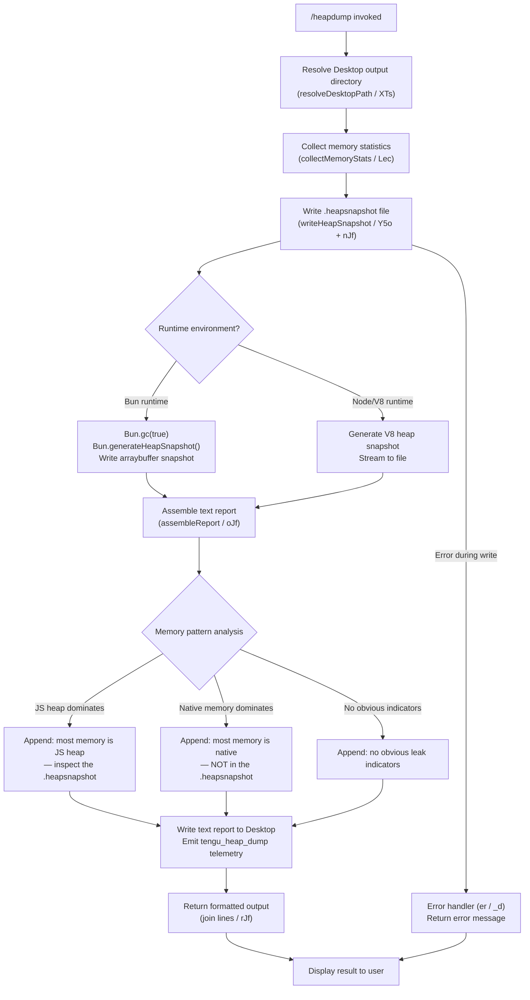

# `/heapdump`

> Analysis basis: CC v2.1.196 bundle.js (AST extraction + Claude interpretation)
> Minimum version: v2.1.196

---

## Overview

`/heapdump` is a hidden, developer-oriented diagnostic command that captures a JS heap snapshot of the running Claude Code process and writes it to `~/Desktop`, alongside a plain-text memory statistics report. It is intended for tracking down memory leaks and is not surfaced in normal user-facing help listings.

---

## Registration

| Field | Value |
|---|---|
| type | `local` |
| name | `heapdump` |
| description | `Dump the JS heap to ~/Desktop` |
| supportsNonInteractive | `true` |
| isHidden | `true` |
| module_id | `Rec` |
| load_inline | `true` |
| loc_byte | `13010402` |
| loc_byte_end | `13010830` |
| loc_line | `9026` |
| arbor_handler.name | `rJf` |
| arbor_handler.fqn | `claude-2.1.196::rJf` |
| arbor_handler.kind | `AsyncFunction` |
| arbor_handler.resolution_path | `module_id` |
| arbor_handler.n_hits | `0` |

Analysis basis: CC v2.1.196 bundle.js:+13010402

---

## Input Branching

The command has three major outcome paths: (1) normal dump success, (2) runtime/write error, and (3) a Bun-specific heap-snapshot path branching from the standard V8 path. A Mermaid flowchart is used because there are 3+ distinct branches.



---

## Behavioral Spec

### Handler Entry Point (`rJf`)

The Arbor-resolved handler `rJf` is an `AsyncFunction` reached via `module_id` → `Rec`. It orchestrates two sub-calls (`Y5o` for the core dump workflow and `oJf` for report assembly), then joins the resulting output lines for display.

```
async function heapdumpHandler(context):
    outputLines = []
    result = await performHeapDump(context)          // Y5o
    outputLines.push(result)
    report = assembleReport(result)                   // oJf
    return outputLines.join("\n")
```

Analysis basis: CC v2.1.196 bundle.js:+13009271, +13009390, +13009417, +13009539

---

### Desktop Path Resolution (`XTs`)

Determines the target output directory. It calls `os.homedir()` (`lkr.homedir`) and appends `"Desktop"` (literal at +1112485) using a path join (`jf.join`). On Windows Subsystem for Linux it detects the `/mnt/c/Users` prefix (+1112707) and adjusts accordingly, filtering out system accounts such as `"Public"`, `"Default"`, `"Default User"`, and `"All Users"` (+1112751–+1112815).

```
function resolveDesktopPath():
    home = os.homedir()
    if platform is WSL and home starts with "/mnt/c/Users":
        // derive Windows user Desktop path
        // skip Public / Default / Default User / All Users
        return windowsDesktopPath
    else:
        return path.join(home, "Desktop")
```

Analysis basis: CC v2.1.196 bundle.js:+1112439, +1112475, +1112485, +1112707

---

### Memory Statistics Collection (`Lec`)

Gathers a comprehensive snapshot of the process's memory state from multiple sources before writing any files:

| Source | API |
|---|---|
| Heap memory breakdown | `process.memoryUsage()` (+13005434) |
| V8 heap statistics | `v8.getHeapStatistics()` (`rlr.getHeapStatistics`, +13005458) |
| Resource usage | `process.resourceUsage()` (+13005484) |
| Process uptime | `process.uptime()` (+13005510) |
| Heap space detail | `v8.getHeapSpaceStatistics()` (`rlr.getHeapSpaceStatistics`, +13005535) |
| Active handles | `process._getActiveHandles()` (+13005577) |
| Active requests | `process._getActiveRequests()` (+13005614) |
| Open file descriptors | `fs.readdir("/proc/self/fd")` (+13005665, +13005677) |
| Linux smaps rollup | `fs.readFile("/proc/self/smaps_rollup", "utf8")` (+13005727, +13005740, +13005766) |
| Bun JSC stats | `require("bun:jsc")` (+13005825, +13005838) |

After collection, a native-vs-heap comparison is performed. The threshold check uses `100` (+13006118) and `500` (+13006359) as percentage/ratio sentinels. If native memory exceeds the JS heap by a significant margin, the literal warning string `"Native memory > heap - leak may be in native addons (node-pty, sharp, etc.)"` (+13006204) is included in output.

Uptime is capped at `3600` seconds (+13005966) with a byte-size unit of `1048576` (1 MiB, +13005971) for formatting memory values.

```
async function collectMemoryStats():
    mem       = process.memoryUsage()
    heapStats = v8.getHeapStatistics()
    resUsage  = process.resourceUsage()
    uptime    = process.uptime()
    heapSpaces = v8.getHeapSpaceStatistics()
    handles   = process._getActiveHandles()
    requests  = process._getActiveRequests()

    try:
        fds = await fs.readdir("/proc/self/fd")
    catch:
        fds = null

    try:
        smaps = await fs.readFile("/proc/self/smaps_rollup", "utf8")
    catch:
        smaps = null

    try:
        jscStats = require("bun:jsc")...
    catch:
        jscStats = null

    nativeMB = resUsage.maxRSS / 1048576
    heapMB   = mem.heapUsed / 1048576

    if nativeMB > heapMB * (100 / 100):   // threshold comparison
        warn("Native memory > heap - leak may be in native addons...")

    return aggregatedStats
```

Analysis basis: CC v2.1.196 bundle.js:+13005434–+13005838, +13005966, +13005971, +13006118, +13006204, +13006359

---

### Heap Snapshot Write (`Y5o` + `nJf`)

`Y5o` constructs the output file path by joining the Desktop path with a timestamped filename (using `z5o.join` at +13008338), then writes the snapshot. The file mode is `384` (octal `0o600`, owner read/write only) (+13008416).

`nJf` handles the actual snapshot generation with a Bun-vs-V8 branch:

- **Bun path**: calls `Bun.gc(true)` (+13009028) to force a full GC, then `Bun.generateHeapSnapshot()` (+13008971) to capture the snapshot in `"arraybuffer"` format (+13009001), writing synchronously via `fs.writeFileSync` (`wec.writeFileSync`, +13008951). The snapshot format identifier `"v8"` (+13008996) is passed to `Bun.generateHeapSnapshot`.
- **Node path**: uses the V8 heap profiler streaming API to write incrementally.

The trigger telemetry event `tengu_heap_dump` is emitted immediately after the file path is resolved (+13008523).

Auto-memory-limit annotation `"auto-1.5GB"` appears as a literal (+13008589) and is included in the report header.

```
async function writeHeapSnapshot(desktopPath):
    timestamp = Date.now()               // +13008338 area
    filePath  = path.join(desktopPath, "heap-<timestamp>.heapsnapshot")
    emitTelemetry("tengu_heap_dump")     // +13008523

    if runtime is Bun:
        Bun.gc(true)
        snapshot = Bun.generateHeapSnapshot("v8", "arraybuffer")
        fs.writeFileSync(filePath, snapshot)
    else:
        // V8 streaming write
        writeV8SnapshotToFile(filePath)

    return { filePath, stats }
```

Analysis basis: CC v2.1.196 bundle.js:+13008338, +13008381, +13008416, +13008471, +13008523, +13008589, +13008951, +13008971, +13009001, +13009028

---

### Report Assembly (`oJf`)

Assembles the human-readable text report printed back to the user. Uses `Math.max` (+13009646) to normalise memory values for formatting. The report includes a memory-pattern diagnosis:

- If JS heap dominates: appends `"— most memory is JS heap (inspect the .heapsnapshot)"` (+13009714)
- If native memory dominates: appends `"— most memory is native (NOT in the .heapsnapshot)"` (+13009774)
- If neither threshold is clearly exceeded: appends `"  (no obvious leak indicators)"` (+13009911)

A fixed user instruction line is appended last: `"Open the .heapsnapshot in Chrome DevTools → Memory → Load to inspect retainers."` (+13009427)

The maximum individual line length is normalised using a column width derived from `8` columns (+13010046). A 1 GiB constant (`1073741824`, +13010320) is used as a reference for classifying "large" heap sizes.

```
function assembleReport(dumpResult):
    lines = []
    lines.push("Open the .heapsnapshot in Chrome DevTools → Memory → Load...")

    heapMB   = Math.max(0, dumpResult.heapUsed / MiB)
    nativeMB = Math.max(0, dumpResult.rss / MiB)

    if heapMB / nativeMB > THRESHOLD:
        lines.push("— most memory is JS heap (inspect the .heapsnapshot)")
    elif nativeMB / heapMB > THRESHOLD:
        lines.push("— most memory is native (NOT in the .heapsnapshot)")
    else:
        lines.push("  (no obvious leak indicators)")

    return lines
```

Analysis basis: CC v2.1.196 bundle.js:+13009427, +13009646, +13009714, +13009774, +13009911, +13010046, +13010320

---

### macOS-Specific Memory Probe (`CYe`)

On macOS (detected by `"darwin"` literal at +13007477 and platform string `"macos"` at +13419431), an additional free-memory query runs via `os.freemem()` (`Fac.freemem`, +13419446) alongside `Mqc.freemem` (+17993982) to provide a cross-checked native memory figure. This feeds back into the native-vs-heap comparison.

Analysis basis: CC v2.1.196 bundle.js:+13007477, +13419431, +13419446, +17993982

---

### Error Handling

Any error during snapshot write is caught and passed to `er` (+13008692) and `_d` (+13008701). `er` normalises the error using `Error` and `String` coercions (+183494, +183500). The final error message is returned as a text result rather than thrown, so the command always produces visible output.

```
async function safeHeapDump(context):
    try:
        return await writeHeapSnapshot(...)
    catch err:
        normalised = normaliseError(err)   // er
        return formatErrorMessage(normalised)  // _d
```

Analysis basis: CC v2.1.196 bundle.js:+13008692, +13008701, +183494, +183500

---

## State & Side Effects

| Item | Detail |
|---|---|
| Telemetry | `tengu_heap_dump` (+13008523) — fired when dump path is resolved. Also indirectly reachable: `tengu_bg_dispatch_sigkill_escalate` (+17993512), `tengu_bg_dispatch_low_mem` (+17994102), `tengu_bg_spare_enable` (+17994792), `tengu_bg_spare_claim` (+17994920), `tengu_bg_spare_claim_fail` (+17995186), `tengu_bg_sendclaim_failed` (+17986631), `tengu_bg_handoff_settle` (+18000778), `tengu_daemon_idle_exit` (+18016355), `tengu_feature_ok` (+1028610), `tengu_feature_bad` (+1028677) |
| File writes | `.heapsnapshot` file on `~/Desktop` (mode `0o600`, +13008416); plain-text memory report alongside it |
| GC side effect | `Bun.gc(true)` forces a synchronous full garbage collection before snapshot capture (+13009028) |
| Hook registration | `fis.register` called via `vi` (+68542) — listener registration for output streaming |
| appState changes | No direct appState mutation observed in depth-2 traversal |
| Sound | <!-- TODO: not found in depth-2 traversal; needs --depth 4 --> |
| Process signals | `SIGTERM` (+17995442), `SIGKILL` (+17993560) appear in reachable background-session code; not directly issued by `/heapdump` itself |

---

## Version History

| Version | Change |
|---|---|
| v2.1.196 | Initial analysis |

---

## Common Mistakes

1. **Expecting the file in the current working directory.** The snapshot is always written to `~/Desktop` (resolved via `os.homedir()` + `"Desktop"`), not to `$PWD`. On WSL, the Desktop path is resolved from `/mnt/c/Users/<user>/Desktop`.
2. **Running on a non-desktop machine.** If `~/Desktop` does not exist the write will fail. The command does not create the directory automatically; the error is returned as text output rather than a thrown exception.
3. **Confusing native memory with JS heap.** The report explicitly distinguishes the two. If the diagnosis line says `"most memory is native (NOT in the .heapsnapshot)"`, the `.heapsnapshot` file will not reveal the leak — native addon profiling (node-pty, sharp, etc.) is needed instead.
4. **Forgetting the command is hidden.** `/heapdump` does not appear in `/help` output (`isHidden: true`). It must be typed explicitly.
5. **Interpreting the Bun snapshot on a Node runtime.** The Bun-specific `Bun.generateHeapSnapshot("v8", "arraybuffer")` path only executes under the Bun runtime. Under Node/V8 a different streaming API is used. The resulting `.heapsnapshot` file is in V8 format in both cases and can be loaded into Chrome DevTools → Memory → Load.

---

## Appendix — Identifier Mapping

> For bundle debugging only. Identifiers change across versions.

| Identifier | Role |
|---|---|
| `rJf` | Main async handler for `/heapdump` (Arbor-resolved entry point) |
| `Y5o` | Core heap-dump workflow function (path resolution → snapshot write → error handling) |
| `Lec` | Memory statistics collection function |
| `nJf` | Bun/V8 heap snapshot generation (calls `Bun.generateHeapSnapshot` or V8 profiler) |
| `oJf` | Text report assembly function |
| `XTs` | Desktop output directory resolver |
| `Rt` | Utility called by `Y5o` and `Lec` (also called from `bhe`) |
| `g0` | Utility called by `Rt` |
| `CYe` | macOS-specific native memory probe |
| `N6e` | File stat / read / remove helper |
| `Re` | Error logging / push helper |
| `er` | Error normalisation (wraps `Error` + `String`) |
| `_d` | Error message formatter |
| `y` | Intermediate helper called by `Lec` |
| `lqe` | TeammateMailbox mark-messages-as-read logic (reached via `y`) |
| `H` | Background process handle tracker |
| `h` | Background session manager / dispatch core |
| `V` | Shared utility (called from many sites) |
| `j` | Background process kill/timeout handler |
| `On` | Abort-controller / timeout-clear helper |
| `e` | String replacement helper |
| `ke` | Feature telemetry emitter (`tengu_feature_bad`) |
| `xe` | Feature telemetry emitter (`tengu_feature_ok`) |
| `z` | MCP update / session retire helper |
| `it` | Session deduplication / active-set tracker |
| `_ns` | Socket connection / handoff helper |
| `bns` | Background session lifecycle manager |
| `l` | Session list helper (calls `eoc`) |
| `g` | Session group helper (calls `f`) |
| `rn` | Shared utility (multiple call sites) |
| `Oe` | Shared utility (calls `$Xe`) |
| `Y` | Disposable resource wrapper (calls `ytn`) |
| `T` | Output formatting / logger utility |
| `eeu` | Log-entry formatter (calls `q1`, `tTr`, `gis`) |
| `gis` | Log encoding helper |
| `Me` | JSON stringify wrapper |
| `Pc` | Path/string sanitiser (redacts sensitive segments) |
| `Zls` | Path-map helper |
| `KQe` | Write helper (calls `Gls`) |
| `Gls` | Direct write helper |
| `oeu` | Output-stream / file-write orchestrator |
| `SQe` | Buffered output flush scheduler |
| `bhe` | Output chunk helper |
| `xae` | Path helper (calls `rn`) |
| `ncs` | Path-join + stat helper |
| `sTr` | File rename/unlink helper |
| `reu` | Directory-create + append-file helper |
| `vi` | Hook/listener registration |
| `qt` | Shared utility (multiple sites) |
| `iTt` | Report line formatter (called by `oJf`) |

---

Note: index built via Arbor fallback; some signals (telemetry, literals) may be missing — see arbor-fallback.js.