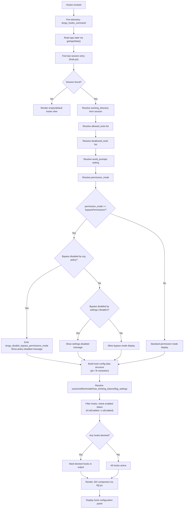

# `/hooks`

> Analysis basis: CC v2.1.196 bundle.js (AST extraction + Claude interpretation)
> Minimum version: v2.1.196

---

## Overview

`/hooks` is a local-JSX slash command that renders the current hook configurations for tool events directly in the Claude Code terminal UI. It reads the active session's app state, resolves all configured hooks (including allowed tools, disallowed tools, permission mode, and bypass-permission settings), and displays them as an interactive JSX component. The command fires immediately (`immediate: true`) without requiring additional user input.

---

## Registration

| Field | Value |
|---|---|
| type | `local-jsx` |
| name | `hooks` |
| description | `View hook configurations for tool events` |
| immediate | `true` |
| module_id | `pQl` |
| load_inline | `true` |
| loc_byte | `12900614` |
| loc_byte_end | `12900764` |
| loc_line | `8904` |
| arbor_handler.name | `C7f` |
| arbor_handler.fqn | `claude-2.1.196::C7f` |
| arbor_handler.kind | `AsyncFunction` |
| arbor_handler.resolution_path | `module_id` |
| arbor_handler.n_hits | `0` |

Analysis basis: CC v2.1.196 bundle.js:+12900614

---

## Input Branching

The handler involves more than three distinct resolution paths (app-state read → hook config retrieval → allowed/disallowed tool resolution → permission-mode check → bypass-permission guard → JSX render), so a flowchart is appropriate.



Analysis basis: CC v2.1.196 bundle.js:+12900422 – +12900494

---

## Behavioral Spec

### 1. Handler Entry — `hookCommandHandler` (C7f)

```
async function hookCommandHandler(context):
    emit telemetry("tengu_hooks_command")
    sessionConfig = resolveSessionConfig(context)       // Ur
    hookConfig    = buildHookConfig(context)            // f1
    return renderJSX(fQl.jsx, sessionConfig, hookConfig)
```

Analysis basis: CC v2.1.196 bundle.js:+12900422

---

### 2. Session Config Resolution — `resolveSessionConfig` (Ur)

```
function resolveSessionConfig(context):
    appState = context.getAppState()
    // Reads keyed fields from the last session entry
    session  = appState.findLast(entry => matches session criteria)

    config = {
        working_directory : session["working_directory"],   // +11145853
        allowed_tools     : session["allowed_tools"],       // +11145908
        disallowed_tools  : session["disallowed_tools"],    // +11145963
        avoid_prompts     : session["avoid_prompts"],       // +11146024
        permission_mode   : session["permission_mode"],     // +11146126
        bypassPermissions : session["bypassPermissions"],   // +11146157
        session_id        : session["session"],             // +11146456
        effort            : session["effort"],              // +11146481
        model             : session["model"],               // +11146494
        max_thinking_tokens: session["max_thinking_tokens"],// +11146506
        flag_settings     : session["flag_settings"],       // +11146532
    }

    // Resolve ptr (allowed-tools hook config)
    config.hookAllowedTools = resolveAllowedToolsHook(config)   // ptr -> Fo
    // Resolve ftr (disallowed-tools hook config)
    config.hookDisallowedTools = resolveDisallowedToolsHook(config) // ftr -> Fo

    // Check bypass permission constraints
    if config.bypassPermissions:
        bypassStatus = checkBypassPermissionsMode(config)       // Sk -> FYr
        config.bypassStatus = bypassStatus

    return config
```

Analysis basis: CC v2.1.196 bundle.js:+11145748, +11145828, +11145926, +11145984, +11146179

---

### 3. Bypass Permissions Guard — `checkBypassPermissionsMode` (Sk → FYr → it)

```
function checkBypassPermissionsMode(config):
    result = featureGate(config)    // FYr -> it

    if orgPolicyDisablesBypass(result):   // t0e.has check
        emit telemetry("tengu_disable_bypass_permissions_mode")
        // Message: "Bypass permissions mode was disabled by your organization policy"
        // (+3439964)
        return { allowed: false, reason: "org_policy" }

    if settingsDisablesBypass(result):    // "disable" literal +3440089
        // Message: "Bypass permissions mode was disabled by settings"
        // (+3440105)
        return { allowed: false, reason: "settings" }

    return { allowed: true }
```

Analysis basis: CC v2.1.196 bundle.js:+3439911, +3439964, +3440089, +3440105

---

### 4. Hook Config Builder — `buildHookConfig` (f1)

```
function buildHookConfig(context):
    // Collect hook definitions from the process environment / config
    hookDefs = collectHookDefinitions(context)    // Ow -> O5, _l, ct, it

    results = []
    for each hookDef in hookDefs:
        entry = {
            definition  : hookDef,
            daemonInfo  : resolveDaemonInfo(hookDef),   // d -> TYe, gic
            enabled     : checkEnabled(hookDef),         // hl.isEnabled
        }

        // Resolve tool event type (cli vs remote context)
        // Literals: "cli" (+5150683), "remote" (+5150694)
        entry.eventContext = hookDef.context in ["cli", "remote"]

        results.push(entry)

    // Filter out blocked hooks
    activeHooks  = results.filter(h => !isBlocked(h))  // Out.has check +10572768
    blockedHooks = results.filter(h =>  isBlocked(h))  // literal "blocked" +10571787

    // Map hooks to display format, checking per-hook enabled status
    displayItems = activeHooks.map(h => ({
        ...h,
        isEnabled: h.enabled && c.isEnabled(h),   // +10572807
    }))

    // Include workflow-aware hooks (allow_workflows guard)
    // allow_workflows literal +3415885
    workflowHooks = filterWorkflowHooks(displayItems)  // sS -> KFi -> Gs

    // Append tool-narrowing hooks (cliArg / toolsNarrowing)
    // literals: "cliArg" +13984126, "toolsNarrowing" +13984147
    narrowingHooks = resolveNarrowingHooks(displayItems)  // wse -> KOe

    return {
        active  : displayItems,
        blocked : blockedHooks,
        workflow: workflowHooks,
        narrowed: narrowingHooks,
    }
```

Analysis basis: CC v2.1.196 bundle.js:+10572291, +10572363, +10572392, +10572414, +10572429, +10572441, +10572501, +10572608, +10572666, +10572753, +10572768, +10572796

---

### 5. Daemon Info Resolution — `resolveDaemonInfo` (TYe)

```
async function resolveDaemonInfo(hookDef):
    try:
        stat = mic.stat(hookDef.path)   // +13338188
    catch err:
        if err.code == "ENOENT":        // +13338219
            return Promise.reject(...)
        raise

    if not stat.isFile():               // +13338260
        return null
    if stat.size > 1048576:             // 1 MB limit, +13338279
        return null

    store = Ks.getStore()               // Mfd.getStore +2176008
    hookData = zGo(hookDef)             // +13338425
    keys = Object.keys(hookData)        // +13338697

    // Build column-padded display map (gic)
    // Uses Math.max for column alignment +13339454
    // Column separator: "  " (two spaces) +18022054
    maxColWidth = Math.max(...keys.map(k => k.length))
    display = formatColumns(hookData, maxColWidth)   // gic -> R_

    return display
```

Analysis basis: CC v2.1.196 bundle.js:+13338188, +13338219, +13338279, +13338363, +13338425, +13338697

---

### 6. JSX Render — `renderHooksView` (fQl.jsx)

```
function renderHooksView(sessionConfig, hookConfig):
    // Renders a JSX panel showing:
    // - working directory
    // - permission mode (standard / bypass)
    // - bypass status (if applicable) with policy/settings messages
    // - allowed_tools list
    // - disallowed_tools list
    // - avoid_prompts setting
    // - per-hook enabled/blocked status
    // - session metadata: session_id, effort, model, max_thinking_tokens, flag_settings
    return <HooksConfigPanel
        session={sessionConfig}
        hooks={hookConfig}
    />
```

Analysis basis: CC v2.1.196 bundle.js:+12900494

---

### 7. Feature Gate — `featureGate` (it)

```
function featureGate(config):
    // Checks t0e.has (org-level policy set) +3381653
    // Checks wV.has / wV.get (workspace-level overrides) +3381690, +3381707
    // Calls C$t (policy evaluator) +3381564
    // Calls v$t (value transformer) +3381601
    // Calls P6  (permission resolver) +3381636
    // Calls iRn (flag inspector) +3381664
    // Adds result to T$t (result accumulator set) +3381676
    // Calls Dt  (finalizer) +3381727
    return gatedFeatureResult
```

Analysis basis: CC v2.1.196 bundle.js:+3381564 – +3381727

---

## State & Side Effects

| Item | Detail |
|---|---|
| Telemetry: `tengu_hooks_command` | Fired immediately on handler entry (bundle.js:+12900424) |
| Telemetry: `tengu_disable_bypass_permissions_mode` | Fired when bypass-permissions mode is blocked by org policy or settings (bundle.js:+3439914) |
| Telemetry: `tengu_slate_harbor` | Fired during hook context resolution (bundle.js:+5150713) |
| Telemetry: `tengu_daemon_config_reload` | Fired when daemon config is reloaded during hook info resolution (bundle.js:+18010884) |
| Telemetry: `tengu_workflows_enabled` | Fired when workflow hooks are found enabled (bundle.js:+3416086) |
| Telemetry: `tengu_cobalt_ridge` | Fired during tool-context resolution (bundle.js:+5147717) |
| Telemetry: `tengu_feature_ok` | Fired on successful feature gate pass (bundle.js:+1028610) |
| Telemetry: `tengu_feature_bad` | Fired on feature gate rejection (bundle.js:+1028677) |
| Telemetry: `tengu_daemon_control` | Fired during daemon state interaction (bundle.js:+18033163) |
| App state reads | `getAppState()` called; `findLast` used to locate current session (bundle.js:+11145748, +11145828) |
| Daemon interaction | Daemon status file `daemon.status.json` consulted (bundle.js:+13163777) |
| File system stat | `mic.stat` called on each hook file path; rejects on ENOENT, enforces 1 MB size cap (bundle.js:+13338188, +13338279) |
| Hook registration | No new hooks registered by this command; reads existing hook configuration only |
| Sound | None detected in depth-2 traversal |
| appState changes | Read-only; no mutations to appState observed |

---

## Version History

| Version | Change |
|---|---|
| v2.1.196 | Initial analysis |

---

## Common Mistakes

1. **Expecting output when no session exists**: Because the command reads the last session via `findLast`, invoking `/hooks` before any session is established may render an empty or default view with no hook entries displayed.

2. **Confusing "blocked" with "disabled"**: Hooks marked `blocked` (filtered via `Out.has`) are structurally excluded from tool events entirely, while hooks marked not-enabled via `isEnabled` may be conditionally inactive. These are distinct states with different UI representations.

3. **Assuming bypass-permissions is always available**: The `bypassPermissions` setting is subject to two independent guards — organization policy (`t0e.has`) and local settings (`"disable"`). Either can suppress it with a distinct message. Do not assume bypass mode is available just because it is set in config.

4. **Overlooking the 1 MB hook-file limit**: The daemon info resolver (`TYe`) silently skips hook files exceeding 1,048,576 bytes. Hook configurations backed by large scripts will appear absent in the `/hooks` output without an explicit error message to the user.

5. **Treating `/hooks` as writable**: This command is display-only. It renders the hook configuration but provides no UI interaction to add, remove, or edit hooks. Configuration changes must be made through the settings files or CLI arguments directly.

---

## Appendix — Identifier Mapping

> For bundle debugging only. Identifiers change across versions.

| Identifier | Role |
|---|---|
| `C7f` | Main async handler for `/hooks` command (`hookCommandHandler`) |
| `Ur` | Session config resolver — reads `getAppState` and `findLast` |
| `ptr` | Allowed-tools hook config resolver (calls `Fo`) |
| `ftr` | Disallowed-tools hook config resolver (calls `Fo`) |
| `Fo` | Hook config formatter / finalizer |
| `Sk` | Bypass-permissions mode checker (calls `FYr`) |
| `FYr` | Bypass permissions feature gate evaluator (calls `it`) |
| `it` | Core feature gate function — evaluates policy and workspace overrides |
| `f1` | Hook config builder — aggregates all hook definitions |
| `Ow` | Hook definition collector (resolves `O5`, `_l`, `ct`, `it`) |
| `O5` | Hook source resolver (first-party hook lookup) |
| `_l` | Boolean/string normalizer ("no"/"off" → false) |
| `ct` | String/value coercion utility |
| `d` | Daemon info pipeline orchestrator |
| `TYe` | Daemon hook file stat and data reader |
| `rn` | Hook data normalizer |
| `Ks` | Async store accessor (`Mfd.getStore` wrapper) |
| `zGo` | Hook entry transformer (calls `KGo`) |
| `he` | String formatter utility |
| `o` | Column-map builder (pad/map helper) |
| `gic` | Column-aligned display formatter (uses `Math.max`, `R_`) |
| `E` | Daemon supervisor stop/start controller |
| `$Ct` | Supervisor transport resolver (calls `o5c`) |
| `Re` | Daemon error handler / log relay |
| `er` | Generic error constructor wrapper |
| `A` | Daemon process manager (stop/start/updateConfig/userinfo) |
| `QHr` | Array-or-scalar normalizer for daemon args |
| `XHr` | Daemon argument string sanitizer (startsWith/slice/replace) |
| `H` | Process signal handler (SIGTERM / userinfo) |
| `Wqc` | Heartbeat scheduler (calls `Wce`) |
| `Wce` | Heartbeat literal handler (`"heartbeat"` +18009312) |
| `I` | Daemon start coordinator (Math.max/floor for timing) |
| `M` | HTTP server / OAuth gateway handler |
| `FDo` | JSX render helper bootstrap (calls `yCl`, `eo`) |
| `eo` | Module initializer (sets up `fFe`, `Ayr`, `Lsn`, `xsn`, `TKc`, `Vns`) |
| `xsn` | Bound module init function |
| `sS` | Session-scoped hook state builder (calls `IRn`, `KFi`, `TYr`, `eBd`) |
| `IRn` | Session-state initializer (calls `ct`, `m0`) |
| `m0` | State mutation helper |
| `KFi` | Workflow feature gate (calls `Gs`) |
| `Gs` | Feature guard resolver (allow_product_feedback / allow_workflows) |
| `TYr` | Pro-tier hook resolver (calls `tBd`) |
| `tBd` | Pro hook definition builder (calls `ct`, `it`, `_l`, `Mi`) |
| `eBd` | Session state finisher (calls `m0`) |
| `wse` | Hook-narrowing filter (filters by `KOe`) |
| `KOe` | Hook narrowing resolver (cliArg / toolsNarrowing) |
| `h1e` | Hook cache membership check (`gcm.has`) |
| `BK` | Hook deny-entry builder (calls `eVo`) |
| `tVo` | Tool-narrowing entry constructor (`_le`, `xgn`, `fwe`, `fDr`, `iw`) |
| `rVo` | Narrowing result wrapper |
| `BDo` | Background daemon hook resolver (calls `mU`, `k7t`, `eo`) |
| `mU` | Windows-aware tool hook builder (calls `jt`, `ct`, `_l`, `Qhe`, `it`) |
| `bu` | Hook builder utility (calls `jt`, `Qhe`) |
| `u` | Daemon control flow array (xe, ke, $F, Wj entries) |
| `xe` | Feature-ok emitter (calls `V`, `Oe`) |
| `Oe` | Feature result presenter (calls `$Xe`) |
| `ke` | Feature-bad emitter (calls `V`, `Oe`) |
| `$F` | First-party hook registrar (calls `D6`, `u5e`, `V7r`) |
| `D6` | Hook dependency resolver (calls `q3`) |
| `u5e` | Hook index builder (calls `ix`) |
| `V7r` | Hook UUID emitter (`W7r.randomUUID`, `eit`, `w6`, `e.emit`) |
| `Wj` | Daemon shutdown orchestrator (`Promise.race`, `Promise.all`, `process.exit`) |
| `rye` | Graceful shutdown initiator (`nye.shutdown`) |
| `pye` | Shutdown timeout clearer (`clearTimeout`, `gqo`) |
| `On` | Timed abort controller (`setTimeout`, `clearTimeout`, `s.unref`) |
| `I4` | Full hook pipeline runner (calls `bu`, `Gft`, `bb`, `ct`, `CEt`, `FDo`, `BDo`, `Svl`, `xO`) |
| `Gft` | Local-agent hook invoker (calls `Ev`, `bu`) |
| `Ev` | Hook event emitter (calls `ct`, `hSr`) |
| `bb` | String normalizer (calls `_l`) |
| `CEt` | Hook config extractor |
| `xO` | Model/context resolver (calls `f9t`, `T`, `Hr`, `Su`) |
| `f9t` | Thinking-token/effort resolver (`standard`/`tst`/`tst-auto`) |
| `T` | Model name formatter (toUpperCase, trim, Pc, K1, KQe) |
| `Hr` | API backend resolver (`gateway`/`bedrock`/`foundry`/`anthropicAws`/`mantle`/`vertex`) |
| `Su` | Supplemental context builder (calls `Trt`) |
| `nc` | Hook name collision checker |
| `c` | Per-hook enabled-state checker (calls `yn`) |
| `yn` | Enabled-state predicate |
| `l` | Daemon log / status file reader (calls `eoc`) |
| `eoc` | Daemon status file reader (`daemon.status.json`, calls `Zte`, `HZt`, `Ks`, `Me`) |
| `Zte` | Status file parser (calls `XHe`) |
| `HZt` | Status file path builder (`Zrc.join`, `Zn`) |
| `Me` | JSON serializer (`JSON.stringify`) |
| `V` | Telemetry emitter (shared utility) |

---

Note: index built via Arbor fallback; some signals (telemetry, literals) may be missing — see arbor-fallback.js.