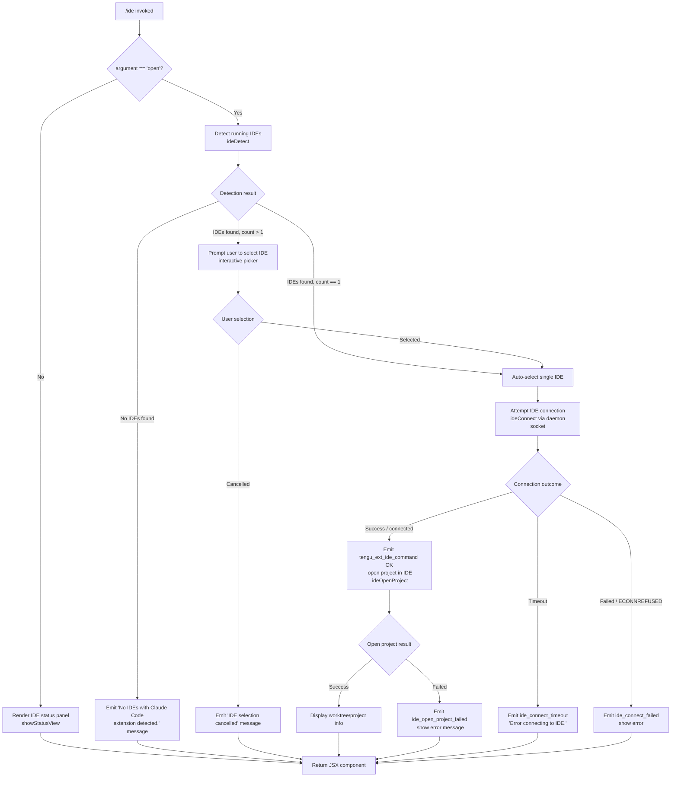

# `/ide`

> Analysis basis: CC v2.1.196 bundle.js (AST extraction + Claude interpretation)
> Minimum version: v2.1.196

---

## Overview

The `/ide` command manages IDE integrations for Claude Code, providing status display and optional launch of the current project in a connected IDE. When invoked with the optional `open` sub-command, it attempts to discover running IDEs that have the Claude Code extension installed, connects to the selected IDE over a local daemon socket, and opens the active project directory inside that IDE. Without any argument the command renders a status panel showing connection state, available IDEs, and active MCP tool channels.

---

## Registration

| Field | Value |
|---|---|
| type | `local-jsx` |
| name | `ide` |
| description | `Manage IDE integrations and show status` |
| argumentHint | `[open]` |
| module_id | `M9l` |
| load_inline | `true` |
| loc_byte | `11963802` |
| loc_byte_end | `11963958` |
| loc_line | `7639` |
| arbor_handler.name | `c3f` |
| arbor_handler.fqn | `claude-2.1.196::c3f` |
| arbor_handler.kind | `AsyncFunction` |
| arbor_handler.resolution_path | `module_id` |
| arbor_handler.n_hits | `0` |

Analysis basis: CC v2.1.196 bundle.js:+11963802

---

## Input Branching

There are five distinct execution paths depending on the presence of the `open` argument, the result of IDE detection, user selection, connection outcome, and connection timeout — warranting a Mermaid flowchart.



Analysis basis: CC v2.1.196 bundle.js:+11959997, +11960105, +11960157, +11960214, +11960334, +11960529, +11960639, +11962029, +11962116, +11962223

---

## Behavioral Spec

### Top-Level Handler — `ideCommandHandler` (`c3f`)

The Arbor-resolved handler is the async function `c3f`; it is the command's sole entry point. Analysis basis: CC v2.1.196 bundle.js:+11959997

```
async function ideCommandHandler(context, args):
    emit telemetry: tengu_ext_ide_command
    currentIDE = getActiveIDE(context)          // calls Ot (getActiveIDE)
    subCommand = args[0]                        // string or undefined

    if subCommand != "open":
        return renderIDEStatusPanel(context, currentIDE)

    // --- "open" path ---
    detectedIDEs = await detectRunningIDEs()    // calls i3n (detectRunningIDEs)
    if detectedIDEs is empty:
        return displayMessage("No IDEs with Claude Code extension detected.")

    if len(detectedIDEs) == 1:
        selectedIDE = detectedIDEs[0]
    else:
        selectedIDE = await promptUserToSelectIDE(detectedIDEs)
        if selectedIDE is null:
            return displayMessage("No IDE selected.")

    connectionResult = await connectToIDE(selectedIDE)   // calls ide_connect path
    if connectionResult.timedOut:
        emit "ide_connect_timeout"
        return displayMessage("Error connecting to IDE.")
    if connectionResult.failed:
        emit "ide_connect_failed"
        return displayError(connectionResult.error)

    openResult = await openProjectInIDE(selectedIDE, context.projectPath)
    if openResult.failed:
        emit "ide_open_project_failed"
        return displayError(openResult.error)

    displayWorktreeProjectInfo(openResult)
```

Analysis basis: CC v2.1.196 bundle.js:+11959997, +11960105, +11960119, +11960143, +11960157, +11960212, +11960274, +11960367, +11960389, +11960432, +11960453, +11960529

---

### Sub-feature: IDE Detection — `detectRunningIDEs` (`i3n`)

Discovers IDEs currently running on the host by examining daemon socket directories and optionally running a platform-specific process scan.

```
async function detectRunningIDEs():
    socketDir = getIDESocketDirectory()         // uses "ide" literal, homedir
    rawEntries = await listSocketEntries(socketDir)   // calls o3n
    parsed = await Promise.all(
        rawEntries.map(entry => parseIDESocketEntry(entry))  // calls M0p / q9r
    )
    validEntries = parsed.filter(e => e is not null)

    // Platform-specific detection supplement
    if platform is "linux":
        psOutput = runProcessScan(PS_AUX_GREP_PATTERN)  // calls xx (processScanner)
    endif

    emit telemetry: ide_detect (on success)
    // on failure: emit ide_detect_failed
    return validEntries
```

Constant — PS scan pattern includes: `code|cursor|windsurf|devin-desktop|idea|pycharm|webstorm|phpstorm|rubymine|clion|goland|rider|datagrip|dataspell|aqua|gateway|fleet|android-studio` (Analysis basis: CC v2.1.196 bundle.js:+6877474)

Analysis basis: CC v2.1.196 bundle.js:+11960157, +6872708, +6872727, +6872757, +6872771, +6872783, +6873583, +6874063, +6874127

---

### Sub-feature: IDE Socket Directory Resolution — `resolveIDESocketPaths` (`o3n` / `P0p`)

Enumerates the `.claude/ide` socket directory under the user home directory, resolving real paths and skipping system accounts.

```
function resolveIDESocketPaths(homeDir):
    basePath = path.join(homeDir, ".claude", "ide")   // literals ".claude", "ide"
    if platform == "wsl":
        also check "/mnt/c/Users" subtree
    skip accounts: ["Public", "Default", "Default User", "All Users"]
    entries = filesystem.readdir(basePath)
    result = []
    visited = new Set()
    for entry in entries:
        if entry ends with ".lock": skip
        realPath = filesystem.realpath(entry)
        if realPath in visited: skip
        visited.add(realPath)
        result.push(realPath)
    return result
```

Analysis basis: CC v2.1.196 bundle.js:+6869177, +6870416, +6870493, +6870507, +6870552, +6870714, +6870808, +6870827, +6870847, +6870872, +6869287

---

### Sub-feature: IDE Socket Entry Parsing — `parseIDESocketEntry` (`M0p` / `q9r`)

Parses a single socket directory entry to extract the port number and determine the IDE process name.

```
async function parseIDESocketEntry(entryPath):
    portStr = path.basename(entryPath)
    port = parseInt(portStr, 10)          // radix 10; literal: 10
    if isNaN(port): return null

    processInfo = await execFileNoThrow("sh", ["-c", queryCommand], {timeout: 3000})
    // timeout: 3000 ms (Analysis basis: CC v2.1.196 bundle.js:+2337511)

    ideName = normalizeIDEName(processInfo)   // calls Gr (execFileNoThrow)
    return { port, ideName, entryPath }
```

Analysis basis: CC v2.1.196 bundle.js:+6868694, +2337279, +2337485, +2337511, +2337619, +2337648

---

### Sub-feature: IDE Name Normalization — `normalizeIDEName` (`ika` / `a3n`)

Maps a raw process name or command string to a canonical IDE identifier.

```
function normalizeIDEName(rawName):
    lower = rawName.toLowerCase()
    if lower includes "windsurf":  return "windsurf"
    if lower includes "devin":     return "devin"
    if lower includes "cursor":    return "cursor"
    if lower includes "insiders":  return "insiders"
    if lower includes "vscode" or "vs code" or "visual studio code": return "vscode"
    if lower includes "vscodium" or "code - oss": return "vscodium"
    if lower includes "codium":    return "codium"
    // JetBrains family detected via process name or basename
    // basename normalization strips ".cmd" suffix on Windows
    return derivedName
```

Analysis basis: CC v2.1.196 bundle.js:+6875544, +6875563, +6875574, +6875598, +6875638, +6875678, +6875703, +6875725, +6875748, +6875782, +6875806, +6875894, +6876025, +6876079, +6876157

---

### Sub-feature: IDE Connection — `ideConnect` (handler `h` / `_ns`)

Establishes a local socket connection to the selected IDE daemon, using a claim frame for authentication.

```
async function ideConnect(selectedIDE):
    claimToken = socketAuth.claim()            // calls hz.claim
    frame = buildClaimFrame(claimToken)        // calls p9m / hz.buildClaimFrame
    socket = net.connect({ path: selectedIDE.socketPath })  // calls H_r.connect

    socket.on("connect", ...)
    socket.once("error", ...)
    socket.write(frame)                        // sends binary claim frame via tM

    // claim frame encoding: Buffer.allocUnsafe, writeUInt32BE, writeUInt8, copy
    // (Analysis basis: CC v2.1.196 bundle.js:+11559643 – +11559759)

    result = await raceWithTimeout(socket, timeout: 5000)
    // 5000 ms send-claim timeout (Analysis basis: CC v2.1.196 bundle.js:+17987065)

    if timeout:
        throw Error("send-claim timeout")      // literal (Analysis basis: CC v2.1.196 bundle.js:+17987121)
    if ECONNREFUSED:
        handle connection refused              // literal (Analysis basis: CC v2.1.196 bundle.js:+17987213)

    socket.end() / socket.write("kill") / SIGTERM on shutdown
    return connectionHandle
```

Analysis basis: CC v2.1.196 bundle.js:+17986430, +17986534, +17986563, +17986587, +17986629, +17986778, +17986801, +17986822, +17986844, +17986852, +17986882, +17987052, +17987115, +17987153, +17987184, +17987258

---

### Sub-feature: Open Project in IDE — `ideOpenProject` (`xe` call via `c3f`)

Sends a request to the connected IDE daemon to open the project directory, using a worktree or project path.

```
async function ideOpenProject(connection, projectPath):
    emit telemetry: ide_open_project
    projectType = detectPathType(projectPath)   // "worktree" or "project"

    request = buildIDERequest("ide_open_project", {
        path: path.normalize(projectPath),
        type: projectType
    })
    response = await connection.send(request)

    if response.error:
        emit telemetry: ide_open_project_failed
        displayError(response.error)
        return { success: false }

    displayBoldProjectName(path.basename(projectPath))
    return { success: true, path: projectPath }
```

Analysis basis: CC v2.1.196 bundle.js:+11960529, +11960532, +11960566, +11960577, +11960593, +11960617, +11960639, +11960929

---

### Sub-feature: Status Panel Renderer — `ideStatusPanel` (`k9l`)

The JSX component rendered when no sub-command is given. Uses React hooks to display live IDE connection state.

```
function ideStatusPanel(props):
    [connectionState, setConnectionState] = useState(null)
    appState = useAppState()                     // calls At → ceo
    themeState = useThemeContext()               // calls To → ceo
    ref = useRef(null)

    useEffect(() => {
        // subscribe to ide_connect / ide_disconnect / mcp__ide__ tool events
        // monitors WebSocket "ws:" prefix connections
        // displays "dynamic" connection type when applicable
        // shows "Connecting to <name>" during pending state
        // shows ide_connect_timeout as "Error connecting to IDE."
        // shows ide_connect_failed details
        cleanup = subscribeToIDEEvents(setConnectionState)
        return cleanup
    }, [deps])

    useCallback(onSelectIDE, [...])

    return jsxs(StatusContainer, {
        children: [
            jsx(IDEList, { ides: filteredIDEs }),   // s.filter path
            jsx(ConnectionStatus, { state: connectionState })
        ]
    })
```

Key string literals observed in status component:
- `"pending"` — connection in progress (Analysis basis: CC v2.1.196 bundle.js:+11961985)
- `"ide_connect"` — connected event key (Analysis basis: CC v2.1.196 bundle.js:+11962029)
- `"ide_connect_failed"` — failure event key (Analysis basis: CC v2.1.196 bundle.js:+11962116)
- `"ide_connect_timeout"` — timeout event key (Analysis basis: CC v2.1.196 bundle.js:+11962223)
- `"ide_disconnect"` — disconnection event key (Analysis basis: CC v2.1.196 bundle.js:+11962722)
- `"mcp__ide__"` — prefix for MCP tool channel filtering (Analysis basis: CC v2.1.196 bundle.js:+11962619)
- `"ws:"` — WebSocket URI prefix check (Analysis basis: CC v2.1.196 bundle.js:+11962839)
- `"dynamic"` — connection type label (Analysis basis: CC v2.1.196 bundle.js:+11962956)
- `"Connecting to "` — in-progress label prefix (Analysis basis: CC v2.1.196 bundle.js:+11963051)
- `"IDE selection cancelled"` — user cancellation message (Analysis basis: CC v2.1.196 bundle.js:+11963168)
- `"Error connecting to IDE."` — timeout/failure message (Analysis basis: CC v2.1.196 bundle.js:+11962341)
- `"restart your IDE"` — user-facing hint (Analysis basis: CC v2.1.196 bundle.js:+11961198)

Analysis basis: CC v2.1.196 bundle.js:+11961812, +11961832, +11961883, +11961890, +11961904, +11962026, +11962044, +11962099, +11962185, +11962311, +11962472, +11962491, +11962712, +11962826, +11962980, +11963018, +11963094

---

### Sub-feature: MCP IDE Tool Filtering — `fmo` / `W0p`

Within the status panel, active MCP tools provided by the connected IDE are listed. The tool name prefix `"mcp__ide__"` is used to filter tools that originate from the IDE integration layer.

```
function getIDEMCPTools(mcpToolMap):
    allTools = Object.entries(mcpToolMap)
    ideTools = allTools.filter(([name, _]) =>
        name.startsWith("mcp__ide__")
    )
    return ideTools.map(([name, tool]) => ({
        displayName: tool.toLowerCase(),
        ...tool
    }))
```

Analysis basis: CC v2.1.196 bundle.js:+11961062, +11962619, +6876878, +6876935, +6876950, +6877390, +6877401, +6877902, +6878000

---

### Sub-feature: Number Formatting for Status Display (`G2o`)

A utility used in the status panel to produce short, human-readable truncated lists. Pads columns, slices to at most 100 entries, and appends `, …` when items are omitted.

```
function formatIDEStatusList(items, maxDisplay = 100):
    // normalization to NFC Unicode form (Analysis basis: CC v2.1.196 bundle.js:+11963385)
    sliced = items.slice(0, maxDisplay)            // limit: 100 (Analysis basis: CC v2.1.196 bundle.js:+11963244)
    mapped = sliced.map(item => normalizeNFC(item))
    if items.length > maxDisplay:
        suffix = ", …"                             // literal (Analysis basis: CC v2.1.196 bundle.js:+11963556)
    separator = ", "                               // literal (Analysis basis: CC v2.1.196 bundle.js:+11963542)
    return mapped.join(separator) + suffix
```

Display-list constants:
- Maximum items before truncation: **100** (Analysis basis: CC v2.1.196 bundle.js:+11963244)
- Item separator: `", "` (Analysis basis: CC v2.1.196 bundle.js:+11963542)
- Truncation suffix: `", …"` (Analysis basis: CC v2.1.196 bundle.js:+11963556)
- Unicode normalization form: `"NFC"` (Analysis basis: CC v2.1.196 bundle.js:+11963385)
- Column padding width: **40** characters (Analysis basis: CC v2.1.196 bundle.js:+18024035)

Analysis basis: CC v2.1.196 bundle.js:+11963244, +11963263, +11963280, +11963287, +11963297, +11963317, +11963333, +11963348, +11963373, +11963385, +11963394, +11963412, +11963434, +11963460, +11963519, +11963542, +11963556

---

## State & Side Effects

| Item | Detail |
|---|---|
| Telemetry: `tengu_ext_ide_command` | Fired at handler entry for every `/ide` invocation (Analysis basis: CC v2.1.196 bundle.js:+11959999) |
| Telemetry: `tengu_feature_ok` | Fired on successful feature gating check (Analysis basis: CC v2.1.196 bundle.js:+1028610) |
| Telemetry: `tengu_feature_bad` | Fired on feature gating failure (Analysis basis: CC v2.1.196 bundle.js:+1028677) |
| Telemetry: `tengu_feature_sad` | Fired on unexpected feature gating condition (Analysis basis: CC v2.1.196 bundle.js:+1028758) |
| Telemetry: `tengu_daemon_control` | Fired when daemon start/stop operations are triggered during connection (Analysis basis: CC v2.1.196 bundle.js:+18033163) |
| Telemetry: `tengu_bg_sendclaim_failed` | Fired when the socket claim send fails (Analysis basis: CC v2.1.196 bundle.js:+17986631) |
| Telemetry: `tengu_bg_handoff_settle` | Fired when a background handoff session settles (Analysis basis: CC v2.1.196 bundle.js:+18000778) |
| Telemetry: `tengu_bg_spare_claim` | Fired when the background spare-session claim succeeds (Analysis basis: CC v2.1.196 bundle.js:+17994920) |
| Telemetry: `tengu_bg_spare_claim_fail` | Fired when spare-session claim fails (Analysis basis: CC v2.1.196 bundle.js:+17995186) |
| Telemetry: `tengu_bg_spare_enable` | Fired when spare background session is enabled (Analysis basis: CC v2.1.196 bundle.js:+17994792) |
| Telemetry: `tengu_bg_dispatch_sigkill_escalate` | Fired on SIGKILL escalation for a background session (Analysis basis: CC v2.1.196 bundle.js:+17993512) |
| Telemetry: `tengu_bg_dispatch_low_mem` | Fired when low-memory condition triggers dispatch changes (Analysis basis: CC v2.1.196 bundle.js:+17994102) |
| Telemetry: `tengu_bg_low_mem_mb` | Reports current free memory in MB during low-memory conditions (Analysis basis: CC v2.1.196 bundle.js:+13419339) |
| Telemetry: `tengu_bg_retire_pinned_low_mem` | Fired when pinned sessions are retired due to persistent low memory (Analysis basis: CC v2.1.196 bundle.js:+17998722) |
| Telemetry: `tengu_bg_prewarm_per_sweep` | Fired per scheduler sweep when pre-warming background sessions (Analysis basis: CC v2.1.196 bundle.js:+17998847) |
| Telemetry: `tengu_bg_state_read_transient` | Fired on transient state read error during session roster management (Analysis basis: CC v2.1.196 bundle.js:+4335632) |
| Telemetry: `tengu_daemon_config_reload` | Fired when daemon configuration is reloaded (Analysis basis: CC v2.1.196 bundle.js:+18010884) |
| Telemetry: `tengu_daemon_idle_exit` | Fired when the daemon exits due to being idle (Analysis basis: CC v2.1.196 bundle.js:+18016355) |
| Telemetry: `tengu_daemon_yield` | Fired when the daemon yields to a foreground/service process (Analysis basis: CC v2.1.196 bundle.js:+18015313) |
| Telemetry: `tengu_mcp_skills` | Fired when MCP skill set is evaluated (Analysis basis: CC v2.1.196 bundle.js:+6835119) |
| Socket file I/O | Reads `.claude/ide/` socket directory; uses `fs.lstat`, `fs.realpath`, `fs.readdir`, `fs.readFile`, `fs.rm`, `fs.access`, `fs.mkdir`, `fs.writeFile`, `fs.unlink` |
| Process scan (Linux) | Runs `sh -c "ps aux | grep -E '...'"` with 3000 ms timeout to detect running IDEs |
| Daemon socket connection | Writes a binary claim frame (UInt32BE length + UInt8 type + payload) to a Unix domain socket; 5000 ms timeout for claim |
| MCP tool state | Filters `mcp__ide__` prefixed tools from the active MCP tool map for display |
| AppState changes | Reads `appState` via `useAppState` / `cRe.useSyncExternalStore`; does not write directly to global state |
| Background session management | May trigger background-worker retirement, prewarm, respawn, or yield operations as side effects of daemon connection |
| File: `state.json` | Read by background session management at `<session-dir>/state.json` (Analysis basis: CC v2.1.196 bundle.js:+18001089) |
| File: `pins.json` | Read/written by session pin tracking at `<session-dir>/pins.json` (Analysis basis: CC v2.1.196 bundle.js:+4336933) |
| Sound | None detected |
| Hook registration | `useEffect` subscribes to IDE connection lifecycle events; cleanup returned on unmount |

---

## Version History

| Version | Change |
|---|---|
| v2.1.196 | Initial analysis |

---

## Common Mistakes

1. **Invoking `/ide open` when no IDE with the Claude Code extension is running** — The command will immediately return "No IDEs with Claude Code extension detected." Detection is socket-based; the IDE must be running and the extension must have already registered its socket in `~/.claude/ide/`.

2. **Expecting `/ide` to install the extension** — The command only manages and displays the status of already-installed integrations. The hint "restart your IDE" appears only after the extension is installed externally.

3. **Running `/ide open` on a system where the daemon socket directory is missing or inaccessible** — File-system errors (`ENOENT`, `EACCES`, `EPERM`) during socket directory scan cause detection to return an empty list rather than a descriptive error.

4. **Misinterpreting the `mcp__ide__` prefix in the status panel** — These tool names are MCP tools provided by the connected IDE integration, not user-defined slash commands or agent tools.

5. **Assuming `/ide` connects to a remote IDE** — All connections are via local Unix domain sockets (with WebSocket upgrade for `ws:` URIs). There is no remote-IDE support.

6. **Timing assumptions** — The socket claim has a hard 5000 ms timeout; the process-scan subprocess has a 3000 ms timeout. Networks or heavily loaded hosts may cause spurious "Error connecting to IDE." messages even when the IDE is running.

---

## Appendix — Identifier Mapping

> For bundle debugging only. Identifiers change across versions.

| Identifier | Role |
|---|---|
| `c3f` | Main async handler for `/ide` command (Arbor-resolved entry point) |
| `G2o` | Status list formatter / display utility (truncation, NFC normalization, column padding) |
| `i3n` | IDE detection orchestrator (`detectRunningIDEs`) |
| `o3n` | Socket directory enumerator (lists `.claude/ide/` entries) |
| `P0p` | Per-user home-directory socket path resolver (handles WSL, system account exclusion) |
| `M0p` | Per-entry socket parser (delegates to `q9r`) |
| `q9r` | IDE socket entry parser (port extraction, process info lookup) |
| `Gr` | `execFileNoThrow` — runs shell subprocess, returns stdout/stderr without throwing |
| `ika` | IDE name recognizer — maps raw process string to canonical IDE slug |
| `a3n` | Secondary IDE name normalizer (basename-based, `.cmd` suffix stripping) |
| `xx` | Platform-specific process scanner (Linux `ps aux` path) |
| `yi` | String slice utility used in process output parsing |
| `rka` | Process kill helper (`process.kill` wrapper) |
| `aka` | IDE command path replacer (path normalization for executable names) |
| `fmo` | MCP IDE tool list builder (calls `W0p`) |
| `W0p` | IDE tool filtering and display formatter (`Object.entries` over MCP tool map) |
| `ow` | IDE open-project request builder (calls `LBe`) |
| `LBe` | Low-level IDE protocol client (connection + request dispatch) |
| `Pn` | Active-IDE getter combining `Gr` (execFileNoThrow) and `Ot` |
| `Ot` | Current active connection getter (reads connection store) |
| `tmn` | Connection store reader (`emn.getStore`) |
| `h` | Background-session IDE connection handler (full lifecycle: connect, spawn, retire) |
| `_ns` | Socket claim sender (builds and writes claim frame, manages connect lifecycle) |
| `p9m` | Claim frame builder (`hz.buildClaimFrame`) |
| `f9m` | Send-claim timeout/error handler |
| `tM` | Binary frame encoder (Buffer.allocUnsafe, writeUInt32BE, writeUInt8, copy) |
| `bns` | Background session lifecycle manager (roster, handoff, retire, spawn) |
| `Yi` | Session state file reader/writer (`state.json`, `pins.json`) |
| `wRe` | Session roster parser (extracts session entries from state files) |
| `zd` | Session directory path resolver |
| `kAt` | Background session activation trigger |
| `HR` | Session handoff manager |
| `Kh` | Session active-state checker (calls `V0`) |
| `Ar` | Session conformance checker ("nonconforming" label handler) |
| `N6e` | Session pin file manager (`pins.json` read/write/delete) |
| `wQd` | Session directory recursive scanner |
| `mc` | Session socket path builder |
| `oM` | Session error recorder |
| `tP` | Session late-state recorder |
| `xZ` | Session split-name handler |
| `_Te` | Session teardown helper |
| `AXt` | Session socket directory initializer |
| `SXt` | Session socket directory creator |
| `Cqo` | Daemon socket directory setup (mkdir + writeFile for claim state) |
| `eoc` | Connection event orchestrator (tracks connect timestamps) |
| `k9l` | IDE status panel React component (JSX renderer) |
| `At` | `useAppState` hook implementation |
| `ceo` | AppState context accessor (throws if outside `<AppStateProvider />`) |
| `To` | Theme context accessor |
| `Dd` | Theme/display context hook (useContext + useSyncExternalStore) |
| `m` | Display state filter (applies connection-state filters) |
| `XHr` | String prefix/slice utility used in display rendering |
| `k` | Background session watcher (setInterval, file watch, event dispatch) |
| `hXo` | Scheduled-task execution handler (writeFile, unlink) |
| `mrn` | Scheduled-task cleanup handler |
| `O` | Background session sweep handler (retireIfSettled, respawnIfIdleStale, prewarm) |
| `I` | Keyboard/scroll input handler for status panel |
| `D` | Background daemon write/yield handler |
| `FEe` | Scheduler lock file path builder |
| `LT` | MCP skill set evaluator (calls `yje`, `Vw`) |
| `yje` | MCP skill hash builder (calls `zMe`) |
| `zMe` | Canonical MCP config hasher (JSON stringify + SHA-256) |
| `Me` | JSON.stringify wrapper |
| `Vw` | MCP skill application (calls `it`) |
| `it` | MCP connection state tracker (wV map, T$t set) |
| `iRn` | MCP connection dedup checker (z7r set, t0e map) |
| `Dt` | MCP connection dispatcher |
| `z` | MCP update applier (retireIfSettled, applyMcpUpdate, Sje) |
| `E` | MCP slot connection runner ($Ct, wD, LD) |
| `_hr` | MCP connection result applier (handles orphaned connects) |
| `q` | MCP update merge handler |
| `Sje` | MCP state merge utility (calls `zMe`) |
| `Re` | Error result wrapper / logger (calls `er`, `ct`, `zi`, `_Nu`) |
| `er` | Error string builder |
| `ct` | String coercion utility |
| `zi` | Essential-traffic flag checker |
| `_Nu` | Error queue manager (zfn shift/push) |
| `rn` | Error code classifier (ENOENT, EACCES, EPERM, ENOTDIR, ELOOP, ENAMETOOLONG, EROFS) |
| `Sn` | Error logger (calls `rn`) |
| `zo` | Filesystem error handler (calls `rn`) |
| `he` | String conversion helper |
| `ad` | Secondary error handler (calls `rn`) |
| `T` | Platform/log-level classifier (debug/error/warn) |
| `wt` | Feature gating wrapper (calls `V`, `Oe`) |
| `xe` | Feature gate check — OK path (calls `V`, `Oe`) |
| `ke` | Feature gate check — BAD path (calls `V`, `Oe`) |
| `V` | Telemetry event emitter core |
| `Oe` | Telemetry payload builder (calls `$Xe`) |
| `dr` | Connection state reader (calls `g0`) |
| `vs` | Process exit handler (emits "cli_error", calls `MYe`, `uI`, `process.exit`) |
| `On` | Timeout-based abort controller |
| `Wj` | Daemon shutdown orchestrator (Promise.race, Promise.all, process.exit) |
| `rye` | MCP server shutdown helper |
| `pye` | Timeout clear helper (clearTimeout, gqo) |
| `$F` | Daemon first-party registration (D6, ZY.push, u5e, V7r) |
| `D6` | Daemon registration validator |
| `V7r` | Daemon session event emitter (randomUUID, eit, w6, e.emit) |
| `u5e` | Daemon registration entry builder (calls `ix`) |
| `p` | Daemon normalized-path handler (nI, process.exit, u.abort) |
| `u` | Daemon abort/stop orchestrator (xe, ke, $F, Wj) |
| `L8` | Windows/WSL path normalizer (oN.normalize, jt, t.replaceAll) |
| `f` | Path prefix checker (calls `L8`) |
| `n` | Unicode normalizer (toLowerCase wrapper) |
| `s` | Session set manager (r.add, i.finally, r.delete) |
| `bns` → `Yi` path `SJi` | Session JSON schema validator |
| `CYe` | Memory info collector (freemem, Lrm for macOS vm_stat) |
| `Crm` | macOS memory stat helper (calls `it`) |
| `Lrm` | macOS vm_stat via bun:ffi (`/usr/lib/libSystem.B.dylib`) |
| `g` | Daemon respawn helper (calls `f`) |
| `Y` | Session disposable wrapper (calls `ytn`) |
| `H` | Kill-all-workers helper (o.values, P.kill) |
| `moe` | IDE extension install callback handler |
| `r3f` | IDE status panel sub-renderer |
| `Pn` | Active IDE connection reader (Gr + Ot) |
| `yn` | Background session identifier ("background session" literal) |
| `c` | Background session constructor (calls `yn`) |
| `o` | Column pad formatter (s.map, i.padEnd) |
| `W` | Key handler wrapper (i, P) |
| `K` | Backspace key handler (q.preventDefault, P) |

---

Note: index built via Arbor fallback; some signals (telemetry, literals) may be missing — see arbor-fallback.js.