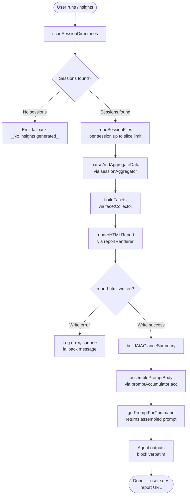

# `/insights`

> Analysis basis: CC v2.1.196 bundle.js (AST extraction + Claude interpretation)
> Minimum version: v2.1.196

---

## Overview

The `/insights` command generates a shareable HTML usage-analysis report by scanning the user's Claude Code session data from disk, aggregating statistics across all sessions, and then instructing the agent to output a fixed confirmation message pointing the user to the generated report URL. The command performs substantial offline data-processing (facet collection, session reading, report rendering) before the agent prompt is assembled, so the agent itself does not compute the statistics — it only delivers the pre-formatted result verbatim.

---

## Registration

| Field | Value |
|---|---|
| type | `prompt` |
| name | `insights` |
| description | `Generate a report analyzing your Claude Code sessions` |
| loc_byte | `13595823` |
| loc_byte_end | `13597127` |
| loc_line | `10319` |
| handler_method | `getPromptForCommand` |
| handler_method_start | `13595997` |
| handler_method_end | `13597126` |
| prompt_body.length | `513` characters |
| prompt_body.trace | `call→acc(...) (1 literals)` |
| arbor_handler.name | `getPromptForCommand` |
| arbor_handler.fqn | `claude-2.1.196::getPromptForCommand` |
| arbor_handler.kind | `Method` |
| arbor_handler.resolution_path | `direct` |
| arbor_handler.n_hits | `1` |

Analysis basis: CC v2.1.196 bundle.js:+13595823

---

## Input Branching

The command has 4+ distinct branches (session data available vs. absent, report generation success vs. failure, and the insights data population path), so a Mermaid flowchart is used.



Analysis basis: CC v2.1.196 bundle.js:+13596003 (handler entry), +13582033 (session scan), +13583238 (facet/report path), +13596894 (fallback literal), +13597029 (prompt accumulator call)

---

## Behavioral Spec

### 1. Session Discovery (`scanSessionDirectories`)

The handler first locates the Claude Code data directory and enumerates project-level sub-directories.

```
function scanSessionDirectories(baseDataPath):
    projectsDir = path.join(baseDataPath, "projects")   // literal: "projects"
    entries = fs.readdir(projectsDir)
    dirs = entries.filter(entry => entry.isDirectory())
    // Concurrency: up to 50 directories scanned in parallel (literal: 50)
    // with a batch size ceiling of 200 (literal: 200)
    // setImmediate used to yield between batches
    dirs = dirs.sort()
    return dirs
```

Analysis basis: CC v2.1.196 bundle.js:+13582033 (`msm`), +13582052 (readdir), +13582444 (50 limit), +13582449 (200 limit), +13582332 (setImmediate yield), +5422452 ("projects" literal)

---

### 2. Session File Reading (`sessionFileReader`)

For each discovered project directory, the handler reads `.jsonl` session files.

```
function sessionFileReader(projectDir):
    facetsDir = path.join(projectDir, "facets")          // literal: "facets"
    usageDataPath = path.join(projectDir, "usage-data")  // literal: "usage-data"
    sessionMetaPath = path.join(projectDir, "session-meta") // literal: "session-meta"

    files = fs.readdir(facetsDir)
    jsonlFiles = files.filter(f => f.endsWith(".jsonl") AND f.isFile())
    // reads each file via utf-8 encoding (literal: "utf-8")
    content = fs.readFile(filePath, "utf-8")
    parsed = JSON.parse(content)    // via safeJsonParse
    return parsed
```

Analysis basis: CC v2.1.196 bundle.js:+13685600 (`VTt` readdir), +13685706 (".jsonl" literal), +13521208 ("usage-data"), +13521304 ("session-meta"), +13521258 ("facets"), +13527373 ("utf-8"), +13527394 (JSON.parse path)

---

### 3. Data Aggregation and Facet Collection (`sessionAggregator`, `facetCollector`)

Raw session data is parsed and classified. Tool names, response times, error codes, time-of-day buckets, and tool-use categories are accumulated across all sessions.

```
function sessionAggregator(rawSessions):
    for each session in rawSessions:
        classify tool calls:
            // Recognises: WebSearch, WebFetch, Edit, Write, mcp__ prefix tools
            // Categories: "git commit", "git push", "content", "Other"
        bucket response times:
            // Buckets: "2-10s", "10-30s", "30s-1m", "1-2m", "2-5m", "5-15m", ">15m"
        bucket time-of-day:
            // "Morning (6-12)", "Afternoon (12-18)", "Evening (18-24)", "Night (0-6)"
        accumulate error classifications:
            // "Command Failed", "User Rejected", "Edit Failed",
            // "File Changed", "File Too Large", "File Not Found"
    return aggregatedStats
```

```
function facetCollector(aggregatedStats):
    // Reads existing facet files and merges with fresh aggregation
    // Facet keys include: "summary", "last-prompt", "custom-title",
    //   "ai-title", "tag", "relocated", "agent-name", "agent-color",
    //   "agent-setting", "mode", "permission-mode", "isolation-latch",
    //   "worktree-state", "pr-link", "bridge-session",
    //   "file-history-snapshot", "attribution-snapshot",
    //   "content-replacement", "fork-context-ref",
    //   "marble-origami-commit", "marble-origami-snapshot",
    //   "marble-origami-reset"
    // Session count cap: most-recent 20 sessions used for display (literal: 20)
    return facets
```

Analysis basis: CC v2.1.196 bundle.js:+13521787 ("tool_use"), +13521880 ("mcp__"), +13522288 ("git commit"), +13538595–13538655 (response time bucket literals), +13539443–13539596 (time-of-day literals), +13522836 ("Other"), +13671454 ("summary"), +13671521 ("last-prompt"), +13534258 (20-session cap)

---

### 4. HTML Report Rendering (`reportRenderer`)

The aggregated statistics are rendered into a self-contained HTML report file.

```
function reportRenderer(stats, outputPath):
    // Escapes HTML entities: & → &amp;, < → &lt;, > → &gt;, " → &quot;, ' → &apos;
    // Bold markdown (**text**) → <strong>text</strong>
    // Bullet prefix "• " applied to list items
    // Line breaks → <br>
    // Color palette used: #2563eb, #0891b2, #10b981, #8b5cf6, #dc2626, #16a34a, #eab308
    // Empty-state placeholders:
    //   "No data" → <p class="empty">No data</p>
    //   "No response time data" → <p class="empty">No response time data</p>
    //   "No time data" → <p class="empty">No time data</p>
    //   "No tool errors" → <p class="empty">No tool errors</p>
    // Output filename: "report.html"  (literal)
    // Max HTML content size: 8192 characters per section (literal)

    htmlContent = buildHTMLSections(stats)
    outputFilePath = path.join(outputPath, "report.html")

    // Ensures output directory exists (recursive mkdir)
    fs.mkdir(path.dirname(outputFilePath), { recursive: true })
    fs.writeFile(outputFilePath, htmlContent, "utf-8")
    return outputFilePath
```

Analysis basis: CC v2.1.196 bundle.js:+5461690–5461813 (HTML entity literals), +13540301 (`<strong>$1</strong>`), +13540344 ("• "), +13540374 (`<br>`), +13576260–13580718 (color literals), +13585012 ("report.html"), +13537764 (8192 limit)

---

### 5. At-a-Glance Summary Assembly (`atAGlanceSummary`)

A compact human-readable summary is assembled for injection into the agent prompt (not shown directly to the user).

```
function atAGlanceSummary(stats, facets):
    // Label: "at_a_glance" (literal)
    // Uses Math.round for all numeric formatting
    // Includes session count, tool usage breakdown, response-time medians,
    //   and top-level error rates
    // Limited to context-window-friendly size; max retained sessions: 20
    return summaryText
```

Analysis basis: CC v2.1.196 bundle.js:+13535622 ("at_a_glance"), +13596384 (Math.round in handler), +13534258 (20 cap)

---

### 6. Prompt Assembly (`getPromptForCommand` / `promptAccumulator`)

The handler's `getPromptForCommand` method collects all computed artefacts and assembles the final agent prompt via the `acc` accumulator function.

```
function getPromptForCommand(context):
    insightsData = collectInsightsData(context)
    reportURL = deriveReportURL(insightsData)
    htmlFilePath = insightsData.htmlFilePath        // absolute path to report.html
    facetsDirectory = insightsData.facetsDirectory
    atAGlanceSummary = insightsData.summary

    if insightsData is empty:
        promptText = "_No insights generated_"     // literal: fallback
    else:
        // Prompt structure (≈513 chars):
        //   - Opening: states user ran /insights
        //   - Embeds: full insights data block
        //   - Embeds: Report URL, HTML file path, Facets directory
        //   - Embeds: at-a-glance summary (marked as context-only)
        //   - Instruction: output <message>…</message> block verbatim
        //   - <message> block: confirmation text with report URL
        //     and invitation to explore sections
        promptText = acc(/* assembled parts */ )   // via Me (JSON.stringify) + Vcr

    return promptText
```

The prompt explicitly instructs the agent: "Output the text between `<message>` tags verbatim as your entire response. Do not omit any line." This means the agent's user-visible reply is fully predetermined by the report generation step; no inference or summarisation of session data happens in the model turn.

Analysis basis: CC v2.1.196 bundle.js:+13596003 (handler entry), +13596894 ("_No insights generated_" literal), +13597029 (acc call), +13597047 (Me call), +13597093 (Vcr call), +13596455 (" · " separator literal)

---

### 7. Session Data Persistence (`sessionWriter`, `facetPersister`)

Between invocations, CC persists facet data and session metadata to disk so subsequent `/insights` runs accumulate history.

```
function sessionWriter(sessionData, sessionPath):
    fs.mkdir(sessionDir, { recursive: true })
    fs.writeFile(sessionPath, Me(sessionData), "utf-8")   // JSON-stringify then write

function facetPersister(facets, facetPath):
    fs.mkdir(facetDir, { recursive: true })
    fs.writeFile(facetPath, Me(facets), "utf-8")
    // Also deletes stale/superseded facet files via IB.unlink
```

Analysis basis: CC v2.1.196 bundle.js:+13527133 (tsm mkdir), +13527221 (tsm writeFile), +13527890 (rsm mkdir), +13527971 (rsm writeFile), +13527041 (esm unlink)

---

## State & Side Effects

| Item | Detail |
|---|---|
| Telemetry | `tengu_daemon_config_reload` (+18010884); `tengu_daemon_idle_exit` (+18016355); `tengu_daemon_control` (+18033163); `tengu_bg_dispatch_sigkill_escalate` (+17993512); `tengu_bg_dispatch_low_mem` (+17994102); `tengu_bg_spare_enable` (+17994792); `tengu_bg_spare_claim` (+17994920); `tengu_bg_spare_claim_fail` (+17995186); `tengu_transcript_phantom_parent` (+13670186); `tengu_relink_walk_broken` (+13646023); `tengu_transcript_parent_cycle` (+13674374); `tengu_chain_parent_cycle` (+13647800); `tengu_chain_timestamp_fallback` (+13647949); `tengu_chain_parallel_tr_recovered` (+13649815); `tengu_daemon_yield` (+18015313) — all reachable within the depth-2 call graph of `icc`/`nfe`/`qcr` |
| Disk writes | Writes `report.html` to the insights output directory (+13585012); creates intermediate directories with recursive mkdir (+13584753); may write or overwrite session-meta and facet `.jsonl` files |
| Disk reads | Reads all `.jsonl` files under each project's `facets/` subdirectory; reads `usage-data` and `session-meta` files; up to 50 directories in parallel, 200 max batch (+13582444, +13582449) |
| Disk deletes | Stale superseded facet files removed via `IB.unlink` (+13527041) |
| Agent output | Agent is constrained to output the `<message>` block verbatim — no free-form generation |
| Fallback | If no session data is found, the prompt body reduces to the literal `_No insights generated_` (+13596894) |
| Sound | <!-- TODO: not found in depth-2 traversal; needs --depth 4 --> |
| appState changes | <!-- TODO: not found in depth-2 traversal; needs --depth 4 --> |
| Hook registration | <!-- TODO: not found in depth-2 traversal; needs --depth 4 --> |

---

## Version History

| Version | Change |
|---|---|
| v2.1.196 | Initial analysis |

---

## Common Mistakes

1. **Expecting live AI analysis** — The model does not compute the insights. All statistics are pre-calculated on disk before the agent prompt is assembled; the agent only delivers the pre-formatted confirmation message.
2. **Running before any sessions exist** — If no `.jsonl` facet files are found in any project directory, the command falls back to the message `_No insights generated_` and no HTML file is produced.
3. **Looking for output in the working directory** — The `report.html` file is written to a path derived from the Claude Code data directory (not the current project directory). The report URL embedded in the agent's response is the canonical location.
4. **Invoking repeatedly in quick succession** — The session-scan logic iterates all project directories with `setImmediate`-based yielding; rapid repeated invocations may produce redundant disk writes before the previous scan completes.
5. **Expecting Markdown output** — The agent is instructed to output only the literal `<message>` block content. Sections of the generated HTML report are not echoed to the terminal; the user must open the report URL directly.
6. **Assuming all facet keys are populated** — Many facet keys (`marble-origami-*`, `worktree-state`, `bridge-session`, etc.) are only written when specific Claude Code features have been used. A sparse facets directory will produce a sparse report.

---

## Appendix — Identifier Mapping

> For bundle debugging only. Identifiers change across versions.

| Identifier | Role |
|---|---|
| `icc` | Main insights data collector / orchestrator function |
| `msm` | Session directory scanner (reads project subdirectories) |
| `b2` | Path builder for the projects directory |
| `VTt` | Facet file enumerator (reads `.jsonl` files per project) |
| `NM` | File extension tester (`.jsonl` filter predicate) |
| `nsm` | Session file reader (reads and parses individual session files) |
| `ejo` | Session path resolver |
| `men` | Base data-path resolver |
| `rcc` | Raw content decoder helper |
| `Gt` | Safe JSON parser wrapper |
| `kge` | JSON stringifier helper |
| `TYe` | File stat / existence checker |
| `gic` | Key-length maximiser / column-width calculator |
| `Wqc` | Heartbeat / keepalive scheduler |
| `qcr` | Facet aggregator and report-data assembler |
| `nfe` | Full facet-collection orchestrator (populates all facet Map entries) |
| `Psm` | Facet Map initialiser |
| `bW` | Facet entry builder |
| `YQe` | Nested-object walker for facet values |
| `_E` | Facet entry validator / normaliser |
| `kcc` | Facet chain relinker |
| `uim` | Binary `.jsonl` parser (low-level buffer operations) |
| `dim` | Synchronous binary file reader (open/read/close) |
| `cim` | Streaming `.jsonl` chunk parser |
| `rwe` | Report-write error handler |
| `zo` | Filesystem permission error classifier |
| `Re` | Generic error reporter |
| `VAe` | Chain builder / session-chain validator |
| `Jsm` | NaN-safe session counter |
| `Xsm` | Session ranking and deduplication sorter |
| `zsm` | Session queue processor |
| `CHt` | Display-mapping transformer |
| `kjo` | Text sanitiser for report output |
| `NQt` | Report section string builder |
| `Pjo` | Content-type classifier for session entries |
| `Qsm` | Text trimmer / array-type guard |
| `Zsm` | Array content type tester |
| `FAe` | Facet presence guard |
| `aur` | Usage-rate accumulator |
| `lur` | Facet value list flattener |
| `zom` | NaN-safe numeric coercion |
| `njo` | Session statistics normaliser |
| `ncc` | Session entry classifier (tool names, error types, time buckets) |
| `fen` | Tool-name feature extractor |
| `Kom` | File-extension extractor (via `dz.extname`) |
| `Zke` | Diff-based change detector |
| `_u` | Index-of helper for array searching |
| `qg` | Rounding/quantisation helper |
| `tjo` | Time-of-day bucketing helper |
| `rsm` | Facet file writer (mkdir + writeFile) |
| `Me` | JSON serialiser (`JSON.stringify` wrapper) |
| `esm` | Session metadata reader/unlinker |
| `Vcr` | Session path constructor |
| `lcc` | Stale-file cleanup helper |
| `osm` | HTML report orchestrator (calls `EEt` and `Sc`) |
| `Zom` | Batch session processor |
| `Jom` | Per-session entry processor |
| `EEt` | HTML report template renderer |
| `Sc` | Report section collector |
| `wtr` | Agent-listing delta writer (writes hash-keyed report file) |
| `Mn` | UUID generator wrapper |
| `fYe` | Report section error handler |
| `BR` | Report post-processor |
| `H0` | Report header builder |
| `jN` | Report footer / navigation builder |
| `tcc` | Report type classifier |
| `N_` | Report path normaliser |
| `cf` | Report config loader |
| `Rt` | Runtime config accessor |
| `oc` | Output content filter |
| `er` | Error string formatter |
| `tsm` | Session transcript writer (mkdir + writeFile) |
| `gsm` | Stats-key enumerator (`Object.keys` wrapper) |
| `scc` | Statistics compiler (sorts, percentiles, round) |
| `jTt` | Entry-map iterator (`Object.entries` wrapper) |
| `yi` | String slicer (indexOf + slice) |
| `occ` | Numeric outlier classifier |
| `ism` | HTML section generator (per-session map → Promise.all) |
| `ecc` | Per-session HTML renderer |
| `Wom` | Report directory path resolver |
| `Uo` | Object merge helper (`Object.assign`) |
| `psm` | Full HTML document builder |
| `cp` | HTML-escape and markdown-to-HTML converter |
| `fl` | HTML entity replacer |
| `jcr` | HTML converter wrapper |
| `dsm` | Section data serialiser |
| `aIe` | Bar-chart HTML builder |
| `csm` | Column-width calculator for tables |
| `usm` | Row-map builder for report tables |
| `D` | Date/time formatter (getFullYear/getMonth/getDate etc.) |
| `acc` | Prompt-body accumulator (assembles final string passed to agent) |

---

Note: index built via Arbor fallback; some signals (telemetry, literals) may be missing — see arbor-fallback.js.