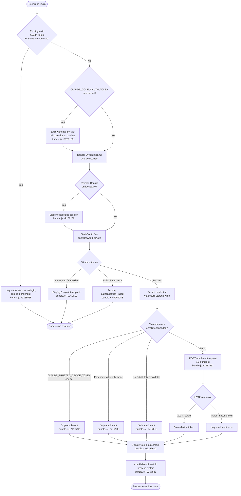

# `/login`

> Analysis basis: CC v2.1.196 bundle.js (AST extraction + Claude interpretation)
> Minimum version: v2.1.196

---

## Overview

The `/login` command launches an interactive OAuth-based sign-in flow that allows a user to authenticate with their Anthropic account or switch to a different Anthropic account. It renders a JSX-based UI component (`LOe`) that orchestrates the browser-based OAuth exchange, persists the resulting credential, and then triggers a full application relaunch to apply the new identity. Side effects include disconnecting any active Remote Control bridge session and potentially re-enrolling a trusted-device token.

---

## Registration

| Field | Value |
|---|---|
| type | `local-jsx` |
| name | `login` |
| description | `Switch Anthropic accounts \| Sign in with your Anthropic account` |
| module_id | `Ocl` |
| load_inline | `true` |
| loc_byte | `12005743` |
| loc_byte_end | `12005963` |
| loc_line | `8123` |
| arbor_handler.name | `n4l` |
| arbor_handler.fqn | `claude-2.1.196::n4l` |
| arbor_handler.kind | `Function` |
| arbor_handler.resolution_path | `direct` |
| arbor_handler.n_hits | `2` |

Analysis basis: CC v2.1.196 bundle.js:+12005743

---

## Input Branching

The command has more than three distinct execution branches (no-op reuse of existing session, normal interactive OAuth, account-switch with bridge disconnect, same-account re-login skip, trusted-device enrollment, and relaunch). A Mermaid flowchart is used.



---

## Behavioral Spec

### 1. Command Entry — Main Handler (`wOe` / `Jlf`)

The top-level handler for this command is the composite of the outer render function `Jlf` (which produces the JSX tree) and the async action function `wOe` (which drives the login logic). Arbor resolves the registration handler as `n4l`; the BFS synthetic entry is `__handler_login`. Per the writing rules, the Arbor name is authoritative.

```
async function loginCommandHandler(context):
    // 1. Read current auth state
    currentAPIKey  = context.getAppState("apiKey")
    currentOAuth   = context.getAppState("oauthToken")

    // 2. Apply pending message operation to conversation (update op, sequence 1)
    context.applyMessageOp({ type: "update", seq: 1 })

    // 3. Snapshot timestamp via timestampHelper (dQe → Date.now)
    ts = timestampHelper()

    // 4. Resolve the API-key source (Hr) to determine auth type
    authSource = resolveAuthKeySource()   // gateway | bedrock | vertex | firstParty | ...

    // 5. Build login UI props (m8e subtree)
    loginProps = buildLoginProps(context)

    // 6. Render interactive JSX UI — returns when user completes or cancels
    result = await renderLoginUI(loginProps)   // LOe component

    if result.interrupted:
        display("Login interrupted")
        return

    if result.error:
        display("authentication_failed")
        return

    // 7. Bridge disconnect (if remote-control session is active)
    if context.getAppState("bridgeSession") is active:
        log("[bridge:repl] Account changed via /login — disconnecting Remote Control session")
        context.setAppState({ bridgeSession: null })

    // 8. Same-account re-login guard (I2t / ODe)
    if newToken.sub == existingToken.sub and newToken.org == existingToken.org:
        log("[trusted-device] Same account+org re-login with existing token, skipping re-enrollment")
        // skip to relaunch
    else:
        // 9. Trusted-device enrollment (__o → FGt)
        enrollTrustedDevice(newToken)

    // 10. Persist credential (Re / secureStorage write)
    persistCredential(newToken)

    // 11. Remote settings + policy limits refresh (m8e → vyo / xyo)
    refreshRemoteSettings()
    refreshPolicyLimits()

    // 12. Global config save (h4 → Dt)
    saveGlobalConfig()

    // 13. Feature-flag refresh (I7n → lRn)
    refreshFeatureFlags()

    // 14. Relaunch
    display("Login successful")
    context.execRelaunch()
```

Analysis basis: CC v2.1.196 bundle.js:+9257563 – +9258698

---

### 2. Auth-Key Source Resolution (`Hr`)

```
function resolveAuthKeySource(env, config):
    // Checks environment variables and config fields in priority order
    if env.ANTHROPIC_API_KEY:          return "firstParty"
    if config.apiKeyHelper != "none":  return "apiKeyHelper"
    if env.ANTHROPIC_AUTH_TOKEN:       return "gateway"
    if env.CLAUDE_CODE_OAUTH_TOKEN or
       env.CLAUDE_CODE_OAUTH_TOKEN_FILE_DESCRIPTOR or
       env.CCR_OAUTH_TOKEN_FILE:       return "oauth" (firstParty sub-type)
    if bedrock config present:         return "bedrock"
    if vertex config present:          return "vertex"
    if anthropicAws config present:    return "anthropicAws"
    if mantle config present:          return "mantle"
    if foundry config present:         return "foundry"
    // No auth found
    throw "ANTHROPIC_API_KEY, ANTHROPIC_AUTH_TOKEN, CLAUDE_CODE_OAUTH_TOKEN, or WIF env vars … required"
```

The error message literal is: `"ANTHROPIC_API_KEY, ANTHROPIC_AUTH_TOKEN, CLAUDE_CODE_OAUTH_TOKEN, or WIF env vars (ANTHROPIC_FEDERATION_RULE_ID + ANTHROPIC_ORGANIZATION_ID) required"` (bundle.js:+3095255).

Analysis basis: CC v2.1.196 bundle.js:+2153075, +3094786, +3094880, +3092974, +3093063

---

### 3. OAuth Login UI Component (`LOe` / render function `Jlf`)

```
function renderLoginUI(props):
    // React functional component rendered in-terminal via Ink

    [loginResult, setLoginResult] = useState(null)

    // Register keyboard interrupt handler (Or → s.registerHandler)
    registerKeyHandler("escape" / "ctrl-c", onInterrupt)

    // Spinner / confirmation sub-components (cg → jYi → Gto)
    showSpinner while oauth in flight

    // Confirm-no shortcut available (literal "confirm:no" bundle.js:+9260020)
    on user presses Escape / Ctrl-C:
        setLoginResult({ interrupted: true })
        props.onDone()

    // After OAuth completes:
    if success:
        display "Login successful"    // bundle.js:+9259600
    else if interrupted:
        display "Login interrupted"   // bundle.js:+9259619

    return loginResult
```

Width constant: 21 columns (bundle.js:+9259689).
React memo cache uses sentinel `"react.memo_cache_sentinel"` (bundle.js:+9259753), with memo slots 5, 7, 8, 9, 11–19 (various loc_bytes in range +9259930–+9260670).

Analysis basis: CC v2.1.196 bundle.js:+9259683, +9259702, +9259742

---

### 4. Trusted-Device Enrollment (`__o` → `FGt`)

```
async function enrollTrustedDevice(oauthToken):
    // Guard conditions — skip enrollment if any applies
    if env.CLAUDE_TRUSTED_DEVICE_TOKEN is set:
        log("[trusted-device] CLAUDE_TRUSTED_DEVICE_TOKEN env var is set, skipping enrollment")
        return

    if essentialTrafficOnlyMode():
        log("[trusted-device] Essential traffic only, skipping enrollment")
        return

    if not oauthToken:
        log("[trusted-device] No OAuth token, skipping enrollment")
        return

    // Policy / corporate check (FGt → o.isPolicyAllowed / o.isPolicyEnforced)
    if not policy.isPolicyAllowed("trustedDevice"):
        return

    // Build enrollment request
    request = {
        method: "POST",
        url:    resolveEnrollmentEndpoint(),   // Us → EHs / HSu
        headers: {
            "Content-Type":  "application/json",   // bundle.js:+7417470
            "Authorization": "Bearer " + oauthToken
        },
        timeout: 10000   // 10 s  bundle.js:+7417513
    }

    response = await fetch(request)

    if response.status == 201:   // bundle.js:+7417701
        if response.body.device_token is missing:
            log("[trusted-device] Enrollment response missing device_token field")
            telemetry("bridge_trusted_device_enroll", { result: "missing_token" })
            return
        storeDeviceToken(response.body.device_token)   // secureStorage write (tci)
    else:
        telemetry("bridge_trusted_device_enroll", { result: "http_error" | "unknown" | "storage_failed" })
```

Analysis basis: CC v2.1.196 bundle.js:+7416792, +7417106, +7417219, +7417513, +7417615, +7417701

---

### 5. Remote Managed Settings Refresh (`m8e` → `vyo` → `oQ` → `G$p` → `OBa`)

Triggered automatically after successful login to re-pull org-level managed settings.

```
async function refreshRemoteSettings():
    // Attempt fetch with ETag / If-None-Match caching
    headers["Cache-Control"] = "no-cache"       // bundle.js:+7492882
    headers["If-None-Match"] = cachedETag

    response = await httpGet(managedSettingsURL)

    switch response.status:
        case 200:
            validateAndApply(response.body)
            log("Remote settings: Fetched successfully")          // bundle.js:+7494204
        case 204, 304:
            log("Remote settings: Using cached settings (304)")   // bundle.js:+7493358
        case 401:
            telemetry event: force-refresh-retry
        case 404:
            saveEmptySentinel()
            log("Remote settings: Saved empty sentinel (404 response)")  // bundle.js:+7496807
        case >= 500:
            fallbackToStaleCache("http_5xx")
        case >= 400:
            fallbackToStaleCache("http_4xx")
        on timeout:
            fallbackToStaleCache("timeout")
        on network error:
            fallbackToStaleCache("network_error")

    if settings changed:
        notifyChange()   // $5n → vO.notifyChange  bundle.js:+7497663
```

Known literal: `"Authentication required for remote settings"` (bundle.js:+7492746).
Gateway proxy note: `"[gateway] HTTPS proxy configured — per-request cert pin not applied to managed-settings fetch (known gap)"` (bundle.js:+7493066).

Analysis basis: CC v2.1.196 bundle.js:+7492473, +7493298 – +7495217

---

### 6. Policy Limits Refresh (`xyo` → `LBa` → `D$p` / `qV`)

```
async function refreshPolicyLimits():
    // Runs in parallel / after managed settings refresh
    result = await fetchPolicyLimits()

    switch result.outcome:
        case "succeeded":
            log("Policy limits: Applied new restrictions successfully")   // bundle.js:+14136059
        case "stale_cache_used":
            log("Policy limits: Using stale cache after fetch failure")   // bundle.js:+14135675
        case "not_modified":
            log("Policy limits: Cache still valid (304 Not Modified)")    // bundle.js:+14135840
        case "no_content":
            log("Policy limits: No restrictions (cached empty)")          // bundle.js:+14136114
        case "failed":
            log("Policy limits: Using stale cache after error")           // bundle.js:+14136251
```

Telemetry fired: `tengu_policy_limits_fetch` (bundle.js:+14135155).

Analysis basis: CC v2.1.196 bundle.js:+7495672 – +7496908

---

### 7. Global Config Save (`h4` → `Dt` / `Hn`)

```
function saveGlobalConfig(newCredential):
    // Auth-loss prevention guard (Hn)
    currentDisk = readGlobalConfigFromDisk()
    if currentDisk.auth is missing AND cache.auth is present:
        telemetry("tengu_config_auth_loss_prevented")
        log("saveGlobalConfig fallback: re-read config is missing auth that cache has; refusing to write. See GH #3117.")
        return   // Refuse write to protect credentials
    writeGlobalConfig(mergedConfig)
```

Analysis basis: CC v2.1.196 bundle.js:+14153829, +14153957

---

### 8. Feature Flag Refresh (`I7n` → `lRn` → `lFi` / `cFi`)

```
async function refreshFeatureFlags():
    clearCaches()    // t0e.clear, sRn.clear, wV.clear
    payload = await featureFlagClient.getPayload()
    applyPayload(payload)
    emit("Nit", "featureFlagsRefreshed")
```

Analysis basis: CC v2.1.196 bundle.js:+9253539, +3382998

---

### 9. Credential Storage (`tci` — secure storage write)

```
async function persistCredential(token):
    try:
        result = await primarySecureStorage.write(token)
        telemetry("secure_storage_credentials_write", { path: "primary" })
    catch transientError:
        telemetry("primary_transient_skip_fallback")   // bundle.js:+2371456
        return
    catch:
        try:
            result = await plaintextFallback.write(token)
            telemetry("plaintext_fallback_used")       // bundle.js:+2371605
        catch:
            telemetry("primary_and_fallback_failed")   // bundle.js:+2371708
```

Analysis basis: CC v2.1.196 bundle.js:+2371358, +2371456, +2371605, +2371708

---

## State & Side Effects

| Item | Detail |
|---|---|
| Telemetry | `tengu_remote_settings_401_force_refresh_retry` (bundle.js:+7494751) |
| Telemetry | `tengu_feature_bad` (bundle.js:+1028677) |
| Telemetry | `tengu_feature_ok` (bundle.js:+1028610) |
| Telemetry | `tengu_managed_settings_security_dialog_shown` (bundle.js:+7489776) |
| Telemetry | `tengu_managed_settings_security_dialog_accepted` (bundle.js:+7489460) |
| Telemetry | `tengu_managed_settings_security_dialog_rejected` (bundle.js:+7489510) |
| Telemetry | `tengu_config_auth_loss_prevented` (bundle.js:+14153957) |
| Telemetry | `tengu_policy_limits_fetch` (bundle.js:+14135155) |
| Telemetry | `tengu_feature_sad` (bundle.js:+1028758) |
| Telemetry | `tengu_policy_limits_cache_write_failed` (bundle.js:+14134558) |
| Telemetry | `tengu_disable_bypass_permissions_mode` (bundle.js:+14015380) |
| Telemetry | `tengu_auto_mode_config` (bundle.js:+14013170) |
| Telemetry | `tengu_daemon_config_reload` (bundle.js:+18010884) |
| Telemetry | `tengu_keybinding_fallback_used` (bundle.js:+4297728) |
| Telemetry | `bridge_trusted_device_enroll` (literal bundle.js:+7417615) |
| Telemetry | `remote_managed_settings_pull` (literal bundle.js:+7495954) |
| Telemetry | `remote_managed_settings_fetch_failed` (literal bundle.js:+7495998) |
| Telemetry | `remote_managed_settings_security_check` (literal bundle.js:+7489582) |
| Telemetry | `policy_limits_load` (literal bundle.js:+14134855) |
| Telemetry | `policy_limits_poll` (literal bundle.js:+14137390) |
| Telemetry | `secure_storage_credentials_write` (literal bundle.js:+2371358) |
| Hook registration | `vi → fis.register` — keyboard handler registration (bundle.js:+68542) |
| Hook registration | `Or → s.registerHandler` — escape/interrupt handler for login UI (bundle.js:+4245502) |
| Hook registration | `eJ → Nit.subscribe` — feature-flag change subscription (bundle.js:+3378273) |
| appState changes | Clears `bridgeSession` on account change (bundle.js:+9258288); sets new OAuth token; triggers `execRelaunch` |
| Secure storage | Writes new OAuth credential via primary storage; falls back to plaintext file (bundle.js:+2371358 – +2371708) |
| Global config | Re-saves `globalConfig` including updated auth; has auth-loss guard (bundle.js:+14153829) |
| Process lifecycle | Calls `f.execRelaunch()` (bundle.js:+9257838) — the process exits and restarts with the new identity |
| Sound | Not observed in depth-2 traversal |
| Remote settings | Full refresh cycle triggered post-login (bundle.js:+7497562: `"Remote settings: Refreshed after auth change"`) |
| Policy limits | Full refresh cycle triggered post-login (bundle.js:+14137203: `"Policy limits: Refreshed after auth change"`) |
| Feature flags | Full refresh cycle triggered post-login (`lRn` → `lFi.clear` + re-apply) |
| Network caches | CA certificate cache cleared (bundle.js:+1363410); mTLS config cache cleared (bundle.js:+1367329); proxy agent cache cleared (bundle.js:+1878181) |

---

## Version History

| Version | Change |
|---|---|
| v2.1.196 | Initial analysis |

---

## Common Mistakes

1. **Expecting an immediate effect without restart.** `/login` calls `execRelaunch` on success — the process fully restarts. Any in-flight conversation is discarded. Do not run `/login` mid-task expecting to resume seamlessly.
2. **`CLAUDE_CODE_OAUTH_TOKEN` env var takes precedence at runtime.** If this variable is set in the shell, the newly stored credential is overridden. The command emits a warning (bundle.js:+9259180), but users may miss it. Unset the variable before running `/login` if you need the persisted credential to apply.
3. **Trusted-device enrollment is silently skipped in several environments.** If `CLAUDE_TRUSTED_DEVICE_TOKEN` is set, or if the session runs in essential-traffic-only mode, enrollment is skipped without surfacing an error to the user.
4. **Same-account re-login skips re-enrollment.** If the OAuth sub and org match the existing token, the trusted-device step is bypassed even if the device token has expired or was revoked (bundle.js:+9258555).
5. **Remote managed-settings security dialog may block the refresh.** If the org pushes new managed settings concurrently with login, a security approval dialog is presented (telemetry `tengu_managed_settings_security_dialog_shown`). Rejecting it (`tengu_managed_settings_security_dialog_rejected`) keeps the previously cached settings in effect, not the new ones.
6. **Auth-loss protection may silently refuse a config write.** If the on-disk global config is missing auth data that the in-memory cache holds, the save is aborted (GH #3117 guard, bundle.js:+14153829). The credential persists in secure storage but may not be reflected in the config file until the issue is resolved.

---

## Appendix — Identifier Mapping

> For bundle debugging only. Identifiers change across versions.

| Identifier | Role |
|---|---|
| `wOe` | Main async login action handler |
| `Jlf` | Login UI render component (outer JSX wrapper) |
| `LOe` | Login UI React component (inner, renders spinner/confirm UI) |
| `n4l` | Arbor-resolved registration handler name |
| `dQe` | Timestamp helper (wraps `Date.now`) |
| `Hr` | Auth-key source resolver |
| `Rm` | Auth model / type enum helper |
| `ct` | String coercion utility |
| `m8e` | Login props / sub-flow builder |
| `FBa` | Login flow initializer |
| `p8e` | OAuth consent/config loader (`Cws`) |
| `oQ` | OAuth token fetch / validate orchestrator |
| `sHe` | Session/state helper |
| `mle` | Message-level helper |
| `PFe` | Policy-fetch helper |
| `Su` | Settings utility (`Trt` → `Irt`) |
| `TH` | Auth configuration reader |
| `Hd` | Config-header builder |
| `gk` | Flag-settings resolver |
| `mQe` | VSCode client-type detector |
| `gPt` | File-descriptor API key reader |
| `cb` | Profile / credential object builder |
| `Lc` | Logging / console helper (wraps `Hr`) |
| `Dt` | Telemetry dispatcher |
| `hF` | API key slice/truncation helper |
| `$5n` | Notify-change dispatcher (`vO.notifyChange`) |
| `Re` | Error reporter / logger |
| `er` | Error wrapper constructor |
| `zi` | Essential-traffic-only mode checker |
| `_Nu` | Queue shift/push manager |
| `vyo` | Remote settings poll initiator |
| `PBa` | Remote settings apply pipeline |
| `Lyo` | Remote settings cache loader |
| `oQ` | OAuth fetch (reused for remote settings context) |
| `wBa` | Settings-load timeout sentinel |
| `T` | Agent task / message sender |
| `eeu` | Task queue entry builder |
| `Me` | JSON serializer helper |
| `Pc` | Path / key redaction helper |
| `KQe` | Glob pattern matcher |
| `oeu` | File reader / stream helper |
| `xyo` | Policy limits fetch/apply orchestrator |
| `iHe` | Cache clear / state invalidator |
| `e2u` | Cache entry reader |
| `n_` | Cache clear utility (`Hin.clear`, `Qyr.clear`) |
| `l5n` | Settings hash computer (SHA-256) |
| `z_o` | Recursive object mapper |
| `G$p` | Remote settings HTTP fetcher |
| `OBa` | Remote settings HTTP request executor |
| `sQ` | Exponential back-off / jitter calculator |
| `On` | Retry-with-timeout wrapper |
| `ke` | React render helper (V / Oe) |
| `Ctt` | Cache-clear trigger (calls `n_`) |
| `xe` | Secondary React render helper |
| `qe` | React effect wrapper |
| `MBa` | Managed-settings writer helper |
| `gwe` | Warning emitter (`$tt`) |
| `LBa` | Policy-limits fetch/apply orchestrator |
| `c5n` | Policy config key reader |
| `vmt` | Policy config entry mapper |
| `R2a` | Policy config validator |
| `vBa` | Policy config applier |
| `D$p` | Pending-request queue manager |
| `qV` | Write-permission gater (`jZr`, `neo`, `lre`) |
| `RU` | Policy limits storage writer |
| `xBa` | Settings change broadcaster |
| `Bc` | Change event emitter |
| `DBa` | Settings file writer |
| `ogn` | Path join / session helper |
| `UBa` | Background poll trigger |
| `$Ba` | Background settings poll runner |
| `yRn` | Interval manager (setInterval / clearInterval) |
| `j$p` | Poll execution step |
| `vi` | Keyboard/hook registrar (`fis.register`) |
| `A7n` | Deep-equals / state-diff checker |
| `kSr` | State snapshot reader |
| `fn` | Render / display function |
| `Bgn` | Render cache lookup (`vss`, `wss`) |
| `CDr` | Display sub-renderer |
| `I3` | Display orchestrator (many sub-renderers) |
| `hMt` | WSL/Windows display helper |
| `f` | Process/relaunch handle |
| `L8` | Path normalizer (Windows replaceAll) |
| `I7n` | Feature-flag refresh orchestrator |
| `Rin` | Feature-flag client initializer |
| `EV` | Environment variable reader |
| `wcl` | PLo cache clearer |
| `lRn` | Feature-flag payload applier |
| `P6` | Feature-flag client accessor |
| `D6` | Feature-flag store (`q3`) |
| `lFi` | Feature-flag payload processor |
| `cFi` | Feature-flag snapshot builder |
| `Hn` | Global config save executor (auth-loss guard) |
| `h4` | Post-login config/cache refresh orchestrator |
| `Lcl` | Config reader (`ct`, `I8`) |
| `I8` | CPu capability checker |
| `F_t` | Network config updater (certs, mTLS, proxy) |
| `Vlf` | CA cert cache updater |
| `jlf` | Cert-filter helper |
| `Wlf` | mTLS config filter |
| `HJi` | Header allow-list checker |
| `_Ji` | Header block-list checker |
| `Klf` | Proxy config filter |
| `Blf` | Additional proxy filter |
| `sT` | Active-session tracker (NFe, HI.filter) |
| `PRn` | Post-login notification sender |
| `Axs` | CA cert cache clearer |
| `vxs` | mTLS cache clearer |
| `KUr` | Proxy agent cache clearer |
| `vDt` | Network adapter re-initializer |
| `YM` | Undici/HTTP stack helper |
| `t6s` | IP version resolver (IPv4/IPv6) |
| `W8` | URL / host parser |
| `cKt` | Policy limits background poll driver |
| `VVo` | Policy-limits change notifier |
| `lye` | Feature-event emitter |
| `Aai` | Allowlist event emitter |
| `MFi` | kFi event emitter |
| `pdr` | Policy limits poll scheduler |
| `GF` | Policy limits state accessor |
| `P$t` | Policy limits data builder |
| `a0e` | Policy limits file-path resolver |
| `mdr` | Policy limits poll runner |
| `dmc` | Policy limits full fetch cycle |
| `O$t` | Policy limits disk cache reader |
| `cmc` | Policy limits cache freshness checker |
| `sdm` | Policy limits hash computer |
| `idm` | Policy limits credential reader |
| `adm` | Policy limits retry scheduler (`sQ`, `On`) |
| `Mo` | React component mount helper |
| `fw` | Policy limits render function |
| `wt` | Ink render helper |
| `cdm` | Policy limits disk cache writer |
| `pmc` | Policy limits poll cycle |
| `ddm` | Policy limits poll step |
| `Wxe` | Unknown post-login hook |
| `Bce` | Feature-flag client teardown |
| `Uit` | Feature-flag client cleanup (clears multiple caches) |
| `tYr` | Process listener remover |
| `Nc` | Permission model reader (aE, Dt) |
| `aE` | Auth-environment reader |
| `AUt` | Auth utility (`Jst`) |
| `Jst` | JWT/token parser (`ct`, `I8`) |
| `I2t` | Same-account re-login detector |
| `__o` | Trusted-device enrollment entry point |
| `eo` | ESModule/namespace initializer |
| `PDe` | Feature-flag context accessor (`it`) |
| `it` | Feature-flag value reader |
| `iRn` | Feature-flag evaluation helper |
| `Ml` | Storage read/write orchestrator (`tci`) |
| `tci` | Secure storage read/write (primary + fallback) |
| `t9e` | Storage async read helper |
| `FGt` | Trusted-device enrollment executor |
| `FF` | Feature-flag value fetcher |
| `dFi` | Feature-flag cached-value reader |
| `IUp` | Environment/context reader (N2, eo) |
| `f_o` | Trusted-device context reader (Gc, eo) |
| `Us` | OAuth endpoint resolver |
| `EHs` | Default OAuth endpoint provider |
| `HSu` | OAuth URL validator |
| `smn` | Enrollment HTTP helper |
| `he` | String coercion helper |
| `Rcl` | Post-login remote cleanup helper |
| `sKt` | Auto-mode gate checker |
| `C7n` | Auto-mode feature reader |
| `eYr` | Boolean feature-flag reader |
| `hWt` | Permission mode setter (`OH`) |
| `OH` | Permission model updater |
| `Np` | K2u helper |
| `Ur` | Session state reader |
| `ptr` | Fo helper (working-directory finder) |
| `Fo` | Session context accessor |
| `ftr` | Fo helper (tool-filter finder) |
| `Sk` | Permission-mode validator (`FYr`) |
| `FYr` | Bypass-permissions guard |
| `FLo` | Post-login feature-limits loader |
| `iKt` | Manage settings init (`aKt`) |
| `aKt` | Settings init orchestrator |
| `nJ` | Feature-flag init accessor |
| `aRn` | Feature-flag resolver |
| `Ts` | Model-tier resolver (`d6`, `jo`, `SH`) |
| `d6` | Model-tier lookup |
| `jo` | Model alias resolver |
| `SH` | Model string normalizer |
| `F_e` | Claude-3 / older-model gating helper |
| `io` | Inference-profile type checker |
| `jst` | JWT/token string helper |
| `ANe` | Auto-mode notifier (`Q5`) |
| `d` | Daemon supervisor / server reload |
| `TYe` | File-stat / MIME-type helper |
| `gic` | File-column-width calculator |
| `i` | Connection close/open manager |
| `E` | SDK connection manager |
| `A` | SDK user-info fetcher |
| `Wqc` | Heartbeat sender |
| `I` | Input handler (Math.floor, preventDefault) |
| `nee` | Session-label helper |
| `s3` | Session-ID generator |
| `sEe` | Event-stream processor (`Jc`) |
| `Jc` | Event-stream parser |
| `mIe` | Multi-session permission mapper |
| `W_t` | Authentication failure state builder |
| `$w` | Last-assistant-message finder |
| `kb` | Login UI state manager (`At`, `zqe`, `V_`) |
| `At` | App-state context reader |
| `ceo` | Context error guard |
| `zqe` | Login UI reducer/effect hook |
| `eJ` | Feature-flag subscription hook |
| `iFi` | Promise-resolve wrapper |
| `V_` | App-state selector helper |
| `E7n` | Command-input parser composite |
| `rS` | Raw input trimmer |
| `$a` | String escape/replace helper |
| `Xte` | Input extension helper |
| `tli` | Tokenised-line builder |
| `bF` | Message-format composer |
| `eli` | Enforce-available-models checker |
| `Fa` | Full prompt builder |
| `w0` | Sensitive-string checker |
| `Ad` | Anthropic-header builder |
| `jle` | Forbidden-header checker |
| `Wbn` | Prompt-segment builder |
| `jC` | Context/conversation compiler |
| `NEr` | Non-empty-result validator |
| `f6` | Conversation-format converter |
| `LFe` | Conversation length enforcer |
| `Zai` | Message-array validators |
| `$9r` | System-prompt builder |
| `ZPt` | Context-window packer |
| `QPt` | Prompt token counter |
| `ZS` | Theme context reader |
| `Or` | Escape/interrupt key handler |
| `QS` | Theme context accessor |
| `cg` | Spinner/progress renderer |
| `jYi` | Login spinner composite |
| `Gto` | Progress-bar component |
| `tG` | Debounced-render hook |
| `Wu` | Key-event handler component |
| `p` | Forced-shutdown executor |