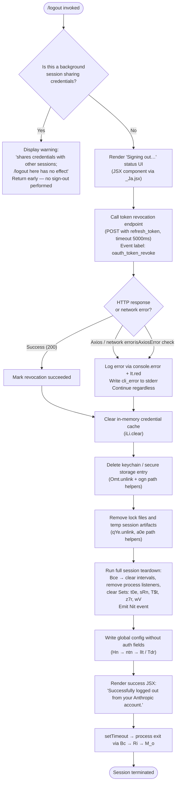

# `/logout`

> Analysis basis: CC v2.1.196 bundle.js (AST extraction + Claude interpretation)
> Minimum version: v2.1.196

---

## Overview

The `/logout` command signs the user out of their Anthropic account by revoking the active OAuth token, clearing all in-memory credential caches, removing credential storage entries, and then rendering a confirmation UI before terminating the session. It is a `local-jsx` command that renders a React JSX component for its output rather than returning plain text.

---

## Registration

| Field | Value |
|---|---|
| type | `local-jsx` |
| name | `logout` |
| description | `Sign out from your Anthropic account` |
| loc_byte | `12006024` |
| loc_byte_end | `12006308` |
| loc_line | `8123` |
| module_id | `RTo` |
| load_inline | `true` |
| arbor_handler.name | `eQp` |
| arbor_handler.fqn | `claude-2.1.196::eQp` |
| arbor_handler.kind | `AsyncFunction` |
| arbor_handler.resolution_path | `module_id` |
| arbor_handler.n_hits | `0` |

Analysis basis: CC v2.1.196 bundle.js:+12006024

---

## Input Branching

The handler contains 4+ distinct branches (background session guard, token revocation success/failure, credential store clearing, and session teardown), so a Mermaid flowchart is used.



---

## Behavioral Spec

### Main Handler — `signOutHandler` (`eQp`)

The Arbor-resolved handler is `eQp` (AsyncFunction, `claude-2.1.196::eQp`, resolution path: `module_id`).

```
async function signOutHandler(commandContext):
    sessionType = getSessionType()   // checks "bg", "daemon", "daemon-worker" literals

    if sessionType is background:
        return renderJSX(
            warningMessage: "This background session shares credentials…"
        )

    renderJSX(statusText: "Signing out…")

    // Step 1 — Revoke OAuth token remotely
    try:
        response = await revokeOAuthToken(
            endpoint  = resolveOAuthEndpoint(),   // TN → Us → HSu
            body      = { grant_type: "refresh_token", token: currentToken },
            headers   = { "Content-Type": "application/json" },
            timeout   = 5000                       // bundle.js:+2165397
        )
        // event label: "oauth_token_revoke"       // bundle.js:+2165407
    catch networkOrAxiosError:
        logError(console.error, It.red, "cli_error")   // bundle.js:+13489050

    // Step 2 — Clear in-memory credential cache
    clearCredentialCache()   // Ane → iLi.clear   bundle.js:+3085966

    // Step 3 — Remove persisted credentials
    deleteSecureStorageEntry()   // NBa → Omt.unlink  bundle.js:+7495621
    buildCredentialPath()        // NBa → ogn → Iws.join, Zn

    // Step 4 — Remove session lock / temp files
    removeLockFile()     // kTo → qYe.unlink          bundle.js:+14137286
    buildLockPath()      // kTo → a0e → PFi.join, Zn  bundle.js:+14137297

    // Step 5 — Full process teardown
    runSessionTeardown()   // b8t → Bce → Uit → clearInterval,
                           //   process.removeListener, process.off,
                           //   t0e.clear, sRn.clear, T$t.clear,
                           //   z7r.clear, wV.clear              bundle.js:+3382594–3382642
    emitTeardownEvent()    // Bce → Nit.emit                     bundle.js:+3382347

    // Step 6 — Persist config without auth
    saveGlobalConfigWithoutAuth()   // Hn → ntn (acquires lock, writes config)
    // Guarded by: "saveConfigWithLock: re-read hit a parse error…"  bundle.js:+14157448
    // Guarded by: "saveConfigWithLock: re-read config is missing auth…" bundle.js:+14157754

    // Step 7 — Success UI + exit
    logEvent("oauth_logout")       // bundle.js:+8398182
    renderJSX(
        successMessage: "Successfully logged out from your Anthropic account."
        // bundle.js:+8398705
    )
    setTimeout(exitProcess, delay)  // bundle.js:+8398769
    exitProcess()                   // Bc → Ri → M_o → process.exit / process.kill("SIGKILL")
```

Analysis basis: CC v2.1.196 bundle.js:+8398401

---

### Background Session Guard (`sessionTypeCheck`)

```
function isBackgroundSession(context):
    type = context.sessionType
    // Literals checked: "bg", "daemon", "daemon-worker"   bundle.js:+2343120, +2343130, +2343144
    return type in ["bg", "daemon", "daemon-worker"]
```

If the guard returns true, the handler renders the warning literal (bundle.js:+8398511) and returns immediately without touching credentials or the network.

Analysis basis: CC v2.1.196 bundle.js:+8398509

---

### Token Revocation (`revokeToken` / `TN`)

```
async function revokeToken(authConfig):
    endpoint = resolveEndpoint(authConfig)
    // Environment routing via Us → EHs, HSu
    // Environments: "prod", "local", "staging"  bundle.js:+864864, +866166, +866191
    // Local dev URLs: http://localhost:8000/4000/3000  bundle.js:+865230…865407

    payload = buildRefreshTokenPayload()
    // grant_type: "refresh_token"  bundle.js:+2165299

    result = await httpPost(endpoint, payload, {
        "Content-Type": "application/json",     // bundle.js:+2165354
        timeout: 5000                           // bundle.js:+2165397
    })

    if isAxiosError(result):
        classify error type (network / auth / timeout)
        // error codes checked: ECONNABORTED, ECONNREFUSED, ENOTFOUND, 401, 403
        // bundle.js:+185546, +185615, +185640, +185482, +185491
        return { category: "network" }          // bundle.js:+2165531
    return result
```

Analysis basis: CC v2.1.196 bundle.js:+2165239

---

### Credential Cache Clear (`clearCredentialCache` / `Ane`)

```
function clearCredentialCache():
    iLi.clear()   // Clears the in-memory credentials Map/Set
```

Analysis basis: CC v2.1.196 bundle.js:+3085966

---

### Secure Storage Removal (`removeStoredCredentials` / `NBa`)

```
async function removeStoredCredentials():
    credentialPath = buildCredentialPath()
    // ogn → sHe, Iws.join, Zn   bundle.js:+1204237–1204253
    // keychain service name: "claude-code-user"  bundle.js:+2179045

    try:
        await Omt.unlink(credentialPath)   // bundle.js:+7495621
    catch ENOENT:
        pass   // already absent; not an error

    // Fallback plaintext store also cleared via p8e → Cws   bundle.js:+7490604
    // Telemetry literals referenced in credential writer:
    //   "secure_storage_credentials_write"   bundle.js:+2371358
    //   "plaintext_fallback_used"            bundle.js:+2371605
```

Analysis basis: CC v2.1.196 bundle.js:+7495557

---

### Session Teardown (`runTeardown` / `Bce` + `Uit`)

```
function runTeardown():
    P6()         // flushes persistent data store       bundle.js:+3382325

    teardownListeners()   // Uit:
        tYr()                    // clearInterval, process.removeListener  bundle.js:+3383212
        process.off(listeners)   // removes "exit"/"beforeExit" handlers   bundle.js:+3382468, +3382526
        t0e.clear()              // bundle.js:+3382594
        sRn.clear()              // bundle.js:+3382606
        T$t.clear()              // bundle.js:+3382618
        z7r.clear()              // bundle.js:+3382630
        wV.clear()               // bundle.js:+3382642

    Nit.emit("teardown")         // bundle.js:+3382347
    clearErrorLogBuffer()        // _k, Re  bundle.js:+3382362, +3382379
    recordError()                // er → Error, String   bundle.js:+183494
```

Analysis basis: CC v2.1.196 bundle.js:+3382325

---

### Config Save Without Auth (`saveGlobalConfig` / `Hn`)

```
function saveGlobalConfigWithoutAuth():
    // Acquires file lock via ntn
    // Lock wait warning: "Lock acquisition took longer than expected…"  bundle.js:+14156974
    // Emits: tengu_config_lock_contention                               bundle.js:+14157063

    currentDisk = readConfigFromDisk()   // lIt → r.readFileSync       bundle.js:+14159438
    if parse error:
        // Emits: tengu_config_parse_error                               bundle.js:+14160796
        autoRepair from cache
        // Emits: tengu_config_auto_repaired                             bundle.js:+14157576

    if disk config is missing auth fields that cache has:
        // Refuse to write to prevent wiping ~/.claude.json — GH #3117
        // Emits: tengu_config_auth_loss_prevented                       bundle.js:+14157906
        return

    writeMergedConfig()   // Tdr → mkt (atomic write via temp file + rename)
    // Emits: tengu_config_fallback_write on fallback path               bundle.js:+14156679
    // Emits: tengu_config_stale_write on stale-write detection          bundle.js:+14157199
```

Analysis basis: CC v2.1.196 bundle.js:+14153628

---

### Process Exit (`exitHandler` / `Bc` → `Ri` → `M_o`)

```
async function exitHandler():
    // Ri orchestrates graceful shutdown:
    unmountReactUI()              // e8e → e.unmount, rAe.writeSync   bundle.js:+7432406
    drainTelemetry()              // AQe → fis.drain                  bundle.js:+68585
    waitForPendingSettlements()   // PFa → Promise.allSettled, Array.from  bundle.js:+7419235
    closeMCPConnections()         // u2a → Promise.allSettled          bundle.js:+13726020

    if gracefulTimeout exceeded (3500ms):   // bundle.js:+7435441
        M_o():
            clearTimeout()
            process.exit()        // bundle.js:+7432993
            // or if stuck:
            process.kill("SIGKILL")   // bundle.js:+7433043
```

Analysis basis: CC v2.1.196 bundle.js:+7433133

---

## State & Side Effects

| Item | Detail |
|---|---|
| Telemetry — `tengu_feature_ok` | Emitted on successful credential write path (bundle.js:+1028610) |
| Telemetry — `tengu_feature_sad` | Emitted on credential write soft failure (bundle.js:+1028758) |
| Telemetry — `tengu_feature_bad` | Emitted on credential write hard failure (bundle.js:+1028677) |
| Telemetry — `tengu_config_lock_contention` | Config lock took longer than expected (bundle.js:+14157063) |
| Telemetry — `tengu_config_stale_write` | Detected a stale write during config save (bundle.js:+14157199) |
| Telemetry — `tengu_config_parse_error` | Config file could not be parsed (bundle.js:+14160796) |
| Telemetry — `tengu_config_auto_repaired` | Config auto-repaired from in-memory cache (bundle.js:+14157576) |
| Telemetry — `tengu_config_auth_loss_prevented` | Refused to write config to avoid wiping auth (bundle.js:+14157906) |
| Telemetry — `tengu_config_fallback_write` | Config written via fallback path (bundle.js:+14156679) |
| Telemetry — `tengu_daemon_config_reload` | Daemon acknowledged config reload (bundle.js:+18010884) |
| Telemetry — `tengu_startup_perf` | Startup profiling emitted (bundle.js:+228426) |
| Telemetry — `tengu_scroll_summary` | Scroll summary event (bundle.js:+7434850) |
| Telemetry — `tengu_pewter_brook` | Fullscreen mode telemetry (bundle.js:+3586472) |
| Telemetry — `tengu_cache_eviction_hint` | Cache eviction hint on exit (bundle.js:+7435816) |
| Event label `oauth_logout` | Logged at start of logout flow (bundle.js:+8398182) |
| Event label `oauth_token_revoke` | Logged during token revocation HTTP call (bundle.js:+2165407) |
| Credential cache | `iLi.clear()` clears in-memory credential Map (bundle.js:+3085966) |
| Secure storage | Keychain/credential file deleted via `Omt.unlink` (bundle.js:+7495621) |
| Lock file | Session lock removed via `qYe.unlink` (bundle.js:+14137286) |
| Process listeners | `process.off` and `process.removeListener` unregistered (bundle.js:+3382468, +3383247) |
| Interval timers | All active intervals cleared via `clearInterval` (bundle.js:+3383212) |
| Internal state Sets | `t0e`, `sRn`, `T$t`, `z7r`, `wV` all cleared (bundle.js:+3382594–3382642) |
| Config file (`~/.claude.json`) | Auth fields removed, file atomically rewritten (bundle.js:+14153628) |
| React UI | Unmounted; terminal restored via `rAe.writeSync` (bundle.js:+7432328) |
| Process exit | `process.exit()` or `process.kill("SIGKILL")` after 3500 ms timeout (bundle.js:+7435441) |
| Sound | None detected in traversal |

---

## Version History

| Version | Change |
|---|---|
| v2.1.196 | Initial analysis |

---

## Common Mistakes

1. **Running `/logout` inside a background or daemon session** — The command detects `"bg"`, `"daemon"`, and `"daemon-worker"` session types and returns a warning with no effect. To actually sign out, run `/logout` from the main interactive terminal.

2. **Expecting immediate process continuation** — `/logout` terminates the entire CC process after signing out. Any unsaved work in the current session is lost; the user must restart Claude Code after logging out.

3. **Assuming network failure blocks logout** — Token revocation HTTP errors (including `ECONNREFUSED`, `ECONNABORTED`, `ENOTFOUND`, HTTP 401/403) are caught and logged but do not abort the logout sequence. Local credentials are cleared regardless of network success.

4. **Expecting `/logout` to work with API-key authentication** — The command is specific to the OAuth flow (`oauth_token_revoke`, `refresh_token`). Installations using a plain `ANTHROPIC_API_KEY` do not have an OAuth token to revoke; the command may complete vacuously without actually invalidating the key.

5. **Misinterpreting the config-write guard** — If `~/.claude.json` on disk is missing auth fields that the in-memory cache holds, the command intentionally refuses to overwrite the file (GH #3117 guard). This is not a bug; it prevents accidental credential loss.

---

## Appendix — Identifier Mapping

> For bundle debugging only. Identifiers change across versions.

| Identifier | Role |
|---|---|
| `eQp` | Main logout handler (AsyncFunction; Arbor-resolved) |
| `tQp` | Logout UI shell / outer JSX wrapper |
| `Eht` | Core logout logic function (performs revocation + teardown) |
| `r` | Data-streaming / pipe helper called within core logout |
| `vs` | Error output writer (writes `cli_error` to stderr, calls `console.error`) |
| `MYe` | Formats error with `It.red` terminal coloring |
| `uI` | Writes error payload to file via `Mae.writeFileSync` |
| `Hi` | Session-type classifier (checks `"bg"`, `"daemon"`, `"daemon-worker"`) |
| `BLe` | Session-type constant/enum resolver |
| `b8t` | Session teardown orchestrator |
| `V4n` | Teardown sub-helper (step 1) |
| `EV` | Teardown sub-helper (step 2) |
| `Ane` | Credential cache clearer (`iLi.clear`) |
| `Wxe` | Teardown sub-helper (step 4) |
| `Bce` | Full teardown runner (clears Sets, removes listeners, emits Nit) |
| `P6` | Persistent data store flusher |
| `D6` | Data store sub-helper |
| `Uit` | Listener/interval teardown (process.off, clearInterval, Set clears) |
| `tYr` | Clears active intervals and removes `beforeExit` listener |
| `Re` | Error log buffer manager (push/shift + logError) |
| `er` | Error object builder |
| `ct` | String coercion utility |
| `zi` | Traffic queue helper (`essential-traffic`) |
| `_Nu` | Queue shift/push manager |
| `NBa` | Secure storage / credential file remover |
| `FBa` | Secure storage helper |
| `p8e` | Plaintext credential store accessor |
| `Cws` | Credential store low-level read (index 0) |
| `sHe` | Path segment helper for credential paths |
| `ogn` | Credential file path builder (`Iws.join`, `Zn`) |
| `kTo` | Session lock file remover |
| `VVo` | Lock file cleanup helper (`clearTimeout`) |
| `KVo` | Lock timeout constant |
| `lye` | Lock path validator (`Aai`, `MFi`, `n.some`, `t.includes`, `EV`) |
| `a0e` | Lock file path builder (`PFi.join`, `Zn`) |
| `Hr` | Auth route/config classifier (gateway/bedrock/foundry/vertex/mantle) |
| `Rm` | Route string constant resolver |
| `Ml` | Storage abstraction layer (multi-backend read/write/delete) |
| `tci` | Storage backend dispatcher (read, readAsync, update, delete) |
| `t9e` | Storage context runner (`l_d` + async read) |
| `l_d` | Storage async store runner (`Xli.getStore`, `Xli.run`) |
| `xe` | Storage write emitter (`tengu_feature_ok`) |
| `V` | Generic value wrapper |
| `Oe` | Feature event emitter (wraps `$Xe`) |
| `wt` | Storage sad-path emitter (`tengu_feature_sad`) |
| `ke` | Storage bad-path emitter (`tengu_feature_bad`) |
| `TN` | OAuth token revocation HTTP caller |
| `Us` | OAuth endpoint URL resolver (prod/local/staging) |
| `EHs` | OAuth endpoint base URL constant |
| `HSu` | OAuth endpoint URL builder |
| `T` | Logger / telemetry dispatcher |
| `eeu` | Log entry formatter |
| `gis` | Log sink router (`iXc`, `aXc`) |
| `Me` | JSON serializer wrapper |
| `Pc` | Log path/file formatter (`[REDACTED]` masking) |
| `Zls` | Log line formatter (`XZc.map`) |
| `KQe` | Log output writer (`Gls → e.write`) |
| `Gls` | Direct stream writer |
| `oeu` | Append-file logger with rotation |
| `SQe` | Buffered async log writer (setTimeout/setImmediate) |
| `bhe` | Log file path resolver (`Ahe.join`, `Zn`, `Rt`) |
| `qt` | Filesystem ensure-dir helper |
| `xae` | Filesystem stat/error helper (`EISDIR`) |
| `ncs` | Log directory path joiner |
| `sTr` | Log file rotator (stat → rename → unlink, `.txt` extension) |
| `reu` | Log file appender (mkdir, appendFile, rotate, size check) |
| `vi` | Log drain registrar (`fis.register`) |
| `Gee` | Logout UI completion helper |
| `sKr` | Session/workspace state snapshot helper |
| `yLi` | Config/storage snapshot (`ZQs`, `T`, `he`) |
| `ZQs` | Config snapshot reader (`IN`, `ow`, `qP`) |
| `IN` | Config file reader (normalize, sha256 hash, `Us`) |
| `ow` | Config cache reader (`LBe`) |
| `qP` | OS user info reader (`bAn.userInfo`, `Nfd.test`) |
| `he` | String coercion helper |
| `Hn` | Global config save-without-auth orchestrator |
| `ntn` | Config file writer with lock (acquires lock, writes, rotates backups) |
| `Yli` | Config object merger (`E4r`, `Object.assign`) |
| `rn` | ENOENT / file-not-found error handler |
| `lIt` | Config file reader with backup rotation |
| `cIt` | Config backup pruner |
| `uqo` | Config backup path builder (`ey.join`, `Zn`) |
| `mkt` | Atomic file writer (temp file + fsync + rename) |
| `zUe` | Config save guard (auth-loss check) |
| `iqo` | Config entry iterator (`Object.entries`) |
| `etn` | Config timestamp recorder (`Date.now`) |
| `Zen` | Config read-and-validate helper |
| `Tdr` | Config fallback write path |
| `xTn` | Workspace/session extra state helper |
| `o` | Terminal output column formatter (`s.map`, `i.padEnd`) |
| `rhe` | Logout result handler |
| `LFe` | Logout UI label/message formatter |
| `j6e` | JSX UI builder for logout screen (`FA`, `Jc`) |
| `FA` | JSX text formatter (`he`) |
| `Jc` | JSX component assembler (telemetry emission, `a.emit`) |
| `W6e` | OpenTelemetry metrics attribute builder |
| `w6` | Session ID generator (`cqo.randomBytes`, 32 bytes, `Hn`) |
| `Rt` | Theme/style resolver (`g0`) |
| `MOn` | OTEL resource builder (`Rm`, `PFe`, `zQd`, `Object.freeze`) |
| `TBt` | OTEL attribute string coercer (`ct`) |
| `MP` | OTEL metric filter (`IPu.has`) |
| `Nc` | OTEL counter helper (`aE`, `Dt`) |
| `ZQd` | JWT/base64url decoder (`e.replace`, `JSON.parse`, `Buffer.from`) |
| `aXi` | OTEL header builder (`JQd`, `YQd`) |
| `BFe` | JSX event batcher |
| `ZEr` | JSX event sequence counter |
| `a` | JSX event emitter (`kge`, `Response.json`) |
| `kge` | JSON event serializer |
| `eSr` | JSX event drain helper |
| `Bc` | Process exit facade (delegates to `Ri`) |
| `Ri` | Graceful shutdown orchestrator |
| `e8e` | React UI unmounter (`rAe.writeSync`, `e.unmount`, `zN`, `uDn`) |
| `zN` | Terminal cursor/state restorer |
| `uDn` | Terminal raw mode restorer (escape sequences `\x1b7`, `\x1b8`) |
| `k_o` | Terminal final output writer (`rAe.writeSync`, `It.dim`, path escape) |
| `OL` | Output stream selector |
| `_5` | Output stream fallback |
| `QGt` | PID file stat checker (`r.statSync`) |
| `jg` | PID file reader (`Kc`) |
| `hli` | Terminal path sanitizer (replaces `\\`, `\"`) |
| `M_o` | Hard exit executor (`process.exit`, `process.kill("SIGKILL")`) |
| `AQe` | Telemetry drain awaiter (`fis.drain`) |
| `d` | MCP supervisor manager (stop/start/updateConfig) |
| `TYe` | MCP server file stat checker |
| `gic` | MCP server status renderer |
| `E` | MCP SDK connection manager (stop/connected/failed) |
| `A` | MCP local-agent connection manager (`userinfo`) |
| `Wqc` | MCP heartbeat helper (`Wce`) |
| `PFa` | Pending MCP connection settler (`Promise.allSettled`) |
| `u2a` | Pending MCP server settler (`Promise.allSettled`) |
| `ixt` | Startup profiler entry point (`ETr`, `_cs`) |
| `ETr` | Startup profiling data collector (`bcs`, `V`) |
| `_cs` | Startup profiling report formatter/writer |
| `s5n` | Session scroll/display state manager |
| `QFa` | Scroll state initializer |
| `XFa` | Scroll metrics recorder (`Date.now`, `Math.round`, `Object.assign`) |
| `$s` | Fullscreen/display mode configurator |
| `fwt` | Display teardown helper |
| `qe` | React context getter (`$Xe`) |
| `Ar` | Non-conforming terminal handler (`Ig`, `qe`) |
| `Ig` | Non-conforming context resolver (`$Xe`) |
| `n8e` | Shutdown promise wrapper (`t5n`) |
| `t5n` | Shutdown resolve helper |