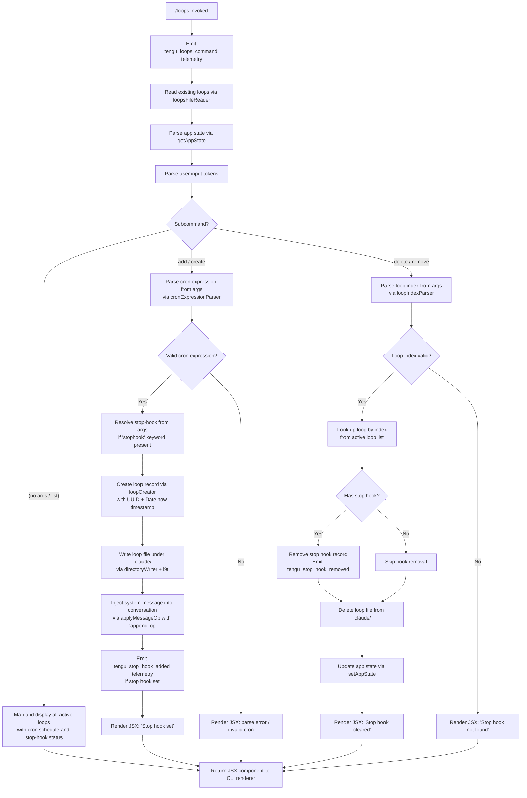

# `/loops`

> Analysis basis: CC v2.1.196 bundle.js (AST extraction + Claude interpretation)
> Minimum version: v2.1.196

---

## Overview

The `/loops` command is the primary management interface for Claude Code's scheduled automation loops (cron-based tasks). It allows users to list active loops, create new loops with configurable cron schedules and stop hooks, and delete existing loops — all from within the CLI session. The command is rendered as a local JSX component and is invoked immediately upon entry, delegating its core operations through an async handler (`k7f`) that interacts with application state, the file system, and the background daemon scheduler.

---

## Registration

| Field | Value |
|---|---|
| type | `local-jsx` |
| name | `loops` |
| description | `List, create, and delete loops` |
| loc_byte | `12909738` |
| loc_byte_end | `12909895` |
| loc_line | `8904` |
| immediate | `true` |
| module_id | `SQl` |
| load_inline | `true` |
| arbor_handler.name | `k7f` |
| arbor_handler.fqn | `claude-2.1.196::k7f` |
| arbor_handler.kind | `AsyncFunction` |
| arbor_handler.resolution_path | `module_id` |
| arbor_handler.n_hits | `0` |

Analysis basis: CC v2.1.196 bundle.js:+12909738

---

## Input Branching

The `/loops` command has multiple distinct branches depending on the subcommand and arguments parsed from user input. The flowchart below captures all major paths through the handler.



---

## Behavioral Spec

### 1. Entry Point and Telemetry Emission

The async handler (`k7f`) is the command's main entry point, resolved via `module_id` → `SQl`. Upon invocation the handler immediately emits the `tengu_loops_command` telemetry event before any user-facing logic executes.

```
async function loopsCommandHandler(context):
    emit telemetry("tengu_loops_command")
    trackEvent = readEventTracker(context)          // V at loc 12908703
    loopsData  = await loadLoopsModule(context)     // mde at loc 12908743
    appState   = context.getAppState()              // t.getAppState at loc 12908755
    uiRenderer = getReactRenderer()                 // Rt at loc 12908771
    ...
```

Analysis basis: CC v2.1.196 bundle.js:+12908703, +12908705, +12908743, +12908755

---

### 2. Loop File Reading (`loopsFileReader`)

Loop persistence is handled by reading a UTF-8 encoded file from the `.claude` directory. The reader calls `path.join` to construct the file path, reads with encoding `"utf-8"`, and handles POSIX filesystem errors including `ENOENT`, `EACCES`, `EPERM`, `ENOTDIR`, `ELOOP`, `ENAMETOOLONG`, and `EROFS`.

```
async function loopsFileReader(basePath):
    fullPath = pathJoin(basePath, ".claude", ...)   // FEe → MUn.join at loc 5103977
    try:
        raw = await fs.readFile(fullPath, "utf-8")  // t.readFile at loc 5104046
        return JSON.parse(raw)
    catch err:
        if err.code in ["ENOENT", "EACCES", "EPERM",
                        "ENOTDIR", "ELOOP", "ENAMETOOLONG", "EROFS"]:
            return []
        logError(err)                               // Re → Ete.logError at loc 1059478
        return []
```

Analysis basis: CC v2.1.196 bundle.js:+5104046, +5104057, +185042–185131

---

### 3. Cron Expression Parsing (`cronExpressionParser`)

The parser (`LO`) processes the raw user input string to extract a valid cron schedule. It trims whitespace, applies regex matching, uses `parseInt` for numeric field extraction, and validates ranges. Known named schedules include `"Every minute"` and `"Every hour"`. Day-of-week fields are resolved against UTC date methods (`getUTCDay`, `setUTCDate`, `getUTCDate`, `setUTCHours`, `getDay`). Numeric range validation uses limits 60, 59, 23, and 31 for minutes, seconds, hours, and days respectively.

```
function cronExpressionParser(rawInput):
    trimmed = rawInput.trim()                        // LO → e.trim at loc 5101818
    if trimmed matches "every minute" pattern:
        return Schedule("Every minute", "* * * * *") // loc 5101938
    if trimmed matches "every hour" pattern:
        return Schedule("Every hour", "0 * * * *")   // loc 5102155
    fields = parseNumericFields(trimmed)             // parseInt at loc 5101994
    validate:
        minutes  in [0, 59]                          // loc 12908470
        hours    in [0, 23]                          // loc 12908541
        days     in [1, 31]                          // loc 12908594
        (implicit seconds capped at 60)              // loc 12908436
    if invalid:
        return ParseError
    return Schedule(fields)
```

Analysis basis: CC v2.1.196 bundle.js:+5101818, +5101938, +5102155, +12908436, +12908470, +12908541, +12908594

---

### 4. Loop Record Creation (`loopCreator`)

When the parsed cron expression is valid, a new loop record is assembled with a random UUID and a `Date.now()` timestamp. The record is stamped with a `"cron"` type field. The record is then persisted to the `.claude` directory.

```
async function loopCreator(schedule, stopHookSpec, appState):
    id        = crypto.randomUUID()                 // wut → xaa.randomUUID at loc 5105374
    createdAt = Date.now()                          // wut → Date.now at loc 5105436
    record    = {
        id:        id,
        type:      "cron",                          // literal "cron" at loc 12908801
        schedule:  schedule,
        stopHook:  stopHookSpec or null,
        createdAt: createdAt
    }
    await writeLoopFiles(record, appState)          // i9t at loc 5105634
    await markScheduler(record)                     // Zte at loc 5105620
    return record
```

Analysis basis: CC v2.1.196 bundle.js:+5105374, +5105436, +12908801, +5105620, +5105634

---

### 5. Directory Writer (`directoryWriter`)

Loop state files are written into the `.claude` subdirectory of the project root. The writer creates the directory if absent (`mkdir`) and serialises loop records via `JSON.stringify` before calling `fs.writeFile`.

```
async function directoryWriter(records, basePath):
    dir = pathJoin(basePath, ".claude")             // i9t → MUn.join at loc 5105204
                                                    // literal ".claude" at loc 5105215
    await fs.mkdir(dir, { recursive: true })        // i9t → kUn.mkdir at loc 5105194
    mapped = records.map(r => serialise(r))         // i9t → e.map at loc 5105255
    await fs.writeFile(targetPath, JSON.stringify(mapped)) // i9t → kUn.writeFile at loc 5105291
```

Analysis basis: CC v2.1.196 bundle.js:+5105194, +5105204, +5105215, +5105291

---

### 6. Stop Hook Management

Stop hooks are associated with loops at creation time via the `"stophook"` keyword in the user's input (literal `"stophook"` at loc 12908887). Creating a loop with a stop hook emits `tengu_stop_hook_added`; deleting a loop that has a stop hook emits `tengu_stop_hook_removed`.

**Add path** (via `_St` / `HSt`):
```
function addStopHook(context, loopRecord):
    hookId = crypto.randomUUID()                    // XRl → zRl.randomUUID at loc 11004979
    context.applyMessageOp("append", {              // _St → e.applyMessageOp at loc 11004828
        type:       "attachment",                   // literal at loc 11004961
        role:       "system",                       // literal at loc 12909036
        goal:       "goal",                         // literal at loc 11004919
        goal_status:"goal_status"                   // literal at loc 11005048
    })
    context.setAppState(updatedState)               // _St → e.setAppState at loc 11004759
    emit telemetry("tengu_stop_hook_added")          // loc 11004513
    renderMessage("Stop hook set")                  // literal at loc 12909465
```

**Remove path** (via `_St`):
```
function removeStopHook(context, loopIndex):
    if not found:
        renderMessage("Stop hook not found")        // literal at loc 12909147
        return
    context.applyMessageOp(...)
    context.setAppState(updatedState)
    emit telemetry("tengu_stop_hook_removed")        // loc 11004885
    renderMessage("Stop hook cleared")              // literal at loc 12909169
```

Analysis basis: CC v2.1.196 bundle.js:+12908887, +11004828, +11004513, +11004885, +12909147, +12909169, +12909465

---

### 7. Loop Listing Display (`loopListRenderer`)

Active loops are mapped over (`n.map` at loc 12908783, `r.map` at loc 12908867) and rendered as a JSX component via `AQl.jsx` (loc 12909508). Column padding is applied via `padEnd` (loc 18022033) with two-space separators (literal `"  "` at loc 18022054). Display columns include the loop index, cron expression, and stop-hook indicator.

```
function renderLoopList(loops):
    rows = loops.map((loop, idx) =>
        formatRow(idx + 1, loop.schedule, loop.stopHook != null)
    )
    return JSX(rows, paddingChar="  ")
```

Analysis basis: CC v2.1.196 bundle.js:+12908783, +12908867, +12909508, +18022033, +18022054

---

### 8. Loop Index Parsing (`loopIndexParser`, `R7f`)

When the delete subcommand is used, the user-supplied token is parsed as a 1-based integer index into the active loop list. The parser applies `Math.max`, `Math.ceil`, and `Math.round` to normalise the value, and delegates to `dU` (tokeniser) for raw parsing. Valid range is described as `"1-5"` in the literals (loc 5102862).

```
function loopIndexParser(rawArg, loopCount):
    raw   = tokenise(rawArg)                        // dU at loc 12908661
    index = parseInt(raw, 10)                       // R7f → parseInt at loc 12908328
    index = Math.max(1, Math.ceil(Math.round(index))) // loc 12908413, 12908424, 12908497
    if index < 1 or index > loopCount:
        return InvalidIndex
    return index - 1   // convert to 0-based
```

Analysis basis: CC v2.1.196 bundle.js:+12908291, +12908328, +12908413, +12908424, +12908497, +5102862

---

### 9. Background Scheduler Integration

Loop scheduling is backed by the daemon's interval-based sweep system. `setInterval` (loc 16999439) and `clearInterval` (loc 16999273) manage the polling loop. File-system watchers (`O.watch` at loc 16999630) detect external changes to loop files. On each tick, the scheduler reads due loops and may write/delete state files (`Fie.writeFile` at loc 16995157, `Fie.unlink` at loc 16995462). Memory pressure triggers `tengu_bg_retire_pinned_low_mem` and related events; these are part of the broader background worker system that underpins loop execution.

```
function schedulerWatchLoop(loopFiles):
    watcher = fs.watch(loopFiles, onChange)         // O.watch at loc 16999630
    timer   = setInterval(sweepDueLoops, interval) // setInterval at loc 16999439
    watcher.on("add", handleAdd)                    // literals at loc 16999823
    watcher.on("change", handleChange)              // loc 16999850
    watcher.on("unlink", handleUnlink)              // loc 16999880
    return Disposable(watcher, timer)

async function sweepDueLoops():
    locks = acquireSchedulerLock()
    // "[ScheduledTasks] released scheduler lock"   // loc 16995712
    for loop in dueLoops:
        await dispatchLoop(loop)                    // hXo at loc 16999383
```

Analysis basis: CC v2.1.196 bundle.js:+16999273, +16999439, +16999630, +16995157, +16995462, +16995712

---

### 10. JSX Rendering and Skip Sentinel

The handler returns a JSX element via `AQl.jsx` (loc 12909508). Internal branching uses a `"skip"` sentinel literal (loc 12909604) to suppress rendering in cases where the command should produce no output. The `"Stop"` literal (loc 11003834) is used to label the stop-hook action in UI elements. The `"prompt"` literal (loc 11003941) identifies prompt-type entries injected into the conversation context.

Analysis basis: CC v2.1.196 bundle.js:+12909508, +12909604, +11003834, +11003941

---

## State & Side Effects

| Item | Detail |
|---|---|
| Telemetry — primary | `tengu_loops_command` (emitted on every `/loops` invocation, loc 12908705) |
| Telemetry — stop hook add | `tengu_stop_hook_added` (loc 11004513) |
| Telemetry — stop hook remove | `tengu_stop_hook_removed` (loc 11004885) |
| Telemetry — daemon yield | `tengu_daemon_yield` (loc 18015313, background scheduler) |
| Telemetry — low memory | `tengu_bg_retire_pinned_low_mem` (loc 17998722) |
| Telemetry — prewarm | `tengu_bg_prewarm_per_sweep` (loc 17998847) |
| Telemetry — SIGKILL escalate | `tengu_bg_dispatch_sigkill_escalate` (loc 17993512) |
| Telemetry — bg low mem | `tengu_bg_dispatch_low_mem` (loc 17994102) |
| Telemetry — spare enable | `tengu_bg_spare_enable` (loc 17994792) |
| Telemetry — spare claim | `tengu_bg_spare_claim` (loc 17994920) |
| Telemetry — spare claim fail | `tengu_bg_spare_claim_fail` (loc 17995186) |
| Telemetry — feature ok/bad/sad | `tengu_feature_ok`, `tengu_feature_bad`, `tengu_feature_sad` (loc 1028610, 1028677, 1028758) |
| Telemetry — daemon control | `tengu_daemon_control` (loc 18033163) |
| File system writes | Loop state files written to `.claude/` directory via `fs.writeFile` |
| File system deletes | Loop state files removed via `fs.unlink` on delete |
| File system reads | Loop state files read as UTF-8 on every invocation |
| appState changes | `setAppState` and `applyMessageOp` called on create/delete with `"append"` operation |
| Conversation injection | System-role attachment message injected when stop hook is set/cleared (role: `"system"`) |
| Background daemon | Scheduler watcher started via `setInterval` + `fs.watch`; SIGKILL escalation possible |
| UUID generation | `crypto.randomUUID()` called on loop creation and stop hook creation |
| Sound | <!-- TODO: not found in depth-2 traversal; needs --depth 4 --> |

---

## Version History

| Version | Change |
|---|---|
| v2.1.196 | Initial analysis |

---

## Common Mistakes

1. **Omitting the cron expression**: Invoking `/loops add` without a valid cron string causes the parser (`R7f` / `LO`) to return a parse error and render no loop record. Always supply a schedule (e.g. `* * * * *` or `"Every hour"`).
2. **Using a 0-based index for deletion**: The loop index displayed in `/loops` list is 1-based (valid range `"1-5"` per bundle literal). Supplying `0` will be rejected as out-of-range by `loopIndexParser`.
3. **Expecting instant file cleanup on delete**: The `.claude/` directory file is removed asynchronously. A rapid re-invocation of `/loops` immediately after delete may still observe the old record if the file write has not completed.
4. **Confusing stop hooks with the loop schedule**: The `stophook` keyword in the creation command attaches a stop-hook record to the loop — it does not affect the cron schedule itself. Missing the keyword means no stop hook is registered, and no `tengu_stop_hook_added` event will be emitted.
5. **Assuming loop state survives daemon restarts without file persistence**: Loop records only survive restarts if the `.claude/` directory files are intact. Manually deleting those files outside the CLI will cause loops to silently disappear on next invocation.

---

## Appendix — Identifier Mapping

> For bundle debugging only. Identifiers change across versions.

| Identifier | Role |
|---|---|
| `k7f` | Main async handler for the `/loops` command (Arbor-resolved, `AsyncFunction`) |
| `V` | Event/telemetry tracker utility |
| `mde` | Loops module loader / initialiser |
| `vut` | Loop file reader (reads UTF-8 loop state from disk) |
| `qt` | Path resolution helper |
| `FEe` | File path builder (wraps `path.join`) |
| `bl` | Base path resolver |
| `zo` | Network/error routing utility |
| `rn` | Logging or routing helper |
| `Re` | Error handler / log error wrapper |
| `er` | Error constructor helper |
| `ct` | String coercion / truthy-check helper |
| `zi` | Traffic filter (`"essential-traffic"` gating) |
| `_Nu` | Queue shift/push manager (FIFO buffer) |
| `T` | Content formatter / message builder |
| `eeu` | Message enrichment helper |
| `Me` | JSON serialisation wrapper |
| `Pc` | Path sanitiser / redaction helper (`[REDACTED]` literal) |
| `KQe` | Path glob/matching helper |
| `oeu` | File content reader with byte-length checks |
| `dU` | Input tokeniser / whitespace trimmer |
| `kcp` | Token set parser (split, match, parseInt, Set operations) |
| `xC` | Cleanup / reset helper |
| `g0` | Global state accessor |
| `hSt` | Loop list formatter / column builder |
| `FOe` | Column width setter (`padEnd` layout) |
| `gfl` | Array mapper for display rows |
| `Rt` | React/JSX rendering primitive |
| `LO` | Cron expression parser |
| `L8` | Path normaliser (Windows-aware, `oN.normalize`) |
| `XHr` | String prefix handler (`startsWith` / `slice` / `replace`) |
| `k` | Background scheduler main loop (setInterval + fs.watch) |
| `hXo` | Loop dispatch executor (writes/unlinks loop state files, runs scheduled task) |
| `mrn` | Loop retirement handler (unlink + log) |
| `D` | Output writer (`d.write`) |
| `O` | File system watcher callback (memory/clock management) |
| `I` | Keyboard/input event handler |
| `h` | Background worker lifecycle manager (spawn/kill/retire) |
| `p` | Process exit / abort controller |
| `nI` | Forced-shutdown signal emitter |
| `u` | Abort/stop orchestrator |
| `xe` | Feature flag OK reporter (`tengu_feature_ok`) |
| `ke` | Feature flag BAD reporter (`tengu_feature_bad`) |
| `$F` | Daemon registration helper |
| `Wj` | Promise race/all shutdown coordinator |
| `l` | Loop entry accessor / event log reader |
| `eoc` | Daemon status file reader (`daemon.status.json`) |
| `Zte` | Scheduler timestamp helper |
| `Ks` | AsyncLocalStorage store getter |
| `HZt` | Daemon status path builder |
| `g` | UTC date calculator |
| `fde` | Loop filter / set membership checker |
| `l7` | Set membership test helper |
| `i9t` | Directory + file writer for loop state (mkdir + writeFile under `.claude/`) |
| `_St` | Stop-hook adder (applyMessageOp + setAppState + UUID) |
| `XRl` | UUID generator wrapper (`crypto.randomUUID`) |
| `qe` | JSX child renderer |
| `$Xe` | React element factory |
| `R7f` | Loop index parser (Math.max/ceil/round + parseInt) |
| `wut` | Loop record creator (UUID + Date.now + write) |
| `she` | Loop record schema builder |
| `a` | HTTP response helper (Response.json) |
| `kge` | JSON serialisation wrapper (alternative path) |
| `HSt` | Stop-hook deletion handler (setAppState + applyMessageOp + telemetry) |
| `a1o` | Hook gate / policy settings resolver |
| `Q3` | Policy function dispatcher |
| `fn` | Policy node factory |
| `Jce` | Hook configuration parser |
| `vr` | Trust gate checker |
| `cd` | Hook trust/path validator |
| `Tdm` | Path traversal guard (`".."` check, `ey.resolve`) |
| `wt` | Feature sad reporter (`tengu_feature_sad`) |
| `Oe` | React effect / side-effect runner |
| `Jy` | Output token counter (`outputTokens`, `Object.values`) |

---

Note: index built via Arbor fallback; some signals (telemetry, literals) may be missing — see arbor-fallback.js.