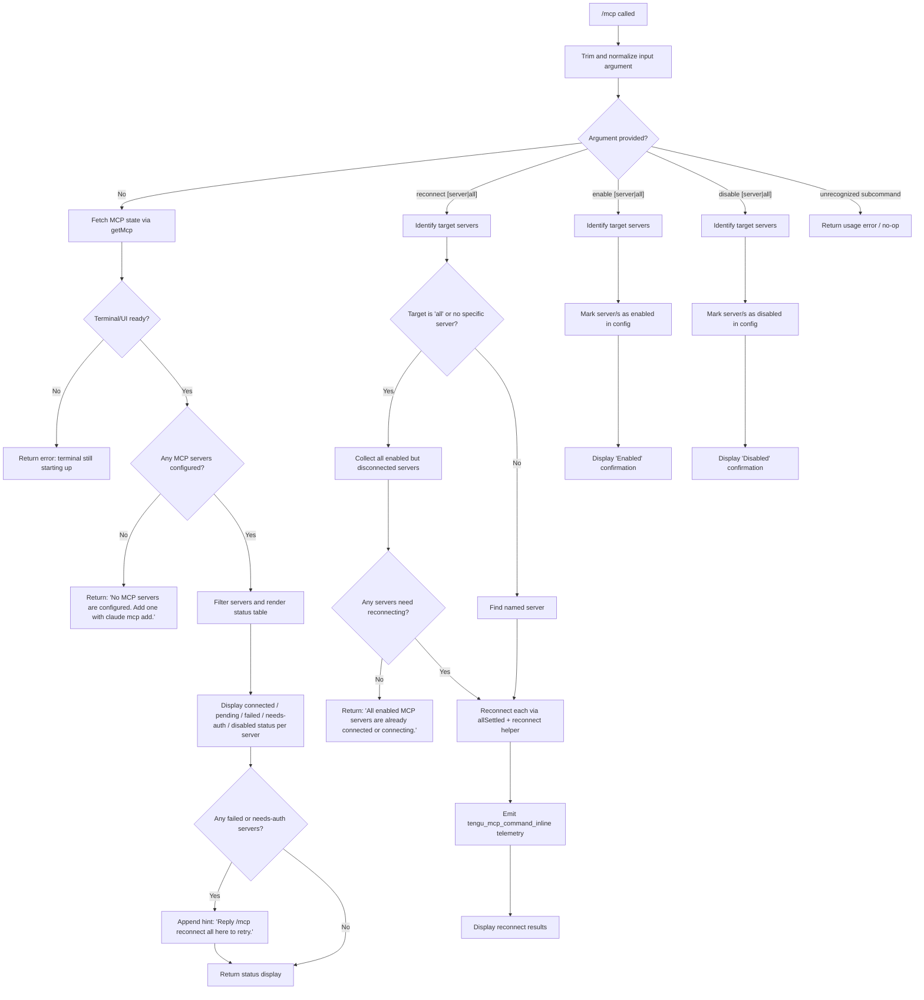

# `/mcp`

> Analysis basis: CC v2.1.195 bundle.js (AST extraction + Claude interpretation)
> Minimum version: v2.1.195

---

## Overview

The `/mcp` command is the primary interface for managing Model Context Protocol (MCP) servers within Claude Code. It allows users to inspect server connection status, reconnect servers, and enable or disable individual servers or all servers at once. The command dispatches across multiple sub-actions (`reconnect`, `enable`, `disable`) and renders live status information for all configured MCP servers.

---

## Registration

| Field | Value |
|---|---|
| type | `local` |
| name | `mcp` |
| description | `Manage MCP servers` |
| argumentHint | `[reconnect\|enable\|disable [<server>\|all]]` |
| supportsNonInteractive | `true` |
| module_id | `cBl` |
| load_inline | `true` |
| loc_byte | `12257614` |
| loc_byte_end | `12257806` |
| loc_line | `8246` |
| arbor_handler.name | `zNf` |
| arbor_handler.fqn | `claude-2.1.195::zNf` |
| arbor_handler.kind | `AsyncFunction` |
| arbor_handler.resolution_path | `module_id` |
| arbor_handler.n_hits | `0` |

Analysis basis: CC v2.1.195 bundle.js:+12257614

---

## Input Branching

The handler parses arguments and branches across 5+ distinct paths (no-arg status display, reconnect all, reconnect specific server, enable/disable server, guard conditions). A Mermaid flowchart is used.



Analysis basis: CC v2.1.195 bundle.js:+11990891, +11991593, +11991610, +11991627, +11991641

---

## Behavioral Spec

### 1. Argument Parsing

The handler begins by trimming the raw input string and calling `toLowerCase()` on it to normalize the subcommand.

```
function parseArguments(rawInput):
    trimmed = rawInput.trim()                       // +11990891
    normalized = trimmed.toLowerCase()              // +11990951
    parts = normalized.split(" ")
    subcommand = parts[0]   // "reconnect", "enable", "disable", or empty
    target = parts[1]       // server name or "all", may be undefined
    return (subcommand, target)
```

The recognized subcommands are `reconnect`, `enable`, and `disable` (bundle.js:+11991610, +11991627, +11991641). The special target value `all` is also recognized (bundle.js:+11991597). Argument count check uses a numeric threshold of `2` (bundle.js:+11991593).

Analysis basis: CC v2.1.195 bundle.js:+11990891

---

### 2. Status Display (No-Argument Path)

When no subcommand is given, the handler fetches the current MCP state and renders a server list.

```
async function displayMcpStatus(mcpState, uiContext):
    servers = getMcpServers(mcpState)              // +11990902

    if not uiReady(uiContext):                     // +11992062
        return errorMessage("MCP controls aren't available right now...")

    if servers is empty:                           // +11991863
        return message("No MCP servers are configured. Add one with `claude mcp add`.")

    filteredServers = servers.filter(isRelevant)   // +11991801

    for each server in filteredServers:
        status = server.status  // one of: "connected", "pending", "failed",
                                //         "needs-auth", "disabled"  (+11991116–+11991236)
        renderStatusRow(server.name, status)

    if any server has status "failed" or "needs-auth":
        append(" Reply `/mcp reconnect all` here to retry.")   // +11991392

    return renderedOutput
```

Server status values observed in literals: `connected` (+11991116), `pending` (+11991150), `failed` (+11991182), `needs-auth` (+11991201), `disabled` (+11991236). A separate `needs-approval` status is also recognized (bundle.js:+11990300).

Analysis basis: CC v2.1.195 bundle.js:+11990902

---

### 3. Reconnect Sub-Command

```
async function handleReconnect(subcommand, target, servers):
    if target == "all" or target is undefined:
        candidates = servers.filter(s => s.status != "connected" and s.enabled)
    else:
        candidates = [findServerByName(servers, target)]

    if candidates is empty:
        return message("All enabled MCP servers are already connected or connecting.")  // +11992804

    results = await Promise.allSettled(            // +11992880
        candidates.map(server => reconnectServer(server))  // +11992899
    )

    for each result in results:
        if result.status == "fulfilled":           // +11992945
            markSuccess(result.value)
        else:
            markFailure(result.reason)

    emitTelemetry("tengu_mcp_command_inline")      // +11991740
    return renderReconnectSummary(results)
```

The reconnect helper closes existing transport connections, then reopens them. Connection close involves calling `close()` on both the primary and secondary transport objects (bundle.js:+17898885, +17898895). A process-exit call with exit code `1` is reachable in error paths within the shutdown helper (bundle.js:+13393574, +13393587).

Analysis basis: CC v2.1.195 bundle.js:+11992880

---

### 4. Enable / Disable Sub-Commands

```
async function handleEnableDisable(action, target, servers, config):
    if target == "all":
        affectedServers = servers
    else:
        affectedServers = [findServerByName(servers, target)]

    for each server in affectedServers:
        if action == "enable":
            config.setEnabled(server.name, true)
        else:  // "disable"
            config.setEnabled(server.name, false)

    label = (action == "enable") ? "Enabled" : "Disabled"  // +11994252, +11994262
    return message(label + ". Run `/mcp` in the terminal to see status.")  // +11995087
```

The output message type is `"text"` (bundle.js:+11995161).

Analysis basis: CC v2.1.195 bundle.js:+11994252

---

### 5. IDE Context Guard

The handler checks a literal `"ide"` context string (bundle.js:+11990942). When the command is invoked in an IDE environment, the `S5.includes` check (bundle.js:+11991497) controls availability or rendering of certain UI-dependent controls.

```
function ideContextGuard(contextList):
    if contextList.includes("ide"):               // +11990942
        // IDE-specific rendering path
        return ideMcpDisplay()
    else:
        return standardTerminalDisplay()
```

Analysis basis: CC v2.1.195 bundle.js:+11990942

---

### 6. Reconnect Server Internals

The reconnect flow uses `Promise.allSettled` over a mapped array of server reconnect operations. Each operation involves:

```
async function reconnectServer(server):
    closeExistingTransport(server, index=0)        // +17898883, +17898885
    closeSecondaryTransport(server)                // +17898895
    registerNewTransport(server)                   // via addToSet +17892037
    result = await awaitConnection(server)
    return result

function gracefulShutdown(context):
    writeData("data")                              // +17797319
    limitedBuffer(maxBytes=1024)                   // +17797372
    if errorOccurred:
        emitCliError("cli_error")                  // +13393561
        exitProcess(code=1)                        // +13393587
```

Analysis basis: CC v2.1.195 bundle.js:+17898885

---

### 7. Connection Abort / Daemon Stop

When an abort is triggered on a server connection:

```
async function abortConnection(controller):
    Le(controller)   // emits tengu_feature_ok on success   // +1027361, +1027363
    ke(controller)   // emits tengu_feature_bad on failure  // +1027428, +1027430
    SF(controller)   // daemon control: records daemon_stop or daemon_stop_failed
                     //                 emits tengu_daemon_control  // +17924591

async function stopDaemon(controller):
    // Attempts graceful shutdown with timeout
    racedResult = await Promise.race([            // +17919609
        Promise.all([shutdownRequest(), timeoutGuard()]),  // +17919623, +17919636
        timeoutFallback(500)                      // +17919650, +17919653
    ])
    if racedResult is timeout:
        exitProcess()                             // +17919692
    recordEvent("daemon_stop")                    // +17924519
    // on failure: recordEvent("daemon_stop_failed")  // +17924556
```

The timeout sentinel value is **500 ms** (bundle.js:+17919653).

Analysis basis: CC v2.1.195 bundle.js:+17924519

---

### 8. Daemon Status File

A background status helper writes server health to a JSON file named `daemon.status.json` (bundle.js:+13071674), serialized via `JSON.stringify` (bundle.js:+193083), timestamped with `Date.now()` (bundle.js:+13071787), and supplemented with a path join (`wZl.join`) for the file location (bundle.js:+13071660).

```
function writeDaemonStatus(servers):
    statusPath = joinPath(daemonDir, "daemon.status.json")  // +13071674
    timestamp = Date.now()                                   // +13071787
    payload = serialize(servers, timestamp)                  // JSON.stringify +193083
    writeFile(statusPath, payload)
```

Analysis basis: CC v2.1.195 bundle.js:+13071674

---

### 9. User Info Validation (OAuth Path)

During MCP server reconnect in OAuth/authenticated server flows, user info is validated:

```
function validateUserInfo(userInfo, idToken):
    values = Object.values(userInfo)               // +17887070
    if userInfo.sub != idToken.sub:
        throw Error("userinfo sub missing or does not match id_token sub")  // +17728218
    sendSIGTERM()                                  // +17887036 on kill
```

Column padding of **40 characters** is applied during server name display (bundle.js:+17915470), with a two-space separator (bundle.js:+17913496).

Analysis basis: CC v2.1.195 bundle.js:+17728218

---

## State & Side Effects

| Item | Detail |
|---|---|
| Telemetry: `tengu_mcp_command_inline` | Fired when a reconnect sub-command is executed (bundle.js:+11991740) |
| Telemetry: `tengu_feature_ok` | Fired on successful abort/stop acknowledgement (bundle.js:+1027363) |
| Telemetry: `tengu_feature_bad` | Fired on failed abort/stop attempt (bundle.js:+1027430) |
| Telemetry: `tengu_daemon_control` | Fired during daemon start/stop control operations (bundle.js:+17924594) |
| Daemon status file | Writes `daemon.status.json` to daemon directory on status changes (bundle.js:+13071674) |
| MCP config mutation | `enable` / `disable` sub-commands mutate the persisted MCP server configuration |
| Transport lifecycle | Reconnect closes existing transport connections (indices 0 and 1) and opens new ones |
| Process exit | Exit code `1` reachable in shutdown error paths (bundle.js:+13393574); exit code `1` also reachable in forced daemon stop (bundle.js:+17920935) |
| AbortController | Connection aborts tracked via `AbortController`; timeout sentinel 500 ms |
| Daemon stop events | Records `daemon_stop` or `daemon_stop_failed` literal events (bundle.js:+17924519, +17924556) |
| Session label | Background sessions labeled `"background session"` (bundle.js:+17924471) |
| UUID generation | New transport sessions assigned random UUID via `FKr.randomUUID` (bundle.js:+3348552) |

---

## Version History

| Version | Change |
|---|---|
| v2.1.195 | Initial analysis |

---

## Common Mistakes

1. **Omitting the target argument for enable/disable**: Running `/mcp enable` without a server name or `all` may produce unexpected behavior — the argument hint `[reconnect|enable|disable [<server>|all]]` requires a target for mutating sub-commands.
2. **Expecting instant reconnect**: Reconnect is asynchronous (`Promise.allSettled`); results are displayed only after all connections settle or time out. Do not assume immediate availability.
3. **Using `/mcp` in a non-interactive context without checking `supportsNonInteractive`**: Although `supportsNonInteractive: true`, the UI-readiness guard may still return the "terminal still starting up" error if the terminal view is not yet initialized.
4. **Confusing `failed` and `needs-auth` statuses**: `failed` indicates a general connection failure; `needs-auth` indicates OAuth authentication is pending. The remediation steps differ — the latter requires `/mcp` in the terminal to authenticate, not just reconnect.
5. **Expecting `disable` to remove a server**: The `disable` sub-command marks a server inactive in config; it does not remove it. Use `claude mcp remove` for removal.
6. **Ignoring the IDE context path**: When running inside an IDE integration, the MCP status display follows a separate rendering path controlled by the `"ide"` context literal; output format may differ from the standard terminal view.

---

## Appendix — Identifier Mapping

> For bundle debugging only. Identifiers change across versions.

| Identifier | Role |
|---|---|
| `zNf` | Main async handler for `/mcp` command (arbor_handler) |
| `Cs` | Graceful shutdown / error exit helper |
| `D7e` | Error reporting sub-function called within shutdown |
| `aI` | Secondary action within shutdown (likely logger/emitter) |
| `Xk` | IDE context branch helper |
| `Nn` | Status rendering / formatting helper |
| `Oe` | Output emitter / telemetry dispatch wrapper |
| `OJe` | Low-level output primitive called by `Oe` |
| `W` | Output write primitive used by `Le` and `ke` |
| `Vnr` | Server list / filter helper |
| `sBl` | UI readiness guard |
| `I$o` | Server state query / approval-status resolver |
| `Rze` | MCP server status display renderer |
| `LZl` | Daemon status file writer |
| `Hte` | File path / config helper used by `LZl` |
| `THe` | String trim / normalize helper used by `Hte` |
| `Dae` | Sub-helper called by `THe` |
| `Vs` | Context store accessor (`Nld.getStore`) |
| `WXt` | Path join wrapper for daemon status file |
| `Me` | JSON serialization wrapper |
| `nhr` | Reconnect operation dispatcher per server |
| `thr` | Transport URL/string normalizer (startsWith, slice, replace) |
| `H` | User info / OAuth token validation helper |
| `o` | Server name column formatter (padEnd, map) |
| `O` | Process signal sender (SIGTERM kill) |
| `c` | Result aggregation / summary renderer |
| `yn` | Sub-helper for result rendering |
| `p` | Forced shutdown / abort-per-server mapper |
| `YT` | Forced shutdown label emitter |
| `u` | Abort controller manager |
| `Le` | Success-path abort handler (emits `tengu_feature_ok`) |
| `ke` | Failure-path abort handler (emits `tengu_feature_bad`) |
| `SF` | Daemon control dispatcher (emits `tengu_daemon_control`) |
| `p6` | Daemon control sub-step |
| `D3` | Low-level daemon primitive |
| `y4e` | Daemon event recorder |
| `YL` | Sub-helper for daemon event recording |
| `GKr` | Session UUID and event emitter for daemon |
| `Hxn` | Session init sub-helper |
| `zot` | Session registry sub-helper |
| `a6` | Session attribute setter |
| `yj` | Graceful stop with Promise.race / timeout |
| `T_e` | Shutdown request sender (`b_e.shutdown`) |
| `k_e` | Timeout clearance helper (`clearTimeout`, `Wjo`) |
| `Un` | Timeout/abort promise factory |
| `A` | Per-server reconnect operation builder |
| `l` | Filtered server list variable |
| `Wjo` | Timeout internal reference used by `k_e` |