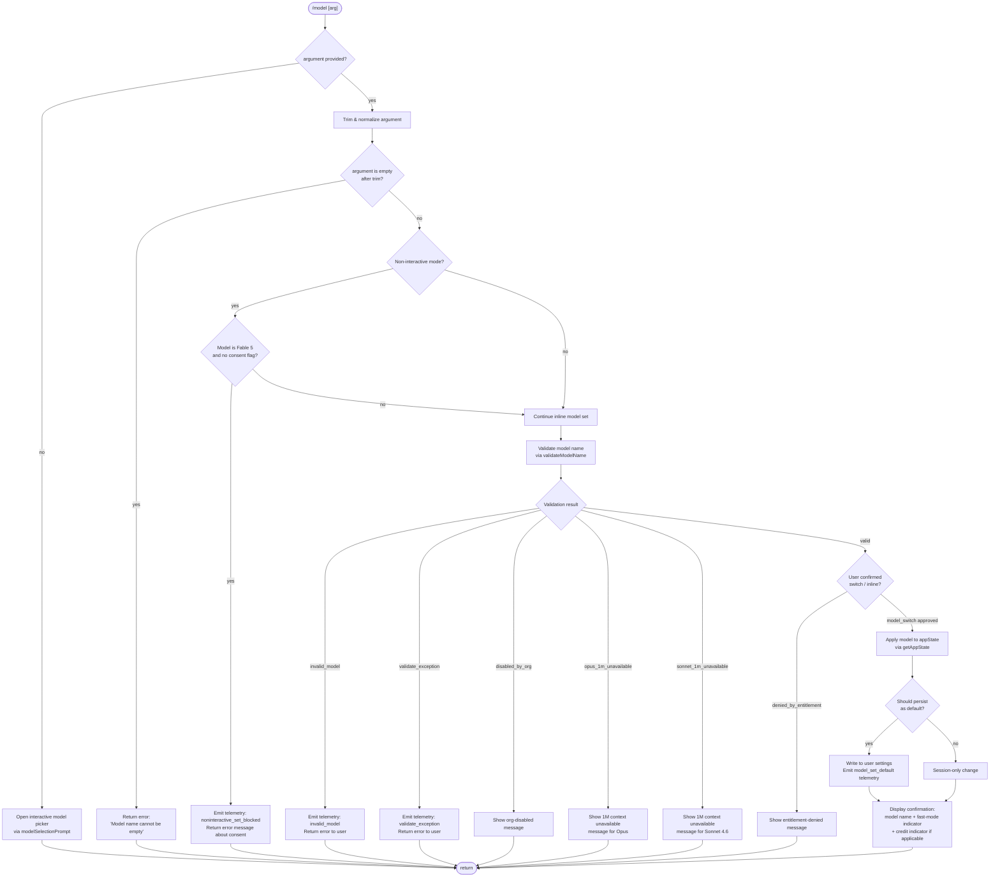

# `/model`

> Analysis basis: CC v2.1.196 bundle.js (AST extraction + Claude interpretation)
> Minimum version: v2.1.196

---

## Overview

The `/model` command allows the user to change the AI model Claude Code uses for the current session or as a persistent default. When invoked with a model name argument it validates the argument against a known model list, checks entitlements, and — if all checks pass — writes the selection to application state and optionally persists it as the user's global default. When invoked without an argument it presents an interactive picker of available models.

---

## Registration

| Field | Value |
|---|---|
| type | `local` |
| name | `model` |
| description | Set the AI model for Claude Code |
| argumentHint | `<model>` |
| supportsNonInteractive | `true` |
| module_id | `hnc` |
| load_inline | `true` |
| loc_byte | 13113656 |
| loc_byte_end | 13113830 |
| loc_line | 9040 |
| arbor_handler.name | `wXf` |
| arbor_handler.fqn | `claude-2.1.196::wXf` |
| arbor_handler.kind | `AsyncFunction` |
| arbor_handler.resolution_path | `module_id` |
| arbor_handler.n_hits | 0 |

Analysis basis: CC v2.1.196 bundle.js:+13113656

---

## Input Branching

Five or more distinct execution paths exist, so a Mermaid flowchart is used.



Analysis basis: CC v2.1.196 bundle.js:+13079225 – +13079755

---

## Behavioral Spec

### Handler Entry Point — `modelCommandHandler` (`wXf`)

```
async function modelCommandHandler(argument, context):
    trimmedArg = argument.trim()                         // +13079225
    if trimmedArg is empty or includes nothing useful:
        return openInteractivePicker(context)

    appState = context.getAppState()                     // +13079264

    // Fable-5 consent gate in non-interactive mode
    if isFable5Model(trimmedArg) and not hasFable5Consent(appState):
        if context.isNonInteractive:
            emitTelemetry("noninteractive_set_blocked")  // +13079555
            return errorMessage(FABLE_NONINTERACTIVE_MSG) // +13079604
        // interactive sessions proceed to normal flow

    // Check known-model list
    if not knownModelList.includes(trimmedArg):          // +13079241
        pass  // falls through to validate step below

    // Inline fast-path for simple alias
    if isSimpleAlias(trimmedArg):                        // +13079328
        emitTelemetry("tengu_model_command_inline")      // +13079375
        applyModelAlias(trimmedArg, appState)
        return buildConfirmation(trimmedArg, appState)

    // Full model-switch path
    switchResult = await modelSwitchPipeline(            // +13079415, +13079456
        trimmedArg, context, appState
    )
    return buildConfirmation(switchResult, appState)     // +13079511, +13079530, +13079755
```

Analysis basis: CC v2.1.196 bundle.js:+13079225

---

### Model Name Validation — `validateModelName` (`nKt`)

```
async function validateModelName(rawName, context):
    name = rawName.trim()                                // +9251572
    if name is empty:
        return { error: "Model name cannot be empty" }  // +9251609

    // Call model-list resolver
    modelList = await resolveModelList(context)          // +9251643

    // Normalise for comparison
    nameLower = name.toLowerCase()                       // +9251757

    // Check deprecated / disallowed tier list
    if deprecatedTierSet.includes(nameLower):            // +9251776
        return { error: "not_allowed" }

    // Check already-seen model cache
    if knownModelCache.has(nameLower):                   // +9251878
        // proceed to live API probe

    // Live probe via sideQuery API call                 // +9251923
    probeResult = await sideQueryModelProbe(name, context)

    if probeResult.authError:
        return { error: "Authentication failed. Please check your API credentials." }
                                                         // +9252345
    if probeResult.networkError:
        return { error: "Network error. Please check your internet connection." }
                                                         // +9252447
    if probeResult.type == "not_found_error":            // +9252566
        return { error: "invalid_model", detail: "model:" + name } // +9252648

    // Cache successful validation
    knownModelCache.set(nameLower, probeResult)          // +9252086

    // Build display label                               // +9252127 – +9253404
    label = buildModelLabel(name)
    return { ok: true, label }
```

Analysis basis: CC v2.1.196 bundle.js:+9251572

---

### Model-Switch Pipeline — `modelSwitchPipeline` (`qJt`)

The pipeline is an async composition of sub-checks executed in order. Each sub-check may short-circuit with an error or a UI prompt before the final state mutation.

```
async function modelSwitchPipeline(modelName, context, appState):

    // 1. Resolve canonical model identifier
    canonical = resolveModelAlias(modelName)             // +11587774, +11587780, +11587793

    // 2. Entitlement check — Opus 1M context
    if isOpus1M(modelName):                              // +11588107
        entResult = checkOpus1MEntitlement(context)      // +11588139
        if entResult.denied:
            return {
                error: "opus_1m_unavailable",
                message: "Opus with 1M context is not available..." // +11588177
            }

    // 3. Entitlement check — Sonnet 4.6 1M context
    if isSonnet1M(modelName):                            // +11588324
        entResult = checkSonnet1MEntitlement(context)    // +11588356
        if entResult.denied:
            return {
                error: "sonnet_1m_unavailable",
                message: "Sonnet 4.6 with 1M context is not available..." // +11588396
            }

    // 4. Org-level disable check                        // +11588555 – +11588624
    if isDisabledByOrg(canonical, context):
        return { error: "disabled_by_org" }

    // 5. Full model-availability check                  // +11588785
    availabilityStatus = checkModelAvailability(canonical, appState)
    if availabilityStatus != "ok":
        return { error: availabilityStatus }

    // 6. Policy / tier-mapping step                     // +11588789 – +11588796
    tierMapped = applyTierPolicy(canonical)

    // 7. Bootstrap model-discovery (gateway side-query) // +11589050
    discoveryResult = await bootstrapModelDiscovery(canonical, context)

    // 8. Apply selection to appState                    // +11589050 – +11589333
    appState.model = tierMapped

    // 9. Persist if interactive and user did not opt out
    if context.isInteractive:
        shouldPersist = await askPersistDefault(context) // +11589457
        if shouldPersist:
            writeUserSetting("model", tierMapped)        // +11589882  tengu: model_set_default
            suffix = " and saved as your default for new sessions" // +11589524
        else:
            suffix = " for this session only"            // +11589570

    return {
        displayName: canonical,
        suffix,
        fastModeOn: isFastMode(appState),                // +11589688 / +11589785
        drawsCredits: doesDrawCredits(appState),         // +11589739
    }
```

Analysis basis: CC v2.1.196 bundle.js:+11587774

---

### Known Model Alias Resolver — `resolveModelAliasDetails` (`jo`)

Translates short human-friendly tier names to canonical API model IDs.

```
function resolveModelAliasDetails(alias):
    alias = alias.trim().toLowerCase()

    switch alias:
        case "sonnet":  return latestSonnet()            // +2323935
        case "haiku":   return latestHaiku()             // +2323975
        case "opus":    return latestOpus()              // +2324014
        case "best":    return tierBest()                // +2324052
        case "fable":   return canonicalFable()          // +2323826
        case "opusplan": return opusPlanModel()          // +2322730 description: "Opus in plan mode, else Sonnet"
        case "[1m]":    return extend1MContext()         // +2323877

        // Pass-through: full model ID given by user
        default:        return sanitizeModelId(alias)

    // Model family constants available at this layer:
    // "claude-fable-5", "claude-mythos-5",
    // "claude-opus-4-{8,7,6,5,1,0}",
    // "claude-sonnet-4-{6,5,0}", "claude-haiku-4-5",
    // "claude-3-7-sonnet", "claude-3-5-{sonnet,haiku}",
    // "claude-3-{opus,sonnet,haiku}"                   // +2320858 – +2321859
```

Analysis basis: CC v2.1.196 bundle.js:+2323749

---

### Model Availability / Tier Status — `modelTierStatus` (`ZPt`)

Inspects the model's tier status and policy restrictions, producing one of several status strings.

```
function modelTierStatus(modelId, context):
    entries = Object.keys(tierMap)                       // +2313226

    for entry in entries:
        if entry starts with "claude-":                  // +2313681

            status = lookupTierStatus(modelId)

            if status == "refused":   return "refused"   // +2313039
            if status == "inactive":  return "inactive"  // +2313077
            if status == "active":    return "active"    // +2313119
            if status == "warn":      log warning        // +2313964

    // Tier-policy reconciliation comments in bundle:
    // "tier default is the admin-mapped value — pinning its canonical builtin..." // +2315922
    // "user steering detected — pinning the env-free tier builtin..."             // +2316044
    // "keeping the tier default"                                                  // +2316140

    return reconciled model ID
```

Analysis basis: CC v2.1.196 bundle.js:+2312957

---

### Model Confirmation Display Builder — `buildModelConfirmation` (`orr`)

Assembles the terminal output shown after a successful model switch.

```
function buildModelConfirmation(switchResult, appState):
    line = bold(switchResult.displayName)                // +11589505
    line += switchResult.suffix                          // " and saved as your default…" or " for this session only"

    if switchResult.fastModeOn:
        line += " · Fast mode ON"                        // +11589688
        line += " · Draws from usage credits"            // +11589739
    else:
        line += " · Fast mode OFF"                       // +11589785

    if switchResult.managedSettings:
        line += "\nManaged settings"                     // +11590700

    return renderLine(line)
```

Analysis basis: CC v2.1.196 bundle.js:+11589464

---

### Fable-5 Model Hash Computation — `computeModelHash` (`Md`)

Used to derive a short fingerprint for the model identifier (e.g., for consent tracking).

```
function computeModelHash(modelId):
    base = hashingHelper(modelId)                        // +3421994
    digest = crypto.createHash("sha256")                 // +3421997 algorithm: "sha256" +3422012
                   .update(modelId)
                   .digest("hex")                        // +3422039
    return digest.slice(0, 12)                           // length 12 +3422054
```

Analysis basis: CC v2.1.196 bundle.js:+3421994

---

### Model Entitlement Error Types — `entitlementErrorType` (`Yre` / `JEe`)

The entitlement layer maps API error codes to user-facing statuses.

```
function entitlementErrorType(errorCode):
    // Recognized codes:
    // "out_of_credits"             +5288333
    // "overage_not_provisioned"    +5288363
    // "org_level_disabled"         +5288393
    // "org_level_disabled_until"   +5288418
    // "seat_tier_level_disabled"   +5288449
    // "member_level_disabled"      +5288480
    // "seat_tier_zero_credit_limit" +5288508
    // "group_zero_credit_limit"    +5288542
    // "member_zero_credit_limit"   +5288572
    // "org_service_level_disabled" +5288603
    // "no_limits_configured"       +5288636
    // "fetch_error"                +5288663
    // "unknown"                    +5288681

    return mapToUserMessage(errorCode)
```

Analysis basis: CC v2.1.196 bundle.js:+5288333

---

## State & Side Effects

| Item | Detail |
|---|---|
| Telemetry — `tengu_model_command_inline` | Fired when a simple alias is resolved without full pipeline (+13079375) |
| Telemetry — `tengu_feature_bad` | Fired on feature/entitlement failure (+1028677) |
| Telemetry — `tengu_feature_ok` | Fired on successful feature enable (+1028610) |
| Telemetry — `tengu_feature_sad` | Fired on soft entitlement denial (+1028758) |
| Telemetry — `tengu_api_success` | Fired after successful API model-probe response (+8707497) |
| Telemetry — `tengu_lone_surrogate_sanitized` | Fired when model name string required lone-surrogate cleanup (+8707193) |
| Telemetry — `tengu_client_data_cache_key` | Fired during bootstrap gateway model-discovery cache check (+8402782) |
| Telemetry — `tengu_config_lock_contention` | Fired when config file lock takes longer than expected (+14157063) |
| Telemetry — `tengu_config_stale_write` | Fired when config re-read detected stale write (+14157199) |
| Telemetry — `tengu_config_auto_repaired` | Fired when config was auto-repaired from cache (+14157576) |
| Telemetry — `tengu_config_auth_loss_prevented` | Fired when write was blocked to prevent auth loss (+14157906) |
| Telemetry — `tengu_config_fallback_write` | Fired on fallback config write path (+14156679) |
| Telemetry — `tengu_saffron_credits_only_tiers` | Fired during credits-only tier check (+5289582) |
| Telemetry — `tengu_prompt_cache_1h_config` | Fired when 1-hour prompt-cache config applied (+13902163) |
| Telemetry — `tengu_bg_dispatch_sigkill_escalate` | Fired on background process SIGKILL escalation (+17993512) |
| Telemetry — `tengu_bg_dispatch_low_mem` | Fired on low-memory background dispatch (+17994102) |
| Telemetry — `tengu_bg_spare_enable` | Fired when spare background session enabled (+17994792) |
| Telemetry — `tengu_bg_spare_claim` | Fired when spare background session claimed (+17994920) |
| Telemetry — `tengu_bg_spare_claim_fail` | Fired when spare session claim failed (+17995186) |
| appState changes | `appState.model` is updated with the canonical resolved model ID on successful switch (+13079264) |
| Persistence | When user confirms default, model is written to `userSettings` layer in `~/.claude.json` via locked `saveConfigWithLock` path (+11589882, +9252086) |
| Fable-5 consent | Non-interactive invocations setting Fable 5 without prior consent are blocked; interactive sessions trigger a one-time consent dialog (+13079533, +13079555) |
| API side-query | A lightweight `/v1/models` probe (gateway discovery) may be sent to validate model existence; skipped when `CLAUDE_CODE_ENABLE_GATEWAY_MODEL_DISCOVERY` is unset (+8400527) |
| Config file locking | Atomic config writes use a SHA-256 + 12-char hex fingerprint lock scheme (+3422012, +3422039, +3422054) |
| Sound | <!-- TODO: not found in depth-2 traversal; needs --depth 4 --> |

---

## Version History

| Version | Change |
|---|---|
| v2.1.196 | Initial analysis |

---

## Common Mistakes

1. **Passing an empty string** — after trimming, an empty argument triggers the `"Model name cannot be empty"` error (+9251609) rather than opening the interactive picker. Always pass a non-empty string or omit the argument entirely to get the picker.

2. **Using the full versioned API ID when a short alias exists** — aliases like `sonnet`, `haiku`, `opus`, `best`, `fable` are resolved internally to the latest appropriate model. Using a hard-coded versioned ID (e.g., `claude-sonnet-4-5`) bypasses the alias resolver and may produce an `invalid_model` error if the model is superseded.

3. **Using `/model` non-interactively with Fable 5 before completing interactive consent** — the Fable-5 consent gate blocks non-interactive (`--non-interactive` / pipe) invocations and returns `noninteractive_set_blocked` with a message directing the user to run `/model` interactively first (+13079555, +13079604).

4. **Expecting the switch to persist without explicit confirmation** — in an interactive session the handler asks the user whether to persist as default or apply for the session only. Scripted wrappers that do not interact with stdin will receive the "session only" path.

5. **Relying on `opusplan` availability for all accounts** — the `opusplan` alias maps to "Opus in plan mode, else Sonnet" (+2322730, +2322747) and is subject to entitlement checks; accounts without Opus access fall back to Sonnet silently.

6. **Ignoring the `[1m]` context-window suffix** — models supporting 1 M-token context require the `[1m]` suffix (e.g., `sonnet[1m]`, `sonnet-4-6[1m]`) and are subject to separate entitlement checks (+11588107, +11588324). Omitting the suffix selects the standard-context variant.

---

## Appendix — Identifier Mapping

> For bundle debugging only. Identifiers change across versions.

| Identifier | Role |
|---|---|
| `wXf` | Main handler — `modelCommandHandler` (AsyncFunction) |
| `srr` | Model-switch orchestrator (calls `XD`) |
| `XD` | Model-display / confirmation renderer |
| `eOt` | Model options builder |
| `vp` | Model picker UI component |
| `jo` | Model alias resolver (`resolveModelAliasDetails`) |
| `jC` | Model status compositor |
| `NEr` | Model name normalizer |
| `f6` | Model list fetcher |
| `LFe` | Model list filter |
| `Zai` | Model tier status helper |
| `$9r` | Model tier policy mapper |
| `ZPt` | Model availability / tier status checker |
| `QPt` | Model queue position tracker |
| `Md` | Model hash computation (`computeModelHash`) |
| `Ig` | Hash helper |
| `$Xe` | Crypto primitive wrapper |
| `qJt` | Model-switch pipeline (`modelSwitchPipeline`) |
| `qte` | Model name query helper |
| `$a` | String sanitizer |
| `w0` | Deprecated-model tier lookup |
| `io` | Model identity / normalization helper |
| `Crt` | Credentials resolver |
| `O_` | Model ID normalizer (handles `us` prefix, slices) |
| `sp` | String-replacement helper |
| `Z8` | Model list builder |
| `Hr` | Error/result wrapper |
| `Rm` | Error renderer |
| `ct` | String coercion helper |
| `eHd` | Model set tracker |
| `Zhd` | Model alias deduplicator |
| `qPt` | Config persistence helper |
| `Dt` | Config write helper |
| `ke` | Feature flag checker |
| `Oe` | Feature outcome reporter |
| `Fa` | Model list assembly (full pipeline) |
| `bMt` | Model filter helper |
| `ixs` | Model inclusion filter |
| `sxs` | Model sort / push helper |
| `TMt` | Model table builder |
| `Mss` | Model status string builder |
| `Sle` | Model sort comparator |
| `zgn` | Model group name resolver |
| `hwe` | Remote-managed settings merger |
| `I3` | Model info struct builder |
| `Ele` | Model eligibility checker |
| `EMt` | Entitlement model table |
| `Dss` | Deprecated model status |
| `vs` | CLI error reporter |
| `eoc` | Session event logger |
| `mF` | Model-family classifier |
| `Wbn` | Model wrapper / builder |
| `VPt` | Model display-name builder |
| `Jai` | Model JSON entry mapper |
| `fn` | Model file-based registry |
| `Bgn` | Settings file builder |
| `Yai` | Model family index finder |
| `tHd` | Model head/tail splitter |
| `k9r` | Model index-of helper |
| `nHd` | Model name/head decomposer |
| `zai` | Model prefix checker |
| `k$o` | Opus-1M entitlement checker |
| `Yre` | Entitlement status resolver (Opus-1M) |
| `zHe` | Tier error type mapper |
| `Ao` | Model availability object |
| `Lua` | Model config cache writer |
| `uT` | Model usage-tier helper |
| `JHe` | Tier membership checker |
| `Mi` | Tier model info |
| `M$o` | Sonnet-1M entitlement checker |
| `JEe` | Entitlement status resolver (Sonnet-1M) |
| `jHe` | Model-disabled-by-org checker |
| `Su` | Subscription status helper |
| `Trt` | Subscription tier resolver |
| `qHe` | Config / state query helper |
| `Kle` | Model kill / disable helper |
| `VHe` | Value inclusion checker |
| `IY` | 1M context suffix tagger |
| `jP` | Model primitive builder |
| `Kbn` | Model kill / block helper |
| `not` | Negated-includes checker |
| `tot` | Model total tracker |
| `O9r` | Model outer resolver |
| `nKt` | Model name validator (`validateModelName`) |
| `FU` | Side-query API caller |
| `cf` | Config reader helper |
| `hV` | HTTP/API client builder |
| `h` | Background process manager |
| `L4e` | Legacy API flag helper |
| `Yle` | Model cache map getter |
| `vtf` | Model candidate finder |
| `tCo` | Model hash cache key builder |
| `tTn` | Token request builder |
| `NRn` | Network request helper |
| `PVe` | Prompt-cache config builder |
| `JP` | Job/Promise pair |
| `L` | Away-summary manager |
| `ctl` | Control-flow helper |
| `aLn` | API length constraint checker |
| `yw` | Yield/map async helper |
| `Jke` | API Job task executor |
| `uln` | Update-list normalizer |
| `CP` | Structured clone helper |
| `YQe` | Array queue helper |
| `qe` | Quote/escape helper |
| `O4r` | Output accumulator |
| `P4r` | Param builder |
| `UCe` | Usage credit estimator |
| `Ar` | Auth resolver |
| `Mo` | Markdown output helper |
| `SBt` | Structured-output builder |
| `p2` | Response parser |
| `gwt` | Gateway timeout helper |
| `$lf` | Model label formatter |
| `Flf` | Full label formatter |
| `MUl` | Model usage logger |
| `SPe` | Bootstrap model discovery (`bootstrapModelDiscovery`) |
| `MTo` | Model-to-object mapper |
| `MP` | Model permissions checker |
| `Ts` | Tier string builder |
| `rQp` | Request/queue pipeline |
| `T` | Token string formatter |
| `sQp` | Sub-query pipeline |
| `zi` | Zero-interest / essential-traffic gater |
| `EJa` | Error JSON adapter |
| `bqr` | Base-query parser |
| `wt` | Wait / retry helper |
| `mw` | Message wrapper |
| `cb` | Callback builder |
| `qLe` | Query-limiter helper |
| `got` | HTTP GET orchestrator |
| `Us` | URL sanitizer |
| `gw` | Gateway array checker |
| `hk` | HTTP error classifier |
| `xe` | Exit / error emitter |
| `yJa` | Response JSON adapter |
| `mRn` | Message-response normalizer |
| `Hn` | Hybrid config writer |
| `ntn` | Named temp-file writer |
| `zUe` | Zero-use entry cleaner |
| `iqo` | Object-entries iterator |
| `etn` | Entry timestamp helper |
| `Zen` | Zenith config helper |
| `cIt` | Config item type checker |
| `Tdr` | Temp-dir writer |
| `SFi` | Settings-file iterator |
| `EFi` | Entry filter helper |
| `EV` | Entry validator |
| `Ane` | Annotation cache clearer |
| `x_` | Cross-platform path helper |
| `Re` | Result error recorder |
| `er` | Error constructor |
| `_Nu` | Null-check helper |
| `he` | String coercion helper |
| `SZ` | Session/state zoom helper |
| `ib` | Identifier builder |
| `eV` | Entry value builder |
| `V9t` | Version/tier resolver |
| `Ede` | Edition resolver |
| `efp` | Enterprise feature probe |
| `Zpp` | Zero-percent plan checker |
| `wlo` | Workflow-load orchestrator |
| `j9t` | Job-state tracker |
| `Vke` | Version key extractor |
| `y2` | Year-2 tier resolver |
| `XEe` | External edition extractor |
| `orr` | Output-row renderer (`buildModelConfirmation`) |
| `Aae` | Alias / abbreviation expander |
| `KJt` | Key-job tracker |
| `no` | Settings-write orchestrator |
| `Lg` | Log/group helper |
| `qt` | Quiet / temp-file writer |
| `CDr` | Config-dir resolver |
| `nw` | New-write helper |
| `Sn` | Sync-node helper |
| `MMr` | Metric marker |
| `VBe` | Version-based entry helper |
| `mkt` | Make-temp / atomic write helper |
| `Me` | Message encoder (JSON.stringify wrapper) |
| `n_` | Null-clear helper |
| `Gvs` | Git-ignore / global settings appender |
| `X5` | Cross-path join helper |
| `dr` | Directory resolver |
| `O8` | Object-8 (settings loader) |
| `uc` | User-context builder |
| `OLe` | Output-line emitter |
| `ig` | Interactive-group builder |
| `fF` | Fast-mode flag reader |
| `ENe` | Entry-name expander |
| `SH` | Session header builder |
| `EH` | Error-header helper |
| `R$o` | Result-display orchestrator |
| `xte` | Extension tracker |
| `sT` | Subscription tracker |
| `Vle` | Value-list entry helper |
| `M9r` | Model-9-row helper |
| `Xte` | External tracker |
| `m6` | Model-6 display builder |