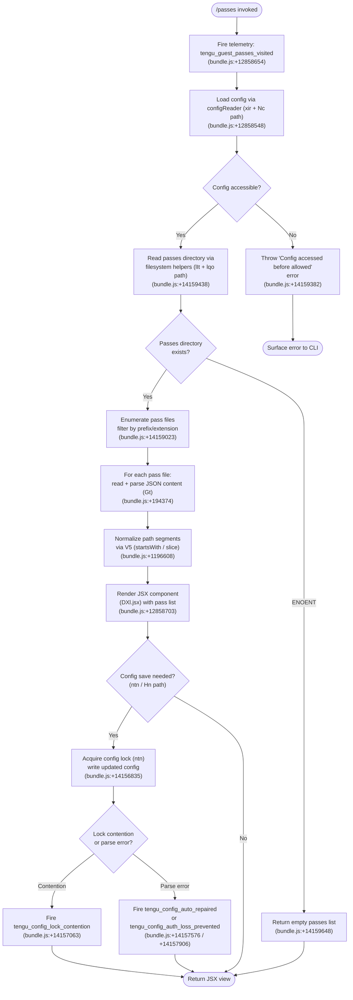

# `/passes`

> Analysis basis: CC v2.1.196 bundle.js (AST extraction + Claude interpretation)
> Minimum version: v2.1.196

---

## Overview

The `/passes` command opens the Guest Passes screen, which allows a Claude Code user to share a free week of Claude Code access with friends. It renders a JSX-based UI component (type `local-jsx`), fires a visit telemetry event immediately upon invocation, and delegates all data loading and display to a dedicated async handler (`u7f`) that orchestrates guest-pass state retrieval and config synchronization.

---

## Registration

| Field | Value |
|---|---|
| type | `local-jsx` |
| name | `passes` |
| description | `Share a free week of Claude Code with friends` |
| module_id | `MXl` |
| load_inline | `true` |
| loc_byte | `12858821` |
| loc_byte_end | `12859143` |
| loc_line | `8806` |
| isHidden | `null` (not hidden) |
| arbor_handler.name | `u7f` |
| arbor_handler.fqn | `claude-2.1.196::u7f` |
| arbor_handler.kind | `AsyncFunction` |
| arbor_handler.resolution_path | `module_id` |
| arbor_handler.n_hits | `2` |

Analysis basis: CC v2.1.196 bundle.js:+12858821

---

## Input Branching

The handler has three or more distinct execution paths depending on config state and pass availability, so a Mermaid flowchart is used.



---

## Behavioral Spec

### 1. Command Entry — Handler `u7f`

The primary entry point is the async function resolved by Arbor as `u7f` via the `module_id` → `MXl` resolution path.

```
async function passesCommandHandler(context):
    fireVisitTelemetry("tengu_guest_passes_visited")   // bundle.js:+12858654
    config = await loadConfig(context)                  // xir → Nc → aE chain
    passList = await readPassDirectory(config)          // Hn → ntn → lIt chain
    component = renderPassesJSX(passList)               // DXl.jsx
    return component
```

Analysis basis: CC v2.1.196 bundle.js:+12858514 (u7f → Dt edge), +12858548 (u7f → xir), +12858554 (u7f → Hn), +12858703 (DXl.jsx render)

---

### 2. Config Loading — `xir` / `Nc` / `aE` chain

The handler calls a config-access function (`xir`) which itself calls into `Nc` and then `aE` (the core config reader). If config is not yet accessible (e.g., called before initialization), the config reader throws the sentinel message `"Config accessed before allowed."`.

```
function loadConfig(context):
    guard = checkConfigAccessGuard()     // xir → Nc
    if not guard.accessible:
        throw Error("Config accessed before allowed.")   // bundle.js:+14159382
    raw = fileSystem.readFileSync(configPath, "utf-8")   // bundle.js:+14159465
    parsed = JSON.parse(raw)                              // Gt → JSON.parse, bundle.js:+194374
    return parsed
```

Analysis basis: CC v2.1.196 bundle.js:+12502451, +14159376, +14159382, +14159438, +14159465

---

### 3. Pass Directory Enumeration — `lIt` / `lqo` / `uqo` chain

After config is loaded, the handler reads the directory that stores guest-pass files. It uses filesystem synchronous helpers via `lIt` (file reader orchestrator) and `lqo` / `uqo` (directory resolver + enumerator). If the directory does not exist (`ENOENT`), the function returns an empty collection without throwing.

```
function readPassDirectory(config):
    basePath = resolvePassesDir(config)          // uqo → path.join + Zn
    try:
        entries = fs.readdirStringSync(basePath) // lqo → t.readdirStringSync, bundle.js:+14159023
    catch err:
        if err.code == "ENOENT":                 // bundle.js:+14159648
            return []
        throw err

    passes = []
    for entry in entries:
        if not entry.startsWith(expectedPrefix): // bundle.js:+14159058
            continue
        fullPath = path.join(basePath, entry)    // bundle.js:+14159114
        stat = fs.statSync(fullPath)             // bundle.js:+14159299
        if stat is directory:
            continue
        raw = fs.readFileSync(fullPath, "utf-8") // bundle.js:+14159438
        data = parsePassFile(raw)                // Gt wrapper
        passes.push(data)

    return passes
```

The directory name constant `"backups"` appears in the literals (bundle.js:+14158950), suggesting a backup subdirectory is created or checked when copying pass files.

Analysis basis: CC v2.1.196 bundle.js:+14159023, +14159058, +14159114, +14159299, +14159438, +14159648

---

### 4. Pass File Parsing — `Gt` / `V5`

Each pass file is parsed via `Gt` (a thin JSON.parse wrapper) and then path-normalized via `V5` (a string utility that checks `startsWith` and applies `slice`).

```
function parsePassFile(rawString):
    obj = JSON.parse(rawString)         // Gt → JSON.parse, bundle.js:+194374
    obj.path = normalizePath(obj.path)  // V5: startsWith check + slice, bundle.js:+1196608
    return obj

function normalizePath(p):
    if p.startsWith(somePrefix):        // bundle.js:+1196608
        return p.slice(prefixLength)    // bundle.js:+1196631
    return p
```

Analysis basis: CC v2.1.196 bundle.js:+194374, +1196608, +1196631

---

### 5. Config Persistence — `Hn` / `ntn` / `Tdr` / safe-write chain

The `Hn` function orchestrates the pass-list state against the on-disk config, calling `ntn` (the config save-with-lock implementation) when an update is needed. `ntn` acquires an exclusive lock via a temp-file/rename pattern (`mkt`), and multiple guard paths protect against data loss:

```
async function savePassesState(passList, config):
    lockAcquired = acquireLock()                              // ntn → mkt
    if lockWasSlow:
        emit("tengu_config_lock_contention")                  // bundle.js:+14157063

    existing = fs.statSync(configPath)                        // ntn → s.statSync
    try:
        reRead = JSON.parse(fs.readFileSync(configPath))      // bundle.js:+14157321
    catch parseErr:
        // Auto-repair from cache under lock
        emit("tengu_config_auto_repaired")                    // bundle.js:+14157576
        writeFromCache()
        return

    if reRead is missing auth that cache has:
        emit("tengu_config_auth_loss_prevented")              // bundle.js:+14157906
        // Refuse write — "refusing to write to avoid wiping ~/.claude.json"
        return

    merged = merge(reRead, passList)
    atomicWrite(configPath, merged)                           // mkt → writeFileSync + rename

    if staleWrite detected:
        emit("tengu_config_stale_write")                      // bundle.js:+14157199
```

The literal string `"Lock acquisition took longer than expected - another Claude instance may be running"` (bundle.js:+14156974) is logged when contention is detected. The literal `"saveConfigWithLock: re-read hit a parse error; auto-repairing from cached config under lock. See GH #3117."` (bundle.js:+14157448) is logged before auto-repair. The literal `"saveConfigWithLock: re-read config is missing auth that cache has; refusing to write to avoid wiping ~/.claude.json. See GH #3117."` (bundle.js:+14157754) is logged before refusing a stale write.

Analysis basis: CC v2.1.196 bundle.js:+14156835, +14156974, +14157063, +14157199, +14157448, +14157576, +14157754, +14157906

---

### 6. Backup File Management — within `ntn`

Before committing config updates, up to 5 backup copies are retained (literal `5` at bundle.js:+14158367). Backup filenames include the marker `".backup."` (bundle.js:+14158228) and use `Date.now()` for timestamping (bundle.js:+14156835). Old backups beyond the retention count are unlinked via `fs.unlinkSync` (bundle.js:+14158485). File permissions `0o600` (decimal `384`, bundle.js:+14158649) are applied to written config files.

```
function manageBackups(configPath, backupDir):
    existing = fs.readdirStringSync(backupDir)
                .filter(f => f.startsWith(".backup."))     // bundle.js:+14158228
                .sortedByTimestamp()
    while existing.length >= 5:                            // bundle.js:+14158367
        fs.unlinkSync(oldest)                              // bundle.js:+14158485
    dest = path.join(backupDir, ".backup." + Date.now())  // bundle.js:+14156835
    fs.copyFileSync(configPath, dest)                      // bundle.js:+14158341
    fs.chmodSync(dest, 0o600)                              // decimal 384, bundle.js:+14158649
```

Analysis basis: CC v2.1.196 bundle.js:+14158228, +14158341, +14158367, +14158485, +14158649

---

### 7. JSX Render

The command ultimately returns a JSX element produced by `DXl.jsx` (bundle.js:+12858703), which is the local-jsx component displayed in the CLI terminal UI. The render receives the resolved pass list and the current value of an application-state variable (`V`, bundle.js:+12858652) as props.

```
function renderPassesView(passList, appState):
    return DXl.jsx({ passes: passList, state: appState })
```

Analysis basis: CC v2.1.196 bundle.js:+12858652, +12858703

---

## State & Side Effects

| Item | Detail |
|---|---|
| Telemetry — `tengu_guest_passes_visited` | Fired immediately on command invocation (bundle.js:+12858654) |
| Telemetry — `tengu_config_lock_contention` | Fired when config lock acquisition exceeds the expected threshold (bundle.js:+14157063) |
| Telemetry — `tengu_config_stale_write` | Fired when a stale config write is detected (bundle.js:+14157199) |
| Telemetry — `tengu_config_auto_repaired` | Fired when a parse error triggers automatic repair from cached config (bundle.js:+14157576) |
| Telemetry — `tengu_config_auth_loss_prevented` | Fired when a write is refused to prevent wiping auth from `~/.claude.json` (bundle.js:+14157906) |
| Telemetry — `tengu_config_parse_error` | Fired on config parse errors in the broader config-write path (bundle.js:+14160796) |
| Telemetry — `tengu_config_fallback_write` | Fired when a fallback write path is used (bundle.js:+14156679) |
| Telemetry — `tengu_daemon_control` | Present in the depth-2 call graph via `u` → `xe`/`ke` path; fires on daemon lifecycle events not directly triggered by `/passes` (bundle.js:+18033163) |
| Filesystem — config read | Reads `~/.claude.json` (or equivalent) synchronously |
| Filesystem — config write | Atomic write via temp-file + rename pattern under file lock; max 5 backups retained with `".backup."` prefix |
| Filesystem — pass directory | Reads pass files from a passes subdirectory; creates it with `mkdirSync` if absent |
| appState changes | Reads application state `V` to pass as prop to JSX component; may update config passes list |
| File watch registration | `vi` → `fis.register` (bundle.js:+68542) and `hmc.unwatchFile` (bundle.js:+14155465) manage file watch hooks in the config-watcher layer (`Ldm`) |
| Sound | None observed |

---

## Version History

| Version | Change |
|---|---|
| v2.1.196 | Initial analysis |

---

## Common Mistakes

1. **Invoking `/passes` before authentication is complete** — the config guard will throw `"Config accessed before allowed."` if the config system has not finished initializing. Wait for the CLI to finish startup before running `/passes`.

2. **Concurrent Claude Code instances modifying config** — if another Claude Code instance is running simultaneously, lock contention will be logged and the telemetry event `tengu_config_lock_contention` will fire. The warning message `"Lock acquisition took longer than expected - another Claude instance may be running"` will appear. Avoid running multiple Claude Code instances that write config concurrently.

3. **Manually editing `~/.claude.json` while Claude Code is running** — the auth-loss prevention guard (`tengu_config_auth_loss_prevented`) will refuse to write if the re-read config is missing auth credentials the cache holds, which can prevent pass updates from being persisted.

4. **Expecting `/passes` to function offline** — the passes feature depends on server-side validation of pass entitlements; local file enumeration reflects only cached state.

5. **Assuming pass files are human-readable JSON at a known path** — the pass directory path is resolved dynamically at runtime via `uqo` / `path.join` and may vary between installations.

---

## Appendix — Identifier Mapping

> For bundle debugging only. Identifiers change across versions.

| Identifier | Role |
|---|---|
| `u7f` | Primary async handler for `/passes` command (Arbor-resolved entry point) |
| `Dt` | Config-access orchestrator called by `u7f` and `TH`; coordinates read/write cycle |
| `qt` | Utility: config path resolver |
| `sqo` | Config state helper (called by `Dt` and `Ldm`) |
| `lIt` | File-level config reader: reads file, parses JSON, enumerates pass entries |
| `vs` | Low-level file system wrapper (data reader, exits on `cli_error`) |
| `Gt` | Thin JSON.parse wrapper |
| `V5` | Path/string normalizer using `startsWith` + `slice` |
| `rn` | Utility: string/path helper used across config and file operations |
| `lqo` | Pass directory enumerator: resolves dir, reads entries, filters by prefix |
| `uqo` | Pass directory path builder using `path.join` + `Zn` |
| `T` | HTTP/API request builder (called by `lIt`, `ntn`, `mkt`) |
| `eeu` | Sub-component of `T`; handles request assembly |
| `Me` | JSON.stringify wrapper |
| `Pc` | String redaction/truncation utility (`[REDACTED]` literal) |
| `KQe` | Utility invoking `Gls` (locale/format helper) |
| `oeu` | File upload / buffer-length utility |
| `m` | XHR / fetch filter wrapper with `Array.isArray` and `filter` |
| `XHr` | URL prefix normalizer: `startsWith` + `slice` + `replace` |
| `k` | File watcher (uses `setInterval`, `clearInterval`, `O.watch`, `I.on`) |
| `V` | Application state accessor passed as JSX prop |
| `Ldm` | Config file watcher manager: registers/unwatches config file |
| `bkt` | Config watcher bootstrapper using `mvs.watchFile` |
| `n` | String lowercaser utility |
| `Re` | Config reload handler: reads, pushes updates, logs errors |
| `ege` | Config change event emitter |
| `vi` | Hook/listener registrar (`fis.register`) |
| `xir` | Config access guard wrapper (calls `Nc` then `Dt`) |
| `Nc` | Calls `aE` (config reader) and `Dt` (config orchestrator) |
| `aE` | Core config reader: orchestrates `Hd`, `cb`, `Lc`, `TH`, `Jst` |
| `Hd` | Config header/bare-mode utility (`--bare` literal) |
| `cb` | Profile config assembler (`profile-implicit`, `user_oauth` literals) |
| `Lc` | First-party auth helper (`firstParty` literal) |
| `aI` | Auth info accessor |
| `TH` | Full config initialization: checks `ANTHROPIC_API_KEY`, `apiKeyHelper`, throws on missing auth |
| `AUt` | Auth utility calling `Jst` |
| `Jst` | Config context builder using `ct` + `I8` |
| `Hn` | Pass-list state manager: reads directory, triggers `ntn`, renders view |
| `ntn` | Config save-with-lock implementation (main write path) |
| `s` | Async resource manager (add/delete/finally pattern) |
| `i` | Resource closer (close `n` and `r`, then call `s`) |
| `Yli` | Config object merger using `E4r` + `Object.assign` |
| `E4r` | Deep merge helper using `zli` |
| `cIt` | Config integrity checker |
| `v` | Version/numeric validator |
| `y` | Pass list data structure / teammate mailbox (calls `lqe`) |
| `lqe` | Teammate mailbox message-read handler (acquires lock, marks messages read) |
| `I` | Scroll/slice utility using `Math.max`, `Math.floor`, `preventDefault` |
| `M` | OAuth/gateway HTTP handler (device flow, token exchange, managed settings) |
| `A` | Userinfo sub-validation helper |
| `mkt` | Atomic file write utility: temp-file, rename, `fchmodSync`, `fsyncSync` |
| `Bd` | Real-path resolver using `realpathSync` |
| `u` | Daemon lifecycle controller (`daemon_stop`, `daemon_stop_failed`) |
| `Sn` | String normalization helper wrapping `rn` |
| `rtt` | Error code classifier (`EINVAL`, `ENOTSUP`, `EPERM`, `ENOSYS`) |
| `tkr` | File descriptor tracker using `hTs` + `KNu` |
| `JTs` | Property descriptor helper using `Object.defineProperty` |
| `zUe` | Pass-state initializer |
| `iqo` | Pass entry iterator using `Object.entries` |
| `etn` | Timestamp recorder using `Date.now` |
| `Zen` | Pass-directory sync helper calling `lIt` + `C0` |
| `Tdr` | Config fallback write path (`tengu_config_fallback_write`); calls `mkt` |
| `Oe` | Output/render helper calling `$Xe` |
| `$Xe` | Terminal output primitive |

---

Note: index built via Arbor fallback; some signals (telemetry, literals) may be missing — see arbor-fallback.js.