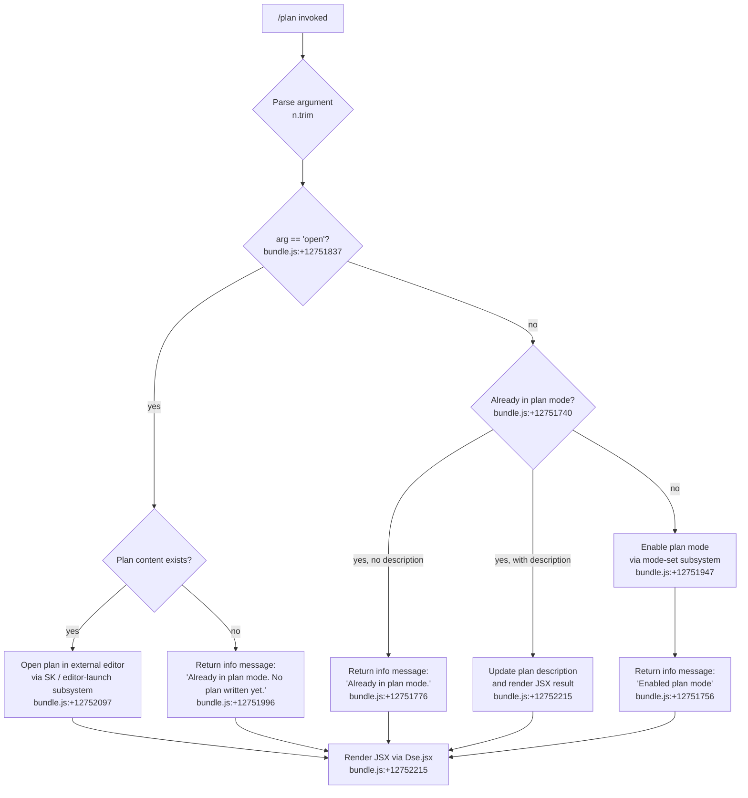

# `/plan`

> Analysis basis: CC v2.1.195 bundle.js (AST extraction + Claude interpretation)
> Minimum version: v2.1.195

---

## Overview

The `/plan` command enables **plan mode** for the current Claude Code session or displays/opens the session's existing plan. When invoked without arguments or with a description, it activates plan mode and optionally records the provided description; when invoked with the argument `open`, it launches the current plan in an external editor (if one exists). The command renders its result as a JSX component and integrates with the permission/mode management subsystem.

---

## Registration

| Field | Value |
|---|---|
| type | `local-jsx` |
| name | `plan` |
| description | Enable plan mode or view the current session plan |
| argumentHint | `[open\|<description>]` |
| module_id | `qKl` |
| load_inline | `true` |
| loc_byte | `12752431` |
| loc_byte_end | `12752630` |
| loc_line | `8699` |
| arbor_handler.name | `ZWf` |
| arbor_handler.fqn | `claude-2.1.195::ZWf` |
| arbor_handler.kind | `AsyncFunction` |
| arbor_handler.resolution_path | `module_id` |
| arbor_handler.n_hits | `0` |

Analysis basis: CC v2.1.195 bundle.js:+12752431

---

## Input Branching

The command has 4+ distinct branches depending on the argument supplied and current session state, so a Mermaid flowchart is used.



---

## Behavioral Spec

### Main Handler (`ZWf` — `planCommandHandler`)

The Arbor-resolved handler is `ZWf` (AsyncFunction, resolved via `module_id` → `qKl`).

```
async function planCommandHandler(context):
    argument = context.input.trim()                    // bundle.js:+12751818

    // 1. Resolve current session state
    sessionState = resolveSessionState(context)        // UA / Xu / tFe  bundle.js:+12751740

    // 2. Branch: "open" sub-command
    if argument == "open":                             // bundle.js:+12751837
        plan = getCurrentPlan(sessionState)            // ED  bundle.js:+12751954
        if plan has no content:
            return infoMessage("Already in plan mode. No plan written yet.")
                                                       // bundle.js:+12751996
        else:
            openPlanInEditor(plan, context)            // SK  bundle.js:+12752097
            return renderResult()

    // 3. Branch: already in plan mode
    if isPlanModeActive(sessionState):                 // bundle.js:+12751740
        if argument is empty:
            return infoMessage("Already in plan mode.")
                                                       // bundle.js:+12751776
        else:
            updatePlanDescription(argument, sessionState)
            return renderJSX(Dse, result)              // bundle.js:+12752215

    // 4. Branch: activate plan mode
    enablePlanMode(context, argument)                  // SD  bundle.js:+12751947
    return infoMessage("Enabled plan mode")            // bundle.js:+12751756
    renderJSX(Dse, result)                             // bundle.js:+12752215
```

Analysis basis: CC v2.1.195 bundle.js:+12751551

---

### Sub-feature: Session State Resolution (`UA` / `Xu` / `tFe` — `resolveSessionState`)

```
function resolveSessionState(context):
    // Reads current active mode flags from app state
    // Delegates through Xu → tFe
    return sessionModeFlags                            // bundle.js:+12751740
```

Analysis basis: CC v2.1.195 bundle.js:+12751740

---

### Sub-feature: Mode Activation (`SD` / `ED` / `kOe` — `activatePlanMode`)

```
async function activatePlanMode(context, description):
    // Resolves current plan document path via kOe
    planRef = resolveCurrentPlan(context)              // kOe  bundle.js:+13609078
        // Uses Rt (renderer), eCe (session config), r.get (state map)
        // Applies gE (path join), ezr (path escape), Mst / wxn (normalizers)
        // Joins via OK.join, reads/writes via qt, r.set

    // Builds the editor/mode record via ED
    modeRecord = buildModeRecord(planRef)              // ED   bundle.js:+12751954
        // Combines Rt + OK.join + gE

    // Persists mode change; writes plan file if description provided
    persistModeChange(modeRecord, description)         // SD   bundle.js:+12751947
        // utf-8 encoding  bundle.js:+13609541
        // Calls Cn (file-write helper) and qo (notification helper)
        // Triggers T (render helper) and xe (error-boundary wrapper)

    return modeRecord
```

Analysis basis: CC v2.1.195 bundle.js:+12751947

---

### Sub-feature: Open Plan in Editor (`SK` — `openPlanInEditor`)

```
async function openPlanInEditor(planPath, context):
    // Validate editor exists
    editorInfo = resolveEditor(context)                // $W / fH / O1f  bundle.js:+11845002
    if editorInfo is null:
        throw Error("Ink instance not found - cannot pause rendering")
                                                       // bundle.js:+11845752

    // Stat the plan file to confirm it exists
    fileStat = t.statSync(planPath)                    // bundle.js:+11845845

    // Determine file type list via U1f / ZUo / R$l
    fileEntries = classifyFileEntries(planPath)        // bundle.js:+11845893
        // R$l: trims, checks startsWith, basename, R1f.has, toLowerCase

    // Pause terminal rendering before handing off to editor
    context.ink.enterAlternateScreen()                 // bundle.js:+11845905
    context.ink.pause()                                // bundle.js:+11845935
    context.ink.suspendStdin()                         // bundle.js:+11845945

    // Spawn editor synchronously
    editorArgs = s.split(editorCmd) + i.slice(args)   // bundle.js:+11845984
    result = D$l.spawnSync(editor, editorArgs,
                 { stdio: "inherit" })                 // bundle.js:+11846027

    // Identify editor type (IDE vs terminal)
    editorType = classifyEditor(editorCmd)             // yx  bundle.js:+12752190
        // Checks "IDE" literal  bundle.js:+6843806
        // Uses e.toLowerCase, yi (indexOf/slice), yO.basename, pWe

    // Read back potentially modified plan
    updatedContent = t.readFileSync(planPath)          // bundle.js:+11846329

    // Restore terminal
    context.ink.exitAlternateScreen()                  // bundle.js:+11846407
    context.ink.resumeStdin()                          // bundle.js:+11846436
    context.ink.resume()                               // bundle.js:+11846452
```

Analysis basis: CC v2.1.195 bundle.js:+12752097

---

### Sub-feature: Permission / Mode Management (`PH` — `permissionModeManager`)

```
function permissionModeManager(operation, payload):
    // Rejects bypassPermissions if mode is unavailable
    if operation == "setMode" and payload == "bypassPermissions":
        if modeNotAvailable:
            log("Ignoring permission update: setMode 'bypassPermissions' rejected…")
                                                       // bundle.js:+5414220
            return

    // Applies rule sets to session
    switch operation:
        case "addRules":      applyAddRules(payload)   // bundle.js:+5414496
        case "replaceRules":  applyReplaceRules()      // bundle.js:+5414844
        case "addDirectories": addDirectories()        // bundle.js:+5415155
        case "removeRules":   removeRules()            // bundle.js:+5415501
        case "removeDirectories": removeDirectories()  // bundle.js:+5415885

    // Rule categories: allow / alwaysAllowRules, deny / alwaysDenyRules,
    //                  alwaysAskRules                 // bundle.js:+5414681
    n.set(key, value)                                  // bundle.js:+5415414
    o.filter / s.has for deduplication                 // bundle.js:+5415811
    n.delete on removal                                // bundle.js:+5416113
```

Analysis basis: CC v2.1.195 bundle.js:+5414218

---

### Sub-feature: Plan Rendering (`pHt` / `wTe` / `ij` — `planViewRenderer`)

```
function planViewRenderer(sessionState):
    // Enumerate plan sections via Object.entries
    entries = Object.entries(planState)                // bundle.js:+13930779
    // wTe: calls PH for permission context, maps over entries via o.map

    // Build display items via ij
    displayItems = buildDisplayItems(entries)          // bundle.js:+13930873
        // Object.entries  bundle.js:+13919513
        // wg: formats name/value pairs using fNu, wM (Object.hasOwn check),
        //     mNu, e.substring, pNu (replaceAll for escaping)
        // UWo: resolves tool inclusion / exclusion
        //     NWo: checks mI.includes, path relative via Nlc.relative, Ot
        //     r.match for pattern-based filtering  bundle.js:+13917475
        // Blc: looks up cached entries r.get / r.set / a.push
        //     Arm: F1.includes check  bundle.js:+13919183
        // T (renderHelper) produces final output  bundle.js:+13919768
        // Dp / dNu: replaceAll-based text escaping  bundle.js:+13919974

    // Wrap in info-level log output
    logLevel = "info"                                  // bundle.js:+13930975

    // Pass to T (top-level render) and pHt returns composite JSX
    return compositeJSX(displayItems)                  // bundle.js:+13930901
```

Analysis basis: CC v2.1.195 bundle.js:+12751653

---

### Sub-feature: Settings Resolution (`pHt` → `zWo` / `Wkr` / `Hn` — `settingsResolver`)

```
function settingsResolver(context):
    // Merges four settings layers in precedence order:
    //   policySettings  bundle.js:+1347977
    //   flagSettings    bundle.js:+1348027
    //   userSettings    bundle.js:+1348075
    //   localSettings   bundle.js:+1348123
    //
    // zWo determines which model/provider to use:
    //   "auto" default  bundle.js:+13930690
    //   Checks D5 (model discriminator) and eC → GWo → Go for provider caps
    //   c_e inspects model strings (e.g. "claude-3-", "claude-opus-4-*",
    //       "claude-sonnet-4-*", "claude-haiku-4-5") bundle.js:+3063577
    //   Provider: "firstParty" / "anthropicAws"      bundle.js:+3063796
    //
    // Wkr → Hn: reads merged settings via gmn / p3
    return mergedSettings
```

Analysis basis: CC v2.1.195 bundle.js:+12751653

---

### Sub-feature: JSX Output / ANSI Rendering (`bKa` / `hgt` / `AV` / `Xa` — `jsxOutputRenderer`)

```
function jsxOutputRenderer(content):
    // hgt: attaches o.on listeners for output streaming
    //       i.toString for buffer conversion  bundle.js:+8353373
    //       AV → PXr / KXr → nWi.createElement for React element creation
    //       xne → GM, f0e, OXr for styled text components
    // ggt.jsx: wraps output in Ink JSX tree  bundle.js:+8353403

    // Xa: strips ANSI escape codes for plain-text fallback
    //     Bun.stripANSI  bundle.js:+3969395

    // Final render via Dse.jsx  bundle.js:+12752215
    return jsxElement
```

Analysis basis: CC v2.1.195 bundle.js:+12752211

---

### Sub-feature: Error Handling (`Cs` / `D7e` — `cliErrorHandler`)

```
function cliErrorHandler(error):
    // Log to stderr in red
    formattedMsg = Ct.red(error.message)               // bundle.js:+13393520
    console.error(formattedMsg)                        // bundle.js:+13393506

    // Persist CLI error record
    writeErrorRecord("cli_error", error)               // aI  bundle.js:+13393558
        // oae.writeFileSync  bundle.js:+201306
        // VSr.join for path construction  bundle.js:+201324

    // Terminate process
    process.exit(1)                                    // bundle.js:+13393574
```

Literal constants: `"cli_error"` (bundle.js:+13393561), exit code `1` (bundle.js:+13393587).

Analysis basis: CC v2.1.195 bundle.js:+17797329

---

### Sub-feature: Transcript / Tool-Output Buffer (`r` / `Pge` / `o` — `transcriptBuffer`)

```
function transcriptBuffer(events):
    // r: maintains a Set of in-flight entries
    //    r.add   bundle.js:+17892037
    //    r.delete bundle.js:+17892060
    //    r.close  bundle.js:+17898895
    //
    // i: stream segment
    //    n.close  bundle.js:+17898885
    //    i.finally for cleanup  bundle.js:+17892046
    //    i: delegates to s (recursive)  bundle.js:+17899035
    //
    // o: formats output
    //    s.map    bundle.js:+17913462
    //    i.padEnd for column alignment (width 40)  bundle.js:+17913475
    //    separator "  " (two spaces)  bundle.js:+17913496
    //    n: toLowerCase for normalization  bundle.js:+17915396
    //
    // Buffer limit: 1024 items  bundle.js:+17797372
    // Data type tag: "data"  bundle.js:+17797319
```

Maximum buffer size: 1024 entries (bundle.js:+17797372).

Analysis basis: CC v2.1.195 bundle.js:+12751600

---

## State & Side Effects

| Item | Detail |
|---|---|
| Telemetry | No `tengu_*` telemetry events found in depth-2 traversal |
| Plan mode flag | Set via `SD` → `activatePlanMode`; persisted to session config (bundle.js:+12751947) |
| Plan file write | Written via `Cn` → `on` with `utf-8` encoding (bundle.js:+13609541) |
| Error record write | Written via `aI` → `oae.writeFileSync` on CLI error (bundle.js:+201306) |
| process.exit | Called with code `1` on unrecoverable CLI error (bundle.js:+13393574) |
| Terminal control | `enterAlternateScreen` / `pause` / `suspendStdin` before editor spawn; reversed after (bundle.js:+11845905) |
| Editor spawn | `D$l.spawnSync` with `stdio: "inherit"` (bundle.js:+11846027) |
| Hook registration | `vi` → `krs.register` for hot-key / lifecycle hooks (bundle.js:+68053) |
| ANSI stripping | `Xa` → `Bun.stripANSI` for plain-text fallback output (bundle.js:+3969395) |
| Permission rule mutations | `PH`: addRules / replaceRules / addDirectories / removeRules / removeDirectories on session rule sets (bundle.js:+5414218) |
| Transcript buffer | `r` Set managed with add/delete/close; max 1024 entries (bundle.js:+17797372) |
| Log output | `"info"` level used for plan status messages (bundle.js:+13930975) |

---

## Version History

| Version | Change |
|---|---|
| v2.1.195 | Initial analysis |

---

## Common Mistakes

1. **Using `/plan open` with no plan written yet** — The command returns `"Already in plan mode. No plan written yet."` (bundle.js:+12751996) rather than opening an editor. A plan description must be written first via `/plan <description>` or by the agent.
2. **Invoking `/plan` when already in plan mode without a new description** — Returns `"Already in plan mode."` (bundle.js:+12751776) and takes no further action. Pass a description argument to update the plan.
3. **Expecting telemetry events** — No `tengu_*` telemetry events are emitted by this command at depth-2 traversal. Do not rely on telemetry for auditing plan-mode activation.
4. **Assuming synchronous editor launch** — The editor is spawned via `spawnSync` (bundle.js:+11846027) which blocks the process; the terminal is suspended and restored around the spawn. IDE-type editors are classified separately from terminal editors via `yx` (bundle.js:+12752190).
5. **Expecting `bypassPermissions` mode to be silently accepted** — If `disableBypassPermissionsMode` is set or the session was not launched in `bypassPermissions` mode, the mode-set is silently ignored with a log message (bundle.js:+5414220).
6. **Conflating `/plan` with a prompt-type command** — This command is `local-jsx` type, not `prompt` type. It does not inject a prompt into the agent conversation; it manipulates session state and renders a JSX component directly.

---

## Appendix — Identifier Mapping

> For bundle debugging only. Identifiers change across versions.

| Identifier | Role |
|---|---|
| `ZWf` | Main plan command handler (AsyncFunction, Arbor-resolved) |
| `r` | Transcript buffer Set / stream reference |
| `Cs` | CLI error dispatcher |
| `D7e` | Error formatter (red coloring + console.error) |
| `aI` | Error record file writer |
| `Pge` | Transcript / event source initializer |
| `o` | Output formatter (padEnd, map) |
| `s` | Stream segment / event emitter |
| `i` | Stream inner segment (finally/close) |
| `n` | Stream normalizer (toLowerCase, close) |
| `PH` | Permission/mode manager |
| `T` | Top-level render helper |
| `RYc` | Render context builder |
| `Drs` | Render dependency resolver |
| `e` | Generic string/event parameter |
| `t` | Generic target/config parameter |
| `Me` | JSON.stringify wrapper |
| `Lc` | Path/label formatter |
| `_is` | Path segment mapper (wYc.map) |
| `jXe` | Output write helper |
| `ais` | e.write wrapper |
| `PYc` | Session transcript persister |
| `_Xe` | Debounce/batch scheduler (clearTimeout/setTimeout/setImmediate) |
| `Qge` | Transcript flush coordinator |
| `qt` | Config/state accessor |
| `tae` | File-write event emitter |
| `Sis` | Path join + stat helper |
| `oAr` | Atomic file rename/unlink handler |
| `DYc` | Transcript append-file writer (mkdir + appendFile) |
| `vi` | Hook registrar (krs.register) |
| `Dp` | Text escaper (replaceAll) |
| `dNu` | replaceAll-based string normalizer |
| `pHt` | Plan view renderer (composite) |
| `zWo` | Model/provider resolver |
| `D5` | Model discriminator |
| `eC` | Provider capability checker |
| `GWo` | Provider gate (Go) |
| `c_e` | Model string classifier |
| `As` | Provider/model aggregator |
| `Wkr` | Settings merger |
| `Hn` | Settings reader (gmn/p3) |
| `GB` | Plan display block builder |
| `wTe` | Plan entry enumerator (Object.entries + PH + o.map) |
| `ij` | Display item builder |
| `wg` | Name/value pair formatter |
| `fNu` | Field name formatter |
| `wM` | Object.hasOwn guard |
| `mNu` | Value normalizer |
| `pNu` | replaceAll escaper for display values |
| `UWo` | Tool inclusion resolver |
| `Iqe` | Tool cache lookup (Gfl.get/set) |
| `NWo` | Tool path relativizer (Nlc.relative) |
| `Blc` | Cached entry builder (r.get/r.set) |
| `Arm` | Tool allow-list checker (F1.includes) |
| `a` | Response/spend aggregator |
| `UA` | Session state resolver |
| `Xu` | Session mode flag reader |
| `tFe` | Mode flag extractor |
| `BAt` | Plan config accessor |
| `eCe` | Session config reader |
| `Rt` | Renderer/config base |
| `u0` | Config root accessor |
| `SD` | Plan mode activator |
| `ED` | Mode record builder |
| `kOe` | Plan path resolver |
| `ezr` | Path escape handler (e.replace) |
| `Mst` | Path normalizer (dUt) |
| `wxn` | Path normalizer variant (dUt) |
| `Cn` | File write helper (on) |
| `on` | Low-level file write (ENOENT/EISDIR handler) |
| `qo` | Notification helper (on) |
| `xe` | Error boundary wrapper |
| `Zr` | Error/String converter |
| `ut` | String coercer |
| `qi` | Error logger (rSs) |
| `rSs` | Error string formatter (ut) |
| `BMu` | Error ring buffer (Tpn.shift/push) |
| `SK` | Editor launch orchestrator |
| `$W` | Editor info resolver (fH/O1f) |
| `fH` | Editor binary locator |
| `U1f` | File entry classifier |
| `ZUo` | File-type list builder (R$l, k1f.find) |
| `R$l` | File entry filter (trim/startsWith/basename/toLowerCase) |
| `yx` | Editor type classifier (IDE vs terminal) |
| `yi` | String indexOf/slice utility |
| `bKa` | JSX output renderer coordinator |
| `hgt` | Output stream listener (o.on) |
| `AV` | React element factory (PXr/KXr/xne) |
| `KXr` | nWi.createElement wrapper |
| `xne` | Styled text component (GM/f0e/OXr) |
| `Xa` | ANSI strip wrapper (Bun.stripANSI) |

---

Note: index built via Arbor fallback; some signals (telemetry, literals) may be missing — see arbor-fallback.js.