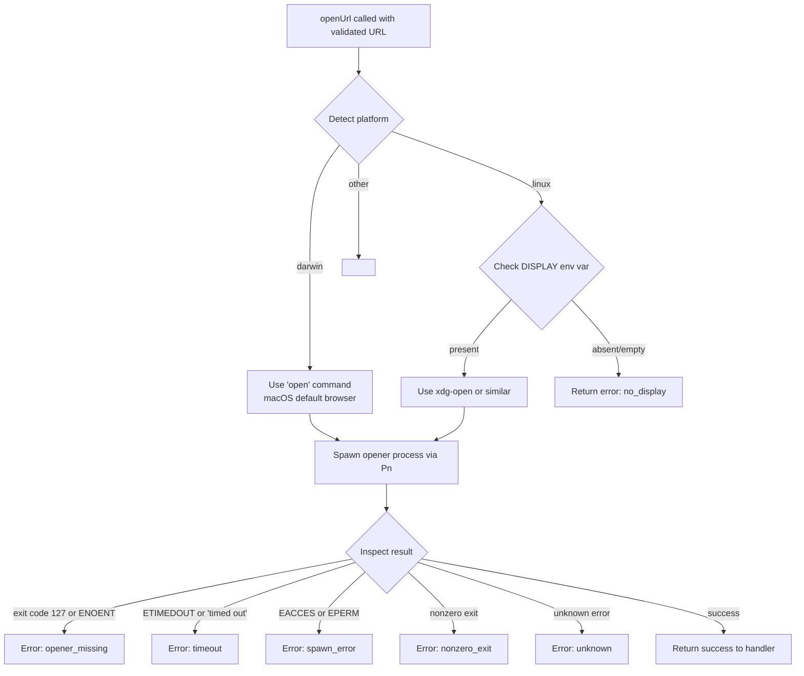

# `/radio`

> Analysis basis: CC v2.1.196 bundle.js (AST extraction + Claude interpretation)
> Minimum version: v2.1.196

---

## Overview

The `/radio` command opens the Claude FM lo-fi radio stream (`https://clau.de/radio`) in the user's default system browser. It is a single-purpose utility command: it invokes the platform's URL-opener, displays a brief confirmation message on success, and prints a fallback URL on failure so the user can navigate manually.

---

## Registration

| Field | Value |
|---|---|
| type | `local` |
| name | `radio` |
| description | `Listen to Claude FM lo-fi radio` |
| supportsNonInteractive | `false` |
| module_id | `Stc` |
| load_inline | `true` |
| loc_byte | `13042734` |
| loc_byte_end | `13042927` |
| loc_line | `9026` |
| arbor_handler.name | `UJf` |
| arbor_handler.fqn | `claude-2.1.196::UJf` |
| arbor_handler.kind | `AsyncFunction` |
| arbor_handler.resolution_path | `module_id` |
| arbor_handler.n_hits | `0` |

Analysis basis: CC v2.1.196 bundle.js:+13042734

---

## Input Branching

The command takes no user-supplied arguments. After the URL-open attempt, there are two outcomes (success or failure), making this a **2-branch linear flow**; numbered pseudocode is used.

**Handler entry point:** `UJf` (resolved via `module_id` → `Stc`; see Arbor handler row above).

1. Handler `UJf` is invoked with no meaningful input arguments.
2. The hardcoded target URL `"https://clau.de/radio"` is passed to the URL-opener utility (`xc`).
3. **Branch A — opener succeeds:** a `text`-type result containing the message `"Opening Claude FM in your browser…"` is returned to the caller.
4. **Branch B — opener fails:** a `text`-type result containing the fallback message `"Couldn't open the browser. Listen at: https://clau.de/radio"` is returned to the caller.

Analysis basis: CC v2.1.196 bundle.js:+13042492, +13042495, +13042532, +13042545, +13042613

---

## Behavioral Spec

### Top-level handler (`UJf`)

```
async function radioCommandHandler():
    TARGET_URL = "https://clau.de/radio"
    try:
        await openUrl(TARGET_URL)          # calls xc()
        return { type: "text",
                 content: "Opening Claude FM in your browser…" }
    catch error:
        return { type: "text",
                 content: "Couldn't open the browser. Listen at: https://clau.de/radio" }
```

Analysis basis: CC v2.1.196 bundle.js:+13042492, +13042495, +13042532, +13042545, +13042613

---

### URL validation (`LKr` / `SOd`)

Before attempting to spawn the system opener, the URL is validated. Only `http:` and `https:` schemes are accepted; any other scheme causes an `invalid_url` error to be thrown via the custom error constructor (`SOd`).

```
function validateUrl(urlString):
    parsed = parseUrl(urlString)          # String() coercion then URL parse
    if parsed.protocol not in ["http:", "https:"]:
        raise CustomError("invalid_url", code=1)
    return parsed
```

Constants:
- Accepted schemes: `"http:"` (bundle.js:+3154473), `"https:"` (bundle.js:+3154495)
- Error code for invalid URL: `1` (bundle.js:+3155656), error kind string: `"invalid_url"` (bundle.js:+3155665)

Analysis basis: CC v2.1.196 bundle.js:+3155629, +3155715, +3154423

---

### Platform URL-opener dispatcher (`ZLi`)

After validation, the opener dispatcher selects the appropriate system command based on the host platform.



Platform constants found in implementation:
- macOS platform string: `"darwin"` (bundle.js:+3155876)
- Linux platform string: `"linux"` (bundle.js:+3155561)
- No-display error kind: `"no_display"` (bundle.js:+3155918)
- Display presence check index: `0` (bundle.js:+3155842)
- Opener command name: `"open"` (bundle.js:+3155955)

Analysis basis: CC v2.1.196 bundle.js:+3155733, +3155817, +3155876, +3155892, +3155939, +3155949

---

### Process spawner (`Pn`) and result classifier (`bOd`)

The process spawner (`Pn`) wraps an internal async spawn utility (`Gr`) with a configurable retry/timeout mechanism (`Ot`). The result classifier (`bOd`) maps raw exit codes and error codes to structured error kinds:

```
function classifyOpenerResult(result):
    if result.exitCode == 127 or result.errorCode == "ENOENT":
        return "opener_missing"
    if result.errorCode == "ETIMEDOUT" or result.message.includes("timed out"):
        return "timeout"
    if result.errorCode in ["EACCES", "EPERM"]:
        return "spawn_error"
    if result.exitCode != 0:
        return "nonzero_exit"
    return "unknown"
```

Error kind constants (all from `bOd` / surrounding logic):
- `"opener_missing"` — exit code 127 or `ENOENT` (bundle.js:+3156161, +3156177, +3156207)
- `"ETIMEDOUT"` / `"timed out"` → `"timeout"` (bundle.js:+3156248, +3156273, +3156306)
- `"EACCES"` / `"EPERM"` → `"spawn_error"` (bundle.js:+3156340, +3156362, +3156391)
- `"nonzero_exit"` (bundle.js:+3156447)
- `"unknown"` (bundle.js:+3156492)

Timeout-related numeric constant observed in spawner context: `10` (bundle.js:+1146207)

Analysis basis: CC v2.1.196 bundle.js:+3156166, +3156161, +3155939, +1146262, +1146373

---

## State & Side Effects

| Item | Detail |
|---|---|
| Telemetry | None detected in depth-2 traversal |
| Hook registration | None detected |
| appState changes | None detected |
| Sound | None detected |
| Network / I/O | Launches the host OS URL-opener (`open` on macOS, platform-equivalent on Linux) targeting `https://clau.de/radio` |
| supportsNonInteractive | `false` — command cannot be used in non-interactive / piped mode |

---

## Version History

| Version | Change |
|---|---|
| v2.1.196 | Initial analysis |

---

## Common Mistakes

1. **Running in non-interactive mode** — `supportsNonInteractive` is `false`; calling `/radio` from a script or piped session will be rejected or silently ignored.
2. **Missing system opener on Linux** — if no graphical URL-opener (`xdg-open`, etc.) is installed, the command returns `"opener_missing"` instead of opening a browser. The fallback message provides the URL for manual navigation.
3. **No DISPLAY on Linux** — headless Linux environments without a `$DISPLAY` variable will hit the `no_display` error path before a browser launch is even attempted.
4. **Expecting an audio stream in-terminal** — `/radio` only opens the web URL; it does not embed or stream audio inside the CLI itself.

---

## Appendix — Identifier Mapping

> For bundle debugging only. Identifiers change across versions.

| Identifier | Role |
|---|---|
| `UJf` | Top-level async radio command handler (entry point) |
| `xc` | URL-open orchestrator; validates then dispatches to platform opener |
| `LKr` | URL validator; enforces `http:`/`https:` scheme, throws `invalid_url` on mismatch |
| `SOd` | Custom error constructor used for structured URL/opener errors |
| `ZLi` | Platform dispatcher; selects opener strategy based on OS and environment |
| `fH` | Helper called at index `0` within the platform dispatch (role unclear beyond depth-2) |
| `QLi` | Linux sub-handler; checks `jt` (likely `process.platform`) |
| `bOd` | Opener result classifier; maps exit codes and error codes to error kind strings |
| `Pn` | Process spawner wrapper; calls `Gr` (spawn) and `Ot` (timeout/retry) |

---

Note: index built via Arbor fallback; some signals (telemetry, literals) may be missing — see arbor-fallback.js.