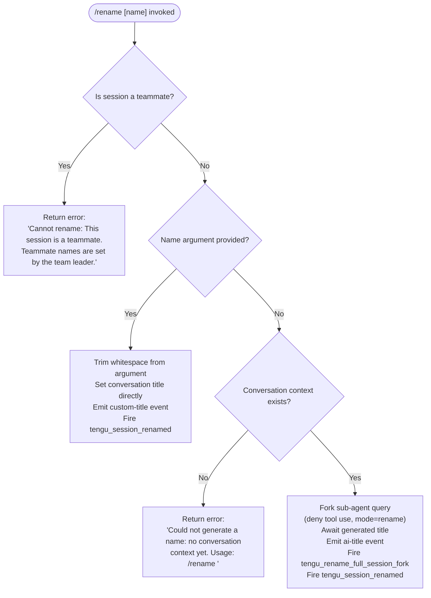

# `/rename`

> Analysis basis: CC v2.1.196 bundle.js (AST extraction + Claude interpretation)
> Minimum version: v2.1.196

---

## Overview

The `/rename` command (aliased as `/name`) renames the current Claude Code conversation session. It accepts an explicit name argument or, when no argument is provided and conversation history exists, automatically generates a name by forking a lightweight sub-agent query against the current session context. The result is persisted to application state and emitted as a `custom-title` or `ai-title` event depending on origin.

---

## Registration

| Field | Value |
|---|---|
| type | `local-jsx` |
| name | `rename` |
| description | `Rename the current conversation` |
| argumentHint | `[name]` |
| immediate | `true` |
| aliases | `["name"]` |
| module_id | `D8l` |
| load_inline | `true` |
| loc_byte | `12445808` |
| loc_byte_end | `12446007` |
| arbor_handler.name | `lWf` |
| arbor_handler.fqn | `claude-2.1.196::lWf` |
| arbor_handler.kind | `AsyncFunction` |
| arbor_handler.resolution_path | `module_id` |
| arbor_handler.n_hits | `0` |

Analysis basis: CC v2.1.196 bundle.js:+12445808

---

## Input Branching

Four distinct paths exist based on whether the session is a teammate, whether a name argument was provided, and whether conversation context is present. A Mermaid flowchart is used.



Analysis basis: CC v2.1.196 bundle.js:+12444952, +12444972, +12445071, +12445183, +12443160

---

## Behavioral Spec

### Top-level handler (`lWf`)

The Arbor-resolved handler `lWf` is an `AsyncFunction` that orchestrates the full rename flow. It calls into the argument-parsing helper (`air`) and the HTML-escape utility (`iir`).

Analysis basis: CC v2.1.196 bundle.js:+12445504

```
async function handleRenameCommand(context, rawArgument):
    escapedArgument = htmlEscape(rawArgument)          // iir → Wnr
    resolvedContext = getContextStore(context)         // mC → uf → k0 → J9r.getStore
    return await executeRename(context, escapedArgument, resolvedContext)  // air
```

### Argument resolution and teammate guard (`air`)

`air` is the primary execution function for the rename command. It enforces the teammate guard, handles whitespace trimming, and dispatches to either the direct-rename path or the auto-generate path.

Analysis basis: CC v2.1.196 bundle.js:+12444952, +12445071, +12445297, +12445311

```
async function executeRename(context, argument, store):
    // Teammate guard
    if context.isTeammate:
        return errorMessage("Cannot rename: This session is a teammate. ...")
                                                       // literal at +12444972

    // Trim user-supplied argument
    trimmedName = argument.trim()                      // +12445071

    if trimmedName is non-empty:
        // Direct rename path
        context.setAppState({ title: trimmedName })    // +12445311
        persistTitle(context, trimmedName, "custom")   // Zbe → zW → custom-title event
        emitSessionRenamed(trimmedName)                // tengu_session_renamed
    else:
        // Auto-generation path
        if not hasConversationContext(store):          // Jnr → Object.keys check
            return errorMessage("Could not generate a name: no conversation context yet. ...")
                                                       // literal at +12445183
        await generateAndSetName(context, store)       // Zbe auto-gen branch

    persistWorkspaceFiles(context)                     // Mue
    renderTitleBar(context)                            // lS
```

### HTML escape utility (`iir` / `Wnr`)

Before any argument is processed, special HTML characters in the raw input are replaced with their entity equivalents. This prevents cross-context injection when the title is later rendered in a JSX surface.

Analysis basis: CC v2.1.196 bundle.js:+12444820, +14070883

```
function htmlEscape(text):
    text = text.replaceAll("&",  "&amp;")   // +14070900
    text = text.replaceAll("<",  "&lt;")    // +14070924
    text = text.replaceAll(">",  "&gt;")    // +14070947
    text = text.replaceAll("\r", "&#13;")   // +14070971
    text = text.replaceAll("\n", "&#10;")   // +14070995
    return text
```

### Auto-generation sub-agent fork (`Hbt` / `aWf` / `Ix`)

When no name argument is provided and conversation history is non-empty, a lightweight sub-agent is forked to generate a session name from the current conversation transcript.

Analysis basis: CC v2.1.196 bundle.js:+12443621, +12443662, +12443681, +12443184

```
async function generateAndSetName(context, store):
    // Record fork timestamp (z1o → Date.now at +11138096)
    forkStart = Date.now()

    // Build forked session config (aWf)
    forkConfig = buildForkConfig(store, {
        mode: "rename",                  // literal at +12443160
        secondaryMode: "rename_generate_name",  // literal at +12443184
        toolPermissions: "deny",         // literal at +12443066 ("deny")
        toolUseMessage: "Session name generation cannot use tools",
                                         // literal at +12443081
        messageRole: "other",            // literal at +12443145
    })

    // Set up abort controller, register abort listener (+12442870, +12442901)
    abortController = new AbortController()
    forkConfig.signal = abortController.signal

    // Execute forked API query (Ix → DYn)
    response = await runSubAgentQuery(forkConfig, context)

    // Extract text result from response messages (+12443407 "text")
    generatedName = extractTextContent(response)

    // Trim result (M8l → q5 → trim at +1197211)
    generatedName = generatedName.trim()

    // Apply generated name to app state
    context.setAppState({ title: generatedName })

    // Persist and emit (Zbe → mZ → ai-title event at +13656759)
    persistTitle(context, generatedName, "ai")
    emitTelemetry("tengu_rename_full_session_fork")    // +12443624
    emitTelemetry("tengu_session_renamed")             // +13656683
```

### Forked sub-agent query (`Ix` / `DYn`)

The sub-agent query execution layer orchestrates the actual API call for name generation. It fetches current app state, builds a normalized message list, and executes the streaming query.

Analysis basis: CC v2.1.196 bundle.js:+11142942, +11143065, +11139816, +11141038

```
async function runSubAgentQuery(config, context):
    queryStart = Date.now()                          // +11142942

    // Retrieve app state snapshot
    appState = context.getAppState()                 // DYn → e.getAppState at +11139816

    // Normalize message history for the sub-agent
    normalizedMessages = normalizeMessages(appState, config)  // DYn → Object.assign path

    // Generate a unique request ID
    requestId = crypto.randomUUID()                  // DYn → GMl.randomUUID at +11142321

    // Run streaming API request
    result = await streamingQuery(normalizedMessages, config, requestId)  // Ix → bfe, T, YU paths

    // Update app state with any side effects
    context.setAppState(result.stateUpdates)         // DYn → e.setAppState at +11141038

    // Emit telemetry for forked agent query
    emitTelemetry("tengu_fork_agent_query")          // +11145042

    return result
```

### Title persistence and event emission (`Zbe` / `zW` / `mZ` / `Cze`)

After the name is resolved (either from user input or auto-generation), it is written to the logging/persistence layer and an event is emitted on the internal event bus.

Analysis basis: CC v2.1.196 bundle.js:+11038371, +13656570, +13656638, +13656683, +13656759

```
function persistTitle(context, title, origin):
    if origin == "custom":
        // Direct user-provided title
        logEntry = buildLogEntry(title, "custom-title")   // zW path, literal at +13656591
        appendToLog(logEntry)                             // lIe → n.appendFileSync at +13655581
        emitEvent("ven", "custom-title", title)           // zW → ven.emit at +13656670
        emitTelemetry("tengu_session_renamed")            // +13656683
    else:
        // AI-generated title
        logEntry = buildLogEntry(title, "ai-title")       // mZ path, literal at +13656759
        appendToLog(logEntry)                             // mZ → lIe path
        emitEvent("ven", "ai-title", title)               // mZ → ven.emit at +13656832
        emitTelemetry("tengu_session_renamed")            // +13656683
```

### Agent name path (`Cze` / `tengu_agent_name_set`)

When an agent name (as opposed to a plain session title) is being set via a related path, the `agent-name` attribute is used and a distinct telemetry event fires.

Analysis basis: CC v2.1.196 bundle.js:+13661433, +13661531

```
function setAgentName(context, name):
    logEntry = buildLogEntry(name, "agent-name")   // Cze, literal at +13661433
    appendToLog(logEntry)                          // Cze → lIe
    emitEvent("Njo", "agent-name", name)           // Cze → Njo.emit at +13661518
    emitTelemetry("tengu_agent_name_set")          // +13661531
```

### Workspace file persistence (`Mue` / `Yi` / `mc`)

After the title update, the command triggers a file-system workspace persistence step that re-evaluates ordered file entries and updates caches.

Analysis basis: CC v2.1.196 bundle.js:+12445353, +4337763, +4337777

```
async function persistWorkspaceFiles(context):
    // Build path list (mc → Ik → Iy.join)
    paths = buildFilePaths(context)

    // Update file entries with lstat checks (Yi → ST.lstat at +4334908)
    for each path in paths:
        stat = await fs.lstat(path)
        if stat.isFile():
            updateFileCache(path, stat)         // Yi → Ere.set at +4335227
        else:
            evictFileCache(path)               // dE → Ere.delete at +4334767

    // Persist snapshot (zd → rg → F7.writeFile at +1065186)
    await writeToDisk(context)
```

### Title bar render (`lS`)

After persistence, the title bar UI component is refreshed to display the new name.

Analysis basis: CC v2.1.196 bundle.js:+12445357, +4333856

```
function renderTitleBar(context):
    baseName = path.basename(context.projectPath)   // lS → Iy.basename at +4333856
    titleComponent = buildTitleBarComponent(baseName, context.title)  // lS → ZHe
    render(titleComponent)                          // lS → Rt
```

---

## State & Side Effects

| Item | Detail |
|---|---|
| Telemetry: `tengu_rename_full_session_fork` | Fired when the auto-generation path is taken (no explicit name argument, context exists). Analysis basis: +12443624 |
| Telemetry: `tengu_session_renamed` | Fired on every successful rename regardless of path. Analysis basis: +13656683 |
| Telemetry: `tengu_agent_name_set` | Fired when an agent-specific name is persisted via the `agent-name` event channel. Analysis basis: +13661531 |
| Telemetry: `tengu_fork_agent_query` | Fired inside the sub-agent query executor after a forked query completes. Analysis basis: +11145042 |
| Telemetry: `tengu_forked_agent_default_turns_exceeded` | Fired if the forked sub-agent exceeds its default turn budget. Analysis basis: +11144599 |
| Telemetry: `tengu_config_parse_error` | May fire if config read fails during sub-agent setup. Analysis basis: +14160796 |
| appState changes | `title` field updated via `context.setAppState()` on both direct and auto-generate paths. Analysis basis: +12445311, +11141038 |
| Event bus emission | `ven.emit("custom-title", ...)` for user-supplied names; `ven.emit("ai-title", ...)` for generated names. Analysis basis: +13656670, +13656832 |
| Event bus emission | `Njo.emit("agent-name", ...)` for agent name path. Analysis basis: +13661518 |
| File system | Log entry appended via `n.appendFileSync` in the title persistence layer. Analysis basis: +13655581 |
| File system | Workspace file cache updated; may call `F7.writeFile`. Analysis basis: +1065186 |
| Abort signal | AbortController registered and wired to the sub-agent fork; abort event listened for `"abort"` string literal. Analysis basis: +12442870, +12442901, +12442889 |
| Tool permissions | Sub-agent fork runs with `"deny"` tool permissions — no tools may be called during name generation. Analysis basis: +12443066 |
| Hook registration | No hook registration found in depth-2 traversal. |
| Sound | <!-- TODO: not found in depth-2 traversal; needs --depth 4 --> |

---

## Version History

| Version | Change |
|---|---|
| v2.1.196 | Initial analysis |

---

## Common Mistakes

1. **Omitting the name in an empty session**: If you invoke `/rename` with no argument and the conversation has no messages yet, the command returns an error (`"Could not generate a name: no conversation context yet. Usage: /rename <name>"`) rather than generating one. You must supply an explicit name in that case.
2. **Attempting to rename a teammate session**: Sessions running as a teammate role reject the rename command entirely. The team leader controls teammate names; using `/rename` will return the teammate guard error message.
3. **Expecting synchronous completion on auto-generate**: The auto-generation path (`/rename` with no argument) is asynchronous and forks a sub-agent query. The title may not update immediately in integrations that do not await the async result.
4. **Including unescaped HTML in the name**: The command HTML-escapes `&`, `<`, `>`, carriage returns, and newlines before storing the title. Titles with these characters will appear as their entity equivalents in rendered surfaces.
5. **Confusing `/rename` with agent name setting**: The `tengu_agent_name_set` telemetry event and the `agent-name` event channel are distinct from the standard session rename path. They are used for named sub-agents, not the primary conversation title.

---

## Appendix — Identifier Mapping

> For bundle debugging only. Identifiers change across versions.

| Identifier | Role |
|---|---|
| `lWf` | Top-level async handler for the `/rename` command (Arbor-resolved entry point) |
| `air` | Primary rename execution function; enforces teammate guard, dispatches to direct or auto-generate path |
| `iir` | HTML escape pre-processor called on the raw argument |
| `Wnr` | HTML entity replacement helper (called by `iir`) |
| `mC` | Context store accessor helper |
| `uf` | Context store retrieval function |
| `k0` | AsyncLocalStorage `.getStore()` wrapper |
| `Hbt` | Rename orchestration coordinator; calls sub-agent fork, persistence, and render helpers |
| `aWf` | Forked sub-agent session builder; sets abort controller, tool permissions, and fork config |
| `Ix` | Sub-agent query executor; measures timing, normalizes messages, runs streaming query |
| `DYn` | App-state-aware query normalizer; reads/writes `getAppState`/`setAppState` |
| `z1o` | Fork timestamp recorder (wraps `Date.now` and session builder `Ts`) |
| `Ts` | Session/model builder utility |
| `Qde` | Wrapper that resolves session config from existing store for forked query |
| `M8l` | Name trimmer and extractor for generated names |
| `q5` | String `.trim()` wrapper |
| `Zbe` | Title persistence dispatcher; branches between hook, direct, and MCP paths |
| `zW` | Custom-title write path; calls log appender and emits `ven` event with `"custom-title"` |
| `mZ` | AI-title write path; calls log appender and emits `ven` event with `"ai-title"` |
| `Cze` | Agent-name write path; emits `Njo` event with `"agent-name"` |
| `lIe` | Log file appender (calls `appendFileSync`, creates directories) |
| `C4` | Log entry builder used by `lIe` |
| `Kc` | Log entry finalizer/formatter |
| `Mue` | Workspace file persistence orchestrator |
| `mc` | File path list builder |
| `Ik` | Inner path-join helper used by `mc` |
| `Yi` | File entry updater; performs `lstat`, cache reads/writes, and disk persistence |
| `dE` | File cache eviction helper (`Ere.delete`) |
| `zd` | Disk snapshot writer wrapper |
| `rg` | Atomic file writer (random bytes, `writeFile`, `copyFile`, `chmod`, `unlink`) |
| `lS` | Title bar render function |
| `ZHe` | Title bar JSX component builder |
| `oir` | Message content extractor used to pull text out of response messages |
| `SG` | Message content segment selector |
| `r1` | Response processing coordinator after sub-agent query |
| `Sc` | Schema/type checker utility |
| `wtr` | Conversation file writer; handles `readFile`/`writeFile`/`mkdir` for session storage |
| `Ax` | Full conversation message assembler/serializer |
| `fYe` | Response-to-assistant-message converter |
| `cNo` | Conversation node builder |
| `Apc` | Core API query processor (streaming, retries, fallbacks) |
| `qC` | Session context resolver |
| `Hr` | Provider/gateway resolver |
| `Su` | Transport selector |
| `G9r` | API key type classifier |
| `M3` | Model string normalizer |
| `Rqe` | Message type filter (tombstone, tool_use_summary, etc.) |
| `nll` | Nested message filter invoking `Rqe` |
| `mfe` | Message filter set builder |
| `YU` | Sub-agent exit/lifecycle handler |
| `BR` | Branch resolver for query response path |
| `hRf` | Fork result renderer/JSX builder |
| `TP` | Temp-path generator (uses `randomBytes`, regex test) |
| `bfe` | Streaming connection builder |
| `T` | Text content formatter / log-level string builder |
| `Dt` | Session data writer |
| `lIt` | Config file reader/writer with backup logic |
| `Ldm` | Session metadata persister |
| `Mn` | UUID-tagged message wrapper |
| `Jnr` | Object key counter (used to detect non-empty conversation context) |
| `cf` | Render frame helper |
| `Rt` | React render/component instantiation utility |
| `oc` | Message filter (element filter on arrays) |
| `he` | String coercion helper |
| `Me` | `JSON.stringify` wrapper |
| `Gt` | `JSON.parse` wrapper |
| `rn` | Error construction helper |
| `er` | Error formatter |
| `ct` | String conversion wrapper |
| `Re` | File-based logger/reporter |
| `Jf` | Logger wrapper with feature-flag check |
| `Oe` | React element renderer |
| `xe` | Feature-OK telemetry emitter |
| `ke` | Feature-bad telemetry emitter |
| `d6` | Session store builder |
| `jo` | Model alias resolver |
| `SH` | Model/session config handler |
| `P6` | Sub-agent parent context resolver |
| `D6` | Session queue dispatcher |
| `q7r` | New session initializer |
| `iRn` | Session deduplication/registry check |
| `Z7r` | Session file serializer |
| `it` | Session registry entry creator |
| `qt` | Path resolver utility |
| `sqo` | Session schema serializer |
| `vs` | Data chunk handler (process.exit guarded) |
| `Zf` | Log path builder |
| `dr` | Directory name resolver |
| `t3` | Path join helper variant |
| `qx` | Composite log-path builder |
| `ad` | Error logger (`rn` wrapper) |
| `Sn` | Async error reporter |
| `vE` | Version/environment metadata accessor |
| `Mfe` | MCP/extension metadata accessor |
| `ed` | Spend/billing gate checker |
| `wY` | Config file read/write coordinator |
| `pOt` | Atomic config writer (read-modify-write with `then` chain) |
| `Wj` | Daemon stop orchestrator |
| `$F` | Session queue push helper |
| `u` | Daemon control dispatcher |
| `d` | MCP server lifecycle manager (stop/start/updateConfig) |
| `TYe` | File stat and content reader |
| `gic` | Directory content size calculator |
| `E` | MCP connection manager |
| `A` | OAuth/auth server controller |
| `Wqc` | Daemon heartbeat sender |
| `I` | Terminal scroll/input manager |
| `EBe` | Daemon bootstrap helper |
| `Ot` | Terminal dimension reader |
| `cDl` | Conversation compact helper |
| `ekf` | Message kind classifier |
| `g0` | Base component/factory function |
| `$Xe` | React element base type |