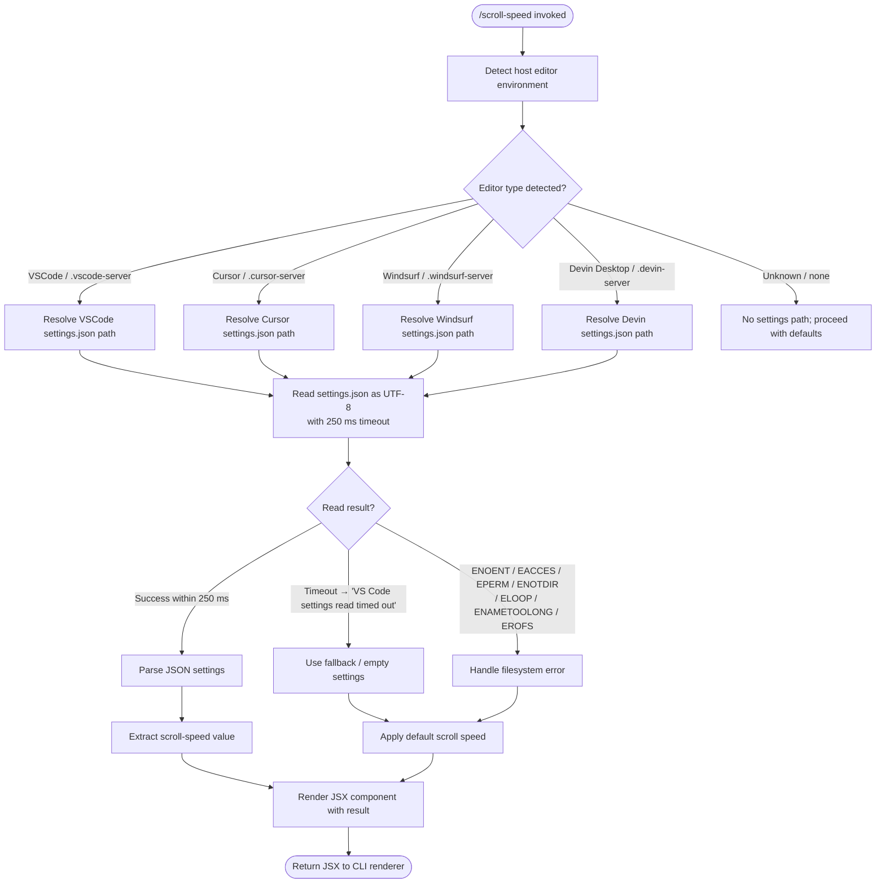

# `/scroll-speed`

> Analysis basis: CC v2.1.193 bundle.js (AST extraction + Claude interpretation)
> Minimum version: v2.1.193

---

## Overview

`/scroll-speed` is a local-JSX command that adjusts the mouse wheel scroll speed within the Claude Code terminal UI. It reads the host editor's `settings.json` file (supporting VSCode, Cursor, Windsurf, and Devin Desktop environments) and applies the retrieved scroll configuration, rendering its result as a JSX component. The handler is the async function `CRf` (module `K2l`), resolved via module-id path.

---

## Registration

| Field | Value |
|---|---|
| type | `local-jsx` |
| name | `scroll-speed` |
| description | `Adjust mouse wheel scroll speed` |
| module_id | `K2l` |
| load_inline | `true` |
| loc_byte | `12499183` |
| loc_byte_end | `12499430` |
| loc_line | `8389` |
| arbor_handler.name | `CRf` |
| arbor_handler.fqn | `claude-2.1.193::CRf` |
| arbor_handler.kind | `AsyncFunction` |
| arbor_handler.resolution_path | `module_id` |
| arbor_handler.n_hits | `0` |

Analysis basis: CC v2.1.193 bundle.js:+12499183

---

## Input Branching

The handler has 3+ distinct behavioral paths (timeout/success/error on settings read, plus editor-type detection), so a Mermaid flowchart is used.



Analysis basis: CC v2.1.193 bundle.js:+12498956, +12498959, +12498965, +12498969, +4145561, +4141432

---

## Behavioral Spec

### 1. Main Handler Entry (`CRf`)

The top-level handler is an `AsyncFunction` that orchestrates two primary sub-calls before producing a JSX render.

```
async function handleScrollSpeed(context):
    settingsData = await readEditorSettingsWithTimeout(timeout=250)
    // "VS Code settings read timed out" used on timeout
    parsedConfig  = await resolveScrollConfig(settingsData)
    return renderJSX(parsedConfig)
```

Analysis basis: CC v2.1.193 bundle.js:+12498956 (call to `Yc`), +12498959 (call to `qKr`), +12499027 (JSX render)

---

### 2. Timed Settings Read (`Yc`)

A utility that wraps an async file-read in a `Promise.race` against a `setTimeout` deadline, then cleans up via `clearTimeout`.

```
async function timedRead(readPromise, timeoutMs):
    timer = null
    timeoutPromise = new Promise((_, reject) =>
        timer = setTimeout(() => reject(new Error("VS Code settings read timed out")), timeoutMs)
    )
    try:
        result = await Promise.race([readPromise, timeoutPromise])
        return result
    finally:
        clearTimeout(timer)   // timeout value 0 used as sentinel on cancel
```

- Timeout constant: **250 ms** (bundle.js:+12498965)
- Timeout error message: `"VS Code settings read timed out"` (bundle.js:+12498969)
- Uses `Promise.race` (bundle.js:+2353429), `setTimeout` (bundle.js:+2353398), `clearTimeout` (bundle.js:+2353476)

Analysis basis: CC v2.1.193 bundle.js:+2353398, +2353429, +2353476

---

### 3. Editor Detection & Settings Resolution (`qKr`)

Identifies which host editor is running by inspecting environment path markers, then reads `settings.json` using the matched editor's config directory.

```
async function resolveScrollConfig(env):
    editorKind = detectEditorKind(env)    // uses y1d + Txn
    settingsPath = buildSettingsPath(editorKind)   // joins path + "settings.json"

    rawText = await fileSystem.readFile(settingsPath, encoding="utf-8")
    parsed  = parseJSON(rawText)          // uses Cxn

    scrollValue = extractScrollSetting(parsed)    // uses bLt
    arrayCheck  = normalizeArrayResult(scrollValue)  // uses VKr (Array.isArray)
    formatted   = formatOutput(arrayCheck)        // uses Vo
    errorPipe   = wrapError(formatted)            // uses xe

    return errorPipe
```

- Settings file name constant: `"settings.json"` (bundle.js:+4145641)
- File encoding: `"utf-8"` (bundle.js:+4145668)
- Path join via `Z$.join` (bundle.js:+4145620)
- File read via `zv.readFile` (bundle.js:+4145608)

Analysis basis: CC v2.1.193 bundle.js:+4145561, +4145574, +4145608, +4145620, +4145634, +4145641, +4145668, +4145680, +4145689, +4145795, +4145801

---

### 4. Editor Kind Detection (`Txn`)

Inspects environment path strings for well-known server directory suffixes to classify the host editor.

```
function detectEditorKind(envPaths):
    if envPaths.includes(".vscode-server"):
        return "VSCode"          // display name "VSCode"
    if envPaths.includes(".cursor-server"):
        return "Cursor"
    if envPaths.includes(".windsurf-server"):
        return "windsurf" → display "Devin Desktop" branch also checked
    if envPaths.includes(".devin-server"):
        return "Devin Desktop"
    return UNKNOWN
```

Recognized server path markers and their display names (bundle.js:+4141432–+4141553, +4145897–+4145970):

| Path marker | Display name |
|---|---|
| `.vscode-server` | `VSCode` |
| `.cursor-server` | `Cursor` |
| `.windsurf-server` | `windsurf` → `Devin Desktop` |
| `.devin-server` | `Devin Desktop` |

Analysis basis: CC v2.1.193 bundle.js:+4141432, +4141443, +4141473, +4141503, +4141535, +4145897, +4145912, +4145925, +4145940, +4145953, +4145970

---

### 5. Scroll Value Extraction (`bLt`)

Extracts the scroll-speed setting value from the parsed JSON object, normalizing string prefixes where needed.

```
function extractScrollSetting(parsedJson):
    raw = lookupKey(parsedJson)           // mcn: map/key lookup
    normalized = normalizePrefixedValue(raw)   // R4: startsWith + slice
    rendered = renderToString(normalized)      // T: format pipeline
    return rendered
```

- `R4` uses `startsWith` (bundle.js:+1192233) and `slice` (bundle.js:+1192256) to strip prefixes from raw values.
- Result coerced to `String` (bundle.js:+1192929).
- On error: severity logged as `"error"` (bundle.js:+1192948).

Analysis basis: CC v2.1.193 bundle.js:+1192845, +1192849, +1192872, +1192929, +1192948

---

### 6. Output Formatting Pipeline (`T`)

Converts the extracted scalar into a display-ready string, applying redaction, casing, and trimming.

```
function formatScrollValue(value):
    if isDebugMode():                         // checks for "debug" flag
        applyDebugTransform(value)
    if value.includes(sensitivePattern):
        value = "[REDACTED]"                  // literal at bundle.js:+207028
    value = value.toUpperCase()              // bundle.js:+215713
    value = pathFormatter(value)             // Lc: replace, at, lastIndexOf, slice
    value = value.trim()                     // bundle.js:+215736
    return value
```

- Debug mode string: `"debug"` (bundle.js:+215587)
- Redaction sentinel: `"[REDACTED]"` (bundle.js:+207028)
- Sub-limits within file content handler: 1000 and 100 (bundle.js:+215418, +215437)

Analysis basis: CC v2.1.193 bundle.js:+215587, +215611, +215629, +215651, +215669, +215713, +215733, +215736, +215752, +215758, +215772

---

### 7. Error Handling & Telemetry Pipe (`xe`)

Wraps the resolved value in a structured error-tolerant pipeline. Filesystem errors are classified by POSIX error code.

```
function wrapWithErrorHandling(result):
    try:
        normalized = coerceToString(result)    // eo: Error + String coercion
        buffered   = bufferOutput(normalized)  // at: String conversion
        piped      = applyOutputPipe(buffered) // Bi → Rds → at
        logged     = rotateLog(piped)          // e_u: shift/push on log ring
        pushed     = appendToResults(logged)   // rJe.push
        return pushed
    catch err:
        kZ.logError(err)                       // bundle.js:+1057614

known_fs_errors = [
    "ENOENT", "EACCES", "EPERM",
    "ENOTDIR", "ELOOP", "ENAMETOOLONG", "EROFS"
]
// Vo/an handles ENOENT → graceful empty result
```

Known filesystem error codes handled (bundle.js:+184517–+184606):
`ENOENT`, `EACCES`, `EPERM`, `ENOTDIR`, `ELOOP`, `ENAMETOOLONG`, `EROFS`

Telemetry pipe modes found in literals (bundle.js:+1055895, +1055954, +1056028):
`"essential-traffic"`, `"no-telemetry"`, `"default"`

Analysis basis: CC v2.1.193 bundle.js:+1057214, +1057227, +1057473, +1057556, +1057574, +1057614, +184517, +184531, +184545, +184558, +184573, +184586, +184606

---

### 8. JSX Render (`z2l.jsx`)

The final step renders the resolved scroll-speed configuration as a JSX element returned to the CLI display layer.

```
function renderResult(config):
    return z2l.jsx(ScrollSpeedComponent, { value: config })
```

Analysis basis: CC v2.1.193 bundle.js:+12499027

---

## State & Side Effects

| Item | Detail |
|---|---|
| Telemetry | None detected in depth-2 traversal (`telemetry: []`) |
| File I/O | Reads `settings.json` from host editor config directory (UTF-8, 250 ms timeout) |
| Timer | Sets and clears a `setTimeout` (250 ms) on every invocation |
| Log ring buffer | `e_u` rotates a fixed-size output log (shift/push pattern) at bundle.js:+1056894, +1056906 |
| Error log | `kZ.logError` called on unhandled errors (bundle.js:+1057614) |
| appState changes | <!-- TODO: not found in depth-2 traversal; needs --depth 4 --> |
| Sound | None detected |
| Hook registration | None detected |

---

## Version History

| Version | Change |
|---|---|
| v2.1.193 | Initial analysis |

---

## Common Mistakes

1. **Assuming the command writes settings** — `/scroll-speed` only *reads* the host editor's `settings.json`; it does not persist any changes to disk.
2. **Expecting instant results in slow environments** — the file read is hard-capped at **250 ms**; in high-latency or remote-filesystem setups the command will time out and fall back to defaults with the message `"VS Code settings read timed out"`.
3. **Running outside a recognized editor** — if none of the four known server path markers (`.vscode-server`, `.cursor-server`, `.windsurf-server`, `.devin-server`) is found in the environment, editor detection returns unknown and no settings path is resolved.
4. **Conflating `windsurf` and `Devin Desktop`** — the `.windsurf-server` path marker maps to the Windsurf editor, while `Devin Desktop` has its own `.devin-server` marker; the display labels differ from the detection strings.
5. **Expecting telemetry events** — this command emits no `tengu_*` telemetry events at depth-2 traversal depth; do not rely on telemetry for audit logging of scroll-speed changes.

---

## Appendix — Identifier Mapping

> For bundle debugging only. Identifiers change across versions.

| Identifier | Role |
|---|---|
| `CRf` | Main async handler for `/scroll-speed` (entry point, `AsyncFunction`) |
| `Yc` | Timed promise race utility (wraps file read with `setTimeout` / `Promise.race` / `clearTimeout`) |
| `qKr` | Editor settings resolver (detects editor kind, reads `settings.json`, extracts scroll value) |
| `y1d` | Environment/path accessor called during editor detection setup |
| `Txn` | Editor kind detector (checks path strings for `.vscode-server`, `.cursor-server`, etc.) |
| `e` | Inner anonymous function using `Math.random` and `setTimeout` (likely jitter/retry helper) |
| `t` | Secondary path-check function (`t.includes` for editor server markers) |
| `bLt` | Scroll setting extractor from parsed JSON (calls `mcn`, `R4`, `T`) |
| `R4` | Prefix normalizer (`startsWith` + `slice` to strip value prefixes) |
| `T` | Output format pipeline (debug flag, redaction, `toUpperCase`, trim) |
| `qFc` | Sub-formatter called within `T` (uses `YO`, `Qgr`, `c7o`) |
| `ke` | JSON serialization helper (`JSON.stringify`) |
| `Lc` | Path/string formatter (`replace`, `at`, `lastIndexOf`, `slice`) |
| `iYe` | Auxiliary formatter calling `OXo` |
| `XFc` | Extended content handler (byte-length checks, 1000/100 limits, buffer operations) |
| `VKr` | Array normalization check (`Array.isArray`) |
| `Vo` | ENOENT-graceful output wrapper (calls `an`) |
| `an` | Low-level no-entry handler |
| `xe` | Error-tolerant output pipeline (coerce, buffer, pipe, log-rotate, push) |
| `eo` | Error/string coercion helper (`Error` + `String`) |
| `at` | String conversion utility (also handles `"yes"` / `"on"` boolean-like strings) |
| `Bi` | Buffered output stage (calls `Rds`) |
| `Rds` | Output record formatter (calls `at`) |
| `e_u` | Log ring-buffer rotator (`fln.shift` / `fln.push`) |

---

Note: index built via Arbor fallback; some signals (telemetry, literals) may be missing — see arbor-fallback.js.