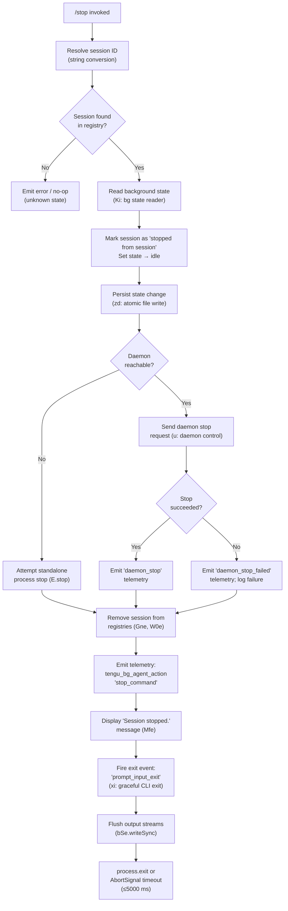

# `/stop`

> Analysis basis: CC v2.1.195 bundle.js (AST extraction + Claude interpretation)
> Minimum version: v2.1.195

---

## Overview

The `/stop` command terminates the current background session while deliberately preserving both the conversation transcript and the associated worktree on disk. It coordinates with the background daemon to gracefully shut down active session processes, updates session state to `"stopped"`, and emits a confirmation message before exiting the interactive prompt.

---

## Registration

| Field | Value |
|---|---|
| type | `local-jsx` |
| name | `stop` |
| description | `Stop this background session; transcript and worktree are kept` |
| immediate | `true` |
| module_id | `xoc` |
| load_inline | `true` |
| loc_byte | `13436740` |
| loc_byte_end | `13436924` |
| loc_line | `9333` |
| arbor_handler.name | `NQf` |
| arbor_handler.fqn | `claude-2.1.195::NQf` |
| arbor_handler.kind | `AsyncFunction` |
| arbor_handler.resolution_path | `module_id` |
| arbor_handler.n_hits | `0` |

Analysis basis: CC v2.1.195 bundle.js:+13436740

---

## Input Branching

The `/stop` command involves 3+ distinct execution paths: success path, session-stop-failure path, and daemon-stop-failure path. A Mermaid flowchart is used.



---

## Behavioral Spec

### 1. Handler Entry — Async Stop Handler (`NQf`)

The primary handler is the async function `NQf`, resolved via `module_id` → `xoc`.

```
async function stopCommandHandler(sessionArg):
    sessionId = toString(sessionArg)          // string coercion (e → t.replace)
    telemetry("stop_command")                 // literal: "stop_command" @ +13436473
    await runStopSequence(sessionId)          // elr
```

Analysis basis: CC v2.1.195 bundle.js:+13436459, +13436469, +13436473

---

### 2. Session Stop Sequence (`elr`)

The core orchestration function that coordinates all sub-steps.

```
async function runStopSequence(sessionId):
    // Validate session type
    validateSessionType(sessionId)            // W, je → OJe check
    if sessionType == "nonconforming":        // literal @ +2321794
        log warning and return

    // Determine session kind: "bg", "daemon", "daemon-worker"
    // literals @ +2328115, +2328125, +2328139
    sessionKind = resolveSessionKind(sessionId)   // Xs → tLe

    // Read current background state
    bgState = await readBackgroundState(sessionId) // Ki
    bgState.set("stopped from session")       // literal @ +13436068
    bgState.stateOrder = "idle"               // literals @ +4311265, +4311286, +13436097

    // Persist state atomically
    await persistStateAtomic(bgState)         // zd → eg (randomBytes + writeFile + rename)

    // Stop the background session runner
    await stopSessionRunner(bgState)          // UAn (inline)

    // Display confirmation message
    displayMessage("Session stopped.")        // Mfe; literal @ +13436241

    // Emit exit telemetry and fire exit hook
    emitEvent("Le", "job_stop_self")          // literal @ +13436272; telemetry via Le
    triggerExitSequence("prompt_input_exit")  // xi; literal @ +13436294
```

Analysis basis: CC v2.1.195 bundle.js:+13435864, +13435898, +13435916, +13435935, +13436009, +13436034, +13436068, +13436097, +13436210, +13436237, +13436269, +13436289

---

### 3. Background State Reader (`Ki`)

Reads and validates the persisted background session state file.

```
async function readBackgroundState(sessionId):
    filePath = path.join(stateDir, sessionId)  // oE.join @ +4311238
    stats = await Promise.all([fs.lstat(filePath)])  // gT.lstat @ +4311338

    if not stats.isFile():                     // +4311412
        log("not a regular file", "warn")      // literals @ +4311618, +4311648
        return null

    // Check transient state cache (Gne map)
    cached = Gne.get(filePath)                 // +4311479
    if not cached:
        raw = await fs.readFile(filePath, "utf-8")  // +4312262, literal @ +4312276
        parsed = parseJSON(raw)                // Bt → JSON.parse @ +193860

    // Validate numeric fields with Number(), Number.isFinite()
    // Process entries via Object.entries, Object.hasOwn, Object.fromEntries
    // Update cache: Gne.set, Gne.delete, Gne.clear
    // Emit telemetry on transient state read
    emitTelemetry("tengu_bg_state_read_transient")  // @ +4312062

    return stateObject
```

Analysis basis: CC v2.1.195 bundle.js:+4311238, +4311338, +4311479, +4311657, +4311866, +4312062, +4312262

---

### 4. Atomic State Persistence (`zd`)

Writes state changes to disk using a rename-based atomic write pattern.

```
async function persistStateAtomic(stateObject):
    tmpPath = path.join(stateDir, randomBytes(4).toString("hex"))
    // literals: 4 bytes @ +1062933, "hex" @ +1062945
    serialized = serialize(stateObject, 384)   // literal 384 @ +4310840
    await fs.writeFile(tmpPath, serialized, "utf8")  // +1062964
    await fs.rename(tmpPath, finalPath)        // +1063017
    // Handle permissions: fs.chmod if needed  // +1063127
    // On ENOENT: fs.copyFile fallback         // literals @ +1063093
    Gne.delete(finalPath)                      // sE → Gne.delete @ +4311197
```

Analysis basis: CC v2.1.195 bundle.js:+4310809, +4310812, +4310827, +4310840, +1062917, +1062964, +1063017

---

### 5. Result State Transitions (`qh` / `F0`)

After the stop sequence completes, the session transitions through a defined state machine:

```
finalState = resolveResultState(outcome):
    // Possible outcome literals observed:
    //   "done"     @ +4319963
    //   "success"  @ +4319976
    //   "failure"  @ +4320008
    //   "stopped"  @ +4320025
    //   "active"   @ +4320144
    //   "unknown"  @ +4312108

    if outcome == "stopped":
        emitBgAgentAction("tengu_bg_agent_action", "stop_command")
    else if outcome == "failure":
        recordFailure(rue)                     // rue @ +4320085 (via F0)
    return finalState
```

Analysis basis: CC v2.1.195 bundle.js:+4319963, +4319976, +4320008, +4320025, +4320085, +4320121, +4320144

---

### 6. Daemon Stop Coordination (`u` / `Le` / `ke` / `yj`)

When a daemon process manages the session, the stop command communicates with it.

```
async function stopViaDaemon(sessionId):
    // Attempt graceful daemon stop
    result = await sendDaemonStop(sessionId)   // Le; telemetry "daemon_stop" @ +17924519

    if result.ok:
        emitTelemetry("tengu_daemon_control")  // @ +17924594
        emitTelemetry("tengu_feature_ok")      // @ +1027363
    else:
        emitTelemetry("tengu_feature_bad")     // @ +1027430
        logFailure("daemon_stop_failed")       // literal @ +17924556

    // yj: race between stop completion and 500ms timeout
    // literal 500 @ +17919653
    await Promise.race([
        stopCompletion,
        timeout(500)
    ])
    // On timeout: process.exit  @ +17919692
```

Analysis basis: CC v2.1.195 bundle.js:+17924516, +17924519, +17924539, +17924556, +17924594, +1027363, +1027430, +17919609, +17919623, +17919653, +17919692

---

### 7. CLI Exit Sequence (`xi`)

Performs the graceful terminal teardown after the session is stopped.

```
async function gracefulExit():
    // Render final output frame
    renderFinalFrame(cje)                      // cje: unmount Ink UI, writeSync

    // Print summary header
    printScrollSummary(H9n)                    // emits tengu_scroll_summary @ +7398886

    // Flush terminal output
    drainOutput(yXe)                           // yXe → krs.drain @ +68096

    // Wait up to 5000ms for all I/O to complete
    // literals: 5000 @ +7399470, 3500 @ +7399477, 2000 @ +7399655
    await Promise.race([
        Promise.all([allSettled(CNa)]),
        AbortSignal.timeout(5000)              // +7399755
    ])

    // Clear any pending timers
    clearTimeout(pendingTimer)                 // _ho → clearTimeout @ +7396957

    // On forced exit:
    //   process.kill(pid, "SIGKILL")          // literal @ +7397088
    //   or process.exit()                     // @ +7397038

    bSe.writeSync(finalBytes)                  // terminal sync write @ +7399941
    emitTelemetry("tengu_cache_eviction_hint") // @ +7399829
    emitTelemetry("tengu_scroll_summary")      // @ +7398886
```

Analysis basis: CC v2.1.195 bundle.js:+7399373, +7399424, +7399441, +7399453, +7399461, +7399470, +7399477, +7399486, +7399566, +7399590, +7399655, +7399715, +7399755, +7399804, +7399816, +7399827, +7399941

---

### 8. Session Runner Stop (`d` / `E.stop` / `A.stop`)

The supervisor process managing the background agent is halted and cleaned up.

```
async function stopSessionRunner(bgState):
    runner = sessionRegistry.get(bgState.id)  // i.get @ +17901783
    if runner:
        await runner.stop()                    // E.stop @ +17901803
        // E internally: kIt, cD, uD, Promise.all, yX, w9, xe, Zr
        sessionRegistry.delete(bgState.id)     // i.delete @ +17901812

    agent = agentRegistry.get(bgState.id)
    if agent:
        await agent.stop()                     // A.stop @ +17901923
        await agent.updateConfig(...)          // A.updateConfig @ +17901932
        await agent.start(...)                 // A.start @ +17901950 (restart if needed)

    // Heartbeat/daemon config reload
    await reloadDaemonConfig(EWc)             // EWc → dce; emits tengu_daemon_config_reload
    emitTelemetry("tengu_daemon_config_reload")  // @ +17902328

    sessionRegistry.set(bgState.id, newState) // i.set @ +17902097
    displayRunner.start(I)                    // I.start @ +17902108
    emitTelemetry("tengu_bg_agent_action")    // @ +13435866
```

Analysis basis: CC v2.1.195 bundle.js:+17901535, +17901729, +17901783, +17901803, +17901812, +17901923, +17901932, +17901950, +17902052, +17902097, +17902108, +17902326, +17902328

---

## State & Side Effects

| Item | Detail |
|---|---|
| Telemetry: `tengu_bg_agent_action` | Fired at session stop initiation and on runner stop; includes action `"stop_command"` (literal @ +13436473) and `"stopped"` outcome |
| Telemetry: `tengu_daemon_config_reload` | Fired after the daemon configuration is reloaded post-stop (@ +17902328) |
| Telemetry: `tengu_feature_ok` | Fired when daemon stop RPC succeeds (@ +1027363) |
| Telemetry: `tengu_feature_bad` | Fired when daemon stop RPC fails (@ +1027430) |
| Telemetry: `tengu_daemon_control` | Fired during daemon stop coordination (@ +17924594) |
| Telemetry: `tengu_bg_state_read_transient` | Fired when background state is read from transient cache (@ +4312062) |
| Telemetry: `tengu_startup_perf` | Emitted as part of exit profiling via `eLt`/`Nis` path (@ +227721) |
| Telemetry: `tengu_scroll_summary` | Emitted during CLI exit scroll summary rendering (@ +7398886) |
| Telemetry: `tengu_pewter_brook` | Fired during terminal mode detection (fullscreen/tmux/SSH) via `Us` (@ +3563948) |
| Telemetry: `tengu_cache_eviction_hint` | Fired during graceful exit flush (@ +7399829) |
| Session state mutation | Session state transitions through `"stopped from session"` → `"idle"` → final `"stopped"` (literals @ +13436068, +13436097, +4320025) |
| Transcript preservation | The command explicitly preserves transcript on disk; no deletion of conversation history |
| Worktree preservation | The worktree is not removed; the description confirms "transcript and worktree are kept" |
| File system: atomic state write | Uses `randomBytes(4)` temp file + `fs.rename` for atomic state update (@ +1062917, +1063017) |
| File system: state cache | `Gne` map is updated (set/delete/clear) after state persistence (@ +4311657, +4311866, +4312949) |
| Session registries cleared | `Gne.delete`, `W0e.delete`, `W0e.has`, `W0e.add` operations clean up session tracking maps (@ +4311866, +4311880, +4312038, +4312049) |
| Process management | On timeout: `process.kill(pid, "SIGKILL")` or `process.exit()` (@ +7397063, +7397038); SIGKILL literal @ +7397088 |
| Terminal output | `bSe.writeSync` flushes final bytes; Ink UI is unmounted via `e.unmount` (@ +7396451); ANSI escape sequences `\x1b7`/`\x1b8` used for cursor save/restore (@ +3909525, +3909536) |
| Exit event | `"prompt_input_exit"` event fired (literal @ +13436294) before process termination |
| Session end event | `"session_end"` event emitted via `xi` path (literal @ +7399867) |
| `immediate: true` | The command executes without waiting for user confirmation input |

---

## Version History

| Version | Change |
|---|---|
| v2.1.195 | Initial analysis |

---

## Common Mistakes

1. **Expecting session/worktree deletion**: `/stop` does not delete the transcript or worktree. Users expecting full cleanup must perform that separately. The command is explicitly a "soft stop."
2. **Confusing `/stop` with process kill**: The command initiates a graceful shutdown sequence with a 5000 ms timeout before escalating to SIGKILL. Invoking it does not guarantee immediate process termination.
3. **Using `/stop` in non-background sessions**: The command validates the session type; calling it in a non-background ("nonconforming") session results in a no-op or warning, not an error.
4. **Assuming immediate daemon teardown**: When a daemon manages the session, a 500 ms race timeout applies; the daemon may not fully stop within a single `/stop` invocation if it is under load.
5. **Expecting state cleanup after stop**: Registry entries (`Gne`, `W0e`) are cleared, but the file-system state file (with status `"stopped"`) is retained for later inspection.

---

## Appendix — Identifier Mapping

> For bundle debugging only. Identifiers change across versions.

| Identifier | Role |
|---|---|
| `NQf` | Primary async stop command handler (main entry point) |
| `elr` | Session stop orchestration function (coordinates all sub-steps) |
| `Ki` | Background session state file reader / cache manager |
| `zd` | Atomic state persistence writer (rename-based) |
| `eg` | Low-level atomic file write helper (randomBytes + writeFile + rename + chmod) |
| `sE` | State cache invalidation helper (Gne.delete) |
| `qh` | Result state resolver (routes done/success/failure/stopped outcomes) |
| `F0` | Failure recorder for stop outcomes |
| `rue` | Failure state handler (called on "failure" outcome) |
| `u` | Daemon stop coordinator (Le + ke + SF + yj) |
| `Le` | Daemon stop sender — success path (emits `daemon_stop`) |
| `ke` | Daemon stop sender — failure path (emits `daemon_stop_failed`) |
| `SF` | Daemon control telemetry emitter (`tengu_daemon_control`, `firstParty`) |
| `yj` | Race-with-timeout wrapper for daemon stop (500 ms; process.exit on timeout) |
| `xi` | Graceful CLI exit sequence coordinator |
| `cje` | Ink UI unmount + terminal flush handler |
| `vN` | Terminal output helper (called after unmount) |
| `wkn` | Low-level terminal write helper (ANSI escape sequences \x1b7/\x1b8) |
| `Hho` | Scroll summary printer (replaceAll, bSe.writeSync, Ct.dim) |
| `_ho` | Forced exit handler (clearTimeout, process.exit, process.kill SIGKILL) |
| `yXe` | Output drain helper (krs.drain) |
| `CNa` | Pending-promise settler (Promise.allSettled + Array.from) |
| `eLt` | Startup profiling exit reporter |
| `yAr` | Profiling report writer (Gis, W) |
| `Nis` | Profiling data serializer (JSON.stringify, path.dirname, qt) |
| `H9n` | Scroll summary composer (TL, fNa, W, pNa, Us) |
| `pNa` | Token/timing calculator (Date.now, Math.max, Math.round, Object.assign) |
| `Us` | Terminal mode detector (fullscreen/tmux/SSH/ConPTY; `tengu_pewter_brook`) |
| `svt` | Session-end event helper |
| `dje` | Deferred resolution helper (Promise.resolve + f9n) |
| `d` | Session runner manager (stop/delete/updateConfig/start/registry) |
| `E` | Session runner stop logic (kIt, cD, uD, Promise.all, yX, w9, xe, Zr) |
| `A` | Agent stop/restart logic (nhr, thr, H.userinfo, Error) |
| `EWc` | Daemon config reload helper (→ dce; emits `tengu_daemon_config_reload`) |
| `I` | Display runner start helper (Math.max, Math.floor, M.preventDefault) |
| `Xs` | Session kind resolver (→ tLe; resolves "bg"/"daemon"/"daemon-worker") |
| `Rt` | App state accessor helper (→ u0) |
| `OQf` | Additional session validation helper |
| `UAn` | Session runner stopper (inline helper within elr) |
| `Mfe` | "Session stopped." message display helper |
| `W` | Generic notification/log emitter |
| `je` | Session type checker (→ OJe) |
| `Oe` | Secondary session validator (→ OJe) |
| `br` | Session type branch handler ("nonconforming" check; → xh, je) |
| `xh` | Session nonconforming validator (→ OJe) |
| `Cn` | Cleanup notification emitter (→ on) |
| `Ld` | Log entry writer (→ on) |
| `Bt` | JSON parse wrapper (→ JSON.parse) |
| `nzi` | Numeric field normalizer (within Ki) |
| `T` | File content formatter / HTTP request builder (complex shared utility) |
| `RYc` | File read sub-helper (→ w1, eAr, Drs) |
| `Me` | JSON serializer wrapper (→ JSON.stringify) |
| `Lc` | Path/string sanitizer (→ _is, e.replace, r.at, n.lastIndexOf, n.slice) |
| `jXe` | Auxiliary string helper (→ ais) |
| `PYc` | File upload/buffer helper (→ Buffer.byteLength, Win.then, DYc.bind, vi) |
| `C7e` | File stat + read helper (→ jtc.stat, on, Promise.reject, Vs, y5o, ye, wa, _5o) |
| `Vtc` | State order calculator (→ Object.keys, Math.max, k_) |
| `i` | Session registry map (n.close, r.close, s) |
| `o` | Output formatter (s.map, i.padEnd) |
| `s` | Promise tracking set (r.add, i.finally, r.delete) |
| `r` | Write stream wrapper (→ Cs) |
| `f9n` | Deferred resolution value holder |
| `fNa` | Summary field formatter (within H9n) |
| `on` | Generic logger / event emitter |
| `x6t` | Worktree stat helper (UB, Xh, Hr, Ih.join, qt, r.statSync) |
| `Wg` | Working directory resolver (→ Rt, zc) |
| `mNa` | Output escaper (backslash/quote replacement) |

---

Note: index built via Arbor fallback; some signals (telemetry, literals) may be missing — see arbor-fallback.js.