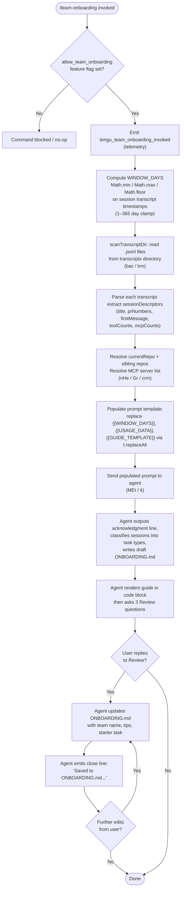

# `/team-onboarding`

> Analysis basis: CC v2.1.196 bundle.js (AST extraction + Claude interpretation)
> Minimum version: v2.1.196

---

## Overview

`/team-onboarding` is a `prompt`-type slash command that scans the invoking user's local Claude Code session transcripts to derive usage statistics, then co-authors a Markdown onboarding guide (`ONBOARDING.md`) tailored for teammates new to Claude Code. The command collects data about recent sessions (up to a configurable day window), classifies work into task-type categories, and engages the user in an iterative review conversation before finalising the document.

---

## Registration

| Field | Value |
|---|---|
| type | `prompt` |
| name | `team-onboarding` |
| description | `Help teammates ramp on Claude Code with a guide from your usage` |
| isHidden | `false` |
| handler_method | `getPromptForCommand` |
| handler_method_start (loc_byte) | `13410208` |
| handler_method_end (loc_byte) | `13410918` |
| loc_byte | `13409845` |
| loc_byte_end | `13410919` |
| loc_line | `9325` |
| prompt_body.length | `4539` characters |
| prompt_body.trace | `identifier→l (local→1 ext vars)` |
| arbor_handler.name | `getPromptForCommand` |
| arbor_handler.kind | `Method` |
| arbor_handler.resolution_path | `direct` |
| arbor_handler.fqn | `claude-2.1.196::getPromptForCommand` |
| arbor_handler.n_hits | `2` |
| `handler_method_start` | `13410208` |
| `handler_method_end` | `13410918` |

Analysis basis: CC v2.1.196 bundle.js:+13409845

---

## Input Branching

The handler has more than three distinct logical branches: feature-gating check, transcript scan, template population, guide rendering, and iterative review loop. A Mermaid flowchart is used below.



Analysis basis: CC v2.1.196 bundle.js:+13410208 – +13410918

---

## Behavioral Spec

### 1. Feature-Gate Check

Before any data collection, the handler verifies that the `allow_team_onboarding` flag is enabled for the current user/account context.

```
function checkFeatureGate(appState):
    flags = getFeatureFlags(appState)       # Gs / MEt path
    if not flags.has("allow_team_onboarding"):
        return blocked
    return allowed
```

Analysis basis: CC v2.1.196 bundle.js:+10512693 (literal `"allow_team_onboarding"`) and +10512752 (call to `it` via `MEt`).

---

### 2. Window-Days Computation

The handler derives the look-back window in days from the available transcript data, clamping between 1 and 365.

```
function computeWindowDays(transcriptTimestamps, nowMs):
    rawDays = (nowMs - earliestTimestamp) / MS_PER_DAY
    clamped = Math.min(365, Math.max(1, Math.floor(rawDays)))
    return clamped
```

Constants:
- Minimum window: `1` day (bundle.js:+13410454)
- Maximum window: `365` days (bundle.js:+13410457)

Analysis basis: CC v2.1.196 bundle.js:+13410411 (`Math.min`), +13410420 (`Math.max`), +13410429 (`Math.floor`), +13410557 (`Date.now`).

---

### 3. Transcript Scanning (`scanTranscriptDir`)

The handler reads the user's local transcript directory, filters for `.jsonl` files, and parses each to extract session-level descriptors.

```
function scanTranscriptDir(transcriptDirPath):
    startMs = Date.now()
    entries = fs.readdir(transcriptDirPath)                  # async
    jsonlFiles = entries.filter(e => extname(e) == ".jsonl")
    results = await Promise.all(jsonlFiles.map(async file =>
        filePath = path.join(transcriptDirPath, file)
        stat     = await fs.stat(filePath)
        if not stat.isFile(): return null
        raw = await fs.readFile(filePath, encoding)
        lines = raw.split("\n")
        descriptor = parseSessionDescriptor(lines)
        return descriptor
    ))
    return results.filter(Boolean)
```

Key constants:
- File extension filter: `".jsonl"` (bundle.js:+13398890)
- Look-ahead parse limit: first `10` lines checked for session title (bundle.js:+13399286)
- MCP tool-use detection pattern: `"\"name\":\"mcp__"` prefix (bundle.js:+13399469)
- Content array pattern: `"\"content\":["` (bundle.js:+13399819)
- Maximum PR numbers extracted per session: `3` (bundle.js:+13399922)

Analysis basis: CC v2.1.196 bundle.js:+13398762 (`bac` / `scanTranscriptDir`), +13398803 (`RTt.readdir`), +13398873 (`mcr.extname`), +13398909 (`Promise.all`).

---

### 4. MCP Configuration Reading (`readMcpConfig`)

The handler reads `.mcp.json` from the project root (or workspace) to populate the MCP server list for the guide.

```
function readMcpConfig(projectRoot):
    configPath = path.join(projectRoot, ".mcp.json")
    raw = await fs.readFile(configPath, "utf8")           # lrm
    parsed = JSON.parse(raw)                               # Gt
    servers = parsed["mcpServers"] ?? {}
    return servers
```

Key constants:
- Config filename: `".mcp.json"` (bundle.js:+13400920)
- Encoding: `"utf8"` (bundle.js:+13400933)
- JSON key: `"mcpServers"` (bundle.js:+13400976)

Analysis basis: CC v2.1.196 bundle.js:+13400896 (`lrm` / `Iac.readFile`), +13400943 (`Gt` / `JSON.parse`).

---

### 5. Git Context Resolution (`resolveGitContext`)

The handler resolves the current repository name and the git user's display name by running `git` subcommands.

```
function resolveGitContext(cwd):
    userName   = execGit(["config", "user.name"], cwd)   # Gr
    remoteUrl  = execGit(["remote", "get-url", "origin"], cwd)
    repoName   = basename(remoteUrl)                      # nHe / gcr.basename
    return { userName, repoName }
```

Key constants:
- git subcommand for name: `"config"`, `"user.name"` (bundle.js:+13401550, +13401559)
- git subcommand for remote: `"remote"`, `"get-url"` (bundle.js:+13401615, +13401624)

Analysis basis: CC v2.1.196 bundle.js:+13401540 (`Gr`), +13401731 (`gcr.basename`), +13401723 (`nHe`).

---

### 6. Prompt Template Population

After data collection, the handler substitutes three placeholders in the prompt body using `String.replaceAll`.

```
function buildPrompt(templateText, windowDays, usageData, guideTemplate):
    out = templateText.replaceAll("{{WINDOW_DAYS}}", String(windowDays))
    out = out.replaceAll("{{USAGE_DATA}}", JSON.stringify(usageData))
    out = out.replaceAll("{{GUIDE_TEMPLATE}}", guideTemplate)
    return out
```

Placeholder literals (bundle.js):
- `"{{WINDOW_DAYS}}"` at +13410668
- `"{{GUIDE_TEMPLATE}}"` at +13410708
- `"{{USAGE_DATA}}"` at +13410743

Analysis basis: CC v2.1.196 bundle.js:+13410655 (`t.replaceAll`), +13410686 (`String`).

---

### 7. Agent Prompt Delivery and Conversation Protocol

The populated prompt is delivered to the agent via the standard `getPromptForCommand` / `it` call path. The agent then executes a fixed five-step protocol:

```
AgentProtocol:
  STEP 1 — Emit acknowledgment line immediately (no tool calls before this).
  STEP 2 — Classify sessions from sessionDescriptors into task types:
              build_feature | debug_fix | improve_quality | analyze_data |
              plan_design | prototype | write_docs
            Select top 3–5 with rough percentages.
  STEP 3 — Gather repo list and MCP server descriptions.
            Leave "Team Tips" and "Get Started" as TODO placeholders.
  STEP 4 — Write draft guide to ONBOARDING.md using ASCII bar charts
            (█ filled, ░ empty, 20 chars wide).
  STEP 5 — Render guide in fenced code block, then emit Review section
            with exactly 3 numbered questions.

  ON USER REPLY:
    Update ONBOARDING.md with team name, tips, starter task.
    Emit close line verbatim.
    Accept further edits and re-apply to file.
```

The final agent turn MUST end with the exact closing sentence beginning `"Saved to \`ONBOARDING.md\`..."` (not paraphrased).

Analysis basis: CC v2.1.196 bundle.js:+13410208 (handler body start), +13410902 (literal `"text"` type return).

---

### 8. Telemetry Emission Timing

```
function onInvoke(context):
    emit("tengu_flint_harbor_prompt")          # emitted on prompt dispatch
    windowDays = computeWindowDays(...)
    emit("tengu_team_onboarding_invoked")      # emitted after window computed
    guide = buildAndDeliverPrompt(...)
    emit("tengu_team_onboarding_generated")    # emitted after guide produced
```

Analysis basis: CC v2.1.196 bundle.js:+13410245 (`tengu_flint_harbor_prompt`), +13410468 (`tengu_team_onboarding_invoked`), +13410787 (`tengu_team_onboarding_generated`).

---

## State & Side Effects

| Item | Detail |
|---|---|
| Telemetry — `tengu_flint_harbor_prompt` | Fired at prompt dispatch (bundle.js:+13410245) |
| Telemetry — `tengu_team_onboarding_invoked` | Fired after window-days computed (bundle.js:+13410468) |
| Telemetry — `tengu_team_onboarding_generated` | Fired after guide generation completes (bundle.js:+13410787) |
| Telemetry — `tengu_flint_harbor_share` | Fired when guide is shared/exported (bundle.js:+10512755) |
| Telemetry — `tengu_config_lock_contention` | Fired if config lock is contested during save (bundle.js:+14157063) |
| Telemetry — `tengu_config_stale_write` | Fired on stale config write detection (bundle.js:+14157199) |
| Telemetry — `tengu_config_parse_error` | Fired on config JSON parse failure (bundle.js:+14160796) |
| Telemetry — `tengu_config_auto_repaired` | Fired when config is auto-repaired (bundle.js:+14157576) |
| Telemetry — `tengu_config_auth_loss_prevented` | Fired when auth-loss write is blocked (bundle.js:+14157906) |
| Telemetry — `tengu_config_fallback_write` | Fired on fallback config write path (bundle.js:+14156679) |
| Telemetry — `tengu_daemon_control` | Fired on daemon control events (bundle.js:+18033163) |
| File write — `ONBOARDING.md` | Agent writes the guide to this file in the working directory |
| File read — `.mcp.json` | Read from project root to enumerate MCP servers |
| File read — transcript `.jsonl` files | Scanned from the local Claude Code transcript directory |
| Feature flag guard | `allow_team_onboarding` must be set; command is a no-op otherwise (bundle.js:+10512693) |
| appState changes | None directly; config save side-effects possible via lock path |
| Sound | None observed in traversal |
| Hook registration | None observed in traversal |

---

## Version History

| Version | Change |
|---|---|
| v2.1.196 | Initial analysis |

---

## Common Mistakes

1. **Running without the feature flag enabled.** If `allow_team_onboarding` is not present in the user's feature-flag set, the command silently does nothing. Check account/plan eligibility before debugging further.
2. **No transcript data available.** If the transcript directory is empty or contains no `.jsonl` files, the agent will receive an empty `sessionDescriptors` array and the guide's work-type breakdown will be left as a TODO. Run at least a few Claude Code sessions first.
3. **Missing `.mcp.json`.** If no `.mcp.json` exists in the project root, the MCP Servers section of the guide will be blank. This is expected and not an error.
4. **Expecting an immediate complete guide.** The command is conversational: it generates a draft first and then asks three Review questions. Users must reply to finalise team name, tips, and starter task.
5. **Paraphrasing the closing line.** The agent is instructed to emit a specific verbatim sentence to close the session. Any downstream tooling that checks for this sentinel should match it exactly.
6. **Config lock contention.** If another Claude instance is running simultaneously, config writes during guide save may hit lock-contention delays (see `tengu_config_lock_contention`). The literal warning message is: `"Lock acquisition took longer than expected - another Claude instance may be running"` (bundle.js:+14156974).

---

## Appendix — Identifier Mapping

> For bundle debugging only. Identifiers change across versions.

| Identifier | Role |
|---|---|
| `__handler_team-onboarding` | Synthetic BFS entry point for the command handler |
| `it` | Core prompt dispatch / agent invocation function |
| `C$t` | Prompt context builder (called by `it`) |
| `v$t` | Prompt variant selector (called by `it`) |
| `P6` | Prompt pipeline stage (called by `it`) |
| `D6` | Downstream prompt processor |
| `q3` | Prompt assembly helper |
| `iRn` | Session / conversation initializer |
| `q7r` | Experiment / session tracker |
| `u5e` | Session utility helper |
| `w6` | Random-token / session-ID generator |
| `Me` | JSON serialization helper |
| `h2d` | Session metadata writer |
| `Z7r` | State-accumulator / context builder |
| `ULi` | Event emitter wrapper |
| `kr` | Config reader |
| `uFi` | User feature flag inspector |
| `MP` | IP/permission guard |
| `kg` | Telemetry emission helper |
| `Dt` | Core telemetry dispatcher |
| `V` | App-state accessor |
| `Hn` | Transcript reader / file-write orchestrator |
| `ntn` | Low-level transcript file scanner |
| `qt` | Path normalizer |
| `s` | Filesystem abstraction (sync ops) |
| `r` | Filesystem abstraction (async ops) |
| `Yli` | File metadata helper |
| `E4r` | File metadata record builder |
| `T` | File write utility |
| `eeu` | File content encoder |
| `Pc` | Path redaction helper (produces `[REDACTED]`) |
| `KQe` | Path canonicalizer |
| `oeu` | Atomic file writer |
| `rn` | Error normalizer |
| `lIt` | Config read/write with lock |
| `Gt` | JSON.parse wrapper |
| `V5` | Config key prefix stripper |
| `lqo` | Config directory scanner |
| `uqo` | Config path joiner |
| `m` | Array/module filter helper |
| `cIt` | Config integrity checker |
| `n` | String lowercaser utility |
| `v` | String prefix checker |
| `y` | String splitter utility |
| `lqe` | TeammateMailbox / message-reader |
| `I` | Slice/pagination helper |
| `M` | HTTP route handler (OAuth/gateway) |
| `A` | Auth userinfo fetcher |
| `mkt` | Atomic file write-with-lock (writeFileSyncAndFlush) |
| `Bd` | Realpath resolver |
| `u` | Symlink / stat checker |
| `Sn` | Error code normalizer |
| `rtt` | fsync error classifier |
| `tkr` | Subprocess stdio binder |
| `JTs` | Object.defineProperty helper |
| `zUe` | Transcript directory path resolver |
| `iqo` | Object.entries iterator helper |
| `etn` | Timestamp recorder |
| `Zen` | Config load-with-lock entry point |
| `Tdr` | Config save-with-lock entry point |
| `Oe` | App-context root accessor |
| `$Xe` | Top-level app state singleton |
| `crm` | Usage-data collector (orchestrates transcript scan + git context) |
| `dr` | Global config reader |
| `g0` | Config defaults object |
| `b3` | Project config path builder |
| `rN` | Project root resolver |
| `PS` | Path shortener / display formatter |
| `cUu` | Path distance calculator |
| `bac` | Transcript directory scanner (async, `.jsonl`) |
| `zo` | Error logger |
| `o` | String padder (for bar charts) |
| `c` | File-type checker |
| `yn` | Stat result classifier |
| `l` | Log/event formatter |
| `eoc` | Session event collector |
| `p` | Process control / abort helper |
| `nI` | Forced-shutdown initiator |
| `lrm` | `.mcp.json` reader |
| `arm` | Usage data finalizer / aggregator |
| `Gr` | `execFileNoThrow` wrapper (runs git commands) |
| `LBe` | Child-process spawn manager |
| `svs` | Win32 command shim builder |
| `Bkr` | Child-process event binder |
| `Gkr` | Stdio pipe connector |
| `jkr` | Stdin closer |
| `fCs` | Timeout validator |
| `hkt` | Child-process result builder |
| `Fkr` | Reflect.apply proxy helper |
| `WCs` | Process exit-event listener |
| `pCs` | Promise-race timeout wrapper |
| `mCs` | Process kill helper |
| `uCs` | Stdout data handler |
| `dCs` | Signal kill handler |
| `BCs` | Parallel-promise runner |
| `Ekt` | Child-process error handler |
| `$Cs` | Stream pipe helper |
| `FCs` | OCS default stream handler |
| `_Cs` | Stdio binding helper |
| `rFu` | String coercion helper |
| `_d` | Error formatter |
| `nFu` | Error normalizer (child process) |
| `Re` | Exec result processor |
| `er` | Error message builder |
| `ct` | String coercion (toString) |
| `zi` | Traffic classifier / essential-traffic filter |
| `_Nu` | Request queue manager |
| `Uo` | Object.assign merge helper |
| `nHe` | Git remote URL parser / repo-name extractor |
| `Vmn` | URL origin extractor |
| `MEt` | Feature-flag + `it` orchestrator (entry to allow_team_onboarding check) |
| `Gs` | Feature-flag set evaluator |
| `OFi` | Feature-flag resolver |
| `N6` | Flag value accessor |
| `GF` | Auth-context classifier |
| `P$t` | Auth-context builder |
| `J_e` | Context-string converter |
| `KS` | Variant selector for prompt dispatch |

---

*Note: index built via Arbor fallback; some signals (telemetry, literals) may be missing — see arbor-fallback.js.*