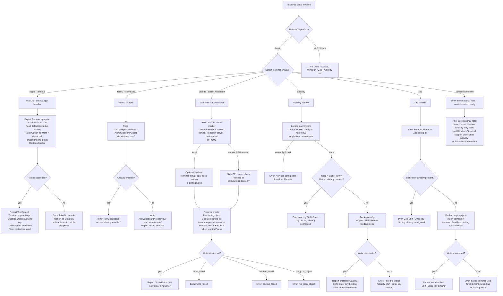

# `/terminal-setup`

> Analysis basis: CC v2.1.196 bundle.js (AST extraction + Claude interpretation)
> Minimum version: v2.1.196

---

## Overview

The `/terminal-setup` command detects the active terminal emulator and configures a Shift+Enter key binding (or platform-equivalent) so that pressing Shift+Enter inserts a literal newline rather than submitting input. It operates by reading and patching terminal-specific configuration files (plists, JSON keymaps, TOML configs), creating backups before any modification, and reporting which settings were changed. The command is platform-aware: on macOS it handles Apple Terminal, iTerm2, and others; on all platforms it handles VS Code, Cursor, Windsurf, Alacritty, and Zed.

---

## Registration

| Field | Value |
|---|---|
| type | `local-jsx` |
| name | `terminal-setup` |
| description | Install Shift+Enter key binding for newlines |
| loc_byte | `12789904` |
| loc_byte_end | `12790536` |
| loc_line | `8792` |
| module_id | `l7i` |
| load_inline | `true` |
| arbor_handler.name | `yJd` |
| arbor_handler.fqn | `claude-2.1.196::yJd` |
| arbor_handler.kind | `AsyncFunction` |
| arbor_handler.resolution_path | `module_id` |
| arbor_handler.n_hits | `1` |

Analysis basis: CC v2.1.196 bundle.js:+12789904

---

## Input Branching

The command branches across seven or more distinct terminal-detection paths, making a Mermaid flowchart the appropriate representation.



---

## Behavioral Spec

### Top-level handler (`yJd` — `terminalSetupHandler`)

The Arbor-resolved handler is the async function `yJd` (FQN: `claude-2.1.196::yJd`, resolved via `module_id`). It is the command's sole entry point.

```
async function terminalSetupHandler(context):
    platform = os.platform()            // gre.platform — loc_byte 4183366

    terminalName = detectCurrentTerminal(platform)   // a7i — loc_byte 4183563

    if platform == "darwin":
        macosSetup(terminalName, context)            // T6e, TPn path — loc_byte 4183914
    else:
        crossPlatformSetup(terminalName, context)    // TPn — loc_byte 4184842

    emitDimStatusLine()                              // It.dim — loc_byte 4184208
```

Analysis basis: CC v2.1.196 bundle.js:+4183366

---

### Terminal detection (`a7i` — `detectCurrentTerminal`)

```
function detectCurrentTerminal(platform):
    execResult = runCommand("defaults", ["read", "com.googlecode.iterm2", ...])
    // Pn (execFile wrapper) — loc_byte 4182401

    output = execResult.stdout.trim()    // n.trim — loc_byte 4182482

    if output contains "iterm" or path contains "iTerm.app":
        return "iTerm.app"

    terminalEnvValue = readEnvironmentTerminalProgram()
    colorize(terminalEnvValue)           // xo — loc_byte 4182506
    return terminalEnvValue or "your current terminal"
```

Analysis basis: CC v2.1.196 bundle.js:+4182358

---

### macOS Terminal.app setup (`terminalSetupAppleTerminal` — `SJd`)

```
async function terminalSetupAppleTerminal():
    // Step 1: backup current plist
    backupResult = backupTerminalPlist()    // t7i — loc_byte 4190984
    if backupResult.status != "ok":
        throw Error("Failed to create backup of Terminal.app preferences, bailing out")
        // loc_byte 4191030

    // Step 2: read default profile name
    defaultProfileName = execPlistBuddy("read", "Default Window Settings")
    // Pn — loc_byte 4191125; literal "Default Window Settings" — loc_byte 4191168
    if not defaultProfileName or trim == "":
        throw Error("Failed to read default Terminal.app profile")
        // loc_byte 4191228

    // Step 3: read startup profile name
    startupProfileName = execPlistBuddy("read", "Startup Window Settings")
    // literal "Startup Window Settings" — loc_byte 4191345
    if not startupProfileName:
        throw Error("Failed to read startup Terminal.app profile")
        // loc_byte 4191405

    // Step 4: for each unique profile, patch Option-as-Meta and visual bell
    profiles = deduplicate([defaultProfileName, startupProfileName])
    results = []
    for profile in profiles:
        r = patchProfileOptionMetaAndBell(profile)    // r7i — loc_byte 4191485
        r2 = patchProfileBellSetting(profile)         // o7i — loc_byte 4191500
        results.push({profile, r, r2})

    if all results failed:
        throw Error("Failed to enable Option as Meta key or disable audio bell for any Terminal.app profile")
        // loc_byte 4191615

    // Step 5: kill cfprefsd to flush preferences
    execCommand("killall", ["cfprefsd"])    // literals loc_byte 4191714, 4191725

    // Step 6: report success
    displayStatus("success", "Configured Terminal.app settings:")
    // loc_byte 4191754, 4191767
    if optionMetaEnabled:
        printLine('- Enabled "Use Option as Meta key"')    // loc_byte 4191834
    if bellDisabled:
        printLine("- Switched to visual bell")             // loc_byte 4191896
    printLine("Shift+Return will now enter a newline.")    // loc_byte 4191941
    printLine("Option+Enter will now enter a newline.")    // loc_byte 4191990
    printLine("You must restart Terminal.app for changes to take effect.")
    // loc_byte 4192075

    if optionMetaFailed:
        printWarning("Failed to enable Option as Meta key for Terminal.app.")
        // loc_byte 4192262
```

Analysis basis: CC v2.1.196 bundle.js:+4190984

---

### Terminal.app plist backup (`t7i` — `backupTerminalPlist`)

```
async function backupTerminalPlist():
    prefPath = buildPlistPath()    // zlt — loc_byte 4178177
    // path = HOME/Library/Preferences/com.apple.Terminal.plist
    // literals: "Library" loc_byte 4178098, "Preferences" loc_byte 4178108,
    //           "com.apple.Terminal.plist" loc_byte 4178122

    // Export current settings to a temp file
    exportResult = execFile("defaults", ["export", "com.apple.Terminal", tempFile])
    // literals "defaults" loc_byte 4178221, "export" loc_byte 4178233,
    // "com.apple.Terminal" loc_byte 4178242; Pn — loc_byte 4178218

    stat = fs.stat(tempFile)    // tto.stat — loc_byte 4178298

    if stat fails or file is empty:
        hJd(...)   // write backup record — loc_byte 4178390
        return {status: "no_backup"}

    // Atomic write backup via saveConfigHelper
    zo(...)    // loc_byte 4178411
    T(...)     // loc_byte 4178424

    return {status: "ok", backupPath: ...}
```

Analysis basis: CC v2.1.196 bundle.js:+4178177

---

### VS Code-family handler (`ato` — `setupVSCodeFamily`)

```
async function setupVSCodeFamily(editorName):
    // Detect remote-server environment
    isRemote = checkRemoteServerMarkers()    // bPn — loc_byte 4188244
    // markers: ".vscode-server", ".cursor-server", ".windsurf-server", ".devin-server"
    // loc_byte 4180867–4180959

    if isRemote:
        colorize("warning", ...)    // xo — loc_byte 4188259
        printDim(...)               // It.dim — loc_byte 4188712

    // Resolve keybindings.json path
    keybindingsPath = pathJoin(userDataDir, "keybindings.json")
    // IPn, i2.join — loc_byte 4188911, 4188921

    // Ensure parent directory exists
    fs.mkdir(keybindingsPath.dir, {recursive: true})    // Mw.mkdir — loc_byte 4188951

    // Read existing keybindings or default to empty array
    raw = fs.readFile(keybindingsPath) or "[]"
    // Mw.readFile — loc_byte 4189011; literal "[]" loc_byte 4188984

    // Parse with fault-tolerant JSON parser
    parsed = faultTolerantJsonParse(raw, "utf-8")    // Fkt — loc_byte 4189052

    // Check if shift+enter binding already present
    existing = parsed.find(entry => entry.key == "shift+enter" and
                            entry.command == "workbench.action.terminal.sendSequence")
    // literal "shift+enter" loc_byte 4189370
    // literal "workbench.action.terminal.sendSequence" loc_byte 4189392

    if not existing:
        newEntry = {
            key: "shift+enter",
            command: "workbench.action.terminal.sendSequence",
            args: { text: "\x1b\r" },    // ESC+CR — loc_byte 4189444
            when: "terminalFocus"         // loc_byte 4189459
        }
        newBindings = mergeOrAppend(parsed, newEntry)

        // Atomic write with random-bytes backup
        backupPath = keybindingsPath + "." + randomHex(4)    // Ylt.randomBytes loc_byte 4189102
        fs.copyFile(keybindingsPath, backupPath)              // Mw.copyFile loc_byte 4189165

        // Serialize and write
        writeResult = mergeJsonEdits(raw, newBindings)    // tws — loc_byte 4189848
        fs.writeFile(keybindingsPath, writeResult)        // Mw.writeFile loc_byte 4189870

        colorize("success", ...)
        print(editorName + ": Shift+Return will now enter a newline.")
        // loc_byte 4191941

    else:
        print("Shift+Enter binding already present")
```

Analysis basis: CC v2.1.196 bundle.js:+4188244

---

### VS Code settings.json handler (`ito` — `setupVSCodeSettings`) and GPU accel check (`SPn`)

The `ito` function handles reading `settings.json` (literal `"settings.json"` loc_byte 4185588, default `"{}"` loc_byte 4185615) and the `SPn` function additionally checks and optionally patches `terminal_setup_gpu_accel` (literal loc_byte 4186754). Both follow the same backup-then-write pattern (random bytes suffix, `Mw.copyFile`, `Mw.writeFile`). Error states emitted: `"not_json_object"` (loc_byte 4187010), `"write_failed"` (loc_byte 4187354), `"backup_failed"` (loc_byte 4187575).

Analysis basis: CC v2.1.196 bundle.js:+4185461

---

### Alacritty handler (`AJd` — `setupAlacritty`)

```
async function setupAlacritty():
    // Locate alacritty.toml
    candidates = []
    candidates.push(pathJoin(HOME, ".config", "alacritty.toml"))
    // literals ".config" loc_byte 4192772, "alacritty.toml" loc_byte 4192719
    if platform == "win32":    // loc_byte 4192833
        candidates.push(windowsAlacrittyPath())

    configPath = candidates.find(p => fs.existsSync(p))
    if not configPath:
        throw Error("No valid config path found for Alacritty")    // loc_byte 4193082

    raw = fs.readFile(configPath)    // Mw.readFile loc_byte 4192969

    // Check if binding already present
    if raw.includes('mods = "Shift"') and raw.includes('key = "Return"'):
        // literals loc_byte 4193150, 4193180
        print("Alacritty Shift+Enter key binding already configured")    // loc_byte 4193223
        return

    // Backup
    backupPath = configPath + "." + randomHex(4)
    copyResult = fs.copyFile(configPath, backupPath)    // Mw.copyFile loc_byte 4193385
    if copyResult failed:
        throw Error("Error backing up existing Alacritty config. Bailing out.")
        // loc_byte 4193433

    // Append TOML binding block
    newContent = raw + "\n[[keyboard.bindings]]\n" +
                 'mods = "Shift"\nkey = "Return"\n...'

    fs.mkdir(dirname(configPath), {recursive: true})    // Mw.mkdir loc_byte 4193581
    fs.writeFile(configPath, newContent)                // Mw.writeFile loc_byte 4193751

    print("Installed Alacritty Shift+Enter key binding")    // loc_byte 4193807
    print("You may need to restart Alacritty for changes to take effect")
    // loc_byte 4193877
```

Analysis basis: CC v2.1.196 bundle.js:+4192690

---

### Zed handler (`bJd` — `setupZed`)

```
async function setupZed():
    keymapPath = pathJoin(HOME, ".config", "zed", "keymap.json")
    // i2.join, gre.homedir — loc_byte 4194186, 4194194
    // literal "keymap.json" loc_byte 4194237

    fs.mkdir(dirname(keymapPath), {recursive: true})    // Mw.mkdir loc_byte 4194262
    raw = fs.readFile(keymapPath) or "[]"               // Mw.readFile loc_byte 4194317

    // Check existing binding
    if raw.includes("shift-enter"):    // literal loc_byte 4194403
        print("Zed Shift+Enter key binding already configured")    // loc_byte 4194443
        return

    // Backup
    backupPath = keymapPath + "." + randomHex(4)
    copyResult = fs.copyFile(keymapPath, backupPath)    // Mw.copyFile loc_byte 4194599
    if copyResult failed:
        throw Error("Error backing up existing Zed keymap. Bailing out.")
        // loc_byte 4194647

    // Parse and patch
    parsed = JSON.parse(raw)    // Gt — loc_byte 4194793
    if not Array.isArray(parsed):
        parsed = []

    parsed.push({
        context: "Terminal",                 // loc_byte 4194856
        bindings: { "shift-enter": "terminal::SendText" + newlineSeq }
        // literal "terminal::SendText" loc_byte 4194892
    })

    fs.writeFile(keymapPath, JSON.stringify(parsed, null, 2))
    // Mw.writeFile loc_byte 4194932, Me (stringify) loc_byte 4194947

    print("Installed Zed Shift+Enter key binding")    // loc_byte 4195003
```

Analysis basis: CC v2.1.196 bundle.js:+4194186

---

### iTerm2 handler (`a7i` sub-path — clipboard access)

```
async function setupITerm2():
    // Check current AllowClipboardAccess value
    result = execFile("defaults", ["read", "com.googlecode.iterm2", "AllowClipboardAccess"])
    // literal "com.googlecode.iterm2" loc_byte 4182423
    // literal "AllowClipboardAccess" loc_byte 4182447; Pn — loc_byte 4182401

    trimmed = result.stdout.trim()    // n.trim — loc_byte 4182482

    if trimmed is "yes" or "on" or truthy:
        // literals loc_byte 29725, 29731
        print("iTerm2 clipboard access already enabled")    // loc_byte 4182522
        return

    writeResult = execFile("defaults", ["write", "com.googlecode.iterm2",
                           "AllowClipboardAccess", "-bool", "true"])
    // literals "write" loc_byte 4182610, "-bool" loc_byte 4182665

    if writeResult failed:
        printWarning("Couldn't update iTerm2 clipboard setting.")    // loc_byte 4182716
        return

    print('Enabled "Applications in terminal may access clipboard" in iTerm2')
    // loc_byte 4182807
    print("Restart iTerm2 for this to take effect. Undo: defaults write ...")
    // loc_byte 4182890
```

Analysis basis: CC v2.1.196 bundle.js:+4182401

---

### Backup/restore helper (`_Pn` — `terminalPlistRestoreHelper`)

```
async function terminalPlistRestoreHelper(backupRecord):
    // Resolve backup file via HJd (writeConfigRecord)
    hJdResult = writeBackupRecord(backupRecord)    // HJd — loc_byte 4178558

    if backupRecord.status == "no_backup":    // literal loc_byte 4178584
        return

    // Validate backup is readable
    statResult = fs.stat(backupRecord.path)    // tto.stat — loc_byte 4178647
    if not statResult.ok:
        return

    // Re-import plist
    importResult = execFile("defaults", ["import", ...])
    // literal "import" loc_byte 4178745; Pn — loc_byte 4178730

    if importResult.status == "failed":    // literal loc_byte 4178802
        colorize("error", ...)            // zo — loc_byte 4178908
        T(...)                            // loc_byte 4178914
        return

    if importResult.status == "restored":    // literal loc_byte 4178884
        Re(...)    // execFile error handler — loc_byte 4178981
```

Analysis basis: CC v2.1.196 bundle.js:+4178558

---

### PlistBuddy command runner (`r7i` / `o7i` — `runPlistBuddyRead` / `runPlistBuddyWrite`)

Both helpers call `/usr/libexec/PlistBuddy` (literal loc_byte 4190257) with `-c` (literal loc_byte 4190284) as the first argument, followed by a command string, the plist path, and optional profile name. They share the same executor (`Pn`), path resolver (`zlt`), and output formatter (`T`).

Analysis basis: CC v2.1.196 bundle.js:+4190254

---

### Onboarding completion hook (`qlt` — `onboardingProjectCompleteHook`)

After all terminal-specific work, the handler calls `qlt`, which fires the telemetry event `"onboarding_project_complete"` (literal loc_byte 4177436) and sets up the workspace onboarding state (`kg`, `Jzi`, `mb`). This signals that `/terminal-setup` is considered part of the onboarding flow.

Analysis basis: CC v2.1.196 bundle.js:+4182322

---

## State & Side Effects

| Item | Detail |
|---|---|
| Telemetry | `tengu_config_auth_loss_prevented` (loc_byte 14153957), `tengu_feature_ok` (loc_byte 1028610), `tengu_feature_bad` (loc_byte 1028677), `tengu_feature_sad` (loc_byte 1028758), `tengu_daemon_control` (loc_byte 18033163), `tengu_config_lock_contention` (loc_byte 14157063), `tengu_config_stale_write` (loc_byte 14157199), `tengu_config_parse_error` (loc_byte 14160796), `tengu_config_auto_repaired` (loc_byte 14157576), `tengu_config_fallback_write` (loc_byte 14156679) |
| Onboarding event | Fires `"onboarding_project_complete"` internal event via `qlt` (loc_byte 4182322) |
| File writes | Modifies `keybindings.json` (VS Code-family), `settings.json` (VS Code GPU accel), `alacritty.toml`, `keymap.json` (Zed), `com.apple.Terminal.plist` (macOS Terminal) |
| Backups | Each file write is preceded by a copy to a random-hex-suffixed path (`Ylt.randomBytes`, 4 bytes, hex-encoded) |
| External processes | Invokes `defaults`, `/usr/libexec/PlistBuddy`, `killall cfprefsd` on macOS |
| Config lock | Uses `saveConfigWithLock` path (via `ntn`/`lIt`) for any Claude config writes; emits `tengu_config_lock_contention` on contention |
| appState changes | Onboarding workspace state updated via `kg` → `Dt` → `sqo`/`lIt` path |
| Sound | None observed in traversal |

---

## Version History

| Version | Change |
|---|---|
| v2.1.196 | Initial analysis |

---

## Common Mistakes

1. **Running on an unsupported terminal**: If the detected terminal is `screen`, an unknown value, or a natively-supporting terminal (iTerm2, WezTerm, Ghostty, Kitty, Warp, Windows Terminal), the command prints an informational note rather than modifying any config. Users may expect a confirmation of success but will only receive a hint message. (loc_byte 4184700)

2. **Not restarting the terminal**: For Apple Terminal, Alacritty, and iTerm2, config changes do not take effect until the application is restarted. The command prints a restart reminder but users sometimes ignore it.

3. **Remote VS Code sessions**: When running inside a remote SSH VS Code session (detected via `.vscode-server`, `.cursor-server`, `.windsurf-server`, or `.devin-server` markers), the GPU acceleration setting is skipped and a warning is emitted. The Shift+Enter keybinding is still installed, but GPU-related settings are not touched. (loc_byte 4180867)

4. **Running on non-macOS for Apple Terminal path**: The Apple Terminal and iTerm2 paths are gated on `platform == "darwin"`. Running `/terminal-setup` on Linux or Windows will skip those handlers entirely and proceed to the cross-platform set.

5. **Alacritty config not found**: If no `alacritty.toml` exists at the expected location and none of the platform-specific fallback paths exist, the command errors with `"No valid config path found for Alacritty"` (loc_byte 4193082) rather than creating a fresh config file.

---

## Appendix — Identifier Mapping

> For bundle debugging only. Identifiers change across versions.

| Identifier | Role |
|---|---|
| `yJd` | Top-level handler for `/terminal-setup` (`terminalSetupHandler`, AsyncFunction) |
| `T6e` | Platform detection wrapper (reads `gre.platform`) |
| `TPn` | Cross-platform terminal setup dispatcher |
| `SJd` | Apple Terminal.app setup function |
| `t7i` | Terminal.app plist backup function |
| `zlt` | Terminal.app plist path builder (HOME + Library/Preferences/com.apple.Terminal.plist) |
| `Pn` | `execFile` / subprocess runner wrapper |
| `Gr` | Core `execFile` implementation |
| `Ot` | Process executor helper |
| `hJd` | Backup record writer |
| `Hn` | Global config save function |
| `zo` | ANSI color output / status display |
| `rn` | Logger / debug output |
| `T` | Shell command formatter / output builder |
| `eeu` | Command argument escaper |
| `Me` | JSON serializer wrapper |
| `Pc` | Path redaction utility (replaces home with `[REDACTED]`) |
| `KQe` | Config path resolver |
| `oeu` | File write helper with retry |
| `Re` | Async exec-with-error-capture wrapper |
| `er` | Error constructor helper |
| `ct` | String coercion utility |
| `zi` | Network traffic classifier |
| `_Nu` | Request queue manager |
| `r7i` | PlistBuddy read command runner |
| `o7i` | PlistBuddy write command runner |
| `Klt` | Config persistence helper |
| `xo` | ANSI color string renderer |
| `D0e` | ANSI color name-to-function mapper |
| `mJ` | Markup/text renderer |
| `_Pn` | Terminal.app plist restore helper |
| `HJd` | Backup record persistence (writes metadata) |
| `Dt` | Project config writer |
| `ato` | VS Code-family keybindings.json handler |
| `bPn` | Remote server marker detector |
| `Fkt` | Fault-tolerant JSON parser for keybinding files |
| `V5` | JSON value extractor (handles `startsWith` prefix format) |
| `a2` | Atomic file write helper (path-to-file-URL based) |
| `Rw` | Hyperlink / terminal capability detector |
| `fH` | Terminal feature flag reader |
| `tws` | JSON merge-edit serializer |
| `LMr` | JSON array edit builder |
| `Kvs` | JSON AST node inserter |
| `xMr` | JSON string edit builder |
| `Jmn` | JSON substring locator |
| `ito` | VS Code `settings.json` reader/patcher |
| `pto` | JSON array type checker |
| `RMr` | JSON object merge-edit builder |
| `SPn` | VS Code GPU acceleration settings patcher |
| `wt` | Feature flag reader with ok/bad/sad telemetry |
| `V` | Ink/React render helper |
| `Oe` | UI component renderer |
| `$Xe` | Root UI component |
| `AJd` | Alacritty TOML config handler |
| `bJd` | Zed keymap.json handler |
| `Gt` | JSON.parse wrapper |
| `qlt` | Onboarding project-complete hook |
| `kg` | Onboarding state writer (calls `Dt` and `Ua`) |
| `Jzi` | Onboarding completion broadcaster |
| `eto` | Onboarding CLAUDE.md/workspace task builder |
| `qt` | Async task / promise utility |
| `YTs` | Onboarding step renderer |
| `mb` | Project config saver with telemetry |
| `ntn` | Config-with-lock save function |
| `Yli` | Object assign / config merge helper |
| `lIt` | Config file reader (with parse, backup, and repair logic) |
| `cIt` | Config cache accessor |
| `uqo` | Backup directory path builder |
| `mkt` | Atomic file write with fsync and permission preservation |
| `zUe` | Auth presence validator |
| `etn` | Timestamp recorder |
| `Zen` | Global config read-with-lock function |
| `Tdr` | Project config save with atomic write |
| `fto` | VS Code keybindings read-only inspector |
| `EJd` | Keybinding existence checker |
| `dto` | Onboarding display component (with `Dt` + `Hn`) |
| `cto` | Onboarding variant A display component |
| `uto` | Onboarding variant B display component |
| `a7i` | Terminal name detector / iTerm2 clipboard setup |
| `yPn` | Terminal-specific note emitter (backslash+return / native Shift+Enter hint) |
| `lto` | Onboarding list-item component |

---

Note: index built via Arbor fallback; some signals (telemetry, literals) may be missing — see arbor-fallback.js.