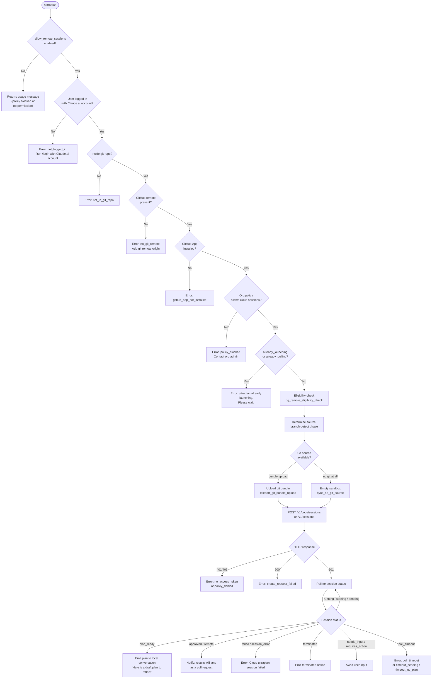

# `/ultraplan`

> Analysis basis: CC v2.1.196 bundle.js (AST extraction + Claude interpretation)
> Minimum version: v2.1.196

---

## Overview

`/ultraplan` launches a cloud-hosted planning session on Claude.ai that drafts an editable plan for the current repository's task, then streams results back to the local CLI. The command performs a series of precondition checks (login, Git remote, GitHub App, organization policy), uploads a Git bundle to seed the remote sandbox, creates a cloud session via the API, and polls for plan completion — returning an editable plan document to the local conversation when the remote session reaches `plan_ready` status.

---

## Registration

| Field | Value |
|---|---|
| type | `local-jsx` |
| name | `ultraplan` |
| description | `Draft an editable plan in Claude Code on the web ( ... ) · See ...` |
| argumentHint | `<prompt>` |
| load_inline | `true` |
| load_ident | `Iqf` |
| loc_byte | `12647464` |
| loc_byte_end | `12647696` |
| loc_line | `8579` |
| arbor_handler.name | `Iqf` |
| arbor_handler.fqn | `claude-2.1.196::Iqf` |
| arbor_handler.kind | `AsyncFunction` |
| arbor_handler.resolution_path | `load_ident` |
| arbor_handler.n_hits | `1` |

Analysis basis: CC v2.1.196 bundle.js:+12647464

The handler `Iqf` was inlined via a `load:()=>Promise.resolve({call: Iqf})` shape; the Arbor symbol graph confirmed it by following the `load_ident` resolution path with exactly 1 unambiguous hit.

---

## Input Branching

The command has many distinct branches (precondition failures, eligibility states, launch states, and polling outcomes), so a flowchart is used.



---

## Behavioral Spec

### Handler Entry Point (`Iqf`)

The async handler `Iqf` is the command's main entry point, resolved via the `load_ident` inline shape.

```
async function ultraplanHandler(commandContext):
    check appState for allow_remote_sessions
    if not allowed:
        return usage_error("Usage: /ultraplan <prompt>, or include 'ultraplan' anywhere in your prompt")

    sourceType = determineInvocationSource(commandContext)  // "slash"
    
    sessionConfig = buildSessionConfig(commandContext)
    sessionConfig.system = "system"

    result = await launchAndPollSession(sessionConfig, commandContext)
    
    commandContext.setAppState(updatedState)
    return result
```

Analysis basis: CC v2.1.196 bundle.js:+12645652

---

### Precondition Gate (`Gs`)

Before any network call is made, a chain of precondition checks runs in `Gs`.

```
async function checkPreconditions(context):
    if not OFi(context):                  // config/feature-flag check
        return { ok: false, reason: "policy_blocked" }
    
    if not U2d.has(context):              // login check
        return { ok: false, reason: "not_logged_in",
                 message: "Please run /login and sign in with your Claude.ai account (not Console)." }
    
    if not GF(context):                   // git repo check
        return { ok: false, reason: "not_in_git_repo" }
    
    if not $2d.has(context):              // git remote check
        return { ok: false, reason: "no_git_remote",
                 message: "Cloud agents require a GitHub remote. Add one with `git remote add origin REPO_URL`." }
    
    if zi(context) blocked:               // org policy check
        return { ok: false, reason: "policy_blocked",
                 message: "Cloud sessions are disabled by your organization's policy. Contact your organization admin to enable them." }
    
    if J_e check fails:                   // GitHub App check
        return { ok: false, reason: "github_app_not_installed" }
    
    return { ok: true }
```

Analysis basis: CC v2.1.196 bundle.js:+3394698

---

### Launch Coordinator (`FQt`)

`FQt` coordinates the full launch sequence after preconditions pass.

```
async function launchCoordinator(config, context):
    preconditionResult = await checkPreconditions(context)
    if not preconditionResult.ok:
        emit telemetry: tengu_ultraplan_create_failed
        return buildErrorMessage(preconditionResult)
    
    if appState.already_launching == true:
        return error("ultraplan: already launching. Please wait for the session to start.")
    
    if appState.already_polling == true:
        return error("already_polling")
    
    mark appState.already_launching = true
    
    try:
        teleportResult = await teleportToRemote(config)
        if teleportResult is null:
            emit telemetry: tengu_ultraplan_create_failed (reason: "teleport_null")
            return error(". See --debug for details.")
        
        sessionId = teleportResult.sessionId
        
        // Notify user session started
        emit notification: task-notification
        
        // transition to polling
        pollResult = await pollSession(sessionId, config)
        return handlePollResult(pollResult)
    finally:
        mark appState.already_launching = false
```

Analysis basis: CC v2.1.196 bundle.js:+12642787

---

### Remote Eligibility Check (`IFa`)

Before committing to session creation, a remote eligibility check (`bg_remote_eligibility_check`) runs.

```
async function checkRemoteEligibility(context):
    configState = await Gs(context)
    
    parallel checks = Promise.all([
        checkBundleSeedEnabled(),    // tengu_ccr_bundle_seed_enabled
        checkBYOC(),                  // "byoc" provider flag
        checkSomeCondition(s),
    ])
    
    gather results into eligibilityReport
    
    if eligible:
        buildResponsePayload(kr, $4n, ...)
    else:
        return ineligible result
```

Analysis basis: CC v2.1.196 bundle.js:+7410907

---

### Teleport Orchestrator (`SW`)

`SW` is the large orchestration function that drives the full remote session creation pipeline, progressing through named phases.

```
async function teleportOrchestrator(config):
    // Phase: env-select  (bundle.js:+8901484)
    providerType = determineProviderType(config)   // "firstParty" check
    if not firstParty:
        return error("not_first_party",
                     "Cloud sessions are only available on the first-party Anthropic API provider.")
    
    authToken = getAccessToken()
    if not authToken:
        return error("no_access_token",
                     "Cloud sessions require a claude.ai login. Run /login to authenticate.")
    
    orgUUID = getOrgUUID()
    if not orgUUID:
        return error("no_org_uuid",
                     "Unable to get organization UUID for cloud session creation")
    
    environments = await listEnvironments()   // Ioe — teleport_environments_list
    if no environments:
        autoCreated = await createDefaultEnvironment()  // _mt — teleport_default_environment_create
        if failed:
            warn("Could not create a cloud environment. Set one up at https://claude.ai/code/onboarding?magic=env-setup")
            return error("no_default_env")
    
    selectedEnv = pickEnvironment(environments)
    
    // Phase: branch-detect  (bundle.js:+8903289)
    branchInfo = detectBranch(config)    // qM — git symbolic-ref refs/remotes/origin/HEAD
    
    githubPreflight = runGithubPreflight(config)
    // Outcomes: github_preflight_ok | github_preflight_failed | ghes_optimistic |
    //           forced_bundle | no_github_remote
    
    // Phase: bundle-upload  (bundle.js:+8904948)
    bundleMode = decideBundleMode(config)
    // tengu_teleport_bundle_mode, tengu_teleport_source_decision
    
    if bundleMode requires upload:
        uploadResult = await uploadGitBundle(config)   // evo — tengu_ccr_bundle_upload
        // Possible: success | failed | upload_failed | stash_failed | empty_repo
    
    // Build session create body
    sessionBody = buildSessionBody({
        environment: selectedEnv,
        branch:      branchInfo,
        bundle:      bundleMode,
        orgUUID:     orgUUID,
    })
    
    // Generate title and branch name via AI call  (gof — teleport_generate_title)
    titleResult = await generateTitleAndBranch(config)   // schema: { title, branch }
    
    // Phase: POST-sent  (bundle.js:+8907013)
    apiVersion = selectApiVersion()   // "v1alpha2" | "v1"
    endpoint   = selectEndpoint()     // "/v1/code/sessions" | "/v1/sessions"
    
    response = await fo.post(endpoint, sessionBody, {
        headers: {
            "x-organization-uuid": orgUUID,
            "anthropic-beta":      apiVersion,
        },
        timeout: 10000,   // ms  (bundle.js:+8909638)
    })
    
    if response.status == 500:
        return error("create_request_failed")
    if response.status in [401, 403]:
        return error("github_repo_access_denied" | "no_access_token")
    if response.status != 201:
        return error("malformed_response")
    
    sessionId = extractSessionId(response)
    if not sessionId:
        return error("malformed_response",
                     "Server returned a malformed session response (no session id)")
    
    // Attach task-notification / event listener
    registerSessionListener(sessionId)   // aol — xHt.randomUUID
    
    // Link emitted
    emitSessionLink()   // tengu_ccr_session_link
    
    return { sessionId, ... }
```

Analysis basis: CC v2.1.196 bundle.js:+8897648

---

### Git Bundle Upload (`evo`)

```
async function uploadGitBundle(config):
    emit telemetry: teleport_git_bundle_upload
    
    if not in git repo:
        return error("empty_repo", "Not in a git repository")
    
    // Clean up seed refs
    runGit(["update-ref", "-d", "refs/seed/stash"])
    runGit(["update-ref", "-d", "refs/seed/root"])
    
    refCount = runGit(["for-each-ref", "--count=1", "refs/"])
    if refCount == 0:
        return error("empty_repo", "Repository has no commits yet")
    
    stashOid = runGit(["stash", "create"])   // status 200
    headOid  = runGit(["rev-parse", "--verify", "HEAD"])
    
    bundleFile = writeTempFile("ccr-seed.bundle")
    
    // Try strategies: head → fallback_head → squashed → fallback_squashed
    uploadResult = tryUploadStrategies([
        "head", "fallback_head", "squashed", "fallback_squashed"
    ])
    
    if all failed:
        return error("upload_failed")
    
    cleanup: LHt.unlink(bundleFile)
    
    emit telemetry: tengu_ccr_bundle_upload
    return { status: "success", strategy: winningStrategy }
```

Analysis basis: CC v2.1.196 bundle.js:+8880358

---

### Polling Loop (`Eqf` / `qzl`)

```
async function pollSession(sessionId, config):
    emit telemetry: tengu_ultraplan_timeout_seconds
    
    startTime = Date.now()
    maxWait   = 5400 seconds (bundle.js:+12638353)
    interval  = 1000 ms, maxInterval = 1800000 ms  (bundle.js:+8920705, +8920712)
    
    loop:
        if caller_requested_stop:
            throw Error("poll stopped by caller")
        
        sessionData = await fetchSession(sessionId)
        
        match sessionData.status:
            case "pending" | "starting" | "running":
                wait(backoff_interval)
                continue
            
            case "plan_ready":
                emit telemetry: tengu_ultraplan_plan_ready
                plan = extractPlan(sessionData)
                return { kind: "plan_ready", plan }
            
            case "approved":
                emit telemetry: tengu_ultraplan_approved
                return { kind: "approved" }
            
            case "remote" | "teleport":
                return { kind: "remote_running" }
            
            case "requires_action" | "needs_input":
                emit telemetry: tengu_ultraplan_awaiting_input
                return { kind: "needs_input" }
            
            case "failed" | "session_error" | "orchestrator_error":
                emit telemetry: tengu_ultraplan_failed
                return { kind: "failed" }
            
            case "terminated":
                return { kind: "terminated" }
            
            case "completed" | "archived":
                return { kind: "completed" }
        
        elapsed = Date.now() - startTime
        elapsedMinutes = Math.round(elapsed / 60000)
        
        if elapsed >= maxWait * 1000:
            if no plan received:
                return { kind: "timeout_no_plan" }
            else:
                return { kind: "timeout_pending" }
```

Analysis basis: CC v2.1.196 bundle.js:+12629181

---

### Poll Result Handler (`Tqf`)

`Tqf` transforms polling outcomes into local conversation messages.

```
function handlePollOutcome(pollResult, config):
    match pollResult.kind:
        case "plan_ready":
            emit telemetry: tengu_ultraplan_launched
            planText = assemblePlanText(pollResult.plan)
            // Prepend header: "Here is a draft plan to refine:"  (bundle.js:+12638660)
            return renderPlanMessage(planText)
        
        case "approved" | "remote_running":
            return message("Results will land as a pull request when the cloud session finishes. "
                           "There is nothing to do here.")
        
        case "failed" | "session_error":
            emit telemetry: tengu_ultraplan_failed
            return message("Cloud ultraplan session failed. Wait for the user's next instructions.")
        
        case "timeout_pending" | "timeout_no_plan" | "poll_timeout":
            return message(timeoutDescription)
        
        case "needs_input":
            // surface requires_action UI
            return renderRequiresActionUI()
        
        case "terminated" | "completed":
            return message(terminatedDescription)
```

Analysis basis: CC v2.1.196 bundle.js:+12643314

---

### Plan Assembly (`yqf` / `_qf`)

```
function assemblePlanMessage(planParts):
    lines = []
    lines.push("Here is a draft plan to refine:")   // (bundle.js:+12638660)
    
    for part in planParts:
        formatted = formatPlanSection(part)   // _qf → gqf
        lines.push(formatted)
    
    return lines.join("\n")
```

Analysis basis: CC v2.1.196 bundle.js:+12638653

---

### Session State Tracking (`Xk` / `a4n`)

```
function updateSessionState(event, payload):
    match event.type:
        case "task_started":      // (bundle.js:+10628984)
            YSe.setState({
                agentType:    payload.agentType,    // (bundle.js:+10629076)
                workflowName: payload.workflowName, // (bundle.js:+10629142)
                prompt:       payload.prompt,        // (bundle.js:+10629190)
                status:       "active",
            })
        
        case "task_updated":      // (bundle.js:+10628039)
            updateTimestamp = Date.now()
            lPo(payload)
            a4n(stateUpdate)
        
        case "user_typed":        // (bundle.js:+10624821)
            markUserInput(payload)
        
        case "aborted":           // (bundle.js:+10625042)
            setStatus("aborted")
```

Analysis basis: CC v2.1.196 bundle.js:+10627243

---

### Orphaned Session Cleanup

```
async function cleanupOrphanedSession(sessionId):
    try:
        await archiveSession(sessionId)
    catch err:
        log.warn("ultraplan: failed to archive orphaned session")  // (bundle.js:+12645284)
```

Analysis basis: CC v2.1.196 bundle.js:+12645284

---

### Usage / Error Message Construction

```
function buildUsageError():
    return 'Usage: /ultraplan <prompt>, or include "ultraplan" anywhere in your prompt'
    // (bundle.js:+12643111, +12643177)
```

Analysis basis: CC v2.1.196 bundle.js:+12643111

---

## State & Side Effects

| Item | Detail |
|---|---|
| Telemetry: `tengu_ultraplan_create_failed` | Fired when the session create call fails or a precondition blocks launch (bundle.js:+12642824) |
| Telemetry: `tengu_ultraplan_prompt_identifier` | Fired during `iar` to record a prompt identifier hash (bundle.js:+12638486) |
| Telemetry: `tengu_ultraplan_launched` | Fired when a session transitions to `plan_ready` and is delivered (bundle.js:+12644531) |
| Telemetry: `tengu_ultraplan_timeout_seconds` | Records poll timeout threshold at session start (bundle.js:+12638319) |
| Telemetry: `tengu_ultraplan_awaiting_input` | Fired when session reaches `requires_action` / `needs_input` (bundle.js:+12638963) |
| Telemetry: `tengu_ultraplan_plan_ready` | Fired when poll resolves with `plan_ready` (bundle.js:+12639031) |
| Telemetry: `tengu_ultraplan_approved` | Fired when remote session is approved (bundle.js:+12639451) |
| Telemetry: `tengu_ultraplan_failed` | Fired on session failure or error (bundle.js:+12640340) |
| Telemetry: `tengu_ccr_bundle_seed_enabled` | Fired during eligibility check (bundle.js:+7411380) |
| Telemetry: `tengu_ccr_bundle_upload` | Fired after git bundle upload completes (bundle.js:+8880680) |
| Telemetry: `tengu_teleport_bundle_mode` | Records which bundle mode was selected (bundle.js:+8899305) |
| Telemetry: `tengu_ccr_session_link` | Fired when session link is emitted to UI (bundle.js:+8890694) |
| Telemetry: `tengu_teleport_source_decision` | Records the source strategy chosen for the session (bundle.js:+8905858) |
| Telemetry: `tengu_daemon_config_reload` | Fired when daemon config is reloaded (bundle.js:+18010884) |
| Telemetry: `tengu_config_parse_error` | Fired if config parse fails during handler setup (bundle.js:+14160796) |
| `appState` changes | Sets `already_launching` flag during session creation; clears it in `finally`. Calls `t.setAppState` (bundle.js:+12646156) and reads `t.getAppState` (bundle.js:+12645934). |
| Hook registration | `vi` registers via `fis.register` (bundle.js:+68542); `YSe.setState` updates task state store. |
| File system | Writes and deletes a temporary `ccr-seed.bundle` file during git bundle upload (`evo`); uses `r.mkdirSync`, `r.copyFileSync`, `r.readdirStringSync` for config backup during `lIt`. |
| File watching | `bkt` registers `mvs.watchFile`; `Ldm` registers `hmc.unwatchFile` for config file monitoring. |
| Timers | Poll loop uses `setTimeout` with exponential backoff; max poll timeout is 5400 seconds (bundle.js:+12638353); poll interval starts at 1000 ms, capped at 1800000 ms (bundle.js:+8920705, +8920712). |
| Sound | <!-- TODO: not found in depth-2 traversal; needs --depth 4 --> |
| Session archive | On abnormal exit, attempts to archive the orphaned session and logs a warning on failure. |

---

## Version History

| Version | Change |
|---|---|
| v2.1.196 | Initial analysis |

---

## Common Mistakes

1. **Using a Console API key instead of a Claude.ai account**: The command requires a `claude.ai` login (OAuth), not an API key. If the `not_logged_in` error appears, run `/login` and authenticate with a Claude.ai account, not an Anthropic Console account.

2. **Running outside a Git repository**: The command needs a Git repository with at least one commit and a GitHub remote (`git remote add origin REPO_URL`) before it can seed the remote sandbox.

3. **GitHub App not installed**: Even with a GitHub remote configured, the GitHub App for Claude Code must be installed on the repository's organization. The error `github_app_not_installed` indicates this step is missing; visit `https://claude.ai/code` to install it.

4. **Invoking while a session is already launching**: The `already_launching` guard prevents concurrent launches. If `/ultraplan` is invoked a second time before the first session start completes, it returns the message "ultraplan: already launching. Please wait for the session to start."

5. **Expecting immediate results**: The remote session takes time. The poll loop runs up to 5400 seconds (90 minutes) before timing out. Do not close the terminal or interrupt the process while polling is in progress.

6. **Using with a non-first-party API provider**: Cloud sessions and the ultraplan workflow are only available when the Anthropic first-party API provider is active. Third-party or custom providers will receive a `not_first_party` error.

7. **No environment configured**: If no cloud environment exists and auto-creation fails, the command aborts with `no_default_env` and directs the user to `https://claude.ai/code/onboarding?magic=env-setup`.

---

## Appendix — Identifier Mapping

> For bundle debugging only. Identifiers change across versions.

| Identifier | Role |
|---|---|
| `Iqf` | Main async handler for `/ultraplan` (handler entry point) |
| `Wtr` | URL / remote-string normalisation utility |
| `Gtr` | Inner normalisation helper called by `Wtr` |
| `wNo` | Parses and validates remote URL segments; checks `startsWith`, `matchAll`, `some` |
| `Gs` | Precondition gate (login, git, remote, policy, GitHub App checks) |
| `OFi` | Feature-flag / config read for remote session allowance |
| `N6` | Config resolution helper called by `OFi` |
| `GF` | Git repository presence check |
| `O$t` | Config file reader (`readFileSync`, encoding `utf-8`) |
| `lye` | Policy/flag evaluator using `includes` and `some` checks |
| `zi` | Org policy enforcement check |
| `Fbs` | Token/flag string builder |
| `ct` | String coercion utility |
| `J_e` | GitHub App installation check |
| `Zoe` | Invocation source classifier (returns `"slash"`) |
| `FQt` | Launch coordinator; drives precondition → teleport → poll pipeline |
| `V` | React/UI render helper |
| `qe` | JSX element constructor |
| `$Xe` | Base UI element factory |
| `s` | Async set/tracking helper (add, finally, delete pattern) |
| `e7l` | Error display renderer |
| `aar` | Session creation wrapper |
| `iar` | Inner session creation logic; emits `tengu_ultraplan_prompt_identifier` |
| `it` | Session-create precondition sub-check |
| `hqf` | Prompt hash / identifier utility |
| `Tqf` | Poll result handler; maps polling outcomes to local messages |
| `rfe` | Remote fetch helper called by `Tqf` |
| `IFa` | Remote eligibility checker (`bg_remote_eligibility_check`) |
| `us` | UI state update helper (`g0`, `Gu`) |
| `g0` | Low-level state getter |
| `Gu` | Low-level state setter |
| `yqf` | Plan message assembler; pushes lines and joins |
| `_qf` | Plan section formatter |
| `SW` | Teleport orchestrator; full session creation pipeline |
| `Ot` | Process / spawn executor |
| `O6` | Session-create body builder (reads config, formats strings) |
| `Lc` | Provider type classifier (detects `"firstParty"`) |
| `qrl` | `--project` flag compatibility guard |
| `ph` | Auth token refresh helper |
| `MKn` | Request header builder (`x-organization-uuid`, `anthropic-beta`) |
| `Re` | Error normaliser and logger |
| `k3` | Org UUID resolver |
| `lol` | API version selector (`v1alpha2` / `v1`) |
| `evo` | Git bundle upload function (`teleport_git_bundle_upload`) |
| `Rt` | State getter (low-level, via `g0`) |
| `Us` | OAuth / access-token retriever |
| `T` | Message/string template builder |
| `Oe` | UI element wrapper |
| `sN` | Git remote URL resolver (`git config --get remote.origin.url`) |
| `aol` | Session listener/event registration; uses `xHt.randomUUID` |
| `PGt` | Session create response validator |
| `Me` | JSON serialiser wrapper |
| `ce` | Connection-state helper (reads `"down"` flag) |
| `QCo` | Session post-create hook |
| `nvo` | Notification emitter (new session) |
| `rvo` | Result emitter (completed session) |
| `col` | Cleanup / teardown helper |
| `Uo` | Object merge utility (`Object.assign`) |
| `iol` | Session link UI renderer (`tengu_ccr_session_link`) |
| `$4n` | Bundle-mode / source-type classifier |
| `Ioe` | Environment list fetcher (`teleport_environments_list`) |
| `_mt` | Default environment creator (`teleport_default_environment_create`) |
| `he` | String coercion / display helper |
| `d` | Daemon supervisor event handler (write, stop, updateConfig, start) |
| `gof` | AI title/branch generator (`teleport_generate_title`, max 75 chars) |
| `Eof` | Environment list filter |
| `FF` | File-flags reader (parallel to `it`) |
| `Nm` | GitHub hostname normaliser (strips `www.`, checks `github.com`) |
| `Kje` | GitHub App installation checker (`checkGithubAppInstalled`) |
| `qM` | Default branch detector (`git symbolic-ref refs/remotes/origin/HEAD`) |
| `Ts` | Terminal / display scheduler |
| `ple` | URL parser / protocol validator (`https`, `http`) |
| `Z` | Connection status store |
| `de` | Queue / enqueue helper |
| `er` | Error constructor wrapper |
| `dh` | Cancel-detection helper |
| `x_` | Abort signal helper |
| `EE` | Environment/endpoint resolver (localhost / staging / prod) |
| `eo` | Module loader / bind setup |
| `k4t` | Endpoint config object (`R4t`, `thp`) |
| `Aqf` | Post-launch acknowledgement handler |
| `YAe` | Remote agent poll orchestrator |
| `LU` | Random bytes generator (`xuc.randomBytes`, 8 bytes) |
| `Lmt` | SQLite/storage opener (`vB.open`) |
| `PT` | Session timestamp recorder (`Date.now`, `jm`) |
| `Iof` | Session ID string formatter |
| `fol` | Full polling loop implementation |
| `Xk` | Task-state machine (handles `task_started`, `task_updated`, etc.) |
| `ATf` | Task-start transition handler |
| `ETf` | Task-update transition handler |
| `a4n` | State store setter (`YSe.setState`) |
| `lPo` | Local poll-state updater |
| `bTf` | Task-start event processor |
| `TTf` | Task-update event processor (iterates `Object.keys`) |
| `Ufe` | User-typed event handler |
| `Eqf` | Session poll executor (drives `qzl` loop) |
| `qzl` | Core poll loop; handles all session status transitions |
| `mqf` | Pre-poll state check |
| `bqf` | Poll body constructor |
| `WVt` | Session cleanup / unlink handler (`Ll.unlink`) |
| `o` | Padding/formatting helper (`padEnd`, `map`) |
| `AW` | Post-session API call helper (POST with auth headers) |
| `vi` | Hook registration (`fis.register`) |
| `Sqf` | Session snapshot builder |
| `Dt` | Configuration manager (reads, watches, backs up config) |
| `qt` | Config path resolver |
| `sqo` | Config schema validator |
| `lIt` | Config file loader and backup writer |
| `Gt` | JSON parser wrapper |
| `V5` | Config value prefix stripper |
| `rn` | Config normaliser |
| `lqo` | Config directory reader |
| `uqo` | Config path joiner |
| `l` | File-event helper (`eoc`) |
| `m` | File-filter helper (`XHr`, `Array.isArray`, `k.filter`) |
| `XHr` | Path normaliser (strips leading component, replaces separators) |
| `k` | File watcher (setInterval, `O.watch`, `I.on`, `h.clear`) |
| `Ldm` | Config watcher registrar (`watchFile` / `unwatchFile`) |
| `bkt` | Low-level file watch registrar |
| `ege` | Config change event emitter |
| `Obt` | Parallel session bootstrap (`Promise.all`: `sN`, `FF`, `wu`, `Ot`, `ct`, `Nm`, `Kje`) |

---

Note: index built via Arbor fallback; some signals (telemetry, literals) may be missing — see arbor-fallback.js.