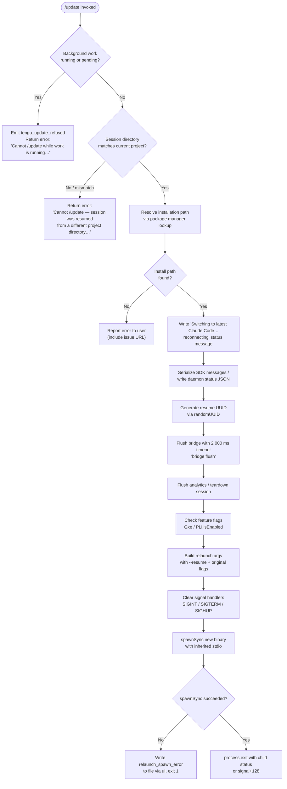

# `/update`

> Analysis basis: CC v2.1.196 bundle.js (AST extraction + Claude interpretation)
> Minimum version: v2.1.196

---

## Overview

The `/update` command performs an in-place upgrade of Claude Code to the latest available version while keeping the active conversation alive. It resolves the installation path, validates current session state, tears down the running process, then re-executes the new binary with `--resume` so the conversation continues seamlessly in the updated process.

---

## Registration

| Field | Value |
|---|---|
| type | `local` |
| name | `update` |
| description | `Switch to the latest version (conversation continues)` |
| supportsNonInteractive | `false` |
| isHidden | `true` |
| module_id | `snc` |
| load_inline | `true` |
| loc_byte | `13073638` |
| loc_byte_end | `13073879` |
| loc_line | `9034` |
| arbor_handler.name | `HXf` |
| arbor_handler.fqn | `claude-2.1.196::HXf` |
| arbor_handler.kind | `AsyncFunction` |
| arbor_handler.resolution_path | `module_id` |
| arbor_handler.n_hits | `0` |

Analysis basis: CC v2.1.196 bundle.js:+13073638

---

## Input Branching

The command has 5+ distinct branches (background-work guard, directory-mismatch guard, installation-path resolution, flush/teardown, and relaunch); a flowchart is used.



---

## Behavioral Spec

### Pre-flight: background-work guard

```
function refuseIfBusy(appState):
    for each task in Object.values(appState.tasks):
        if task.status == "running" or task.status == "pending":
            emit telemetry("tengu_update_refused")
            return Error(
                "Cannot /update while work is running in the background" +
                " — wait for it to finish, then try again."
            )
    return OK
```

Analysis basis: CC v2.1.196 bundle.js:+13071534 (telemetry), +13071795 ("running"), +13071817 ("pending"), +13071898 (error string)

---

### Pre-flight: directory-mismatch guard

```
function refuseIfDirectoryMismatch(sessionState, currentCwd):
    resumedDir = sessionState.working_directory  // from Ur / yg
    if resumedDir != null and resumedDir != currentCwd:
        return Error(
            "Cannot /update — this session was resumed from a different " +
            "project directory. Restart manually with --resume to continue " +
            "on the latest version."
        )
    return OK
```

Analysis basis: CC v2.1.196 bundle.js:+13072142 (error string), +11145853 ("working_directory"), +13072956 (call to session-state resolver)

---

### Installation-path resolution

```
function resolveInstallPath():
    // installationPathResolver (K2) queries:
    //   1. gKn — walks ~/.local/share/versions/ for managed installations
    //   2. zde — checks ~/.local/share/bin/ for a standalone binary
    //   3. ng  — Array.isArray guard for multi-path results
    executablePath = K2()
    if not executablePath:
        return null
    return executablePath
```

Path segments discovered: `~/.local` → `share` → `versions` → (version dir) and `bin`.

Analysis basis: CC v2.1.196 bundle.js:+13071487 (call to `K2`), +8816191 ("versions"), +7238748 (".local"), +7238757 ("share"), +7238828 ("bin")

---

### Status message & SDK message serialization

```
function writeResumePayload(session, uuid):
    // Append last-prompt entry to conversation log (aZt / n.appendEntry)
    session.appendEntry("last-prompt", ...)
    // Write status text to terminal output
    session.writeSdkMessages([
        { type: "text", text: "Switching to latest Claude Code… reconnecting" }
    ])
    // Persist daemon.status.json via eoc / HZt / Me
    daemonStatus = buildDaemonStatus(uuid, Date.now())
    writeFile(join(daemonDir, "daemon.status.json"), JSON.stringify(daemonStatus))
```

Analysis basis: CC v2.1.196 bundle.js:+13072603 (`writeSdkMessages`), +13072627 ("Switching to latest Claude Code… reconnecting"), +13163777 ("daemon.status.json"), +13634703 ("last-prompt")

---

### Resume UUID generation

```
function generateResumeId():
    return crypto.randomUUID()   // rnc → sZt.randomUUID
```

Analysis basis: CC v2.1.196 bundle.js:+13072623 (call to `rnc`), +13070502 (`randomUUID`)

---

### Bridge flush & session teardown

```
async function flushAndTeardown(bridge, analytics):
    // Race bridge flush against 2 000 ms timeout (wc)
    await Promise.race([
        bridge.flush(),
        timeout(2000, "bridge flush")
    ])
    // Flush analytics with 30 000 ms timeout; drain hook queue (AQe)
    await Promise.race([
        analytics.flush(),
        timeout(30000, "flush timeout (relaunch)")
    ])
    // Cleanup timeout guard: "cleanup timeout"
    await Promise.race([
        session.teardown(),
        timeout(30000, "cleanup timeout")
    ])
    // Analytics flush timeout guard
    await Promise.race([
        analyticsClient.drain(),   // AQe → fis.drain
        timeout(30000, "analytics flush timeout")
    ])
```

Analysis basis: CC v2.1.196 bundle.js:+13072694 (call to `wc`), +13072697 (`flush`), +13072748 (`teardown`), +2000 timeout value at +13072707, +30000 at +12811196

---

### Relaunch argv construction

```
function buildRelaunchArgv(originalArgv, resumeId, sessionState):
    args = Array.from(originalArgv)           // kar → Array.from
    // Propagate flags that were active at session start (Ur)
    //   --permission-mode, --effort, --add-dir, --allow-dangerously-skip-permissions
    if sessionState.permission_mode:
        args.push("--permission-mode", sessionState.permission_mode)
    if sessionState.effort:
        args.push("--effort", sessionState.effort)
    for dir in sessionState.allowed_dirs:
        args.push("--add-dir", dir)
    if sessionState.bypassPermissions:
        args.push("--allow-dangerously-skip-permissions")
    args.push("--resume", resumeId)
    return args
```

Analysis basis: CC v2.1.196 bundle.js:+13072952 (call to `kar`), +12811129 ("--resume"), +12812653 ("--add-dir"), +12812768 ("--allow-dangerously-skip-permissions"), +12812910 ("--effort"), +12812927 ("--permission-mode")

---

### Process relaunch via execve / spawnSync

```
async function relaunchProcess(binaryPath, argv, env):
    // Remove all existing signal handlers
    process.removeAllListeners("SIGINT")
    process.removeAllListeners("SIGTERM")
    process.removeAllListeners("SIGHUP")

    // On macOS: attempt execve via bun:ffi → libSystem.B.dylib
    // On Linux: attempt execve via bun:ffi → libc.so.6
    // Fall back to DJl.spawnSync with stdio: "inherit"
    result = spawnSync(binaryPath, argv, {
        stdio: "inherit",
        env: Object.assign({}, env, newEnvVars)
    })

    if result.error:
        // Write error record to file (uI → Mae.writeFileSync)
        writeErrorFile("relaunch_spawn_error", result.error)
        process.exit(1)
    else:
        exitCode = result.signal
            ? 128 + signalNumber(result.signal)
            : result.status
        process.exit(exitCode)
```

Analysis basis: CC v2.1.196 bundle.js:+12811698 (`removeAllListeners`), +12811728 (`process.on`), +12811755 (`spawnSync`), +12810277 ("/usr/lib/libSystem.B.dylib"), +12810306 ("libc.so.6"), +12811980 ("relaunch_spawn_error"), +12812004 (`process.exit`), +12812117 (128), +12811790 ("inherit")

---

## State & Side Effects

| Item | Detail |
|---|---|
| Telemetry — `tengu_update_refused` | Fired when background work blocks the update (bundle.js:+13071534) |
| Telemetry — `tengu_scroll_summary` | Fired during UI scroll/summary recording in the relaunch renderer (bundle.js:+7434850) |
| Telemetry — `tengu_amber_creek` | Fired from fullscreen-state path during display teardown (bundle.js:+3586565) |
| Telemetry — `tengu_pewter_brook` | Fired from display teardown alternate path (bundle.js:+3586472) |
| Telemetry — `tengu_feature_ok` | Fired on successful feature-flag check during relaunch (bundle.js:+1028610) |
| Telemetry — `tengu_feature_bad` | Fired on failed feature-flag check during relaunch (bundle.js:+1028677) |
| Telemetry — `tengu_daemon_control` | Fired during daemon lifecycle management (bundle.js:+18033163) |
| Telemetry — `tengu_config_parse_error` | Fired if config file read fails during relaunch (bundle.js:+14160796) |
| Telemetry — `tengu_disable_bypass_permissions_mode` | Fired when bypass-permissions mode is stripped by policy (bundle.js:+3439914) |
| Hook registration | `vi → fis.register` — hooks are drained via `AQe → fis.drain` before exit (bundle.js:+68542, +68585) |
| appState changes | `t.getAppState` / `t.setAppState` called to read task states and record update intent (bundle.js:+13072402, +13072517) |
| File writes | `daemon.status.json` written with resume UUID and timestamp; error file written on spawn failure via `Mae.writeFileSync` (bundle.js:+13163777, +201820) |
| Terminal display | Fullscreen teardown via `e8e → e.unmount`; terminal escape sequences `\x1b7` / `\x1b8` used for cursor save/restore (bundle.js:+7432406, +3932924, +3932935) |
| Process signal handlers | All `SIGINT`, `SIGTERM`, `SIGHUP` listeners removed before exec (bundle.js:+12811698) |
| Sound | <!-- TODO: not found in depth-2 traversal; needs --depth 4 --> |

---

## Version History

| Version | Change |
|---|---|
| v2.1.196 | Initial analysis |

---

## Common Mistakes

1. **Running `/update` while a task is active** — the command refuses with a clear error message if any task is in `"running"` or `"pending"` state. Wait for all background work to complete before invoking `/update`.
2. **Using `/update` in a `--resume` session launched from a different directory** — if the working directory recorded in the session differs from the current working directory, the update is blocked. Restart manually with `--resume` instead.
3. **Expecting `/update` in non-interactive mode** — `supportsNonInteractive: false` means the command is unavailable in piped or automated contexts; it is only accessible in an interactive terminal session.
4. **The command is hidden** — `isHidden: true` means `/update` does not appear in the standard `/help` listing. It must be invoked explicitly by users who know of it.
5. **Assuming the conversation is lost** — the relaunch always appends `--resume <uuid>` and serializes SDK messages before exit, so the conversation context is preserved across the version boundary.

---

## Appendix — Identifier Mapping

> For bundle debugging only. Identifiers change across versions.

| Identifier | Role |
|---|---|
| `HXf` | Main async handler for `/update` (Arbor-resolved entry point) |
| `plr` | Binary-finder: checks `claude` executable via `Wf` / `Bun.which` |
| `Wf` | Executable lookup wrapper (calls `Bun.which`) |
| `THs` | `Bun.which` invocation helper |
| `K2` | Installation-path resolver (enumerates managed versions and bin directories) |
| `gKn` | Managed-versions directory walker (reads `~/.local/share/versions/`) |
| `ng` | Array validation guard (`Array.isArray`) |
| `Aoe` | XDG data-home resolver (`~/.local/share`) |
| `G9n` | Home directory helper (`os.homedir`) |
| `zde` | Binary directory resolver (`~/.local/share/bin`) |
| `Hi` | Session-mode classifier (checks `bg`, `daemon`, `daemon-worker`) |
| `BLe` | Background session state reader |
| `V` | Core app-state accessor |
| `lS` | Basename / process-name utility |
| `ZHe` | Process name helper |
| `Rt` | Logging / output renderer (`g0`) |
| `g0` | Low-level render primitive |
| `Jk` | Path join utility |
| `d5o` | Directory-name utility wrapper (`NJl.dirname`) |
| `dr` | Render helper used by `d5o` |
| `bl` | Render helper used by `d5o` |
| `$me` | Display or state helper called before session teardown |
| `Sie` | Attachment / hook-success classifier (`mim.has`) |
| `rur` | Hook-type resolver |
| `aZt` | Conversation-entry appender (writes `last-prompt` record) |
| `Kc` | Hook-queue / async-task runner |
| `vi` | Hook registration (`fis.register`) |
| `Re` | Error reporter / telemetry logger (`Ete.logError`) |
| `er` | Error constructor helper |
| `ct` | String coercion helper |
| `zi` | Traffic-mode reader (`essential-traffic`, `no-telemetry`, `default`) |
| `Fbs` | Traffic-mode string mapper |
| `_Nu` | FIFO queue rotator (`zfn.shift` / `zfn.push`) |
| `uf` | AsyncLocalStorage context getter (`k0 → J9r.getStore`) |
| `k0` | Store accessor |
| `vE` | App-state value extractor |
| `eoc` | SDK-message serializer (writes daemon status JSON) |
| `Zte` | SDK-message formatter |
| `XHe` | Message trim/clean helper |
| `Ks` | Conversation-store accessor (`Mfd.getStore`) |
| `HZt` | Daemon-status file path builder (`daemon.status.json`) |
| `Me` | JSON serializer wrapper |
| `rnc` | UUID generator (`sZt.randomUUID`) |
| `wc` | Timeout-race helper (`setTimeout` / `Promise.race` / `clearTimeout`) |
| `Gxe` | Feature-flag enablement check (`PLi.isEnabled`) |
| `xRe` | String coercion for environment values |
| `HUe` | Full process-relaunch orchestrator (flush → exec → exit) |
| `JGt` | Interval-clear helper (`B_o → clearInterval`) |
| `B_o` | clearInterval wrapper |
| `e8e` | Terminal/UI unmount handler (`e.unmount`, `rAe.writeSync`) |
| `zN` | Terminal state cleanup helper |
| `uDn` | Terminal cursor / escape-sequence writer (`are.writeSync`) |
| `J5e` | Terminal-type detector (Ghostty ≥1.2.0, iTerm.app ≥3.6.6) |
| `j5e` | Secondary terminal property helper |
| `px` | tmux / screen multiplexer detector |
| `_d` | Display dimension helper |
| `T` | Chalk/ANSI styling and formatting utility |
| `s5n` | Scroll-summary / UI scroll recorder |
| `OL` | Scroll accumulator |
| `QFa` | Scroll-state helper |
| `XFa` | Scroll-metrics calculator (`Date.now`, `Math.max`, `Math.round`) |
| `YFa` | Scroll-metrics emitter |
| `$s` | Full-terminal renderer (fullscreen mode, local-agent path) |
| `MP` | First-party flag checker (`IPu.has`) |
| `iD` | Feature-flag check inside renderer (`PLi.isEnabled`) |
| `tXr` | Renderer string coercion |
| `Vne` | Layout helper (`l4d`) |
| `eXr` | Window/boolean detection helper |
| `kr` | Renderer state updater (`O8`) |
| `c4d` | Component initializer |
| `it` | Ink/React component mounting (`C$t`, `v$t`, `P6`) |
| `bv` | Hook-queue flush wrapper (calls `Kc`) |
| `AQe` | Hook-queue drain (`fis.drain`) |
| `n8e` | Resolved-promise helper / no-op teardown |
| `t5n` | Teardown step helper |
| `kJl` | execve-based process replacement (native relaunch via FFI on macOS/Linux) |
| `f` | Path-normalizer iterable helper |
| `L8` | Path normalizer (`oN.normalize`, `t.replaceAll`) |
| `c` | Module helper (`yn`) |
| `yn` | Dynamic module accessor |
| `a` | HTTP response / spending helper |
| `kge` | JSON.stringify wrapper for spend events |
| `u` | Daemon-control orchestrator (stop / restart) |
| `xe` | Daemon feature-ok path |
| `ke` | Daemon feature-bad path |
| `$F` | Daemon action dispatcher |
| `Wj` | Daemon stop/restart with Promise.race and process.exit |
| `he` | String coercion utility |
| `uI` | Error-file writer (`Mae.writeFileSync`) |
| `kar` | Relaunch-argv builder (`Array.from`, flag propagation) |
| `wFe` | Argv helper |
| `f0e` | Task-filter helper (`Dt`, `Boolean`) |
| `Dt` | Task/file-watcher coordinator (`qt`, `C0`, `sqo`, `lIt`, `Ldm`) |
| `qt` | Task-queue primitive |
| `sqo` | Task-state serializer |
| `lIt` | Config-file reader and migrator |
| `Ldm` | File-watcher manager (`hmc.unwatchFile`, `vi`) |
| `Ur` | Session-state extractor (reads `working_directory`, `permission_mode`, etc.) |
| `ptr` | Session working-directory field reader (`Fo`) |
| `Fo` | Session state field accessor |
| `ftr` | Session tool-permission field reader (`Fo`) |
| `Sk` | Bypass-permissions policy enforcer (`FYr`) |
| `FYr` | Policy check (org policy and settings, `it`, `es`) |
| `yg` | App-state reader for session-resume context |