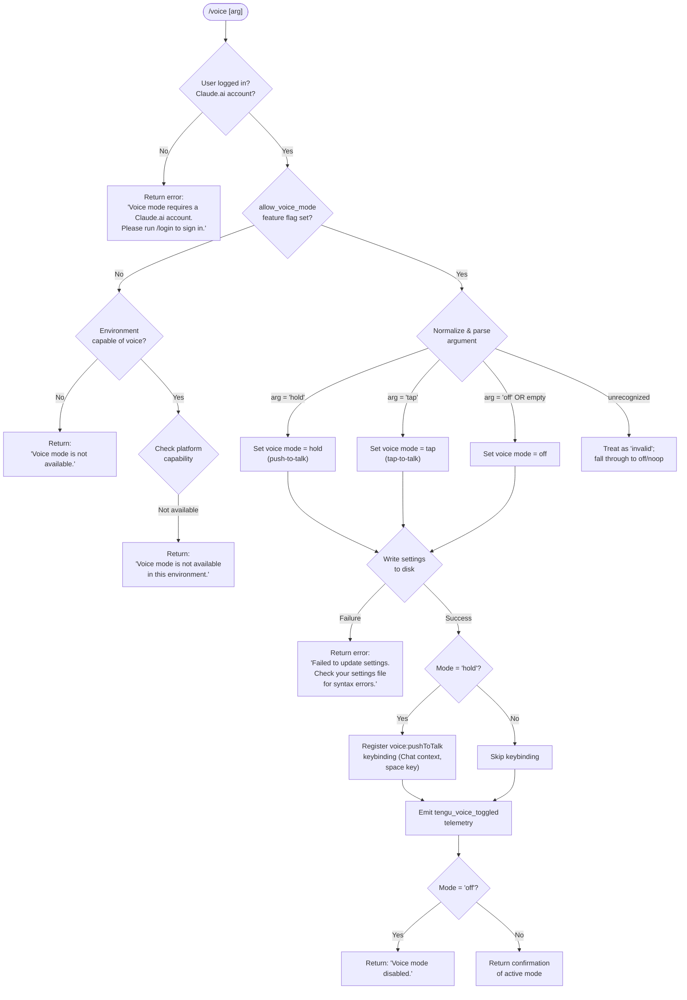

# `/voice`

> Analysis basis: CC v2.1.196 bundle.js (AST extraction + Claude interpretation)
> Minimum version: v2.1.196

---

## Overview

The `/voice` command toggles voice mode in Claude Code, cycling between three operating sub-modes — `hold` (push-to-talk), `tap` (tap-to-talk), and `off` (disabled). It validates authentication and platform feature flags before applying the requested state, persisting the result to settings and optionally registering a push-to-talk keybinding.

---

## Registration

| Field | Value |
|---|---|
| type | `local` |
| name | `voice` |
| description | `Toggle voice mode` |
| argumentHint | `[hold\|tap\|off]` |
| supportsNonInteractive | `false` |
| isHidden | `null` |
| module_id | `jic` |
| load_inline | `true` |
| loc_byte | `13376203` |
| loc_byte_end | `13376445` |
| loc_line | `9183` |
| arbor_handler.name | `gnm` |
| arbor_handler.fqn | `claude-2.1.196::gnm` |
| arbor_handler.kind | `AsyncFunction` |
| arbor_handler.resolution_path | `module_id` |
| arbor_handler.n_hits | `1` |

Analysis basis: CC v2.1.196 bundle.js:+13376203

---

## Input Branching

The command has 5+ distinct branches (authentication check, feature availability check, argument parsing across `hold`/`tap`/`off`/`invalid`, settings-write failure, and environment-capability check), so a Mermaid flowchart is used.



---

## Behavioral Spec

### 1. Handler Entry — `voiceCommandHandler` (`gnm`)

The primary handler is the async function `gnm`, resolved via Arbor's `module_id` path from module `jic`.

Analysis basis: CC v2.1.196 bundle.js:+13373603

```
async function voiceCommandHandler(args, context):
    // Step 1: Load settings and check authentication
    settings = await loadSettingsFromDisk()          // kr → O8 → vDr chain
    authState = await getAuthenticationState(settings)  // aE chain

    if not authState.hasClaudeAiAccount:
        return textResult(
            "Voice mode requires a Claude.ai account. " +
            "Please run /login to sign in."
        )

    // Step 2: Check feature flag
    featureFlags = await getFeatureFlags(authState)   // Gs chain via acr/vTt
    voiceAllowed = featureFlags.includes("allow_voice_mode")  // loc_byte: 13362470

    if not voiceAllowed:
        capabilityCheck = checkEnvironmentVoiceCapability()   // O6 chain
        if capabilityCheck.unavailable:
            return textResult("Voice mode is not available.")  // loc_byte: 13373823
        if capabilityCheck.platformUnsupported:
            return textResult(
                "Voice mode is not available in this environment."
            )   // loc_byte: 13374493

    // Step 3: Parse and normalize the argument
    rawArg = args.trim()                              // e.trim, loc_byte: 13373944
    normalizedArg = normalizeVoiceArg(rawArg)        // mnm, loc_byte: 13373877

    // Step 4: Apply the requested mode
    targetMode = resolveVoiceMode(normalizedArg)
    // targetMode ∈ {"hold", "tap", "off", "invalid"}

    // Step 5: Persist to settings
    writeResult = await saveVoiceModeSetting(targetMode)  // no chain
    if writeResult.failed:
        return textResult(
            "Failed to update settings. " +
            "Check your settings file for syntax errors."
        )   // loc_byte: 13374111

    // Step 6: Conditional keybinding registration
    if targetMode == "hold":
        registerKeybinding(
            action = "voice:pushToTalk",   // loc_byte: 13375462
            context = "Chat",              // loc_byte: 13375481
            key = "space"                  // loc_byte: 13375488
        )    // ov chain → v2t

    // Step 7: Telemetry
    emitTelemetry("tengu_voice_toggled", {mode: targetMode})  // loc_byte: 13374194

    // Step 8: Return result message
    if targetMode == "off":
        return textResult("Voice mode disabled.")   // loc_byte: 13374249

    return textResult(confirmationMessage(targetMode))
```

### 2. Argument Normalization — `normalizeVoiceArg` (`mnm`)

Analysis basis: CC v2.1.196 bundle.js:+13373473

```
function normalizeVoiceArg(raw):
    trimmed = raw.trim()
    // Maps string input to canonical mode token
    switch trimmed:
        case "hold":    return "hold"   // loc_byte: 13373520
        case "tap":     return "tap"    // loc_byte: 13373532
        case "off":     return "off"    // loc_byte: 13373543
        default:        return "invalid" // loc_byte: 13373564
    // Empty string falls through to "invalid" → treated as off/noop
```

### 3. Feature Flag Check — `checkVoiceFeatureFlag` (`acr` → `Gs`)

Analysis basis: CC v2.1.196 bundle.js:+13362467

```
function checkVoiceFeatureFlag(featureSet):
    // Checks for the "allow_voice_mode" capability in the resolved feature set
    // Feature set is fetched from the server-side policy layer (Gs chain)
    // Returns boolean
    return featureSet.includes("allow_voice_mode")   // loc_byte: 13362470
```

### 4. Authentication Pre-check — `requireClaudeAiLogin` (`icr` → `aE`)

Analysis basis: CC v2.1.196 bundle.js:+13362403

```
function requireClaudeAiLogin(settings):
    // Resolves OAuth token or API key state
    // For voice, specifically requires a Claude.ai (OAuth) session,
    // not just an ANTHROPIC_API_KEY environment variable
    authProfile = resolveAuthProfile(settings)   // aE → TH checks ANTHROPIC_API_KEY, etc.
    if authProfile.type != "firstParty":         // loc_byte: 2153431
        return {authenticated: false}
    return {authenticated: true, profile: authProfile}
```

### 5. Settings Persistence — `saveVoiceModeSetting` (`no`)

Analysis basis: CC v2.1.196 bundle.js:+1349699

```
async function saveVoiceModeSetting(mode):
    // Acquires config lock (ntn/mkt), reads current config,
    // merges voice mode field, writes atomically with fsync
    configPath = getSettingsPath()   // X5 → ".claude/settings.json"
    currentConfig = readConfigWithLock(configPath)
    currentConfig.voiceMode = mode
    result = writeConfigWithLock(configPath, currentConfig)
    // On parse error during re-read, emits tengu_config_auto_repaired
    // On auth-loss detected, emits tengu_config_auth_loss_prevented and aborts
    return result
```

### 6. Keybinding Registration — `registerVoicePushToTalkBinding` (`ov`)

Analysis basis: CC v2.1.196 bundle.js:+13375459

```
function registerVoicePushToTalkBinding():
    // Only called when mode == "hold"
    // Loads or creates keybindings.json (v2t chain)
    bindingConfig = loadKeybindingConfig()   // v2t → reads "keybindings.json"
    pushToTalkEntry = {
        action:  "voice:pushToTalk",   // loc_byte: 13375462
        context: "Chat",               // loc_byte: 13375481
        key:     "space"               // loc_byte: 13375488
    }
    if not bindingConfig.has(pushToTalkEntry):
        bindingConfig.add(pushToTalkEntry)
        persistKeybindings(bindingConfig)
    // Deduplication guard: QVi.has / QVi.add checks at loc_byte: 4031200, 4031211
    // On parse error emits tengu_config_parse_error (loc_byte: 14160796)
    // On invalid structure emits tengu_keybinding_customization_release (loc_byte: 4021705)
```

### 7. Microphone Permission Guidance

Analysis basis: CC v2.1.196 bundle.js:+13375000

When voice mode is activated on macOS and microphone access has not been granted, the handler surfaces the path:

```
permissionGuidancePath = "System Settings → Privacy & Security → Microphone"
// loc_byte: 13375000
```

This string is included in the user-facing message when platform capability checks detect `no_permissions` status.

---

## State & Side Effects

| Item | Detail |
|---|---|
| Telemetry — `tengu_voice_toggled` | Emitted on every successful mode change; carries the resolved mode. (bundle.js:+13374194) |
| Telemetry — `tengu_feature_ok` | Emitted by the feature-flag resolution path on success. (bundle.js:+1028610) |
| Telemetry — `tengu_feature_bad` | Emitted on feature-flag resolution failure. (bundle.js:+1028677) |
| Telemetry — `tengu_feature_sad` | Emitted on soft/degraded feature path. (bundle.js:+1028758) |
| Telemetry — `tengu_keybinding_customization_release` | Emitted when keybinding format is upgraded or migrated. (bundle.js:+4021705) |
| Telemetry — `tengu_custom_keybindings_loaded` | Emitted when user keybinding config is loaded successfully. (bundle.js:+4022125) |
| Telemetry — `tengu_keybinding_fallback_used` | Emitted when the requested keybinding action is not found and a fallback is applied. (bundle.js:+4031224) |
| Telemetry — `tengu_config_parse_error` | Emitted when settings/keybinding JSON cannot be parsed. (bundle.js:+14160796) |
| Telemetry — `tengu_config_lock_contention` | Emitted when the config lock takes longer than expected (>100 ms). (bundle.js:+14157063) |
| Telemetry — `tengu_config_stale_write` | Emitted when a stale write is detected during config save. (bundle.js:+14157199) |
| Telemetry — `tengu_config_auto_repaired` | Emitted when the config is auto-repaired from cache after a parse error. (bundle.js:+14157576) |
| Telemetry — `tengu_config_auth_loss_prevented` | Emitted when a write is aborted to prevent wiping auth from `~/.claude.json`. (bundle.js:+14157906) |
| Telemetry — `tengu_config_fallback_write` | Emitted when a fallback (global) write path is used. (bundle.js:+14156679) |
| Telemetry — `tengu_daemon_control` | Emitted by the daemon management layer reached transitively. (bundle.js:+18033163) |
| Settings write | Persists `voiceMode` field to `.claude/settings.json` (or `settings.local.json`) atomically with file locking and fsync. |
| Keybinding registration | When mode is `hold`, writes or updates `keybindings.json` to add a `voice:pushToTalk` binding for the `space` key in the `Chat` context. |
| appState changes | Voice mode state is updated in the in-process app state after successful disk write. |
| Sound | No direct audio side effect at command time; push-to-talk audio capture is activated at runtime by the registered keybinding, not by this command directly. |

---

## Version History

| Version | Change |
|---|---|
| v2.1.196 | Initial analysis |

---

## Common Mistakes

1. **Running `/voice` without a Claude.ai account**: The command requires OAuth authentication via a Claude.ai account. Setting `ANTHROPIC_API_KEY` alone is not sufficient — you must first run `/login` to establish an OAuth session.

2. **Using `/voice` in a non-interactive or scripted context**: `supportsNonInteractive` is `false`; invoking this command in non-interactive mode (e.g., piped input or `--print` flag) will not work as expected.

3. **Expecting `/voice` to immediately capture audio**: The command toggles the mode and registers the keybinding, but actual push-to-talk audio capture only activates when the `space` key is held in the `Chat` context — the command itself does not start a recording session.

4. **Passing an unrecognized argument**: Any argument other than `hold`, `tap`, or `off` is normalized to `"invalid"` and treated as a no-op or off. There is no error message for unrecognized values beyond the argument hint `[hold|tap|off]`.

5. **Assuming voice mode is universally available**: The `allow_voice_mode` feature flag must be present in the server-returned feature set. In environments without a network connection or where the flag is not granted, the command returns `"Voice mode is not available."` regardless of local settings.

6. **Corrupt settings file**: If `.claude/settings.json` contains syntax errors, the settings write will fail and the command returns `"Failed to update settings. Check your settings file for syntax errors."` — voice mode will not be changed.

---

## Appendix — Identifier Mapping

> For bundle debugging only. Identifiers change across versions.

| Identifier | Role |
|---|---|
| `gnm` | Primary async handler for `/voice` (Arbor-resolved; `claude-2.1.196::gnm`) |
| `vTt` | Feature-flag resolution orchestrator; called by handler before auth |
| `icr` | Authentication pre-check wrapper; validates Claude.ai account presence |
| `aE` | Auth state resolver; reads OAuth / API-key profile |
| `Hd` | Low-level auth/profile helper |
| `cb` | OAuth profile builder; sets `profile-implicit`, `user_oauth` fields |
| `Lc` | First-party auth helper; uses `"firstParty"` literal |
| `aI` | Auth identity accessor |
| `TH` | Auth token resolver; checks `ANTHROPIC_API_KEY`, `apiKeyHelper`, `none` |
| `AUt` | Auxiliary auth utility |
| `Jst` | Auth state struct constructor |
| `KS` | Capability set resolver (called by `icr`) |
| `UZt` | Feature-flag store reference |
| `acr` | Feature-flag availability checker (voice gate) |
| `Gs` | Feature-flag set evaluator; checks `allow_voice_mode`, `allow_product_feedback` |
| `OFi` | Feature-flag initializer |
| `GF` | Feature-flag getter |
| `zi` | Feature-flag filter utility |
| `J_e` | Feature-flag join/format helper |
| `N6` | Feature-flag node resolver |
| `O6` | Environment voice capability checker (string normalization path) |
| `kr` | Settings loader entry point |
| `O8` | Settings-load orchestrator (emits `loadSettingsFromDisk_start`/`_end`) |
| `m0` | Settings memory snapshot helper |
| `ga` | Settings load helper; uses `perf_hooks`, `process.memoryUsage` |
| `I5` | Module `require` wrapper inside settings loader |
| `vDr` | Core settings load engine; reads flag/policy/user/project/local layers |
| `Ln` | Settings log writer; uses `appendFileSync`, `mkdirSync` |
| `gMt` | Settings flag accumulator |
| `BLs` | Policy settings loader |
| `Hwe` | User settings file locator |
| `P8` | Per-layer settings parser |
| `$Ls` | SDK inline settings handler |
| `I3` | Settings registry initializer |
| `dr` | Settings default provider |
| `no` | Settings persistence / config save orchestrator |
| `Lg` | Config path + registry helper |
| `CDr` | Config diff/write helper |
| `nw` | Config file writer (uses `Ste`) |
| `Ste` | File read/write utility with encoding detection |
| `Bd` | Path resolution and `realpathSync` helper |
| `T` | Platform/OS detection helper |
| `_Ts` | File stat + type checker; EISDIR / ERR_NOT_REGULAR_FILE / ERR_FILE_TOO_LARGE |
| `nmn` | Config directory initializer |
| `Sn` | Error normalizer (`ENOENT`, etc.) |
| `rn` | Error code map |
| `MMr` | Config cache timestamp setter |
| `VBe` | Config path validator |
| `$gn` | Settings path resolver (`.claude/settings.json`) |
| `mkt` | Atomic file write helper (temp + rename + fsync) |
| `u` | Daemon stop utility context |
| `xe` | Feature-ok telemetry emitter (`tengu_feature_ok`) |
| `ke` | Feature-bad telemetry emitter (`tengu_feature_bad`) |
| `$F` | Daemon control signal sender |
| `Wj` | Process exit / race condition guard |
| `rtt` | Rename error handler (EINVAL / EPERM etc.) |
| `tkr` | Atomics-based wait/lock helper |
| `KNu` | `Atomics.wait` wrapper |
| `JTs` | `Object.defineProperty` helper for file metadata |
| `he` | String coercion / code property helper |
| `Me` | JSON serializer (`JSON.stringify`) |
| `n_` | Cache clear helper (`Hin.clear`, `Qyr.clear`) |
| `Gvs` | Git-ignore / gitconfig integration helper |
| `Ot` | Async-store reader (uses `emn.getStore`) |
| `tmn` | Store getter with fallback |
| `gMr` | Git metadata reader |
| `Kmn` | Git-ignore checker |
| `Gr` | `git check-ignore` executor |
| `PFu` | Global gitconfig / core.excludesfile resolver |
| `Fvs` | `git ls-files` tracker |
| `Bvs` | Gitignore append helper |
| `X5` | `.claude` directory path joiner |
| `wt` | Feature-sad telemetry emitter (`tengu_feature_sad`) |
| `V` | Telemetry base emitter |
| `Oe` | Telemetry event wrapper |
| `Re` | Error logger / zet pusher |
| `er` | Error constructor helper |
| `ct` | String coercion helper |
| `_Nu` | FIFO error queue (`zfn`) manager |
| `a` | Spend-blocked / billing error handler |
| `kge` | JSON stringify + spend response helper |
| `l` | Conversation log / output entry builder (`eoc`) |
| `eoc` | Output context writer; calls `Zte`, `Date.now`, `Ks`, `HZt`, `Me` |
| `Zte` | Text output formatter |
| `XHe` | Inline text trim helper |
| `Ks` | Mfd store accessor |
| `HZt` | Daemon status path builder (`daemon.status.json`) |
| `ov` | Keybinding registration orchestrator |
| `FDn` | Keybinding file loader |
| `v2t` | Keybinding config parser and validator |
| `_eo` | Keybinding entry deserializer |
| `zV` | Keybinding release-version gate |
| `fc` | Keybinding context filter |
| `Bye` | `keybindings.json` path resolver |
| `Gt` | JSON.parse wrapper |
| `NDn` | Keybinding structure validator (array check) |
| `DDn` | Keybinding entry builder (`Object.entries`) |
| `WVi` | Keybinding telemetry helper |
| `heo` | Keybinding key-sequence parser (regex exec + slice) |
| `Heo` | Keybinding deduplication and merge |
| `BDn` | Keybinding action-format printer |
| `beo` | Keybinding block formatter |
| `Aeo` | Keybinding action string builder |
| `PVi` | Keybinding map-to-display helper |
| `peo` | Keybinding display string builder |
| `qe` | Keybinding fallback telemetry emitter (`tengu_keybinding_fallback_used`) |
| `aQe` | Locale/language check helper (`"en"` literal) |
| `Dt` | Settings-sync watcher orchestrator |
| `sqo` | Settings watch subscriber |
| `lIt` | Settings file reader with backup support |
| `V5` | Settings version prefix stripper |
| `lqo` | Settings backup directory scanner |
| `uqo` | Settings backup path builder |
| `Ldm` | Settings file watcher registration |
| `bkt` | File watch setup with `mvs.watchFile` |
| `ege` | Watch event handler |
| `vi` | Hotkey / shortcut registrar (`fis.register`) |
| `Hn` | Global config save orchestrator |
| `ntn` | Config write with lock, stat, backup, and copy |
| `Yli` | Config object merger (`Object.assign`) |
| `E4r` | Config schema validator (`zli`) |
| `cIt` | Config integrity checker |
| `zUe` | Auth-loss detection guard |
| `iqo` | Config entry enumerator (`Object.entries`) |
| `etn` | Config save timestamp recorder |
| `Zen` | Config re-read and compare helper |
| `Tdr` | Config fallback write path (save_global) |
| `mnm` | Voice argument normalizer (trim + switch on `hold`/`tap`/`off`/`invalid`) |

---

Note: index built via Arbor fallback; some signals (telemetry, literals) may be missing — see arbor-fallback.js.