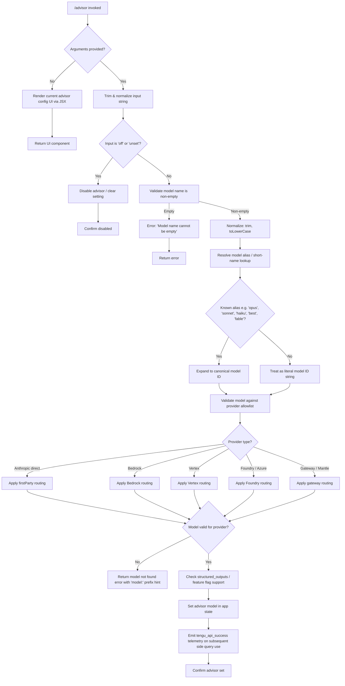

# `/advisor`

> Analysis basis: CC v2.1.197 bundle.js (AST extraction + Claude interpretation)
> Minimum version: v2.1.197

---

## Overview

The `/advisor` command enables Claude Code to consult a stronger or more capable model at strategically chosen moments during a session. It works by routing a "side query" to a separately configured advisor model, allowing the primary agent to leverage a higher-capability model for difficult sub-problems without switching the main session's model context. The command manages model name validation, normalization, provider routing, and JSX-based UI rendering for its configuration flow.

---

## Registration

| Field | Value |
|---|---|
| type | `local-jsx` |
| name | `advisor` |
| description | `Let Claude consult a stronger model at key moments` |
| loc_byte | `13051102` |
| loc_byte_end | `13051358` |
| loc_line | `9028` |
| argumentHint | `[ ... ]` |
| isHidden | `null` (not hidden) |
| module_id | `$tc` |
| load_inline | `true` |
| arbor_handler.name | `rXf` |
| arbor_handler.fqn | `claude-2.1.197::rXf` |
| arbor_handler.kind | `AsyncFunction` |
| arbor_handler.resolution_path | `module_id` |
| arbor_handler.n_hits | `2` |

Analysis basis: CC v2.1.197 bundle.js:+13051102

---

## Input Branching

The command exhibits more than three distinct execution paths depending on argument presence, model name validity, provider type, and current advisor state. A Mermaid flowchart is used to capture this branching.



Analysis basis: CC v2.1.197 bundle.js:+13050580, +13050616, +13050714, +13050728, +9255266

---

## Behavioral Spec

### Primary Handler — `advisorCommandHandler` (`rXf`)

The handler is an `AsyncFunction` resolved via `module_id` → `$tc`.

```
async function advisorCommandHandler(commandInput, appContext):
    rawArg = commandInput.trim()                        // +13050580

    if rawArg is empty:
        return renderAdvisorConfigUI(appContext)        // +13050616 (Ej.jsx call)

    normalized = normalizeModelInput(rawArg)            // +13050714 ($o call)
    resolvedModel = resolveAdvisorModel(normalized, appContext)  // +13050728 (rKt call)

    if resolvedModel is error:
        return renderErrorUI(resolvedModel.message)

    storeAdvisorModel(resolvedModel, appContext)        // appState side-effect
    return renderAdvisorConfigUI(appContext)            // updated UI
```

Analysis basis: CC v2.1.197 bundle.js:+13050580

---

### Sub-feature: Model Input Normalization — `normalizeModelInput` (`$o`)

Converts raw user input into a canonical, provider-ready model identifier.

```
function normalizeModelInput(rawInput):
    trimmed = rawInput.trim()                          // +2324782
    lowercased = trimmed.toLowerCase()                 // +2324793

    // Alias expansion
    if lowercased == "best":                           // +2325085
        return expandBestAlias()
    if lowercased == "opus":                           // +2310854
        return expandOpusAlias()
    if lowercased == "sonnet":                         // +2311033
        return expandSonnetAlias()
    if lowercased == "haiku":                          // +2311214
        return expandHaikuAlias()
    if lowercased contains "opusplan":                 // +2324926
        return expandOpusPlanAlias()
    if lowercased contains "[1m]":                     // +2324910
        return expandLargeContextVariant()

    // Provider prefix normalization
    if not lowercased.startsWith("claude-"):           // +2320880
        lowercased = prependClaudePrefix(lowercased)

    // Strip/replace provider-specific inference profile ARNs
    replaced = applyProviderReplacements(lowercased)   // Ca +2324821, bF +2324949

    // Validate known model list membership
    isKnown = checkModelAllowlist(lowercased)          // x0 +2324839
    if not isKnown:
        warn or annotate as nonconforming               // "nonconforming" +2329722

    return buildModelDescriptor(lowercased, ...)       // B3e +2324874, nS +2324952
```

Analysis basis: CC v2.1.197 bundle.js:+2324782

---

### Sub-feature: Model Name Validation & Side-Query Routing — `validateAndRouteModel` (`rKt`)

Called after normalization; performs final validation and writes the advisor setting.

```
async function validateAndRouteModel(normalizedModel, appContext):
    trimmed = normalizedModel.trim()                   // +9255229

    if trimmed is empty:
        throw Error("Model name cannot be empty")      // +9255266

    // Check against known bad model name list
    lc = trimmed.toLowerCase()                         // +9255414
    if knownBadModels.has(lc):                         // BLo.has +9255535
        return errorResult("model validation failed")

    // Mark this model as seen in session set
    knownModels.set(lc, ...)                           // BLo.set +9255743

    // Perform model validation via side query
    validationResult = await performModelValidation(trimmed, appContext) // GU +9255580

    // Build alias mapping for display
    aliasMap = buildAliasMap(...)                      // Jlf +9255784

    return { model: trimmed, aliases: aliasMap, valid: validationResult }
```

Key string constants from this path:
- `"Model name cannot be empty"` (bundle.js:+9255266)
- `"model_validation"` — telemetry category (bundle.js:+9255630)
- `"ephemeral"` — cache control mode used during validation (bundle.js:+9255724)
- `"Hi"` — cache breakpoint marker (bundle.js:+9255699)

Analysis basis: CC v2.1.197 bundle.js:+9255229

---

### Sub-feature: Side-Query Dispatch — `dispatchSideQuery` (`GU`)

Orchestrates the actual HTTP round-trip to the advisor model.

```
async function dispatchSideQuery(modelDescriptor, messages, appContext):
    // Set request classification
    requestType = "side_query"                         // +8709292

    // Capability checks
    supportsStructuredOutputs = checkFeatureFlag(      // +8709420
        "structured_outputs", modelDescriptor)

    // Token / hash deduplication
    contentHash = computeHash(messages,                // aCo +8709492
        algorithm="sha256", encoding="hex")            // +8708297, +8708324

    // Build message array, apply lone-surrogate sanitisation
    sanitizedMessages = sanitizeMessages(messages)     // lone surrogate → tengu_lone_surrogate_sanitized

    // Truncation: Math.min guard on message count     // +8710141
    truncatedMessages = truncate(sanitizedMessages, Math.min(...))

    // Prompt-cache configuration (1h TTL)             // tengu_prompt_cache_1h_config +13906280
    cacheParams = buildCacheParams("1h")               // +8710183

    // HTTP fetch via core API client
    response = await apiClient.fetch(                  // hV +8709260
        model = modelDescriptor,
        messages = truncatedMessages,
        cacheControl = cacheParams,
        headers = buildHeaders(appContext))

    // Telemetry on success
    emit("tengu_api_success")                          // +8710965

    return parseResponse(response)
```

Header constants used by side queries:
- `"x-app"` (bundle.js:+3057033)
- `"User-Agent"` (bundle.js:+3057061)
- `"X-Claude-Code-Session-Id"` (bundle.js:+3057079)
- `"x-client-app"` (bundle.js:+3057203)
- `"x-claude-code-agent-id"` (bundle.js:+3057237)
- `"x-claude-code-parent-agent-id"` (bundle.js:+3057300)

Analysis basis: CC v2.1.197 bundle.js:+8709247

---

### Sub-feature: Model Alias Expansion — `buildAliasMap` (`Jlf` / `Xlf`)

Maps short hyphen-separated aliases to their underscore equivalents and full model IDs.

```
function buildAliasMap(modelName):
    entries = []
    name_lc = modelName.toLowerCase()                 // +9256554

    alias_pairs = [
        ("fable-5",   "fable_5",   "claude-fable-5"),
        ("opus-4-8",  "opus_4_8",  "claude-opus-4-8"),
        ("opus-4-7",  "opus_4_7",  "claude-opus-4-7"),
        ("opus-4-6",  "opus_4_6",  "claude-opus-4-6"),
        ("opus-4-5",  "opus_4_5",  "claude-opus-4-5"),
        ("sonnet-5",  "sonnet_5",  "claude-sonnet-5"),
        ("sonnet-4-6","sonnet_4_6","claude-sonnet-4-6"),
        ("sonnet-4-5","sonnet_4_5","claude-sonnet-4-5"),
    ]

    for (short_hyphen, short_underscore, canonical) in alias_pairs:
        if name_lc.includes(short_hyphen):             // +9256573
            entries.push({ alias: short_underscore, canonical })

    return String(entries)                             // Jlf String +9256504
```

Analysis basis: CC v2.1.197 bundle.js:+9255839

---

### Sub-feature: Provider-Specific Model Name Resolution — `resolveProviderModel` (`Ew` / `oo` / `c_`)

Handles provider-specific identifier transforms (Bedrock inference profile ARNs, Foundry resource IDs, Vertex model names, etc.).

```
function resolveProviderModel(modelId, providerContext):
    lc = modelId.toLowerCase()                        // c_ +2321640

    // Bedrock: application-inference-profile stripping
    if lc.includes("application-inference-profile"):  // +2323028
        lc = lc.slice(...)                            // +2321770

    // Vertex: regional prefix handling
    if lc.startsWith("us"):                           // +2321716
        lc = lc.slice(...)

    // Check for mythos preview model
    if lc.includes("claude-mythos-preview"):          // +3069649
        return specialHandleMythosPreview(lc)

    // Foundry: unknown-foundry-resource fallback
    if not matchesKnownModel(lc):
        lc = "unknown-foundry-resource"               // +2385126

    // Cross-reference with provider allowlist
    descriptor = buildProviderDescriptor(lc, providerContext)
    return descriptor
```

Known canonical model IDs referenced in resolution path (bundle.js literals):
- `"claude-fable-5"` (+2308603), `"claude-mythos-5"` (+2321889)
- `"claude-opus-4-8"` (+2321946) through `"claude-opus-4-0"` (+2322263)
- `"claude-sonnet-5"` (+2322295), `"claude-sonnet-4-6"` (+2322352), `"claude-sonnet-4-5"` (+2322413), `"claude-sonnet-4-0"` (+2322508)
- `"claude-haiku-4-5"` (+2322542)
- `"claude-3-7-sonnet"` (+2322601), `"claude-3-5-sonnet"` (+2322662), `"claude-3-5-haiku"` (+2322723)
- `"claude-3-opus"` (+2322782), `"claude-3-sonnet"` (+2322835), `"claude-3-haiku"` (+2322892)
- `"claude-mythos-preview"` (+3069649)

Provider type strings: `"firstParty"` (+2154890), `"gateway"` (+2154006), `"bedrock"` (+2154063), `"foundry"` (+2154113), `"anthropicAws"` (+2154169), `"mantle"` (+2154223), `"vertex"` (+2154271)

Analysis basis: CC v2.1.197 bundle.js:+3069556

---

### Sub-feature: Disable / Unset Advisor

When the argument is `"off"` or `"unset"`, the handler takes a short-circuit path:

```
function disableAdvisor(appState):
    if arg == "off" or arg == "unset":               // +13050646, +13050657
        clearAdvisorModel(appState)
        renderConfirmationUI("Advisor disabled")
        return
```

Analysis basis: CC v2.1.197 bundle.js:+13050646

---

## State & Side Effects

| Item | Detail |
|---|---|
| Telemetry — `tengu_api_success` | Fired on successful side-query completion (bundle.js:+8710965) |
| Telemetry — `tengu_lone_surrogate_sanitized` | Fired when lone Unicode surrogates are cleaned from messages sent to advisor (bundle.js:+8710661) |
| Telemetry — `tengu_prompt_cache_1h_config` | Fired when 1-hour prompt-cache TTL is applied to the advisor request (bundle.js:+13906280) |
| Telemetry — `tengu_daemon_yield` | Fired when background daemon yields to foreground during advisor dispatch (bundle.js:+18058666) |
| Telemetry — `tengu_bg_dispatch_sigkill_escalate` | Background worker escalation during advisor model fetch (bundle.js:+18036865) |
| Telemetry — `tengu_bg_dispatch_low_mem` | Fired when low memory is detected during background dispatch (bundle.js:+18037455) |
| Telemetry — `tengu_feature_ok` / `tengu_feature_bad` | Feature flag check result for the advisor capability (bundle.js:+1028779, +1028846) |
| appState changes | Stores the resolved advisor model identifier in persistent app state; cleared on `off`/`unset` |
| Model validation set | `BLo` — a `Set`/`Map` tracking validated model names within the session to avoid redundant API round-trips (bundle.js:+9255535, +9255743) |
| HTTP side channel | Opens a separate API request classified as `"side_query"` (bundle.js:+8709292); does not disturb the main conversation thread |
| Prompt caching | Configures `"cache_control"` with TTL `"1h"` on advisor requests (bundle.js:+8711464, +8710183) |
| Authentication | Re-uses the session OAuth token; logs `"[API:auth] OAuth token check starting"` / `"complete"` (bundle.js:+3057616, +3057670) |
| Error on auth expiry | Emits `"Cloud gateway token expired…"` or `"Cloud gateway session expired…"` messages to the user (bundle.js:+3058237, +3058316) |
| Hook registration | <!-- TODO: not found in depth-2 traversal; needs --depth 4 --> |
| Sound | <!-- TODO: not found in depth-2 traversal; needs --depth 4 --> |

---

## Version History

| Version | Change |
|---|---|
| v2.1.197 | Initial analysis — `/advisor` command with model alias expansion, side-query dispatch, and JSX config UI |

---

## Common Mistakes

1. **Providing a model short-name that matches no alias** — e.g. typing `/advisor opus-4` instead of `/advisor opus` or `/advisor opus-4-5`. The alias resolver matches exact tier tokens; partial strings may fall through to the literal-ID path and fail validation with a `"model:"` prefix error (bundle.js:+9256305).

2. **Forgetting to re-run `/advisor` after `/login`** — if the gateway session expires, the advisor model setting is retained in appState but subsequent side queries will fail with `"Cloud gateway session expired"` (bundle.js:+3058316). Use `/login` then re-confirm the advisor setting.

3. **Using `/advisor off` expecting the main model to change** — `off`/`unset` only clears the advisor overlay; the primary session model is unaffected (bundle.js:+13050646).

4. **Supplying a Bedrock inference-profile ARN containing `"application-inference-profile"`** — the resolver strips this prefix automatically (bundle.js:+2323028), so passing the full ARN is redundant and may produce unexpected model-ID strings.

5. **Expecting real-time streaming from the advisor** — side queries are dispatched as independent non-streaming requests with a 10-second timeout (bundle.js:+10000 at +2381646); the advisor response is injected into context, not streamed to the terminal.

---

## Appendix — Identifier Mapping

> For bundle debugging only. Identifiers change across versions.

| Identifier | Role |
|---|---|
| `rXf` | Primary async handler for `/advisor` command |
| `$o` | Model input normalization function |
| `rKt` | Model name validation and side-query setup |
| `GU` | Side-query dispatch orchestrator |
| `hV` | Core API client / HTTP fetch layer |
| `Fa` | Message/context builder for API requests |
| `iOe` | Advisor context wrapper / prompt assembler |
| `Wvo` | Advisor-specific context shaping helper |
| `JHt` | User-facing model filter / display builder |
| `QKn` | Model-to-display-string mapper |
| `Jlf` | Alias map builder (outer) |
| `Xlf` | Alias map builder (inner, per-model) |
| `Ew` | Provider-aware model name resolver |
| `oo` | Cross-provider model descriptor builder |
| `c_` | Model ID string normalizer (lowercase, slice, replace) |
| `VPt` | Model validation against provider allowlist |
| `B3e` | Model descriptor construction (tier/variant) |
| `U9r` | Model tier resolver (opus/sonnet/haiku routing) |
| `Kd` | Provider-model pairing validator |
| `Ybn` | Provider capability checker |
| `HY` | First-party model routing helper |
| `IY` | Model ID string replacer |
| `nS` | Sonnet-family model builder |
| `D3` | Opus-family model builder |
| `N_` | Haiku/best-family model builder |
| `NLe` | Haiku alias resolver |
| `Kbn` | Sonnet alias resolver |
| `B9r` | Opus alias resolver |
| `sli` | Capability/slot list builder |
| `Yle` | Model slot descriptor |
| `zHe` | Array-based model feature checker |
| `KHe` | Model inclusion checker |
| `not` | Negated inclusion checker |
| `zbn` | Model descriptor with exclusion logic |
| `Hr` | Model registry lookup |
| `Su` | Provider support resolver |
| `pw` | Model property writer |
| `bF` | Model ID replacement helper |
| `Ca` | String cleaning / sanitization helper |
| `x0` | Allowlist membership checker |
| `ud` | Provider-aware model URI builder |
| `qle` | Model tier include-list checker |
| `F3e` | Model descriptor formatter |
| `gHd` | Case-normalized model name extractor |
| `VP` | Provider interface abstraction |
| `l_` | API layer selector / routing helper |
| `aPt` | Auth parameter builder |
| `kfd` | Anthropic-prefix model detector |
| `V8` | Case-insensitive model value mapper |
| `rPd` | Model capability registry checker |
| `cf` | Request type classifier |
| `Rt` | Request metadata assembler |
| `vY` | Session-level context accessor |
| `Cqr` | Header field parser (split/trim/indexOf) |
| `Hi` | Cache control marker |
| `qY` | Error reporter (issue URL injector) |
| `z9r` | URL encoder for model paths |
| `T` | Debug/log level router |
| `fh` | OAuth token refresher |
| `pli` | Boolean flag coercion helper |
| `aE` | Auth environment resolver |
| `km` | Key-material accessor |
| `jDd` | Store-based session retriever |
| `vr` | Conversation state reader |
| `ayn` | Proxy auth helper executor |
| `XDd` | Request deduplication / UUID tracker |
| `E3` | Bundle/version info accessor |
| `xg` | Token manager |
| `JDd` | Outgoing request store handler |
| `VDd` | Response stream parser |
| `VLe` | Rate-limit / back-off scheduler |
| `DSr` | Timestamp helper |
| `lUt` | Response header case-normalizer |
| `Pxe` | SDK error logger |
| `Zwn` | Request context merger |
| `mw` | Thread-context annotator |
| `ub` | OAuth credential builder |
| `qLe` | WIF token exchange helper |
| `got` | WIF credential resolver |
| `h` | Background worker / daemon manager |
| `Tns` | Daemon socket connector |
| `Lns` | Daemon lifecycle manager |
| `it` | Task notification dispatcher |
| `CYe` | macOS memory-pressure monitor |
| `N6e` | State-file reader/writer |
| `ke` | Error logger with retry tracking |
| `Y` | MCP update applier |
| `L4e` | Model family classifier (`claude-3-` prefix) |
| `bN` | Provider registry lookup |
| `Xle` | Foundry resource resolver |
| `N4r` | Foundry model ID normalizer |
| `Utf` | Message role detector (user/text) |
| `aCo` | SHA-256 content hash builder |
| `nTn` | Session-ID header builder |
| `_l` | String coercion helper |
| `eTn` | AsyncLocalStorage context accessor |
| `FLe` | Session subagent flag injector |
| `Ukn` | Request-level auth header injector |
| `PVe` | Prompt-cache 1h configuration builder |
| `Ao` | Agent type / thread selector |
| `mAr` | Memory-dir relevance flag setter |
| `gAr` | Auto-mode flag setter |
| `XP` | HIPAA-aware request wrapper |
| `Fqr` | HIPAA model filter |
| `w4e` | Queue-8 model builder |
| `L` | Away-summary scheduler |
| `vze` | App state accessor |
| `yKt` | Local-workflow task tracker |
| `IRe` | Loop-wakeup state checker |
| `pRm` | System-message builder |
| `YOc` | Last-message accessor |
| `JOc` | Tool-result message builder |
| `HGt` | Away-summary generator |
| `rmc` | Random UUID generator |
| `Etl` | Token-budget calculator |
| `lLn` | Temperature-flag injector |
| `yw` | Message mapper |
| `JRe` | Conversation runner |
| `w6` | Random-bytes nonce generator |
| `Nc` | Conversation context packer |
| `Me` | JSON serializer |
| `dln` | Message deduplicator |
| `cln` | Content-block cleaner |
| `vP` | Structured-clone helper |
| `YQe` | Image-block deduplicator |
| `uln` | Image replacement helper |
| `qe` | Render root initializer |
| `$Xe` | React root / render helper |
| `$4r` | HTTP error handler |
| `xci` | Model string validator (regex) |
| `U4r` | Model cache entry updater |
| `UCe` | Unknown error classifier |
| `br` | Render bridge |
| `Ig` | Ink/render context accessor |
| `Mo` | Modal render helper |
| `SBt` | Agent spawn helper |
| `lXi` | Agent lifecycle initializer |
| `_ct` | Agent context builder |
| `EBt` | Agent bootstrap |
| `p2` | Agent prefix router |
| `ZQd` | Built-in agent resolver |
| `ZP` | Main-thread agent checker |
| `gwt` | Model warm-up trigger |
| `Bvo` | Advisor prompt context builder |
| `vs` | CLI error/exit handler |

---

Note: index built via Arbor fallback; some signals (telemetry, literals) may be missing — see arbor-fallback.js.