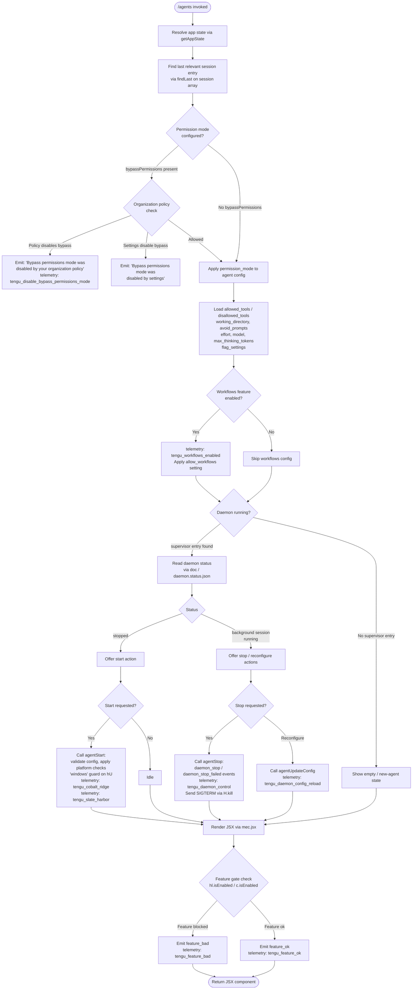

# `/agents`

> Analysis basis: CC v2.1.197 bundle.js (AST extraction + Claude interpretation)
> Minimum version: v2.1.197

---

## Overview

The `/agents` command provides an interactive management interface for agent configurations within a Claude Code session. It allows users to inspect, start, stop, and reconfigure background agent processes (daemons), as well as review their permission modes, tool allowlists/denylists, session parameters, and feature flags. The command renders a JSX-based UI component (`mec.jsx`) driven by the async handler `KYf`.

---

## Registration

| Field | Value |
|---|---|
| type | `local-jsx` |
| name | `agents` |
| description | `Manage agent configurations` |
| module_id | `fec` |
| load_inline | `true` |
| loc_byte | `12999859` |
| loc_byte_end | `12999984` |
| loc_line | `9017` |
| arbor_handler.name | `KYf` |
| arbor_handler.fqn | `claude-2.1.197::KYf` |
| arbor_handler.kind | `AsyncFunction` |
| arbor_handler.resolution_path | `module_id` |
| arbor_handler.n_hits | `0` |

Analysis basis: CC v2.1.197 bundle.js:+12999859

---

## Input Branching

The command exhibits five or more distinct logical branches covering daemon lifecycle state, permission mode checks, feature-flag gating, tool narrowing, and session configuration loading. A Mermaid flowchart is used.



Analysis basis: CC v2.1.197 bundle.js:+12999720, +11149507, +11149883, +10576050, +18053444, +13167883

---

## Behavioral Spec

### 1. Main Handler Entry Point

The async handler `KYf` is the top-level entry point resolved via `module_id` → `fec`.

```
async function agentsCommandHandler(context):
    appState = getAppState()
    lastSession = appState.sessions.findLast(
        session => session.type matches working context
    )
    agentConfigUI = buildAgentConfigView(appState, lastSession)
    return renderJSX(agentConfigUI)   // via mec.jsx
```

Analysis basis: CC v2.1.197 bundle.js:+12999720, +12999728, +12999741

---

### 2. App State and Session Resolution (`Ur`)

`Ur` retrieves the current application state and locates the most-recently-relevant session entry. It reads several configuration keys from the stored state object.

```
function resolveAgentState(appState):
    session = appState.sessions.findLast(
        s => s.working_directory is defined
    )
    config = {
        working_directory : session["working_directory"],   // loc +11149612
        allowed_tools     : session["allowed_tools"],       // loc +11149667
        disallowed_tools  : session["disallowed_tools"],    // loc +11149722
        avoid_prompts     : session["avoid_prompts"],       // loc +11149783
        permission_mode   : session["permission_mode"],     // loc +11149885
        bypassPermissions : session["bypassPermissions"],   // loc +11149916
        session           : session["session"],             // loc +11150215
        effort            : session["effort"],              // loc +11150240
        model             : session["model"],               // loc +11150253
        max_thinking_tokens: session["max_thinking_tokens"],// loc +11150265
        flag_settings     : session["flag_settings"],       // loc +11150291
    }
    return config
```

Analysis basis: CC v2.1.197 bundle.js:+11149507, +11149587

---

### 3. Bypass-Permissions Mode Guard (`WYr` / `AR`)

Before applying `bypassPermissions`, the handler consults two policy checks (`gtr` and `htr`) that can block or downgrade the mode.

```
function applyPermissionMode(config, policyContext):
    if config.bypassPermissions is set:
        if organizationPolicyDisablesById(policyContext):
            // literal: "Bypass permissions mode was disabled by your organization policy"
            emitTelemetry("tengu_disable_bypass_permissions_mode")
            config.bypassPermissions = false
            config.permission_mode = default
            return config                               // loc +3441348, +3441398

        if settingDisables(policyContext):              // literal "disable" loc +3441523
            // literal: "Bypass permissions mode was disabled by settings"
            config.bypassPermissions = false            // loc +3441539
            return config

    return config   // bypassPermissions allowed; leave unchanged
```

Analysis basis: CC v2.1.197 bundle.js:+3441345, +3441398, +3441469, +11149916

---

### 4. Agent Config View Builder (`m1`)

`m1` assembles the composite view passed to the JSX renderer. It wires together multiple sub-components and performs feature-flag filtering.

```
function buildAgentConfigView(appState, config):
    // Resolve client type: "cli" or "remote"          // loc +5152149, +5152160
    clientType = resolveClientType(config)             // via Uw

    // Apply feature gate lookups                      // loc +10576385, +10576527
    gatedFeatures = featureSet.filter(
        f => !blockedFeatureSet.has(f.id)             // literal "blocked" loc +10575546
    )

    // Build tool-narrowing config                     // loc +10575485, +10575500
    toolConfig = buildToolNarrowingConfig(
        config.allowed_tools,
        config.disallowed_tools,
        narrowingSource = "cliArg" | "toolsNarrowing" // loc +13988243, +13988264
    )

    // Determine workflows eligibility                 // loc +10576436
    workflowsEnabled = featureFlags.isEnabled("allow_workflows")
    if workflowsEnabled:
        emitTelemetry("tengu_workflows_enabled")       // loc +3417509

    // Compose list of rendered items
    viewItems = []
    viewItems.push(daemonStatusPanel(appState))        // via d / TYe
    viewItems.push(toolConfigPanel(toolConfig))
    viewItems.push(sessionParamsPanel(config))

    return viewItems
```

Analysis basis: CC v2.1.197 bundle.js:+10576050, +10576122, +10576173, +10576188, +10576200, +10576260

---

### 5. Daemon Status Panel and File Check (`TYe` / `doc` / `_Zt`)

The daemon status is read from a file named `daemon.status.json` on disk. A stat check guards access; if missing (`ENOENT`), it is treated as stopped state.

```
function daemonStatusPanel(appState):
    try:
        stat = fs.stat(daemonStatusFilePath)           // loc +13342294
        if not stat.isFile():
            return stoppedState()                      // loc +13342366
        if stat.size > 1048576:                        // 1 MiB limit, loc +13342385
            return errorState("file too large")

        raw = readFile(daemonStatusFilePath)           // "daemon.status.json" loc +13167883
        parsed = parseStatusJSON(raw)
        keys = Object.keys(parsed)                     // loc +13342803
        return renderStatusTable(keys, parsed)         // column padding to 40 chars loc +18067388

    catch error if error.code == "ENOENT":             // loc +13342325
        return stoppedState()

    catch error:
        return errorState(error)

function buildDaemonStatusPath():
    parts = [configDir, "daemon.status.json"]          // loc +13167883
    return path.join(parts)                            // via _Zt / uoc.join loc +13167869
```

Analysis basis: CC v2.1.197 bundle.js:+13342294, +13342325, +13342366, +13342385, +13167883, +18067388

---

### 6. Agent Start (`hU` / `bu` / `kO`)

Starting an agent validates the platform (Windows guard), applies the model/effort parameters, and initialises transport.

```
async function startAgent(config):
    // Platform check                                  // literal "windows" loc +5149089
    if platform == "windows":
        applyWindowsCompatOverrides(config)            // via hU loc +5149082

    // Resolve agent type                              // literal "local-agent" loc +7241640
    agentType = "local-agent"

    // Apply model profile                            // literals: "standard","tst","tst-auto"
    // tst budget cap: 100                            // loc +5140885
    modelProfile = resolveModelProfile(config.model, config.effort)  // via f9t

    // Emit feature telemetry
    if featureEnabled:
        emitTelemetry("tengu_cobalt_ridge")           // loc +5149183
        emitTelemetry("tengu_slate_harbor")           // loc +5152179

    // Start daemon process
    agent = createAgentProcess(agentType, modelProfile, config)
    supervisorEntry = registerWithSupervisor(agent)   // key "supervisor" loc +18053444
    heartbeatLoop = startHeartbeat(agent)             // literal "heartbeat" loc +18052665
    return { agent, supervisorEntry, heartbeatLoop }
```

Analysis basis: CC v2.1.197 bundle.js:+5149082, +5149106, +5149151, +5149183, +5152179, +7241640, +5140793, +5140872, +5140885, +5140922

---

### 7. Agent Stop and Daemon Control (`xe` / `Re` / `Wj`)

Stopping an agent sends SIGTERM, cleans up the heartbeat, and emits lifecycle telemetry.

```
async function stopAgent(agent, supervisorEntry):
    try:
        agent.stop()                                   // loc +18053712
        supervisorEntry.delete()                       // loc +18053721
        process.kill(agent.pid, "SIGTERM")             // loc +18038795, +18038861

        emitTelemetry("tengu_daemon_control")          // loc +18076516
        // daemon_stop literal                         // loc +18076441

        await shutdownWithTimeout(agent)               // via Wj / Promise.race loc +18071531
        return { status: "stopped" }                   // loc +18076350

    catch error:
        // daemon_stop_failed literal                  // loc +18076478
        emitTelemetry("tengu_daemon_control")
        return { status: "failed", error }

    finally:
        clearHeartbeat()                               // via mye / clearTimeout loc +14172297
```

Analysis basis: CC v2.1.197 bundle.js:+18053712, +18053721, +18038795, +18076516, +18076441, +18076478, +18071531, +14172297

---

### 8. Daemon Config Reload (`eKc` / `Vce`)

When the user modifies agent settings without a full restart, the config is hot-reloaded.

```
async function reloadDaemonConfig(agent, newConfig):
    agent.updateConfig(newConfig)                      // loc +18053841
    agent.stop()                                       // loc +18053832
    agent.start(newConfig)                             // loc +18053859

    // Apply heartbeat helper                          // literal "heartbeat" loc +18052665
    heartbeatHelper = buildHeartbeatHelper()           // via eKc / Vce loc +18053961

    emitTelemetry("tengu_daemon_config_reload")        // loc +18054237
    return { status: "reloaded" }
```

Analysis basis: CC v2.1.197 bundle.js:+18053832, +18053841, +18053859, +18053961, +18054237

---

### 9. Feature Gate Evaluation (`xe` / `Re`)

Each feature flag is validated before display; failures surface a `tengu_feature_bad` event.

```
function evaluateFeatureGate(featureId, context):
    result = featureRegistry.checkEnabled(featureId)  // via c.isEnabled / hl.isEnabled

    if result.ok:
        emitTelemetry("tengu_feature_ok")             // loc +1028779
        return { allowed: true }
    else:
        emitTelemetry("tengu_feature_bad")            // loc +1028846
        return { allowed: false, reason: result.reason }
```

Analysis basis: CC v2.1.197 bundle.js:+1028777, +1028812, +1028844, +1028885

---

### 10. Column Rendering Helper (`Cic`)

Tabular output for daemon status and tool lists uses dynamic column-width calculation.

```
function renderStatusTable(keys, data):
    colWidth = Math.max(...keys.map(k => k.length))   // loc +13343560
    rows = keys.map(k =>
        k.padEnd(colWidth) + "  " + String(data[k])  // padding literal "  " loc +18065407
    )
    return rows.join("\n")
```

Analysis basis: CC v2.1.197 bundle.js:+13343515, +13343560, +18065407

---

## State & Side Effects

| Item | Detail |
|---|---|
| Telemetry: `tengu_disable_bypass_permissions_mode` | Fired when bypass-permissions mode is blocked by org policy or settings (bundle.js:+3441348) |
| Telemetry: `tengu_slate_harbor` | Fired on agent start path for client-type resolution (bundle.js:+5152179) |
| Telemetry: `tengu_cobalt_ridge` | Fired on agent start for platform/model initialisation (bundle.js:+5149183) |
| Telemetry: `tengu_workflows_enabled` | Fired when the `allow_workflows` feature flag is active (bundle.js:+3417509) |
| Telemetry: `tengu_daemon_config_reload` | Fired on hot config reload without full restart (bundle.js:+18054237) |
| Telemetry: `tengu_feature_ok` | Fired per feature gate that passes (bundle.js:+1028779) |
| Telemetry: `tengu_feature_bad` | Fired per feature gate that fails (bundle.js:+1028846) |
| Telemetry: `tengu_daemon_control` | Fired on agent stop (success or failure) (bundle.js:+18076516) |
| Daemon status file read | Reads `daemon.status.json` from config directory (bundle.js:+13167883) |
| `appState` changes | Reads `working_directory`, `allowed_tools`, `disallowed_tools`, `avoid_prompts`, `permission_mode`, `bypassPermissions`, `session`, `effort`, `model`, `max_thinking_tokens`, `flag_settings` |
| Process signal | Sends `SIGTERM` to daemon process on stop (bundle.js:+18038795) |
| Heartbeat | Starts/clears a heartbeat loop tied to the supervisor entry (bundle.js:+18052665, +14172297) |
| JSX render | Returns a `mec.jsx` component tree (bundle.js:+12999741) |
| `process.exit` | Called as last resort during daemon shutdown via `Wj` (bundle.js:+18071614) |

---

## Version History

| Version | Change |
|---|---|
| v2.1.197 | Initial analysis |

---

## Common Mistakes

1. **Expecting synchronous output** — `/agents` is a `local-jsx` command backed by an `AsyncFunction` (`KYf`). It renders a live JSX component, not plain text; piping output may yield no useful data.
2. **Assuming bypass-permissions always applies** — Two independent guards (`gtr` for org policy, `htr` for settings) can silently downgrade `bypassPermissions` before it reaches the agent. Check org policy and local settings if bypass mode appears ignored.
3. **Editing `daemon.status.json` manually** — The file is stat-checked and must be ≤ 1 MiB and a regular file; oversized or irregular files cause the daemon panel to fall back to stopped-state silently.
4. **Missing platform compatibility** — On Windows, `hU` applies overrides before agent start. Running platform-specific config on a different OS without those overrides may cause silent misconfiguration.
5. **Confusing hot-reload with full restart** — `updateConfig` + `stop` + `start` (hot-reload path) emits `tengu_daemon_config_reload`; a fresh invocation of start emits `tengu_cobalt_ridge` and `tengu_slate_harbor`. These are distinct lifecycle paths.
6. **Feature flag caching** — `hl.isEnabled` and `c.isEnabled` are evaluated at render time. Feature gates may change between invocations; results are not cached across sessions.

---

## Appendix — Identifier Mapping

> For bundle debugging only. Identifiers change across versions.

| Identifier | Role |
|---|---|
| `KYf` | Main async handler for `/agents` command (entry point) |
| `Ur` | App-state resolver and session config reader |
| `gtr` | Organization-policy bypass-permissions checker |
| `htr` | Settings-level bypass-permissions checker |
| `AR` | Permission-mode application coordinator |
| `WYr` | Bypass-permissions guard wrapper |
| `it` | Feature/permission set membership checker |
| `m1` | Agent config view builder (composite assembly) |
| `Uw` | Client-type resolver (`cli` / `remote`) |
| `N5` | <!-- TODO: not found in depth-2 traversal; needs --depth 4 --> |
| `_l` | String normalisation utility |
| `ct` | String coercion / cast helper |
| `TYe` | Daemon status file reader and validator |
| `rn` | File read helper |
| `Ks` | Config store accessor (`jfd.getStore`) |
| `eWo` | Status JSON parser wrapper |
| `he` | String-to-code converter |
| `Cic` | Tabular column-width calculator and renderer |
| `E` | Agent stop/connection state machine |
| `$Ct` | Transport type resolver (`sdk`/`http`/`sse`/`dynamic`) |
| `ke` | Connection error logger |
| `er` | Error constructor wrapper |
| `A` | Agent process manager (stop/updateConfig/start/userinfo) |
| `t_r` | Array-or-scalar normaliser for agent args |
| `e_r` | String prefix/slice/replace transformer |
| `H` | OAuth / userinfo client |
| `eKc` | Heartbeat helper factory |
| `Vce` | Heartbeat implementation |
| `I` | Keyboard/input event handler (Math.floor/preventDefault) |
| `M` | HTTP server / OAuth route handler |
| `V` | Core value/constant store |
| `qDo` | React/render context initialiser |
| `eo` | Module export binder |
| `iS` | Feature-settings initialiser |
| `Ckn` | Config key normaliser |
| `h0` | Base config object builder |
| `t2i` | Settings transformation pipeline |
| `Gs` | Feature-flag set resolver |
| `vYr` | Versioned-settings loader |
| `fBd` | Feature bundle descriptor |
| `pBd` | Policy-bound defaults loader |
| `xse` | Tool list filter (blocked check) |
| `KOe` | Tool narrowing config builder |
| `h1e` | Tool allowlist membership checker |
| `GK` | Tool deny-list resolver |
| `aVo` | Tool source aggregator (`cliArg` / `toolsNarrowing`) |
| `cVo` | Tool config validator |
| `KDo` | Daemon control command builder |
| `hU` | Windows-platform agent start helper |
| `bu` | Generic agent start entry with `tHe` integration |
| `xe` | Feature-gate OK renderer |
| `Oe` | JSX element factory wrapper |
| `Re` | Feature-gate BAD renderer |
| `$F` | First-party agent registration helper |
| `D6` | Agent descriptor builder (`K3`) |
| `u5e` | Agent list loader (`lx`) |
| `z7r` | Agent UUID emitter (`q7r.randomUUID`) |
| `Wj` | Shutdown race/timeout orchestrator (`Promise.race`) |
| `sye` | Graceful shutdown initiator (`oye.shutdown`) |
| `mye` | Timeout-clear helper (`clearTimeout` + `Sqo`) |
| `On` | Timed-abort helper (`setTimeout` / `clearTimeout`) |
| `C4` | Full agent lifecycle controller |
| `Gft` | Agent type factory (`local-agent`) |
| `Ev` | Agent event emitter (`ySr`) |
| `Tb` | String transform for agent labels |
| `CEt` | Agent config error type |
| `kO` | Model profile selector |
| `f9t` | Model profile factory (`standard`/`tst`/`tst-auto`) |
| `T` | Log-level resolver (`debug` / uppercase normaliser) |
| `Hr` | API backend selector (`gateway`/`bedrock`/`foundry`/`vertex`) |
| `Su` | Auth/transport selector (`Trt`) |
| `nc` | <!-- TODO: not found in depth-2 traversal; needs --depth 4 --> |
| `c` | Feature-flag `isEnabled` checker (maps to `yn`) |
| `yn` | Underlying feature-flag state store |
| `l` | Daemon includes/status check wrapper |
| `doc` | Daemon status file loader (`daemon.status.json`) |
| `ene` | Config path joiner (`ZHe`) |
| `_Zt` | Daemon status path builder (`uoc.join`) |
| `Me` | JSON serialiser (`JSON.stringify`) |

---

Note: index built via Arbor fallback; some signals (telemetry, literals) may be missing — see arbor-fallback.js.