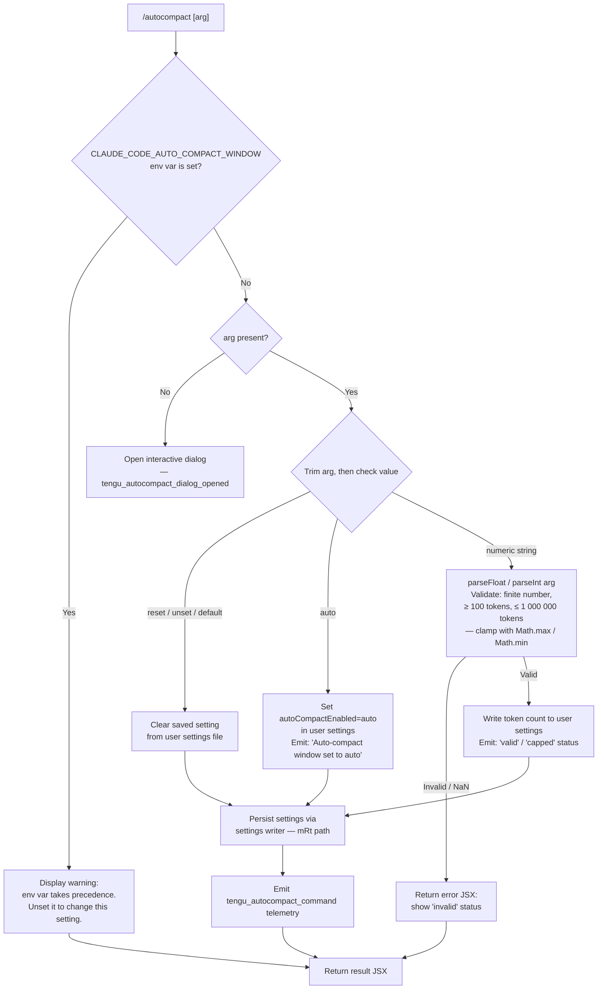

# `/autocompact`

> Analysis basis: CC v2.1.197 bundle.js (AST extraction + Claude interpretation)
> Minimum version: v2.1.197

---

## Overview

`/autocompact` controls the context-window threshold at which Claude Code automatically summarizes (compacts) the conversation history. It accepts an explicit token count, the special keyword `auto`, or one of several reset/clear keywords, and persists the chosen value to user settings — unless the `CLAUDE_CODE_AUTO_COMPACT_WINDOW` environment variable is already set, in which case the environment variable takes precedence and the command displays a warning.

---

## Registration

| Field | Value |
|---|---|
| type | `local-jsx` |
| name | `autocompact` |
| description | Set how full the context gets before auto-summarizing |
| argumentHint | `[auto\|<tokens>]` |
| isHidden | `false` |
| module_id | `$Ul` |
| load_inline | `true` |
| loc_byte | `11590563` |
| loc_byte_end | `11590827` |
| loc_line | `7446` |
| arbor_handler.name | `m1f` |
| arbor_handler.fqn | `claude-2.1.197::m1f` |
| arbor_handler.kind | `AsyncFunction` |
| arbor_handler.resolution_path | `module_id` |
| arbor_handler.n_hits | `1` |

Analysis basis: CC v2.1.197 bundle.js:+11590563

---

## Input Branching

The command parses the user-supplied argument through multiple distinct code paths, making a Mermaid flowchart the appropriate representation.



Analysis basis: CC v2.1.197 bundle.js:+11585011 (env-var warning literal), +11585113 (trim), +11585142 (reset/unset/default keywords), +11585185 (numeric parse via `Hlo`), +11585353 (settings writer `no`), +11585616 (telemetry event), +11585834 (auto confirmation literal)

---

## Behavioral Spec

### 1. Entry Point — Async Handler (`m1f`)

```
async function autocompactCommandHandler(args, appState):
    if CLAUDE_CODE_AUTO_COMPACT_WINDOW env var is set:
        return warningJSX("env var takes precedence — unset it to change this setting")

    rawArg = args.trim()

    if rawArg is empty:
        openAutocompactDialog()          // tengu_autocompact_dialog_opened
        return dialogJSX

    result = processAutocompactArg(rawArg, appState)
    emitTelemetry("tengu_autocompact_command", {action: result.action})
    return resultJSX(result)
```

Analysis basis: CC v2.1.197 bundle.js:+11590253 (`m1f`→`VJt`), +11590286 (`m1f`→`V`), +11590288 (dialog telemetry), +11590330 (`m1f`→`qe`), +11590345 (`m1f`→`XD.jsx`)

---

### 2. Argument Processor (`VJt`)

```
function processAutocompactArg(rawArg, appState):
    arg = rawArg.trim()

    // Reset branch
    if arg in ["reset", "unset", "default"]:
        clearUserSetting("autoCompactEnabled")
        persistSettings(appState)
        return {action: "reset", status: "valid"}

    // Auto branch
    if arg == "auto":
        setUserSetting("autoCompactEnabled", "auto")
        persistSettings(appState)
        return {action: "set", status: "valid", message: "Auto-compact window set to auto"}

    // Numeric branch — delegate to token parser
    parsed = parseTokenValue(arg)          // Hlo
    if parsed.status == "invalid":
        return {action: "set", status: "invalid"}

    clamped = clampTokenValue(parsed.value)
    setUserSetting("autoCompactEnabled", clamped)
    persistSettings(appState)
    return {action: "set", status: clamped == parsed.value ? "valid" : "capped"}
```

Analysis basis: CC v2.1.197 bundle.js:+11585113 (trim), +11585142 (reset), +11585155 (unset), +11585168 (default), +11585353 (`no` — settings persistence), +11585449 (`Rr` — settings read), +11585614 (`V`), +11585652 (`qe`), +11585818 (`yl` — JSX rendering)

---

### 3. Token Value Parser (`Hlo`)

```
function parseTokenValue(str):
    s = str.trim()

    // Literal "auto" keyword
    if s == "auto":
        return {status: "auto"}

    // Percentage suffix  (e.g. "80%")
    if s.endsWith("%"):
        pct = parseFloat(s)
        if not Number.isFinite(pct):
            return {status: "invalid"}
        tokens = Math.round(pct / 100 * MODEL_CONTEXT_SIZE)
        return {status: "valid", value: tokens}

    // Plain integer  (e.g. "50000")
    n = parseInt(s, 10)    // radix 10
    if not Number.isFinite(n):
        return {status: "invalid"}
    return {status: "valid", value: n}
```

Analysis basis: CC v2.1.197 bundle.js:+5280224 (`Hlo`→`e.trim`), +5280254 ("auto" literal), +5280283 (`t.endsWith`), +5280301 (`parseFloat`), +5280375 (`parseInt`), +5280421 (`Number.isFinite`), +5280468 (`Math.round`)

---

### 4. Token Value Validator / Clamp (`Ede`)

```
function validateTokenValue(value):
    n = parseInt(value, 10)
    if isNaN(n):
        return {status: "invalid"}
    // Status "capped" signals the value was out of the allowed window
    // and was silently clamped.
    return {status: "valid", parsedValue: n}
```

Clamping is applied after parsing via `Math.max` and `Math.min` calls inside the main argument handler (`N9`):

- Lower bound: `100` tokens (bundle.js:+5280395)
- Upper bound: `1 000 000` tokens (bundle.js:+3070658)

Analysis basis: CC v2.1.197 bundle.js:+5278513 ("valid" literal), +5278588 ("invalid" literal), +5278718 ("capped" literal), +5281681 (`Math.max`), +5281721 (`Math.min`)

---

### 5. Settings Persistence (`no` / `mRt` chain)

The command writes user settings via a multi-layer settings pipeline:

```
function persistAutocompactSetting(key, value, appState):
    // Resolve settings file paths
    userSettingsPath   = resolveSettingsPath("userSettings")    // ~/.claude/settings.json
    localSettingsPath  = resolveSettingsPath("localSettings")   // project-local settings

    // Load current settings from disk (loadSettingsFromDisk)
    current = loadSettingsFromDisk(userSettingsPath)

    // Merge new value
    current[key] = value    // key == "autoCompactEnabled"

    // Atomic write with fsync + rename via writeFileSyncAndFlush
    writeFileSyncAndFlush(userSettingsPath, JSON.stringify(current, null, 2))

    // Invalidate in-memory caches
    clearSettingsCache()

    // Emit settings_load_completed via internal event bus
    emitSettingsReload()
```

Settings layer precedence (highest → lowest) observed in the literals:

1. `policySettings`
2. `flagSettings`
3. `env` (environment variable `CLAUDE_CODE_AUTO_COMPACT_WINDOW`)
4. `userSettings` (`~/.claude/settings.json`)
5. `projectSettings`
6. `localSettings`

The env-var `CLAUDE_CODE_AUTO_COMPACT_WINDOW` sits above user settings; writing via `/autocompact` has no visible effect while this variable is set.

Analysis basis: CC v2.1.197 bundle.js:+5281563 (env-var name literal), +1329911 ("userSettings"), +1329962 ("projectSettings"), +1329984 ("localSettings"), +1349802 ("policySettings"), +1349824 ("flagSettings"), +1330165 (".claude"), +1330175 ("settings.json"), +5278049 ("autoCompactEnabled")

---

### 6. Model Context Size Lookup (`Kpp` / `hv`)

When the numeric argument is a percentage, the code resolves the active model's context window size in order to compute an absolute token count:

```
function resolveModelContextSize(modelId):
    info = lookupModelInfo(modelId)      // hv → ct, pc
    if not Number.isInteger(info.contextWindow):
        return DEFAULT_CONTEXT
    if Array.isArray(info.tokenBudgets):
        budget = findMatchingBudget(info.tokenBudgets)   // wua
        if Object.hasOwn(budget, "contextWindow"):
            return budget.contextWindow
    return info.contextWindow
```

Analysis basis: CC v2.1.197 bundle.js:+5281059 (`Kpp`→`hv`), +5281135 (`Number.isInteger`), +5281220 (`Array.isArray`), +5281272 (`Object.hasOwn`), +5281338 (`wua`)

---

### 7. Dialog Flow (`m1f` — no-arg path)

When the command is invoked with no argument, a JSX dialog component is rendered instead of immediately writing a setting:

```
function openAutocompactDialog(appState):
    emitTelemetry("tengu_autocompact_dialog_opened")
    return renderJSX(AutocompactDialogComponent, {
        currentValue: readCurrentAutocompactSetting(appState),
        onConfirm: (value) => processAutocompactArg(value, appState),
        onCancel: () => closeDialog()
    })
```

Analysis basis: CC v2.1.197 bundle.js:+11590288 (dialog telemetry), +11590345 (`XD.jsx`), +11590330 (`qe` — dialog component reference)

---

## State & Side Effects

| Item | Detail |
|---|---|
| Telemetry — `tengu_autocompact_command` | Fired after every successful argument-based write; carries action (`set`/`reset`) and status (`valid`/`capped`/`invalid`) — bundle.js:+11585616 |
| Telemetry — `tengu_autocompact_dialog_opened` | Fired when the command is invoked with no argument and the interactive dialog is rendered — bundle.js:+11590288 |
| Telemetry — `tengu_amber_redwood2` / `tengu_amber_redwood3` | Fired during settings initialisation (depth-2 reachable via `s$n`) — bundle.js:+5277887, +5277918 |
| Telemetry — `tengu_feature_ok` / `tengu_feature_bad` / `tengu_feature_sad` | Feature-flag check outcome events reached via `xe`/`Re`/`wt` — bundle.js:+1028779, +1028846, +1028927 |
| Telemetry — `tengu_daemon_control` | Daemon lifecycle event reached via `u` deep call — bundle.js:+18076516 |
| `appState` / settings mutation | `autoCompactEnabled` key written in user settings (`~/.claude/settings.json`) |
| File I/O | Atomic write via temp-file + `fsyncSync` + `renameSync` (writeFileSyncAndFlush) — bundle.js:+1108166, +1108512 |
| In-memory cache invalidation | `_in.clear()` and `tEr.clear()` called after write — bundle.js:+29196, +29208 |
| Internal event bus | `Gtt.emit` fires to notify other subsystems of the settings change — bundle.js:+1351020 |
| `apply_flag_settings` branch | Flag-layer settings are re-applied after the user setting is committed — bundle.js:+11585553 |
| `write_ineffective` diagnostic | Emitted if the write resolves to no observable change — bundle.js:+1350855 |
| `gitignore_global_rule` diagnostic | Reachable via the settings path crawler — bundle.js:+1350714 |
| Sound | <!-- TODO: not found in depth-2 traversal; needs --depth 4 --> |

---

## Version History

| Version | Change |
|---|---|
| v2.1.197 | Initial analysis |

---

## Common Mistakes

1. **Setting a value while `CLAUDE_CODE_AUTO_COMPACT_WINDOW` is set** — the command displays a warning and the new value is not used at runtime. Unset the environment variable first.
2. **Supplying a value below 100 tokens** — values below the lower bound are silently clamped to `100`; the status returned is `capped`, not `invalid`. The user may not realise the stored value differs from their input.
3. **Supplying a value above 1 000 000 tokens** — similarly clamped and reported as `capped`.
4. **Expecting `/autocompact` to affect project-level settings** — the command writes exclusively to user settings (`~/.claude/settings.json`). Project or local settings files are not modified.
5. **Using `/autocompact reset` to clear an env-var override** — `reset` only clears the user-settings key; the env var `CLAUDE_CODE_AUTO_COMPACT_WINDOW` must be unset separately in the shell environment.
6. **Omitting the argument expecting a status display** — with no argument the command opens an interactive dialog rather than printing the current value inline.

---

## Appendix — Identifier Mapping

> For bundle debugging only. Identifiers change across versions.

| Identifier | Role |
|---|---|
| `m1f` | Main async handler for `/autocompact` (Arbor-resolved entry point) |
| `VJt` | Argument dispatch function — routes to reset / auto / numeric branches |
| `N9` | Core autocompact logic — validates parsed token value, applies clamp, reads env-var |
| `oo` | Model ID normaliser / resolver |
| `Crt` | Model registry lookup helper (uses `Object.entries`) |
| `c_` | Model ID string canonicaliser (lowercase, prefix checks, slice, replace) |
| `qwt` | Auxiliary model resolution helper |
| `Wu` | Model ID string replacement helper |
| `uy` | Feature-flag lookup helper |
| `H0` | Base feature-flag evaluator |
| `rS` | Token-window settings reader |
| `Xwi` | Integer parser with `parseInt` + `isNaN` guard |
| `Dqr` | Composite token-window validator (delegates to `uQe`, `Xwi`, `Qwi`) |
| `Qwi` | Token-window applicator — writes resolved value; calls `mh`, `tV`, `Ew`, `nLn` |
| `Ede` | Argument status classifier — returns `"valid"` / `"invalid"` / `"capped"` |
| `T` | Locale-aware string formatter / label builder |
| `Kpp` | Model context-window resolver |
| `hv` | Model info fetcher (`ct`, `pc`) |
| `t` | Generic utility alias (various call sites) |
| `wua` | Token-budget array searcher |
| `n` | Lowercase comparator helper |
| `Zwi` | Settings key writer helper (`Tw`) |
| `eLi` | Settings key deleter helper (`Dt`) |
| `_lo` | Settings persistence orchestrator |
| `vr` | Settings validation helper |
| `s$n` | Settings telemetry emitter (`tengu_amber_redwood2/3`) |
| `Hlo` | Token-value string parser (handles `auto`, `%`, plain integer) |
| `Vpp` | Settings object property checker (`Object.hasOwn`, `wua`) |
| `no` | Settings write pipeline (reads, merges, writes, emits reload) |
| `Lg` | Settings file path resolver |
| `Hwe` | Settings layer aggregator (`userSettings`, `projectSettings`, `localSettings`) |
| `I3` | Settings schema validator / merger |
| `qt` | Path utility helper |
| `LDr` | Settings disk loader |
| `KLs` | Settings key enumerator |
| `P8` | User settings file reader |
| `VLs` | SDK inline settings reader |
| `nw` | .claude directory walker |
| `Ste` | Project settings file reader (uses `readFileSync`) |
| `Sn` | ENOENT error handler |
| `rn` | Generic error normaliser |
| `OMr` | Timestamp recorder (`Zmn.set`, `Date.now`) |
| `VBe` | Settings path builder |
| `Fgn` | Path resolver for settings files (`gN.resolve`, `gN.dirname`) |
| `mRt` | Atomic file writer (`writeFileSyncAndFlush` — fsync + rename) |
| `r` | `fs` module alias |
| `Gd` | Real-path resolver with symlink handling |
| `u` | Daemon control module |
| `i` | Stream / file-descriptor helper |
| `rtt` | Fsync error handler |
| `oRr` | Directory creation helper |
| `nIs` | `Object.defineProperty` metadata helper |
| `Me` | JSON serialiser (`JSON.stringify`) |
| `n_` | Cache invalidator (`_in.clear`, `tEr.clear`) |
| `zvs` | Git-ignore / file-tracking helper |
| `Ot` | Settings reload emitter |
| `_Mr` | Internal pubsub bus (`wu`) |
| `zmn` | Git check-ignore runner |
| `qFu` | Path expander (handles `~/`, absolute check) |
| `qvs` | Git ls-files tracker |
| `Kvs` | Gitignore rule appender |
| `Q5` | Claude config directory path builder (`.claude`) |
| `dr` | Debug logger |
| `xe` | Feature-flag "ok" emitter (`tengu_feature_ok`) |
| `V` | JSX renderer / React-element factory |
| `Oe` | Internal component registry |
| `wt` | Feature-flag "sad" emitter (`tengu_feature_sad`) |
| `Re` | Feature-flag "bad" emitter (`tengu_feature_bad`) |
| `O8` | Settings load-from-disk orchestrator |
| `h0` | Settings load start event emitter |
| `ga` | Memory-usage sampler |
| `xDr` | Settings load completion handler |
| `yin` | Post-load settings hook |
| `ke` | Error logger / queue manager |
| `er` | Error constructor wrapper |
| `ct` | String-coercing utility |
| `zi` | Queue deduplicator |
| `LNu` | FIFO queue manager (`Yfn.shift`, `Yfn.push`) |
| `Rr` | Settings reader (calls `O8`) |
| `qe` | Dialog / modal component reference |
| `$Xe` | Component registry map |
| `yl` | Number formatter (uses `ou` → `Aeu`, locale `en-US`, style `compact`) |
| `ou` | `Intl.NumberFormat` factory |
| `Aeu` | `Intl.NumberFormat` instance creator |