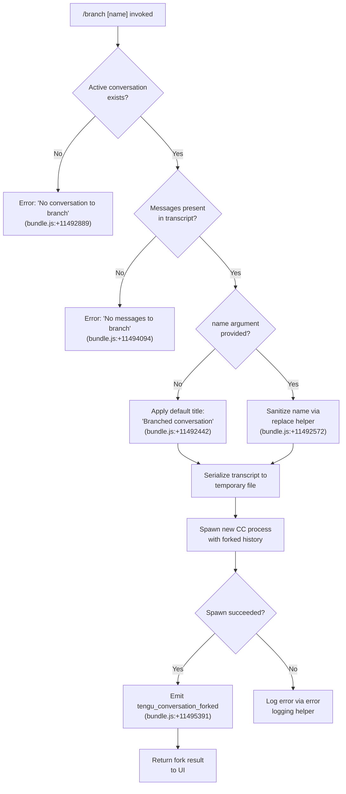

# `/branch`

> Analysis basis: CC v2.1.197 bundle.js (AST extraction + Claude interpretation)
> Minimum version: v2.1.197

---

## Overview

The `/branch` command forks the current conversation at its present point in time, creating a new independent session that begins with a copy of the existing message history. Internally it serializes the conversation transcript to a temporary file, spawns a new Claude Code process that reads and replays that history, and emits a `tengu_conversation_forked` telemetry event on success. The optional `[name]` argument labels the branched session; when omitted a default title ("Branched conversation") is applied.

---

## Registration

| Field | Value |
|---|---|
| type | `local-jsx` |
| name | `branch` |
| description | `Create a branch of the current conversation at this point` |
| argumentHint | `[name]` |
| module_id | `BUo` |
| load_inline | `true` |
| loc_byte | `12914043` |
| loc_byte_end | `12914220` |
| loc_line | `8904` |
| arbor_handler.name | `LPf` |
| arbor_handler.fqn | `claude-2.1.197::LPf` |
| arbor_handler.kind | `AsyncFunction` |
| arbor_handler.resolution_path | `module_id` |
| arbor_handler.n_hits | `0` |

Analysis basis: CC v2.1.197 bundle.js:+12914043

---

## Input Branching

The command follows four distinct control paths based on conversation state and the provided argument, requiring a Mermaid flowchart.



---

## Behavioral Spec

### Top-level Handler — `branchCommandHandler` (`LPf`)

`LPf` is an `AsyncFunction` resolved via `module_id` (`BUo`) in the Arbor symbol graph.

Analysis basis: CC v2.1.197 bundle.js:+11496195

```
async function branchCommandHandler(context):
    # Step 1 — Validate that a conversation is active
    conversation = getActiveConversation(context)
    if conversation is null:
        throw Error("No conversation to branch")          # +11492889

    # Step 2 — Validate that the conversation has messages
    messages = conversation.messages
    if messages is empty:
        throw Error("No messages to branch")              # +11494094

    # Step 3 — Determine branch label
    rawName = context.args                                # positional argument
    if rawName is not empty:
        branchTitle = sanitizeName(rawName)               # +11492572
    else:
        branchTitle = "Branched conversation"             # +11492442

    # Step 4 — Serialize transcript to a temporary file
    tmpFile = createTranscriptSnapshot(messages, branchTitle)
    # Uses Nnr.createReadStream / Nnr.createWriteStream   # +11492792, +11492938

    # Step 5 — Spawn forked session
    forkResult = spawnForkedSession(tmpFile, context)     # Y1l, +11496195
    # Internally generates a fresh UUID for the new session (j1l.randomUUID, +11492681)

    # Step 6 — Telemetry
    emit("tengu_conversation_forked")                     # +11495391

    # Step 7 — Cleanup temporary resources
    destroyTmpFile(tmpFile)                               # c.destroy +11493136, Unr.unlink +11493154

    return forkResult
```

---

### Transcript Serialization — `transcriptSerializer` (`z1l`)

Analysis basis: CC v2.1.197 bundle.js:+11492681

```
async function transcriptSerializer(messages, branchTitle):
    # Generate a unique session ID for the fork
    newSessionId = crypto.randomUUID()                    # j1l.randomUUID, +11492681

    # Retrieve current working path context
    workingPath = resolveWorkingPath()                    # Rt, dr, +11492700/11492710

    # Build filesystem paths for the fork
    sessionDir  = buildSessionDir(newSessionId)           # zx, +11492718
    contentDir  = buildContentDir(sessionDir)             # Zf, +11492732

    # Create directory structure
    fs.mkdir(sessionDir, {recursive: true})               # Unr.mkdir, +11492743

    # Open read stream on current JSONL transcript (offset 448 bytes)
    # (448 = fixed header size, bundle.js:+11492774)
    readStream  = fs.createReadStream(transcriptPath,
                      {start: 448, encoding: "utf8"})     # +11492792, +11492825

    # Write stream for fork destination
    writeStream = fs.createWriteStream(destPath)          # +11492938

    # Pipe message content — each line is parsed and re-emitted
    interface = readline.createInterface(readStream)      # V1l.createInterface, +11493032
    for each line in interface:
        sanitized = line.map(replaceContent)              # e.map, +11493087
        writeStream.write(sanitized)                      # c.write, +11493223

    # Wait for drain event before finalizing
    await drainEvent("drain")                             # +11493251

    # Persist "content-replacement" metadata marker
    writeMetadataMarker("content-replacement")            # +11493371

    # Finalize
    writeStream.close()                                   # d.close, +11493632
    readStream.destroy()                                  # l.destroy, +11493642

    return {sessionId: newSessionId, dir: sessionDir}
```

---

### Name Sanitization — `nameSanitizer` (`K1l`)

Analysis basis: CC v2.1.197 bundle.js:+11492494

```
function nameSanitizer(rawName):
    # Locate any disallowed character pattern
    match = rawName.find(forbiddenPattern)                # t.find, +11492494
    if match:
        sanitized = rawName.replace(forbiddenPattern, "") # n.replace, +11492572
        return sanitized
    return rawName
```

---

### Fork Session Spawn — `spawnForkSession` (`Y1l`)

Analysis basis: CC v2.1.197 bundle.js:+11495087

```
async function spawnForkSession(snapshotPath, context):
    # Build the runtime context (Rt = runtime info, Vg = version/config getter)
    rt      = buildRuntime()                              # Rt, +11495087
    config  = getVersionConfig()                          # Vg, +11495094

    # Select branch mode ("fork" literal, +11495912)
    mode    = "fork"

    # Resolve title from snapshot metadata
    label   = extractLabel(snapshotPath)                  # yi, +11495478

    # Determine timestamp for the fork anchor
    forkTimestamp = new Date()
    isoTs   = forkTimestamp.toISOString()                 # +11495481
    epochMs = forkTimestamp.getTime()                     # +11495530

    # Identify starting message (up to 10 messages max cap, +11494979)
    startMessage = findStartMessage(context, limit=10)    # K1l, +11495254

    # Attempt worktree detection (git worktree list --porcelain)
    worktreeInfo = detectWorktree(context)                # wPf, +11495327
    # wPf invokes _Z which runs: git worktree list --porcelain (+8858262)
    # and emits tengu_worktree_detection (+8858344)

    # Select title update strategy ("auto" default, +11495345)
    titleMode = "auto"

    # Optionally rename session title
    renameResult = renameSession(label, titleMode)        # zW, +11495358
    # zW emits tengu_session_renamed (+13660789)

    # Set agent name if provided
    agentNameResult = setAgentName(label, context)        # Cze, +11495376
    # Cze emits tengu_agent_name_set (+13665637)

    # Resume the underlying stream once fork is committed
    context.stream.resume()                               # e.resume, +11495899

    # Prepare conversation state (Pue = state persistence helper)
    stateResult = persistForkState(snapshotPath, context) # Pue, +11495920
    # Pue calls: mc (path builder), Yi (file watcher/reader), dE (state
    #            entry deletion), Jd (atomic write helper), Sn, Jf

    # Compute session basename for display
    displayName = computeDisplayName(snapshotPath)        # cS, +11495924

    # Deliver fork payload to caller
    return buildForkPayload(displayName, forkTimestamp, mode)
                                                          # t, +11495939
```

---

### Conversation State Persistence — `persistForkState` (`Pue`)

Analysis basis: CC v2.1.197 bundle.js:+11495920

```
async function persistForkState(snapshotPath, context):
    # Resolve base storage path
    basePath = buildBasePath(snapshotPath)                # mc, +4339229

    # Read and update file index for the forked session
    index = await readFileIndex(basePath)                 # Yi, +4339243

    # Remove any stale state entry from prior conversation
    await deleteStaleEntry(index)                         # dE, +4339287

    # Atomically write the fork's session descriptor
    await atomicWrite(basePath, index)                    # Jd, +4339364

    # Notify subsystems of new session state
    notifyState(context)                                  # Sn, +4339454

    # Update allowed-path cache
    updateAllowedPaths(context)                           # Jf, +4339460
```

---

### Error Handling Path

Analysis basis: CC v2.1.197 bundle.js:+11492883, +11492889

```
function handleBranchError(error):
    if error.message == "No conversation to branch":     # +11492889
        displayUserError(error.message)
        return

    if error.message == "No messages to branch":         # +11494094
        displayUserError(error.message)
        return

    if error.code == "ENOENT":                           # +184653
        logError(error)                                  # ke → Ete.logError, +1059647
        return

    # Generic fallback
    displayUserError("Unknown error occurred")            # +11496079
```

---

## State & Side Effects

| Item | Detail |
|---|---|
| Telemetry — `tengu_conversation_forked` | Emitted on successful fork completion (bundle.js:+11495391) |
| Telemetry — `tengu_session_renamed` | Emitted when the forked session receives a title (bundle.js:+13660789) |
| Telemetry — `tengu_agent_name_set` | Emitted when an agent name is written to the fork (bundle.js:+13665637) |
| Telemetry — `tengu_worktree_detection` | Emitted during git worktree probe on fork creation (bundle.js:+8858344) |
| Filesystem — session directory | A new session directory is created under the CC sessions root (`Unr.mkdir`, +11492743) |
| Filesystem — transcript snapshot | A JSONL snapshot of the current conversation is written to the new session directory (+11492938); temporary files are cleaned up afterwards (+11493154) |
| Filesystem — state descriptor | A JSON session-state file is atomically written for the fork (`Jd` / atomic write helper, +4339364) |
| Filesystem — file index | The file index (`Yi`) is updated to reflect the forked session's tracked files (+4339243) |
| Filesystem — stale state entry | Any prior stale state entry is deleted (`dE`, +4339287) |
| Session ID | A new UUID is generated for the forked session (`j1l.randomUUID`, +11492681) |
| Stream | The parent stream is resumed after the fork is committed (`e.resume`, +11495899) |
| appState changes | Allowed-path cache is updated (`Jf`, +4339460); subsystem notification dispatched (`Sn`, +4339454) |
| Sound | None found in depth-2 traversal |
| Error logging | Errors propagated through `ke` → `Ete.logError` (+1059647) |

---

## Version History

| Version | Change |
|---|---|
| v2.1.197 | Initial analysis |

---

## Common Mistakes

1. **Running `/branch` with no active conversation** — The command immediately throws `"No conversation to branch"` (+11492889). You must have at least one active chat session open before invoking it.
2. **Running `/branch` on an empty conversation** — If the active conversation contains no messages, the command throws `"No messages to branch"` (+11494094). Send at least one message before branching.
3. **Providing a name with special characters** — The name argument is sanitized by `K1l` (+11492494), which strips disallowed characters. If the resulting sanitized name is empty or unexpected, the command silently falls back to the sanitized (potentially empty) string rather than using the default title; supply a plain alphanumeric label for predictable results.
4. **Expecting the parent session to change** — `/branch` does not modify the parent conversation. It creates an independent copy; changes in the fork do not propagate back.
5. **Confusing `/branch` with git branching** — Although the command detects git worktrees (`wPf`, +11495327) to embed repository context in the fork, it does not create a git branch. Worktree detection is informational metadata only.

---

## Appendix — Identifier Mapping

> For bundle debugging only. Identifiers change across versions.

| Identifier | Role |
|---|---|
| `LPf` | Top-level async handler for `/branch` (entry point resolved via Arbor `module_id`) |
| `Y1l` | Fork session spawner — orchestrates transcript snapshot, UUID generation, and child process launch |
| `z1l` | Transcript serializer — reads current JSONL, pipes content to fork destination |
| `K1l` | Name sanitizer — strips forbidden characters from the user-supplied branch name |
| `wPf` | Worktree detector — runs `git worktree list --porcelain` and returns repository context |
| `_Z` | Git worktree list parser — parses porcelain output, emits `tengu_worktree_detection` |
| `GAe` | Worktree entry parser — splits porcelain lines and resolves working-tree paths |
| `_uc` | File system directory scanner — used for building context paths in the fork |
| `Pue` | Fork state persistence coordinator — writes state descriptor and updates file index |
| `Yi` | File index reader/updater — tracks files belonging to a session |
| `Jd` | Atomic session-descriptor writer — safely writes JSON session state |
| `dE` | Stale state entry deleter — removes outdated session state records |
| `mc` | Base path builder — constructs the session storage path |
| `cS` | Display name computer — derives the human-readable session basename |
| `zW` | Session rename handler — writes custom title and emits `tengu_session_renamed` |
| `Cze` | Agent name setter — writes agent name and emits `tengu_agent_name_set` |
| `LY` | Title persistence helper — reads/writes title file with timestamp (`pOt`) |
| `pOt` | Title file read/write handler — manages the persisted session title |
| `Vg` | Version/config getter — retrieves runtime version information |
| `Kc` | Configuration key resolver |
| `vi` | Runtime platform registration helper |
| `Rt` | Runtime context accessor — reads current runtime state |
| `dr` | Directory resolver — builds paths relative to the data root |
| `zx` | Session path builder — constructs session directory paths |
| `Zf` | Content path builder — constructs content subdirectory paths |
| `yi` | Label extractor — parses branch label from snapshot metadata |
| `ke` | Error pipeline — routes errors through logging and telemetry |
| `er` | Error constructor wrapper — normalizes raw errors |
| `Sn` | Subsystem notifier — dispatches state-change notifications |
| `Jf` | Allowed-path cache updater |
| `rg` | Atomic file writer — uses random bytes to generate a safe write path |
| `Gt` | JSON parser wrapper — safe JSON.parse with error handling |
| `GL` | String escape helper — escapes special regex characters in names |
| `he` | String coercion helper |
| `Me` | JSON serializer wrapper — safe JSON.stringify |
| `ld` | Null-safe logger / trace helper |
| `rn` | No-op / identity passthrough used in error paths |
| `H0` | Low-level path utility |
| `XR` | Extended path resolver |
| `t3` | Path component builder |
| `bl` | Base path getter |
| `Kg` | Result cache key builder |
| `qt` | Log formatter |
| `v4` | Log entry factory |
| `lIe` | Append-to-log-file helper — writes log entries and creates directories |
| `Nrm` | Memory pressure reporter — feeds into low-memory telemetry |
| `it` | Background worker memory check |
| `CYe` | System memory probe — reads `os.freemem()` and invokes `it` |
| `Frm` | macOS-specific memory info loader (`bun:ffi`, `libSystem.B.dylib`) |
| `T` | Log level/routing helper — handles debug/warn/error routing |
| `N6e` | File system cleanup helper — removes stale lock files |
| `pBt` | Lock file path builder |
| `CR` | Jobs directory path builder |
| `FQd` | Directory scanner for pinned-jobs discovery |
| `DJi` | Pin entry writer |
| `bW` | Relocation marker writer — records `"relocated"` status |
| `H` | Worker kill dispatcher — sends SIGKILL to all running workers |
| `vs` | CLI error exit helper — emits `"cli_error"` and calls `process.exit(1)` |

---

Note: index built via Arbor fallback; some signals (telemetry, literals) may be missing — see arbor-fallback.js.