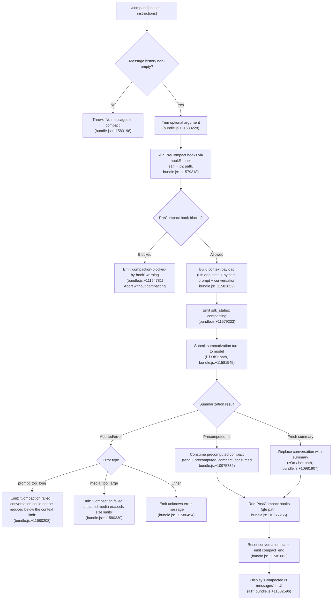

# `/compact`

> Analysis basis: CC v2.1.197 bundle.js (AST extraction + Claude interpretation)
> Minimum version: v2.1.197

---

## Overview

`/compact` frees up context window space by summarizing the current conversation history into a condensed representation. The command invokes an async handler (`o1f`) that orchestrates a multi-phase pipeline: running `PreCompact` hooks, requesting a summarization turn from the model (optionally guided by custom instructions), replacing the conversation history with the resulting summary, and then running `PostCompact` hooks. An optional argument allows the user to supply custom summarization instructions.

---

## Registration

| Field | Value |
|---|---|
| type | `local` |
| name | `compact` |
| description | `Free up context by summarizing the conversation so far` |
| argumentHint | `<optional custom summarization instructions>` |
| supportsNonInteractive | `true` |
| thinClientDispatch | `post-text` |
| module_id | `DUl` |
| load_inline | `true` |
| loc_byte | `11583696` |
| loc_byte_end | `11583996` |
| loc_line | `7445` |
| arbor_handler.name | `o1f` |
| arbor_handler.fqn | `claude-2.1.197::o1f` |
| arbor_handler.kind | `AsyncFunction` |
| arbor_handler.resolution_path | `module_id` |
| arbor_handler.n_hits | `0` |

Analysis basis: CC v2.1.197 bundle.js:+11583696

---

## Input Branching

The command has 4+ distinct branches depending on whether there are messages to compact, whether a custom instruction argument is provided, whether a `PreCompact` hook blocks the operation, and whether the summarization succeeds or fails. A Mermaid flowchart is used.



---

## Behavioral Spec

### 1. Entry Point and Argument Validation

The async handler `o1f` is the primary entry point resolved via `module_id` (`DUl`).

```
async function compactCommandHandler(context, rawArgument):
    instructions = rawArgument.trim()          // bundle.js:+11583228
    messages = getConversationMessages(context)
    if messages is empty:
        throw Error("No messages to compact")  // bundle.js:+11583196
    proceed with instructions (may be empty string)
```

Analysis basis: CC v2.1.197 bundle.js:+11583165

---

### 2. PreCompact Hook Phase

The hook orchestrator (`s1f`) fires `PreCompact` lifecycle hooks before any summarization work begins. The hook type string `"PreCompact"` is registered at bundle.js:+13755779.

```
async function runPreCompactPhase(context, instructions):
    startTime = performance.now()              // bundle.js:+11579254
    emit progress("hooks_start")               // bundle.js:+11579148
    emit progress("pre_compact")               // bundle.js:+11579171

    hookResult = await hookRunner(context, "PreCompact", payload)
    // hookRunner = pZ → Ld chain, bundle.js:+11579318

    if hookResult.blocked:
        emit warning("compaction-blocked-by-hook",
                     "compaction blocked by PreCompact hook")
        // bundle.js:+11154781, +11154815
        return BLOCKED
    return ALLOWED
```

Analysis basis: CC v2.1.197 bundle.js:+11579254, +11579305

---

### 3. Context Assembly

`l1f` assembles the full payload that will be sent to the summarization model call. It reads app state, the current system prompt, and the conversation history.

```
function buildCompactionPayload(context):
    appState = context.getAppState()           // bundle.js:+11582652
    systemPrompt = context.getSystemPrompt()   // bundle.js:+8932323
    messages = Array.from(conversationMessages) // bundle.js:+11582719
    // Filter and serialize messages via messageSerializer (Ur/IW chain)
    return { appState, systemPrompt, messages }
```

The message serializer (`IW`, bundle.js:+8932148) handles multiple content block types including `"assistant"`, `"user"`, `"api_system"`, and `"attachment"` (bundle.js:+11205371, +11205393, +11205410, +11205489).

The compact boundary marker `"compact_boundary"` is injected as a system-type block during reassembly (bundle.js:+14100811).

Analysis basis: CC v2.1.197 bundle.js:+11582652, +11582776

---

### 4. Summarization Request

`i1f` manages the actual summarization request to the model. A precomputed compaction cache is checked first.

```
async function requestSummarization(payload, instructions, abortSignal):
    startTime = performance.now()              // bundle.js:+11581464

    // Check precomputed compact cache (qOo)
    cached = precomputedCompactCache.get(cacheKey)  // bundle.js:+10973092
    if cached exists and is ready:
        emit telemetry("tengu_precomputed_compact_consumed")
        // bundle.js:+10975732
        return consumePrecomputed(cached)       // dSt path

    // No cache hit — run live summarization
    emit progress("stream_mode", "requesting")  // bundle.js:+11579552
    emit sdk_status("compacting")               // bundle.js:+11579233

    result = await modelSummarizationTurn(payload, instructions)
    // Model turn via dSt → Her chain, bundle.js:+11581545

    if aborted:
        return { status: "aborted" }           // bundle.js:+11581653
    if boundaryUuidMissing:
        emit("boundary_uuid_missing")           // bundle.js:+11581907
    return result
```

If the precomputed result is stale or inapplicable, it is discarded and a telemetry event `tengu_precomputed_compact_discarded` is emitted (bundle.js:+10976371).

Analysis basis: CC v2.1.197 bundle.js:+11581464, +11581545

---

### 5. Summary Application and History Replacement

`zOo` applies the summarization result to the conversation history. `ber` performs the full replacement pipeline including token accounting.

```
async function applySummary(context, summaryResult):
    emit progress("compact_start")             // bundle.js:+11579677
    // Truncate old messages, preserve boundary marker
    trimmedHistory = truncateToCompactBoundary(conversationMessages)
    // zOo: find boundary index, slice messages  bundle.js:+10976245, +10976303

    // Compute token savings
    tokensBefore = computeTokenCount(originalMessages)   // W9t/xlo path
    tokensAfter  = computeTokenCount([summaryMessage])   // Z$n/Q$n path
    savings = tokensBefore - tokensAfter

    // Replace history with summary message
    replaceConversationHistory(summaryMessage)  // ber, bundle.js:+10982396

    emit telemetry("tengu_reactive_compact_succeeded")  // bundle.js:+10983676
    return { savings, compactMetadata }         // "compactMetadata" bundle.js:+11580538
```

The literal `"Conversation compacted"` (bundle.js:+14100367) is emitted as part of the system-level boundary message injected into the new history.

Analysis basis: CC v2.1.197 bundle.js:+10981907, +10982396

---

### 6. Error Handling

Three recognized failure modes exist, each with a distinct user-facing message:

| Condition | User Message | Source loc_byte |
|---|---|---|
| `prompt_too_long` | `"Compaction failed · conversation could not be reduced below the context limit"` | +11580208 |
| `media_too_large` | `"Compaction failed · attached media exceeds size limits"` | +11580330 |
| Other / unknown | `"unknown error"` | +11580454 |

Reactive compaction (auto-triggered path via `ZOo`) additionally emits `"compact_reactive_aborted"` (bundle.js:+10981707) when aborted and `"reactive compaction failed"` (bundle.js:+11580875) on unrecoverable failure.

Analysis basis: CC v2.1.197 bundle.js:+11580138

---

### 7. PostCompact Cleanup Phase

`qfe` orchestrates the post-compact cleanup. It clears multiple caches, resets autonomous loop state, and fires the `PostCompact` hook.

```
async function runPostCompactPhase(context):
    cleanupCompactEntry(context)               // Eer: clears KW, GOo, fYt, Sze caches
    // bundle.js:+10977164

    clearInternalCaches()                      // ger: Lkl.clear  bundle.js:+10977259
    clearAdditionalCaches()                    // RRa: n6t, Amo   bundle.js:+10977265
    resetAutonomousLoopDelivered()             // bundle.js:+10977297

    hookResult = await runHooks("PostCompact", context)
    // PostCompact hook string: bundle.js:+13790299

    emit progress("post_compact")              // bundle.js:+10983071
    emit progress("post_compact_cleanup")      // bundle.js:+10977170
```

Analysis basis: CC v2.1.197 bundle.js:+10977154

---

### 8. UI Completion Display

`a1f` handles the final UI update after a successful compact.

```
function displayCompactSuccess(context, messageCount):
    registerKeyBinding(
        "app:toggleTranscript",                // bundle.js:+11582457
        scope: "Global",
        key: "ctrl+o"                          // bundle.js:+11582489
    )
    displayText("Compacted " + messageCount + " messages")
    // "Compacted " literal: bundle.js:+11582596
    emit dimmed text via It.dim                // bundle.js:+11582589
```

Analysis basis: CC v2.1.197 bundle.js:+11580819, +11582596

---

### 9. Reactive Compact Path (Auto-Triggered)

`ZOo` is the reactive compaction path invoked automatically when context approaches limits (not triggered by user). It shares the `ber` application pipeline with the manual path but adds group-count validation:

- Requires at least 2 message groups to proceed; emits `"too_few_groups"` and bails if fewer (bundle.js:+11579477 / `"Reactive compact: fewer than 2 groups, nothing to compact"` at bundle.js:+5444484).
- Maximum of 3 groups used for the summarization seed (numeric literal `3`, bundle.js:+5444726).
- If the model returns no assistant message in the summary: emits `"no assistant message in summarization response"` (bundle.js:+5443132).
- On `media_too_large` error, retries with media stripped (bundle.js:+5446175); if still fails, emits `"media_unstrippable"` (bundle.js:+5446290).

Analysis basis: CC v2.1.197 bundle.js:+10981907, +5444484

---

## State & Side Effects

| Item | Detail |
|---|---|
| Telemetry | `tengu_run_hook` (+13811295), `tengu_feature_bad` (+1028846), `tengu_hook_plugin_metrics` (+13789073), `tengu_feature_ok` (+1028779), `tengu_silent_harbor` (+13878822), `tengu_slate_harrier` (+13887656), `tengu_orchid_mantis_v2` (+13873496), `tengu_orchid_mantis` (+13874345), `tengu_sepia_moth` (+10968461), `tengu_precomputed_compact_consumed` (+10975732), `tengu_precomputed_compact_discarded` (+10976371), `tengu_post_compact_file_restore_success` (+11172067), `tengu_post_compact_file_restore_error` (+11172109), `tengu_reactive_compact_succeeded` (+10983676), `tengu_compact_credits_clamp_rescue` (+5445136), `tengu_reactive_compact_attempt` (+5445293), `tengu_reactive_compact_failed` (+10981198), `tengu_feature_sad` (+1028927), `tengu_keybinding_fallback_used` (+4032658) |
| Hook lifecycle | Fires `PreCompact` hook before summarization (string at +13755779). Fires `PostCompact` hook after cleanup (string at +13790299). Hook blocking causes abort with warning `"compaction-blocked-by-hook"` (+11154781). |
| Cache mutations | PostCompact cleanup clears: `KW`, `GOo`, `fYt`, `Sze` (compaction entry caches, +10976797–+10976858), `Lkl` (+10954222), `n6t`, `Amo` (+6890845, +6890857). |
| appState changes | Conversation history is replaced with compact summary. `compactMetadata` field is written to app state (+11580538). Autonomous loop delivered counter is reset (+10977297). |
| Keybinding registration | Registers `app:toggleTranscript` → `ctrl+o` (Global scope) on successful compact (+11582457, +11582489). |
| Progress events | Emits `compact_progress`, `hooks_start`, `pre_compact`, `sdk_status/compacting`, `compact_start`, `compact_end`, `post_compact`, `post_compact_cleanup`, `notification` at various lifecycle points. |
| Sound | <!-- TODO: not found in depth-2 traversal; needs --depth 4 --> |

---

## Version History

| Version | Change |
|---|---|
| v2.1.197 | Initial analysis |

---

## Common Mistakes

1. **Running `/compact` on an empty session** — the handler immediately throws `"No messages to compact"` (bundle.js:+11583196) if the conversation history is empty. This is a hard error, not a no-op.
2. **Expecting hooks to always allow compaction** — a `PreCompact` hook returning a block decision will silently abort the entire compact cycle. The UI shows a warning (`"compaction blocked by PreCompact hook"`) but does not retry.
3. **Confusing manual and reactive compact** — reactive compaction (auto-triggered at context limits) shares the `ber` application pipeline but has additional preconditions (minimum 2 groups) and retry logic for media-too-large errors that the manual `/compact` path does not expose.
4. **Assuming custom instructions are required** — the argument is optional; when omitted (empty string after trim), the model uses its default summarization behavior. The `argumentHint` field signals optionality with angle-bracket syntax.
5. **Treating compaction as synchronous** — the handler is an `AsyncFunction` (`o1f`). In non-interactive (`supportsNonInteractive: true`) mode, the caller must await completion before reading the new conversation state.
6. **Expecting the full original history to persist** — after a successful compact, the conversation history is fully replaced by the summary message plus the `compact_boundary` system block. Previous messages are not recoverable from in-memory state.

---

## Appendix — Identifier Mapping

> For bundle debugging only. Identifiers change across versions.

| Identifier | Role |
|---|---|
| `o1f` | Main async handler for `/compact` command (Arbor-resolved entry point) |
| `PH` | Message content normalizer / block serializer |
| `Bnr` | Content block helper called during message normalization |
| `_E` | Low-level math/rounding utility used in token counting |
| `s1f` | Hook orchestrator; runs PreCompact hooks and kicks off summarization pipeline |
| `eC` | Internal utility called during context assembly and summarization |
| `hRf` | Helper filtering message roles (assistant/user/api_system) |
| `SRe` | Role classification sub-helper |
| `Rtr` | System prompt block assembler (handles all system block types) |
| `pZ` | PreCompact hook runner |
| `Ld` | Hook dispatch core |
| `Rt` | Runtime/platform detection utility |
| `q1` | Secondary platform/model detection |
| `QC` | Model capability resolver (claude-3-*, claude-opus-4-*, etc.) |
| `nO` | Hook effort/mode resolver |
| `zx` | Worktree/directory context builder |
| `Ot` | OS/platform info helper |
| `BFe` | Hook configuration loader |
| `a0` | Hook execution engine (runs individual hooks, handles all hook types) |
| `Z3` | Policy settings reader |
| `T` | Model name normalizer / canonical model string builder |
| `uIe` | App-state reader helper |
| `_8o` | Plugin/hook matcher and filter |
| `Ldc` | Hook filter for loaded hooks |
| `H8o` | Third-party hook filter |
| `Rdc` | Hook registry deduplicator |
| `Fn` | Generic function wrapper utility |
| `V` | Success result constructor |
| `Me` | JSON serializer wrapper |
| `ke` | Error logging helper |
| `Re` | Async result wrapper (OK path) |
| `sBe` | Async result wrapper (error path, `Mfn`) |
| `VR` | Abort controller / timeout manager for hooks |
| `g` | Callback dispatcher |
| `tge` | Hook output parser |
| `v1` | Hook state machine step |
| `Pur` | Hook result processor |
| `p8o` | HTTP hook executor |
| `Uur` | Hook output JSON parser |
| `Zfe` | Hook plugin metrics collector |
| `d8o` | MCP hook executor |
| `vdc` | HTTP hook output parser |
| `jTe` | Hook timeout guard |
| `$ur` | Command/spawn hook executor |
| `Mje` | Hook post-processing utility |
| `xe` | Async result wrapper variant |
| `h9` | Telemetry emitter with rate-limiting |
| `l1f` | Context payload assembler (app state + system prompt + messages) |
| `YR` | System prompt block builder (full pipeline) |
| `P8o` | System prompt section: env info |
| `oo` | Model inference-profile check |
| `Qtr` | Tool listing for system prompt |
| `Rr` | Raw API call wrapper |
| `Uxe` | Pewter-owl tool check |
| `Kx` | Model context selector |
| `Bam` | User-output-style system prompt section |
| `Gam` | Confirmation-for-hard-to-reverse-actions section |
| `Wam` | Confirmation variant (extended context) |
| `oLn` | Fable identity prefix check |
| `eV` | Ca-based system prompt section |
| `OFi` | x$t-based system prompt section |
| `B_e` | fable_5_mitigations flag reader |
| `it` | Feature-flag / experiment resolver |
| `$8o` | Model-specific system prompt section (claude-opus-4-7 etc.) |
| `Elm` | $8o wrapper for system prompt |
| `wK` | SDK mode detector |
| `rlm` | Autonomous/routine system prompt sections |
| `iFt` | Memory loader for system prompt |
| `plm` | Environment info static section |
| `dlm` | Environment info simple section |
| `Yam` | Language system prompt section |
| `Jam` | Output style section |
| `mlm` | Background session section |
| `FYn` | Scratchpad section |
| `hlm` | Brief mode section |
| `ylm` | Flag-settings section |
| `ilm` | Act-dont-rederive section |
| `Kam` | Heron-brook section |
| `zam` | Autonomy-append section |
| `Ybl` | Context management section |
| `slm` | Reproduce-verify-workflow section |
| `Xam` | Autonomy-append placeholder |
| `Qam` | System compaction reminder section |
| `Zam` | Verified-vs-assumed section |
| `elm` | $8o alias section |
| `tlm` | Tool-use reminder section |
| `olm` | NK-based section |
| `CBi` | IBi/mJr memory section |
| `$xe` | XP/Su/Hr first-party/aws section |
| `Jdc` | Jdc composite section builder |
| `Ur` | Conversation message reader (getAppState + findLast) |
| `gtr` | Working-directory context reader |
| `htr` | Allowed/disallowed tools reader |
| `AR` | Permission mode reader |
| `IW` | Message serializer for context payload |
| `Sc` | Message serializer helper |
| `QI` | Content block serializer |
| `eo` | Module initializer |
| `Ih` | System prompt extractor |
| `Oe` | Error result constructor |
| `qe` | $Xe-based result wrapper |
| `Etr` | Model-name-based context builder |
| `oNo` | Notification progress emitter |
| `i1f` | Summarization request executor |
| `qOo` | Precomputed compaction cache checker |
| `mYt` | Cache lookup utility |
| `dSt` | Precomputed compact consumer |
| `Her` | Compaction hit handler |
| `Gh` | Token count logger |
| `Mo` | $Xe-based result builder |
| `zOo` | Conversation history truncator (find boundary + slice) |
| `yer` | Summarization result emitter with timing |
| `ber` | Full summary application pipeline |
| `o5e` | Context type checker |
| `ZP` | Agent-custom prefix checker |
| `HE` | Compaction message assembler |
| `Pua` | Compact message content builder |
| `Yre` | Compact message role assigner |
| `D9t` | Compact message entry builder |
| `aWe` | Token-savings tracker |
| `bX` | Plugin/nfa helper |
| `nfa` | nfa utility |
| `a4t` | Token accounting helper |
| `sFn` | Tool-name prefix checker |
| `uWe` | Compact metadata writer (mkdir + writeFile) |
| `lQe` | lQe compact helper |
| `fSt` | fSt compact helper (Kc/vi) |
| `Kc` | vi wrapper |
| `gYt` | UUID generator for compact entries |
| `uZ` | Message normalization utility |
| `aRf` | Array type checker |
| `iRf` | $se helper |
| `Sxf` | Post-compact state restore pipeline |
| `Ier` | Post-compact file restore (Okf/Ukf/ps) |
| `Ler` | Local agent state restore |
| `Cer` | GD/BD context restore |
| `wer` | Ur/BD/GD combined restore |
| `ver` | lAr/Nkf/Ef tool-list restore |
| `Cbe` | kO/lX/k1e/fNo compact-state restore |
| `W1e` | Full message-list reassembler post-compact |
| `Aze` | kO/lX/k1e push-based restore |
| `ci` | Conversation item factory (uuid + timestamp) |
| `bq` | Hook session-start plugin loader |
| `j1e` | Summary message injector (Ld + a0) |
| `e1o` | Message map utility |
| `Pze` | Message filter utility |
| `Tbe` | Compact metadata updater |
| `W9t` | Token count before compact (xlo/Math.max) |
| `xlo` | _E-based token estimator |
| `Z$n` | Rounded token delta calculator |
| `Q$n` | Token accounting across message types |
| `Tx` | Full system-prompt + message serializer |
| `Ef` | Token rounding utility |
| `Cmp` | Per-message-type token accumulator |
| `SR` | QC + nO combined resolver |
| `yg` | App state getter for compact |
| `ZOo` | Reactive compaction orchestrator |
| `yFn` | Reactive compact group splitter and summarizer |
| `g4t` | PH/Idt-based group builder |
| `Mfa` | Math.max/floor utility for group sizing |
| `kgp` | Reactive compact model call handler |
| `Rgp` | Retry helper for reactive compact |
| `zut` | h_-based cancellation helper |
| `U9` | Telemetry path sanitizer |
| `Cgp` | URL userinfo redactor |
| `Tgp` | mcp__ tool name redactor |
| `Hgp` | ggp.test-based path redactor |
| `ygp` | Phone number redactor |
| `fgp` | IP address redactor |
| `cgp` | Email redactor |
| `agp` | Home-directory redactor |
| `Sgp` | Generic path redactor |
| `Egp` | api-error-body redactor |
| `bgp` | Truncated-content redactor |
| `Ilo` | Progress/status emitter for reactive compact |
| `wt` | V/Oe result wrapper |
| `he` | String coercion helper |
| `qfe` | Post-compact cleanup orchestrator |
| `Eer` | Compaction entry cache cleaner |
| `O9t` | bx-based cleanup helper |
| `bx` | bx utility |
| `jwt` | jwt cleanup step |
| `Kwt` | H0/Sae cleanup step |
| `ger` | Lkl.clear cache invalidator |
| `RRa` | n6t/Amo cache invalidator |
| `Ypl` | Ypl state resetter |
| `POe` | POe state resetter |
| `Jy` | sQe/Object.values cleanup |
| `JOo` | JOo final cleanup |
| `hdt` | s4t.setState app-state updater |
| `a1f` | UI completion display (keybinding + "Compacted N" text) |
| `jqe` | Klf-based modal/tip helper |
| `Klf` | d6/Jre/Sde/Ew/nS model selector UI |
| `ov` | BDn/GDn action dispatcher |
| `BDn` | v2t-based dispatch |
| `GDn` | Ceo/WVi/jt dispatch |
| `Uke` | OTEL metrics emitter for compact completion |
| `Xc` | OTEL event emitter |
| `W6e` | OTEL attribute builder |
| `nSr` | OTEL nSr emitter |
| `rSr` | OTEL rSr emitter |
| `xae` | xae post-compact helper |