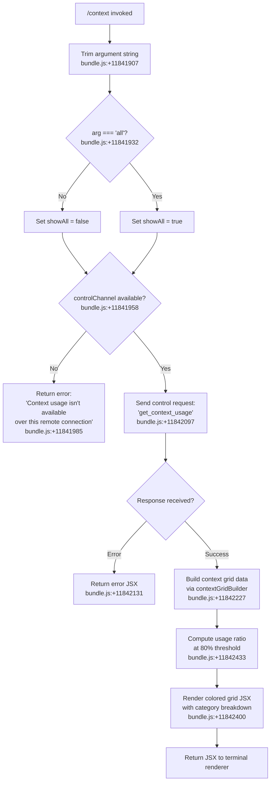

# `/context`

> Analysis basis: CC v2.1.197 bundle.js (AST extraction + Claude interpretation)
> Minimum version: v2.1.197

---

## Overview

`/context` visualizes the current conversation's context window usage as a colored grid rendered in the terminal. It dispatches a `get_context_usage` control request to the active session's control channel, then renders a JSX-based grid display broken down by category (system prompt, tools, messages, memory files, etc.) along with numeric token counts and a percentage usage bar. The command is unavailable over remote connections that lack a control channel.

---

## Registration

| Field | Value |
|---|---|
| type | `local-jsx` |
| name | `context` |
| description | `Visualize current context usage as a colored grid` |
| argumentHint | `[all]` |
| thinClientDispatch | `control-request` |
| module_id | `uBl` |
| load_inline | `true` |
| loc_byte | `11843303` |
| loc_byte_end | `11843529` |
| loc_line | `7578` |
| arbor_handler.name | `OFf` |
| arbor_handler.fqn | `claude-2.1.197::OFf` |
| arbor_handler.kind | `AsyncFunction` |
| arbor_handler.resolution_path | `module_id` |
| arbor_handler.n_hits | `0` |

Analysis basis: CC v2.1.197 bundle.js:+11843303

---

## Input Branching

The handler has 3+ distinct execution paths depending on the argument value, the availability of a control channel, and the response from the daemon.



---

## Behavioral Spec

### Handler Entry Point (`OFf`)

Analysis basis: CC v2.1.197 bundle.js:+11841901

```
async function contextCommandHandler(args, options):
    rawArg = args.trim()                          // bundle.js:+11841907
    showAll = (rawArg === "all")                  // bundle.js:+11841932

    controlChannel = options.eN(...)              // check control channel availability
    if not controlChannel:                        // bundle.js:+11841955
        return errorMessage(
            "Context usage isn't available over this remote connection"
        )                                         // bundle.js:+11841985

    response = await options.sendControlRequest(
        "get_context_usage"                       // bundle.js:+11842097
    )

    if response is error:
        return renderErrorJSX(response)           // bundle.js:+11842131

    gridData = buildContextGrid(response, showAll) // bundle.js:+11842227
    usageRatio = computeUsage(gridData)

    return renderContextGridJSX(gridData, usageRatio, showAll)
```

### Control Channel Check (`eN`)

Analysis basis: CC v2.1.197 bundle.js:+11841955

```
function checkControlChannel(options):
    // Resolves whether the current session has an active local control
    // channel. Returns falsy when running over a remote/thin-client
    // connection that cannot service local control requests.
    channel = options.td(...)                     // bundle.js:+11841940
    return channel if channel else null
```

### Context Grid Builder (`mXt`)

Analysis basis: CC v2.1.197 bundle.js:+11842227

The grid builder receives the raw usage object from the daemon and produces a structured array of labeled sections with token counts.

```
function buildContextGrid(usagePayload, showAll):
    sections = usagePayload.filter(...)           // bundle.js:+11840004

    // Category labels discovered in literals:
    // "Free space"          bundle.js:+11840039
    // "Autocompact buffer"  bundle.js:+11840062
    // "System prompt"       bundle.js:+11188412
    // "System tools"        bundle.js:+11188493
    // "MCP tools"           bundle.js:+11188558
    // "Memory files"        bundle.js:+11188876
    // "Messages"            bundle.js:+11189356
    // "Skills"              bundle.js:+11188938
    // "Custom agents"       bundle.js:+11188809
    // "Permission"          bundle.js:+11188840

    if not showAll:
        sections = sections.filter(visible only) // bundle.js:+11840004

    systemEntry = sections.find(isSystemEntry)   // bundle.js:+11840322

    // Locate system prompt section for special rendering
    // (labelled "projectSettings", "userSettings", "localSettings",
    //  "Flag", "Policy", "Plugin", "Built-in" per literals)

    return { sections, systemEntry, total: computeTotal(sections) }
```

### Usage Ratio Computation (`$ae`)

Analysis basis: CC v2.1.197 bundle.js:+11841739

```
function computeUsageRatio(total, capacity):
    ratio = yl(total / capacity)                  // format helper bundle.js:+11841739
    roundedPercent = Math.round(ratio * 100)      // bundle.js:+223348
    // Threshold markers found in literals:
    // 20  -> color boundary "< 20"  bundle.js:+223328
    // 10  -> secondary boundary     bundle.js:+223361
    // 80  -> warning threshold      bundle.js:+11842433
    return { ratio, roundedPercent }
```

### JSX Renderer (`PFf` / `PH`)

Analysis basis: CC v2.1.197 bundle.js:+11842400

```
function renderContextGridJSX(gridData, usageRatio, showAll):
    // PH clips the compact boundary for display bundle.js:+11841863
    compactBoundary = PH(gridData)               // bundle.js:+14100811 literal: "compact_boundary"

    // Renders a colored grid where each cell represents a token bucket.
    // Colors follow category-color mapping:
    //   "promptBorder"             bundle.js:+11188443
    //   "cyan_FOR_SUBAGENTS_ONLY"  bundle.js:+11188585
    //   "purple_FOR_SUBAGENTS_ONLY"bundle.js:+11189382
    //   "warning"                  bundle.js:+11188962
    //   "claude"                   bundle.js:+11188906

    grid = buildGrid(gridData.sections, compactBoundary)

    // Number formatting uses "en-US" locale, "compact" notation
    // bundle.js:+225303 / +225321

    return JSX(
        <ContextGrid
            grid={grid}
            ratio={usageRatio}
            sections={gridData.sections}
            showAll={showAll}
        />
    )
```

### Streaming Output Helper (`bht`)

Analysis basis: CC v2.1.197 bundle.js:+11842127

```
function streamContextOutput(responseStream, renderFn):
    // Attaches to response stream events (bundle.js:+8417073)
    // Converts buffer to string (bundle.js:+8417110)
    // Dispatches to JSX renderer qV (bundle.js:+8417137)
    responseStream.on("data", (chunk) => {
        text = chunk.toString()
        rendered = renderJSX(text)
        output(rendered)
    })
```

### Number Formatting Helper (`yl` / `ou`)

Analysis basis: CC v2.1.197 bundle.js:+11839963

```
function formatTokenCount(n):
    // Uses Intl.NumberFormat with locale "en-US", notation "compact"
    // Appends ".0" when decimal part is zero  bundle.js:+223289
    // Threshold for "< 20" label              bundle.js:+223328
    formatted = new Intl.NumberFormat("en-US", { notation: "compact" }).format(n)
    return formatted
```

---

## State & Side Effects

| Item | Detail |
|---|---|
| Telemetry | No `tengu_*` events were observed within the depth-2 traversal of `OFf` directly; several events fire in callee sub-trees (e.g. `tengu_amber_creek` at +3587999, `tengu_pewter_brook` at +3587906 in the display-mode helpers reached via `$s`). |
| Control request | Emits `get_context_usage` over the local control channel (`o.sendControlRequest` at bundle.js:+11842067). |
| Hook registration | `vi` → `yis.register` (bundle.js:+68542) is reachable through the logging/session setup path. |
| appState changes | None observed; command is read-only display. |
| Sound | None. |
| Remote-connection guard | Returns a hard error string when `controlChannel` is absent (bundle.js:+11841985). Dispatch type `control-request` means thin clients forward the command but require a reachable local daemon. |

---

## Version History

| Version | Change |
|---|---|
| v2.1.197 | Initial analysis |

---

## Common Mistakes

1. **Running over SSH without a local daemon** — `/context` requires a live control channel. Over a plain SSH session without the CC daemon the command returns "Context usage isn't available over this remote connection" immediately.
2. **Expecting `/context` to modify context** — The command is purely a read-only visualization; it does not compact, clear, or alter the context window in any way. Use `/compact` to reduce context.
3. **Omitting `all` and missing hidden sections** — By default some low-level buckets (e.g. internal system sections) are filtered out. Pass `/context all` to surface every category in the grid.
4. **Confusing token counts with byte counts** — All numbers displayed are token counts formatted with compact notation (e.g. "128k"), not raw byte sizes.
5. **Interpreting the 80 % threshold as a hard limit** — The 80 % marker (bundle.js:+11842433) triggers a color change in the grid (warning color) but does not block further usage; it is a visual indicator only.

---

## Appendix — Identifier Mapping

> For bundle debugging only. Identifiers change across versions.

| Identifier | Role |
|---|---|
| `OFf` | Main async handler for `/context` command |
| `$s` | Display-mode/fullscreen capability resolver |
| `DP` | OPu.has capability check helper |
| `aD` | Feature-flag enabled check (`WLi.isEnabled`) |
| `oXr` | Terminal color-support probe |
| `ct` | String coercion / terminal capability helper |
| `qne` | Context-usage data accessor |
| `E4d` | Environment detection (iTerm/screen/tmux) |
| `y4d` | `TERM` prefix check (`e.startsWith`) |
| `Vve` | tmux control-mode detector |
| `T` | Generic text/token formatting utility |
| `deu` | Debug log / token formatter bootstrap |
| `Sis` | Sub-formatter helpers (`HXc`, `_Xc`) |
| `Me` | `JSON.stringify` wrapper |
| `Pc` | Path/name formatter with redaction |
| `scs` | Segment map builder (`leu.map`) |
| `KQe` | Write-to-stream wrapper (`zls`) |
| `geu` | Session/transcript logging helper |
| `SQe` | Batched-output debounce writer |
| `Che` | Output chunk assembler |
| `lcs` | Log-file path joiner |
| `lTr` | Log file rotation helper |
| `meu` | Log directory/append helper |
| `vi` | Hook registrar (`yis.register`) |
| `rXr` | Windows/SSH flicker-guard |
| `Rr` | Settings loader |
| `O8` | Settings-load orchestrator |
| `ga` | Memory-usage sampler (`process.memoryUsage`) |
| `xDr` | Policy/flag settings resolver |
| `I3` | Settings composition aggregator |
| `S4d` | Session state initializer |
| `it` | App-state accessor |
| `akn` | Pending-event deduplicator |
| `Dt` | Date-stamped state updater |
| `td` | Control-channel accessor (resolves channel handle) |
| `eN` | Control-channel availability checker |
| `bht` | Response stream event attacher |
| `qV` | JSX render dispatcher |
| `seo` | React/JSX createElement call |
| `cre` | Outer context-grid React component |
| `Z0e` | Inner grid-row renderer |
| `zZr` | Grid-cell color mapper |
| `mXt` | Context grid data builder |
| `yl` | Token-count formatter (Intl.NumberFormat) |
| `ou` | Format helper invoker (`Aeu`) |
| `aHe` | Section-label resolver |
| `$ae` | Usage-ratio calculator (`Math.round`) |
| `he` | String coercion helper |
| `PFf` | Context grid JSX renderer entry |
| `PH` | Compact-boundary slicer |
| `Bnr` | Boundary marker helper (`_E`) |
| `btr` | Full system-prompt builder (sub-tree) |
| `sR` | System prompt composer |
| `d6` | Model-prefix resolver |
| `Fa` | Provider/gateway-type formatter |
| `dT` | Tool-description renderer |
| `Hr` | Model/context helper |
| `TF` | Available-models policy enforcer |
| `ali` | Admin-policy source aggregator |
| `YR` | Full request/response turn builder |
| `Rtr` | Message history serializer |
| `mXt` | (same as above — context grid builder) |
| `MSt` | MCP-tool schema builder |
| `TWe` | Token-count aggregator across tool schemas |
| `cNo` | Token-count per-tool entry builder |
| `btr` | Context breakdown aggregator |
| `Jkf` | Per-tool/per-server context-row builder |
| `kUn` | Token-budget layout calculator |
| `PGe` | Per-row pixel/cell width calculator |
| `FEe` | Row renderer helper |
| `Kre` | Context window capacity resolver |
| `qut` | Output-token cap resolver |
| `Nxe` | Model context-size table lookup |
| `ZFo` | Final JSX wrapper for `/context` output |
| `mXt` | (see above) |
| `aHe` | Section label map |
| `S5` | MCP server state accessor |
| `Ev` | Per-server token entry |
| `NK` | Tool-list flatMap helper |
| `rlm` | Scheduled-routines prompt builder |
| `iFt` | Memory-file prompt loader |
| `CBi` | Custom-agent context section builder |
| `IBi` | Agent context entry builder |
| `$xe` | Extra-context section helper |
| `Jdc` | Countdown / padded-countdown renderer |
| `Ner` | Infinite/fixed window label resolver |
| `IW` | Main-thread system-prompt assembler |
| `QI` | Context entry type builder |
| `Yut` | Assistant-message usage extractor |
| `zre` | Last-assistant-usage finder |
| `qkf` | Built-in tool context-section builder |
| `Kkf` | Claude.md / memory file section builder |
| `Xce` | claudeMd section entry |
| `zkf` | MCP-server section builder |
| `Xkf` | MCP deferred-tool section builder |
| `Qkf` | System-tool section builder |
| `Ykf` | Custom-agent section builder |
| `nRf` | Section token-count reducer |
| `Zkf` | Token formatter for section rows |
| `eRf` | Tool-result token counter |
| `tRf` | Thinking-block token counter |
| `Tx` | Message history token counter (full) |
| `Oua` | Context efficiency reporter |
| `eC` | Efficiency report formatter (`hRf`) |
| `hRf` | Formatted system-report renderer |