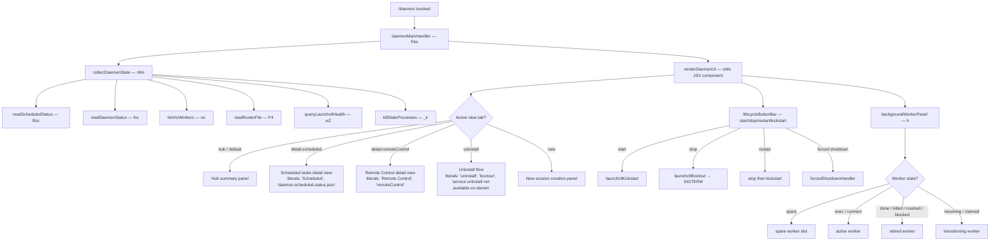

# `/daemon`

> Analysis basis: CC v2.1.197 bundle.js (AST extraction + Claude interpretation)
> Minimum version: v2.1.197

---

## Overview

The `/daemon` command provides an interactive management interface for Claude Code's background services and routines. It allows users to inspect daemon status, control lifecycle operations (start, stop, restart, uninstall), view scheduled task state, and monitor remote-control session activity. The command renders a live JSX UI component that consolidates multiple daemon subsystem views into a single panel.

---

## Registration

| Field | Value |
|---|---|
| type | `local-jsx` |
| name | `daemon` |
| description | `Manage background services and routines` |
| loc_byte | `13366221` |
| loc_byte_end | `13366389` |
| loc_line | `9170` |
| immediate | `true` |
| module_id | `sWo` |
| load_inline | `true` |
| arbor_handler.name | `Ftm` |
| arbor_handler.fqn | `claude-2.1.197::Ftm` |
| arbor_handler.kind | `AsyncFunction` |
| arbor_handler.resolution_path | `module_id` |
| arbor_handler.n_hits | `0` |

Analysis basis: CC v2.1.197 bundle.js:+13366221

---

## Input Branching

The command presents a tabbed/routed UI with multiple distinct views. Based on literals and the call graph, the following view branches are identifiable:



Analysis basis: CC v2.1.197 bundle.js:+13356071 (handler entry), +13355726 (scheduled status), +13355704 (daemon status), +13355677 (vic worker listing), +13355748 (roster), +13355766 (launchctl), +13356823 (detail-scheduled literal), +13356963 (detail-remoteControl literal), +13356634 (uninstall literal)

---

## Behavioral Spec

### 1. Main Handler — `daemonMainHandler` (Ftm)

The Arbor-resolved handler `Ftm` (AsyncFunction) is the command entry point. It invokes `collectDaemonState` to gather all subsystem data in parallel, then renders the `daemonRootComponent` JSX tree.

```
async function daemonMainHandler(commandContext):
    stateBundle = await collectDaemonState(commandContext)
    return renderJSX(daemonRootComponent, { stateBundle })
```

Analysis basis: CC v2.1.197 bundle.js:+13356071

---

### 2. State Collection — `collectDaemonState` (rWo)

Runs multiple subsystem reads in parallel via `Promise.all`, then resolves combined state. Key sub-calls (all concurrent where possible):

```
async function collectDaemonState(ctx):
    preliminaryCheck = await preliminaryFileCheck(ctx)   // $Ne
    [
        scheduledStatus,   // Bsc → daemon.scheduled.status.json
        daemonStatus,      // foc → daemon.status.json
        vicWorkers,        // vic → worker listing
        rosterData,        // P4  → roster.json
        launchctlHealth,   // wZ  → launchctl print / hor
        staleKillResult,   // _k  → kill stale PIDs
    ] = await Promise.all([...])
    resolvedKeys = Object.keys(result)
    return Promise.resolve(mergedState)
```

Analysis basis: CC v2.1.197 bundle.js:+13355630 (`$Ne`), +13355658 (Promise.all), +13355671 (Dic), +13355704 (foc), +13355726 (Bsc), +13355748 (P4), +13355766 (wZ), +13355683 (_k), +13355866 (Object.keys), +13355771 (Promise.resolve)

---

### 3. Scheduled Task Status Reader — `scheduledStatusReader` (Bsc)

Reads `daemon.scheduled.status.json` from the Claude data directory, parses it, and optionally signals running processes via `process.kill`. Falls back to `II` (a process-info helper) to collect metadata.

```
async function scheduledStatusReader(ctx):
    statusPath = pathJoin(dataDir, "daemon.scheduled.status.json")   // Fsc → Usc.join + Zn
    raw = await fs.readFile(statusPath)                              // Nsc.readFile
    parsed = JSON.parse(raw)                                         // implicit via $a
    if process still running:
        process.kill(pid, 0)   // existence check
    info = await processInfoHelper(pid)   // II
    return mergedStatus
```

File name literal: `"daemon.scheduled.status.json"` (bundle.js:+13261712)

Analysis basis: CC v2.1.197 bundle.js:+13261920 (readFile), +13261933 (Fsc), +13261971 ($a), +13262119 (process.kill), +13262175 (II)

---

### 4. Daemon Status Reader — `daemonStatusReader` (foc)

Reads `daemon.status.json`, checks active PIDs via `process.kill`, and retrieves additional process information.

```
async function daemonStatusReader(ctx):
    statusPath = pathJoin(dataDir, "daemon.status.json")   // _Zt → uoc.join + Zn
    sessionStore = getSessionStore()                        // Ks
    raw = await fs.readFile(statusPath)                    // implicit
    parsed = deserialize(raw)                              // $a
    if pid exists:
        process.kill(pid, 0)
    info = await processInfoHelper(pid)   // II
    return statusObject
```

File name literal: `"daemon.status.json"` (bundle.js:+13167883)

Analysis basis: CC v2.1.197 bundle.js:+13168170 (Ks), +13168180 (_Zt), +13168211 ($a), +13168367 (process.kill), +13168502 (II)

---

### 5. Worker Listing — `vicWorkerLister` (vic)

Enumerates active background worker processes by reading the session store and constructing a worker list. It calls `daemonFileReader` (`TYe`) to validate each worker's socket/stat file, then invokes `killStaleProcesses` (`_k`) on confirmed-dead entries.

```
async function vicWorkerLister(ctx):
    workerFiles = await daemonSocketChecker(ctx)   // TYe
    workerPaths = pathJoin(g2o, "daemon.json")     // sj
    staleKillResult = await killStaleProcesses(deadWorkers)  // _k
    activeWorkers = workerFiles.map(f => basename(f))  // nIe.basename
    return activeWorkers
```

File name literal: `"daemon.json"` (bundle.js:+11882394); `"same-dir"` placement literal (bundle.js:+13344252)

Analysis basis: CC v2.1.197 bundle.js:+13344085 (TYe), +13344089 (sj), +13344154 (_k), +13344173 (t.map), +13344209 (nIe.basename)

---

### 6. Socket/Stat File Checker — `daemonSocketChecker` (TYe)

Stats a candidate daemon socket/status file; rejects with `ENOENT`-aware error if absent or non-file; reads and parses its content; checks the session store for context continuity.

```
async function daemonSocketChecker(filePath):
    try:
        stat = await fs.stat(filePath)           // Iic.stat
    catch err:
        if err.code == "ENOENT":
            return Promise.reject(normalizedError())  // rn + Promise.reject
    if not stat.isFile():
        return Promise.reject(typeError)
    sessionCtx = getSessionStore()               // Ks → jfd.getStore
    subDir = computeSubDir(filePath)             // eWo → ZGo
    content = deserialize(fileContent)           // he + $a
    paddedKeys = Object.keys(content).padEnd(2, " ")  // o.padEnd, "  " literal
    return checkedResult
```

Error code literal: `"ENOENT"` (bundle.js:+13342325); padding literal: `"  "` (bundle.js:+18065407)

Analysis basis: CC v2.1.197 bundle.js:+13342294 (Iic.stat), +13342317 (rn), +13342339 (Promise.reject), +13342366 (i.isFile), +13342469 (Ks), +13342531 (eWo), +13342596 (he), +13342611 ($a), +13342689 (ZGo), +13342803 (Object.keys), +13342889 (o.has)

---

### 7. Roster File Reader — `rosterFileReader` (P4)

Reads `roster.json` from the background-session directory. Validates that the path refers to a regular file; if not, removes it and logs a warning. Parses JSON content, validates schema, and manages roster entry archiving and rotation via `archiveRoster` (`bor`) and timestamp helpers.

```
async function rosterFileReader(ctx):
    rosterPath = pathJoin(bgDir, "roster.json")   // tie → Zg.join, gme → Zn
    stat = await fs.lstat(rosterPath)             // Eme.lstat
    if not stat.isFile():
        logWarning("is not a regular file — removing")  // literal at +11893650
        await fs.rm(rosterPath)
        raise E2BIG / EFTYPE as appropriate        // literals +11893776, +11893788
    raw = await fs.readFile(rosterPath)           // Eme.readFile
    text = decode(raw)                            // Sn
    parsed = safeJsonParse(text)                  // Gt → JSON.parse
    if parse failed:
        logTelemetry("tengu_bg_roster_parse_failed")
        return emptyRoster
    validated = validateSchema(parsed, h3l)       // Array.isArray + Object.keys
    archived = await archiveIfNeeded(rosterPath, bor)
    enriched = assignMetadata(validated, FQe)
    return enriched
```

File name literal: `"roster.json"` (bundle.js:+11889339); error message literal: `"bg roster.json read/parse failed"` (bundle.js:+11894018); file-type error literal: `"is not a regular file — removing"` (bundle.js:+11893650)

Analysis basis: CC v2.1.197 bundle.js:+11893503 (Eme.lstat), +11893524 (r.isFile), +11893568 (Error), +11893694 (V), +11893773 (qe→E2BIG), +11893817 (bor), +11893834 (Eme.rm), +11893900 (TXt), +11893924 (Gt), +11893933 (Eme.readFile), +11894009 (Uo), +11894123 (ld), +11894285 (h3l), +11894314 (FQe)

---

### 8. LaunchCtl Health Check — `launchctlHealthCheck` (wZ)

On macOS, runs `launchctl print` with a 5000 ms timeout to determine whether the daemon LaunchAgent is registered with the OS service manager. Uses `process.getuid()` to form the correct service target.

```
async function launchctlHealthCheck():
    uidInfo = getProcessUID()                // hor → o3l → process.getuid
    result = await execFileNoThrow(          // Pn → Gr
        "launchctl",                         // literal +11885982
        ["print", serviceTarget],            // literal +11885995
        { timeout: 5000 }                    // literal +11886029
    )
    return parseServiceState(result)
```

Literals: `"launchctl"` (bundle.js:+11885982), `"print"` (bundle.js:+11885995), timeout `5000` ms (bundle.js:+11886029)

Analysis basis: CC v2.1.197 bundle.js:+11885979 (Pn), +11886003 (hor), +11882778 (process.getuid)

---

### 9. Stale Process Killer — `killStaleProcesses` (_k)

Reads the daemon PID file, validates it, sends `SIGTERM` (or `SIGKILL` as escalation), and cleans up the socket/status file after the process exits. Uses `processInfoReader` (`m2o`) to parse the PID file content.

```
async function killStaleProcesses(targetPath):
    pidFileInfo = await readPidFile(targetPath)   // eie → E1.lstat, E1.rm, E1.readFile
    if not pidFileInfo.isFile():
        remove stale socket                        // E1.rm, flag=65536
        return
    pid = await parsePidFile(targetPath)          // m2o → E1.readFile, t.split, n.slice
    if pid matches "claude daemon" process:        // literal +11881820
        process.kill(pid, signal)
    info = await processInfoHelper(pid)            // II → aR
    return killResult
```

PID identification literal: `"claude daemon"` (bundle.js:+11881820); removal flag: `65536` (bundle.js:+11880895); slice argument: `4` (bundle.js:+11881847); identifier string: `"daemon"` (bundle.js:+11881859)

Analysis basis: CC v2.1.197 bundle.js:+11881901 (eie), +11881929 (process.kill), +11881979 (m2o), +11882012 (II)

---

### 10. UI Component — `daemonRootComponent` (oWo)

A React/Ink functional component that maintains UI state and renders the tabbed daemon management panel. It sets up interval-based refresh, handles lifecycle button presses, manages abort controllers, and renders child panels.

```
function daemonRootComponent(props):
    [viewState, setViewState] = useState(initialState)   // uz.useState
    clockCtx = useClockContext()                          // ks → sVi.useContext
    startTime = Date.now()                                // s.now
    stateBundle = await collectDaemonState(...)           // rWo

    // Lifecycle handlers
    onStart    = () => launchctlAction("start", "kickstart")    // vAt → y2o
    onStop     = () => launchctlAction("stop", "bootout")       // vAt → bootout
    onRestart  = () => launchctlAction("restart")               // vAt → stop + kickstart
    onUninstall= () => navigate("uninstall")                     // literal "uninstall"

    // Refresh loop
    useRef/useMemo for timer ref                          // Wc
    intervalHandle = startRefreshInterval(...)            // u / R

    // Kill all workers on unmount
    onExit = () => killAllWorkers(o.values(...))         // H → P.kill

    // Input router
    onKeypress = (key) =>
        if key == "q" or escape: unmount()
        if key matches tab names: navigate(tab)

    // View router
    match viewState.tab:
        "hub"                → renderHubPanel(stateBundle)
        "detail-scheduled"   → renderScheduledPanel(stateBundle)   // literal +13356823
        "detail-remoteControl" → renderRemoteControlPanel(stateBundle) // literal +13356963
        "uninstall"          → renderUninstallFlow()               // literal +13356634
        "new"                → renderNewSessionPanel()             // literal +13356903

    // Sub-panels always rendered
    render workerPanel(h)                    // background worker grid
    render permissionWarning if needed       // literal "permission" +13358001
    render shutdownPrompt if forcedShutdown  // literal "forced shutdown" +18072838

    return jsx(rootLayout, children)
```

Literals: `"hub"` (bundle.js:+13356330), `"uninstall"` (bundle.js:+13356634), `"new"` (bundle.js:+13356903), `"detail-scheduled"` (bundle.js:+13356823), `"detail-remoteControl"` (bundle.js:+13356963), `"remoteControl"` (bundle.js:+13357072), `"Scheduled"` heading (bundle.js:+13357353), `"Remote Control"` heading (bundle.js:+13357639), `"Claude daemon"` heading (bundle.js:+13357913), `"permission"` (bundle.js:+13358001)

Analysis basis: CC v2.1.197 bundle.js:+13356203 (useState), +13356220 (ks), +13356252 (Date.now), +13356446 (rWo call), +13356463 (useRef), +13356476 (Wc), +13356533 (H), +13356596 (m), +13356602 (h), +13356654 (vAt), +13356685 (EXt), +13356788 (u), +13357550 (_), +13357568 (n)

---

### 11. LaunchCtl Lifecycle Action — `launchctlLifecycleAction` (vAt / y2o / EXt)

Performs the requested lifecycle operation by invoking `launchctl` sub-commands. On macOS (darwin), supports `start` (kickstart), `stop` (bootout), `restart` (stop then kickstart with 50-retry poll), and `uninstall`. Reports an error if uninstall is invoked on darwin.

```
async function launchctlLifecycleAction(action, ctx):
    homeDir = pathJoin(homeDir(), "Library", "LaunchAgents")  // _2o → h2o.homedir
    uidInfo = getProcessUID()                                   // hor → o3l
    match action:
        "start":
            execLaunchctl("kickstart", serviceTarget)           // literal "kickstart" +11884842
        "stop":
            execLaunchctl("bootout", serviceTarget)             // literal "bootout" +11884480
            await unlinkPidFile(serviceTarget)                  // vZ.unlink
        "restart":
            await stopAction()
            pollForExit(maxRetries=50)                          // literal 50 +11885135
            if timeout:
                log("daemon did not exit within 10s...")        // literal +11885164
                return
            await startAction("kickstart")
        "uninstall":
            log("service uninstall not available on darwin")    // literal +11884611
    result = decode(execResult)                                 // Sn, he
    return result
```

Literals: `"Library"` (bundle.js:+11882709), `"LaunchAgents"` (bundle.js:+11882719), `"kickstart"` (bundle.js:+11884842), `"bootout"` (bundle.js:+11884480), `"start"` (bundle.js:+11884831), `"stop"` (bundle.js:+11884867), `"restart"` (bundle.js:+11884907), `"uninstall"` (bundle.js:+13356634), `"darwin"` (bundle.js:+11885490), poll retry count `50` (bundle.js:+11885135), `"daemon did not exit within 10s of SIGTERM; restart aborted before kickstart"` (bundle.js:+11885164)

Analysis basis: CC v2.1.197 bundle.js:+11884452 (_2o), +11884464 (Pn), +11884490 (hor), +11884520 (vZ.unlink), +11884546 (Sn), +11884571 (he), +11884725 (y2o), +11884809 (hor), +11884924 (Pn), +11885120 (r3l.setTimeout)

---

### 12. Background Worker Panel — `bgWorkerPanel` (h)

Manages the display and lifecycle of background worker processes. Runs a periodic sweep to: detect low-memory conditions, retire settled/idle workers, spawn spare workers, broadcast SIGTERM escalating to SIGKILL, and claim workers for new sessions.

```
function bgWorkerPanel(ctx):
    workerMap = readWorkerMap()                          // o.get / o.values
    for each worker in workerMap:
        if worker.state in ["done","killed","crashed","blocked"]:
            retire(worker)                               // Y.retireIfSettled
        if lowMemory:
            telemetry("tengu_bg_dispatch_low_mem")
            shed non-pinned workers
            if still low:
                telemetry("tengu_bg_retire_pinned_low_mem")
                retire pinned settled workers
        if stale/idle:
            signal = escalate(SIGTERM → SIGKILL)        // literals "SIGTERM" +18038795, "SIGKILL" +18036913
            telemetry("tengu_bg_dispatch_sigkill_escalate")
        if spare slot available:
            telemetry("tengu_bg_spare_enable")
            claim = claimSpareWorker()
            if claim fails:
                telemetry("tengu_bg_spare_claim_fail")
            else:
                telemetry("tengu_bg_spare_claim")
    spawn new workers via Hz.spawn if needed
    return workerGridJSX
```

SIGTERM literal: `"SIGTERM"` (bundle.js:+18038795); SIGKILL literal: `"SIGKILL"` (bundle.js:+18036913); timeout constants: `30` s escalation, `15` s window (bundle.js:+18036820, +18036831); retry limit: `100` (bundle.js:+18036940)

Analysis basis: CC v2.1.197 bundle.js:+18036747 (o.get), +18036863 (V), +18036906 (j.kill), +18036937 (On), +18037181 (daemon_bg_session_create literal), +18037455 (tengu_bg_dispatch_low_mem), +18038145 (tengu_bg_spare_enable), +18038273 (tengu_bg_spare_claim), +18038539 (tengu_bg_spare_claim_fail), +18038602 (Hz.spawn)

---

### 13. Scheduled Task Status Reader Sub-call — `scheduledTaskReader` (STt → oGo / MGo / kGo)

Reads the scheduled-task configuration, identifies tasks of type `"scheduled"`, validates array structure, and pushes entries into a result collection.

```
async function scheduledTaskReader(configPath):
    content = await readAndParseJsonFile(configPath)   // oGo → Olr.stat, Olr.readFile
    maxSize = 1048576                                   // literal +13168704
    encoding = "utf8"                                  // literal +13168823
    parsed = JSON.parse(trimmed)
    if validated via q5:
        validated = validateScheduled(content)         // MGo → Array.isArray
        taskType = "scheduled"                         // literal +13263218
        filtered = filterByType(content, taskType)     // kGo
        result.push(filteredTasks)                     // r.push
    return result
```

File size limit: `1048576` bytes (bundle.js:+13168704); encoding: `"utf8"` (bundle.js:+13168823); task type key: `"scheduled"` (bundle.js:+13263218)

Analysis basis: CC v2.1.197 bundle.js:+13263206 (oGo), +13263250 (MGo), +13263290 (kGo), +13263322 (r.push)

---

### 14. Shutdown Handler — `forcedShutdownHandler` (p)

Invoked when the user confirms forced shutdown from the UI. Aborts the active AbortController, calls `process.exit`, and logs the shutdown reason.

```
function forcedShutdownHandler(ctx):
    rI(ctx)                   // rI internal handler
    process.exit(exitCode)
    abortController.abort()   // u.abort
```

Literal: `"forced shutdown"` (bundle.js:+18072838)

Analysis basis: CC v2.1.197 bundle.js:+18072835 (rI), +18072857 (process.exit), +18072878 (u.abort)

---

## State & Side Effects

| Item | Detail |
|---|---|
| Telemetry: `tengu_bg_roster_parse_failed` | Emitted when `roster.json` cannot be parsed (bundle.js:+11893696) |
| Telemetry: `tengu_feature_ok` | Emitted on successful feature gate check (bundle.js:+1028779) |
| Telemetry: `tengu_feature_bad` | Emitted on failed feature gate check (bundle.js:+1028846) |
| Telemetry: `tengu_daemon_control` | Emitted on daemon lifecycle control actions (bundle.js:+18076516) |
| Telemetry: `tengu_daemon_config_reload` | Emitted when daemon config is reloaded (bundle.js:+18054237) |
| Telemetry: `tengu_daemon_yield` | Emitted when daemon yields to foreground/service daemon (bundle.js:+18058666) |
| Telemetry: `tengu_daemon_idle_exit` | Emitted on idle-triggered daemon exit (bundle.js:+18059708) |
| Telemetry: `tengu_bg_dispatch_low_mem` | Emitted when background worker is shed due to low memory (bundle.js:+18037455) |
| Telemetry: `tengu_bg_retire_pinned_low_mem` | Emitted when pinned settled workers are retired as last-resort under low memory (bundle.js:+18042075) |
| Telemetry: `tengu_bg_dispatch_sigkill_escalate` | Emitted when SIGTERM is escalated to SIGKILL for stale workers (bundle.js:+18036865) |
| Telemetry: `tengu_bg_spare_enable` | Emitted when a spare worker slot is enabled (bundle.js:+18038145) |
| Telemetry: `tengu_bg_spare_claim` | Emitted when a spare worker is successfully claimed (bundle.js:+18038273) |
| Telemetry: `tengu_bg_spare_claim_fail` | Emitted when spare worker claim fails (bundle.js:+18038539) |
| Telemetry: `tengu_bg_sendclaim_failed` | Emitted when a socket send/claim operation fails (bundle.js:+18029984) |
| Telemetry: `tengu_bg_handoff_settle` | Emitted when a background session handoff settles (bundle.js:+18044131) |
| Telemetry: `tengu_bg_prewarm_per_sweep` | Emitted per sweep when prewarming workers (bundle.js:+18042200) |
| Telemetry: `tengu_bg_attach_upgrade` | Emitted when a background session attach is upgraded (bundle.js:+13424121) |
| Telemetry: `tengu_bg_retire_grace_bridged_min` | Emitted when retire grace clocks are bridged to minimum (bundle.js:+13424049) |
| Telemetry: `tengu_daemon_bg_session_create` | Literal found in bg worker panel, emitted on new background session creation (bundle.js:+18037181) |
| Telemetry: `tengu_voice_circuit_breaker_tripped` | Voice subsystem circuit breaker event reachable via background worker sweep (bundle.js:+15096480) |
| Telemetry: `tengu_voice_recording_started` | Voice recording started event (bundle.js:+15098047) |
| Telemetry: `tengu_voice_stream_early_retry` | Voice stream retry event (bundle.js:+15099601) |
| File reads | `daemon.status.json`, `daemon.scheduled.status.json`, `daemon.json`, `roster.json`, `state.json` |
| File writes | `roster.json` (rotation/archiving via `bor`), `state.json`, log files via `appendFile` |
| File deletes | Stale PID/socket files via `E1.rm`, `vZ.unlink`, `Eme.rm`, `Rp.rm`, `Rp.unlink`, `Gie.unlink` |
| Process signals | `process.kill(pid, 0)` for existence checks; `SIGTERM` then `SIGKILL` for stale workers; `SIGTERM` (literal `"SIGTERM"` at +18038795) |
| Hook registration | `O.watch` (file-system watcher for roster changes: `"add"`, `"change"`, `"unlink"` events at +17042526, +17042553, +17042583); `I.on` (input event listener at +17042445); `setInterval` (+17042142) and `clearInterval` (+17041976) for periodic sweeps |
| Session store | Reads from `jfd.getStore()` via `Ks` helper |
| appState changes | Worker map updated on spawn/retire; view tab state managed in component-local `useState` |
| Sound | None detected in traversal |
| Yield behavior | When a foreground/service daemon takes over, emits `tengu_daemon_yield` with literal message `"yielding to a foreground/service daemon — bg workers will be re-adopted"` (bundle.js:+18058584) |
| Timeout constants | Escalation window: 30 s / 15 s (bundle.js:+18036820, +18036831); background session idle cleanup: 300,000 ms (bundle.js:+18046078); retry poll limit: 50 iterations (bundle.js:+11885135) |

---

## Version History

| Version | Change |
|---|---|
| v2.1.197 | Initial analysis |

---

## Common Mistakes

1. **Assuming `/daemon` is available on all platforms.** The `launchctl`-based lifecycle operations (start, stop, restart, uninstall/kickstart/bootout) are macOS-specific. The `"darwin"` check (bundle.js:+11885490) gates these paths; the uninstall path explicitly logs `"service uninstall not available on darwin"` as a guard message — indicating the flow differs per platform.

2. **Expecting immediate state after lifecycle commands.** After `stop` or `restart`, the command polls for process exit with up to 50 retries before proceeding. If the daemon does not exit within ~10 s of SIGTERM, the restart is aborted (bundle.js:+11885164).

3. **Treating roster.json as always present.** `rosterFileReader` (`P4`) handles missing or malformed roster files gracefully, logging `"bg roster.json read/parse failed"` and emitting `tengu_bg_roster_parse_failed` telemetry rather than crashing (bundle.js:+11894018, +11893696).

4. **Confusing the hub view with a live terminal.** The UI auto-refreshes via `setInterval` but is a rendered Ink/JSX panel, not a raw process stream. Navigating away (tab switching) changes the rendered sub-component without spawning new processes.

5. **Ignoring the file size limit on scheduled-task config.** The scheduler config reader enforces a `1048576`-byte (1 MiB) maximum file size (bundle.js:+13168704). Files exceeding this will fail to parse.

6. **Assuming SIGTERM is always sufficient.** The background worker manager escalates from SIGTERM to SIGKILL after a timeout (30 s / 15 s window, bundle.js:+18036820, +18036831), emitting `tengu_bg_dispatch_sigkill_escalate`. Observers should not assume a single signal is final.

---

## Appendix — Identifier Mapping

> For bundle debugging only. Identifiers change across versions.

| Identifier | Role |
|---|---|
| `Ftm` | Main handler (AsyncFunction) — `daemonMainHandler`; Arbor-resolved entry point |
| `ztm` | Command bootstrap wrapper — initializes JSX render and unmount |
| `rWo` | State aggregator — `collectDaemonState`; runs sub-readers in parallel |
| `oWo` | Root JSX component — `daemonRootComponent`; manages all UI state |
| `$Ne` | Preliminary file/environment check before full state collection |
| `Dic` | Parallel state dispatcher — coordinates STt, ke, _k |
| `STt` | Scheduled task config orchestrator — calls oGo, MGo, kGo |
| `oGo` | JSON file reader — reads, stats, trims, parses config files |
| `MGo` | Array-structure validator for scheduled task entries |
| `ke` | Error-wrapping executor; manages error queue and logging |
| `er` | Error normalizer — converts raw errors to structured form |
| `ct` | String-cast helper |
| `zi` | Traffic-class helper (`"essential-traffic"` queue) |
| `LNu` | Queue rotation helper (shift/push on fixed-size queue) |
| `_k` | Stale process killer — `killStaleProcesses` |
| `eie` | PID file validator — lstat, rm, readFile on PID path |
| `m2o` | PID file content parser — readFile, split, slice |
| `II` | Process info helper — delegates to `aR` |
| `vic` | Worker file lister — `vicWorkerLister` |
| `TYe` | Socket/stat file checker — `daemonSocketChecker` |
| `rn` | Error normalizer / rejection builder |
| `Ks` | Session store accessor — wraps `jfd.getStore` |
| `eWo` | Sub-directory resolver — delegates to `ZGo` |
| `he` | String decoder/formatter |
| `sj` | Path builder for `daemon.json` using `g2o.join` |
| `foc` | Daemon status reader — `daemonStatusReader` |
| `_Zt` | Daemon status path builder — `uoc.join` + `Zn` |
| `Bsc` | Scheduled status reader — `scheduledStatusReader` |
| `Fsc` | Scheduled status path builder — `Usc.join` + `Zn` |
| `P4` | Roster file reader — `rosterFileReader` |
| `tie` | Roster path builder — `Zg.join` + `gme` |
| `gme` | Base directory resolver for roster — `Zg.join` + `Zn` |
| `qe` | E2BIG / EFTYPE error thrower |
| `bor` | Roster archiver — `Eme.rename`, timestamp-based rotation |
| `TXt` | Timestamp helper — `Date.now` wrapper |
| `Gt` | Safe JSON parser — `JSON.parse` wrapper |
| `Sn` | UTF-8 decoder — wraps `rn` |
| `Uo` | Object merger — `Object.assign` wrapper |
| `ld` | Log-line builder — wraps `rn` |
| `h3l` | Schema validator — `Array.isArray` + `Object.keys` |
| `FQe` | Metadata assigner — `ld` + `T5` + `Ig` |
| `Mo` | Metadata attachment helper |
| `wZ` | LaunchCtl health check orchestrator |
| `Pn` | Child-process executor — `execFileNoThrow`; wraps `Gr` + `Ot` |
| `Gr` | Core exec runner — manages stdin/stdout, error and result handling |
| `Ot` | Exec output normalizer — `nmn` + `dr` |
| `hor` | UID resolver — wraps `o3l` |
| `o3l` | `process.getuid()` wrapper |
| `Fic` | Model/config UI component renderer — `KRe` |
| `KRe` | Config selector root — `Xut` |
| `Xut` | Model picker component |
| `Cfp` | Model list builder and filter logic |
| `T` | Log-level/format helper |
| `Kle` | Model entry renderer |
| `f6` | Model row formatter |
| `oo` | Application-inference-profile handler |
| `Qte` | Model selection confirmer |
| `$o` | Model name resolver and alias expander |
| `uda` | Model usage data accessor |
| `vfp` | Model capability display renderer |
| `Jua` | Org-default model annotator |
| `SH` | Model search/filter handler |
| `Pge` | Spend/billing check handler |
| `ks` | Clock context consumer — `sVi.useContext` + error guard |
| `Wc` | Timeout/ref/store hook manager — `VV.useRef`, `VV.useContext`, `VV.useMemo`, `VV.useSyncExternalStore` |
| `u` | Render/effect scheduler — coordinates `xe`, `Re`, `$F`, `Wj` |
| `xe` | Feature-ok emitter — `tengu_feature_ok` |
| `Re` | Feature-bad emitter — `tengu_feature_bad` |
| `$F` | Event dispatch helper — `D6`, `eJ.push`, `u5e`, `z7r` |
| `z7r` | UUID-based event emitter |
| `Wj` | Shutdown sequencer — `Promise.race`, `Promise.all`, `sye`, `mye`, `On`, `process.exit` |
| `sye` | Shutdown signal sender — `oye.shutdown` |
| `mye` | Timeout clearer — `clearTimeout` + `Sqo` |
| `On` | Abort-timeout helper — `setTimeout` + `clearTimeout` |
| `l` | Daemon connection handler — `doc` |
| `doc` | Socket connect orchestrator — `ene`, `Date.now`, `Ks`, `_Zt`, `Me` |
| `ene` | Socket address normalizer — `ZHe` → `dle` + `t.trim` |
| `Me` | JSON stringifier wrapper |
| `H` | Worker kill-all handler — iterates `o.values`, calls `P.kill` |
| `m` | Key-input router — `e_r` + `Array.isArray` + `R.filter` |
| `e_r` | Input string transformer — `startsWith`, `slice`, `replace` |
| `R` | Background sweep loop — `setInterval`, `clearInterval`, `AXo`, `grn`, `O.watch`, `I.on`, `h.clear` |
| `AXo` | Background session runner — `uUc`, `bl`, `Rt`, `ene`, `pUc`, `SXo`, `fUc`, `Gie.writeFile`, `iR`, `II`, `Gie.unlink` |
| `uUc` | Session dedup / lock checker |
| `bl` | Data-dir path builder — `H0` |
| `Rt` | Temp-dir path builder — `H0` |
| `pUc` | Session state writer — `Gie.writeFile`, `Gie.mkdir` |
| `SXo` | Lock release logger — `"[ScheduledTasks] released scheduler lock"` |
| `fUc` | Session state reader — `Gie.readFile` |
| `frn` | Session path builder — `mrn.join` + `bl` |
| `iR` | PID-based kill helper — `process.kill` |
| `grn` | Session cleanup — `Rt`, `fUc`, `Gie.unlink`, `frn`, `T` |
| `D` | Worker config update dispatcher — `d.write`, `V` |
| `d` | Worker instance manager — start/stop/updateConfig/get/set/delete on worker map |
| `GEe` | Worker data-dir path builder — `DUn.join` + `bl` |
| `O` | Periodic sweep handler — memory check, grace-clock advance, worker retirement, prewarm |
| `X` | Worker lifecycle manager — respawn, retire, voice recording, grace-clock logic |
| `U` | Rate-limit event forwarder — `D.enqueue`, `SL.randomUUID`, `Rt` |
| `CYe` | Memory pressure checker — `Xac.freemem`, platform check (`"macos"`) |
| `Qac` | Attach-upgrade handler — `it` |
| `N6e` | PID-file cleaner — `AT.lstat`, `AT.rm`, `AT.readFile`, `Gt`, `Sn`, `FQd` |
| `Fn` | Simple value passer |
| `ee` | Worker retirement helper — `g` |
| `Acr` | Telemetry attachment helper — `it` |
| `it` | Telemetry event emitter — `C$t`, `v$t`, `P6`, `akn`, `T$t.add`, `wV` |
| `se` | Worker pool accessor — `X`, `ee`, `A`, `v` |
| `I` | Input event handler — keyboard/scroll processing |
| `M` | HTTP request handler / OAuth flow manager |
| `A` | Auth refresh handler |
| `h` | Background worker panel — main sweep, SIGTERM/SIGKILL escalation, spare-worker management |
| `j` | Worker kill timer — setTimeout/clearTimeout escalation chain |
| `Y` | Worker retirement handler — MCP update, `Shr`, `Sje`, push to result queues |
| `Tns` | Socket claim handler — `Hz.claim`, auth, `E_r.connect`, I/O |
| `Lns` | Background session lifecycle handler — roster update, state write, socket cleanup |
| `g` | Worker value forwarder — `f` |
| `z` | Worker dispose coordinator — `Etn` |
| `vAt` | LaunchCtl action dispatcher — routes to `_2o`, `Pn`, `hor`, `vZ.unlink`, `Sn`, `he` |
| `_2o` | LaunchAgents path builder — `_Xt.join` + `h2o.homedir` |
| `EXt` | Extended lifecycle action wrapper — `y2o` |
| `y2o` | Full lifecycle action executor — `hor`, `Pn`, timer poll |
| `dr` | Output decoder — `H0` |
| `E` | Remote-control / SDK server manager — `$Ct`, `LD`, `xD`, `KX`, `F9`, `ke`, `er` |
| `$Ct` | SDK server config builder — `g5c` |
| `g5c` | Object-key enumerator for server config |
| `_` | Fallback/pass-through handler — `a` |
| `p` | Forced-shutdown handler — `rI`, `process.exit`, `u.abort` |
| `rI` | Internal shutdown initiator |

---

Note: index built via Arbor fallback; some signals (telemetry, literals) may be missing — see arbor-fallback.js.