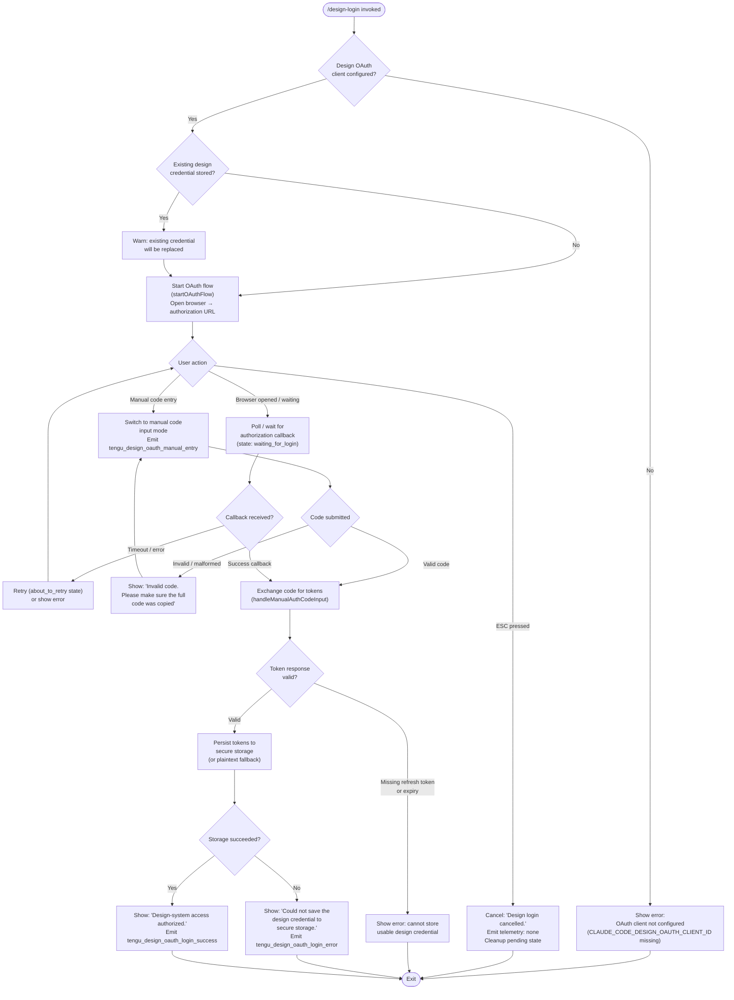

# `/design-login`

> Analysis basis: CC v2.1.197 bundle.js (AST extraction + Claude interpretation)
> Minimum version: v2.1.197

---

## Overview

`/design-login` initiates an OAuth authorization flow that grants Claude Code access to the user's claude.ai design-system projects, a credential scope that is entirely separate from the main session authentication. The command renders an interactive terminal UI component that drives the user through either a browser-based OAuth redirect or a manual authorization-code entry path. Upon successful completion, the resulting design OAuth tokens are persisted to secure (or plaintext-fallback) credential storage so that subsequent `/design-sync` operations can use them.

---

## Registration

| Field | Value |
|---|---|
| type | `local-jsx` |
| name | `design-login` |
| description | `Authorize design-system access for /design-sync with your claude.ai account` |
| loc_byte | `12009612` |
| loc_byte_end | `12009811` |
| loc_line | `8123` |
| module_id | `c4l` |
| load_inline | `true` |
| arbor_handler.name | `d4l` |
| arbor_handler.fqn | `claude-2.1.197::d4l` |
| arbor_handler.kind | `Function` |
| arbor_handler.resolution_path | `direct` |
| arbor_handler.n_hits | `1` |

Analysis basis: CC v2.1.197 bundle.js:+12009612

---

## Input Branching

The command presents more than three distinct runtime branches (OAuth client absent, credentials already present, browser flow, manual code entry, success, error, cancellation), so a Mermaid flowchart is used.



---

## Behavioral Spec

### Top-level JSX render component (`l4l`)

The registration's `local-jsx` type means the command renders a React/Ink JSX component rather than producing a text prompt. The component identified as `l4l` (Analysis basis: CC v2.1.197 bundle.js:+12003351) is the UI root.

```
function designLoginComponent(props):
    [loginState, setLoginState] = useState("starting")   // initial value "starting" (+12003370)
    [retryCount, setRetryCount] = useState(0)            // initial value 0 (+12003451)
    [manualCodeInput, setManualCodeInput] = useState("") 
    clockContext  = useClock()                           // via ks → sVi.useContext (+3986437)
    terminalSize  = useTerminalSize()                    // via Sr → xVi.useContext (+3996830)
    minWidth      = Math.max(50, terminalSize.columns)   // floor: 50 (+12003580)

    // Key handling — intercepts up to 4 key events per render cycle (+12003604)
    onKeyPress(key, input):
        if input == "success":                           // (+12003634)
            markComplete()
        if input == "escape":                            // (+12003742)
            markCancelled()                              // "Design login cancelled." (+12003831)
        if input == "return":                            // (+12003895)
            submitManualCode()

    // OAuth client guard
    if DESIGN_OAUTH_CLIENT_ID not configured:            // (+12004464)
        render error: "The Claude Design OAuth client is not configured…"
        return

    // Manual code validation
    function validateManualCode(code):
        if code is malformed (fails RQn / Us checks):   // (+12004673)
            show "Invalid code. Please make sure the full code was copied" (+12004095)
            return false
        return true

    // Start OAuth flow
    function beginOAuth():
        if tengu_design_oauth_manual_entry path chosen:  // (+12004254)
            emit tengu_design_oauth_manual_entry
        r.startOAuthFlow(...)                            // (+12004687)
        // Opens browser; sets state → "waiting_for_login" (+12004168)
        p.setTimeout(cleanup, 3000)                      // 3 s cleanup guard (+12004789, +12003000)

    // State transitions driven by loginState
    switch loginState:
        "starting"          → render intro / begin button
        "waiting_for_login" → render waiting UI; URL copy option
        "about_to_retry"    → render retry countdown (+12003935)
        "processing"        → render spinner (+12004994)

    // Cleanup
    on unmount:
        r.cleanup()                                      // (+12006093)
        pendingTimers.forEach(clear)                     // (+12006105)
        pendingTimers.clear()                            // (+12006125)
```

Analysis basis: CC v2.1.197 bundle.js:+12003351

---

### OAuth flow orchestrator (`dDo`)

```
function oauthFlowOrchestrator(options):
    // Filter valid redirect entries
    validEntries = rle.filter(isValidRedirect)          // (+10424019)
    // POST token exchange via IN (axios wrapper)
    result = await IN(tokenEndpoint)                    // (+10424097)

    // Validate response — must contain refresh_token and expiry
    if result missing refresh_token or expiry:           // (+10424402)
        throw "The token response was missing a refresh token…"

    joinedScopes = n.join(...)                          // (+10424209)
    hasRequiredScopes = rle.some(scopeCheck)            // (+10424633)
    return result
```

Analysis basis: CC v2.1.197 bundle.js:+10424019

---

### Credential persistence (`xQn` → `Ml` → `lci`)

```
function saveDesignCredential(tokens):
    storageKey = Ml(keyDerivation)                      // (+10420695)
    try:
        lci.write(storageKey, tokens)                   // secure storage write (+2371841)
        // lci attempts primary secure storage first;
        // on transient failure, skips plaintext fallback
        //   → "primary_transient_skip_fallback" (+2372489)
        // on hard failure, uses plaintext fallback
        //   → "plaintext_fallback_used" (+2372638)
        // if both fail:
        //   → "primary_and_fallback_failed" (+2372741)
        emit tengu_design_oauth_login_success            // (+12005395)
    catch error:
        log "Failed to save design OAuth tokens"        // (+10420924)
        show "Could not save the design credential to secure storage." // (+12005299)
        emit tengu_design_oauth_login_error              // (+12005548)
        // Brief display delay: 1500 ms before exit     // (+12005524)
```

Analysis basis: CC v2.1.197 bundle.js:+10420695

---

### Manual code input path (`handleManualAuthCodeInput` via `l4l`)

```
function handleManualAuthCodeInput(rawCode):
    // Emit telemetry for manual entry choice
    emit tengu_design_oauth_manual_entry                 // (+12004254)

    // Validate format using RQn + Us checkers
    if not validateCode(rawCode):
        setError("Invalid code. Please make sure the full code was copied")  // (+12004095)
        return

    // Check for placeholder / zero-value client IDs
    if clientId.startsWith("00000000-"):                // (+10423976)
        setError("The Claude Design OAuth client is not configured…") // (+12004464)
        return

    setLoginState("processing")                         // (+12004994)
    await exchangeCodeForTokens(rawCode)
```

Analysis basis: CC v2.1.197 bundle.js:+12004254

---

### Token exchange HTTP layer (`IN` — axios wrapper)

```
function axiosTokenRequest(endpoint, payload):
    // POST with 5000 ms timeout (+2166317)
    response = await fo.post(endpoint, payload, { timeout: 5000 })
    if fo.isAxiosError(response):                       // (+2166364)
        // Surface structured error via xe / wt helpers
        handleAxiosError(response)
    // On success, revoke previous token if present
    // "oauth_token_revoke" flow triggered (+2166327)
    return response.data
```

Analysis basis: CC v2.1.197 bundle.js:+2166159

---

### UI rendering helpers (`k3f` handler wrapper)

```
function renderLoginPanel(props):
    // Uses wE.jsx / wE.jsxs for React element creation (+12009388)
    // Column layout (+12006224)
    // Title: "Design login" (+12006399)
    // Description: "Authorize design-system access (read and write…)" (+12006447)

    if existingCredential:
        show warning: "A design credential is already stored — completing this flow replaces it." (+12006686)

    // URL display when browser did not open
    show hint: "Browser didn't open? Use the url below to sign in" (+12006937)

    // Clipboard copy indicator
    if justCopied:
        show "(Copied!)"  (+12007033)
    else:
        show "copy"       (+12007106)
```

Analysis basis: CC v2.1.197 bundle.js:+12009388

---

## State & Side Effects

| Item | Detail |
|---|---|
| Telemetry: `tengu_design_oauth_manual_entry` | Fired when the user chooses manual code entry instead of browser flow (bundle.js:+12004254) |
| Telemetry: `tengu_design_oauth_login_success` | Fired on successful credential write to secure storage (bundle.js:+12005395) |
| Telemetry: `tengu_design_oauth_login_error` | Fired when credential write to storage fails (bundle.js:+12005548) |
| Telemetry: `tengu_feature_ok` / `tengu_feature_bad` / `tengu_feature_sad` | Feature-flag evaluation events emitted via `xe` / `Re` / `wt` helpers (bundle.js:+1028779, +1028846, +1028927) |
| Credential storage | Design OAuth tokens (access + refresh + expiry) written via `lci` to platform secure storage; plaintext fallback used if secure storage fails transiently (bundle.js:+2372638) |
| Timer side-effect | A 3 000 ms cleanup guard timer is set via `p.setTimeout` when the OAuth flow starts (bundle.js:+12004789); a 1 500 ms display delay is used after a storage error (bundle.js:+12005524) |
| Pending-timer cleanup | On component unmount, all registered timer handles are iterated and cleared via `I.forEach` + `I.clear` (bundle.js:+12006105, +12006125) |
| appState changes | `r.cleanup()` is called on teardown (bundle.js:+12006093); no persistent in-memory session state is modified beyond the stored credential |
| Clipboard | The authorization URL can be copied to the clipboard via platform-native clipboard helpers (`xw` → `gFt`/`h9i`/etc., bundle.js:+12005917); copy acknowledgement shown as `"(Copied!)"` (bundle.js:+12007033) |
| Sound | <!-- TODO: not found in depth-2 traversal; needs --depth 4 --> |
| Hook registration | `A1.useState`, `A1.useRef`, `A1.useCallback`, `A1.useEffect` all used in the login component `l4l` (bundle.js:+12003351–+12005656) |

---

## Version History

| Version | Change |
|---|---|
| v2.1.197 | Initial analysis |

---

## Common Mistakes

1. **Missing `CLAUDE_CODE_DESIGN_OAUTH_CLIENT_ID`**: The command checks at runtime whether the OAuth client ID is configured in the build. If not set (or set to a placeholder starting with `00000000-`), it immediately shows an error and exits without opening a browser. Users must use a build that includes the registered client or set the environment variable.

2. **Using `/design-login` to re-authenticate the main Claude Code session**: This command grants design-system access only (`claude.ai/design` projects). It does not refresh or replace the primary API key or session token used for AI inference.

3. **Ignoring the "existing credential will be replaced" warning**: Completing the flow when a design credential already exists will silently overwrite the old tokens. If the old tokens are still needed (e.g., for a different account), they should be noted before running the command.

4. **Pasting a partial or expired code in manual mode**: The validator rejects codes that fail format checks (via `RQn`/`Us`) and also rejects codes that have expired server-side. The user must copy the full, unexpired code from the device that generated it.

5. **Expecting immediate secure-storage failure recovery**: When secure storage is unavailable, the command falls back to plaintext storage transparently. If both paths fail, the OAuth flow cannot complete, and the user will see the "Could not save the design credential" message after a 1 500 ms display delay — there is no automatic retry.

---

## Appendix — Identifier Mapping

> For bundle debugging only. Identifiers change across versions.

| Identifier | Role |
|---|---|
| `k3f` | Handler entry point / render wrapper for the design-login JSX panel |
| `d4l` | Arbor-resolved top-level handler function for `/design-login` |
| `l4l` | Main login UI React component (state machine, key handling, OAuth orchestration) |
| `ks` | `useClock` context hook (ClockProvider consumer) |
| `Sr` | `useTerminalSize` context hook (Ink terminal-size consumer) |
| `I` | Generic event / input handler used inside `l4l` for key dispatch |
| `M` | Core OAuth HTTP server request handler (routes: device authorize, callback, token, etc.) |
| `Pge` | JSON serialization utility used in OAuth responses |
| `Gts` | Address/host resolution helper used in HTTP routing |
| `$ts` | IPv4-mapped-address parser |
| `Fts` | URL pattern matcher |
| `j8c` | URL path normalizer |
| `sXe` | String replacement / URL-encoding utility |
| `ens` | String prefix checker for authorization header parsing |
| `wts` | JWT verification orchestrator |
| `Ets` | JWT header decoder (`b64` / payload splitter) |
| `S8c` | JWK key-set lookup (`find` by kid) |
| `AVc` | Device-authorization initiation (generates state, nonce, PKCE) |
| `DBm` | Admin credential validation and spend-limit management |
| `hu` | HTTP request sender (underlying fetch wrapper) |
| `YHr` | Request metrics / counter increment helper |
| `zie` | Readyz-probe JSON responder |
| `w8c` | Random float generator (`nvt.random`) |
| `v8c` | Cryptographic random bytes generator (`KHr.randomBytes`) |
| `Pts` | SHA-256 hash helper (`KHr.createHash`) |
| `Mts` | Device grant token constructor |
| `Cts` | Token signing helper |
| `zHr` | Authorization URL builder |
| `W2m` | String uppercasing utility for header normalization |
| `xon` | User-code URL generator for device flow |
| `n_r` | Base64url random-bytes encoder (`W8c.randomBytes`) |
| `N` | HTTP request body parsing / multipart form handler |
| `rKc` | Filesystem real-path + stat checker |
| `Ed` | Body decoding/encoding utility |
| `T` | General string normalization / MIME type resolver |
| `ke` | Structured error logger (writes to error log, `Ete.logError`) |
| `W9m` | Socket/connection cleanup helper (`_Kn`) |
| `d` | Daemon-supervisor write and worker lifecycle manager |
| `A8c` | OAuth-state encryption (`Cts`) |
| `Bo` | Authorization URL assembly helper |
| `H` | OAuth client / OIDC issuer object (`.authorizationUrl`, `.callback`, `.refresh`, `.userinfo`) |
| `o` | Column-padding / table-formatting utility |
| `P` | Generic process or abort-signal handle |
| `iXe` | Callback URL builder (combines `n_r` + `sXe`) |
| `b8c` | Sealed OAuth-state decoder (`vts` → `Sts` + `S8c`) |
| `vts` | Sealed-state unwrap orchestrator |
| `x` | Cookie-string split / index helper |
| `R` | File-watcher and interval manager for config reload |
| `O` | Background worker sweep / memory-management scheduler |
| `Dts` | Device-callback state verifier (wraps `vts`) |
| `oe` | Multi-provider claims aggregator (`Promise.all` over provider map) |
| `A` | Per-provider claims fetcher (calls `.userinfo`) |
| `LVt` | Session record lookup (`J_`) |
| `uHm` | Conversation / session update merger |
| `fe` | Claims post-processing finisher |
| `ye` | Token storage writer (`s.set`, `Mts`, `s.del`, `zHr`) |
| `he` | String coercion wrapper (`String`) |
| `X` | Voice recording state machine (start/stop/buffer/stream) |
| `Re` | Feature-flag "ok" reporter |
| `V` | Generic value/state setter used across multiple features |
| `W` | Worker/process reference pair holder |
| `kmr` | Audio sample timestamp recorder (`S$e.push`, `Date.now`) |
| `K` | Keyboard backspace event guard |
| `ce` | Audio chunk queue (`down` key context) |
| `sLc` | RMS/volume level calculator (`Math.sqrt`, `Math.min`) |
| `Se` | Session/context triple holder (`c`, `I`, `de`) |
| `z` | Transcription event dispatcher (`Etn`) |
| `Rr` | Error-class resolver (`O8`) |
| `aQe` | Language-code normalizer (lowercase + BCP-47 lookup) |
| `xe` | Feature-flag "ok" event emitter (`V`, `Oe`) |
| `gcs` | Locale-aware date formatter (`Intl.DateTimeFormat`) |
| `pcr` | Voice-stream WebSocket client (Deepgram nova3 integration) |
| `$Im` | <!-- TODO: not found in depth-2 traversal; needs --depth 4 --> |
| `Ae` | MCP elicitation handler (sends/receives elicitation forms) |
| `u` | Agent/session context bundle (`xe`, `Re`, `$F`, `Wj`) |
| `q` | Permission-allow decision handler |
| `Y` | MCP update applier (`q.applyMcpUpdate`, `Sje`) |
| `j` | Idle-exit timer manager (`clearTimeout`, `setTimeout`, `d.write`) |
| `pe` | Voice session lifecycle manager (wraps `X` + all sub-handlers) |
| `wt` | Feature-flag "sad" reporter (`V`, `Oe`) |
| `ve` | Turn/message queue (`Vg`, `Rt`, `ue`) |
| `f` | Background task handle (`L8`) |
| `er` | Error constructor wrapper (`Error`, `String`) |
| `FYo` | File-attachment set builder (`bl`, `$Yo.basename`, `hy`, `eLc`, `UIm`) |
| `ne` | Session claims loader (`q.trim`, `f`, `a`, `B`, `U`) |
| `a` | Spend-block checker (`Pge`, `Response.json`) |
| `U` | Rate-limit event enqueuer (`AYl`, `HF`, `D.enqueue`, `SL.randomUUID`) |
| `s_r` | Header-entry scope checker (`e.entries`, `i.some`, `n.includes`) |
| `n` | Case-folding string helper (`i.toLowerCase`) |
| `DVc` | Desktop bootstrap config builder (`t3m`, `n3m`, `r3m`, `Math.floor`, `Date.now`) |
| `t3m` | Bootstrap policy resolver (`zts`) |
| `n3m` | Permission filter (deny-list intersection for `mcp__` prefixed tools) |
| `r3m` | Sandbox policy parser (`PVc`) |
| `NVc` | Parallel upstream request dispatcher (`Promise.allSettled`, `AbortSignal.timeout`) |
| `fvt` | Individual upstream HTTP fetch (validates cert identity, follows redirects) |
| `ins` | Response-string coercion (`String`) |
| `pVc` | Model-list response builder (`Response.json`, `zts`, `t.map`) |
| `zts` | Model-registry map manager (`o.set`, `TBm.filter`, `o.has`, `o.values`, `Vts`) |
| `aVc` | Bedrock-upstream guard (`hBm.includes`) |
| `cVc` | Messages-endpoint handler (JSON parse, auth, model routing, response streaming) |
| `Gt` | JSON parse wrapper |
| `J$e` | JSON error-response builder (`Response.json`) |
| `Vts` | Model-specification normalizer (trims, checks prefixes, maps to canonical IDs) |
| `E` | Streaming inference executor (`$Ct`, `LD`, `xD`, `Promise.all`, `KX`, `F9`) |
| `Kts` | Model-capability lookup (`V8`, `HBm`) |
| `p` | Forced-shutdown abort controller (`rI`, `process.exit`, `u.abort`) |
| `Me` | JSON stringify wrapper |
| `sVc` | Auth-apply middleware (attaches Bearer / API-key headers, `r.applyAuth`) |
| `_` | Auth invalidation helper (`a`) |
| `ABm` | Count-tokens endpoint handler (`SBm`, `Object.keys`, `J$e`, `EBm`, `Response.json`) |
| `iVc` | Per-request inference metering and auth (`Kts`, `fvt`, `Me`, `xg`, `AbortSignal.timeout`) |
| `xg` | Proxy-Authorization header builder (`ct`, `_l`, `JM`, `W8`, `ztt`, `c6s`, `GUr`, `VUr`) |
| `h7t` | Design OAuth client-ID resolver (delegates to `RQn`) |
| `RQn` | Design OAuth client configuration loader |
| `Us` | OAuth environment/endpoint URL resolver (`CHs`, `wSu`, `t.replace`, `Gpn.includes`) |
| `CHs` | Hardcoded production OAuth base-URL constant |
| `wSu` | Staging / local OAuth base-URL selector |
| `c` | Daemon session context holder (`yn`) |
| `yn` | Background session descriptor |
| `IN` | Axios-based token exchange / revoke HTTP client |
| `dDo` | OAuth callback + token-exchange orchestrator (validates scopes, stores tokens) |
| `xQn` | Credential write orchestrator (calls `Ml`, validates `onlyIf`, renders result) |
| `Ml` | Secure-storage key derivation + read/write dispatcher (`lci`) |
| `lci` | Low-level credential read/write with primary + plaintext-fallback logic |
| `t9e` | Async credential read helper (`y_d`, `e.readAsync`) |
| `Pd` | Design-sync context provider consumer (`Fye.useContext`, `useMemo`, `useSyncExternalStore`) |
| `m` | Active-server URL filter (`e_r`, `Array.isArray`, `R.filter`) |
| `e_r` | URL prefix stripper / normalizer |
| `xw` | Clipboard write orchestrator (selects platform strategy) |
| `gFt` | Screen/OSC52 clipboard backend selector |
| `mH` | Raw terminal escape-sequence writer |
| `h9i` | macOS `pbcopy` clipboard backend |
| `Pn` | Generic child-process executor with timeout (`Gr`, `Ot`) |
| `Gr` | Child-process runner (`LBe`, `mFu`, `Ed`, `T`, `rn`, `fFu`, `ke`, `Uo`, `er`) |
| `Ot` | Process output collector (`nmn`, `dr`) |
| `ZJr` | Linux `wl-copy`/`xclip`/`xsel` clipboard backend |
| `Wf` | X11 clipboard tool selector (`xHs`) |
| `d4d` | tmux clipboard backend (`Pn`, `T`) |
| `QJr` | OSC52 / DCS escape-sequence clipboard backend (`mH`) |
| `hFt` | Screen DCS clipboard backend (`gFt`, `jt`) |
| `mx` | Raw+DCS clipboard backend (replaces escape sequences, `QJr`) |
| `F_` | Kitty clipboard backend (`g9i`, `e.join`) |
| `g9i` | Kitty OSC writer (`mH`) |
| `v` | Pending-timer map iterator variable |
| `wEt` | Credential-write result display component (`Ml`, `T`, `he`) |

---

Note: index built via Arbor fallback; some signals (telemetry, literals) may be missing — see arbor-fallback.js.