# `/exit`

> Analysis basis: CC v2.1.197 bundle.js (AST extraction + Claude interpretation)
> Minimum version: v2.1.197

---

## Overview

`/exit` (also aliased as `/quit`) terminates the Claude Code CLI session immediately. When invoked, it performs an orderly shutdown sequence: it persists session state, drains pending I/O, unmounts the terminal UI, runs cleanup hooks, and finally calls `process.exit`. The command is classified as `local-jsx` and is marked `immediate`, meaning it bypasses the normal agent turn cycle and executes directly on submission.

---

## Registration

| Field | Value |
|---|---|
| type | `local-jsx` |
| name | `exit` |
| description | `null` |
| aliases | `["quit"]` |
| immediate | `true` |
| module_id | `rnc` |
| load_inline | `true` |
| loc_byte | `13065406` |
| loc_byte_end | `13065602` |
| loc_line | `9031` |
| arbor_handler.name | `AXf` |
| arbor_handler.fqn | `claude-2.1.197::AXf` |
| arbor_handler.kind | `AsyncFunction` |
| arbor_handler.resolution_path | `module_id` |
| arbor_handler.n_hits | `1` |

Analysis basis: CC v2.1.197 bundle.js:+13065406

---

## Input Branching

The `/exit` command does not branch on user input text — it acts unconditionally. However, the shutdown sequence itself has 4+ distinct internal branches depending on process state (pending tasks, active subprocesses, daemon workers, forced-kill timeout). A Mermaid flowchart is used.

```mermaid
flowchart TD
    A(["/exit or /quit invoked"]) --> B[Display 'Goodbye!' message\nbundle.js:+13064629]
    B --> C[Resolve session context\nvia sessionContextGetter · Hi\nbundle.js:+13064665]
    C --> D[Normalize exit path string\nvia stringNormalizer · e\nbundle.js:+13064677]
    D --> E[Send detach-request event\nvia detachWriter · dTe\nbundle.js:+13064681]
    E --> F[Collect pending tasks\nvia taskCollector · T5n\nbundle.js:+13064712]
    F --> G[Render JSX farewell UI\nonc.jsx · AXf\nbundle.js:+13064742]
    G --> H[Compute scroll summary\nSXf · $R\nbundle.js:+13064825]
    H --> I[Begin orderly shutdown\nshutdownOrchestrator · ki\nbundle.js:+13064838]

    I --> J{Pending I/O\nor subprocesses?}
    J -- "Yes" --> K[Drain output buffers\nAQe · yis.drain\nbundle.js:+7438998]
    J -- "No" --> L[Skip drain]
    K --> M[Race: drain vs 5 000 ms timeout\nbundle.js:+7438902 / +7438909]
    L --> M

    M --> N[Unmount terminal UI\ne8e · e.unmount\nbundle.js:+7435874]
    N --> O[Flush terminal state\ndDn · lre.writeSync\nbundle.js:+3934196]
    O --> P{Daemon / bg\nworkers active?\nbundle.js:+2344163}
    P -- "daemon or daemon-worker" --> Q[Save session to disk\nixt · Tcs → Lcs\nbundle.js:+7439246]
    P -- "other / bg" --> R[Emit scroll-summary telemetry\ntengu_scroll_summary\nbundle.js:+7438318]
    Q --> S[Emit session_end event\nbundle.js:+7439322]
    R --> S

    S --> T[Emit cache-eviction hint\ntengu_cache_eviction_hint\nbundle.js:+7439284]
    T --> U[Run settled-promise cleanup\nqFa · S2a\nbundle.js:+7439147]
    U --> V{process.exit\ncalled cleanly?}
    V -- "Yes" --> W([process.exit 0])
    V -- "No — stalled > 3 500 ms" --> X[Send SIGKILL\n$_o · process.kill SIGKILL\nbundle.js:+7436486 / +7436511]
    X --> W
```



---

## Behavioral Spec

### 1 — Entry point: handler `AXf`

The Arbor-resolved handler `AXf` is an `AsyncFunction` reached via the `module_id` resolution path (`rnc` → exports → `AXf`).

```
async function exitCommandHandler(appState, inputText):

    // 1. Display farewell
    display("Goodbye!")                          // bundle.js:+13064629

    // 2. Resolve session context
    ctx = resolveSessionContext(appState)         // Hi  bundle.js:+13064665

    // 3. Normalise any trailing path text
    normPath = normaliseString(inputText)         // e   bundle.js:+13064677

    // 4. Write detach-request to IPC channel
    sendDetachRequest(ctx)                        // dTe bundle.js:+13064681

    // 5. Gather scheduled / in-flight tasks
    tasks = collectPendingTasks(appState)         // T5n bundle.js:+13064712

    // 6. Render farewell JSX component
    render(<FarewellPanel tasks=tasks />)         // onc.jsx bundle.js:+13064742

    // 7. Snapshot scroll position
    scrollSummary = computeScrollSummary()        // SXf→$R bundle.js:+13064825

    // 8. Enter orderly shutdown
    await shutdownOrchestrator(appState,
                               scrollSummary,
                               tasks)            // ki  bundle.js:+13064838
```

Analysis basis: CC v2.1.197 bundle.js:+13064665

---

### 2 — Detach-request writer (`dTe`)

Before the UI tears down, `dTe` notifies any background or daemon process via an IPC write.

```
function sendDetachRequest(ctx):
    type = determineDaemonRole(ctx)    // pTn  bundle.js:+11568837
                                       // gBa→S5n,yn  bundle.js:+11568856
    if type in {"bg", "daemon", "daemon-worker"}:
        channel = openChannel()        // YW→gZ.write  bundle.js:+11568865
        channel.write({
            type: "detach-request"     // literal  bundle.js:+11568874
        })
    closeChannel()                     // ime  bundle.js:+11568950
```

Analysis basis: CC v2.1.197 bundle.js:+11568837

---

### 3 — Pending task collector (`T5n`)

`T5n` builds an array of any scheduled tasks still running so they can be displayed in the farewell UI panel.

```
function collectPendingTasks(appState):
    results = []
    for entry in appState.taskRegistry:          // kC→H0  bundle.js:+7473440
        formatted = formatTaskEntry(entry)       // M$p  bundle.js:+7473508
        // formatTaskEntry: xO parses cron-like
        // schedule strings including "Every minute"
        // and "Every hour" labels            bundle.js:+5103404,+5103621
        results.push(formatted)                  // t.push  bundle.js:+7473467
    results = truncateToWidth(results)           // Va  bundle.js:+7473523
    return results                               // "scheduled task" label  bundle.js:+7473481
```

Analysis basis: CC v2.1.197 bundle.js:+7473440

---

### 4 — Shutdown orchestrator (`ki`)

This is the most complex sub-function. It coordinates UI unmounting, I/O draining, process termination, and the forced-kill safety net.

```
async function shutdownOrchestrator(appState, scrollSummary, tasks):

    // 4a. Emit scroll-summary telemetry before UI goes away
    emit("tengu_scroll_summary", scrollSummary)  // bundle.js:+7438318

    // 4b. Drain stdout/stderr with a 5 000 ms overall budget
    drainPromise = drainOutputBuffers()           // AQe→yis.drain  bundle.js:+7438998
    timeout5s    = AbortSignal.timeout(5000)      // bundle.js:+7438902
    timeout3500  = setTimeout(forcedKill, 3500)   // bundle.js:+7438909
    await Promise.race([drainPromise, timeout5s]) // bundle.js:+7439022

    // 4c. Unmount terminal UI
    unmountUI()                                   // e8e→e.unmount  bundle.js:+7435874

    // 4d. Flush terminal escape sequences
    flushTerminal()                               // dDn→lre.writeSync  bundle.js:+3934196
    // Terminal compatibility: saves/restores cursor
    // ESC-7 / ESC-8 sequences  bundle.js:+3934358,+3934369
    // Ghostty ≥ 1.2.0 and iTerm ≥ 3.6.6 paths  bundle.js:+3655651,+3655720

    // 4e. Write final output lines, dim-styled
    writeGoodbyeLine()                            // U_o→rAe.writeSync  bundle.js:+7436253
    // Escapes backslash and quote chars in path   bundle.js:+7436172,+7436195

    // 4f. Persist session checkpoint
    persistSession(tasks)                         // ixt→bTr→Lcs/Tcs  bundle.js:+7439246

    // 4g. Emit session end + eviction hint
    emit("session_end")                           // bundle.js:+7439322
    emit("tengu_cache_eviction_hint")             // bundle.js:+7439284

    // 4h. Settle remaining async work
    await Promise.allSettled(qFa())               // bundle.js:+7439147
    await Promise.allSettled(S2a())               // bundle.js:+7439193

    // 4i. Clean exit
    clearTimeout(timeout3500)                     // bundle.js:+7439099
    process.exit(0)
```

Analysis basis: CC v2.1.197 bundle.js:+7438835

---

### 5 — Forced-kill safety net (`$_o`)

If the process does not exit within the timeout window, a safety net fires.

```
function forcedKill():
    clearTimeout(safetyTimer)                    // bundle.js:+7436380
    child = lu.get("childProcess")               // bundle.js:+7436413
    if child:
        process.exit(0)                          // bundle.js:+7436461
    else:
        process.kill(process.pid, "SIGKILL")     // bundle.js:+7436486,+7436511
        // Throwing "unreachable" guards dead code
        throw new Error("unreachable")           // bundle.js:+7436528,+7436534
```

Forced shutdown is labelled `"forced shutdown"` in the literal pool. Analysis basis: CC v2.1.197 bundle.js:+18072838

---

### 6 — Session persistence (`ixt` chain)

`ixt` → `bTr` → `Lcs` / `Tcs` records performance checkpoints and serialises session state to disk.

```
function persistSession(tasks):
    dir = resolveConfigDir()                     // Tcs→rxt.dirname  bundle.js:+226892
    ensureDir(dir)                               // qt  bundle.js:+226907
    checkpoints = buildCheckpointList()          // Ecs  bundle.js:+226931
    json = JSON.stringify(checkpoints)           // bundle.js:+227011
    writeSync(dir + "/session.json", json,
              {encoding:"utf8"})                 // nve→She.writeFileSync  bundle.js:+194216
    fsync(fd)                                    // nve→She.fsyncSync  bundle.js:+194260
    // Emit startup-perf telemetry after write
    emit("tengu_startup_perf", checkpoints)      // bundle.js:+228478
    // Aggregate scroll + perf metrics
    metrics = aggregateMetrics(checkpoints,
                               "main_after_run") // bundle.js:+227527
    emit("tengu_startup_perf", metrics)
```

Analysis basis: CC v2.1.197 bundle.js:+226792

---

### 7 — UI farewell component (`SXf` / `$R`)

`SXf` renders a small JSX component that shows the "Goodbye!" string and the scroll position snapshot. `$R` is the underlying render helper.

```
function renderFarewellComponent(scrollSummary):
    panel = $R({
        message:  "Goodbye!",               // bundle.js:+13064629
        scroll:   scrollSummary,
        exitKind: "prompt_input_exit"        // bundle.js:+13064843
    })
    return panel
```

Analysis basis: CC v2.1.197 bundle.js:+13064620

---

## State & Side Effects

| Item | Detail |
|---|---|
| Telemetry: `tengu_scroll_summary` | Fired during shutdown with scroll position data (bundle.js:+7438318) |
| Telemetry: `tengu_cache_eviction_hint` | Fired after `session_end` to signal caches may be freed (bundle.js:+7439284) |
| Telemetry: `tengu_startup_perf` | Fired during session persistence with checkpoint timings (bundle.js:+228478) |
| Telemetry: `tengu_amber_creek` | Fired from fullscreen-mode detection path reached during UI teardown (bundle.js:+3587999) |
| Telemetry: `tengu_pewter_brook` | Fired from alternate fullscreen-mode branch (bundle.js:+3587906) |
| Telemetry: `tengu_daemon_config_reload` | Fired if the supervisor daemon reloads config during shutdown (bundle.js:+18054237) |
| IPC write | `"detach-request"` message sent to background/daemon worker before UI unmount (bundle.js:+11568874) |
| Terminal escape sequences | ESC-7 (save cursor) and ESC-8 (restore cursor) written via `dDn` (bundle.js:+3934358, +3934369) |
| `process.exit` | Called with code `0` on clean shutdown (bundle.js:+7436461) |
| `process.kill(pid, "SIGKILL")` | Sent only on stalled exit after ~3 500 ms (bundle.js:+7436486) |
| Session file | JSON checkpoint written to config directory via sync I/O (bundle.js:+194216) |
| `session_end` event | Emitted on the event bus before process termination (bundle.js:+7439322) |
| `exitKind` tag | `"prompt_input_exit"` recorded to distinguish user-initiated from programmatic exits (bundle.js:+13064843) |
| Timeout: drain budget | 5 000 ms total I/O drain window (bundle.js:+7438902) |
| Timeout: forced-kill | 3 500 ms before SIGKILL fires (bundle.js:+7438909) |
| Timeout: post-settle | 2 000 ms additional settle window after drain (bundle.js:+7439087) |

---

## Version History

| Version | Change |
|---|---|
| v2.1.197 | Initial analysis |

---

## Common Mistakes

1. **Treating `/exit` and `/quit` as different commands.** They are registered as one command with `aliases: ["quit"]`; both follow the identical code path through `AXf`.
2. **Assuming instant termination.** The command is `immediate` (skips the agent turn) but the shutdown itself is asynchronous and can take up to ~5 000 ms draining I/O before `process.exit` fires.
3. **Ignoring the forced-kill path.** If the process stalls (e.g. a subprocess holds the event loop), a SIGKILL is sent after ~3 500 ms. Shell wrappers or test harnesses must account for this.
4. **Expecting a description string.** The `description` field is `null`; no help text is shown in the command palette for this entry.
5. **Assuming no disk I/O.** The exit sequence writes a session checkpoint JSON file synchronously. Running `/exit` in a read-only filesystem will cause the persistence step to fail (though the process still terminates).
6. **Confusing `bg` / `daemon` roles.** The `"detach-request"` IPC message is only sent when the session type is `bg`, `daemon`, or `daemon-worker`; a plain interactive session skips that write.

---

## Appendix — Identifier Mapping

> For bundle debugging only. Identifiers change across versions.

| Identifier | Role |
|---|---|
| `AXf` | Main exit command handler (AsyncFunction; Arbor-resolved entry point) |
| `Hi` | Session context resolver |
| `BLe` | Session context helper (called by `Hi`) |
| `e` | String normaliser (wraps `t.replace`) |
| `dTe` | Detach-request IPC writer |
| `pTn` | Daemon role classifier (called by `dTe`) |
| `gBa` | Background-session helper (calls `S5n`, `yn`) |
| `S5n` | Background-session sub-helper |
| `yn` | Background-session sub-helper |
| `YW` | IPC channel writer (calls `gZ.write`) |
| `Me` | JSON serialisation wrapper |
| `ime` | IPC channel closer |
| `$m` | App-state accessor used during exit |
| `T5n` | Pending task collector |
| `kC` | Task registry accessor (calls `H0`) |
| `H0` | Low-level store getter |
| `M$p` | Task formatter (calls `xO`, `fU`, `Tut`) |
| `xO` | Cron-expression parser / task renderer |
| `fU` | Human-readable schedule formatter |
| `jcp` | Cron field parser |
| `Tut` | Relative-time calculator |
| `Ji` | Duration formatter (floor/round helpers) |
| `Va` | Text truncator with wide-character support |
| `on` | String-width measurer (`Bun.stringWidth`) |
| `Ms` | Multi-line text truncation helper |
| `qE` | Truncation sub-helper |
| `SXf` | Farewell JSX component factory |
| `$R` | Low-level JSX render helper |
| `ki` | Shutdown orchestrator (main async coordinator) |
| `e8e` | UI unmount function |
| `JN` | Post-unmount hook |
| `dDn` | Terminal flush / escape-sequence writer |
| `J5e` | Terminal compatibility probe (Ghostty/iTerm detection) |
| `j5e` | Terminal cleanup sub-helper |
| `mx` | tmux/screen escape translator |
| `Ed` | Error handler within terminal flush |
| `T` | Log-level dispatcher (debug/error routing) |
| `U_o` | Goodbye-line writer (`rAe.writeSync`, dim styling) |
| `UL` | Output stream reference |
| `y5` | Cursor-save helper |
| `Rt` | Process-environment accessor |
| `ZGt` | Config-directory resolver |
| `t3` | Path join helper |
| `dr` | Directory existence checker |
| `qt` | Directory ensure/create helper |
| `Vg` | Config file path builder |
| `Kc` | Config file reader |
| `bli` | Escape-character rewriter |
| `$_o` | Forced-kill safety net (SIGKILL on stall) |
| `AQe` | Output buffer drainer (`yis.drain`) |
| `d` | Supervisor / daemon state manager |
| `TYe` | File stat checker |
| `rn` | File-not-found (ENOENT) handler |
| `Ks` | Async-local-storage store reader |
| `eWo` | Config writer helper |
| `he` | String coercion utility |
| `Cic` | Config key/value aggregator |
| `E` | SDK / MCP connection manager (stop method) |
| `$Ct` | SDK connection stopper sub-helper |
| `ke` | Connection teardown worker |
| `er` | Error string formatter |
| `A` | Subprocess manager (stop/start/updateConfig) |
| `t_r` | Process array helper |
| `e_r` | Process path sanitiser |
| `H` | Process kill dispatcher |
| `eKc` | Heartbeat emitter |
| `Vce` | Heartbeat helper |
| `I` | HTTP request handler / rate-limiter |
| `M` | OAuth / gateway HTTP router |
| `V` | General value container / ref |
| `qFa` | First batch of settled-promise cleanup |
| `S2a` | Second batch of settled-promise cleanup |
| `ixt` | Session persistence entry point |
| `bTr` | Startup-perf checkpoint serialiser |
| `Lcs` | Checkpoint aggregator and metric emitter |
| `Tcs` | Session JSON writer |
| `vcs` | Config path resolver |
| `nve` | Atomic file write (openSync/writeFileSync/fsyncSync/closeSync) |
| `Ecs` | Checkpoint list builder |
| `C5` | `require("perf_hooks")` wrapper |
| `wcs` | Alternate config path resolver |
| `l5n` | Scroll-summary + telemetry dispatcher |
| `c2a` | Scroll-summary collector |
| `l2a` | Scroll metric aggregator |
| `i2a` | Scroll metric sub-helper |
| `$s` | Fullscreen-mode detector (tmux/Windows SSH guard) |
| `DP` | Feature-flag checker |
| `aD` | Fullscreen-enabled predicate |
| `oXr` | Terminal-type checker |
| `qne` | Fullscreen fallback handler |
| `rXr` | Windows-over-SSH detector |
| `Rr` | App-settings reader |
| `S4d` | Fullscreen mode activator |
| `it` | Ink render context accessor |
| `fwt` | Final write helper called after shutdown |
| `qe` | Non-conforming terminal event emitter |
| `$Xe` | Low-level event emitter |
| `br` | Non-conforming terminal handler |
| `Ig` | Non-conforming terminal sub-handler |
| `n8e` | Post-exit cleanup resolver |
| `o5n` | Cleanup promise factory |