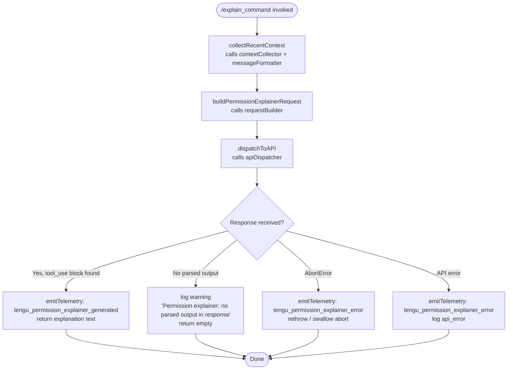

# `/explain_command`

> Analysis basis: CC v2.1.197 bundle.js (AST extraction + Claude interpretation)
> Minimum version: v2.1.197

---

## Overview

`/explain_command` is an internal tool-type slash command that invokes a "permission explainer" sub-agent to generate a human-readable explanation of why a particular tool or MCP command requires the permissions it does. It collects recent conversation context, sends a structured query to the model, and emits a telemetry event on success or failure.

---

## Registration

| Field | Value |
|---|---|
| type | `tool` |
| name | `explain_command` |
| description | `null` (not set in registration object) |
| loc_byte | `15023871` |
| loc_byte_end | `15023907` |
| loc_line | `11523` |
| arbor_handler.name | `$vc` |
| arbor_handler.fqn | `claude-2.1.197::$vc` |
| arbor_handler.kind | `AsyncFunction` |
| arbor_handler.resolution_path | `direct` |
| arbor_handler.n_hits | `1` |

Analysis basis: CC v2.1.197 bundle.js:+15023871

---

## Input Branching

The handler has four or more distinct execution paths (success, abort, API error, no-output guard), so a Mermaid flowchart is used.



Analysis basis: CC v2.1.197 bundle.js:+15023566, +15024354, +15024456, +15024566, +15024701, +15025024, +15025095

---

## Behavioral Spec

### Main Handler (`permissionExplainerHandler`)

The Arbor-resolved handler is `$vc` (AsyncFunction, direct resolution).

```
async function permissionExplainerHandler(toolInput, context):
    # 1. Collect and format conversation context
    startTime = Date.now()                            # loc +15023590
    rawMessages = contextCollector(context)           # calls CYo -> Dt
    formattedContext = messageFormatter(rawMessages)  # calls RTm: JSON-serializes, caps at 2 items
                                                      # loc +15023611

    # 2. Build a trimmed message window
    #    - filter to assistant turns only           (literal "assistant" loc +15023170)
    #    - keep at most 1000 chars per entry        (literal 1000, loc +15023135)
    #    - reverse to get most-recent-first         (MTm, loc +15023629)
    #    - truncate to 3 entries                    (literal 3, loc +15023190)
    #    - truncate long entries with "..."         (literal "...", loc +15023366)
    #    - rejoin with text separator               (literal "text", loc +15023273)
    trimmedWindow = buildMessageWindow(formattedContext)

    # 3. Resolve tool metadata for the target command
    toolMeta = resolveToolMetadata(toolInput)         # calls Ts -> $o (model-resolution path)
                                                      # loc +15023776

    # 4. Dispatch to API via permission_explainer sub-role
    #    Uses the "permission_explainer" literal as the tool-name marker  (loc +15023929)
    #    Expects a "tool_use" content block in the response               (loc +15024084)
    response = await apiDispatch(trimmedWindow, toolMeta, context)        # calls GU
                                                                          # loc +15023789

    # 5. Handle response
    if response contains tool_use block:
        emit("tengu_permission_explainer_generated")                      # loc +15024354
        V(result)                                                         # loc +15024352
        return parsedExplanation
    else if no parsed output:
        log("Permission explainer: no parsed output in response")         # loc +15024701
        return empty

    # 6. Error paths
    on AbortError:                                                        # loc +15025024
        emit("tengu_permission_explainer_error")                          # loc +15024566
        handle gracefully
    on api_error:                                                         # loc +15025095
        emit("tengu_permission_explainer_error")
        log and return
```

Analysis basis: CC v2.1.197 bundle.js:+15023566 through +15025095

---

### Context Collection (`contextCollector` / `CYo` → `Dt`)

```
function contextCollector(context):
    # Reads current project config                    # Dt -> lIt -> r.readFileSync, loc +14163555
    # Parses JSON config                              # Gt -> JSON.parse, loc +194426
    # Normalizes path prefixes                        # q5 -> e.startsWith/slice, loc +1196777
    # Backs up config if needed                       # lIt -> r.copyFileSync, loc +14164496
    # Timestamps the backup with Date.now()           # loc +14164482
    # Guards against re-entrant config access         # literal "Config accessed before allowed."
                                                      # loc +14163499
    return configSnapshot
```

Analysis basis: CC v2.1.197 bundle.js:+15023442, +14163499, +14163555

---

### Message Formatter (`requestBuilder` / `RTm`)

```
function requestBuilder(messages):
    # Serializes message objects to JSON              # Me -> JSON.stringify, loc +193649
    # Converts to string                              # String(), loc +15023107
    # Limits to 2 most-recent entries                 # literal 2, loc +15023091
    return formattedString
```

Analysis basis: CC v2.1.197 bundle.js:+15023081, +15023091, +15023107

---

### Message Window Builder (`messageWindowBuilder` / `MTm`)

```
function messageWindowBuilder(entries):
    # Filter: keep entries with role == "assistant"   # literal "assistant", loc +15023170
    # Cap each entry body at 1000 chars               # literal 1000, loc +15023135
    # Reverse array for recency order                 # n.reverse, loc +15023215
    # Take first 3                                    # literal 3, loc +15023190
    # Truncate oversized entries with suffix "..."    # jL, literal "...", loc +15023366
    # Prepend separator                               # r.unshift, loc +15023374
    # Join with "text" separator                      # literal "text", r.join, loc +15023407
    return windowString
```

Analysis basis: CC v2.1.197 bundle.js:+15023147, +15023215, +15023358, +15023374, +15023407

---

### Tool Metadata Resolution (`resolveToolMetadata` / `Ts`)

```
function resolveToolMetadata(toolInput):
    # Resolves the canonical model/tool name          # Ts -> d6 -> Fa
    # Applies policy-mapped tier defaults             # $o, VPt, ZPt
    # Handles MCP vs. first-party tool distinction    # Ui checks "mcp__" prefix, loc +3352318
    #   - MCP tools flagged as "mcp_tool"             # literal "mcp_tool", loc +3352337
    #   - first-party tools matched by "permission_explainer" loc +15023929
    # Checks model tier: fable, sonnet, haiku, opus, best, etc.
    return toolDescriptor
```

Analysis basis: CC v2.1.197 bundle.js:+15023776, +3352318, +3352337, +15023929

---

### API Dispatch (`apiDispatch` / `GU`)

```
async function apiDispatch(windowStr, toolMeta, context):
    # Constructs HTTP request headers including:
    #   x-app, User-Agent, X-Claude-Code-Session-Id, x-client-app
    # Sets structured_outputs flag                    # literal "structured_outputs", loc +8709420
    # Adds side_query marker                          # literal "side_query", loc +8709292
    # Sends request via hV (httpVendorDispatcher)
    # Handles streaming with byte-watchdog            # YDd, timeouts 15000ms/120000ms
    #                                                  # loc +3063783, +3063801
    # On response: extracts tool_use block
    # Emits tengu_permission_explainer_generated on success
    # Emits tengu_permission_explainer_error on failure
    return responseBlock
```

Analysis basis: CC v2.1.197 bundle.js:+8709247, +8709292, +8709420, +3063783

---

### Truncation Helper (`stringTruncator` / `jL`)

```
function stringTruncator(str, maxLength):
    # Checks surrogate boundaries                     # charCodeAt, loc +204067
    #   lower bound: 55296, upper bound: 56319        # loc +204095, +204105
    # Slices safely without splitting surrogate pairs
    # Appends "..." suffix if truncated               # loc +15023366
    return safelyTruncatedString
```

Analysis basis: CC v2.1.197 bundle.js:+204052, +204067, +204095, +204105, +15023366

---

## State & Side Effects

| Item | Detail |
|---|---|
| Telemetry — success | `tengu_permission_explainer_generated` (loc +15024354) |
| Telemetry — error | `tengu_permission_explainer_error` (loc +15024566) |
| Telemetry — API stream watchdog | `tengu_stream_watchdog_default_on` (loc +3065542), `tengu_byte_watchdog_fired_late` (loc +3064834), `tengu_byte_stream_idle_timeout_ms` (loc +3063572) |
| Telemetry — API success | `tengu_api_success` (loc +8710965) |
| Telemetry — surrogate sanitization | `tengu_lone_surrogate_sanitized` (loc +8710661) |
| Telemetry — config | `tengu_config_parse_error` (loc +14164913), `tengu_config_auth_loss_prevented` (loc +14158074) |
| Config file access | Reads project config via `r.readFileSync`; backs up with `r.copyFileSync`; guards re-entrant access (loc +14163499) |
| Hook registration | `vi` → `yis.register` (loc +68542) called during config watch setup |
| File watcher | `bRt` → `Evs.watchFile` (loc +1151130); unwatched via `vmc.unwatchFile` (loc +14159582) |
| appState changes | `V` called at loc +15024352 (result emission); `wt` → `V`/`Oe` at loc +15024648 (state update on completion) |
| Sound | <!-- TODO: not found in depth-2 traversal; needs --depth 4 --> |
| Byte-stream timeouts | Initial timeout: 15 000 ms (loc +3063783); maximum: 120 000 ms (loc +3063801) |
| Request header set | `x-app`, `User-Agent`, `X-Claude-Code-Session-Id`, `x-client-app`, `x-claude-code-agent-id`, `structured_outputs` flag |

---

## Version History

| Version | Change |
|---|---|
| v2.1.197 | Initial analysis |

---

## Common Mistakes

1. **Expecting a description field**: The registration `description` is `null`. Any UI that renders this command's description will receive nothing and must handle `null` gracefully.
2. **Assuming synchronous execution**: The handler (`$vc`) is an `AsyncFunction`. Callers must `await` it or chain `.then()`; forgetting this silently discards the explanation result.
3. **Misidentifying the tool role**: The literal `"permission_explainer"` (loc +15023929) is the internal sub-role label sent to the model, not a user-facing name. Logging or UI code that surfaces the tool name should use `"explain_command"` instead.
4. **Sending too much context**: The handler deliberately caps message context to 3 entries of at most 1 000 characters each. Injecting extra context upstream does not increase the window; excess content is silently truncated at surrogate-safe boundaries.
5. **Treating AbortError as a hard failure**: An `AbortError` (loc +15025024) is caught and emits `tengu_permission_explainer_error` but does not propagate as a fatal exception. Downstream code should not rely on a thrown error to detect cancellation.
6. **Confusing MCP vs. first-party classification**: The `Ui` function checks for the `"mcp__"` prefix (loc +3352318) to classify a tool as `"mcp_tool"`. First-party tools matched by the `"permission_explainer"` role are handled on a separate code path; mixing them causes incorrect permission text.

---

## Appendix — Identifier Mapping

> For bundle debugging only. Identifiers change across versions.

| Identifier | Role |
|---|---|
| `$vc` | Main handler — `permissionExplainerHandler` (AsyncFunction, direct Arbor resolution) |
| `CYo` | Context collector wrapper — delegates to `Dt` |
| `Dt` | Config read/watch orchestrator |
| `lIt` | Config file reader and backup manager |
| `mqo` | Directory scanner for config backup paths |
| `hqo` | Backup path joiner |
| `Fdm` | Config file-watch setup helper |
| `bRt` | File-watch registration (`Evs.watchFile`) |
| `vi` | Hook registrar (`yis.register`) |
| `RTm` | Message serializer / request builder (JSON.stringify + cap at 2) |
| `MTm` | Message window builder (filter, reverse, truncate, join) |
| `jL` | Safe string truncator (surrogate-aware) |
| `Ts` | Tool metadata resolver entry point |
| `d6` | Tool descriptor assembler |
| `Fa` | Policy-aware tool-spec builder |
| `bMt` | Base model-spec constructor |
| `TMt` | Tier mapping table builder |
| `Kte` | Tool-spec key normalizer |
| `Z8` | Gateway/first-party discriminator |
| `Ca` | String replacement utility |
| `hF` | Inclusion-list checker |
| `x0` | Allowlist membership checker |
| `jbn` | Spec builder with policy override |
| `rli` | Entry-list enumerator (Object.entries) |
| `fn` | Feature flag checker |
| `Crt` | Cross-reference resolver |
| `nli` | Nested list index finder |
| `pHd` | Policy-mapped model resolver |
| `$o` | Model-name normalizer and tier selector |
| `VPt` | Versioned model-name resolver |
| `fHd` | Fallback model descriptor |
| `SH` | Sub-handler router |
| `VC` | Vendor-config dispatcher |
| `f6` | Feature-tier selector |
| `ili` | Intermediate list iterator |
| `G9r` | Gateway-route resolver |
| `ZPt` | Zone-policy table walker (main model-resolution loop) |
| `QPt` | Query-policy table resolver |
| `GU` | API dispatch entry point (side-query HTTP caller) |
| `hV` | HTTP vendor dispatcher (sets headers, streams response) |
| `Cqr` | Header-value parser (split/trim/indexOf) |
| `qY` | Session-store accessor |
| `eTn` | Async-local-storage store getter |
| `z9r` | URI encoder (encodeURIComponent wrapper) |
| `ct` | String conversion utility |
| `fh` | Stream refresh helper |
| `SLn` | Token refresh coordinator |
| `aE` | Auth-environment resolver |
| `yd` | Credential reader |
| `ub` | User-bearer token builder |
| `Lc` | Log-context formatter |
| `TH` | Token/header assembler |
| `AUt` | Auth utility helper |
| `Jst` | JWT string builder |
| `jDd` | Request-dispatch finalizer |
| `$st` | Timestamp/deadline tracker |
| `ayn` | Proxy-auth helper runner |
| `f3e` | Proxy credential formatter |
| `l6s` | Proxy credential loader |
| `vQu` | Integer parser / NaN guard |
| `ow` | Low-level bearer writer |
| `XDd` | HTTP exchange driver (UUID, stream, watchdog) |
| `Hr` | Header map builder |
| `Fwi` | Frame writer |
| `xqr` | Transport wrapper |
| `QDd` | Response-header inspector |
| `Bwi` | Body writer |
| `$wi` | Stream writer utility |
| `wqr` | Backpressure / rate limiter |
| `YDd` | Byte-stream watchdog (timeout 15 000 / 120 000 ms) |
| `l_` | Header-list normalizer |
| `aPt` | Auth-prefix appender |
| `kfd` | Key-field discriminator |
| `V8` | Value-map lowercaser |
| `E3` | Error enricher |
| `xg` | Proxy-URL builder |
| `_l` | String coercion wrapper |
| `W8` | URL component parser |
| `ztt` | Protocol validator |
| `GUr` | Gateway URL resolver |
| `VUr` | Vendor URL resolver |
| `JDd` | Request-join dispatcher |
| `Owi` | Output writer |
| `VDd` | Vendor dispatch driver |
| `Zwn` | Zone-aware request wrapper |
| `Lae` | Local-auth endpoint finder |
| `O4r` | OAuth route resolver |
| `Us` | URL sanitizer / endpoint validator |
| `VLe` | Gateway JWT refresh driver |
| `w_d` | Token-exchange POST helper |
| `NSr` | Network-status reporter |
| `Bin` | Binary input reader |
| `DSr` | Date-stamp recorder |
| `lUt` | Lowercase-header iterator |
| `Pxe` | SDK error prefix logger |
| `mw` | Model-watch relay |
| `qLe` | WIF credential resolver |
| `got` | Generic HTTP fetch wrapper (AbortSignal.timeout) |
| `xe` | Feature-flag success emitter |
| `Re` | Feature-flag bad emitter |
| `M_d` | Message-body discriminator |
| `L4e` | Legacy-model list checker |
| `oo` | Output formatter |
| `c_` | Canonical-name lowercaser |
| `Wu` | Whitespace replacer |
| `bN` | Base-name header builder |
| `Xle` | Expanded-list evaluator |
| `N4r` | Name normalizer / replacer |
| `Utf` | User-token finder |
| `aCo` | Auth-cookie hasher |
| `nTn` | Negotiation token builder |
| `Su` | Surrogate utility |
| `Trt` | Token-rotation tracker |
| `Ukn` | Unknown-key resolver |
| `PVe` | Permission-vector evaluator |
| `Ao` | Auth-options resolver |
| `R3` | Role array checker |
| `mAr` | Model-attribute reader |
| `gAr` | Gate-attribute reader |
| `XP` | Extended-policy builder |
| `Fqr` | Feature-query resolver |
| `w4e` | Wait-for-event helper |
| `Q8` | Queue-8 status checker |
| `Etl` | Event-telemetry logger |
| `lLn` | List-length normalizer |
| `yw` | Yield-waiter (e.map) |
| `JRe` | Job-request emitter |
| `w6` | Worker-6 dispatch (Dt + randomBytes) |
| `Hn` | Handler-node runner |
| `Nc` | Node-context resolver |
| `dln` | Deep-list normalizer |
| `cln` | Clean-list sanitizer |
| `vP` | Value-proxy (structuredClone) |
| `YQe` | YAML-queue entry processor |
| `uln` | Unicode-list normalizer |
| `qe` | Queue-entry emitter |
| `$4r` | Hash-4 resolver |
| `xci` | Cross-component inspector (regex/split) |
| `U4r` | URI-4 resolver (set/map operations) |
| `UCe` | Usage-count emitter |
| `Mo` | Module-output handler |
| `SBt` | Session-background tracker |
| `lXi` | List-xi iterator |
| `eZd` | Entry-zone discriminator |
| `_ct` | Internal-context tracker |
| `Ig` | Instrumentation gate |
| `EBt` | Event-background tracker |
| `yBt` | YAML-background tracker (createHash) |
| `p2` | Path-prefix resolver |
| `ZQd` | Zone-query discriminator |
| `wOn` | Watch-on event handler |
| `H7r` | Hash-7 resolver (indexOf/slice) |
| `ZP` | Zone-prefix checker |
| `gwt` | Gate-write tracker |
| `Ui` | MCP prefix checker / tool-type classifier |
| `wt` | Write-tracker (V + Oe state update) |

---

Note: index built via Arbor fallback; some signals (telemetry, literals) may be missing — see arbor-fallback.js.