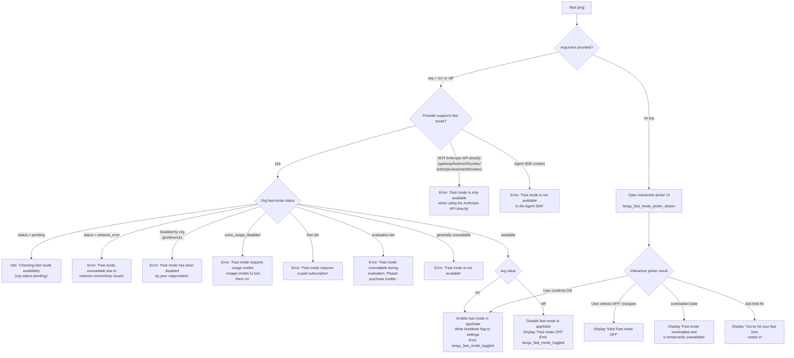

# `/fast`

> Analysis basis: CC v2.1.196 bundle.js (AST extraction + Claude interpretation)
> Minimum version: v2.1.196

---

## Overview

The `/fast` command toggles "Fast mode" — a research-preview feature that switches Claude Code to an accelerated inference path — on or off for the current session. It accepts an optional `[on|off]` argument; when no argument is provided it opens an interactive picker UI that renders the current mode status with live availability information. Availability is gated by API provider, subscription tier, organisational policy, and network reachability.

---

## Registration

| Field | Value |
|---|---|
| type | `local-jsx` |
| name | `fast` |
| description | `Toggle fast mode ( ... )` |
| argumentHint | `[on\|off]` |
| immediate | `null` |
| thinClientDispatch | `control-request` |
| isHidden | `null` |
| module_id | `IXl` |
| load_inline | `true` |
| loc_byte | `12853887` |
| loc_byte_end | `12854159` |
| loc_line | `8806` |
| arbor_handler.name | `i7f` |
| arbor_handler.fqn | `claude-2.1.196::i7f` |
| arbor_handler.kind | `AsyncFunction` |
| arbor_handler.resolution_path | `module_id` |
| arbor_handler.n_hits | `3` |

Analysis basis: CC v2.1.196 bundle.js:+12853887

---

## Input Branching

There are five or more distinct input/state paths (explicit argument, API-provider check, subscription tier check, org-policy check, and network-error recovery), so a Mermaid flowchart is used.



Analysis basis: CC v2.1.196 bundle.js:+12852897, +2287617, +2287685, +2288032, +2287136, +2287268, +2287449, +2287528, +12849552, +12850625

---

## Behavioral Spec

### 1. Handler Entry Point (`fastCommandHandler`)

The Arbor-resolved handler `i7f` is an `AsyncFunction` that is the primary entry point for `/fast`.

```
async function fastCommandHandler(commandInput, appContext):
    normalizedArg = normalizeArgument(commandInput.args)   // strips whitespace, lowercases

    availabilityResult = await checkFastModeAvailability(appContext)

    if normalizedArg is present:
        return handleDirectToggle(normalizedArg, availabilityResult, appContext)
    else:
        return renderFastModePicker(availabilityResult, appContext)
        // emits: tengu_fast_mode_picker_shown
```

Analysis basis: CC v2.1.196 bundle.js:+12852897, +12852909, +12852959, +12853031, +12853135, +12853196

### 2. Provider and Availability Gate (`fastModeAvailabilityChecker`)

Called before any toggle attempt. Inspects the active API-provider identifier and the cached/live org status.

```
function checkFastModeAvailability(appContext):
    provider = getActiveProvider(appContext)
    // provider is one of: "gateway", "bedrock", "foundry",
    //   "anthropicAws", "mantle", "vertex", "firstParty"

    if provider is NOT "firstParty":
        return { available: false,
                 reason: "Fast mode is only available when using the Anthropic API directly" }

    if runningInsideAgentSDK(appContext):
        return { available: false,
                 reason: "Fast mode is not available in the Agent SDK" }

    orgStatus = fetchOrgFastModeStatus(appContext)  // may be cached

    switch orgStatus:
        case "pending":
            return { available: false, reason: "pending",
                     message: "Checking fast mode availability (org status pending)" }
        case "network_error":
            return { available: false, reason: "network_error",
                     message: "Fast mode unavailable due to network connectivity issues" }
        case "preference" (disabled by org):
            return { available: false,
                     message: "Fast mode has been disabled by your organization" }
        case "extra_usage_disabled":
            return { available: false,
                     message: "Fast mode requires usage credits · /usage-credits to turn them on" }
        case "free":
            return { available: false,
                     message: "Fast mode requires a paid subscription" }
        case "evaluation":
            return { available: false,
                     message: "Fast mode unavailable during evaluation. Please purchase credits." }
        case "overloaded":
            return { available: false, reason: "overloaded",
                     message: "Fast mode overloaded and is temporarily unavailable" }
        default (unavailable):
            return { available: false, reason: "generic",
                     message: "Fast mode is not available" }
        case available:
            return { available: true }
```

Analysis basis: CC v2.1.196 bundle.js:+2287617, +2287685, +2287136, +2287177, +2287268, +2287323, +2287352, +2287449, +2287528, +2288032, +2288102, +2288163, +2288194, +2288273, +2288357, +2153086, +2153143, +2153193, +2153249, +2153303, +2153351, +2153360

### 3. Org Fast-Mode Status Fetch (`orgFastModeFetcher`)

The availability checker calls into a fetcher (`Xrt` in the call graph) that performs a background prefetch and caches results.

```
async function orgFastModeFetcher(appContext):
    if inFlightPromise exists:
        log("Fast mode prefetch in progress, returning in-flight promise")
        return inFlightPromise

    cachedAt = lastFetchTimestamp
    if cachedAt is recent:
        log("Skipping fast mode prefetch, fetched recently")
        return cachedResult    // e.g. "enabled (cached)" or "disabled (network_error)"

    authCredentials = resolveAuth(appContext)
    if authCredentials is null:
        return { status: "network_error", message: "No auth available" }

    try:
        response = await fetchOrgStatus(authCredentials)
        cacheResult(response, timestamp: Date.now())
        emit event A9r.emit (status change)
        return response
    catch AxiosError with status 401:
        // OAuth recovery flow (tengu_oauth_401_* telemetry)
        ...
    catch AxiosError with status 403:
        return { status: "network_error" }
    catch networkError:
        return { status: "network_error",
                 message: "Fast mode unavailable due to network connectivity issues" }
```

Analysis basis: CC v2.1.196 bundle.js:+12852959, +2291958, +2292205, +2292381, +2292409, +2292474, +2292516, +2292542, +2292608, +2293304, +2293323, +2293008

### 4. Direct Toggle Handler (`handleDirectToggle`)

Invoked when an explicit `on` or `off` argument is provided.

```
function handleDirectToggle(arg, availabilityResult, appContext):
    // arg accepted values: "on", "yes", "1" → enable; "off" → disable
    // (literals "yes", "on", 1 confirmed at +29725, +29731, +29635)

    if arg is truthy-on value:
        if NOT availabilityResult.available:
            display availabilityResult.message  // error banner
            return

        setAppState({ fastMode: true })
        writeFlagToSettings("fast_mode", enabled=true)   // key: "fast_mode" at +2289000
        emit telemetry: tengu_fast_mode_toggled
        display confirmation

    else if arg is "off":
        setAppState({ fastMode: false })
        writeFlagToSettings("fast_mode", enabled=false)
        emit telemetry: tengu_fast_mode_toggled
        display "Fast mode OFF"
```

Analysis basis: CC v2.1.196 bundle.js:+12853012, +12849281, +12849552, +2289000, +29725, +29731, +29635

### 5. Interactive Picker UI (`renderFastModePicker`)

Rendered as a JSX component (local-jsx type) when no argument is supplied.

```
function renderFastModePicker(availabilityResult, appContext):
    emit telemetry: tengu_fast_mode_picker_shown   // +12853137

    currentFastMode = appState.fastMode   // boolean

    render UI with:
        title: " Fast mode (research preview)"   // +12851218
        toggle row: "Fast mode" label with "ON " / "OFF" indicator  // +12851868, +12851936, +12851942
        status details derived from availabilityResult:
            - "overloaded" → "Fast mode overloaded and is temporarily unavailable"  // +12852109
            - fast-limit hit → "You've hit your fast limit · resets in <countdown>"  // +12852163, +12852192
        link: "https://code.claude.com/docs/en/fast-mode"   // +12852378
        keyboard bindings:
            "escape" / "cancel"   → dismiss
            "tab"   → toggle
            "enter" → confirm

    on user confirm (enable):
        if availabilityResult.available:
            setAppState({ fastMode: true })
            writeFlagToSettings("fast_mode", true)
            emit tengu_fast_mode_toggled
        else:
            noop / display error

    on user cancel / select OFF:
        display "Kept Fast mode OFF"   // +12850625
        emit tengu_fast_mode_toggled with state=false

    // Opus 4.7 deprecation notice path
    if currentModel matches "opus-4-7" / "claude-opus-4-7":
        // experiment flag "opus47-fast-mode-deprecation" is evaluated  // +12848667
        // Opus 4.8 ("claude-opus-4-8") is offered as replacement  // +12849412, +2288602
        // sunset telemetry: tengu_sunset_penguin_opus47
```

Analysis basis: CC v2.1.196 bundle.js:+12853137, +12851218, +12851868, +12851936, +12851942, +12852109, +12852163, +12852192, +12852378, +12850625, +12848667, +12849412, +2288602, +2289166

### 6. Settings Persistence (`flagSettingsWriter`)

Writing the fast-mode preference is routed through the `flagSettings` subsystem (key `"flagSettings"` at +2287970) and ultimately through the locked config-save path.

```
function writeFastModeFlag(enabled: boolean):
    settingsKey = "flagSettings"
    flagKey     = "fast_mode"

    currentSettings = readSettingsFromDisk()
    updatedSettings = merge(currentSettings, { [settingsKey]: { [flagKey]: enabled } })

    acquireLock()
    // may emit: tengu_config_lock_contention if contention detected
    saveConfigWithLock(updatedSettings)
    // may emit: tengu_config_stale_write, tengu_config_auto_repaired,
    //           tengu_config_auth_loss_prevented, tengu_config_fallback_write
    releaseLock()
```

Analysis basis: CC v2.1.196 bundle.js:+2287970, +14157063, +14157199, +14157576, +14157906, +14156679

### 7. Cooldown / Opus 4.7 Sunset Flow (`opusSunsetHandler`)

When the active model is `claude-opus-4-7` and a date threshold of `2026-07-25` (at +2289196) is reached, the command:

1. Emits `tengu_sunset_penguin_opus47`.
2. Presents the Opus 4.8 upgrade offer in the picker UI.
3. Resets a cooldown flag when it expires, logging "Fast mode cooldown expired, re-enabling fast mode" (+2289448).

Analysis basis: CC v2.1.196 bundle.js:+2289062, +2289086, +2289127, +2289166, +2289196, +2289395, +2289448

---

## State & Side Effects

| Item | Detail |
|---|---|
| Telemetry | `tengu_fast_mode_toggled` — fired on every successful on/off change |
| Telemetry | `tengu_fast_mode_picker_shown` — fired when picker UI is opened (no argument) |
| Telemetry | `tengu_penguins_off` — fired when fast mode is globally turned off via `Ble` path |
| Telemetry | `tengu_org_penguin_mode_fetch_failed` — fired when org-status network fetch fails |
| Telemetry | `tengu_sunset_penguin_opus47` — fired when Opus 4.7 fast-mode sunset condition is met |
| Telemetry | `tengu_oauth_401_sdk_callback_refreshed`, `tengu_oauth_401_recovered_from_disk`, `tengu_oauth_401_recovered_from_rotation`, `tengu_oauth_401_recovered_from_keychain`, `tengu_oauth_401_zombie_exit` — fired during OAuth error recovery within the org-status fetch |
| Telemetry | `tengu_config_parse_error`, `tengu_config_lock_contention`, `tengu_config_stale_write`, `tengu_config_auto_repaired`, `tengu_config_auth_loss_prevented`, `tengu_config_fallback_write` — fired during config persistence |
| Telemetry | `tengu_feature_ok`, `tengu_feature_bad`, `tengu_feature_sad` — feature-flag evaluation events |
| appState changes | `fastMode` boolean field toggled in global app state |
| Settings write | `flagSettings.fast_mode` written to user settings file (`~/.claude/settings.json`) |
| Background prefetch | Org fast-mode availability is prefetched and cached; in-flight promises are deduplicated |
| Lock contention | Config writes go through a file lock; contention logs a warning |
| thinClientDispatch | `control-request` — command is dispatched as a control request in thin-client mode |

---

## Version History

| Version | Change |
|---|---|
| v2.1.196 | Initial analysis |

---

## Common Mistakes

1. **Providing `on` when not on the Anthropic API** — Fast mode is only available with first-party Anthropic API (`firstParty` provider). Attempting to enable it on Bedrock, Vertex, gateway, foundry, Mantle, or AWS deployments will immediately return an error message.
2. **Expecting fast mode on the Agent SDK** — The SDK context explicitly blocks fast mode regardless of subscription tier.
3. **Forgetting that availability is async** — The first invocation triggers a background org-status fetch; if run immediately after startup the status may be `pending` and the command will report "Checking fast mode availability" without enabling the mode.
4. **Using `yes`/`1` instead of `on`** — Truthy synonyms `"yes"` and `1` are recognised internally but the documented argument hint is `[on|off]`; relying on synonyms may break across versions.
5. **Expecting instant persistence on a locked config** — If another Claude Code instance holds the config lock, the write is delayed and `tengu_config_lock_contention` is emitted; the toggle UI may appear to succeed before the file is actually updated.
6. **Using `/fast on` with Opus 4.7 after 2026-07-25** — The Opus 4.7 sunset logic will intercept the request and present an upgrade prompt rather than enabling fast mode on that model.

---

## Appendix — Identifier Mapping

> For bundle debugging only. Identifiers change across versions.

| Identifier | Role |
|---|---|
| `i7f` | Main handler (`fastCommandHandler`) — Arbor-resolved entry point for `/fast` |
| `uc` | Provider/auth context accessor |
| `Hr` | HTTP/API helper used by provider and availability checks |
| `Rm` | Sub-utility called from provider context |
| `ct` | Core utility (string/type coercion) |
| `Ble` | Fast-mode UI component orchestrator (renders picker, manages state) |
| `it` | Feature-flag evaluator |
| `C$t` | Feature-flag check helper A |
| `v$t` | Feature-flag check helper B |
| `P6` | Feature-flag lookup |
| `D6` | Feature-flag store reader |
| `iRn` | Feature-flag cache/dedup logic |
| `q7r` | Feature-flag experiment event emitter (GrowthbookExperimentEvent) |
| `Z7r` | Feature-flag result renderer |
| `Dt` | Config save/write coordinator |
| `qt` | Config path resolver |
| `sqo` | Config serialiser |
| `lIt` | Config file reader with backup logic |
| `Ldm` | Config file watcher/cleanup |
| `T` | Logging/debug utility |
| `eeu` | Debug log formatter |
| `gis` | Terminal encoding helper |
| `Me` | JSON serialisation wrapper |
| `Pc` | Sensitive-value redactor (`[REDACTED]`) |
| `Zls` | Redaction map builder |
| `KQe` | Terminal write helper |
| `Gls` | Raw stdout writer |
| `oeu` | Transcript/log append helper |
| `SQe` | Batched write queue |
| `bhe` | Transcript file manager |
| `xae` | Error classifier |
| `ncs` | Transcript path builder |
| `sTr` | Transcript rotation/rename |
| `reu` | Transcript append-with-rotation |
| `vi` | Hook/handler registration |
| `Fa` | Argument parser for slash commands |
| `bMt` | Command argument token builder |
| `ixs` | Token filter |
| `sxs` | Token list accumulator |
| `TMt` | Argument schema validator |
| `Mss` | Schema required-field checker |
| `Sle` | Schema type coercion |
| `zgn` | Schema error formatter |
| `hwe` | Remote-settings accessor |
| `I3` | Argument descriptor builder |
| `Ele` | Argument element renderer |
| `EMt` | Argument element helper |
| `Dss` | Argument default resolver |
| `qte` | Argument value normaliser |
| `$a` | Whitespace/escape replacer |
| `w0` | Boolean arg parser |
| `jo` | Model-name resolver/normaliser |
| `io` | Inference-profile checker |
| `Z8` | Shortcut/keybinding parser |
| `eHd` | Keybinding set builder |
| `qPt` | Keybinding dispatch helper |
| `l` | Log event writer |
| `eoc` | Log event formatter |
| `o` | Padding/display helper |
| `s` | Async task tracker |
| `i` | Stream/connection closer |
| `mF` | Flag-value inclusion checker |
| `Wbn` | Wrapped argument builder |
| `VPt` | Model prefix/alias resolver |
| `Jai` | Object-entry argument serialiser |
| `fn` | Command descriptor builder |
| `Bgn` | Command store updater |
| `Crt` | Object-entry iterator |
| `kr` | Session-state reader |
| `Yai` | Flag-index searcher |
| `tHd` | Typed argument handler |
| `k9r` | Index-of searcher |
| `nHd` | Nested argument handler |
| `zai` | Prefix-match checker |
| `N3e` | Fast-mode status display component |
| `uT` | Status message renderer |
| `zHe` | Status string formatter |
| `JHe` | Subscription tier checker |
| `Ao` | Auth state reader |
| `Mi` | Auth mode selector |
| `Ts` | Top-level slash-command dispatcher |
| `d6` | Command runner context builder |
| `r_` | Runner initialiser |
| `n3` | Runner state setter |
| `SH` | Session handler |
| `jC` | Session context builder |
| `GA` | Global app-state accessor |
| `ed` | App-state dispatcher |
| `$Fe` | App-state update helper |
| `ig` | Input gate/throttle |
| `fF` | Fast-path selector |
| `jP` | Fast-path descriptor |
| `c6` | Command context creator |
| `vr` | VS Code extension guard |
| `mQe` | VS Code mode helper |
| `Obn` | Org-ban/disable checker |
| `Vhd` | Visibility/hidden-flag handler |
| `Xrt` | Org fast-mode status fetcher (async, with caching and OAuth recovery) |
| `b9r` | Pre-fetch state builder |
| `zi` | Network-error classifier |
| `Fbs` | Network-error string mapper |
| `mw` | Model-selection helper |
| `TH` | Auth token resolver |
| `Hd` | Auth header builder |
| `gk` | Auth fallback handler |
| `yUt` | Auth type selector |
| `aI` | API-key helper |
| `gPt` | Keychain accessor |
| `cb` | OAuth credential builder |
| `Lc` | Credential loader |
| `hF` | Credential slice helper |
| `gw` | Permission/role checker |
| `Khd` | OAuth token cache |
| `Us` | OAuth endpoint resolver |
| `EHs` | OAuth env checker |
| `HSu` | OAuth host selector |
| `EF` | Org-status HTTP caller |
| `CPd` | API request executor (with OAuth 401 recovery) |
| `kF` | Request config builder |
| `Hwt` | Request header merger |
| `V` | React/Ink render helper |
| `xe` | Feature-ok event emitter |
| `Kst` | Token expiry checker |
| `ke` | Feature-bad event emitter |
| `K8` | Keychain read helper |
| `Ml` | TCI integration helper |
| `Gee` | Response parser |
| `Mwt` | Response metadata extractor |
| `Re` | Error logging helper |
| `IPd` | Retry-policy evaluator |
| `ELi` | Exponential-backoff calculator |
| `ph` | Process exit helper |
| `no` | Settings loader (disk → merged config) |
| `Lg` | Settings layer resolver |
| `Hwe` | Settings file locator |
| `CDr` | Config directory resolver |
| `BLs` | Settings file reader |
| `P8` | Project-settings reader |
| `$Ls` | SDK-inline settings reader |
| `nw` | Settings merge helper |
| `Ste` | File read-with-encoding |
| `Sn` | Error suppressor |
| `rn` | Error re-thrower |
| `MMr` | Settings timestamp cache |
| `VBe` | Settings version checker |
| `$gn` | Settings path resolver |
| `mkt` | Atomic file writer |
| `Bd` | Real-path resolver |
| `u` | Daemon control helpers |
| `rtt` | Rename error handler |
| `tkr` | Temp-file name generator |
| `JTs` | File property definer |
| `n_` | Cache clearer |
| `Gvs` | Git-ignore checker |
| `Ot` | Git subprocess runner |
| `gMr` | Git output parser |
| `Kmn` | Git check-ignore runner |
| `PFu` | Git excludesfile resolver |
| `Fvs` | Git ls-files runner |
| `Bvs` | Git tracked-file checker |
| `X5` | Settings path joiner |
| `dr` | Debug log writer |
| `g0` | Debug sink |
| `wt` | Feature-sad event emitter |
| `Oe` | Internal event base |
| `O8` | Settings load orchestrator |
| `m0` | Settings load start logger |
| `ga` | Memory-usage sampler |
| `vDr` | Settings watcher/cache invalidator |
| `_in` | Settings cache invalidator |
| `Hn` | Config save-with-lock orchestrator |
| `ntn` | Config backup + write routine |
| `Yli` | Config object assembler |
| `cIt` | Config integrity checker |
| `uqo` | Config backup path builder |
| `v` | Iterator variable (generic) |
| `y` | Splitter variable (generic) |
| `I` | Index variable / Math helper |
| `zUe` | Config pre-save validator |
| `iqo` | Config entry iterator |
| `etn` | Config timestamp recorder |
| `Zen` | Config fallback write |
| `Tdr` | Config write-with-dir-create |
| `Uar` | Fast-mode UI component (full picker/toggle view) |
| `Nar` | Fast-mode sub-panel renderer |
| `OLe` | Org-level fast-mode status reader |
| `SUe` | Settings-field coercion helper |
| `EUe` | Theme/colour resolver |
| `YF` | Theme selector |
| `N5e` | Theme constant builder |
| `ykn` | Theme name checker |
| `U6` | Theme prefix stripper |
| `D3i` | Theme default |
| `pc` | Active-project config reader |
| `sT` | Project feature-flag filter |
| `Awe` | Project root resolver |
| `xo` | Colour/style resolver |
| `D0e` | ANSI colour mapper |
| `mJ` | Colour fallback |
| `SF` | Spend/cost formatter |
| `Oai` | Number formatter (toFixed) |
| `Qrt` | Queue/rate tracker |
| `S5o` | Session-options builder |
| `Tai` | Session-timestamp parser |
| `$ar` | Fast-mode picker root JSX component |
| `At` | App-state hook |
| `ceo` | App-state context reader |
| `Di` | Input handler hook |
| `yc` | State selector A |
| `To` | State selector B |
| `Rs` | Clock-context hook |
| `pqd` | Key-reduction helper |
| `a` | Fetch/network helper |
| `kge` | Request body builder |
| `xVi` | Input fold helper |
| `I2t` | Input state merger |
| `S9r` | Fast-mode change emitter |
| `qe` | Internal event emitter |
| `$Xe` | Event base class |
| `c` | Generic closure variable |
| `yn` | Daemon interface |
| `$o` | Global handler registrar |
| `QS` | Global context reader |
| `Ji` | Time countdown formatter |

Note: index built via Arbor fallback; some signals (telemetry, literals) may be missing — see arbor-fallback.js.