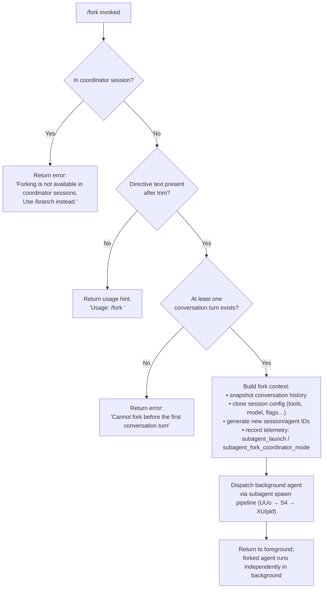

# `/fork`

> Analysis basis: CC v2.1.197 bundle.js (AST extraction + Claude interpretation)
> Minimum version: v2.1.197

---

## Overview

`/fork` spawns a new background agent that inherits the full current conversation context, including message history, working directory, and session configuration. The user supplies a directive string that becomes the forked agent's initial task. The command is unavailable inside coordinator sessions and requires at least one prior conversation turn to have occurred.

---

## Registration

| Field | Value |
|---|---|
| type | `local-jsx` |
| name | `fork` |
| description | Spawn a background agent that inherits the full conversation |
| argumentHint | `<directive>` |
| module_id | `$Ql` |
| load_inline | `true` |
| loc_byte | 12914735 |
| loc_byte_end | 12914938 |
| loc_line | 8904 |
| arbor_handler.name | `q7f` |
| arbor_handler.fqn | `claude-2.1.197::q7f` |
| arbor_handler.kind | `AsyncFunction` |
| arbor_handler.resolution_path | `module_id` |
| arbor_handler.n_hits | 0 |

Analysis basis: CC v2.1.197 bundle.js:+12914735

---

## Input Branching

There are four distinct execution paths based on session state and directive content, so a Mermaid flowchart is used.



---

## Behavioral Spec

### 1. Entry point — handler `q7f`

Analysis basis: CC v2.1.197 bundle.js:+12914294

```
async function forkCommandHandler(context, args):
    directive = args.trim()
    if directive is empty:
        return usageMessage("Usage: /fork <directive>")   // literal at +12914318

    if context.isCoordinatorSession():
        return errorMessage(
            "Forking is not available in coordinator sessions. Use /branch instead."
        )                                                  // literal at +12914432

    if conversationHistory has no prior turns:
        return errorMessage(
            "Cannot fork before the first conversation turn"
        )                                                  // literal at +12914505

    // proceed to build and launch the forked agent
    return buildAndLaunchFork(context, directive)
```

### 2. Fork context construction — `UUo`

Analysis basis: CC v2.1.197 bundle.js:+11489780

```
async function buildForkContext(context, directive):
    // Validate / record launch intent
    emitTelemetry("subagent_launch")                     // literal at +11489795
    emitTelemetry("subagent_fork_coordinator_mode")      // literal at +11489813

    // Normalise the directive string
    directive = sanitiseText(directive)                  // via e.replace (+11490162)

    // If directive was empty after sanitisation, report via telemetry
    if directive is empty:
        emitTelemetry("subagent_fork_prompt_missing")    // literal at +11489937

    // Capture conversation snapshot
    conversationSlice = currentMessages.slice(0, -50)   // constant 50 at +11490205
    replContexts = context.getReplContexts()             // +11490026

    // Populate REPL-context entries for fork
    hydratedContexts = hydrateReplContexts(replContexts)  // HQn at +11490121

    // Trim and normalise working-directory path
    workingDir = trimWorkingDir(context)                 // G1l at +11490153

    // Generate a unique session identifier for the fork
    forkSessionId = generateSecureId()                   // IP at +11490232

    // Stamp the fork with wall-clock time
    launchTime = Date.now()                              // +11490259

    // Build agent execution context (model config, flags, etc.)
    agentConfig = buildAgentExecutionContext(context)    // mEt at +11490295

    // Attach subagent context label
    agentConfig.contextLabel = "subagent"               // literal at +11490741
    agentConfig.spawnMode   = "spawn"                   // literal at +11490831

    // Read full conversation for the fork
    fullConversation = readConversationSnapshot(context) // Ur at +11490558

    return {
        directive,
        forkSessionId,
        launchTime,
        workingDir,
        replContexts: hydratedContexts,
        conversation: fullConversation,
        agentConfig
    }
```

### 3. Conversation snapshot — `Ur`

Analysis basis: CC v2.1.197 bundle.js:+11149507

```
function buildConversationSnapshot(appState):
    messages = appState.getAppState().messages
    lastAssistantMsg = messages.findLast(isAssistantMessage)  // +11149587

    // Resolve working directory for the snapshot
    workingDirectory = resolveField("working_directory", appState)  // literal at +11149612

    // Carry over tool allow/deny lists
    allowedTools    = resolveField("allowed_tools",    appState)  // literal at +11149667
    disallowedTools = resolveField("disallowed_tools", appState)  // literal at +11149722

    // Copy avoid_prompts flag
    avoidPrompts = resolveField("avoid_prompts", appState)  // literal at +11149783

    // Copy permission mode
    permissionMode   = resolveField("permission_mode",   appState)  // literal at +11149885
    bypassPermissions = resolveField("bypassPermissions", appState)  // literal at +11149916

    // Copy model / effort / thinking settings
    sessionSettings = {
        session:           resolveField("session",            appState),  // literal at +11150215
        effort:            resolveField("effort",             appState),  // literal at +11150240
        model:             resolveField("model",              appState),  // literal at +11150253
        maxThinkingTokens: resolveField("max_thinking_tokens",appState),  // literal at +11150265
        flagSettings:      resolveField("flag_settings",      appState)   // literal at +11150291
    }

    return {
        messages,
        lastAssistantMsg,
        workingDirectory,
        allowedTools,
        disallowedTools,
        avoidPrompts,
        permissionMode,
        bypassPermissions,
        ...sessionSettings
    }
```

### 4. System-prompt assembly — `YR` and helpers

Analysis basis: CC v2.1.197 bundle.js:+13878338

The system prompt sent to the forked agent is assembled by a pipeline of small helpers called from `YR`. Each contributes one logical section:

```
function assembleSystemPrompt(config):
    sections = []

    // Core identity / task description (Bam, Gam, Wam)
    sections.push(buildIdentitySection(config))

    // Tool-parameter formatting hints (OFi, B_e, it)
    sections.push(buildToolParamSection(config))

    // Environment info — static facts about CC availability (plm, dlm)
    sections.push(buildEnvInfoStatic(config))          // key "env_info_static" at +13879064

    // Environment info — dynamic (git worktree, cwd, etc.) (plm, dlm)
    sections.push(buildEnvInfoSimple(config))          // key "env_info_simple" at +13879101

    // Language / locale directive
    sections.push(buildLanguageSection(config))        // key "language" at +13879139

    // Output style (bg-session mode)
    sections.push(buildOutputStyle(config))            // key "bg-session" at +13879204; literal "bg" at +13884756

    // Memory / scratchpad section (iFt)
    sections.push(buildMemorySection(config))          // key "scratchpad" at +13879264

    // Context management / brief mode (hlm)
    sections.push(buildContextMgmtSection(config))     // key "context_management" at +13879292

    // Flag-driven behavioural sections (ylm, ilm, llm, Kam, zam, Ybl, slm …)
    sections.push(buildFlagSettingsSections(config))

    // Prompt-injection warning, auto-compaction notice
    sections.push(buildSecuritySection(config))        // literals at +13862611, +13862800

    // System metadata block (version, commit, timestamp)
    sections.push(buildSystemMetaBlock(config))        // version literal "2.1.197" at +13864878

    // Doing-tasks, using-tools, tone-style sections
    sections.push(buildDoingTasksSection(config))      // "# Doing tasks" at +13866947
    sections.push(buildUsingToolsSection(config))      // "# Using your tools" at +13870657
    sections.push(buildToneStyleSection(config))       // "# Tone and style" at +13876888

    // Session-specific guidance (rlm)
    sections.push(buildSessionGuidance(config))        // "# Session-specific guidance" at +13876251

    return sections.join("\n\n")
```

Key constants embedded in the fork system prompt include:

- Agent-thread cwd guidance: `"- Agent threads always have their cwd reset between bash calls, as a result please only use absolute file paths."` (bundle.js:+13883742)
- git-worktree notice: `"This is a git worktree — an isolated copy of the repository…"` (bundle.js:+13881257)
- Version: `"2.1.197"` (bundle.js:+13864878)
- Build timestamp: `"2026-06-29T19:08:42Z"` (bundle.js:+13864967)

### 5. Background agent dispatch — `S4`

Analysis basis: CC v2.1.197 bundle.js:+9502877

```
async function dispatchBackgroundAgent(forkContext):
    // Validate conversation state
    validate(forkContext.conversation)              // Ur, nse at top of S4

    // Build a one-time fork REPL context id
    contextId = generateSecureId()                 // IP at +9502981

    // Set performance tracking origin
    recordSpawnTimestamp(forkContext.launchTime)    // vfa at +9502991

    // Register agent with the daemon
    agentRecord = createAgentRecord(forkContext)    // ci at +9505079, DKt at +9504915

    // Write fork metadata to transcript
    writeForkMetadataEntry(forkContext)             // vfe at +9508801

    // Attach fork-context reference
    storeContextRef("fork-context-ref", agentRecord)  // literal at +13639306

    // Launch execution pipeline
    await runAgentQueryLoop(agentRecord, forkContext)  // XU / pkf at +9509641

    return agentRecord.id
```

### 6. Subagent execution pipeline — `XU` → `pkf`

Analysis basis: CC v2.1.197 bundle.js:+11084149

```
async function subagentQueryLoop(agentRecord, context):
    // Initialise turn counter; default turn limit applies
    // Telemetry emitted if default turns exceeded: tengu_forked_agent_default_turns_exceeded

    loop:
        streamResponse = await callModel(context)       // pkf: p.callModel at +11093862

        processStreamEvents(streamResponse)

        toolResults = await executeTools(streamResponse.toolCalls)

        if shouldStop(streamResponse, toolResults):
            break

        context.appendMessages(toolResults)

    // On completion, emit subagent_complete or subagent_stall_timeout
    finaliseAgentRecord(agentRecord)
```

---

## State & Side Effects

| Item | Detail |
|---|---|
| Telemetry — launch | `subagent_launch` (bundle.js:+11489795) |
| Telemetry — coordinator check | `subagent_fork_coordinator_mode` (bundle.js:+11489813) |
| Telemetry — missing prompt | `subagent_fork_prompt_missing` (bundle.js:+11489937) |
| Telemetry — turns exceeded | `tengu_forked_agent_default_turns_exceeded` (bundle.js:+11148358) |
| Telemetry — stall timeout | `tengu_async_agent_stall_timeout` (bundle.js:+9226751) |
| Telemetry — tool completed | `tengu_agent_tool_completed` (bundle.js:+9222553) |
| Telemetry — agent summary skipped | `tengu_agent_summary_skipped` (bundle.js:+9115087) |
| Telemetry — stranded tools cleared | `tengu_async_agent_stranded_tools_cleared` (bundle.js:+9227711) |
| Telemetry — subagent complete | `subagent_complete` (literal at +9226991) |
| Telemetry — subagent stall timeout | `subagent_stall_timeout` (literal at +9227011) |
| Telemetry — run hook | `tengu_run_hook` (bundle.js:+13794365) |
| appState changes | Forked agent record written to daemon registry; transcript subdirectory created on disk |
| Filesystem | Fork metadata written as `.meta.json` (literal at +13620120); transcript as `.jsonl` (literal at +13620276); symlink created under `subagents/` path (literal at +5426068) |
| Background session label | `"background session"` (literal at +18076393) |
| Agent output mode | `"bg"` (literal at +13884756); session type `"bg-session"` (literal at +13879204) |
| Session ID generation | `SL.randomUUID` / `d0o.randomUUID` used to produce unique fork IDs |
| Conversation slice size | Up to 50 messages trimmed from tail during context construction (literal `50` at +11490202) |
| Watchdog timeout | 600 000 ms (10 min) max before stall is declared (literal at +9225677) |
| Background-worker memory limit | Low-memory guard: if free memory falls below threshold, non-pinned workers are shed; see `tengu_bg_dispatch_low_mem` / `tengu_bg_retire_pinned_low_mem` |
| Hook events | `SubagentStart` (literal at +13760375), `SubagentStop` (literal at +13803298) hooks fired around the fork lifecycle |

---

## Version History

| Version | Change |
|---|---|
| v2.1.197 | Initial analysis |

---

## Common Mistakes

1. **Running `/fork` in a coordinator session** — The command explicitly blocks this and suggests `/branch` instead. The coordinator-session check occurs before any other validation (bundle.js:+12914432).
2. **Omitting the directive argument** — Invoking `/fork` with no text (or only whitespace) returns the usage hint `"Usage: /fork <directive>"` and does not spawn any agent (bundle.js:+12914318).
3. **Forking before the first turn** — The command requires at least one assistant turn to already exist in the conversation. Attempting to fork on a fresh session returns an error (bundle.js:+12914505).
4. **Expecting the fork to share live state** — The fork captures a snapshot of the conversation at call time. Subsequent changes to the parent session are not propagated to the forked agent.
5. **Assuming unlimited turns** — The forked agent is subject to a default turn limit. Exceeding it emits `tengu_forked_agent_default_turns_exceeded` and may terminate the agent.

---

## Appendix — Identifier Mapping

> For bundle debugging only. Identifiers change across versions.

| Identifier | Role |
|---|---|
| `q7f` | Fork command handler (async entry point) |
| `UUo` | Fork context builder — assembles snapshot, IDs, and agent config |
| `vPf` | Sub-function within fork context builder; fetches conversation and builds system prompt |
| `Ur` | Conversation snapshot builder; extracts messages, tool lists, model settings |
| `YR` | System-prompt assembler; calls all section-builder helpers |
| `S4` | Background agent dispatch loop; registers agent, writes metadata, runs query loop |
| `XU` | Subagent query-loop entry; wraps `pkf` |
| `pkf` | Core subagent execution pipeline (model calls, tool execution, compaction) |
| `Lv` | Subagent run lifecycle; hooks, tool dispatch, transcript writing |
| `DKt` | Agent record creation; assigns UUID, writes initial metadata |
| `vfe` | Fork metadata file writer (`.meta.json`, `.jsonl`) |
| `mEt` | Agent execution context builder (model, signal handling, working dir) |
| `Wbe` | Symlink manager for subagent working-directory setup |
| `nse` | System-prompt section: model/provider resolution |
| `sR` | System-prompt subsystem: model-string normalisation |
| `iFt` | System-prompt section: memory / scratchpad loader |
| `rlm` | System-prompt section: session-specific guidance |
| `plm` | System-prompt section: environment info (static) |
| `dlm` | System-prompt section: environment info (dynamic / git worktree) |
| `hlm` | System-prompt section: context management / brief mode |
| `ylm` | System-prompt section: flag settings |
| `ilm` | System-prompt section: act-don't-re-derive and related flags |
| `Kam` | System-prompt section: heron-brook autonomy prompt |
| `zam` | System-prompt section: autonomy-append flag |
| `Bam` | System-prompt section: core identity (user-facing text output note) |
| `Gam` | System-prompt section: confirm-before-action guidance |
| `Wam` | System-prompt section: confirm-before-action (extended) |
| `mlm` | System-prompt section: output-style / worktree mode |
| `FYn` | System-prompt section: scratchpad / tmp directory |
| `Qam` | System-prompt section: system metadata block |
| `Zam` | System-prompt section: doing-tasks guidance |
| `tlm` | System-prompt section: using-tools guidance |
| `olm` | System-prompt section: NK / session-specific extra sections |
| `HQn` | REPL-context hydration for fork |
| `qEf` | REPL-context filter — assistant messages |
| `KEf` | REPL-context filter — tool_use messages |
| `VEf` | REPL-context filter — code results |
| `zEf` | REPL-context filter — combined check |
| `G1l` | Working-directory trim helper |
| `IP` | Secure-ID generator (random hex bytes) |
| `hll` | Subagent turn orchestrator; calls classifier, writes summaries |
| `vx` | Subagent stream-event processor |
| `$qe` | Subagent per-turn runner; state machine for model + tool loop |
| `yLo` | Subagent completion handler; emits final telemetry |
| `SLo` | Subagent auto-mode classifier |
| `C_t` | Handoff classifier core |
| `ocl` | Subagent turn-state updater; manages timeouts |
| `Zde` | Subagent spinner / UI state updater |
| `pbe` | Subagent task-registry updater |
| `Uqe` | Task speculation handler |
| `UZn` | Task notification dispatcher |
| `i7n` | Subagent metrics recorder |
| `rcl` | Transcript update helper (subagent) |
| `mze` | Context-window management for subagent |
| `_ll` | Subagent transcript-update state writer |
| `vs` | Process-exit helper (cli_error path) |
| `NYn` | Subagent app-state initialiser |
| `$Yn` | MCP / skill configuration for subagent |
| `Yio` | Skill / tool-list builder for subagent |
| `ci` | Session-record creator (uuid, now) |
| `Mn` | UUID generator wrapper |
| `T` | Logging / telemetry helper (message formatter) |
| `Re` | Feature-flag / experiment helper |
| `Oe` | Feature-flag resolver |
| `QI` | Model-string builder |
| `ct` | String-conversion utility |
| `it` | Tool-permission gate |
| `nc` | Tool-name normaliser |
| `Ru` | Sort / locale-compare helper |
| `lg` | Token-count estimator |
| `Xc` | Event emitter (telemetry attributes) |
| `br` | Nonconforming-output handler |
| `xe` | JSX/React element builder (error path) |
| `wt` | Warning element builder |
| `he` | String coercer |
| `er` | Error constructor helper |
| `Me` | JSON.stringify wrapper |
| `ke` | Error logger |
| `Ev` | Local-agent telemetry emitter |
| `fn` | Logger (Ggn / I3 backends) |
| `bl` | H0 logger helper |
| `dv` | Discard helper |
| `vy` | Void/noop helper |
| `g6` | Metrics gauge helper |
| `rn` | Retry/noop marker |
| `h_` | Internal state reader |
| `Sl` | Task-state accessor |
| `fC` | Task filter helper |
| `vr` | Verbose-log helper |
| `Pse` | Task-priority setter |
| `lbe` | Task-deletion helper |
| `uOo` | Wall-clock timestamp helper |
| `Kc` | Fork-context reference store |
| `Cfe` | Context-file metadata reader |
| `Pze` | Context-filter pipeline |
| `Zcc` | Context-path resolver |
| `A9t` | Post-fork cleanup helper |
| `RDe` | Residual-data cleanup helper |