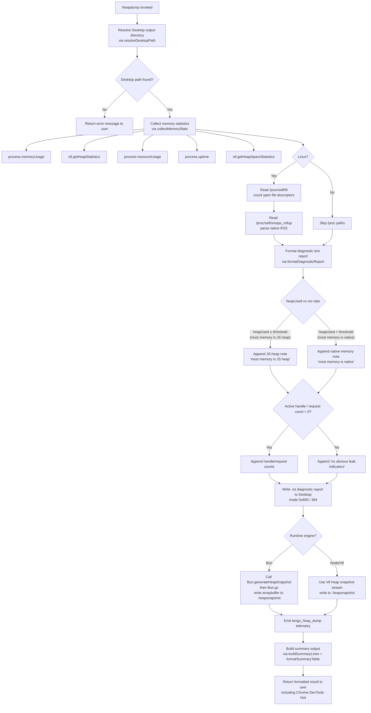

# `/heapdump`

> Analysis basis: CC v2.1.197 bundle.js (AST extraction + Claude interpretation)
> Minimum version: v2.1.197

---

## Overview

`/heapdump` is a hidden diagnostic slash command that captures a JavaScript heap snapshot of the running Claude Code process and writes it to the user's Desktop directory. Beyond the raw snapshot file, it also collects process-level memory statistics, heap space breakdowns, open file-descriptor counts, and Linux `smaps_rollup` data (where available), then emits a formatted diagnostic report alongside a `.heapsnapshot` file suitable for inspection in Chrome DevTools.

---

## Registration

| Field | Value |
|---|---|
| type | `local` |
| name | `heapdump` |
| description | `Dump the JS heap to ~/Desktop` |
| supportsNonInteractive | `true` |
| isHidden | `true` |
| module_id | `Gec` |
| load_inline | `true` |
| loc_byte | `13014508` |
| loc_byte_end | `13014936` |
| loc_line | `9026` |
| arbor_handler.name | `mJf` |
| arbor_handler.fqn | `claude-2.1.197::mJf` |
| arbor_handler.kind | `AsyncFunction` |
| arbor_handler.resolution_path | `module_id` |
| arbor_handler.n_hits | `0` |

Analysis basis: CC v2.1.197 bundle.js:+13014508

---

## Input Branching

The command has three or more distinct execution paths depending on runtime conditions (runtime engine detection, OS platform, presence of Linux memory files, and heap vs. native memory balance). A Mermaid flowchart is used.



---

## Behavioral Spec

### Handler Entry Point (`mJf`)

The Arbor-resolved handler is `mJf` (an `AsyncFunction`), reached via `module_id` resolution from module `Gec`.

```
async function heapdumpHandler(context):
    lines = []

    // Step 1: Resolve output directory
    desktopPath = resolveDesktopPath()          // rIs
    if desktopPath is null:
        return errorResult("Could not locate Desktop directory")

    outputDir = path.join(desktopPath, ...)     // e6o.join

    // Step 2: Collect memory diagnostics
    memStats = collectMemoryStats()             // Fec
    reportText = formatDiagnosticReport(memStats)  // part of t6o

    // Step 3: Write text report
    fs.writeFile(path.join(outputDir, reportFile), reportText, mode=0o600)  // 384 decimal

    // Step 4: Write heap snapshot
    writeHeapSnapshot(outputDir)                // fJf

    // Step 5: Emit telemetry
    emit("tengu_heap_dump")                    // loc_byte: 13012629

    // Step 6: Build and return summary
    summaryLines = buildSummaryLines(memStats)  // gJf
    lines.push(...summaryLines)
    return lines.join("\n")
```

Analysis basis: CC v2.1.197 bundle.js:+13013377

---

### Desktop Path Resolution (`rIs`)

```
function resolveDesktopPath():
    homeDir = os.homedir()                     // dRr.homedir

    if platform is "darwin" or "linux":
        return path.join(homeDir, "Desktop")   // "Desktop" literal at loc_byte 1112654

    if platform is "win32":
        // Walk /mnt/c/Users looking for a real user directory
        // Skip: "Public", "Default", "Default User", "All Users"
        // loc_bytes: 1112876, 1112920, 1112939, 1112959, 1112984
        candidates = listWindowsUserDirs("/mnt/c/Users")
        realUser = candidates.filter(name => not in skipList).first()
        if realUser:
            return path.join("/mnt/c/Users", realUser, "Desktop")

    return null
```

Analysis basis: CC v2.1.197 bundle.js:+13012335

---

### Memory Statistics Collection (`Fec`)

```
function collectMemoryStats():
    stats = {}
    stats.memoryUsage     = process.memoryUsage()         // loc_byte: 13009540
    stats.heapStatistics  = v8.getHeapStatistics()        // ilr.getHeapStatistics, loc_byte: 13009564
    stats.resourceUsage   = process.resourceUsage()       // loc_byte: 13009590
    stats.uptime          = process.uptime()              // loc_byte: 13009616
    stats.heapSpaces      = v8.getHeapSpaceStatistics()   // ilr.getHeapSpaceStatistics, loc_byte: 13009641
    stats.activeHandles   = process._getActiveHandles()   // loc_byte: 13009683
    stats.activeRequests  = process._getActiveRequests()  // loc_byte: 13009720

    // Linux-only: open file descriptor count
    try:
        fdEntries = fs.readdir("/proc/self/fd")           // loc_byte: 13009771 / 13009783
        stats.openFdCount = fdEntries.length
    except:
        stats.openFdCount = null

    // Linux-only: native RSS from smaps_rollup
    try:
        smaps = fs.readFile("/proc/self/smaps_rollup", "utf8")  // loc_byte: 13009833 / 13009846 / 13009872
        stats.nativeRss = parseSmapsRss(smaps)
    except:
        stats.nativeRss = null

    // Load bun:jsc module if available for additional heap info
    try:
        jsc = require("bun:jsc")                         // loc_byte: 13009931
        stats.jscHeap = jsc.heapSize()
    except:
        stats.jscHeap = null

    return stats
```

Analysis basis: CC v2.1.197 bundle.js:+13012052

---

### Diagnostic Report Formatting (`t6o` — core orchestrator)

```
function orchestrateDiagnosticAndDump(context):
    // Collect stats
    memStats = collectMemoryStats()          // Fec

    // Format text lines
    reportLines = []

    // Memory ratios (threshold around 500 MB based on literal 500 at loc_byte 13010465)
    heapUsedMB = memStats.heapStatistics.used_heap_size / 1048576   // 1048576 at loc_byte 13010077
    rssMB      = memStats.memoryUsage.rss / 1048576

    reportLines.push(formatMemoryTable(memStats))

    // Handle / request counts
    if memStats.activeHandles > 0 or memStats.activeRequests > 0:
        // Open FD threshold: 3600 (loc_byte: 13010072)
        if memStats.openFdCount > 3600:
            reportLines.push(WARNING: high open FD count)

    // Native memory warning
    nativeRatio = (rssMB - heapUsedMB) / rssMB * 100
    if nativeRatio > 100:     // literal 100 at loc_byte 13010224
        reportLines.push("Native memory > heap - leak may be in native addons (node-pty, sharp, etc.)")
        // loc_byte: 13010310

    // Leak indicator summary
    if no obvious indicators:
        reportLines.push("No obvious leak indicators. Check heap snapshot for retained objects.")
        // loc_byte: 13011429

    // Platform note for darwin
    if platform == "darwin":              // loc_byte: 13011583
        reportLines.push(darwin-specific note)

    // Write text diagnostic file
    fs.writeFile(outputPath, reportLines.join("\n"), { mode: 0o600 })  // 384 at loc_byte 13012522

    // Write heap snapshot
    writeHeapSnapshot(outputDir)          // fJf

    // Emit telemetry
    emit("tengu_heap_dump")               // loc_byte: 13012629

    // Format summary output for the user
    summaryOutput = buildSummaryLines(memStats)  // gJf
    return formatOutput(summaryOutput, desktopPath)
```

Analysis basis: CC v2.1.197 bundle.js:+13012039

---

### Heap Snapshot Writer (`fJf`)

```
function writeHeapSnapshot(outputDir):
    if runtime is Bun:
        // Use Bun-native snapshot API
        snapshot = Bun.generateHeapSnapshot("v8", "arraybuffer")
        // "v8" at loc_byte 13013102, "arraybuffer" at loc_byte 13013107
        fs.writeFileSync(path.join(outputDir, snapshotFilename), snapshot)
        // $ec.writeFileSync at loc_byte 13013057
        Bun.gc(true)                          // Force GC after snapshot, loc_byte: 13013134
    else:
        // Node.js V8 heap snapshot stream
        // Uses V8 writeHeapSnapshot or stream API
        writeV8HeapSnapshot(outputDir)
```

Analysis basis: CC v2.1.197 bundle.js:+13012578

---

### Summary Table Builder (`gJf`)

```
function buildSummaryLines(memStats):
    lines = []

    // Compute dominant memory type
    heapMB  = memStats.heapStatistics.used_heap_size / 1048576
    rssMB   = memStats.memoryUsage.rss / 1048576
    ratio   = Math.max(heapMB / rssMB, ...)    // Math.max at loc_byte 13013752

    if ratio >= threshold:
        lines.push("— most memory is JS heap (inspect the .heapsnapshot)")
        // loc_byte: 13013820
    else:
        lines.push("— most memory is native (NOT in the .heapsnapshot)")
        // loc_byte: 13013880

    if no warning indicators:
        lines.push("  (no obvious leak indicators)")    // loc_byte: 13014017

    // Memory threshold note: 1 GB = 1073741824 bytes (loc_byte: 13014426)
    // Column width: 8 characters (loc_byte: 13014152)
    // Calls iTt for table formatting (loc_byte: 13014064)
    lines.push(formatTable(memStats, columnWidth=8))

    lines.push("Open the .heapsnapshot in Chrome DevTools → Memory → Load to inspect retainers.")
    // loc_byte: 13013533

    return lines
```

Analysis basis: CC v2.1.197 bundle.js:+13013496

---

### Error Handling (`er`, `Ed`)

```
function normalizeError(value):
    // er: wraps a raw thrown value into a structured Error
    if value is Error: return value
    return new Error(String(value))       // loc_bytes: 183546, 183552

function handleCommandError(err, context):
    // Ed: displays error to the user UI
    // Called when writeFile, snapshot generation, or path resolution fails
    displayError(normalizeError(err))
```

Analysis basis: CC v2.1.197 bundle.js:+13012798, +13012807

---

### Output Verbosity Control (`T` — log-level filter)

The call chain `t6o → T` (loc_byte: 13012098) passes through a log-level filter that uses level `"debug"` (loc_byte: 216383) and the literal `3` (loc_byte: 13012095) as the numeric threshold. Log lines below this level are suppressed in non-interactive or non-debug sessions.

Analysis basis: CC v2.1.197 bundle.js:+13012098

---

## State & Side Effects

| Item | Detail |
|---|---|
| Telemetry | `tengu_heap_dump` (loc_byte: 13012629); background infrastructure also touches `tengu_bg_dispatch_sigkill_escalate`, `tengu_daemon_idle_exit`, `tengu_feature_bad`, `tengu_feature_ok`, `tengu_bg_dispatch_low_mem`, `tengu_bg_spare_enable`, `tengu_bg_sendclaim_failed`, `tengu_bg_handoff_settle`, `tengu_bg_spare_claim`, `tengu_bg_spare_claim_fail` (reachable from shared call-graph utilities) |
| File writes | Diagnostic `.txt` report to `~/Desktop/` with permissions `0o600` (mode `384`, loc_byte: 13012522); `.heapsnapshot` file to same directory |
| Bun GC side-effect | `Bun.gc(true)` is called after snapshot generation (loc_byte: 13013134), triggering a forced garbage-collection cycle in Bun runtimes |
| `/proc` reads (Linux) | Reads `/proc/self/fd` (loc_byte: 13009783) and `/proc/self/smaps_rollup` (loc_byte: 13009846) to collect native memory data; gracefully skipped on non-Linux |
| appState changes | None directly; background daemon infrastructure referenced in shared utilities may update session state via `Hz.spawn` / `Hz.claim` |
| Sound | None detected |
| Hook registration | `vi` calls `yis.register` (loc_byte: 68542) — reachable from the logging subsystem, not specific to heapdump |
| Memory threshold constant | 1 GiB = `1073741824` bytes (loc_byte: 13014426) used in summary classification |
| Open FD warning threshold | `3600` descriptors (loc_byte: 13010072) |
| MB divisor | `1048576` (loc_byte: 13010077) |
| Native-leak ratio threshold | `100`% (loc_byte: 13010224) |

---

## Version History

| Version | Change |
|---|---|
| v2.1.197 | Initial analysis |

---

## Common Mistakes

1. **Expecting output in the current working directory.** The command always writes to `~/Desktop` (or the WSL equivalent on Windows). There is no flag to redirect output.
2. **Running on a machine without a Desktop folder.** The command resolves the Desktop path at runtime; if the path does not exist (e.g., headless servers without `~/Desktop`), it returns an error rather than falling back to a temp directory.
3. **Confusing the `.txt` report with the `.heapsnapshot` file.** The text file contains human-readable statistics and warnings. The `.heapsnapshot` is the binary V8 snapshot that must be loaded in Chrome DevTools → Memory → Load profile.
4. **Expecting the command to appear in `/help` output.** The command is registered with `isHidden: true` and will not appear in the standard command list.
5. **Interpreting "most memory is native" as a V8 leak.** When the summary reports native memory dominance (loc_byte: 13013880), the issue lies in native addons such as `node-pty` or `sharp`, not in JavaScript objects that would be visible in the heap snapshot.
6. **Running in non-interactive pipelines without `supportsNonInteractive: true` awareness.** The flag is set, so the command can execute in non-interactive mode, but callers must ensure the Desktop path is reachable in that environment.

---

## Appendix — Identifier Mapping

> For bundle debugging only. Identifiers change across versions.

| Identifier | Role |
|---|---|
| `mJf` | Main async handler for `/heapdump` (Arbor-resolved entry point) |
| `t6o` | Core orchestrator: collects stats, writes files, emits telemetry, returns output |
| `Fec` | Memory statistics collector (process, V8, /proc, bun:jsc) |
| `fJf` | Heap snapshot writer (Bun.generateHeapSnapshot or V8 stream) |
| `gJf` | Summary/table builder for user-facing output |
| `rIs` | Desktop path resolver (cross-platform: macOS/Linux/WSL Windows) |
| `Rt` | Shared result/response constructor |
| `H0` | Helper called from result constructor |
| `y` | Bun:jsc module loader helper |
| `lqe` | TeammateMailbox / message-read helper (shared utility) |
| `H` | Background process list / values iterator |
| `P` | Background process entry |
| `h` | Daemon/background session manager |
| `V` | Async utility / promise helper |
| `j` | Subprocess kill/timeout orchestrator |
| `On` | Abort-signal / timeout utility |
| `e` | String replacement helper |
| `Re` | Feature-flag OK reporter (`tengu_feature_ok`) |
| `xe` | Feature-flag BAD reporter (`tengu_feature_bad`) |
| `CYe` | System free-memory checker (macOS-aware, `os.freemem`) |
| `N6e` | Temp file / lstat / rm helper |
| `ke` | Error logging utility (`Ete.logError`) |
| `Y` | MCP session retirer (`retireIfSettled`) |
| `it` | Worker/sub-agent dispatch tracker |
| `Tns` | Daemon socket connection handler |
| `Lns` | Background session lifecycle manager |
| `l` | Doc/schema helper |
| `g` | Format helper `f` caller |
| `rn` | Shared async runner / retry utility |
| `Oe` | Error display utility (calls `$Xe`) |
| `z` | Disposable resource wrapper (`Etn`) |
| `T` | Log-level filter / output dispatcher |
| `deu` | Debug log emitter |
| `Sis` | Log sink selector |
| `Me` | JSON stringifier wrapper |
| `Pc` | Text formatter / redactor (`[REDACTED]`) |
| `scs` | Locale/unit map builder (`leu.map`) |
| `KQe` | Writer helper (`zls`) |
| `zls` | Stream write wrapper |
| `geu` | Log-file appender (mkdir, appendFile, rotate) |
| `SQe` | Buffered log flusher (setTimeout / setImmediate) |
| `Che` | Log-line composer |
| `qt` | Filesystem promise wrapper |
| `Rae` | Error normaliser for filesystem ops |
| `lcs` | Log file path resolver |
| `lTr` | Log file rotation handler (stat, rename, unlink) |
| `meu` | Log file write executor (mkdir, appendFile, rotate) |
| `vi` | Hook/plugin registrar (`yis.register`) |
| `er` | Error constructor/normaliser |
| `Ed` | Error display dispatcher |
| `iTt` | Table column formatter |

---

Note: index built via Arbor fallback; some signals (telemetry, literals) may be missing — see arbor-fallback.js.