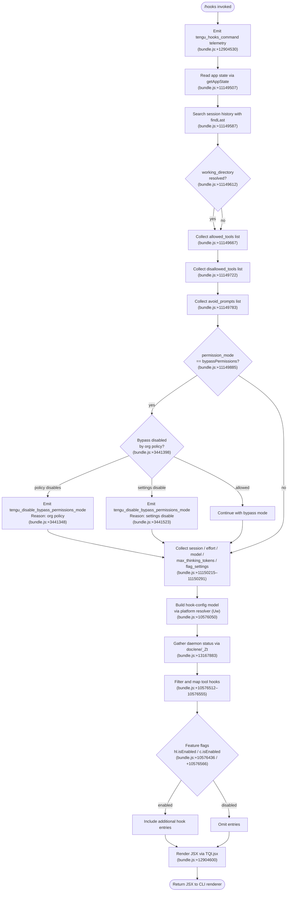

# `/hooks`

> Analysis basis: CC v2.1.197 bundle.js (AST extraction + Claude interpretation)
> Minimum version: v2.1.197

---

## Overview

The `/hooks` command displays the current hook configurations for tool events within a Claude Code session. It is a read-oriented, `immediate`-type command that resolves hook settings from application state and renders them as a JSX view without initiating an agent turn. The command fires a dedicated telemetry event (`tengu_hooks_command`) at invocation and delegates rendering to a JSX component.

---

## Registration

| Field | Value |
|---|---|
| type | `local-jsx` |
| name | `hooks` |
| description | `View hook configurations for tool events` |
| immediate | `true` |
| module_id | `bQl` |
| load_inline | `true` |
| loc_byte | `12904720` |
| loc_byte_end | `12904870` |
| loc_line | `8904` |
| arbor_handler.name | `N7f` |
| arbor_handler.fqn | `claude-2.1.197::N7f` |
| arbor_handler.kind | `AsyncFunction` |
| arbor_handler.resolution_path | `module_id` |
| arbor_handler.n_hits | `0` |

Analysis basis: CC v2.1.197 bundle.js:+12904720

---

## Input Branching

The handler has 3+ distinct logical paths: telemetry emission, app-state retrieval with session-history search, permission-mode validation, and conditional JSX rendering. A flowchart is required.



---

## Behavioral Spec

### 1. Telemetry Emission

The first action taken by the handler (`N7f`) is to emit a telemetry event signalling that the hooks command was invoked.

```
async function hooksCommandHandler(context):
    emitTelemetry("tengu_hooks_command")
    // proceeds immediately; does not await user confirmation
```

Analysis basis: CC v2.1.197 bundle.js:+12904530

---

### 2. App-State and Session Resolution

The handler calls `getAppState` (via the `appStateReader` helper `Ur`) to retrieve the current live session snapshot. It then uses `findLast` on the session history array to locate the most recent session entry, keying on `working_directory`.

```
function resolveSessionContext(appState):
    history = appState.getAppState()
    lastEntry = history.findLast(entry => entry.working_directory != null)
    return {
        workingDirectory : lastEntry?.working_directory,
        allowedTools     : lastEntry?.allowed_tools,
        disallowedTools  : lastEntry?.disallowed_tools,
        avoidPrompts     : lastEntry?.avoid_prompts
    }
```

Analysis basis: CC v2.1.197 bundle.js:+11149507, +11149587, +11149612, +11149667, +11149722, +11149783

---

### 3. Permission-Mode and Bypass Validation

After reading the session context, the handler inspects the `permission_mode` field. When the mode is `"bypassPermissions"`, the validation utility (`AR` → `WYr`) checks two independent disable conditions: an organisation policy gate and a settings-level disable flag. If either condition is active, `tengu_disable_bypass_permissions_mode` is emitted before proceeding.

```
function validatePermissionMode(sessionContext):
    if sessionContext.permission_mode == "bypassPermissions":
        if orgPolicyDisablesBypassPermissions():
            emitTelemetry("tengu_disable_bypass_permissions_mode")
            // reason: "Bypass permissions mode was disabled by your organization policy"
        else if settingsDisablesBypassPermissions():  // "disable" sentinel
            emitTelemetry("tengu_disable_bypass_permissions_mode")
            // reason: "Bypass permissions mode was disabled by settings"
        // continue regardless; display reflects effective mode
```

Analysis basis: CC v2.1.197 bundle.js:+11149885, +11149916, +3441348, +3441398, +3441523, +3441539

---

### 4. Platform and Model Context Collection

The handler calls the platform resolver (`Uw`, surfaced as `m1`) to build a model-context record. The resolver distinguishes at least two deployment targets (`"cli"` and `"remote"`) and cross-references the tool-invocation registry (`it`) to determine which tools are available under the current model. Flag values such as `"yes"/"on"` and `"no"/"off"` are normalised here.

```
function buildPlatformContext():
    platform = resolvePlatform()  // "cli" | "remote"
    toolRegistry = getToolRegistry()
    return {
        platform      : platform,
        session       : getSessionMeta(),        // "session" key
        effort        : getEffortSetting(),      // "effort" key
        model         : getModelIdentifier(),    // "model" key
        maxThinking   : getMaxThinkingTokens(),  // "max_thinking_tokens" key
        flagSettings  : getFlagSettings()        // "flag_settings" key
    }
```

Analysis basis: CC v2.1.197 bundle.js:+5152149, +5152160, +11150215, +11150240, +11150253, +11150265, +11150291

---

### 5. Hook Configuration Loading

The hook-config loader (`TYe`) attempts to `stat` the hook configuration file. If the file does not exist (`ENOENT`), it rejects with a structured error. If the file is too large (> 1 048 576 bytes), it is also rejected. On success the loader reads key sets via `Object.keys` and checks for known tool-event names using a `Set.has` membership test.

```
async function loadHookConfig(configPath):
    try:
        stat = await fs.stat(configPath)
    catch err:
        if err.code == "ENOENT":
            return Promise.reject(structuredError)
    if stat.size > 1048576:   // 1 MiB limit (bundle.js:+13342385)
        return Promise.reject(sizeError)
    if not stat.isFile():
        return Promise.reject(notFileError)
    raw = await readConfigFile(configPath)
    keys = Object.keys(raw)
    return keys.filter(k => knownHookEventNames.has(k))
```

Analysis basis: CC v2.1.197 bundle.js:+13342294, +13342317, +13342325, +13342339, +13342366, +13342385, +13342803, +13342889

---

### 6. Hook Table Formatting

The table formatter (`Cic`) computes column widths via `Math.max` over all key lengths, then right-pads each entry with spaces (pad width: 40 characters) before joining columns with a two-space separator (`"  "`).

```
function formatHookTable(hookEntries):
    keys = Object.keys(hookEntries)
    maxWidth = Math.max(...keys.map(k => k.length))
    rows = keys.map(k =>
        k.padEnd(maxWidth) + "  " + renderValue(hookEntries[k])
    )
    return rows.join("\n")
```

Analysis basis: CC v2.1.197 bundle.js:+13343515, +13343560, +18065407, +18067388

---

### 7. Daemon Status Integration

The daemon-status reader (`doc`) checks the file `daemon.status.json` at the path constructed by `_Zt` (joining `uoc` path segments). It reads the current timestamp (`Date.now`) and the persisted daemon state to determine whether any background hook-execution daemon is running or stopped. The status is surfaced in the rendered view.

```
async function readDaemonStatus():
    statusPath = joinPaths(...uocParts, "daemon.status.json")
    now = Date.now()
    store = await getStore()  // Ks / jfd.getStore
    raw = await readJsonFile(statusPath)
    return { path: statusPath, timestamp: now, data: raw }
```

Analysis basis: CC v2.1.197 bundle.js:+13167883, +13167869, +13167878, +13167996, +13168028

---

### 8. Feature-Flag Gating of Hook Entries

Before populating the rendered hook list the handler applies two feature-flag checks. Entries gated by the first flag (`hl.isEnabled`) are included only when that feature is enabled; entries gated by the second (`c.isEnabled`) follow the same pattern. Blocked tool entries (identified by the literal `"blocked"`) are unconditionally filtered from the display list.

```
function filterHookEntries(rawEntries, featureFlags):
    visible = rawEntries.filter(entry => entry.status != "blocked")
    if featureFlags.hl.isEnabled():
        visible = visible.filter(entry => !Out.has(entry.toolName))
    mapped = visible.map(entry => ({
        ...entry,
        enabled: featureFlags.c.isEnabled(entry)
    }))
    return mapped
```

Analysis basis: CC v2.1.197 bundle.js:+10576436, +10576512, +10576527, +10576555, +10576566, +10575546

---

### 9. JSX Rendering

After all hook data is assembled the handler passes the result to `TQl.jsx` to produce a React element. This element is returned to the CLI shell's local-jsx rendering pipeline, which writes it to the terminal without starting an agent conversation turn.

```
function renderHooksView(hookData, platformContext, daemonStatus):
    element = TQl.jsx(HooksViewComponent, {
        hooks        : hookData,
        platform     : platformContext,
        daemonStatus : daemonStatus
    })
    return element
```

Analysis basis: CC v2.1.197 bundle.js:+12904600

---

## State & Side Effects

| Item | Detail |
|---|---|
| Telemetry — primary | `tengu_hooks_command` emitted at handler entry (bundle.js:+12904530) |
| Telemetry — bypass | `tengu_disable_bypass_permissions_mode` emitted when bypass-permissions mode is suppressed by org policy or settings (bundle.js:+3441348) |
| Telemetry — platform | `tengu_slate_harbor` emitted inside platform resolver (bundle.js:+5152179) |
| Telemetry — daemon | `tengu_daemon_config_reload` emitted if daemon config is reloaded during hook-config read (bundle.js:+18054237) |
| Telemetry — daemon control | `tengu_daemon_control` emitted for daemon start/stop operations reached through `m1` (bundle.js:+18076516) |
| Telemetry — workflows | `tengu_workflows_enabled` emitted inside session/flag resolver (bundle.js:+3417509) |
| Telemetry — cobalt ridge | `tengu_cobalt_ridge` emitted inside platform-context builder (bundle.js:+5149183) |
| Telemetry — feature flags | `tengu_feature_ok` / `tengu_feature_bad` emitted by feature-flag evaluation utilities (bundle.js:+1028779, +1028846) |
| appState changes | None — command is read-only; `getAppState` is called but no mutations are observed in the depth-2 call graph |
| Hook registration | Not applicable — `/hooks` displays hooks, it does not register them |
| Sound | None detected in depth-2 traversal |
| Daemon interaction | Reads `daemon.status.json`; may trigger config-reload telemetry if config has changed |
| File I/O | `fs.stat` + read on hook config file; read of `daemon.status.json` |
| File size limit | Hook config files larger than 1 048 576 bytes (1 MiB) are rejected (bundle.js:+13342385) |

---

## Version History

| Version | Change |
|---|---|
| v2.1.197 | Initial analysis |

---

## Common Mistakes

1. **Expecting a conversation turn.** `/hooks` is registered as `immediate: true` and type `local-jsx`. It does not send a prompt to the model; it returns a rendered view directly. Commands that expect an AI response will not receive one.
2. **Assuming hooks are editable here.** `/hooks` is a read-only viewer. Modifying hook configurations requires editing the hooks config file directly; this command only displays the resolved state.
3. **Overlooking the 1 MiB file-size limit.** If the hook configuration file exceeds 1 048 576 bytes, the loader will reject it silently from the display perspective. Ensure hook config files are within this limit.
4. **Ignoring bypass-permissions suppression.** If an organisation policy or local settings disable bypass-permissions mode, the display may show a different effective `permission_mode` than what the user set, with no interactive warning — only a telemetry event is emitted.
5. **Expecting daemon status in environments without a running daemon.** The `daemon.status.json` file is read unconditionally; if no daemon has ever run, the status section of the output will reflect an absent or stale file.

---

## Appendix — Identifier Mapping

> For bundle debugging only. Identifiers change across versions.

| Identifier | Role |
|---|---|
| `N7f` | Main async handler for `/hooks` command (arbor_handler) |
| `V` | Telemetry emission utility |
| `Ur` | App-state reader; calls `getAppState` and `findLast` over session history |
| `gtr` | Allowed-tools resolver helper |
| `htr` | Disallowed-tools resolver helper |
| `AR` | Permission-mode validator entry point |
| `WYr` | Bypass-permissions policy/settings gate |
| `it` | Tool-registry lookup utility |
| `m1` | Top-level hook-config and platform-context assembler |
| `Uw` | Platform context builder (`"cli"` / `"remote"` detection) |
| `N5` | Sub-helper within platform builder |
| `_l` | String normalisation utility (calls `String`) |
| `ct` | String coercion utility (calls `String`) |
| `TYe` | Hook config file loader (stat + read + validate) |
| `rn` | Error construction helper within file loader |
| `Ks` | Store accessor (`jfd.getStore`) |
| `eWo` | Config-path resolver (calls `ZGo`) |
| `he` | String formatting helper |
| `Cic` | Hook table column-width formatter |
| `E` | MCP supervisor / connection manager |
| `$Ct` | MCP transport type resolver |
| `ke` | MCP connection error handler |
| `er` | Generic error constructor wrapper |
| `A` | Daemon/process manager (start / stop / updateConfig) |
| `t_r` | Array-check helper within process manager |
| `e_r` | String-prefix normaliser within process manager |
| `H` | User-info / process-kill helper |
| `eKc` | Heartbeat / keepalive initiator |
| `Vce` | Heartbeat implementation |
| `I` | Input/keyboard event handler (Math.max / Math.floor) |
| `M` | HTTP request router / OAuth flow handler |
| `qDo` | Module initialisation helper (calls `xCl`, `eo`) |
| `eo` | ES-module bootstrap utility |
| `iS` | Session/feature-flag initialiser |
| `Ckn` | Feature-flag construction helper |
| `h0` | Settings accessor |
| `t2i` | Feature-flag aggregator |
| `Gs` | Feature-flag gate evaluator |
| `vYr` | Workflow-feature resolver |
| `fBd` | Workflow-feature data builder |
| `pBd` | Settings-based feature-flag provider |
| `xse` | Tool-filter applicator |
| `KOe` | Tool permission evaluator |
| `h1e` | Tool allow/deny membership checker |
| `GK` | Tool permission strategy resolver |
| `aVo` | Tool narrowing logic (deny/cliArg/toolsNarrowing paths) |
| `cVo` | Additional tool-permission helper |
| `KDo` | Platform-environment setup (Windows detection) |
| `hU` | Environment variable reader for platform config |
| `bu` | Session-timing / `tHe` helper |
| `u` | Daemon stop / control action dispatcher |
| `xe` | Daemon stop success path |
| `Oe` | Post-stop telemetry emitter |
| `Re` | Daemon stop failure path |
| `$F` | First-party daemon controller |
| `D6` | Daemon identity resolver |
| `u5e` | Lock-file utility |
| `z7r` | Random-UUID / event-emitter helper |
| `Wj` | Graceful shutdown coordinator (Promise.race / process.exit) |
| `sye` | Shutdown signal sender |
| `mye` | Timeout-clear helper |
| `On` | Timed-promise utility (setTimeout / clearTimeout) |
| `C4` | Main hook-runner / config-reload orchestrator |
| `Gft` | Hook executor bootstrap |
| `Ev` | Local-agent hook executor |
| `Tb` | Hook path resolver |
| `CEt` | Config-change event emitter |
| `kO` | Model/provider capability checker |
| `f9t` | Model tier classifier (`standard`, `tst`, `tst-auto`) |
| `T` | Log-level / debug-mode resolver |
| `Hr` | API provider selector (`gateway`, `bedrock`, `foundry`, etc.) |
| `Su` | Retry-strategy resolver |
| `nc` | Numeric constant helper |
| `c` | Feature-flag instance (wraps `yn`) |
| `yn` | Feature-flag primitive evaluator |
| `l` | Daemon-status wrapper (calls `doc`) |
| `doc` | Daemon status file reader |
| `ene` | Daemon status schema validator |
| `_Zt` | Daemon status file-path builder |
| `Me` | JSON serialiser wrapper |

---

Note: index built via Arbor fallback; some signals (telemetry, literals) may be missing — see arbor-fallback.js.