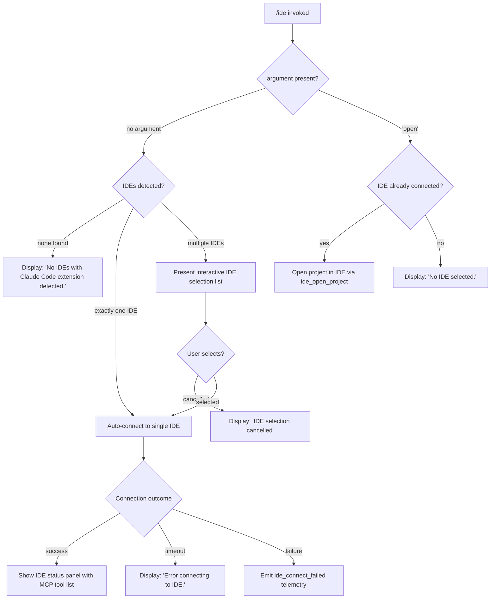

# `/ide`

> Analysis basis: CC v2.1.197 bundle.js (AST extraction + Claude interpretation)
> Minimum version: v2.1.197

---

## Overview

The `/ide` command manages IDE integrations within Claude Code, allowing users to view the status of detected IDEs, connect to an IDE extension, open the current project in an IDE, or select among multiple detected IDEs. It operates as a `local-jsx` command that renders an interactive React-based UI panel and drives a daemon-backed MCP channel to establish the IDE–Claude Code link.

---

## Registration

| Field | Value |
|---|---|
| type | `local-jsx` |
| name | `ide` |
| description | `Manage IDE integrations and show status` |
| argumentHint | `[open]` |
| module_id | `j9l` |
| load_inline | `true` |
| loc_byte | `11967908` |
| loc_byte_end | `11968064` |
| loc_line | `7639` |
| arbor_handler.name | `E3f` |
| arbor_handler.fqn | `claude-2.1.197::E3f` |
| arbor_handler.kind | `AsyncFunction` |
| arbor_handler.resolution_path | `module_id` |
| arbor_handler.n_hits | `0` |

Analysis basis: CC v2.1.197 bundle.js:+11967908

---

## Input Branching

The command has five distinct major branches driven by the argument string and detected IDE state.



Analysis basis: CC v2.1.197 bundle.js:+11964103, +11964211, +11964318, +11964440, +11965035, +11966447

---

## Behavioral Spec

### Main Handler (`E3f`)

The Arbor-resolved async handler `E3f` is the entry point.

```
async function ideCommandHandler(context, args):
    emit telemetry("tengu_ext_ide_command")          // +11964105

    argument = args.trim()

    if argument == "open":                           // +11964211
        connectedIde = getConnectedIDE(context)
        if connectedIde is null:
            render("No IDE selected.")               // +11964440
            return

        worktreeOrProjectPath = resolveCurrentPath(context)
        try:
            emit telemetry("ide_open_project")       // +11964638
            openInIDE(connectedIde, worktreeOrProjectPath)
        catch error:
            emit telemetry("ide_open_project_failed")// +11964745
            render("Exited without opening IDE")     // +11965035
        return

    detectedIDEs = detectInstalledIDEs(context)     // calls c3n / detectIDEsFunction

    if detectedIDEs is empty:
        render("No IDEs with Claude Code extension detected.")  // +11964320
        return

    if detectedIDEs.length == 1:
        selectedIDE = detectedIDEs[0]
    else:
        selectedIDE = await presentIDESelectionUI(detectedIDEs)
        if selectedIDE is null:
            render("IDE selection cancelled")        // +11967274
            return

    render(<IDEConnectionComponent ide=selectedIDE />) // mounts W9l
```

Analysis basis: CC v2.1.197 bundle.js:+11964103

---

### IDE Detection (`c3n` / detectIDEsFunction)

Scans the system for running IDEs with the Claude Code extension installed.

```
async function detectIDEsFunction(context):
    port = parseInt(getConfiguredPort(context))    // +6876108
    instances = await discoverIDEInstances()       // calls a3n
    results = await Promise.all(
        instances.map(inst => probeIDEInstance(inst)) // calls j0p
    )
    filteredResults = results.filter(isValid)

    for each result in filteredResults:
        ideType = classifyIDEType(result)          // calls Rx
        if ideType.startsWith("jetbrains"):        // +6876828
            // JetBrains-specific normalisation path
            normalizedName = normalizeName(result)
        elif ideType contains "cursor", "windsurf", etc.:
            normalizedName = mapToKnownIDEName(ideType)

    emit telemetry("ide_detect")                   // +6877463
    // on failure:
    // emit telemetry("ide_detect_failed")         // +6877527
    return filteredResults
```

Analysis basis: CC v2.1.197 bundle.js:+6876108, +6876197, +6877463, +6877527

---

### IDE Instance Discovery (`a3n` / discoverIDEInstancesFunction)

Scans the user's home directory for Claude Code IDE socket or lock files.

```
async function discoverIDEInstancesFunction():
    homedir = os.homedir()                          // fRa.homedir, +6873893
    ideDir = path.join(homedir, ".claude", "ide")  // +6873907
    entries = await scanDirectory(ideDir)           // calls q0p

    instances = []
    for each entry in entries:
        if entry is directory or symlink:
            lockFile = path.join(entry.path, "*.lock")  // +6872687
            if lockFile exists:
                instances.push(parseInstance(lockFile))
    return instances
```

Analysis basis: CC v2.1.197 bundle.js:+6872577, +6873893, +6873907, +6872687

---

### IDE Type Classification (`Rx` / classifyIDETypeFunction)

Maps a raw process name or path to a canonical IDE identifier string.

```
function classifyIDETypeFunction(rawName):
    lower = rawName.toLowerCase()                   // +6881768
    base  = path.basename(rawName)                  // +6881826

    // Ordered checks (literals from bundle)
    if lower includes "windsurf":   return "windsurf"   // +6878974
    if lower includes "devin":      return "devin"      // +6878998
    if lower includes "cursor":     return "cursor"     // +6879038
    if lower includes "insiders":   return "insiders"   // +6879078
    if lower includes "vscode"
       or "vs code"
       or "visual studio code":     return "vscode"     // +6879103, +6879125, +6879148
    if lower includes "vscodium"
       or "code - oss"
       or "codium":                 return "vscodium"   // +6879182, +6879206, +6879425
    if lower includes "jetbrains"
       or "appcode" etc.:           return "jetbrains"  // +6872288, +6881262
    return "IDE"                                        // +6881713
```

Analysis basis: CC v2.1.197 bundle.js:+6881768, +6879103

---

### Linux Process-Based IDE Detection (`ekp` / linuxIDEDetectFunction)

On Linux, supplements filesystem scanning with a process-list grep.

```
function linuxIDEDetectFunction():
    // Runs shell command (literal from bundle):
    // "ps aux | grep -E \"code|cursor|windsurf|...\" | grep -v grep"
    // (+6880874)
    output = execShell(PS_AUX_GREP_COMMAND)
    entries = output.split("\n")
    for each entry in entries:
        ide = classifyIDETypeFunction(entry)
        if ide is known:
            results.push(ide)
    return results
```

Analysis basis: CC v2.1.197 bundle.js:+6880874, +6880848

---

### IDE Connection UI Component (`W9l` / IDEConnectionComponent)

A React component that manages the connection lifecycle after an IDE is selected.

```
function IDEConnectionComponent({ ide }):
    [status, setStatus] = useState("pending")      // +11966091

    appState  = useAppState()
    setAppState = useSetAppState()

    useEffect():
        setStatus("pending")
        try:
            result = await connectToIDE(ide)       // calls xT / connectFunction
            if result.success:
                emit("ide_connect")                // +11966135
                setStatus("connected")
            else:
                emit("ide_connect_failed")         // +11966222
                setStatus("failed")
        catch TimeoutError:
            emit("ide_connect_timeout")            // +11966329
            setStatus("error")
            render("Error connecting to IDE.")     // +11966447

    useCallback for disconnect:
        emit("ide_disconnect")                     // +11966828

    // Render logic
    if status == "pending":
        render(<Spinner text={"Connecting to " + ide.name} />)  // +11967157
    elif status == "connected":
        mcpTools = filterMCPTools(allTools, "mcp__ide__")       // +11966725
        render(<IDEStatusPanel tools=mcpTools ide=ide />)
    elif status == "failed" or "error":
        render(<ErrorMessage text={"Error connecting to IDE."} />)
```

Analysis basis: CC v2.1.197 bundle.js:+11965918, +11966091, +11966135, +11966329, +11967157

---

### IDE Connection Logic (`xT` / connectFunction)

Establishes an IPC/socket connection from Claude Code to the IDE extension daemon.

```
async function connectFunction(ide):
    connectionType = ide.url.startsWith("ws:") ? "ws-ide" : "sse-ide"
    // Literal channel names: "sse-ide" (+11962144), "ws-ide" (+11962164)

    mcpSkillsHash = computeMCPSkillsHash(ide)    // calls zMe / hashFunction
    emit telemetry("tengu_mcp_skills")            // +6838519

    server = await spawnOrClaimIDEServer(ide)    // calls MCP daemon machinery

    // Timeout: 5000 ms (+18030418) for claim handshake
    await sendClaimFrame(server)                 // calls b9m / buildClaimFrame
    return { success: true, server }
```

Analysis basis: CC v2.1.197 bundle.js:+11962144, +11962164, +6838519

---

### "Open in IDE" Sub-command

When argument is `"open"` (+11964211), the handler calls the IDE-open integration.

```
async function openProjectInIDE(ide, projectPath):
    // Emits ide_open_project / ide_open_project_failed
    // Determines whether path is a git worktree or plain project:
    //   context "worktree" (+11964672) vs "project" (+11964683)
    ideExePath = resolveIDEExecutable(ide)        // calls u3n
    await spawnIDEProcess(ideExePath, [projectPath])
```

Analysis basis: CC v2.1.197 bundle.js:+11964638, +11964672, +11964683, +11964745

---

### WSL Path Normalisation (`z2o` / wslPathNormFunction)

Normalises Windows/WSL paths passed from the IDE to POSIX equivalents.

```
function wslPathNormFunction(rawPath):
    // Strips leading separators using e.slice logic (+11967393)
    // Applies Unicode NFC normalisation ("NFC", +11967491)
    // Replaces Windows drive prefix "/mnt/c/Users" (+6874114)
    // Pads display strings to width 40 (+18067388)
    // Truncates list display with ", …" suffix (+11967662)
    // Maximum display items: 100 (+11967350)
    return normalizedPath
```

Analysis basis: CC v2.1.197 bundle.js:+11967350, +11967393, +11967491, +11967662

---

## State & Side Effects

| Item | Detail |
|---|---|
| Telemetry: `tengu_ext_ide_command` | Fired at handler entry for every `/ide` invocation (bundle.js:+11964105) |
| Telemetry: `tengu_feature_ok` | Fired on successful feature gate check (bundle.js:+1028779) |
| Telemetry: `tengu_feature_bad` | Fired on failed feature gate check (bundle.js:+1028846) |
| Telemetry: `tengu_feature_sad` | Fired on degraded feature gate result (bundle.js:+1028927) |
| Telemetry: `tengu_daemon_control` | Fired when daemon start/stop is triggered (bundle.js:+18076516) |
| Telemetry: `tengu_mcp_skills` | Fired when MCP skill hash is computed during IDE connection (bundle.js:+6838519) |
| Telemetry: `tengu_bg_spare_claim` | Background spare worker claim attempt (bundle.js:+18038273) |
| Telemetry: `tengu_bg_spare_claim_fail` | Background spare worker claim failure (bundle.js:+18038539) |
| Telemetry: `tengu_bg_sendclaim_failed` | Claim frame send failure (bundle.js:+18029984) |
| Telemetry: `tengu_bg_handoff_settle` | Background session handoff settled (bundle.js:+18044131) |
| Telemetry: `tengu_bg_dispatch_sigkill_escalate` | SIGKILL escalation during bg worker shutdown (bundle.js:+18036865) |
| Telemetry: `tengu_bg_low_mem_mb` | Low memory detected in background (bundle.js:+13423445) |
| Telemetry: `tengu_bg_dispatch_low_mem` | Low-memory worker dispatch event (bundle.js:+18037455) |
| Telemetry: `tengu_bg_retire_pinned_low_mem` | Pinned workers retired under low memory (bundle.js:+18042075) |
| Telemetry: `tengu_bg_prewarm_per_sweep` | Background prewarm sweep count (bundle.js:+18042200) |
| Telemetry: `tengu_bg_spare_enable` | Background spare worker enabled (bundle.js:+18038145) |
| Telemetry: `tengu_bg_state_read_transient` | Transient state file read in background daemon (bundle.js:+4337098) |
| Telemetry: `tengu_daemon_config_reload` | Daemon config reloaded (bundle.js:+18054237) |
| Telemetry: `tengu_daemon_idle_exit` | Daemon exited due to idle timeout (bundle.js:+18059708) |
| Telemetry: `tengu_daemon_yield` | Daemon yielded to foreground session (bundle.js:+18058666) |
| String events (non-`tengu_`): `ide_detect`, `ide_detect_failed` | Inline string literals used as event labels in IDE detection (bundle.js:+6877463, +6877527) |
| String events: `ide_connect`, `ide_connect_failed`, `ide_connect_timeout`, `ide_disconnect`, `ide_open_project`, `ide_open_project_failed` | Lifecycle events for IDE connection UI (bundle.js:+11966135, +11966222, +11966329, +11966828, +11964638, +11964745) |
| appState changes | Connection status written via `setAppState`; MCP tool list filtered on `"mcp__ide__"` prefix (bundle.js:+11966725) |
| Hook registration | `useEffect` in `W9l` sets up connection attempt on mount; `useCallback` registers disconnect handler |
| File system | Reads `~/.claude/ide/` directory for lock files; reads/writes `state.json` (+18044442); reads `pins.json` (+4338399) for pinned workers |
| IPC socket | Connects to IDE extension via Unix socket or WebSocket (`"sse-ide"` / `"ws-ide"`); sends claim frame with 5000 ms timeout (+18030418) |
| Process management | May spawn or claim a daemon background worker; sends SIGTERM (+18030222) / SIGKILL (+18036913) during shutdown |
| Daemon stop events | `"daemon_stop"` (+18076441), `"daemon_stop_failed"` (+18076478) string literals used in daemon control |

---

## Version History

| Version | Change |
|---|---|
| v2.1.197 | Initial analysis |

---

## Common Mistakes

1. **Invoking `/ide open` before connecting**: If no IDE has been connected yet, the command immediately returns `"No IDE selected."` without attempting detection or connection. Run `/ide` first (without arguments) to establish a connection.
2. **No IDE extension installed**: If no supported IDE with the Claude Code extension is running, the command reports `"No IDEs with Claude Code extension detected."` The extension must be installed and the IDE must be open.
3. **Connection timeout**: The IDE claim handshake has a 5000 ms timeout (bundle.js:+18030418). If the IDE extension is slow to respond (e.g., just launched), retrying after a moment may succeed.
4. **WSL path confusion**: On WSL, paths beginning with `/mnt/c/Users` are subject to automatic normalisation (bundle.js:+6874114). Passing Windows-style paths manually is unnecessary and may produce unexpected results.
5. **Multiple IDEs without selection**: When several IDEs are detected, an interactive selection prompt appears. Pressing the cancel key dismisses the command with `"IDE selection cancelled"` without connecting.
6. **Expecting JetBrains and VS Code families to behave identically**: JetBrains IDEs follow a separate normalisation branch (bundle.js:+6876828) and may require the IDE to be restarted after extension installation (literal: `"restart your IDE"`, bundle.js:+11965304).

---

## Appendix — Identifier Mapping

> For bundle debugging only. Identifiers change across versions.

| Identifier | Role |
|---|---|
| `E3f` | Main async handler for `/ide` command (Arbor-resolved, fqn: `claude-2.1.197::E3f`) |
| `W9l` | React component: IDE connection UI (renders pending/connected/error states) |
| `c3n` | IDE detection orchestrator (scans instances, probes ports, classifies IDEs) |
| `a3n` | IDE instance discovery (scans `~/.claude/ide/` for lock files) |
| `q0p` | Directory scanner for IDE socket/lock files |
| `j0p` | IDE instance prober (checks individual candidate) |
| `Y9r` | IDE instance metadata parser |
| `Gr` | Shell command executor (execFileNoThrow wrapper) |
| `Rx` | IDE type classifier (maps process names to canonical IDE identifiers) |
| `HRa` | IDE name includes-check helper (windsurf/devin/cursor/vscode matching) |
| `u3n` | IDE executable resolver (basename normalisation for `.cmd` on Windows) |
| `ekp` | Linux process-list IDE detector (ps aux grep parser) |
| `ymo` | IDE detection entry for current OS (dispatches to `ekp`) |
| `z2o` | WSL/Windows path normalisation function |
| `xT` | IDE connection orchestrator (MCP channel setup, hash, claim) |
| `yje` | MCP update applicator |
| `zMe` | MCP skill hash function (SHA-256 over tool schema) |
| `Kw` | MCP skills telemetry emitter |
| `Tns` | IDE socket claim sender (connects socket, writes claim frame, handles timeout) |
| `b9m` | Claim frame builder |
| `nM` | Binary frame serialiser (Buffer utilities for IPC protocol) |
| `Lns` | Background daemon session lifecycle manager |
| `Yi` | Worker state file reader/writer (`state.json`) |
| `zh` | Worker status resolver ("active", "crashed", "blocked", etc.) |
| `wke` | Roster entry parser for daemon workers |
| `Jd` | Worker roster entry constructor |
| `RAt` | Worker result handler (timing, error classification) |
| `bXt` | Worker directory path helper |
| `_Te` | Worker state path helper |
| `sM` | Worker late-result handler |
| `yk` | Worker error-result handler |
| `nP` | Worker late-error handler |
| `xZ` | Worker state reader |
| `AXt` | Worker directory mkdir helper |
| `mc` | Worker socket path helper |
| `br` | Roster entry validator (nonconforming check) |
| `doc` | Heartbeat/keepalive document emitter |
| `h` | Background session watch loop (main orchestration for daemon sessions) |
| `j` | Background worker process kill helper |
| `d` | Background supervisor worker runner |
| `O` | Background session sweep function (memory checks, retire/respawn) |
| `R` | Scheduled task file watcher and interval manager |
| `N6e` | Pins file reader (`pins.json`) |
| `FQd` | Pins directory scanner |
| `pBt` | Pins file path constructor |
| `Gt` | JSON safe-parser |
| `Sn` | Error logger for filesystem operations |
| `CYe` | Low-memory checker (reads free memory, platform-specific) |
| `Frm` | macOS memory info via bun:ffi / libSystem |
| `Nrm` | Background task memory reporter |
| `it` | MCP connection tracker (sets, maps for active connections) |
| `akn` | MCP connection deduplication helper |
| `Dt` | MCP connection state machine |
| `P6` | MCP connection dispatcher |
| `Y` | MCP server manager (retireIfSettled, respawnIfIdleStale) |
| `E` | MCP server connection attempt handler |
| `Shr` | MCP connection result applier (applyConnectionResult) |
| `Sje` | MCP state change notifier |
| `q` | MCP server allow/deny policy evaluator |
| `W` | MCP server event subscriber |
| `K` | MCP keyboard input handler (backspace/preventDefault) |
| `Pn` | Shell executor wrapper (Gr + Ot) |
| `Ot` | Async shell runner |
| `nmn` | Async context store accessor |
| `l7` | Async local storage get helper |
| `dr` | Shell command error formatter |
| `H0` | Error message builder |
| `LBe` | Shell execution core (spawn, timeout, output capture) |
| `ow` | Shell execution entry for IDE commands |
| `ekp` | IDE process-list scanner (Linux ps aux) |
| `L8` | Path normaliser (Windows `\` → `/`, platform "windows" label) |
| `vs` | Process forced-shutdown handler (sends "cli_error", calls process.exit) |
| `p` | IPC connection normaliser |
| `rI` | IPC forced-shutdown initiator |
| `u` | Daemon startup / IPC connect orchestrator |
| `xe` | Feature flag checker (ok path) |
| `V` | Feature flag core evaluator |
| `Oe` | Feature flag error path |
| `Re` | Feature flag bad path |
| `wt` | Feature flag sad path |
| `$F` | Daemon first-party start helper |
| `D6` | Daemon config builder |
| `z7r` | Daemon spawn entry (randomUUID, emit) |
| `u5e` | Daemon first-party loader |
| `Wj` | Daemon shutdown/race handler (Promise.race for shutdown sequence) |
| `sye` | Daemon shutdown initiator |
| `mye` | Shutdown timeout clearer |
| `On` | Abort-with-timeout helper |
| `$m` | App state accessor in handler |
| `Pge` | Spend/billing error handler (spend.blocked, billing_error) |
| `_Ra` | IDE name replacement helper ("Devin Desktop" normalisation) |
| `IRa` | IDE instance filter helper |
| `mRa` | Process.kill wrapper |
| `H` | Kill-all-workers helper |
| `lx` | First-party module loader |
| `K3` | Daemon config key builder |
| `D6` | Daemon config object constructor |
| `tkn` | Daemon token generator |
| `eit` | Daemon emit helper |
| `w6` | Daemon worker event emitter |
| `LNu` | Log rotation helper (shift/push on bounded queue) |
| `zi` | Queue traffic classifier ("essential-traffic") |
| `At` | App state getter hook |
| `peo` | App state context provider checker |
| `To` | App state setter hook |
| `Pd` | Theme/context provider hook |
| `m` | Command filter (filters MCP tools by prefix) |
| `e_r` | Path prefix stripper for MCP tool names |
| `AXo` | Scheduled task file writer |
| `grn` | Scheduled task cleanup handler |
| `GEe` | Scheduled task path helper |
| `D` | Daemon yield writer |
| `I` | Scroll/input event handler (Math.max/floor) |
| `g` | Generic renderer helper |
| `z` | Disposable connection wrapper |
| `Etn` | Connection dispose helper |
| `yn` | Background session label ("background session") |
| `c` | Background session type resolver |
| `Rqo` | Claim directory / file writer |
| `T9m` | Claim timeout handler |
| `I9m` | Claim timeout error constructor |
| `ld` | Log/debug helper |
| `Sqo` | Timeout clear helper |
| `Fdm` | MCP connection state persister |
| `lIt` | MCP idle timer |
| `dqo` | MCP dispatch queue |
| `w0` | MCP work processor |
| `qt` | Filesystem stat helper |
| `T` | Structured log emitter |
| `he` | String coercion helper |
| `rn` | Filesystem error classifier (ENOENT, EACCES, EPERM, etc.) |
| `ke` | Error-with-context wrapper |
| `er` | Error string builder |
| `ct` | String converter |
| `yi` | String index/slice utility |
| `Me` | JSON stringify wrapper |
| `Ks` | Heartbeat timestamp recorder |
| `_Zt` | Heartbeat state helper |
| `ene` | Heartbeat emitter |
| `hoe` | IDE extension install prompt helper |
| `m3f` | IDE status list renderer |
| `i3n` | IDE status detail component |
| `zo` | Filesystem walk error filter |