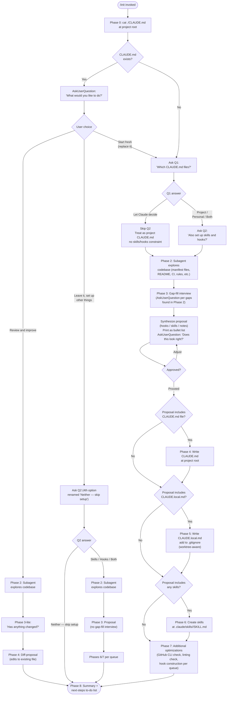

# `/init`

> Analysis basis: CC v2.1.193 bundle.js (AST extraction + Claude interpretation)
> Minimum version: v2.1.193

---

## Overview

The `/init` command bootstraps Claude Code configuration for a repository by creating and/or improving `CLAUDE.md` file(s), optional skills (`.claude/skills/`), and optional hooks (`.claude/settings.json`). It operates as a multi-phase interactive wizard: it explores the codebase using a subagent, interviews the user with `AskUserQuestion`, proposes a set of artifacts, and then writes only what the user approves. The prompt body is a two-branch conditional (~22 KB total) that selects a full-featured template (~20,920 chars) or a legacy fallback template (~1,592 chars) based on runtime context.

---

## Registration

| Field | Value |
|---|---|
| type | `prompt` |
| name | `init` |
| description | `Initialize new CLAUDE.md file(s) and optional skills/hooks with codebase documentation \| Initialize a new CLAUDE.md file with codebase documentation` |
| loc_byte | `11822233` |
| loc_byte_end | `11822626` |
| loc_line | `7674` |
| handler_method | `getPromptForCommand` |
| handler_method_start | `11822549` |
| handler_method_end | `11822625` |
| prompt_body.length | `22519` characters |
| prompt_body.trace | `conditional; identifier→NSf (var template, 20920 chars); identifier→OSf (var template, 1592 chars)` |
| arbor_handler.name | `getPromptForCommand` |
| arbor_handler.fqn | `claude-2.1.193::getPromptForCommand` |
| arbor_handler.kind | `Method` |
| arbor_handler.resolution_path | `direct` |
| arbor_handler.n_hits | `2` |

Analysis basis: CC v2.1.193 bundle.js:+11822233

---

## Input Branching

The command has well over three distinct execution paths determined by: (a) whether `CLAUDE.md` already exists, (b) the user's Q1 answer, (c) the user's Q2 answer, and (d) the "Review and improve" vs. "Start fresh" vs. "Leave it" option. A Mermaid flowchart is required.



---

## Behavioral Spec

### Handler Dispatch and Prompt Selection

The `getPromptForCommand` method (Arbor-resolved, `direct` path, `n_hits=2`) is called inline on the registration object at invocation time. It selects between two prompt body templates at runtime:

```
function getPromptForCommand(context):
    if fullFeaturedCondition(context):
        return fullTemplate   # ~20,920 chars (NSf)
    else:
        return legacyTemplate # ~1,592 chars  (OSf)
```

The returned text is typed as `"text"` (literal found at bundle.js:+11822597) and dispatched to the agent.

Analysis basis: CC v2.1.193 bundle.js:+11822549

---

### Phase 0 — CLAUDE.md Existence Check

Before presenting any questions, the agent issues a `cat ./CLAUDE.md` shell command limited to the project root. Only the project-root file is considered; the directory tree is not traversed at this stage. The result gates Phase 1 branching.

```
function checkExistingClaudeMd():
    result = shell("cat ./CLAUDE.md")
    if result.exitCode == 0:
        return EXISTS
    else:
        return ABSENT
```

Analysis basis: CC v2.1.193 bundle.js:+11822233 (prompt_body Phase 0 section)

---

### Phase 1 — Interactive Scope Selection

The agent prints a terminology primer (covering CLAUDE.md, skills, and hooks) as plain assistant text before the first `AskUserQuestion` call. The primer is printed once regardless of branch.

**Branch A — CLAUDE.md exists:**

```
function askExistingClaudeMdOptions():
    return AskUserQuestion(
        question: "I found an existing CLAUDE.md. What would you like to do?",
        options: [
            "Review and improve it",
            "Leave it, set up other things",
            "Start fresh (replace it)"
        ]
    )

routing:
    "Review and improve" → Phase 2 → Phase 3-lite → Phase 4 (diff) → Phase 8
    "Leave it"           → Ask Q2 (option 4 renamed) → Phase 2/3 proposal → Phases 6/7 → Phase 8
    "Start fresh"        → Fall through to Q1 (treat as ABSENT)
```

**Branch B — CLAUDE.md absent (or "Start fresh"):**

```
function askQ1():
    # Called alone; Q2 must NOT be included in the same call
    return AskUserQuestion(
        question: "Which CLAUDE.md files should /init set up?",
        options: [
            "Project CLAUDE.md",
            "Personal CLAUDE.local.md",
            "Both project + personal",
            "Let Claude decide"
        ]
    )

if Q1answer == "Let Claude decide":
    skip Q2
    treat as: project CLAUDE.md, unconstrained skills/hooks
else:
    askQ2()

function askQ2():
    return AskUserQuestion(
        question: "Also set up skills and hooks?",
        options: [
            "Skills + hooks",
            "Skills only",
            "Hooks only",
            "Neither, just CLAUDE.md"
        ]
    )
    # Q2 is a hint, not a hard filter; Phase 3 may deviate and explains why
```

Analysis basis: CC v2.1.193 bundle.js:+11822233 (prompt_body Phase 1 section)

---

### Phase 2 — Codebase Exploration (Subagent)

A subagent is launched to survey the repository. It reads manifest files (`package.json`, `Cargo.toml`, `pyproject.toml`, `go.mod`, `pom.xml`, etc.), `README`, build/CI configs, existing `.claude/rules/`, `AGENTS.md`, `.cursor/rules`, `.cursorrules`, `.github/copilot-instructions.md`, `.devin/rules/`, `.windsurf/rules/`, `.windsurfrules`, `.clinerules`, and `.mcp.json`.

The subagent collects:
- Build, test, and lint commands (especially non-standard ones)
- Languages, frameworks, and package manager
- Project structure type (monorepo, multi-module, single project)
- Code-style rules that diverge from language defaults
- Non-obvious gotchas, required environment variables, or workflow quirks
- Existing `.claude/skills/` and `.claude/rules/` contents
- Formatter configuration details
- Git worktree count (via `git worktree list`, relevant for `CLAUDE.local.md`)

Items the subagent cannot resolve become interview questions in Phase 3.

Analysis basis: CC v2.1.193 bundle.js:+11822233 (prompt_body Phase 2 section)

---

### Phase 3 — Gap-Fill Interview and Proposal Synthesis

```
function gapFillInterview(q1Choice, phase2Findings):
    gaps = phase2Findings.unresolvable

    if q1Choice in [PROJECT, BOTH, LET_CLAUDE_DECIDE]:
        ask about: non-obvious commands, gotchas, branch/PR conventions,
                   required env setup, testing quirks
        # Do NOT mark options as "recommended"

    if q1Choice in [PERSONAL, BOTH]:
        ask about: user's role, familiarity with codebase,
                   sandbox URLs/test accounts/API key paths,
                   communication preferences,
                   worktree topology (if multiple worktrees found)
        # Do NOT mark options as "recommended"

    if mode == REVIEW_AND_IMPROVE:
        ask single question:
            "Has anything changed about how the team works
             since this CLAUDE.md was written?"
        options: ["No, nothing's changed", "Yes — let me describe"]
        if "Yes": collect free-text description
        then skip to Phase 4

function synthesizeProposal(phase2Findings, gapAnswers, q2Hint):
    artifacts = []

    for each finding in [phase2Findings + gapAnswers]:
        if isDeterministicFastShellCommand(finding):
            artifacts.append(Hook(finding))
        elif isOnDemandMultiStepWorkflow(finding):
            artifacts.append(Skill(finding))
        else:
            artifacts.append(ClaudeMdNote(finding))

    if proposal deviates from q2Hint:
        prepend one-line explanation to proposal output

    # Include CLAUDE.md file bullet(s) first per Q1 choice
    printProposalAsBulletList(artifacts)

    userDecision = AskUserQuestion(
        question: "Does this look right?",
        options: ["Looks good — proceed", "Drop the hook", "Drop the skill", ...]
        # "Other" is auto-added by the tool
    )
    return buildPreferenceQueue(approvedArtifacts)
```

Analysis basis: CC v2.1.193 bundle.js:+11822233 (prompt_body Phase 3 section)

---

### Phase 4 — Write CLAUDE.md

```
function writeClaudeMd(mode, phase2Findings, preferenceQueue):
    if mode == REVIEW_AND_IMPROVE:
        existingContent = readFile("./CLAUDE.md")
        diffs = computeTargetedDiffs(existingContent, phase2Findings, gapFillAnswer)
        printDiffsWithReasons(diffs)
        decision = AskUserQuestion(
            "Apply these edits?",
            options: ["Apply all", "Let me pick which", "Skip — leave it as is"]
        )
        if decision != SKIP:
            applyApprovedDiffs()
        return

    content = buildMinimalClaudeMd(phase2Findings, preferenceQueue)
    # Every line must pass: "Would removing this cause Claude to make mistakes?"
    # Consume 'note' entries from queue targeted at CLAUDE.md (team-level notes)

    content.include:
        - prefix header (mandatory)
        - non-obvious build/test/lint commands
        - code-style rules that DIFFER from language defaults
        - testing quirks and single-test invocation patterns
        - repo etiquette (branch naming, PR conventions, commit style)
        - required env vars or setup steps
        - non-obvious gotchas or architectural decisions
        - content from existing AI tool configs (AGENTS.md, .cursor/rules, etc.)

    content.exclude:
        - file-by-file directory listings
        - standard language conventions
        - generic advice
        - detailed API docs (use @path/to/import instead)
        - frequently-changing info (use @path/to/import)
        - long tutorials (move to separate file + @import, or a skill)
        - commands obvious from manifest files

    writeFile("./CLAUDE.md", content)

    if projectHasMultipleConcerns:
        suggestClaudeRulesDirectory()   # .claude/rules/
    if projectIsMonorepoOrMultiModule:
        offerSubdirectoryCLAUDEMdFiles()
```

The mandatory file prefix begins with `# CLAUDE.md` followed by the standard guidance attribution line.

Analysis basis: CC v2.1.193 bundle.js:+11822233 (prompt_body Phase 4 section)

---

### Phase 5 — Write CLAUDE.local.md

```
function writeClaudeLocalMd(phase2Findings, preferenceQueue, worktreeTopology):
    if fileExists("./CLAUDE.local.md"):
        # Read, propose additions only — do NOT silently overwrite
        proposeAdditions()
        return

    # Consume 'note' entries from queue targeted at CLAUDE.local.md

    if worktreeTopology == SIBLING_OR_EXTERNAL:
        # Upward walk won't find a single CLAUDE.local.md across worktrees
        writeFile(
            "~/.claude/<project-name>-instructions.md",
            personalContent
        )
        stub = "@~/.claude/<project-name>-instructions.md"
        writeFile("./CLAUDE.local.md", stub)
        # NOTE: Never place this import in the project CLAUDE.md
    else:
        # Nested worktrees: upward walk finds main repo file automatically
        writeFile("./CLAUDE.local.md", personalContent)

    addToGitignore("CLAUDE.local.md")
```

Analysis basis: CC v2.1.193 bundle.js:+11822233 (prompt_body Phase 5 section)

---

### Phase 6 — Create Skills

```
function createSkills(preferenceQueue, phase2Findings):
    # Step 1: Consume queued skill preferences
    for skillPref in preferenceQueue.filter(type == SKILL):
        name = deriveNameFromPreference(skillPref)
        body = buildSkillBody(skillPref, phase2Findings)

        if skillPref.mapsToExistingBundledSkill():
            # Additive: write project skill layered on top
            informUser("Bundled skill still exists; yours is additive.")

        if skillPref.isUnderspecified():
            AskUserQuestion("Which command should <name> run?")

        writeSkillFile(
            path: ".claude/skills/<name>/SKILL.md",
            frontmatter: {name, description},
            body: body
        )

    # Step 2: Suggest additional skills from Phase 2 findings
    for candidate in phase2Findings.repeatableWorkflows:
        if not existsIn(".claude/skills/"):
            proposeSkill(name, purpose, repoSpecificReason)

    # Skill file format:
    # ---
    # name: <skill-name>
    # description: <what and when>
    # ---
    # <Instructions for Claude>
    #
    # For side-effect workflows: add disable-model-invocation: true
    # and use $ARGUMENTS for user-supplied input
```

Analysis basis: CC v2.1.193 bundle.js:+11822233 (prompt_body Phase 6 section)

---

### Phase 7 — Additional Optimizations

```
function suggestAdditionalOptimizations(preferenceQueue, phase2Findings, q1Choice):
    # GitHub CLI check
    ghPresent = shell("which gh")   # "where gh" on Windows
    if not ghPresent AND projectUsesGitHub(phase2Findings):
        AskUserQuestion("Install GitHub CLI?")
        # Explains: enables commit/PR/issue/review assistance

    # Linting check
    if phase2Findings.noLintConfigFound():
        AskUserQuestion("Set up linting for this codebase?")
        # Explains: early error detection + Claude self-correction feedback

    # Hooks from preference queue
    for hookPref in preferenceQueue.filter(type == HOOK):
        targetFile = resolveHookTarget(q1Choice, hookPref)
        # project  → .claude/settings.json  (team-shared, committed)
        # personal → .claude/settings.local.json
        # Only ask if q1Choice == BOTH or preference is ambiguous
        # Ask once for all hooks, not per-hook

        event, matcher = mapPreferenceToEventMatcher(hookPref)
        # "after every edit"              → PostToolUse / Write|Edit
        # "when Claude finishes"          → Stop
        # "before running bash"           → PreToolUse / Bash
        # "before committing" (git-commit)→ NOT a hooks.json hook;
        #                                   route to git pre-commit hook instead
        #                                   (probe "before I review" vs literal gate)

        if isFirstHookThisRun:
            # Load hook reference ONCE:
            invokeSkillTool(
                skill: "update-config",
                args: "[hooks-only] " + oneLineSummary
            )

        # Follow "Constructing a Hook" flow:
        # dedup → construct → pipe-test raw → wrap →
        # write JSON → jq -e validate → live-proof → cleanup → handoff

    if phase2Findings.formatterFound AND preferenceQueue.noFormattingHook():
        offerFormatOnEditHookAsFallback()

    # Act on each "yes" before proceeding to Phase 8
```

Analysis basis: CC v2.1.193 bundle.js:+11822233 (prompt_body Phase 7 section)

---

### Phase 8 — Summary and Next Steps

```
function summarizeAndSuggestNextSteps(allWrittenArtifacts, phase2Findings):
    recapWrittenFiles(allWrittenArtifacts)
    remindUser("These are a starting point — review, tweak, and re-run /init anytime.")

    todoList = []

    if frontendFrameworkDetected(phase2Findings):
        todoList.append("/plugin install frontend-design@claude-plugins-official")
        todoList.append("/plugin install playwright@claude-plugins-official")

    if phase7GapsRefused():
        todoList.append(missingGitHubCLINote)
        todoList.append(missingLintingNote)

    if phase2Findings.testsMissingOrSparse():
        todoList.append("Set up a test framework")

    # Always include:
    todoList.append("/plugin install skill-creator@claude-plugins-official")
    todoList.append("Browse plugins with /plugin")

    sortByImpact(todoList)
    printAsFormattedList(todoList)
```

Analysis basis: CC v2.1.193 bundle.js:+11822233 (prompt_body Phase 8 section)

---

### Config Persistence Sub-System

The call graph reveals a layered config-write system invoked during hook and settings persistence. Key behaviors observed in the traversal:

```
function saveConfigWithLock(configPath, newData, cachedConfig):
    acquireLock(configPath)
    # Lock contention warning threshold: 100 ms
    # (bundle.js:+13973556)

    reread = parseConfigFile(configPath)

    if reread has parse error:
        # Auto-repair from cached config under lock
        # Emits: tengu_config_auto_repaired
        repairFromCache(cachedConfig)

    if reread is missing auth that cache has:
        # Refuse write to prevent wiping ~/.claude.json
        # Emits: tengu_config_auth_loss_prevented
        # See GH #3117
        abort()

    writeFileSyncAndFlush(configPath, newData)
    # Uses atomic temp-file → rename pattern
    # Backup rotation: keeps last 5 backups (bundle.js:+13974955)
    # Backup filename pattern: "<name>.backup.<timestamp>"
    # Backup directory: "backups" subdirectory (bundle.js:+13975538)
    # Backup retention window: 60000 ms (bundle.js:+13974700)

    releaseLock()
```

The `CLAUDE.md` literal at bundle.js:+4137500 and the `"claudemd"` key at bundle.js:+4137659 are used in onboarding state tracking. The telemetry event `"onboarding_project_complete"` (bundle.js:+4138012) fires after the project config is saved, and `"save_project"` (bundle.js:+13978474) marks the individual save operation.

Analysis basis: CC v2.1.193 bundle.js:+13973562, +13974036, +13974342, +13974955, +13975538, +13974700

---

## State & Side Effects

| Item | Detail |
|---|---|
| Telemetry — `tengu_config_parse_error` | Emitted when config file fails to parse during a lock-protected re-read (bundle.js:+13977384) |
| Telemetry — `tengu_config_lock_contention` | Emitted when lock acquisition exceeds the expected threshold (bundle.js:+13973651) |
| Telemetry — `tengu_config_stale_write` | Emitted when a re-read reveals a stale write condition (bundle.js:+13973787) |
| Telemetry — `tengu_config_auto_repaired` | Emitted when the config is auto-repaired from cached state after a parse error under lock (bundle.js:+13974164) |
| Telemetry — `tengu_config_auth_loss_prevented` | Emitted when a write is refused to prevent wiping auth credentials; see GH #3117 (bundle.js:+13974494) |
| Telemetry — `tengu_config_fallback_write` | Emitted when a fallback write path is taken for the current project config (bundle.js:+13973267) |
| Telemetry — `tengu_feature_ok` | Emitted via the feature-flag check path (bundle.js:+1026754) |
| Telemetry — `tengu_slate_harbor_experiment` | Emitted during experiment resolution at handler invocation time (bundle.js:+11799124) |
| Files written | `./CLAUDE.md`, `./CLAUDE.local.md` (optional), `.claude/skills/<name>/SKILL.md` (optional), `.claude/settings.json` or `.claude/settings.local.json` (hooks, optional) |
| gitignore mutation | `CLAUDE.local.md` is added to `.gitignore` when Phase 5 runs |
| Config locking | Lock-protected atomic write with temp-file → `rename` pattern; backup rotation (max 5 backups, 60 000 ms window) |
| Backup side effects | Config backups written to `<configDir>/backups/` subdirectory with `.backup.<timestamp>` suffix |
| Onboarding state | `"claudemd"` key in project config updated; `"onboarding_project_complete"` event fires after write |
| Skill tool invocation | `update-config` skill invoked once per `/init` run before first hook is written (loads hook schema) |
| Experiment / feature flags | `tengu_slate_harbor_experiment` and the Growthbook experiment event (`"growthbook_experiment"`, bundle.js:+3335463) resolved at invocation |
| appState changes | Project config (`save_project` path) updated; onboarding completion flag set |
| Sound | <!-- TODO: not found in depth-2 traversal; needs --depth 4 --> |

---

## Version History

| Version | Change |
|---|---|
| v2.1.193 | Initial analysis — full 8-phase wizard with skills and hooks support; two-branch prompt template (full ~20,920 chars vs. legacy ~1,592 chars) |

---

## Common Mistakes

1. **Running `/init` expecting a silent, non-interactive operation.** The command is a multi-turn wizard using `AskUserQuestion` at every major decision point. It will not write any files without user approval of the synthesized proposal.

2. **Expecting Q2 to be a hard filter.** The Q2 answer ("Skills + hooks", "Skills only", etc.) is explicitly documented as a *hint*. Phase 3 proposes what fits the codebase and notes any deviation at the top of the proposal.

3. **Placing `@~/.claude/<project-name>-instructions.md` in the project `CLAUDE.md`.** This import belongs only in `CLAUDE.local.md`. Putting it in the shared project file would check a personal reference into version control.

4. **Interpreting "before committing" as a Claude hooks event.** Hook matchers cannot filter Bash commands by content, so there is no way to target only `git commit` via a `hooks.json` hook. `/init` routes this to a git pre-commit hook (`.git/hooks/pre-commit`, husky, or pre-commit framework) instead.

5. **Re-invoking the `update-config` skill for every hook.** The skill must be invoked exactly once per `/init` run (before the first hook). Subsequent hooks reuse the already-loaded schema context.

6. **Assuming a missing `CLAUDE.md` means a clean state for `CLAUDE.local.md`.** Phase 5 checks for an existing `CLAUDE.local.md` independently and proposes additions rather than overwriting silently.

7. **Treating the prompt body length as fixed.** The handler selects between two templates at runtime (~20,920 chars vs. ~1,592 chars). The shorter template (OSf) may be served in certain legacy or fallback contexts, resulting in a significantly reduced instruction set.

---

## Appendix — Identifier Mapping

> For bundle debugging only. Identifiers change across versions.

| Identifier | Role |
|---|---|
| `__handler_init` | Synthetic BFS entry point for the `/init` command handler (not a real bundle symbol) |
| `sst` | Top-level init session orchestrator; calls subagent exploration and onboarding completion |
| `mg` | File-watch / config-monitor setup function |
| `kt` | Config file reader with file-watching and deduplication logic |
| `jt` | Logging / debug output utility |
| `a9o` | Config path resolver |
| `bSt` | Config file parser with ENOENT handling and backup creation |
| `xjf` | File-watch registration and teardown handler |
| `a3i` | Onboarding state manager (reads/writes `claudemd` key in project config) |
| `MKr` | CLAUDE.md existence check and workspace state builder |
| `Pt` | Prompt template selector (chooses between NSf and OSf variants) |
| `Pps` | Prompt argument formatter / serializer |
| `WA` | Project config save orchestrator with lock and fallback logic |
| `dXt` | Lock-protected atomic config writer (temp-file → rename, backup rotation) |
| `t` | Generic config accessor / state container |
| `s` | Active-write-set tracker (add/delete with finally-cleanup) |
| `uXs` | Config object merger (`Object.assign`-based) |
| `T` | Log-level formatter and output router |
| `V` | Verbose/debug logger |
| `an` | Error classifier / normalizer |
| `TSt` | Stale-write detection helper |
| `n` | Case-normalizer (toLowerCase) |
| `ke` | JSON serializer (`JSON.stringify` wrapper) |
| `p9o` | Backup directory path builder |
| `v` | Filename prefix checker (`startsWith`) |
| `y` | String splitter for backup filename parsing |
| `I` | Scroll / range utility (Math.max, Math.floor) |
| `Qwt` | Atomic file writer with fsync, fchmod, and rename (writeFileSyncAndFlush) |
| `i` | Stream / handle lifecycle manager (open/close with finally) |
| `e` | Random-delay generator (Math.random + setTimeout) |
| `m1e` | Mid-save state snapshot helper |
| `cXt` | Timestamp accessor (Date.now wrapper) |
| `lXt` | Backup rotation orchestrator (calls bSt for per-file backup) |
| `Qor` | Current-project config save with auth-loss guard |
| `Oe` | Environment / platform detector |
| `we` | Feature-flag evaluator (emits `tengu_feature_ok`) |
| `PSf` | Experiment resolver / slate-harbor handler |
| `at` | String coercion utility |
| `it` | Growthbook experiment dispatcher (emits `tengu_slate_harbor_experiment`) |
| `KPt` | Experiment cache reader |
| `zPt` | Experiment cache writer |
| `H5` | Experiment bucketing helper |
| `h5` | Growthbook feature-flag evaluator |
| `lCn` | Experiment dedup guard (MGr set check) |
| `RGr` | Experiment event emitter (Nee.emit, randomUUID) |
| `UGr` | Full experiment run orchestrator (calls mg, kt for config access) |

---

*Note: index built via Arbor fallback; some signals (telemetry, literals) may be missing — see arbor-fallback.js.*