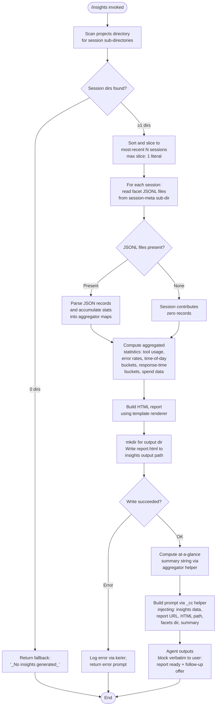

# `/insights`

> Analysis basis: CC v2.1.197 bundle.js (AST extraction + Claude interpretation)
> Minimum version: v2.1.197

---

## Overview

The `/insights` command generates a shareable HTML usage-analytics report by scanning the user's Claude Code session data, computing faceted statistics across those sessions, and then instructing the agent to confirm the report location to the user. The command's handler orchestrates data ingestion, statistical aggregation, HTML rendering, file writing, and finally constructs a prompt that the agent delivers verbatim to surface the report URL and invite follow-up questions.

---

## Registration

| Field | Value |
|---|---|
| type | `prompt` |
| name | `insights` |
| description | `Generate a report analyzing your Claude Code sessions` |
| loc_byte | `13599929` |
| loc_byte_end | `13601233` |
| loc_line | `10319` |
| handler_method | `getPromptForCommand` |
| handler_method_start | `13600103` |
| handler_method_end | `13601232` |
| prompt_body.length | `513` characters |
| prompt_body.trace | `call→_cc(...) (1 literals)` |
| arbor_handler.name | `getPromptForCommand` |
| arbor_handler.fqn | `claude-2.1.197::getPromptForCommand` |
| arbor_handler.kind | `Method` |
| arbor_handler.resolution_path | `direct` |
| arbor_handler.n_hits | `1` |

Analysis basis: CC v2.1.197 bundle.js:+13599929

---

## Input Branching

The command execution has more than three distinct internal paths (session-list truncation, facet loading, HTML report availability, empty-insights fallback), so a Mermaid flowchart is used below.



---

## Behavioral Spec

### 1. Session Discovery (`sessionDirectoryScanner`)

The handler calls the session directory scanner (identifier `Ism`) to enumerate sub-directories under the `projects` directory (literal `"projects"`, bundle.js:+5425852). It reads directory entries with `readdir`, filters for directory entries only via `isDirectory`, and sorts results (bundle.js:+13586462). A `setImmediate` yield (bundle.js:+13586438) is inserted during enumeration to avoid blocking the event loop on large session stores. Constants 10 and 9 at bundle.js:+13586408/+13586413 appear to govern batch-size bookkeeping during directory iteration. The scanner collects up to 50 entries before a hard cap of 200 is applied (literals `50` and `200`, bundle.js:+13586550/+13586555).

```
function sessionDirectoryScanner(baseDir):
    entries = readdir(join(baseDir, "projects"))
    dirs = entries.filter(e => e.isDirectory())
    // yield to event loop in batches during large scans
    sorted = dirs.sort()
    return sorted          // caller slices to recent N
```

Analysis basis: CC v2.1.197 bundle.js:+13586139

### 2. Facet File Loading (`facetFileLoader`)

For each session directory the handler calls `facetFileLoader` (identifier `VTt`). It reads the session sub-directory again with `readdir`, filters entries whose `isFile()` returns true, and further restricts to files whose extension matches `.jsonl` (literal `".jsonl"`, bundle.js:+13689812). File metadata is collected via `stat` calls resolved through `Promise.all` and stored in a map (bundle.js:+13689947). The identifier `UM` applies a regex test (`qJc.test`) against each candidate file name before inclusion (bundle.js:+13689837).

```
async function facetFileLoader(sessionDir):
    entries = await readdir(sessionDir)
    files = entries.filter(e => e.isFile() && matchesJsonl(e.name))
    stats = await Promise.all(files.map(f => stat(join(sessionDir, f))))
    fileMap = new Map()
    for each (file, stat) pair:
        fileMap.set(file, stat)
    return fileMap
```

Analysis basis: CC v2.1.197 bundle.js:+13689706

### 3. Raw Session Data Reading (`sessionDataReader`)

For each qualified session, `sessionDataReader` (identifier `fsm`) constructs the path to the `usage-data` sub-directory (literal `"usage-data"`, bundle.js:+13525314) and the `session-meta` sub-directory (literal `"session-meta"`, bundle.js:+13525410), then reads files as UTF-8 (literal `"utf-8"`, bundle.js:+13531479). Parsed JSON payloads are forwarded to a safe JSON parser (identifier `Gt`, which calls `JSON.parse`, bundle.js:+194426). A null-safe wrapper `mcc` guards against missing files.

```
async function sessionDataReader(sessionPath):
    usagePath = join(sessionPath, "usage-data")
    metaPath  = join(sessionPath, "session-meta")
    raw = await readFile(metaPath, "utf-8")
    return safeJsonParse(raw)    // Gt wrapper
```

Analysis basis: CC v2.1.197 bundle.js:+13531412

### 4. Statistics Aggregation (`statsAggregator` / `hcc`)

The primary aggregation function (identifier `Hcc`) is the core of the command. It:

1. Slices the session list to the most recent sessions (bundle.js:+13586612).
2. Maps each session through `sessionDataReader` in parallel via `Promise.all` (bundle.js:+13586635).
3. Calls `fcc` (the per-session facet parser) to classify each record into tool-use categories (`tool_use`, `WebSearch`, `WebFetch`, `Edit`, `Write`, `mcp__`-prefixed tools), git operations (`git commit`, `git push`), error categories (`Command Failed`, `User Rejected`, `Edit Failed`, `File Changed`, `File Too Large`, `File Not Found`), and time-of-day buckets (Morning 6-12, Afternoon 12-18, Evening 18-24, Night 0-6) (literals at bundle.js:+13525893–+13527421).
4. Accumulates token spend, response-time buckets (`2-10s`, `10-30s`, `30s-1m`, `1-2m`, `2-5m`, `5-15m`, `>15m`, literals bundle.js:+13542701–+13542761), and per-tool error maps.
5. Checks for a `"RESPOND WITH ONLY A VALID JSON OBJECT"` guard in the response to validate the structured-output path (literal bundle.js:+13587094).
6. Detects the `"record_facets"` facet type (literal bundle.js:+13587147) to route records into the analytics pipeline rather than the conversation display path.

```
async function statsAggregator(sessions):
    recentSessions = sessions.slice(-N)
    records = await Promise.all(recentSessions.map(sessionDataReader))

    toolCounts    = {}
    errorCounts   = {}
    timeBuckets   = { morning:0, afternoon:0, evening:0, night:0 }
    responseTimes = {}
    spendTotal    = 0

    for record in flattenAll(records):
        classifyToolUse(record, toolCounts)
        classifyErrors(record, errorCounts)
        classifyTimeOfDay(record, timeBuckets)
        classifyResponseTime(record, responseTimes)
        accumulateSpend(record, spendTotal)

    return { toolCounts, errorCounts, timeBuckets, responseTimes, spendTotal }
```

Analysis basis: CC v2.1.197 bundle.js:+13586531

### 5. HTML Report Generation (`htmlReportBuilder`)

The HTML builder (identifier `bsm`) converts the aggregated statistics into a self-contained HTML document:

- Applies HTML-entity escaping via `up`/`fl` helpers (`&amp;`, `&lt;`, `&gt;`, `&quot;`, `&apos;`, literals bundle.js:+5465090–+5465213).
- Renders tool-use charts using bar-chart helpers (`aIe`, `Esm`, `Ssm`) with color constants `#2563eb`, `#0891b2`, `#10b981`, `#8b5cf6` (bundle.js:+13580366–+13580819).
- Renders error tables with colors `#dc2626` (errors), `#16a34a` (successes), `#eab308` (warnings) (bundle.js:+13584082–+13584824).
- Emits `<p class="empty">No data</p>` placeholders when a section has zero records (literal bundle.js:+13542192).
- Produces response-time histogram rows and time-of-day distribution rows.
- The output file is named `report.html` (literal bundle.js:+13589118).
- Maximum HTML output size is bounded at 8192 characters for certain inline sections (literal `8192`, bundle.js:+13541870).

```
function htmlReportBuilder(stats, sessionMeta):
    html = renderHeader()
    html += renderToolChart(stats.toolCounts)     // bar chart, colored
    html += renderErrorTable(stats.errorCounts)   // colored rows
    html += renderTimeBuckets(stats.timeBuckets)  // time-of-day rows
    html += renderResponseTimes(stats.responseTimes)
    html += renderSpendSummary(stats.spendTotal)
    html += renderSuggestions(stats)
    return escapeAndFinalize(html)
```

Analysis basis: CC v2.1.197 bundle.js:+13544335

### 6. Report Writing (`reportWriter` / `msm`, `psm`)

Two writer helpers persist results to disk:

- `msm` (bundle.js:+13531996): creates the output directory with `mkdir`, constructs the destination path via `pz.join`, and writes the HTML via `writeFile`. It serialises metadata via `Me` (JSON.stringify wrapper, bundle.js:+193649) before writing an associated JSON sidecar.
- `psm` (bundle.js:+13531239): mirrors `msm` for the per-project path using `zcr` path helper.

The output directory is derived from `gen` (bundle.js:+13525301), which joins the user data root with `"facets"` (literal bundle.js:+13525364) and `"insights"` (literal bundle.js:+13533252). The timestamp used in the filename is assembled from `Date` components (year, month, date, hours, minutes, seconds) at bundle.js:+13588950–+13589048.

```
async function reportWriter(html, outputDir, timestamp):
    await mkdir(outputDir, { recursive: true })
    filename = buildTimestampedPath(outputDir, timestamp)  // "report.html"
    await writeFile(filename, html, "utf-8")
    await writeFile(join(outputDir, "meta.json"), JSON.stringify(meta))
```

Analysis basis: CC v2.1.197 bundle.js:+13531996

### 7. At-a-Glance Summary (`atAGlanceSummarizer`)

The at-a-glance summary (facet key `"at_a_glance"`, literal bundle.js:+13539728) is computed by `Hsm`. It iterates over the aggregated session data (up to 20 sessions, literal `20` bundle.js:+13538364) using `Array.from` and `t.values`, rounds numeric stats with `Math.round`, builds structured summary lines via `Me` (JSON.stringify), and resolves via `Promise.all` across section renderers (bundle.js:+13539087). If no summary data is captured, the fallback string `"None captured"` is used (literal bundle.js:+13539062). The maximum warmup-minimal token budget passed to the internal query is 4096 tokens (literal bundle.js:+13533361), and the report generation timeout is 1 800 000 ms / 30 minutes (literal bundle.js:+13533903).

```
async function atAGlanceSummarizer(aggregatedStats, sessions):
    subset = sessions.slice(0, 20)
    sections = await Promise.all(subset.map(s => renderSection(s, aggregatedStats)))
    if sections.every(isEmpty):
        return "None captured"
    return sections.join("\n")
```

Analysis basis: CC v2.1.197 bundle.js:+13538182

### 8. Prompt Construction and Agent Delivery (`getPromptForCommand`)

After the report is written the handler builds the final prompt via `_cc` (bundle.js:+13601135). The prompt (513 characters, bundle.js:+13599929) is structured as follows:

- Context preamble: explains to the agent that the user ran `/insights` and provides the full insights data payload, the report URL, the HTML file path, the facets directory path, and the at-a-glance summary (for agent context only — the user has not yet seen output).
- Verbatim output directive: instructs the agent to output only the text enclosed in `<message>` tags, containing a confirmation that the report is ready (including a `" · "` separator, literal bundle.js:+13600561) followed by an offer to discuss sections or act on suggestions.
- The fallback string `"_No insights generated_"` (literal bundle.js:+13601000) is substituted when no session data exists.

The `Math.round` call at bundle.js:+13600490 rounds a numeric stat (likely total spend or session count) before interpolation into the prompt.

```
function getPromptForCommand(context):
    { reportUrl, htmlPath, facetsDir, insightsData, summary } = context
    if insightsData is empty:
        return "_No insights generated_"
    prompt = buildPromptTemplate({
        insightsData,
        reportUrl,
        htmlPath,
        facetsDir,
        summary,
        verbatimMessage: buildMessageBlock(reportUrl)
    })
    return prompt   // agent outputs <message> block verbatim
```

Analysis basis: CC v2.1.197 bundle.js:+13600103

### 9. Session Transcript Indexing (`sessionIndexer` / `Ycr`, `sfe`)

Before statistics are computed, the session indexer (`Ycr`, bundle.js:+13690488) walks all session transcripts through `sfe` (the session facet engine). `sfe` maintains multiple in-memory maps keyed by facet type strings: `"summary"`, `"last-prompt"`, `"custom-title"`, `"ai-title"`, `"tag"`, `"relocated"`, `"agent-name"`, `"agent-color"`, `"agent-setting"`, `"mode"`, `"permission-mode"`, `"isolation-latch"`, `"worktree-state"`, `"pr-link"`, `"bridge-session"`, `"file-history-snapshot"`, `"attribution-snapshot"`, `"content-replacement"`, `"fork-context-ref"`, `"marble-origami-commit"`, `"marble-origami-snapshot"`, `"marble-origami-reset"` (literals bundle.js:+13675560–+13677491). This rich per-session metadata is used downstream for the per-section report rendering.

Analysis basis: CC v2.1.197 bundle.js:+13690488

---

## State & Side Effects

| Item | Detail |
|---|---|
| Telemetry | `tengu_transcript_phantom_parent` (bundle.js:+13674292), `tengu_relink_walk_broken` (bundle.js:+13650129), `tengu_transcript_parent_cycle` (bundle.js:+13678480), `tengu_chain_parent_cycle` (bundle.js:+13651906), `tengu_chain_timestamp_fallback` (bundle.js:+13652055), `tengu_chain_parallel_tr_recovered` (bundle.js:+13653921) — all fired during transcript/facet indexing if data anomalies are detected |
| Telemetry (daemon) | `tengu_daemon_config_reload`, `tengu_daemon_idle_exit`, `tengu_daemon_control`, `tengu_daemon_yield`, `tengu_bg_dispatch_sigkill_escalate`, `tengu_bg_dispatch_low_mem`, `tengu_bg_spare_enable`, `tengu_bg_spare_claim`, `tengu_bg_spare_claim_fail` — emitted by background daemon helpers reachable from the session-indexing call graph |
| Telemetry (voice) | `tengu_voice_circuit_breaker_tripped`, `tengu_voice_recording_started`, `tengu_voice_stream_early_retry` — reachable via shared infrastructure helpers; not directly triggered by `/insights` |
| File system writes | Creates insights output directory; writes `report.html` and a JSON metadata sidecar under the facets/insights path |
| File system reads | Reads `projects/` directory listing; reads `.jsonl` facet files from `session-meta` sub-directories; reads `usage-data` files |
| appState changes | Multiple facet-state maps (`sfe` session facet engine) are populated and cleared in memory during execution; not persisted beyond the command run |
| Hook registration | None observed within depth-2 traversal |
| Sound | None observed |
| Report output | HTML report written to disk at the `insights` sub-directory of the user's facets data root; the path is surfaced to the user via the agent's `<message>` block |
| Timeout | Report generation has a maximum duration of 1 800 000 ms (30 minutes) (bundle.js:+13533903) |
| Token budget | Per-section internal queries are bounded at 4096 tokens (bundle.js:+13533361) |

---

## Version History

| Version | Change |
|---|---|
| v2.1.197 | Initial analysis |

---

## Common Mistakes

1. **Running `/insights` with no prior sessions**: If the `projects` directory contains no valid session directories, the command returns the fallback string `"_No insights generated_"` and writes no HTML file. Users should ensure at least one completed Claude Code session exists before invoking the command.
2. **Missing `.jsonl` facet files**: The report quality depends entirely on `.jsonl` facet files being present in each session's `session-meta` sub-directory. Sessions that lack these files contribute zero records to the aggregation, silently reducing report completeness.
3. **Expecting the agent to add commentary**: The prompt instructs the agent to output the `<message>` block *verbatim* and nothing else. Any response the agent adds outside that block is contrary to the command's intent.
4. **Confusing the report URL with the HTML file path**: The prompt separately provides a `Report URL` (for sharing) and an `HTML file` path (local disk location). These are distinct values; opening the URL may require additional setup (e.g., a local server).
5. **Assuming real-time data**: The insights report reflects session data available at invocation time. Sessions started after `/insights` is run will not appear until the command is run again.
6. **Expecting output in the current working directory**: The HTML report is written to the user's configured facets data root under a timestamped `insights/` path, not to the project's working directory.

---

## Appendix — Identifier Mapping

> For bundle debugging only. Identifiers change across versions.

| Identifier | Role |
|---|---|
| `Hcc` | Core statistics aggregator — orchestrates session reading, facet parsing, and HTML report generation |
| `Ism` | Session directory scanner — enumerates and sorts project session directories |
| `VTt` | Facet file loader — finds and stat-checks `.jsonl` files within a session directory |
| `fsm` | Session data reader — reads `usage-data` / `session-meta` files as UTF-8 JSON |
| `ijo` | Session-meta path builder — constructs the `session-meta` sub-path |
| `gen` | Facets root path builder — joins user data root with `"facets"` and sub-directory |
| `mcc` | Null-safe file-read guard |
| `Gt` | Safe JSON parser wrapper around `JSON.parse` |
| `Ycr` | Session transcript indexer — walks session chains and populates facet maps |
| `sfe` | Session facet engine — maintains per-session metadata maps (summary, tags, titles, etc.) |
| `fcc` | Per-session facet record parser — classifies tool-use, errors, time, and spend |
| `ljo` | Facet classification helper — secondary classifier called by `fcc` |
| `bsm` | HTML report builder — renders all chart/table sections into a self-contained HTML document |
| `Asm` | HTML section assembler helper |
| `aIe` | Bar-chart renderer for tool-use data |
| `Esm` | Aggregated-stats chart helper |
| `Ssm` | Time-distribution chart helper |
| `Kcr` | String escaping helper used in HTML rendering |
| `up` | HTML entity escape dispatcher |
| `fl` | Low-level string `replaceAll` entity escaper |
| `msm` | Report writer — `mkdir` + `writeFile` for main output path |
| `psm` | Per-project report writer — mirrors `msm` for project-scoped path |
| `dsm` | Data sidecar reader/writer — reads existing JSON sidecar and optionally unlinks stale file |
| `zcr` | Project-scoped path builder |
| `gsm` | Report generation orchestrator — ties together data reading, HTML building, and EEt pipeline |
| `usm` | Parallel session fetch helper called by `gsm` |
| `asm` | Individual session stat builder called by `usm` |
| `EEt` | End-to-end report pipeline entry point |
| `Sc` | Report scaffold / section container builder |
| `ktr` | Transcript hash and file writer utility |
| `Mn` | UUID generator wrapper |
| `fYe` | Assistant message extractor |
| `Wk` | Report section wrapper |
| `y0` | H0-based utility helper |
| `qN` | Report finalizer |
| `pcc` | Path configuration helper |
| `N_` | User data root resolver |
| `cf` | Config file path helper |
| `Rt` | Root path builder |
| `oc` | Output channel filter |
| `Hsm` | At-a-glance summary builder — iterates sessions and renders summary sections |
| `dcc` | Per-session HTML section renderer |
| `esm` | Path resolver used in `dcc` |
| `Uo` | Object.assign-based merge utility |
| `hcc` | Detailed statistics calculator — computes medians, percentiles, and per-tool breakdowns |
| `gcc` | Statistical bucket helper — sorts and accumulates numeric samples |
| `jTt` | Object.entries iterator helper |
| `yi` | String-index utility |
| `Csm` | Key enumeration helper (Object.keys wrapper) |
| `ssm` | NaN-safe numeric guard |
| `ajo` | Aggregation join helper |
| `muc` | Multi-session record accumulator |
| `VAe` | Session chain validator |
| `aim` | NaN/value-check helper for chain validation |
| `lim` | Chain link processor |
| `sim` | Session shift/sort helper |
| `CHt` | Metadata map builder |
| `Ujo` | Text content sanitizer |
| `UQt` | Record push/replace helper |
| `Bjo` | Content filter |
| `cim` | Trim/array-check helper |
| `uim` | Array-some content filter |
| `FAe` | Facet retrieval helper |
| `uur` | Usage-record getter/setter |
| `dur` | Array.from values extractor |
| `osm` | File extension checker (`pz.extname`) |
| `ZRe` | Diff utility wrapper (`Gpa.diff`) |
| `_u` | indexOf utility |
| `Kg` | Rounding/formatting helper in `ljo` |
| `men` | Metric name normaliser |
| `N` | Network/output channel helper |
| `Me` | JSON.stringify wrapper |
| `ycc` | Safe-write guard / file cleanup helper |
| `er` | Error constructor wrapper |
| `ke` | Error logging utility |
| `zo` | Filesystem error classifier |
| `ct` | String coercion helper |
| `Sim` | Binary JSONL reader (sync file read with Buffer ops) |
| `Aim` | Sync file stat reader |
| `Wcc` | Session cache / relink manager |
| `Eim` | Binary JSONL parser |
| `rwe` | Encoding utility helpers |
| `D` | Date-component writer helper |
| `_cc` | Prompt template builder — interpolates insights data into the final agent prompt |
| `b2` | Base path joiner for `projects` directory |
| `qsm` | Facet query helper in `sfe` |
| `bW` | Session boundary helper in `sfe` |
| `YQe` | Nested-object flattener / key walker |
| `_E` | Internal state flag helper |
| `QTe` | Array type-guard filter |
| `W` | Internal state pair (i/P accessors) |
| `K` | Key-event / backspace handler |
| `le` | Input focus handler |
| `re` | Set-membership state tracker |
| `Z` | Async event emitter helper |
| `X` | Voice/recording session manager (reachable via shared infra) |
| `ee` | Event listener registration helper |
| `V` | Generic value/state signal |
| `TYe` | File validator (stat + isFile + size check) |
| `Cic` | Column-width calculator (Math.max / Object.keys) |
| `E` | Connection/SDK lifecycle manager |
| `A` | Auth/user-info manager |
| `eKc` | Heartbeat manager |
| `I` | Scroll/input controller |
| `d` | Write stream / supervisor controller |
| `j` | Timer-based write helper |
| `Pge` | JSON.stringify-based response builder |

Note: index built via Arbor fallback; some signals (telemetry, literals) may be missing — see arbor-fallback.js.