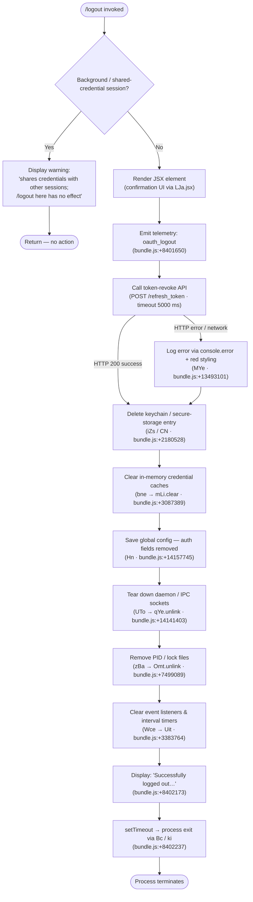

# `/logout`

> Analysis basis: CC v2.1.197 bundle.js (AST extraction + Claude interpretation)
> Minimum version: v2.1.197

---

## Overview

The `/logout` command signs the user out of their Anthropic account by revoking the active OAuth token, clearing all stored credentials and session data, and then terminating the CLI process. It is a `local-jsx` command whose handler (`dQp`) renders a JSX confirmation element before performing the multi-step teardown sequence.

---

## Registration

| Field | Value |
|---|---|
| type | `local-jsx` |
| name | `logout` |
| description | Sign out from your Anthropic account |
| loc_byte | `12010130` |
| loc_byte_end | `12010414` |
| loc_line | `8123` |
| module_id | `NTo` |
| load_inline | `true` |
| arbor_handler.name | `dQp` |
| arbor_handler.fqn | `claude-2.1.197::dQp` |
| arbor_handler.kind | `AsyncFunction` |
| arbor_handler.resolution_path | `module_id` |
| arbor_handler.n_hits | `0` |

Analysis basis: CC v2.1.197 bundle.js:+12010130

---

## Input Branching

The command exhibits three or more distinct execution paths depending on session type, token-revocation success/failure, and background-session detection, so a Mermaid flowchart is used.



---

## Behavioral Spec

### 1. Entry Point — Main Logout Handler (`dQp`)

The Arbor-resolved handler `dQp` (AsyncFunction) is the primary entry point.

```
async function mainLogoutHandler(sessionContext, appState):
    // Background-session guard
    if sessionContext.isBackgroundOrSharedCredentials:
        renderWarning(
            "This background session shares credentials with other sessions; " +
            "/logout here has no effect. Run /logout from your main terminal to sign out."
        )
        return

    // JSX confirmation render
    renderJSXElement(LJa.jsx, confirmationComponent)

    // Delegate to full logout sequence
    await performLogout(sessionContext, appState)
    await shutdownAndExit(appState)
```

Analysis basis: CC v2.1.197 bundle.js:+8401869 (`dQp` → `Hi`, `j6e`, `Eht`)

---

### 2. Session-Type Guard

```
function isBackgroundSession(context):
    // Checks context flags corresponding to literal values
    // "bg", "daemon", "daemon-worker" (bundle.js:+2344153–2344177)
    return context.sessionType in {"bg", "daemon", "daemon-worker"}
```

When true, the string literal `"This background session shares credentials…"` (bundle.js:+8401979) is surfaced and the handler returns early.

Analysis basis: CC v2.1.197 bundle.js:+8401979

---

### 3. OAuth Token Revocation (`IN` / token-revoke API call)

```
async function revokeOAuthToken(credentials):
    payload = { grant_type: "refresh_token", token: credentials.refreshToken }
    headers = { "Content-Type": "application/json" }
    try:
        response = await httpClient.post(
            buildAuthEndpoint() + "/refresh_token",
            payload,
            { headers, timeout: 5000 }           // 5000 ms (bundle.js:+2166317)
        )
        emitTelemetry("oauth_token_revoke")       // bundle.js:+2166327
        return response
    catch networkError:
        categorizeError(networkError)             // classifies as "network" (bundle.js:+2166451)
        logError(networkError)
```

The token revocation endpoint is determined by `buildAuthEndpoint` (`Us`), which resolves against known OAuth base URLs including `prod`, `staging`, `local`, and `CLAUDE_CODE_CUSTOM_OAUTH_URL` (validated against approved endpoints; throws if not approved — bundle.js:+866403).

Analysis basis: CC v2.1.197 bundle.js:+2166159 (`IN` → `fo.post`)

---

### 4. Credential Store Deletion (`iZs` / `CN`)

```
async function deleteStoredCredentials():
    // Compute keychain key: SHA-256 of normalized service identifier,
    // truncated to 8 hex chars (bundle.js:+2179785, :+2179831)
    key = sha256(normalize("claude-code-user", "NFC")).slice(0, 8)

    // Attempt secure keychain removal
    try:
        await keychainDelete(key)
    catch err:
        logError("Failed to delete keychain entry")   // bundle.js:+2180724
```

The `CN` function also verifies OS user identity via `TAn.userInfo` (bundle.js:+2179933) before performing the deletion.

Analysis basis: CC v2.1.197 bundle.js:+2180528

---

### 5. In-Memory Cache and Config Teardown

```
function clearSessionState(appState):
    // Clear in-memory credential maps
    credentialCache.clear()          // bne → mLi.clear (bundle.js:+3087389)

    // Save global config with auth fields stripped
    saveGlobalConfig(appState)       // Hn (bundle.js:+14157745)
    // Guard: refuses to write if re-read config is missing auth
    // that the cache still holds (GH #3117 safety net, bundle.js:+14157946)

    // Unlink daemon IPC socket
    unlinkDaemonSocket()             // UTo → qYe.unlink (bundle.js:+14141403)

    // Remove PID / lock files
    removePidFiles()                 // zBa → Omt.unlink (bundle.js:+7499089)

    // Detach process listeners; clear timers
    teardownListeners()              // Wce → Uit (bundle.js:+3383764)
    clearInterval(heartbeatTimer)    // oYr → clearInterval (bundle.js:+3384635)
    process.removeListener(...)      // oYr (bundle.js:+3384670)

    // Clear secondary caches
    for each cache in [t0e, ikn, T$t, X7r, wV]:
        cache.clear()                // Uit (bundle.js:+3384017–3384065)
```

Analysis basis: CC v2.1.197 bundle.js:+8401823 (`T8t` subtree)

---

### 6. Success Display and Process Exit (`Bc` / `ki`)

```
async function displayAndExit():
    displayMessage(
        "Successfully logged out from your Anthropic account."  // bundle.js:+8402173
    )
    await setTimeout(delay)          // brief pause before exit (bundle.js:+8402237)
    await gracefulShutdown()         // Bc → ki

    // ki performs:
    //   1. drain stdout via AQe (bundle.js:+7438998)
    //   2. unmount Ink UI components (e8e → e.unmount, bundle.js:+7435874)
    //   3. restore terminal state (ANSI ESC-7/ESC-8, bundle.js:+3934358–3934369)
    //   4. wait up to 3500 ms for pending writes (bundle.js:+7438909)
    //   5. race: graceful exit vs. AbortSignal timeout (bundle.js:+7439210)
    //   6. process.exit(0)  or SIGKILL fallback (bundle.js:+7436461, :+7436486)
```

Analysis basis: CC v2.1.197 bundle.js:+8402237 (`dQp` → `setTimeout` → `Bc`)

---

### 7. Error Path — CLI Error with Exit (`vs`)

```
function handleCriticalError(err):
    printError(red(formatError(err)))   // MYe → console.error + It.red (bundle.js:+13493101)
    writeExitCodeFile("cli_error")      // dI → Pae.writeFileSync (bundle.js:+201872)
    process.exit(1)                     // bundle.js:+13493169
```

This path is reached when an unrecoverable failure occurs during credential deletion or config persistence.

Analysis basis: CC v2.1.197 bundle.js:+13493146 (`vs` → `MYe`, `dI`, `process.exit`)

---

## State & Side Effects

| Item | Detail |
|---|---|
| Telemetry — `tengu_feature_ok` | Emitted on successful credential storage operation (bundle.js:+1028779) |
| Telemetry — `tengu_feature_sad` | Emitted on partial credential storage failure (bundle.js:+1028927) |
| Telemetry — `tengu_feature_bad` | Emitted on credential storage hard failure (bundle.js:+1028846) |
| Telemetry — `tengu_config_lock_contention` | Emitted when config lock acquisition is slow (bundle.js:+14161180) |
| Telemetry — `tengu_config_stale_write` | Emitted when a stale config write is detected (bundle.js:+14161316) |
| Telemetry — `tengu_config_parse_error` | Emitted on config JSON parse failure (bundle.js:+14164913) |
| Telemetry — `tengu_config_auto_repaired` | Emitted when config is auto-repaired from cache (bundle.js:+14161693) |
| Telemetry — `tengu_config_auth_loss_prevented` | Emitted when write is refused to prevent auth data loss (bundle.js:+14162023) |
| Telemetry — `tengu_config_fallback_write` | Emitted on fallback config write path (bundle.js:+14160796) |
| Telemetry — `tengu_scroll_summary` | Emitted during terminal shutdown scroll accounting (bundle.js:+7438318) |
| Telemetry — `tengu_cache_eviction_hint` | Emitted on UI cache eviction during shutdown (bundle.js:+7439284) |
| Literal: `oauth_logout` | Telemetry/log tag emitted at start of logout (bundle.js:+8401650) |
| Literal: `oauth_token_revoke` | Telemetry tag for the revoke API call (bundle.js:+2166327) |
| OAuth token revocation | HTTP POST to resolved auth endpoint; 5000 ms timeout (bundle.js:+2166317) |
| Keychain / secure storage | Credential entry deleted; falls back to error log on failure (bundle.js:+2180724) |
| In-memory caches cleared | `mLi`, `t0e`, `ikn`, `T$t`, `X7r`, `wV` all `.clear()`-ed |
| Global config (`~/.claude.json`) | Auth fields stripped and saved atomically with lock; GH #3117 safety guards active |
| Daemon IPC socket unlinked | `qYe.unlink` (bundle.js:+14141403) |
| PID / lock files unlinked | `Omt.unlink` (bundle.js:+7499089) |
| Process event listeners removed | `process.off`, `process.removeListener` via `Uit` |
| Terminal state restored | ANSI save/restore sequences ESC-7 / ESC-8 (bundle.js:+3934358–3934369) |
| Process exit | `process.exit(0)` after graceful drain; SIGKILL fallback if needed (bundle.js:+7436486) |
| Exit code file | Written with `"cli_error"` on unrecoverable error path (bundle.js:+201872) |
| Background session guard | No-op with in-band warning if session type is `"bg"`, `"daemon"`, or `"daemon-worker"` |

---

## Version History

| Version | Change |
|---|---|
| v2.1.197 | Initial analysis |

---

## Common Mistakes

1. **Running `/logout` inside a background or daemon session** — The command detects session types `"bg"`, `"daemon"`, and `"daemon-worker"` and refuses to act, displaying a warning instead. Only run `/logout` from the main interactive terminal.
2. **Expecting the process to stay alive after logout** — The command unconditionally calls `process.exit` after a short delay. Any pending work in the same process will be lost; there is no way to remain logged-out but keep the session running.
3. **Assuming a network error aborts the logout** — Token revocation failure is logged but does not halt the logout sequence. Local credential deletion and config cleanup proceed regardless of whether the server-side revoke API call succeeds.
4. **Ignoring the 5-second revoke timeout** — The HTTP revocation POST times out at 5000 ms (bundle.js:+2166317). In high-latency environments the server may not receive the revoke request before the client proceeds with local cleanup.
5. **Setting `CLAUDE_CODE_CUSTOM_OAUTH_URL` to an unapproved endpoint** — The URL is validated at runtime; an unapproved value throws an error (`"CLAUDE_CODE_CUSTOM_OAUTH_URL is not an approved endpoint."`, bundle.js:+866403), which will surface before revocation is attempted.
6. **Relying on config file integrity without understanding the safety guards** — The config save step (GH #3117 guards) will refuse to write if the re-read file is missing auth data that the in-memory cache has, and emits `tengu_config_auth_loss_prevented`. This is a protective no-op, not a crash.

---

## Appendix — Identifier Mapping

> For bundle debugging only. Identifiers change across versions.

| Identifier | Role |
|---|---|
| `dQp` | Main logout handler (AsyncFunction, Arbor-resolved) |
| `Eht` | Full logout sequence orchestrator (token revoke + teardown) |
| `pQp` | Logout UI / progress renderer |
| `vs` | CLI error handler (error print + exit-code file + process.exit) |
| `MYe` | Error formatter (console.error + red styling) |
| `dI` | Exit-code file writer (Pae.writeFileSync) |
| `Hi` | Session-type / background-session detector |
| `BLe` | Background-session classification helper |
| `T8t` | State-teardown coordinator |
| `z4n` | Teardown sub-step (unknown specifics at depth-2) |
| `EV` | Teardown sub-step (unknown specifics at depth-2) |
| `bne` | Credential cache clearer (mLi.clear) |
| `Wxe` | Teardown sub-step (unknown specifics at depth-2) |
| `Wce` | Event-listener and timer teardown |
| `P6` | Config-state helper |
| `D6` | Config-state helper |
| `Uit` | Full listener + cache teardown (process.off, timer clear, map clears) |
| `oYr` | Interval and process-listener remover |
| `ke` | Error logging / event queue helper |
| `er` | Error constructor wrapper |
| `ct` | String coercion utility |
| `zi` | Traffic-priority queue helper (`"essential-traffic"`) |
| `LNu` | Queue shift/push manager (Yfn) |
| `zBa` | PID / lock-file removal coordinator |
| `XBa` | PID file path resolver |
| `p8e` | Pipe/socket helper (Rws) |
| `lHe` | Path join utility |
| `sgn` | Lock-file path builder |
| `UTo` | Daemon IPC socket unlinker |
| `XVo` | Daemon socket teardown (clearTimeout) |
| `ZVo` | Daemon socket sub-helper |
| `uye` | Daemon socket condition checker |
| `a0e` | Socket path builder (WFi.join) |
| `Hr` | Session/gateway type resolver (gateway, bedrock, foundry, etc.) |
| `km` | Gateway type constant map |
| `Ml` | Config reader wrapper |
| `lci` | Config read/write/delete multi-backend dispatcher |
| `t9e` | Async storage read helper |
| `y_d` | Async local-storage context accessor |
| `xe` | Storage write path A |
| `V` | Storage write implementation |
| `Oe` | Storage write implementation B |
| `wt` | Storage write path B |
| `Re` | Storage write path C |
| `IN` | OAuth token-revoke HTTP caller |
| `Us` | OAuth base-URL resolver |
| `CHs` | Auth endpoint constant |
| `wSu` | Auth URL builder helper |
| `T` | HTTP/logging utility (error classification, file writing) |
| `deu` | Debug log helper |
| `Sis` | Hex/color codec utility |
| `Me` | JSON.stringify wrapper |
| `Pc` | Log-line formatter (redacts tokens) |
| `scs` | Log-level map builder |
| `KQe` | File logger |
| `zls` | Log file write helper |
| `geu` | Structured logger / appender |
| `SQe` | Batched write scheduler |
| `Che` | Log rotation helper |
| `qt` | File-existence / mkdir utility |
| `Rae` | Directory creator |
| `lcs` | Log file path builder |
| `lTr` | Atomic file rename helper |
| `meu` | Buffered file appender |
| `vi` | Signal handler registrar (yis.register) |
| `Gee` | Unknown teardown helper (depth-2 limit) |
| `lKr` | Session-persistence / snapshot coordinator |
| `vLi` | Session snapshot writer |
| `iZs` | Keychain/secure-storage credential manager |
| `CN` | Credential-key builder (SHA-256 + NFC normalize) |
| `ow` | Keychain low-level accessor |
| `KP` | OS user-info verifier (TAn.userInfo) |
| `he` | String utility |
| `Hn` | Global config save orchestrator |
| `rtn` | Config atomic write with lock and backup |
| `nci` | Config store context builder |
| `rn` | Error re-throw / propagator |
| `lIt` | Config file read + backup manager |
| `cIt` | Config lock helper |
| `hqo` | Backup directory path builder |
| `mRt` | Atomic file-write-and-flush (temp → rename) |
| `zUe` | Config cache helper |
| `pqo` | Config entries enumerator |
| `ttn` | Timestamp helper (Date.now) |
| `etn` | Config read-then-write helper |
| `vdr` | Config fallback write path |
| `kTn` | Session snapshot sub-helper |
| `o` | Output formatter (padEnd display) |
| `ihe` | Unknown sub-step (depth-2 limit) |
| `LFe` | Unknown teardown helper (depth-2 limit) |
| `j6e` | UI frame / context initializer |
| `BA` | JSX base component |
| `Xc` | Event emitter / SSE dispatcher |
| `W6e` | OpenTelemetry metrics attribute builder |
| `w6` | Session-ID generator (randomBytes) |
| `Rt` | Rendering primitive |
| `DOn` | Metrics dimension object builder |
| `TBt` | Attribute coercion helper |
| `DP` | Attribute allow-list checker |
| `Nc` | Metrics emitter |
| `dZd` | JWT / base64url decoder |
| `gXi` | Metrics field mapper |
| `BFe` | SSE field serializer |
| `nSr` | SSE event type encoder |
| `Pge` | JSON response builder |
| `rSr` | SSE end-of-stream marker |
| `Bc` | Graceful shutdown runner |
| `ki` | Core shutdown sequencer (drain, unmount, exit) |
| `e8e` | Ink UI unmounter |
| `JN` | Terminal finalizer |
| `dDn` | Terminal restore (ANSI ESC-7/ESC-8) |
| `U_o` | Terminal line writer with dim styling |
| `UL` | Terminal output stream |
| `y5` | Output helper |
| `ZGt` | State-file path resolver |
| `Vg` | Terminal column measurer |
| `bli` | Backslash / quote escaper |
| `$_o` | Force-kill sequencer (SIGKILL fallback) |
| `AQe` | Stdout drain awaiter (yis.drain) |
| `d` | Supervisor / daemon stop-start coordinator |
| `TYe` | File-change watcher teardown |
| `Cic` | Tool-output width calculator |
| `E` | SDK connection manager (stop/start) |
| `A` | Agent runner (stop/updateConfig/start) |
| `eKc` | Heartbeat controller |
| `qFa` | MCP server graceful shutdown |
| `S2a` | Secondary server graceful shutdown |
| `ixt` | Startup profiler |
| `bTr` | Profiler span recorder |
| `Tcs` | Profiler report serializer |
| `l5n` | Scroll-summary tracker |
| `c2a` | Scroll-summary sub-helper |
| `l2a` | Scroll metrics aggregator |
| `$s` | Fullscreen / terminal-mode detector |
| `fwt` | Unknown exit helper (depth-2 limit) |
| `qe` | React context accessor |
| `$Xe` | React context base |
| `br` | Non-conforming terminal handler |
| `Ig` | Non-conforming context accessor |
| `n8e` | Pending-render awaiter |
| `o5n` | Render-complete resolver |

---

Note: index built via Arbor fallback; some signals (telemetry, literals) may be missing — see arbor-fallback.js.