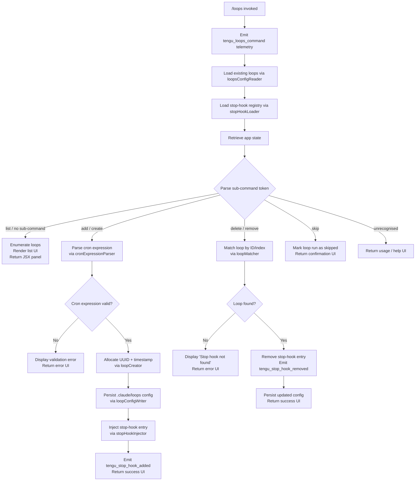

# `/loops`

> Analysis basis: CC v2.1.197 bundle.js (AST extraction + Claude interpretation)
> Minimum version: v2.1.197

---

## Overview

The `/loops` command provides a management interface for Claude Code's scheduled execution loops (also called "cron loops"). It allows users to list existing loops, create new loops with a scheduled cron expression and associated stop-hook, and delete loops that are no longer needed. The command renders a JSX UI panel and interacts with the daemon's scheduled-task infrastructure to persist and activate loop configurations.

---

## Registration

| Field | Value |
|---|---|
| type | `local-jsx` |
| name | `loops` |
| description | `List, create, and delete loops` |
| loc_byte | `12913844` |
| loc_byte_end | `12914001` |
| loc_line | `8904` |
| immediate | `true` |
| module_id | `RQl` |
| load_inline | `true` |
| arbor_handler.name | `W7f` |
| arbor_handler.fqn | `claude-2.1.197::W7f` |
| arbor_handler.kind | `AsyncFunction` |
| arbor_handler.resolution_path | `module_id` |
| arbor_handler.n_hits | `0` |

Analysis basis: CC v2.1.197 bundle.js:+12913844

---

## Input Branching

The handler inspects the sub-command token and the parsed cron/schedule arguments, resulting in five distinct code paths. A Mermaid flowchart is used.



---

## Behavioral Spec

### 1. Entry Point — Main Handler (`loopsCommandHandler`)

```
async function loopsCommandHandler(context):
    emit telemetry("tengu_loops_command")          // bundle.js:+12912811
    existingLoops = await loopsConfigReader(context)
    stopHooks    = await stopHookLoader(context)
    appState     = context.getAppState()           // bundle.js:+12912861
    subCommand   = parseSubCommandToken(context.input)

    if subCommand == "list" or subCommand is absent:
        return renderLoopListUI(existingLoops, appState)

    if subCommand == "add" or subCommand == "create":
        return handleLoopCreation(context, existingLoops, appState)

    if subCommand == "delete" or subCommand == "remove":
        return handleLoopDeletion(context, existingLoops, stopHooks, appState)

    if subCommand == "skip":
        return handleLoopSkip(context, existingLoops, appState)

    return renderUsageUI()
```

Analysis basis: CC v2.1.197 bundle.js:+12912809

---

### 2. Configuration Reader (`loopsConfigReader`)

Reads the persisted loop definitions from the project's `.claude` directory.

```
async function loopsConfigReader(context):
    configPath = pathJoin(projectRoot, ".claude")  // bundle.js:+5106681
    rawBytes   = await fs.readFile(configPath, "utf-8")  // bundle.js:+5105512
    parsed     = JSON.parse(rawBytes)
    if not Array.isArray(parsed):                  // bundle.js:+5105656
        return []
    return parsed
```

File-system errors are mapped through the standard error classifier that recognises `ENOENT`, `EACCES`, `EPERM`, `ENOTDIR`, `ELOOP`, `ENAMETOOLONG`, `EROFS` codes (bundle.js:+185094–185183). An `ENOENT` result is treated as an empty loops list rather than a hard failure.

Analysis basis: CC v2.1.197 bundle.js:+5105501

---

### 3. Cron Expression Parser (`cronExpressionParser`)

Parses a human-readable or numeric cron string into a structured schedule descriptor.

```
function cronExpressionParser(raw):
    trimmed = raw.trim()                           // bundle.js:+5103284

    // Named aliases
    if trimmed matches "Every minute":             // bundle.js:+5103404
        return { type:"cron", expr:"* * * * *" }
    if trimmed matches "Every hour":               // bundle.js:+5103621
        return { type:"cron", expr:"0 * * * *" }

    // Numeric range patterns  e.g. "1-5"         // bundle.js:+5104328
    rangeMatch = trimmed.match(rangePattern)
    if rangeMatch:
        start = parseInt(rangeMatch[1])            // bundle.js:+5103460
        end   = parseInt(rangeMatch[2])
        return buildRangeSchedule(start, end)

    // Full cron field set (5 or 6 fields)
    fields = trimmed.split(" ")
    // Validate field limits:
    //   minutes  0-59  (bundle.js:+12912576)
    //   hours    0-23  (bundle.js:+12912647)
    //   dom      0-31  (bundle.js:+12912700)
    //   max step 60    (bundle.js:+12912542)
    validated = validateCronFields(fields, {
        maxMinute: 59, maxHour: 23, maxDom: 31, maxStep: 60
    })
    return validated
```

Mathematical rounding helpers `Math.max`, `Math.ceil`, `Math.round` are used during field normalisation (bundle.js:+12912519–12912603).

Analysis basis: CC v2.1.197 bundle.js:+12912397

---

### 4. Loop Creator (`loopCreator`)

Allocates a new loop record, persists it, and registers the accompanying stop-hook.

```
async function loopCreator(schedule, promptText, context):
    id        = crypto.randomUUID()                // bundle.js:+5106840
    createdAt = Date.now()                         // bundle.js:+5106902

    record = {
        id:        id,
        schedule:  schedule,       // type: "cron"  // bundle.js:+12912907
        prompt:    promptText,     // type: "prompt" // bundle.js:+11007700
        createdAt: createdAt,
        stophook:  "stophook"      // marker key     // bundle.js:+12912993
    }

    await loopConfigWriter(record, context)        // bundle.js:+5107100
    await stopHookInjector(record, context)        // bundle.js:+12913459
    emit "Stop hook set"                           // bundle.js:+12913571
    return record
```

Analysis basis: CC v2.1.197 bundle.js:+5106840

---

### 5. Loop Config Writer (`loopConfigWriter`)

Persists a new or updated loop entry to the `.claude` directory.

```
async function loopConfigWriter(record, context):
    dir  = pathJoin(projectRoot, ".claude")        // bundle.js:+5106670
    await fs.mkdir(dir, { recursive: true })       // bundle.js:+5106660
    path = pathJoin(dir, record.id + ".json")
    data = JSON.stringify(record)                  // bundle.js:+5106778
    await fs.writeFile(path, data)                 // bundle.js:+5106757
    return path
```

Analysis basis: CC v2.1.197 bundle.js:+5106649

---

### 6. Stop-Hook Injector (`stopHookInjector`)

Adds a new stop-hook entry tied to the loop and commits it to app state.

```
async function stopHookInjector(loopRecord, context):
    appState = context.getAppState()
    newHook  = {
        id:   generateUUID(),                      // bundle.js:+11008738
        kind: "goal",                              // bundle.js:+11008678
        goal: loopRecord.prompt,
        meta: { type: "attachment" }               // bundle.js:+11008720
    }
    context.applyMessageOp({
        op:      "append",                         // bundle.js:+11008610
        content: newHook
    })
    context.setAppState(updatedState)              // bundle.js:+11008518
    emit telemetry("tengu_stop_hook_added")        // bundle.js:+11008272
```

Analysis basis: CC v2.1.197 bundle.js:+11008257

---

### 7. Loop Deletion Handler (`loopDeletionHandler`)

Removes a loop and its associated stop-hook.

```
async function loopDeletionHandler(identifier, existingLoops, context):
    target = existingLoops.find(matchesIdentifier(identifier))

    if target is null:
        display "Stop hook not found"              // bundle.js:+12913253
        return errorUI()

    removeStopHookEntry(target, context)
    emit telemetry("tengu_stop_hook_removed")      // bundle.js:+11008644
    display "Stop hook cleared"                    // bundle.js:+12913275
    persistUpdatedLoopConfig(existingLoops without target, context)
    return successUI()
```

Analysis basis: CC v2.1.197 bundle.js:+12913235

---

### 8. Schedule Display Helper (`scheduleFormatter`)

Formats loop metadata for the list view. It constructs padded columns (pad width 40 characters — bundle.js:+18067388) using two-space separators (bundle.js:+18065407) and maps schedule records into display rows.

```
function scheduleFormatter(loops):
    rows = loops.map(loop =>
        loop.id.padEnd(40) + "  " + loop.schedule.expr
    )
    return rows.join("\n")
```

Analysis basis: CC v2.1.197 bundle.js:+18065386

---

### 9. Goal-Status Sync (`goalStatusSync`)

After a loop run completes the handler updates the `goal_status` field in app state.

```
async function goalStatusSync(loopId, outcome, context):
    appState = context.getAppState()
    updated  = { ...appState, goal_status: outcome }   // bundle.js:+11008807
    context.setAppState(updated)
    context.applyMessageOp({ op: "append", content: {
        kind: "goal_status",
        loopId: loopId,
        outcome: outcome
    }})
```

Analysis basis: CC v2.1.197 bundle.js:+11008587

---

## State & Side Effects

| Item | Detail |
|---|---|
| Telemetry — primary | `tengu_loops_command` (bundle.js:+12912811) — fired on every invocation |
| Telemetry — stop hook added | `tengu_stop_hook_added` (bundle.js:+11008272) |
| Telemetry — stop hook removed | `tengu_stop_hook_removed` (bundle.js:+11008644) |
| Telemetry — daemon background | `tengu_daemon_yield`, `tengu_bg_retire_pinned_low_mem`, `tengu_bg_prewarm_per_sweep`, `tengu_bg_dispatch_sigkill_escalate`, `tengu_bg_dispatch_low_mem`, `tengu_bg_spare_enable`, `tengu_bg_spare_claim`, `tengu_bg_spare_claim_fail` (reachable via scheduler sweep in call graph) |
| Telemetry — feature gates | `tengu_feature_ok` (bundle.js:+1028779), `tengu_feature_bad` (bundle.js:+1028846), `tengu_feature_sad` (bundle.js:+1028927) |
| Telemetry — daemon control | `tengu_daemon_control` (bundle.js:+18076516) |
| Hook registration | Creates or deletes entries in the stop-hook registry; persists via `context.applyMessageOp` with op `"append"` |
| File system | Reads and writes JSON files under `<projectRoot>/.claude/` (bundle.js:+5106681); creates the directory if absent (`MUn.mkdir` recursive) |
| appState changes | `setAppState` called after loop creation, deletion, and goal-status updates (bundle.js:+11008518, 11008173) |
| UUID generation | Uses `crypto.randomUUID` for both loop IDs and hook IDs (bundle.js:+5106840, 11008738) |
| Scheduled task daemon | Interacts with the daemon's `ScheduledTasks` subsystem; triggers `[ScheduledTasks] released scheduler lock` log message (bundle.js:+17038415) |
| Sound | <!-- TODO: not found in depth-2 traversal; needs --depth 4 --> |

---

## Version History

| Version | Change |
|---|---|
| v2.1.197 | Initial analysis |

---

## Common Mistakes

1. **Omitting the cron expression** — Invoking `/loops add` without a valid cron string causes the parser to fail validation; the command returns an error UI rather than creating a loop. Supply a recognisable pattern such as `"Every minute"`, `"Every hour"`, or a five-field cron string.
2. **Deleting a loop by wrong identifier** — If the identifier supplied to `/loops delete` does not match any stored loop ID, the command displays `"Stop hook not found"` and makes no changes. List loops first with `/loops` (or `/loops list`) to confirm the exact ID.
3. **Missing `.claude` directory permissions** — The config writer requires write access to `<projectRoot>/.claude/`. `EACCES`, `EPERM`, or `EROFS` errors will surface as hard failures because those error codes are not silenced the way `ENOENT` is.
4. **Confusing the "skip" sub-command** — The `skip` token marks a scheduled run as skipped; it does not delete the loop. Users expecting deletion should use `delete` (or `remove`), not `skip` (bundle.js:+12913710).
5. **Assuming synchronous persistence** — The handler is an `AsyncFunction` (`arbor_handler.kind: "AsyncFunction"`). Callers that do not await the returned promise may observe a race between the UI render and the file-system write.

---

## Appendix — Identifier Mapping

> For bundle debugging only. Identifiers change across versions.

| Identifier | Role |
|---|---|
| `W7f` | Main async handler for `/loops` command (`loopsCommandHandler`) |
| `V` | Utility: generic value wrapper / result constructor |
| `hde` | Loops configuration loader (reads persisted loop list) |
| `vut` | Core config file reader (reads UTF-8 JSON from disk) |
| `qt` | Path resolution helper |
| `GEe` | Config path builder (joins `.claude` directory paths) |
| `bl` | Base directory resolver |
| `zo` | Error code classifier for filesystem errors |
| `rn` | Known filesystem error code registry |
| `ke` | Structured error logger / error handler |
| `er` | Error constructor wrapper |
| `ct` | String coercion utility |
| `zi` | Essential-traffic queue checker |
| `LNu` | Queue shift/push manager |
| `T` | Message/content formatter |
| `deu` | Debug-level message builder |
| `Me` | JSON serialiser wrapper |
| `Pc` | Path sanitiser / redactor |
| `KQe` | String classification helper |
| `geu` | File content loader with byte-length tracking |
| `fU` | Schedule text parser (entry) |
| `jcp` | Cron field tokeniser (splits, matches, parses integers) |
| `n` | Lowercase normaliser / token accumulator |
| `s` | Async operation set with cleanup (add/delete/finally) |
| `r` | Stream/data emitter |
| `i` | Close-pair finaliser (closes reader + writer) |
| `kC` | Stop-hook registry loader |
| `H0` | Core state accessor |
| `hSt` | Stop-hook list builder / formatter |
| `FOe` | Padded column map builder |
| `o` | Column map / output accumulator |
| `Cfl` | Entry mapper for display rows |
| `Rt` | UI renderer / result emitter |
| `xO` | Cron expression parser and validator |
| `f` | Unicode normaliser for cron strings |
| `L8` | Platform-aware string normaliser |
| `m` | Scheduled-task manager / filter wrapper |
| `e_r` | String prefix stripper and replacer |
| `R` | Scheduled-task runner / watcher (sets intervals, watches files) |
| `AXo` | Scheduled-task executor (writes, unlinks, triggers runs) |
| `grn` | Scheduled-task cleanup / lock release |
| `D` | Daemon write dispatcher |
| `O` | Background worker sweep / watchdog tick handler |
| `I` | Input event handler (keyboard / scroll) |
| `h` | Background worker spawn / retirement manager |
| `p` | Forced-shutdown / process-exit handler |
| `rI` | Shutdown reason recorder |
| `u` | Daemon stop / abort controller |
| `xe` | Feature-gate OK path handler |
| `Re` | Feature-gate bad path handler |
| `$F` | Daemon control event dispatcher |
| `Wj` | Graceful shutdown promise racer |
| `l` | Daemon status reader |
| `doc` | Daemon status file accessor |
| `ene` | Async context store entry creator |
| `Ks` | Async-local storage getter |
| `_Zt` | Daemon status path builder |
| `g` | UTC date calculator for schedule alignment |
| `gde` | Loop list builder (filters, deduplicates, and writes loops) |
| `c7` | Deduplication set checker |
| `i9t` | Loop config directory writer (mkdir + writeFile) |
| `_St` | Stop-hook removal handler |
| `lRl` | UUID generator wrapper |
| `qe` | UI component emitter |
| `$Xe` | Base JSX component |
| `G7f` | Cron-expression field validator (Math.max/ceil/round) |
| `wut` | Loop creation orchestrator (UUID + timestamp + persist + hook) |
| `lhe` | Loop helper / metadata builder |
| `a` | HTTP response / JSON response builder |
| `Pge` | Spend / billing response handler |
| `HSt` | Stop-hook addition handler (full flow) |
| `f1o` | Hook gate checker (hooks_gate / trust_gate) |
| `Z3` | Policy settings resolver |
| `fn` | Settings node navigator |
| `Qce` | Policy entry accessor |
| `vr` | Policy validation result |
| `dd` | Path safety checker |
| `Pdm` | Path traversal validator (blocks `..`) |
| `wt` | Feature-sad path handler |
| `Oe` | Feature-sad event emitter |
| `Jy` | Output-token accumulator |

---

Note: index built via Arbor fallback; some signals (telemetry, literals) may be missing — see arbor-fallback.js.