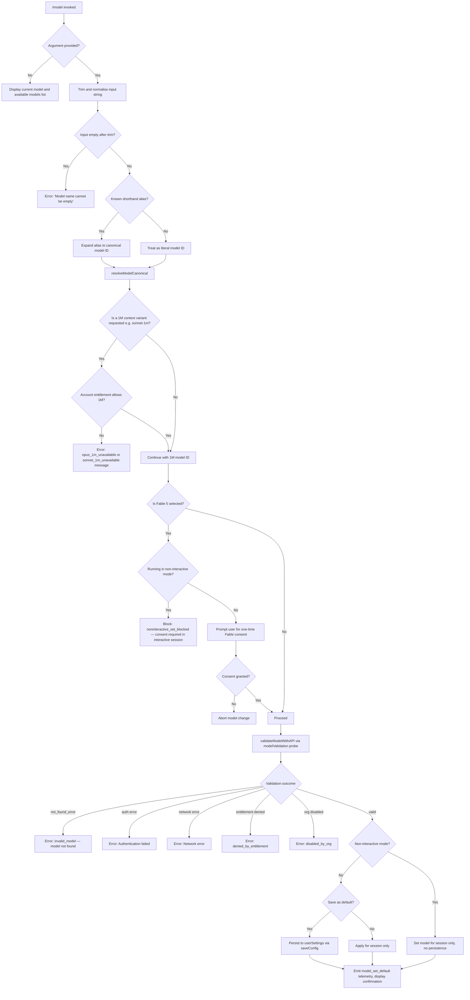

# `/model`

> Analysis basis: CC v2.1.197 bundle.js (AST extraction + Claude interpretation)
> Minimum version: v2.1.197

---

## Overview

The `/model` command lets users view or change the active AI model used by Claude Code. When invoked with no argument it displays the current model; when invoked with a model name (shorthand alias or full model ID), it validates the selection against available models and entitlement rules, then applies the change for the current session and optionally persists it as the user's default.

---

## Registration

| Field | Value |
|---|---|
| type | `local` |
| name | `model` |
| description | Set the AI model for Claude Code |
| argumentHint | `<model>` |
| supportsNonInteractive | `true` |
| module_id | `vnc` |
| load_inline | `true` |
| loc_byte | `13117762` |
| loc_byte_end | `13117936` |
| loc_line | `9040` |
| arbor_handler.name | `$Xf` |
| arbor_handler.fqn | `claude-2.1.197::$Xf` |
| arbor_handler.kind | `AsyncFunction` |
| arbor_handler.resolution_path | `module_id` |
| arbor_handler.n_hits | `0` |

Analysis basis: CC v2.1.197 bundle.js:+13117762

---

## Input Branching

The command has more than three distinct input paths, so a Mermaid flowchart is used.



Analysis basis: CC v2.1.197 bundle.js:+13083331

---

## Behavioral Spec

### Main Handler — `handleModelCommand`

The handler is the async function resolved by Arbor as `$Xf` via the `module_id` path (`vnc`).

```
async function handleModelCommand(input, appContext):
    rawArg = input.trim()                         // +13083331
    // Check if this is an inline invocation (typed mid-session)
    if isInlineInvocation(appContext):             // lle.includes check +13083347
        emit telemetry "tengu_model_command_inline" // +13083481
    
    appState = appContext.getAppState()            // +13083370
    
    if rawArg is empty:
        return displayModelList(appState)          // lrr → QD path +13083414
    
    // Expand short aliases → canonical IDs
    canonicalId = resolveAlias(rawArg)             // +13083414
    
    // Fable 5 consent gate
    if isFable5(canonicalId):                      // +13083617 SZ path
        if appContext.isNonInteractive:
            emit telemetry "noninteractive_set_blocked"  // +13083661
            return error("Fable 5 uses usage credits…") // +13083710
        consentOk = await promptFableConsent(appState)  // wt path +13083636
        if not consentOk: return abort
    
    // API model validation
    validationResult = await validateModelViaAPI(canonicalId, appState) // rKt → GU path +13083562
    
    switch validationResult.status:
        case "invalid_model":     return error("invalid_model") // +11592925
        case "validate_exception": return error("validate_exception") // +11593022
        case "denied_by_entitlement": return error denied      // +11591570
        case "disabled_by_org":   return error disabled        // +11592379
        case "ok":                break
    
    // Persist or session-only
    saveAsDefault = await askSaveDefault(appContext)
    if saveAsDefault:
        persistToUserSettings(canonicalId, appState)           // arr → zJt path +13083861
        emit telemetry "model_set_default"                     // +11593637
        display(bold(canonicalId) + " and saved as your default for new sessions") // +11593279
    else:
        applySessionModel(canonicalId, appState)
        display(bold(canonicalId) + " for this session only")  // +11593325
    
    // Fast mode annotation
    if isFastModeModel(canonicalId):               // ig → fast_mode check +11593380
        display(" · Fast mode ON")                 // +11593443
        display(" · Draws from usage credits")     // +11593494
    else if wasFastMode(previousModel):
        display(" · Fast mode OFF")                // +11593540
```

Analysis basis: CC v2.1.197 bundle.js:+13083331

---

### Alias Resolution — `resolveAlias`

Short aliases map to canonical model IDs. The mapping is constructed at runtime inside `$o` (model-normalization helper).

```
function resolveAlias(input):
    normalized = input.trim().toLowerCase()        // +2324782, +2324793
    
    // Shorthand aliases (literals found in bundle)
    alias_map = {
        "sonnet":    → latest claude-sonnet series,
        "haiku":     → latest claude-haiku series,  // +2325008
        "opus":      → latest claude-opus series,   // +2325047
        "best":      → highest-capability model,    // +2325085
        "fable":     → "claude-fable-5",            // +2324859 / +2321834
        "opusplan":  → "Opus in plan mode, else Sonnet", // +2323763, +2323780
        "sonnet[1m]":     → sonnet with 1M context, // +11594764
        "sonnet-4-6[1m]": → sonnet-4-6 with 1M,    // +11594790
        "sonnet-5[1m]":   → sonnet-5 with 1M,      // +11594820
        "[1m]" suffix → 1M context variant          // +2324910
    }
    
    if normalized in alias_map:
        return alias_map[normalized]
    
    // Prefix check: if starts with "claude-" treat as literal
    if normalized.startsWith("claude-"):            // +2314657
        return normalized
    
    return normalized  // pass through for API validation
```

Analysis basis: CC v2.1.197 bundle.js:+2324782

---

### Available Model Catalogue — `buildModelList`

The full known model list is encoded as string literals in the bundle (inside `c_` — model-list builder, `+2321640`).

| Canonical Model ID | Notes |
|---|---|
| `claude-fable-5` | Requires one-time consent; usage-credits model |
| `claude-mythos-5` | Preview model |
| `claude-opus-4-8` through `claude-opus-4-0` | Opus 4 family |
| `claude-sonnet-5` | Latest Sonnet 5 |
| `claude-sonnet-4-6` through `claude-sonnet-4-0` | Sonnet 4 family |
| `claude-haiku-4-5` | Haiku 4 |
| `claude-3-7-sonnet` | Claude 3.7 |
| `claude-3-5-sonnet` | Claude 3.5 Sonnet |
| `claude-3-5-haiku` | Claude 3.5 Haiku |
| `claude-3-opus` | Claude 3 Opus |
| `claude-3-sonnet` | Claude 3 Sonnet |
| `claude-3-haiku` | Claude 3 Haiku |

Analysis basis: CC v2.1.197 bundle.js:+2321834 through +2322892

---

### API Model Validation — `validateModelWithAPI`

When a model string is supplied, CC performs a lightweight probe API call to confirm the model is reachable and the account is entitled.

```
async function validateModelWithAPI(modelId, appState):
    // rKt function — normalise and probe
    normalised = modelId.toLowerCase()             // +9255414
    
    if normalised in knownSafeSet (BLo):           // +9255535
        return cached result                       // BLo.has check
    
    result = await runModelProbe(modelId, appState) // GU path +9255580
    
    BLo.set(modelId, result)                       // +9255743 cache result
    
    return categoriseProbeResult(result, modelId)  // Jlf → Xlf +9255784
```

Error codes produced (`Xlf`):

| Status Code | Meaning | loc_byte |
|---|---|---|
| `invalid_model` | API returned `not_found_error` | +9256223 |
| `validate_exception` | Unexpected exception during probe | +11593022 |
| `denied_by_entitlement` | Account lacks entitlement for model | +11591570 |
| `disabled_by_org` | Organisation policy disables model | +11592379 |
| `fable_unavailable` | Fable 5 probe failed | +11592630 |
| `fable_probe_failed` | Network/server error for Fable probe | +11592650 |
| `opus_1m_unavailable` | Opus 1M context not available | +11591898 |
| `sonnet_1m_unavailable` | Sonnet 1M context not available | +11592115 |

The probe uses the bootstrap model-discovery flow (`SPe → mQp → GU`) which hits the API with the configured auth headers, including `anthropic-version: 2023-06-01` (literal at +8407297).

Analysis basis: CC v2.1.197 bundle.js:+9255229

---

### 1M Context Entitlement Check — `check1MEntitlement`

```
function check1MEntitlement(modelId, accountInfo):
    if modelId contains "[1m]" suffix or "1m" variant:
        if accountTier is not "pro":               // pro literal +3116738
            if isOpusVariant:
                return error("Opus with 1M context is not available…") // +11591936
            if isSonnetVariant:
                return error("Sonnet with 1M context is not available…") // +11592155
    return ok
```

Both error messages include the URL `https://code.claude.com/docs/en/model-config#extended-context-with-1m`.

Analysis basis: CC v2.1.197 bundle.js:+11591898 / +11592115

---

### Display — `showModelList`

When no argument is supplied, the command calls the model-list renderer (`lrr → QD → eOt`).

```
function showModelList(appState):
    currentModel = appState.model
    models = buildModelList()                      // ZPt path
    
    for each model in models:
        prefix = (model.id == currentModel) ? bold("● ") : "  "
        suffix = model.is1M ? " (1M context)" : ""  // +2324457
        display(prefix + model.displayName + suffix)
    
    if managedSettings active:
        display("Managed settings")               // +11594455
```

Analysis basis: CC v2.1.197 bundle.js:+11594455

---

### Fable Consent Gate — `checkFableConsent`

```
async function checkFableConsent(appState):
    // SZ → V9t → Rlo path
    existingConsent = appState.getFableConsentFlag()
    if existingConsent already granted: return true
    
    // Interactive: display consent prompt
    consentGiven = await showConsentDialog()       // Rlo → QEe path +5292778
    if consentGiven:
        persistConsentFlag(appState)
        return true
    return false
```

Fable 5 is described as using usage credits (`" · Draws from usage credits"` at +11593494).

Analysis basis: CC v2.1.197 bundle.js:+13083617

---

## State & Side Effects

| Item | Detail |
|---|---|
| Telemetry | `tengu_model_command_inline` (+13083481) — fired when model is set inline during a session |
| Telemetry | `tengu_feature_bad` (+1028846), `tengu_feature_sad` (+1028927), `tengu_feature_ok` (+1028779) — generic feature outcome events from the API call path |
| Telemetry | `tengu_api_success` (+8710965) — fired on successful API probe |
| Telemetry | `tengu_client_data_cache_key` (+8406250) — bootstrap cache key event |
| Telemetry | `tengu_config_lock_contention` (+14161180) — if config lock is slow |
| Telemetry | `tengu_config_stale_write` (+14161316), `tengu_config_auto_repaired` (+14161693), `tengu_config_auth_loss_prevented` (+14162023), `tengu_config_fallback_write` (+14160796) — config persistence safety events |
| Telemetry | `tengu_saffron_credits_only_tiers` (+5291315) — Fable/credits-only tier check |
| Telemetry | `tengu_prompt_cache_1h_config` (+13906280) — cache control event in API call stack |
| appState changes | `appState.model` updated to the new canonical model ID |
| Persistence | When "save as default" is chosen, `userSettings.model` is written to disk via `saveConfig` with file-lock protection |
| Persistence | `BLo` (Map) caches per-model validation results to avoid redundant API probes within a session |
| Fable consent | One-time consent flag persisted in user settings when Fable 5 is accepted |
| Hook registration | None observed in depth-2 traversal |
| Sound | None observed |

---

## Version History

| Version | Change |
|---|---|
| v2.1.197 | Initial analysis |

---

## Common Mistakes

1. **Passing an alias that requires 1M entitlement without a Pro account** — e.g. `/model sonnet[1m]` will fail with `sonnet_1m_unavailable` if the account tier is not `pro`. Use `/model sonnet` instead.
2. **Using `/model` with a full model ID that has a typo** — the API probe returns `not_found_error`, which surfaces as `invalid_model`. Double-check spelling against the catalogue above.
3. **Running `/model fable` in a non-interactive script** — Fable 5 requires an interactive consent prompt; in non-interactive mode the command exits with `noninteractive_set_blocked`.
4. **Expecting the change to persist across sessions without confirming "save as default"** — without confirmation the change is session-scoped only and reverts on the next invocation of Claude Code.
5. **Providing an empty argument** — `/model ` (trailing space only) is rejected immediately with "Model name cannot be empty" (+9255266) before any API call is made.
6. **Assuming Mythos models are generally available** — `claude-mythos-5` and `claude-mythos-preview` appear in the catalogue but are subject to entitlement checks (`$$o` path +11594732); they may be unavailable for standard accounts.

---

## Appendix — Identifier Mapping

> For bundle debugging only. Identifiers change across versions.

| Identifier | Role |
|---|---|
| `$Xf` | Main handler — `handleModelCommand` (AsyncFunction, entry point) |
| `lrr` | Display-model-list dispatcher |
| `QD` | Model list builder / formatter coordinator |
| `eOt` | Model entry renderer |
| `wp` | Individual model display row builder |
| `$o` | Model normalisation and alias resolver |
| `VC` | Model catalogue / validation data structure builder |
| `FEr` | Model registry helper |
| `f6` | Model entry factory |
| `LFe` | Model list filter helper |
| `ili` | Model availability status checker |
| `G9r` | Model metadata builder |
| `ZPt` | Full model-list renderer (interactive display) |
| `QPt` | Current model / selection state handler |
| `Dd` | SHA-256 hash utility (model ID deduplication) |
| `Ig` | Hash helper |
| `KJt` | Model-set orchestrator (validation + persistence) |
| `Kte` | Model canonical-name resolver |
| `Ca` | String canonicaliser / normaliser |
| `x0` | Model tier / capability checker |
| `oo` | Model info lookup |
| `Crt` | Provider enum resolver |
| `c_` | Model list constructor (full catalogue) |
| `qwt` | Model display name formatter |
| `Wu` | String replace helper (display formatting) |
| `Z8` | Model persistence handler |
| `Hr` | Message/error formatter |
| `km` | Colour/style helper |
| `ct` | String coercion utility |
| `dHd` | Model add-to-set helper |
| `uHd` | Model dedup helper |
| `qPt` | Config-write wrapper |
| `Dt` | Disk write helper |
| `Re` | Feature flag reader |
| `Oe` | Environment-flag reader |
| `Fa` | Settings loader (reads all settings layers) |
| `bMt` | Settings merge — base models |
| `pxs` | Settings filter |
| `dxs` | Settings accumulator |
| `TMt` | Settings merge — top-level keys |
| `hwe` | Remote managed settings reader |
| `I3` | Settings object schema builder |
| `Ale` | Settings alias resolver |
| `EMt` | Settings effective-value calculator |
| `Fss` | Settings finaliser |
| `hF` | Supported-provider check |
| `jbn` | Model-for-provider resolver |
| `VPt` | Provider-specific model normaliser |
| `rli` | Settings entries iterator |
| `fn` | Flag-settings reader |
| `Ggn` | Flag-settings file loader |
| `nli` | Model string indexOf helper |
| `pHd` | Model prefix helper |
| `P9r` | Model indexOf helper |
| `fHd` | Model string start-check helper |
| `tli` | Model startsWith helper |
| `U$o` | 1M-context entitlement checker |
| `Jre` | Account usage-limit reason reader |
| `JHe` | Message builder |
| `Ao` | Ink/UI component helper |
| `Nua` | Account limit descriptor |
| `dT` | Model display name with suffix builder |
| `QHe` | Tier label helper |
| `Mi` | Tier metadata |
| `$$o` | Extended-context (1M) variant checker |
| `Ew` | Model with 1M display builder |
| `VP` | Capability flag reader |
| `l_` | Provider header builder |
| `Su` | Prompt-token counter |
| `rPd` | Model cache checker |
| `Sde` | Sonnet 1M entitlement checker |
| `qHe` | Model availability / entitlement gate |
| `zHe` | Structured-output capability checker |
| `Yle` | Model-disabled state checker |
| `KHe` | Disabled reason includes-checker |
| `CY` | 1M suffix display builder |
| `zbn` | Model disabled-or-absent handler |
| `not` | Negative inclusion checker |
| `tot` | Total-disable checker |
| `$9r` | Capability presence checker |
| `rKt` | API model validation entry (`validateModelWithAPI`) |
| `GU` | API probe executor (bootstrap fetch) |
| `cf` | Request config builder |
| `hV` | HTTP client / fetch wrapper |
| `h` | Background daemon session manager |
| `L4e` | Claude-3-legacy model checker |
| `Xle` | Structured-output cache reader |
| `_` | Model accumulator list |
| `Utf` | Model find helper |
| `aCo` | Cache key hash builder |
| `nTn` | Cache-control header builder |
| `Ukn` | Retry/rate-limit handler |
| `PVe` | Thread/session context resolver |
| `XP` | Temperature config builder |
| `L` | Away-summary / session state watcher |
| `Etl` | Extra API parameter builder |
| `lLn` | Model-feature flag loader |
| `yw` | API parameter mapper |
| `JRe` | Response message builder |
| `dln` | Conversation history pop helper |
| `vP` | State deep-clone helper |
| `YQe` | History state pop helper |
| `qe` | Environment constant accessor |
| `$4r` | Request retry helper |
| `U4r` | Cache set helper |
| `UCe` | Usage counter helper |
| `br` | Nonconforming-model logger |
| `Mo` | Constant resolver |
| `SBt` | Subagent config builder |
| `p2` | Subagent ZP wrapper |
| `gwt` | Gateway feature flag |
| `Jlf` | Probe result categoriser |
| `Xlf` | Probe error-code classifier |
| `jUl` | Model lowercase normaliser |
| `SPe` | Bootstrap model-discovery runner |
| `$To` | Gateway model list fetcher |
| `DP` | OPu permission checker |
| `Ts` | API scope descriptor |
| `mQp` | Bootstrap fetch implementation |
| `T` | Message/result type builder |
| `hQp` | Bootstrap response parser |
| `zi` | Queue helper |
| `kJa` | Bootstrap request key |
| `Cqr` | Header parser |
| `wt` | Feature flag state reader |
| `mw` | TH wrapper |
| `ub` | Auth credential builder |
| `qLe` | WIF token exchange |
| `got` | WIF credentials resolver |
| `Us` | OAuth URL validator |
| `gw` | Array/capability include checker |
| `HR` | HTTP error handler |
| `xe` | Feature OK/SAD/BAD emitter |
| `xJa` | Bootstrap skip-key checker |
| `gkn` | Cache hash builder |
| `Hn` | Config write-with-lock |
| `rtn` | Config file save with backup rotation |
| `zUe` | Config stale-write guard |
| `pqo` | Config entries iterator |
| `ttn` | Config timestamp helper |
| `etn` | Config write-time helper |
| `cIt` | Config integrity checker |
| `vdr` | Config fallback writer |
| `LFi` | Config transform (fromEntries) |
| `wFi` | Config entry transformer |
| `EV` | Config EV helper |
| `bne` | Cache-clear helper |
| `k_` | Config key helper |
| `ke` | Telemetry error logger |
| `er` | Error formatter |
| `LNu` | Telemetry queue manager |
| `he` | String coercer |
| `SZ` | Fable consent gate dispatcher |
| `ab` | Consent check helper |
| `eV` | Consent flag reader |
| `V9t` | Consent UI runner |
| `bde` | Consent dialog builder |
| `dfp` | Consent enterprise check |
| `ufp` | Consent credit-tier check |
| `Rlo` | Consent screen renderer |
| `j9t` | Consent screen component |
| `VRe` | Consent WPt wrapper |
| `y2` | Consent Ao wrapper |
| `QEe` | Consent Ade/WEr wrapper |
| `arr` | Model-set confirmation display builder |
| `Tae` | Confirmation text helper |
| `zJt` | `model_set_default` telemetry emitter |
| `no` | Settings save (full stack) |
| `Lg` | Settings Hwe/I3 helper |
| `qt` | File path helper |
| `LDr` | Settings file loader |
| `nw` | Settings Ste wrapper |
| `Sn` | Settings rn helper |
| `OMr` | Settings timestamp setter |
| `VBe` | Settings VBe/I3 helper |
| `mRt` | Atomic file writer |
| `Me` | JSON.stringify wrapper |
| `n_` | Cache clear (_in / tEr) |
| `zvs` | Async file operations helper |
| `Q5` | Path join helper |
| `dr` | H0 helper |
| `O8` | Settings yin helper |
| `uc` | Display message formatter |
| `OLe` | Output line helper |
| `ig` | Fast-mode model checker |
| `gF` | VP capability reader |
| `ENe` | Model confirmation line builder |
| `SH` | $o/VC dispatch wrapper |
| `mh` | JHe message helper |
| `N$o` | Full confirmation display builder |
| `xte` | Settings iT/fn helper |
| `iT` | NFe tracking set helper |
| `Kle` | Model display row with O9r |
| `O9r` | Dt wrapper |
| `Qte` | Confirmation text selector |
| `m6` | x0/wp/$o display helper |