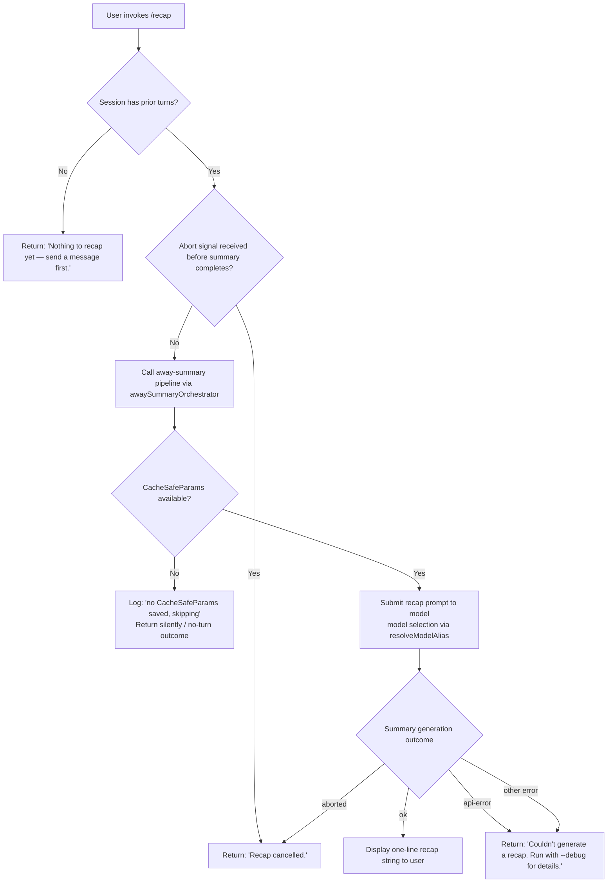

# `/recap`

> Analysis basis: CC v2.1.196 bundle.js (AST extraction + Claude interpretation)
> Minimum version: v2.1.196

---

## Overview

The `/recap` command triggers an on-demand, single-line summary of the current session's activity. It invokes the same "away summary" pipeline that Claude Code uses for automatic background recaps, but does so immediately and synchronously from user intent rather than on a timer or idle trigger. The generated recap is a single sentence describing what the session has accomplished so far.

---

## Registration

| Field | Value |
|---|---|
| type | `local` |
| name | `recap` |
| description | `Generate a one-line session recap now` |
| loc_byte | `13376918` |
| loc_byte_end | `13377103` |
| loc_line | `9183` |
| supportsNonInteractive | `false` |
| load_inline | `true` |
| load_ident | `_nm` |
| arbor_handler.name | `_nm` |
| arbor_handler.fqn | `claude-2.1.196::_nm` |
| arbor_handler.kind | `AsyncFunction` |
| arbor_handler.resolution_path | `load_ident` |
| arbor_handler.n_hits | `0` |

Analysis basis: CC v2.1.196 bundle.js:+13376918

The handler was inlined as `load: () => Promise.resolve({ call: _nm })`. Arbor resolved it via the `load_ident` path, confirming `_nm` as the authoritative handler entry point.

---

## Input Branching

The command exhibits 4+ distinct outcome paths based on session state and the result of the away-summary pipeline, so a Mermaid flowchart is used.



Analysis basis: CC v2.1.196 bundle.js:+13376668 (empty-session message), +13376760 (cancellation message), +13376818 (error message), +7273718 (no-CacheSafeParams log), +7273776 (no-turn outcome), +7274386 (ok outcome), +7274236 (aborted outcome), +7274325 (api-error outcome).

---

## Behavioral Spec

### Top-Level Handler: `recapCommandHandler` (`_nm`)

The handler is an `AsyncFunction` loaded inline via `Promise.resolve({ call: _nm })`.

```
async function recapCommandHandler(context):
    // Guard: require at least one prior turn
    if session has no prior messages:
        return userMessage("Nothing to recap yet — send a message first.")

    // Register abort listener
    abortController = context.abortController
    abortController.addEventListener("abort", onAbort)

    // Delegate to the away-summary orchestrator
    result = await awaySummaryOrchestrator(context)

    switch result.status:
        case "ok":
            display result.text to user
        case "aborted":
            return userMessage("Recap cancelled.")
        case "no-turn":
            // Silent exit — no CacheSafeParams were available
            return
        case "api-error":
        case "other":
            return userMessage("Couldn't generate a recap. Run with --debug for details.")
```

Analysis basis: CC v2.1.196 bundle.js:+13376526 (`_nm` → `hGt` call edge), +13376668, +13376760, +13376818

---

### Away-Summary Orchestrator: `awaySummaryOrchestrator` (`hGt`)

This function is the shared engine used by both the background away-summary feature and the `/recap` command. When invoked from `/recap` the "no-turn" fast-exit path is the critical guard.

```
async function awaySummaryOrchestrator(context):
    // Check whether a prior API call's CacheSafeParams were stored
    cacheSafeParams = loadCacheSafeParams(context)
    if cacheSafeParams is null:
        log("[awaySummary] no CacheSafeParams saved, skipping")
        return { status: "no-turn" }

    // Attach abort propagation
    context.addEventListener("abort", ...)
    if abortSignal.aborted:
        abortInner()

    // Build the recap prompt via promptBuilder
    promptText = buildRecapPrompt(context)

    // Send to model
    summaryResult = await invokeQueryEngine(promptText, context)

    // Classify outcome
    toolUseAttempted = summaryResult.toolCallsPresent
    if toolUseAttempted:
        // Away summary must not use tools — classified as "deny"
        log("Away summary cannot use tools")
        return { status: "other" }

    switch summaryResult.finalOutcome:
        case "ok":      return { status: "ok", text: summaryResult.text }
        case "aborted": return { status: "aborted" }
        case "api-error": return { status: "api-error" }
        default:        return { status: "other" }
```

Analysis basis: CC v2.1.196 bundle.js:+7273697 (`hGt` → `Qde`), +7273716 (`hGt` → `T`), +7273813 (addEventListener), +7273844 (abort), +7273891 (`Ix`), +7274009 ("deny"), +7274024 ("Away summary cannot use tools"), +7274077 ("other"), +7274092 ("away\_summary"), +7274253 (r.find), +7274342 (`DUa`/flatMap)

---

### Model Resolution: `resolveModelAlias` (`Qde` → `Ts` → `jo`)

Before the prompt is sent, the model alias is resolved from a set of named tiers.

```
function resolveModelAlias(modelAlias, context):
    normalized = modelAlias.trim().toLowerCase()
    switch normalized:
        case "fable":      return fableModel
        case "opusplan":   return opusPlanModel
        case "[1m]":       return oneMillionContextModel
        case "sonnet":     return sonnetModel
        case "haiku":      return haikuModel
        case "opus":       return opusModel
        case "best":       return bestAvailableModel
        default:
            // Apply EH normalization, prefix substitution, suffix lookup
            result = applyNormalizationPipeline(normalized)
            return result
```

Analysis basis: CC v2.1.196 bundle.js:+2323826 ("fable"), +2323877 ("[1m]"), +2323893 ("opusplan"), +2323935 ("sonnet"), +2323975 ("haiku"), +2324014 ("opus"), +2324052 ("best"), +2323749 (trim), +2323760 (toLowerCase)

---

### Query Engine Entry: `invokeQueryEngine` (`Ix`)

This is the main agent query function (shared with the broader REPL loop). When invoked from `/recap`, it runs a restricted single-turn summary call.

```
async function invokeQueryEngine(prompt, context):
    startTime = Date.now()

    // Determine thread type: "main" for /recap
    threadType = resolveThreadType(context)   // literal "main"

    // Build agent request via buildAgentRequest (tRf)
    agentRequest = await buildAgentRequest(prompt, context)

    // Execute single streaming call
    streamResult = await streamingCall(agentRequest)

    // Collect and return result
    return collectStreamResult(streamResult)
```

Analysis basis: CC v2.1.196 bundle.js:+11142942 (Date.now), +11143309 ("main"), +11143396 (`T`/promptBuilder), +11143466 (e.at), +11143527 (`YU`), +11143891 (`Ix` → `mtr`), +11143914 (`nll`)

---

### Session-Log Writer: `sessionLogWriter` (`oeu`)

Called transitively during the recap pipeline to append the generated summary line to the on-disk session log file.

```
async function sessionLogWriter(text, sessionDir):
    logDir = path.dirname(sessionDir)
    logPath = buildLogPath(logDir)          // ncs: join + Rt
    existingSize = Buffer.byteLength(text)

    // Rotate if the log file exceeds the size threshold
    if logFileNeedsRotation(logPath):       // sTr: stat, endsWith ".txt", rename, unlink
        rotateLogFile(logPath)

    // Append the new recap line
    await fs.mkdir(logDir, { recursive: true })
    await fs.appendFile(logPath, text)

    // Register cleanup via hook system
    registerCleanupHook()                   // vi: fis.register
```

Analysis basis: CC v2.1.196 bundle.js:+215843 (`SQe`), +215868 (`bhe`), +215876 (dirname), +215906 (`q1`), +215528 (join), +215542 (`Rt`), +215168 (stat), +215261 (endsWith), +215272 (".txt"), +215324 (rename), +215364 (unlink), +215597 (mkdir), +215656 (appendFile), +68542 (fis.register)

---

### Teammate Mailbox Read: `teammateMailboxMarkRead` (`lqe`)

Called transitively during the recap turn to mark any pending teammate messages as read before the summary is produced.

```
async function teammateMailboxMarkRead(mailbox, context):
    log("[TeammateMailbox] markMessagesAsRead: acquiring lock...")
    lock = await acquireLock(mailbox)
    log("[TeammateMailbox] markMessagesAsRead: lock acquired")

    messages = mailbox.getUnread()
    if messages is empty:
        log("[TeammateMailbox] markMessagesAsRead: no messages to mark")
        releaseLock(lock)
        return

    // Mark each message read
    for msg in messages:
        if not alreadySeen(msg):
            markRead(msg)

    log("[TeammateMailbox] markMessagesAsRead: lock released")
    releaseLock(lock)
```

Analysis basis: CC v2.1.196 bundle.js:+8949792, +8949891, +8950066, +8950690 (log strings), +8949666 (`iqe`), +8949675 (`T`), +8949859 (`AH`), +8949958 (`QAe`)

---

## State & Side Effects

| Item | Detail |
|---|---|
| Telemetry — auto-compact rapid refill breaker | `tengu_auto_compact_rapid_refill_breaker` (bundle.js:+11083056) |
| Telemetry — auto-compact succeeded | `tengu_auto_compact_succeeded` (bundle.js:+11083576) |
| Telemetry — PTL surfaced to user | `tengu_ptl_surfaced_to_user` (bundle.js:+11088506) |
| Telemetry — refusal fallback suppressed | `tengu_refusal_fallback_suppressed` (bundle.js:+11089757) |
| Telemetry — rotunda pennant applied | `tengu_rotunda_pennant_applied` (bundle.js:+11091981) |
| Telemetry — rotunda pennant tools | `tengu_rotunda_pennant_tools` (bundle.js:+11093108) |
| Telemetry — refusal fallback dialog suppressed | `tengu_refusal_fallback_dialog_suppressed` (bundle.js:+11096408) |
| Telemetry — refusal fallback prompt shown | `tengu_refusal_fallback_prompt_shown` (bundle.js:+11096665) |
| Telemetry — refusal fallback prompt choice | `tengu_refusal_fallback_prompt_choice` (bundle.js:+11097000) |
| Telemetry — fallback credit forfeited | `tengu_fallback_credit_forfeited` (bundle.js:+11097119) |
| Telemetry — refusal fallback triggered | `tengu_refusal_fallback_triggered` (bundle.js:+11098379) |
| Telemetry — orphaned messages tombstoned | `tengu_orphaned_messages_tombstoned` (bundle.js:+11099730) |
| Telemetry — refusal fallback supersedes | `tengu_refusal_fallback_supersedes` (bundle.js:+11101218) |
| Telemetry — model fallback triggered | `tengu_model_fallback_triggered` (bundle.js:+11104791) |
| Telemetry — query error | `tengu_query_error` (bundle.js:+11105475) |
| Telemetry — model response keyword detected | `tengu_model_response_keyword_detected` (bundle.js:+11106557) |
| Telemetry — malformed tool use retry outcome | `tengu_malformed_tool_use_retry_outcome` (bundle.js:+11107160) |
| Telemetry — malformed tool use response | `tengu_malformed_tool_use_response` (bundle.js:+11111436) |
| Telemetry — stop hook block count | `tengu_stop_hook_block_count` (bundle.js:+11113520) |
| Telemetry — loop dynamic wakeup ends turn | `tengu_loop_dynamic_wakeup_ends_turn` (bundle.js:+11117315) |
| Telemetry — post autocompact turn | `tengu_post_autocompact_turn` (bundle.js:+11117498) |
| Telemetry — query before attachments | `tengu_query_before_attachments` (bundle.js:+11117616) |
| Telemetry — query after attachments | `tengu_query_after_attachments` (bundle.js:+11119933) |
| Telemetry — MCP tools refreshed mid-turn | `tengu_mcp_tools_refreshed_mid_turn` (bundle.js:+11120238) |
| Telemetry — feature ok | `tengu_feature_ok` (bundle.js:+1028610) |
| Telemetry — feature bad | `tengu_feature_bad` (bundle.js:+1028677) |
| Telemetry — forked agent default turns exceeded | `tengu_forked_agent_default_turns_exceeded` (bundle.js:+11144599) |
| Telemetry — fork agent query | `tengu_fork_agent_query` (bundle.js:+11145042) |
| Hook registration | `fis.register` called from `sessionLogWriter` to register cleanup for the log-append side effect (bundle.js:+68542) |
| appState changes | `e.getAppState` / `e.setAppState` called inside `awaySummaryOrchestrator` → `DYn` to read/update session state before and after the summary (bundle.js:+11139816, +11141038) |
| File I/O | Session log file appended via `fs.appendFile`; log rotation (rename + unlink) may occur if the file exceeds the threshold (bundle.js:+215656, +215324, +215364) |
| Abort propagation | An `"abort"` event listener is registered on the context's AbortController; if fired, the inner request is aborted and the command returns "Recap cancelled." (bundle.js:+7273813, +7273832, +7273844) |
| Tool use blocked | The away-summary pipeline explicitly rejects any model response that attempts a tool call ("Away summary cannot use tools", bundle.js:+7274024) |
| Sound | <!-- TODO: not found in depth-2 traversal; needs --depth 4 --> |

---

## Version History

| Version | Change |
|---|---|
| v2.1.196 | Initial analysis |

---

## Common Mistakes

1. **Running `/recap` before any messages have been sent.** The command guards against an empty session and immediately returns "Nothing to recap yet — send a message first." — no API call is made.
2. **Expecting a multi-sentence summary.** The command is explicitly described as generating a *one-line* recap; the prompt instructs the model to produce a single sentence.
3. **Assuming the command supports non-interactive / headless mode.** `supportsNonInteractive` is `false` (bundle.js:+13376918); invoking `/recap` in a piped or `--print` context will not produce output.
4. **Expecting tool use within the recap.** The pipeline explicitly rejects model responses that include tool calls; if the model attempts one, the outcome is classified as an error.
5. **Confusing `/recap` with the automatic background away-summary.** Both share the same `awaySummaryOrchestrator` (`hGt`) pipeline, but `/recap` is an explicit user-triggered invocation. The background version runs on a timer or idle trigger and does not display the "Recap cancelled." / error messages to the user in the same way.

---

## Appendix — Identifier Mapping

> For bundle debugging only. Identifiers change across versions.

| Identifier | Role |
|---|---|
| `_nm` | `recapCommandHandler` — top-level async handler for `/recap` (load_ident entry point) |
| `hGt` | `awaySummaryOrchestrator` — shared away-summary / recap pipeline orchestrator |
| `Qde` | `resolveModelAliasOuter` — outer model resolution dispatcher |
| `Ts` | `modelAliasResolver` — maps model alias string to concrete model config |
| `d6` | `modelConfigBuilder` — builds model configuration object |
| `jo` | `normalizeModelName` — trims, lowercases, and normalizes raw model alias string |
| `SH` | `modelNameNormalizer` — secondary normalization path calling `jo` and `jC` |
| `T` | `promptBuilder` — assembles the prompt payload for the model call |
| `eeu` | `promptPayloadAssembler` — constructs prompt content array |
| `gis` | `imageChunkBuilder` — builds image content chunks |
| `Me` | `jsonStringifyWrapper` — wraps `JSON.stringify` for safe serialization |
| `Pc` | `redactedTextBuilder` — builds redacted text segments (uses `[REDACTED]` literal) |
| `Zls` | `xzcMapper` — maps over `XZc` array for redaction ranges |
| `KQe` | `streamWriter` — writes output to stream via `Gls` |
| `Gls` | `streamWriterCore` — calls `e.write` directly |
| `oeu` | `sessionLogWriter` — async function writing recap line to on-disk session log |
| `SQe` | `debouncedFlusher` — debounce/flush mechanism using `clearTimeout`/`setTimeout`/`setImmediate` |
| `bhe` | `logFileRotationCheck` — checks and performs log rotation if needed |
| `xae` | `errorCodeHandler` — handles filesystem error codes (e.g. `EISDIR`) |
| `ncs` | `logPathBuilder` — builds log file path via `Ahe.join` + `Rt` |
| `sTr` | `logFileRotator` — stat/rename/unlink sequence for log rotation |
| `reu` | `logFileAppender` — mkdir + appendFile + size check + rotation |
| `vi` | `hookRegistrar` — registers cleanup hook via `fis.register` |
| `Ix` | `invokeQueryEngine` — main agent query function used by `/recap` |
| `DYn` | `agentQueryCore` — core agent query implementation (getAppState, setAppState, UUID generation) |
| `PO` | `spendLimitChecker` — checks spend/billing limits before query |
| `KEe` | `cacheSafeParamsLoader` — loads/dumps CacheSafeParams (H2, t.load, e.dump) |
| `Qke` | `avoidPromptsFilter` — applies `avoid_prompts` filtering |
| `lRa` | `queryPreparationHelper` — query preparation step |
| `dtr` | `dialogTimeoutHandler` — handles bridge dialog timeout |
| `TP` | `randomHexGenerator` — generates random hex string via `gin.randomBytes` |
| `PYn` | `querySetupStarter` — emits `query_setup_start` lifecycle marker |
| `bfe` | `agentContextBuilder` — builds agent execution context |
| `Kc` | `hookContextInitializer` — initializes hook context via `vi` |
| `Pze` | `toolFilterPipeline` — filters tools by source (`ant` prefix, `rur`, `gur`, `gim`) |
| `YU` | `queryLoopRunner` — runs the agent query loop (calls `tRf` and `Her`) |
| `tRf` | `buildAgentRequest` — massive agent request builder (the main query loop body) |
| `Her` | `sessionCleanupHandler` — cleans up KW/OOo/pYt/Sze maps after turn |
| `xe` | `featureOkReporter` — emits `tengu_feature_ok` telemetry |
| `ke` | `featureBadReporter` — emits `tengu_feature_bad` telemetry |
| `BR` | `backgroundRequestMarker` — marks request as background |
| `Rqe` | `lafSetChecker` — checks `Laf` Set membership |
| `Ose` | `oscNotificationSender` — sends OS-level notification |
| `mtr` | `mainThreadMarker` — marks the query as `repl_main_thread` |
| `nll` | `notificationLafChecker` — secondary `Laf` check path |
| `L8` | `windowsPathNormalizer` — normalizes path separators for Windows (`oN.normalize`, `replaceAll`) |
| `mfe` | `mcpToolRefresher` — refreshes MCP tools mid-turn (`_E`, `baf`, `e.filter`, `s.has`) |
| `_E` | `mcpToolListFetcher` — fetches current MCP tool list |
| `baf` | `mcpToolFinder` — finds a specific MCP tool by predicate |
| `V` | `observableCellReader` — reads observable/reactive cell value |
| `hRf` | `forkedAgentQueryRunner` — runs forked/subagent query (emits `tengu_fork_agent_query`) |
| `Oe` | `featureFlagReader` — reads feature flag via `$Xe` |
| `Ar` | `nonconformingModelHandler` — handles `nonconforming` model responses |
| `Mn` | `teammateNotificationSender` — sends teammate notification with random UUID |
| `_` | `notificationDispatcher` — dispatches notifications |
| `y` | `teammateMailboxAccessor` — accessor for teammate mailbox |
| `lqe` | `teammateMailboxMarkRead` — marks teammate mailbox messages as read |
| `DUa` | `flatMapResultCollector` — collects and flattens away-summary results |
| `s` | `pendingSetManager` — manages a Set of pending async operations (add/delete/finally) |
| `f` | `forkContextArray` — array of forked agent contexts |