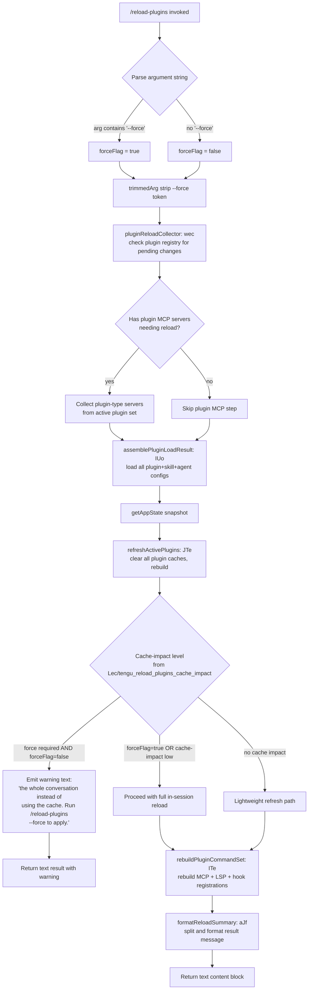

# `/reload-plugins`

> Analysis basis: CC v2.1.197 bundle.js (AST extraction + Claude interpretation)
> Minimum version: v2.1.197

---

## Overview

`/reload-plugins` activates pending plugin changes (plugin MCP servers, skill/agent plugins, and LSP servers) in the currently running Claude Code session without requiring a full restart. When invoked with the optional `--force` flag, it bypasses the prompt-cache guard and performs a full unconditional reload; without `--force`, it warns the user if a force-reload would be required to fully apply changes and proceeds with a best-effort in-session refresh.

---

## Registration

| Field | Value |
|---|---|
| type | `local` |
| name | `reload-plugins` |
| description | `Activate pending plugin changes in the current session` |
| argumentHint | `[--force]` |
| supportsNonInteractive | `false` |
| thinClientDispatch | `control-request` |
| module_id | `xec` |
| load_inline | `true` |
| loc_byte | `13007982` |
| loc_byte_end | `13008226` |
| loc_line | `9019` |
| arbor_handler.name | `iJf` |
| arbor_handler.fqn | `claude-2.1.197::iJf` |
| arbor_handler.kind | `AsyncFunction` |
| arbor_handler.resolution_path | `module_id` |
| arbor_handler.n_hits | `0` |

Analysis basis: CC v2.1.197 bundle.js:+13007982

---

## Input Branching

The handler has three or more distinct paths depending on the `--force` flag, the argument string content, and the cache-impact level detected during reload. A Mermaid flowchart is used.



Analysis basis: CC v2.1.197 bundle.js:+13007066, +13007102, +13007117, +13006731, +13005974

---

## Behavioral Spec

### 1. Argument Parsing

The handler receives the raw argument string, trims whitespace, then checks whether `--force` appears in the input.

```
async function reloadPluginsHandler(context, argString):
    trimmed = argString.trim()
    forceFlag = trimmed includes "--force"
    // Strip --force token for further processing
    cleanedArg = trimmed with "--force" removed
    return reloadPlugins(context, cleanedArg, forceFlag)
```

Analysis basis: CC v2.1.197 bundle.js:+13007066, +13007102, +13007117

### 2. Plugin Registry Scan (`wec` — pluginReloadCollector)

Before performing any reload, the handler consults the in-memory plugin registry to discover which plugin MCP servers, skills, and agents have pending changes. It checks two separate has-sets (active plugin set and pending-change set) to build a work list.

```
function pluginReloadCollector(pluginRegistry, pendingSet):
    if not pluginRegistry.has(currentScope):
        return emptyWorkList
    if not pendingSet.has(currentScope):
        return emptyWorkList
    workList = collectLspManagerEntries(pluginRegistry)  // kO + lX
    workList += collectMcpPluginEntries(pluginRegistry)  // Jy
    return workList
```

Analysis basis: CC v2.1.197 bundle.js:+13005698, +13005748, +13005787, +13005831, +13005837, +13005858

### 3. Plugin Configuration Loading (`Ffo` / `NX` — pluginConfigLoader)

Once the work list is ready, the handler loads all plugin configurations. This includes reading `.mcp.json` project settings, user settings, local settings, enterprise policy settings, and marketplace-resolved plugin manifests. The loader processes plugin types: `"plugin"`, `"skill"`, `"agent"`, and `"plugin MCP server"`.

```
async function pluginConfigLoader(workList, appState):
    mcpConfigs = loadMcpServerConfigs(workList)           // NX + LT path
    pluginManifests = loadInstalledPluginManifests(workList) // R5t path
    marketplaceEntries = resolveMarketplaceEntries(workList) // TUo path
    return mergeConfigs(mcpConfigs, pluginManifests, marketplaceEntries)
```

Notable config-file literals scanned during this phase (Analysis basis: CC v2.1.197 bundle.js:+6772181, +6772249, +6773658):
- `.mcp.json` — project-level MCP config
- `mcpAutoDiscovered` — auto-discovery flag
- Setting scopes: `"projectSettings"`, `"userSettings"`, `"flagSettings"`, `"policySettings"`, `"localSettings"` (bundle.js:+11411721–+11411823)

### 4. Cache-Impact Assessment (`Lec` — cacheImpactAssessor)

After loading configurations, the handler evaluates whether applying the new plugin state would require invalidating the prompt cache (i.e., replaying the whole conversation). This check emits a telemetry event.

```
function cacheImpactAssessor(prevPluginState, nextPluginState):
    impact = computeDiff(prevPluginState, nextPluginState)
    emit telemetry "tengu_reload_plugins_cache_impact" with impact level
    return impact  // levels: none | soft | force-required
```

If `impact == force-required` and `forceFlag == false`, the handler appends a warning message containing the substring `"the whole conversation instead of using the cache. Run /reload-plugins --force to apply."` (bundle.js:+13006565) to the output and returns early with a `"text"` content block.

Analysis basis: CC v2.1.197 bundle.js:+13005972, +13005974, +13007286

### 5. Active Plugin Refresh (`JTe` — refreshActivePlugins)

When proceeding past the cache-impact guard, `refreshActivePlugins` clears all plugin caches and rebuilds the active plugin set.

```
async function refreshActivePlugins(context, pluginConfigs, forceFlag):
    log "refreshActivePlugins: clearing all plugin caches"  // bundle.js:+13003651
    clearInstalledPluginsCache()    // uOl → "Cleared installed plugins cache" (bundle.js:+11342902)
    clearSkillIndexCache()          // eW.clearSkillIndexCache (bundle.js:+13606911)
    clearQYtCache()                 // EG.QYt.clear (bundle.js:+11273840)

    rawPlugins  = await loadPluginRoots(pluginConfigs)       // poe path
    lspConfigs  = await loadLspConfigs(pluginConfigs)        // Tje path
    hookResults = buildHookResults(rawPlugins, lspConfigs)   // c9n path

    newSet  = filterActivePlugins(hookResults)               // oJf + sJf
    emit "plugin_load_all"    event                          // bundle.js:+11431969
    if allFailed(newSet):
        emit "plugin_load_total_failure" event               // bundle.js:+11431987
    elif anyFailed(newSet):
        emit "plugin_load_partial_failures" event            // bundle.js:+11432056

    if originalCwdChangedMidScan():
        log "assemblePluginLoadResult: originalCwd changed mid-scan; skipping side-effects (stale early-kick)"
        return staleResult                                   // bundle.js:+11432122

    emitEventBus("A2")  // A2.emit — notifies subscribers of plugin state change
    return newSet
```

Analysis basis: CC v2.1.197 bundle.js:+13003649, +13003651, +13003703, +13003714, +13004117, +13004328, +13004361, +13004758

### 6. Plugin Command Set Rebuild (`ITe` — rebuildPluginCommandSet)

After `refreshActivePlugins` completes, the handler rebuilds the full in-session command registrations for MCP tools, LSP servers, and plugin hooks.

```
async function rebuildPluginCommandSet(context, newPluginSet, forceFlag):
    // Load per-plugin marketplace records
    for each plugin in newPluginSet:
        marketplaceRecord = loadMarketplace(plugin)          // rm + ej paths
        toolDefs = expandToolDefinitions(marketplaceRecord)  // z6e + fn
        validate toolDefs schema                             // hD, Xo

    // Resolve dependency graph
    dependencyGraph = resolveDependencies(newPluginSet)      // hJt sub-graph
    if dependencyGraph has cycles:
        markError("cycle")
    if dependencyGraph has policy blocks:
        markError("dependency-blocked-by-policy")            // bundle.js:+11371439

    // Reinstall MCP server connections
    for each mcpServer in resolvedMcpServers:
        pluginType = classify(mcpServer)  // "plugin", "skill", "agent", "plugin MCP server"
        connectResult = await connectMcpServer(mcpServer)   // eOa path
        applyConnectionResult(connectResult)                // Shr / Y path

    // Reinstall LSP servers
    for each lspEntry in newPluginSet.lspEntries:
        lspConfig = parseLspConfig(lspEntry)                // gJt path
        installLspServer(lspConfig)

    // Reinstall hooks (safe-mode check)
    if not safeModeActive:
        registerPluginHooks(newPluginSet)                   // sSe path
    else:
        log "Safe mode: skipping plugin hook registration"  // bundle.js:+5416942

    return rebuildSummary
```

Analysis basis: CC v2.1.197 bundle.js:+13007340, +13007412, +13007444, +13007487, +12145414, +11370039, +11365382

### 7. Result Formatting (`aJf` — formatReloadSummary)

The final text result is assembled by splitting the reload summary and formatting it into a `"text"` content block for display.

```
function formatReloadSummary(rebuildSummary):
    lines = rebuildSummary.split("\n")
    // Separator literal: " · " (bundle.js:+13006914)
    formatted = lines.join(" · ")
    return { type: "text", content: formatted }
```

Analysis basis: CC v2.1.197 bundle.js:+13006462, +13007340, +13006914, +13007044

---

## State & Side Effects

| Item | Detail |
|---|---|
| Telemetry | `tengu_reload_plugins_cache_impact` (bundle.js:+13005974) — emitted with cache-impact level on every invocation |
| Telemetry | `tengu_feature_ok` (bundle.js:+1028779) — emitted on successful reload path |
| Telemetry | `tengu_feature_bad` (bundle.js:+1028846) — emitted on fatal reload error |
| Telemetry | `tengu_feature_sad` (bundle.js:+1028927) — emitted on partial/degraded reload |
| Telemetry | `tengu_plugin_state_file_error` (bundle.js:+11343081) — emitted when plugin state file cannot be read (syntax-error, ZodError, validation-error) |
| Plugin cache cleared | `installedPluginsCache`, `skillIndexCache`, `QYt` internal cache — cleared unconditionally on every reload |
| Plugin load events | `plugin_load_all`, `plugin_load_total_failure`, `plugin_load_partial_failures` (bundle.js:+11431969, +11431987, +11432056) |
| Event bus | `A2.emit` notifies all subscribers of new plugin state after successful `refreshActivePlugins` |
| MCP server connections | Existing MCP plugin server connections may be closed and re-established via `eOa` (connectMcpServer) |
| Hook registration | Plugin hooks re-registered unless `--safe-mode` is active (bundle.js:+5416942) |
| appState changes | `getAppState` snapshot taken before reload; new plugin set written back to app state after rebuild |
| Sound | None detected in depth-2 traversal |

---

## Version History

| Version | Change |
|---|---|
| v2.1.197 | Initial analysis |

---

## Common Mistakes

1. **Omitting `--force` when a full cache invalidation is needed.** If plugin changes require replaying the conversation to take effect and `--force` is not passed, the command will emit a warning and return without fully applying the changes. The warning text directs the user to re-run with `--force`.
2. **Running in non-interactive mode.** `supportsNonInteractive` is `false`; invoking `/reload-plugins` in a script or piped session will not execute the reload.
3. **Expecting an instant MCP reconnect.** The command must close and re-establish plugin MCP server connections, which can take a moment, especially for marketplace-sourced plugins that require network resolution.
4. **Running under `--safe-mode`.** When Claude Code is started with `--safe-mode`, hook registration is intentionally skipped during reload. Plugin tools will be refreshed but lifecycle hooks will remain inactive.
5. **Confusion with `thinClientDispatch: "control-request"`.** In thin-client (remote) sessions, the command is dispatched as a control request to the server process, not handled locally; the local CLI does not perform the reload itself.

---

## Appendix — Identifier Mapping

> For bundle debugging only. Identifiers change across versions.

| Identifier | Role |
|---|---|
| `iJf` | Main handler for `/reload-plugins` (AsyncFunction) |
| `WA` | Pre-reload state accessor / initial check helper |
| `td` | Thin-client dispatch helper |
| `$Fe` | Dispatch sub-helper called by `td` |
| `GZ` | Plugin type classifier (distinguishes `"plugin"`, `"skill"`, `"agent"`, `"plugin MCP server"`) |
| `yn` | Plugin-type enum/lookup used by `GZ` |
| `wec` | Plugin reload collector — discovers pending plugin changes |
| `Ffo` | Top-level plugin config loader orchestrator |
| `OCe` | Config loader sub-utility |
| `Wfo` | Plugin work-list dispatcher |
| `IUo` | assemblePluginLoadResult — aggregates plugin load outcomes, emits load telemetry |
| `TUo` | Marketplace plugin resolution engine |
| `NX` | MCP server configuration loader (reads `.mcp.json`, user/project/local/enterprise scopes) |
| `LT` | Project-level MCP config file reader (`.mcp.json` path traversal) |
| `Ode` | MCP server definition validator |
| `XS` | MCP server type checker (http, dynamic, etc.) |
| `JLn` | MCP transport validator |
| `pE` | Plugin install error helper |
| `T` | Logging / telemetry utility |
| `SBn` | Settings-based MCP server builder |
| `Ect` | MCP server status accessor |
| `g` | Generic plugin-set container (Set operations) |
| `f` | Plugin registry set |
| `m` | MCP server set |
| `xx` | Plugin approval/pending state manager |
| `L0a` | Plugin-to-MCP-config mapping cache |
| `w` | Focus/blur state tracker (used for cache-window blurring) |
| `p` | Forced-shutdown handler |
| `kO` | LSP manager plugin entry collector |
| `f9t` | LSP tool-search toggle helper |
| `pao` | `auto:N` concurrency parser for LSP |
| `yup` | LSP auto-mode detection |
| `ct` | Boolean coercion ("yes"/"on"/"no"/"off") |
| `_l` | String coercion utility |
| `Hr` | Backend/provider type classifier (gateway, bedrock, foundry, etc.) |
| `Su` | Provider capability wrapper |
| `Trt` | Provider capability sub-resolver |
| `lX` | LSP server plugin name normalizer (toLowerCase) |
| `Sup` | LSP plugin list resolver |
| `it` | Plugin root hook registrar |
| `Jy` | MCP plugin entry collector (Object.values scan) |
| `Lec` | Cache-impact assessor — emits `tengu_reload_plugins_cache_impact` |
| `V` | Feature-flag / app-state value accessor |
| `aJf` | Reload result formatter (splits and joins summary lines) |
| `JTe` | `refreshActivePlugins` — clears caches, rebuilds plugin set, emits A2 event |
| `uOl` | `installedPluginsCache` invalidator — logs "Cleared installed plugins cache" |
| `vh` | Plugin-system cache group orchestrator |
| `KMf` | Plugin subsystem refresh coordinator |
| `Fw` | Plugin event emitter wrapper |
| `Wco` | Plugin root collection walker |
| `ke` | Error logger with `Ete.logError` |
| `Z0` | Skill-index cache clearer |
| `eW` | clearSkillIndexCache caller |
| `QW` | `inr` (inner-refresh) dispatcher |
| `EG` | `QYt.clear` — clears internal tool-index cache |
| `fil` | Plugin file loader |
| `hUa` | Plugin hook application helper |
| `dr` | Diagnostics / debug reporter |
| `poe` | Plugin root scanner (reads plugin directory entries, `.mcpb`/`.dxt` files) |
| `Mq` | Plugin file extension checker (`.mcpb`, `.dxt`) |
| `vfo` | Plugin manifest file reader (reads `manifest.json`, parses JSON) |
| `Sn` | ENOENT / filesystem error guard |
| `Gt` | JSON.parse wrapper |
| `g0a` | Plugin status aggregator |
| `R5t` | Installed plugin manifest loader (reads `manifest.json`, computes MD5 hash) |
| `Tje` | LSP config file loader (`.lsp.json`) |
| `bDp` | LSP config entry loader with path-traversal validation |
| `ADp` | LSP path resolver and safety checker |
| `doc` | Daemon status file writer (`daemon.status.json`) |
| `ene` | Timestamp/event encoder |
| `Ks` | AsyncLocalStorage store accessor |
| `_Zt` | Daemon status path builder |
| `Me` | JSON.stringify wrapper |
| `c9n` | LSP extension conflict detector (case-insensitive dedup) |
| `Pge` | JSON.stringify sub-utility |
| `oJf` | Active-plugin filter (lsp-manager scope) |
| `sJf` | Active-plugin filter (plugin: prefix scope) |
| `sSe` | Plugin hook registrar (safe-mode aware) |
| `kl` | CLI argument `--` / `--safe-mode` parser |
| `ITe` | Plugin command set rebuilder — rebuilds MCP/LSP/hook registrations |
| `YD` | Plugin marketplace record loader |
| `rm` | `known_marketplaces.json` reader |
| `dnr` | Marketplace file path builder |
| `z6e` | Tool definition expander |
| `fn` | Tool definition factory |
| `Ggn` | Tool schema builder (Mss, LDr, Dss) |
| `I3` | Full tool descriptor constructor |
| `hD` | Error constructor for plugin validation |
| `Xo` | Plugin ID includes/split parser |
| `Sb` | Plugin source-type resolver (git, npm, file, directory, github) |
| `M9n` | Git URL parser |
| `Pft` | Plugin source validator |
| `Q6t` | Source-type factory |
| `tNa` | Directory-type source handler |
| `nNa` | File-type source handler |
| `_Pp` | GitHub/npm/settings source handler |
| `VG` | Plugin source factory |
| `rNa` | Composite plugin source resolver |
| `LRt` | URL scheme checker (http://, https://) |
| `eNa` | Path-based source resolver |
| `ej` | Plugin marketplace.json reader |
| `iJt` | `.claude-plugin/marketplace.json` path builder |
| `sUo` | Plugin config safe-parser (Zod) |
| `NR` | Plugin config loader (reads plugin config, resolves marketplace record) |
| `aUo` | Plugin config reader with fallback |
| `x9f` | Plugin has-check for known set |
| `hJt` | Plugin installation orchestrator (dependency resolution, version checks, MCP connect, LSP install) |
| `Jw` | Plugin scope validator |
| `Anr` | Plugin dependency resolver |
| `WBe` | Local-source path validator (`./` prefix check) |
| `u` | Plugin state Map (xe/Re/$F/Wj accessors) |
| `xe` | Feature-ok state setter |
| `Re` | Feature-bad state setter |
| `$F` | Feature-sad state setter |
| `Wj` | Plugin async race/all runner |
| `Ot` | Async-context store accessor |
| `nmn` | AsyncLocalStorage getStore caller |
| `tM` | Plugin load-from-disk orchestrator |
| `lUo` | Plugin file sync reader |
| `cUo` | Plugin config entry expander |
| `uJt` | Plugin state writer (ld/V/Oe) |
| `y` | Plugin version map (lqe accessor) |
| `lqe` | Teammate mailbox / plugin version store |
| `SO` | Plugin scope classifier |
| `z0` | Plugin scope enum |
| `GOn` | Semver version validator (WJ.valid/coerce/satisfies) |
| `E` | Plugin MCP connection tracker (SDK SSE connections) |
| `$Ct` | SSE connection initializer |
| `er` | Error/String coercion utility |
| `wXi` | Plugin dependency cycle detector |
| `iT` | Plugin allowed-set tracker |
| `H` | Process-kill set for orphaned workers |
| `D` | Daemon write channel |
| `d` | Daemon worker manager |
| `N` | Daemon config reloader |
| `rKc` | Daemon real-path/stat checker |
| `Ed` | Daemon edit dispatcher |
| `W9m` | `_Kn` — daemon internal config key |
| `bOl` | Plugin load-result queue manager |
| `R` | Scheduled task runner (setInterval/clearInterval, file watcher) |
| `AXo` | Scheduled task executor |
| `grn` | Scheduled task cleanup |
| `GEe` | Scheduled task lock-path builder |
| `O` | Background worker supervisor |
| `I` | Input event handler |
| `h` | Background worker lifecycle manager |
| `no` | Plugin installation main entry (reads settings, writes gitignore, emits `Gtt`) |
| `Lg` | Plugin install config builder |
| `LDr` | Plugin install scope resolver |
| `nw` | Plugin install sub-step (`Ste`) |
| `OMr` | Plugin install timestamp recorder |
| `VBe` | Plugin install validation helper |
| `mRt` | Atomic file write helper (fchmod, fsync, rename) |
| `n_` | Cache clear on install (`_in.clear`, `tEr.clear`) |
| `zvs` | Gitignore append helper |
| `Q5` | Settings path builder (`gN.join`) |
| `wt` | Feature-sad state accessor |
| `O8` | Settings load/write dispatcher |
| `bnr` | Plugin path traversal guard (`tj.resolve`, `startsWith`) |
| `j` | Debounced write scheduler (setTimeout/clearTimeout) |
| `ge` | Plugin event queue (gc UUID generator, rse, Ts) |
| `gc` | UUID generator (`x1.randomUUID`) |
| `rse` | Plugin event dispatcher (`DHt`) |
| `Ts` | Plugin event type classifier |
| `Rt` | H0 telemetry base emitter |
| `fe` | Plugin feature-flag map |
| `Le` | Plugin abort controller list |
| `ve` | Plugin abort/retry controller |
| `ye` | OAuth token store accessor |
| `Mts` | OAuth token type classifier (`Cts`) |
| `zHr` | OAuth token refresh helper (`W2m`) |
| `wBt` | Semver range validator (WJ.validRange/minVersion) |
| `kno` | Semver range too-complex checker |
| `ynr` | Plugin respawn checker (`yUo`) |
| `yUo` | Plugin respawn entry (`Bke`) |
| `fJt` | Plugin file-URL converter (`EOl.pathToFileURL`) |
| `Snr` | Plugin npm/git version resolver (`_nr.maxSatisfying`) |
| `PDf` | Plugin version prefix stripper |
| `Pn` | Plugin resolution context builder |
| `oq` | Plugin credential interactive handler (`Pno`) |
| `Enr` | Plugin entry-point replacer |
| `gJt` | Plugin package installer (npm/bun, `jSt.rename`, `IOl.randomBytes`) |
| `VSt` | Plugin install staging validator |
| `fnr` | Plugin compile/build runner (`CRt`) |
| `Kse` | Plugin content hasher (`yOl.createHash`) |
| `c$` | Plugin cache path builder (`vnr`, `JI`) |
| `Hnr` | Plugin install directory scanner (`_Ol.readdir`) |
| `hnr` | Plugin cache entry builder (`R4.join`, `CDf`, `RDf`) |
| `FK` | Plugin file extension coercer (`ct`) |
| `dNe` | Plugin cache dedup entry (`c$`) |
| `onr` | Plugin old-version cleanup (`eM.rm`) |
| `uUo` | Plugin registry update (`tM`, `WSt`) |
| `q` | Plugin allow-list map |
| `z` | Plugin allow-list entry (`Etn`) |
| `Y` | MCP slot manager (`E`, `Shr`, `Sje`, `W`, `K`) |
| `Shr` | MCP connection result applier (`applyMcpUpdate`, `ln`, `xT`, `vy`) |
| `Sje` | MCP state serializer (`zMe`) |
| `W` | MCP pending-update queue |
| `K` | MCP keyboard-event interceptor |
| `Ye` | Process-event bridge (SIGINT handler, QR toggle, status display) |
| `Oe` | UI update emitter (`$Xe`) |
| `oe` | MCP server connection batch runner |
| `A` | OAuth userinfo fetcher |
| `LVt` | MCP session token accessor (`J_`) |
| `uHm` | MCP server capability updater |
| `ae` | MCP elicitation tracker |
| `ue` | MCP tool-list refresh handler (`Se`, `ln`, `xD`) |
| `Se` | MCP tool-set state tracker |
| `ln` | MCP debug logger (`Ete.logMCPDebug`) |
| `qe` | UI queue emitter (`$Xe`) |
| `$r` | MCP async task wrapper (`ar`) |
| `Nn` | MCP notification dispatcher |
| `X5` | MCP Wl handler |
| `ODf` | Plugin MCP server re-connect orchestrator |
| `we` | MCP server slot reconciler (cleanup, reconnect, tool refresh) |
| `ar` | MCP auth token helper (`ht`, `ke`) |
| `Jo` | MCP cleanup wrapper (`$r`) |
| `eOa` | MCP server connect function (uses `u.connect`, `u.getServerCapabilities`, `u.getInstructions`) |
| `Bo` | MCP breadcrumb/context builder |
| `Eo` | Rotunda pennant strip handler |
| `X9` | MCP server name prefix checker (`r.startsWith`) |
| `Jfa` | VS Code review/onboarding plugin handler |
| `I$n` | Plugin `_X` wrapper |
| `gKl` | Plugin knowledge-list serializer (`JSON.stringify`) |
| `g4c` | CCD session plugin handler |
| `Z` | Session file cleanup manager (`eie`, `e3l`) |
| `eie` | Session lstat/rm file handler |
| `e3l` | Session unlink handler |
| `X` | Voice recording session manager |
| `kmr` | Voice recording timestamp pusher |
| `ce` | Voice recording chunk collector |
| `sLc` | Voice RMS calculator (`Math.sqrt`, `Math.min`) |
| `Rr` | Plugin `O8` settings dispatcher |
| `aQe` | Platform/language detector (`Zss.has`, `t.split`) |
| `gcs` | Date/time formatter (`Intl.DateTimeFormat`) |
| `pcr` | Voice WebSocket stream handler |
| `Ae` | MCP elicitation UI handler |
| `pe` | Voice session loop |
| `FYo` | Voice audio capture file manager |
| `ee` | Plugin event-set accessor (`g`) |
| `Y0` | Plugin scope case-insensitive checker (`uwe.has`) |
| `lg` | Plugin log formatter (`ct`) |
| `Xc` | OTEL metrics event emitter |
| `W6e` | OTEL resource attribute builder |
| `BFe` | OTEL event attribute builder |
| `re` | Voice focus-gain handler |
| `$ue` | Plugin dependency-list formatter |

---

Note: index built via Arbor fallback; some signals (telemetry, literals) may be missing — see arbor-fallback.js.