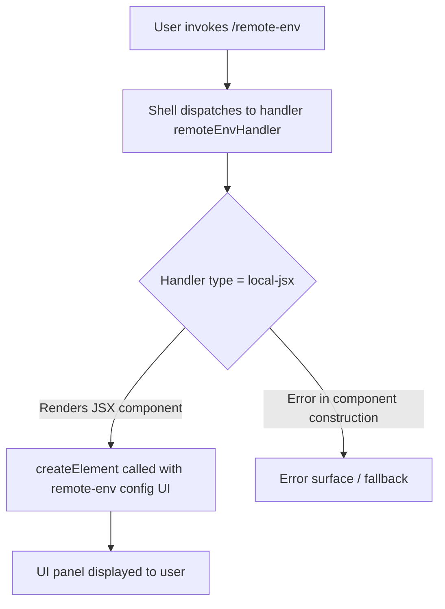

# `/remote-env`

> Analysis basis: CC v2.1.132 bundle.js (AST extraction + Claude interpretation)
> Minimum version: v2.1.132

---

## Overview

The `/remote-env` command provides an interactive UI panel (rendered as a JSX component) that allows the user to configure the default remote environment used by teleport sessions. It is a `local-jsx` type command, meaning its output is a rendered React-compatible component rather than plain text or an agent prompt. The command is registered under module `pOq` and its handler is the async function `RY7`.

---

## Registration

| Field | Value |
|---|---|
| type | `local-jsx` |
| name | `remote-env` |
| description | `Configure the default remote environment for teleport sessions` |
| module_id | `pOq` |
| load_inline | `true` |
| isHidden | `null` (not hidden) |
| handler | `RY7` (AsyncFunction, resolved via `module_id` path) |
| `loc_byte_end` | `11356525` |
| `arbor_handler.name` | `RY7` |
| `arbor_handler.kind` | `AsyncFunction` |
| `arbor_handler.resolution_path` | `module_id` |
| `arbor_handler.fqn` | `claude-2.1.132::RY7` |
| `arbor_handler.n_hits` | `1` |

Analysis basis: CC v2.1.132 bundle.js:+11356255–11356525

---

## Input Branching

Because the depth-2 call graph contains only a single outbound edge from the handler (a call to the JSX element factory), the branching logic visible at this traversal depth is minimal. The command appears to unconditionally render a configuration component.



Analysis basis: CC v2.1.132 bundle.js:+11356139

---

## Behavioral Spec

### Remote Environment Configuration UI Rendering

The handler for `/remote-env` is an `AsyncFunction`. When invoked, it constructs and returns a JSX element representing the remote environment configuration panel. The rendering relies on the JSX element factory (equivalent to `React.createElement` in the runtime context of Claude Code's UI layer).

```
async function remoteEnvHandler(commandInput, context):
    // Construct the remote environment configuration UI component.
    // No branching on commandInput is observable at depth-2 traversal.
    component = createElement(RemoteEnvConfigComponent, props)
    return component
```

Because the command type is `local-jsx`, the Claude Code shell intercepts the return value and mounts the component into the terminal UI rather than sending any text to the agent or appending to conversation history.

Analysis basis: CC v2.1.132 bundle.js:+11356139

### Handler Resolution

The handler `RY7` is reached via the `module_id` resolution path. The registration object carries a `load_inline: true` flag, indicating the module is loaded eagerly rather than deferred behind a dynamic import boundary. The Arbor symbol graph confirmed exactly one hit for this handler identity (`n_hits: 1`), meaning there is no aliasing ambiguity.

Analysis basis: CC v2.1.132 bundle.js:+11356255

---

## State & Side Effects

| Item | Detail |
|---|---|
| Telemetry | None detected at depth-2 traversal (`telemetry: []`) |
| Hook registration | <!-- TODO: not found in depth-2 traversal; needs --depth 4 --> |
| appState changes | <!-- TODO: not found in depth-2 traversal; needs --depth 4 --> |
| Sound | <!-- TODO: not found in depth-2 traversal; needs --depth 4 --> |
| Conversation history | Not modified — `local-jsx` commands render UI panels; no agent message is injected |
| Remote env persistence | <!-- TODO: not found in depth-2 traversal; needs --depth 4 --> |

---

## Version History

| Version | Change |
|---|---|
| v2.1.132 | Initial analysis |

---

## Common Mistakes

1. **Expecting text output**: Because `/remote-env` is type `local-jsx`, it renders an interactive panel rather than printing text. Callers that expect a string response or an agent turn will not receive one.
2. **Assuming prompt-body semantics**: Unlike `prompt`-type commands, `/remote-env` does not send any instruction text to the agent. The configuration is handled entirely through the rendered UI component.
3. **Treating the command as hidden**: `isHidden` is `null` (falsy), so the command appears in the slash-command picker. Do not document or configure it as a hidden command.
4. **Version assumptions on handler identity**: The handler is currently identified as `RY7` (minified). This identifier is bundle-specific and will change across CC versions; do not hard-code it in tooling.

---

## Appendix — Identifier Mapping

> For bundle debugging only. Identifiers change across versions.

| Identifier | Role |
|---|---|
| `RY7` | Async handler function for `/remote-env`; constructs and returns the remote environment configuration JSX component (module `pOq`, resolved via `module_id` path) |